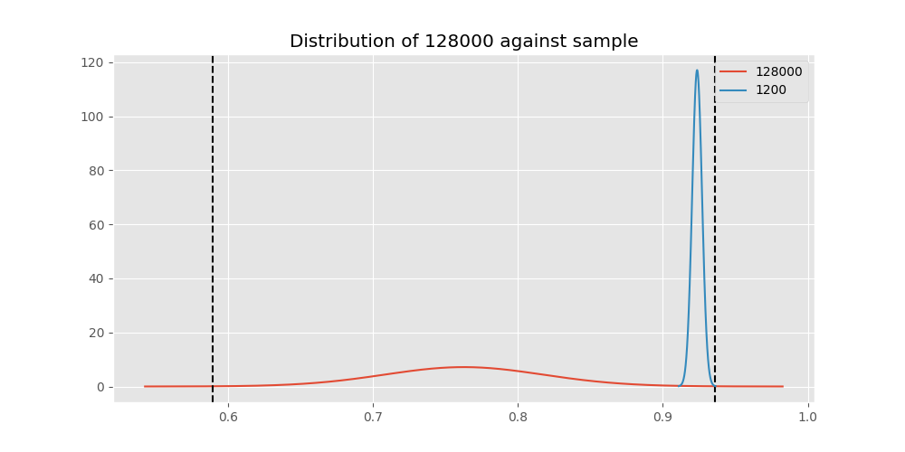

# Testing Results For 128000 
$H_{0}$: There is not a difference in collection success against 128000 
$H_{A}$: There is a difference in collection success against 128000
An $\alpha$ of 0.002777777777777778 was used 
Out of 10 tests, there were 9 rejections from 10 independent-t test.
Out of 10 tests, there were 9 rejections from 10 Man Whitney u-tests.
## Testing Results for 128000 against 9600 
128000 has a success rate of 0.7627118644067796
9600 has a success rate of 0.911736952892502
$H_{0}$: There is not a difference between 128000 and 9600
$H_{A}$: There is a difference between 128000 and 9600
An $/alpha$ of 0.002777777777777778 was used in this test.
__independent t-testing__: With a t-statistic of -4.0155807260017795 and a p-value of 5.9612671429247404e-05, _we **reject** the null hypothssis_
__Man-Whitney testing__: With a u-statistic of 345854.5 and a p-value of 5.9861930618880434e-05, _we **reject** the null hypothssis_
 
## Testing Results for 128000 against 9766 
128000 has a success rate of 0.7627118644067796
9766 has a success rate of 0.9770114942528736
$H_{0}$: There is not a difference between 128000 and 9766
$H_{A}$: There is a difference between 128000 and 9766
An $/alpha$ of 0.002777777777777778 was used in this test.
__independent t-testing__: With a t-statistic of -3.6852204159823403 and a p-value of 0.000455605759684536, _we **reject** the null hypothssis_
__Man-Whitney testing__: With a u-statistic of 2016.5 and a p-value of 5.1198510050596593e-05, _we **reject** the null hypothssis_
 
## Testing Results for 128000 against 1200 
128000 has a success rate of 0.7627118644067796
1200 has a success rate of 0.9236590983876275
$H_{0}$: There is not a difference between 128000 and 1200
$H_{A}$: There is a difference between 128000 and 1200
An $/alpha$ of 0.002777777777777778 was used in this test.
__independent t-testing__: With a t-statistic of -4.597908735434052 and a p-value of 4.353134301321277e-06, _we **reject** the null hypothssis_
__Man-Whitney testing__: With a u-statistic of 150443.0 and a p-value of 4.426058756436071e-06, _we **reject** the null hypothssis_
 
## Testing Results for 128000 against 4800 
128000 has a success rate of 0.7627118644067796
4800 has a success rate of 0.9839944328462074
$H_{0}$: There is not a difference between 128000 and 4800
$H_{A}$: There is a difference between 128000 and 4800
An $/alpha$ of 0.002777777777777778 was used in this test.
__independent t-testing__: With a t-statistic of -3.957872414524431 and a p-value of 0.00020817576382383603, _we **reject** the null hypothssis_
__Man-Whitney testing__: With a u-statistic of 66022.0 and a p-value of 1.4423870089048027e-32, _we **reject** the null hypothssis_
 
## Testing Results for 128000 against 200 
128000 has a success rate of 0.7627118644067796
200 has a success rate of 0.998960498960499
$H_{0}$: There is not a difference between 128000 and 200
$H_{A}$: There is a difference between 128000 and 200
An $/alpha$ of 0.002777777777777778 was used in this test.
__independent t-testing__: With a t-statistic of -4.228534299106527 and a p-value of 8.443911080105512e-05, _we **reject** the null hypothssis_
__Man-Whitney testing__: With a u-statistic of 21674.5 and a p-value of 1.7535579104886934e-48, _we **reject** the null hypothssis_
 
## Testing Results for 128000 against 38400 
128000 has a success rate of 0.7627118644067796
38400 has a success rate of 0.3508771929824561
$H_{0}$: There is not a difference between 128000 and 38400
$H_{A}$: There is a difference between 128000 and 38400
An $/alpha$ of 0.002777777777777778 was used in this test.
__independent t-testing__: With a t-statistic of 4.867416673082675 and a p-value of 3.664771155738698e-06, _we **reject** the null hypothssis_
__Man-Whitney testing__: With a u-statistic of 2374.0 and a p-value of 8.78582103387024e-06, _we **reject** the null hypothssis_
 
## Testing Results for 128000 against 2400 
128000 has a success rate of 0.7627118644067796
2400 has a success rate of 0.9869848156182213
$H_{0}$: There is not a difference between 128000 and 2400
$H_{A}$: There is a difference between 128000 and 2400
An $/alpha$ of 0.002777777777777778 was used in this test.
__independent t-testing__: With a t-statistic of -3.997034862217574 and a p-value of 0.00018061600707310174, _we **reject** the null hypothssis_
__Man-Whitney testing__: With a u-statistic of 10549.5 and a p-value of 3.609933375069642e-17, _we **reject** the null hypothssis_
 
## Testing Results for 128000 against 12500 
128000 has a success rate of 0.7627118644067796
12500 has a success rate of 0.9948320413436692
$H_{0}$: There is not a difference between 128000 and 12500
$H_{A}$: There is a difference between 128000 and 12500
An $/alpha$ of 0.002777777777777778 was used in this test.
__independent t-testing__: With a t-statistic of -4.14651949139637 and a p-value of 0.00011052177201674398, _we **reject** the null hypothssis_
__Man-Whitney testing__: With a u-statistic of 8766.5 and a p-value of 4.720855765423271e-19, _we **reject** the null hypothssis_
 
## Testing Results for 128000 against 19200 
128000 has a success rate of 0.7627118644067796
19200 has a success rate of 0.9966777408637874
$H_{0}$: There is not a difference between 128000 and 19200
$H_{A}$: There is a difference between 128000 and 19200
An $/alpha$ of 0.002777777777777778 was used in this test.
__independent t-testing__: With a t-statistic of -4.185939450845899 and a p-value of 9.736814794908315e-05, _we **reject** the null hypothssis_
__Man-Whitney testing__: With a u-statistic of 20406.0 and a p-value of 7.979574671490144e-40, _we **reject** the null hypothssis_
 
## Testing Results for 128000 against 0 
128000 has a success rate of 0.7627118644067796
0 has a success rate of 0.7672253258845437
$H_{0}$: There is not a difference between 128000 and 0
$H_{A}$: There is a difference between 128000 and 0
An $/alpha$ of 0.002777777777777778 was used in this test.
__independent t-testing__: With a t-statistic of -0.07768779899684217 and a p-value of 0.9381025609323895, _we failed to reject the null hypothssis_
__Man-Whitney testing__: With a u-statistic of 15770.0 and a p-value of 0.9384572465807447, _we failed to reject the null hypothssis_
 
