# Testing Results For 19200 
$H_{0}$: There is not a difference in collection success against 19200 
$H_{A}$: There is a difference in collection success against 19200
An $\alpha$ of 0.002777777777777778 was used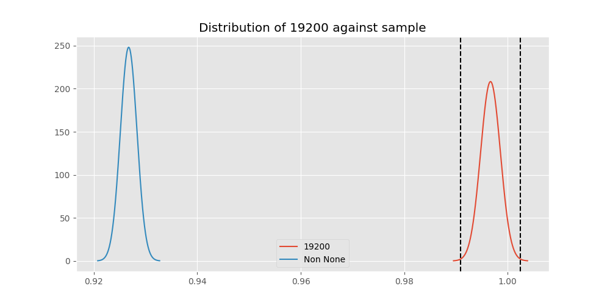 
Out of 10 tests, there were 5 rejections from 10 independent-t test.
Out of 10 tests, there were 5 rejections from 10 Man Whitney u-tests.
## Testing Results for 19200 against 128000 
19200 has a success rate of 0.9966777408637874
128000 has a success rate of 0.7627118644067796
$H_{0}$: There is not a difference between 19200 and 128000
$H_{A}$: There is a difference between 19200 and 128000
An $/alpha$ of 0.002777777777777778 was used in this test.
__independent t-testing__: With a t-statistic of 14.592107083124159 and a p-value of 1.044375754052631e-43, _we **reject** the null hypothssis_
__Man-Whitney testing__: With a u-statistic of 32871.0 and a p-value of 7.979574671490144e-40, _we **reject** the null hypothssis_
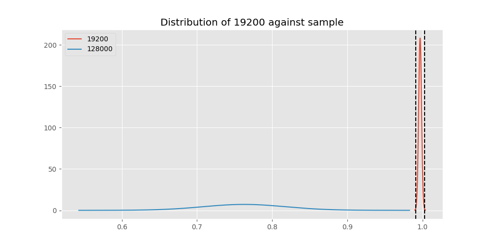 
## Testing Results for 19200 against 9600 
19200 has a success rate of 0.9966777408637874
9600 has a success rate of 0.911736952892502
$H_{0}$: There is not a difference between 19200 and 9600
$H_{A}$: There is a difference between 19200 and 9600
An $/alpha$ of 0.002777777777777778 was used in this test.
__independent t-testing__: With a t-statistic of 8.985070534331582 and a p-value of 2.8959724680550644e-19, _we **reject** the null hypothssis_
__Man-Whitney testing__: With a u-statistic of 6748674.0 and a p-value of 3.2245098826264857e-19, _we **reject** the null hypothssis_
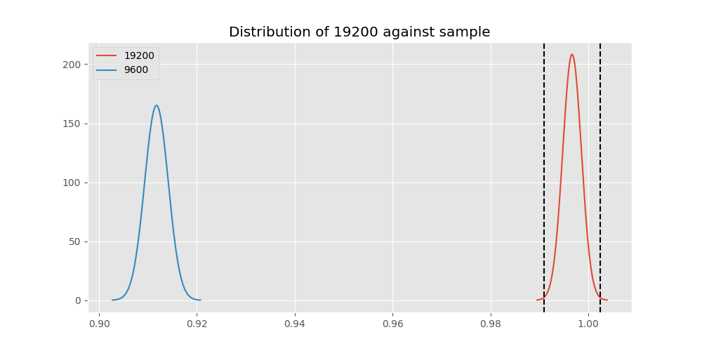 
## Testing Results for 19200 against 9766 
19200 has a success rate of 0.9966777408637874
9766 has a success rate of 0.9770114942528736
$H_{0}$: There is not a difference between 19200 and 9766
$H_{A}$: There is a difference between 19200 and 9766
An $/alpha$ of 0.002777777777777778 was used in this test.
__independent t-testing__: With a t-statistic of 2.4765332168607506 and a p-value of 0.01343304273460211, _we failed to reject the null hypothssis_
__Man-Whitney testing__: With a u-statistic of 40053.0 and a p-value of 0.013566838882898561, _we failed to reject the null hypothssis_
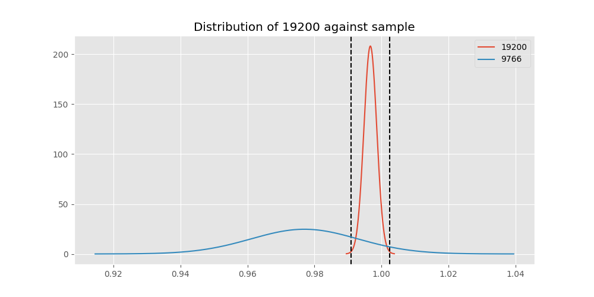 
## Testing Results for 19200 against 1200 
19200 has a success rate of 0.9966777408637874
1200 has a success rate of 0.9236590983876275
$H_{0}$: There is not a difference between 19200 and 1200
$H_{A}$: There is a difference between 19200 and 1200
An $/alpha$ of 0.002777777777777778 was used in this test.
__independent t-testing__: With a t-statistic of 8.233248301023117 and a p-value of 2.156098211307012e-16, _we **reject** the null hypothssis_
__Man-Whitney testing__: With a u-statistic of 2944596.0 and a p-value of 2.524343955037696e-16, _we **reject** the null hypothssis_
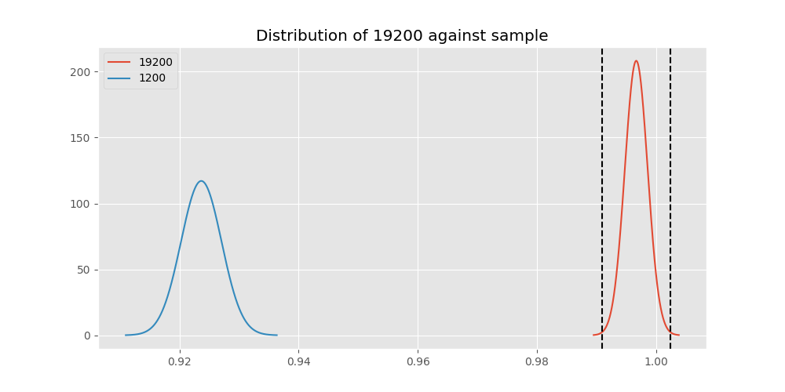 
## Testing Results for 19200 against 4800 
19200 has a success rate of 0.9966777408637874
4800 has a success rate of 0.9839944328462074
$H_{0}$: There is not a difference between 19200 and 4800
$H_{A}$: There is a difference between 19200 and 4800
An $/alpha$ of 0.002777777777777778 was used in this test.
__independent t-testing__: With a t-statistic of 2.940621479341317 and a p-value of 0.0032954410152701845, _we failed to reject the null hypothssis_
__Man-Whitney testing__: With a u-statistic of 1314069.0 and a p-value of 0.003308071815067368, _we failed to reject the null hypothssis_
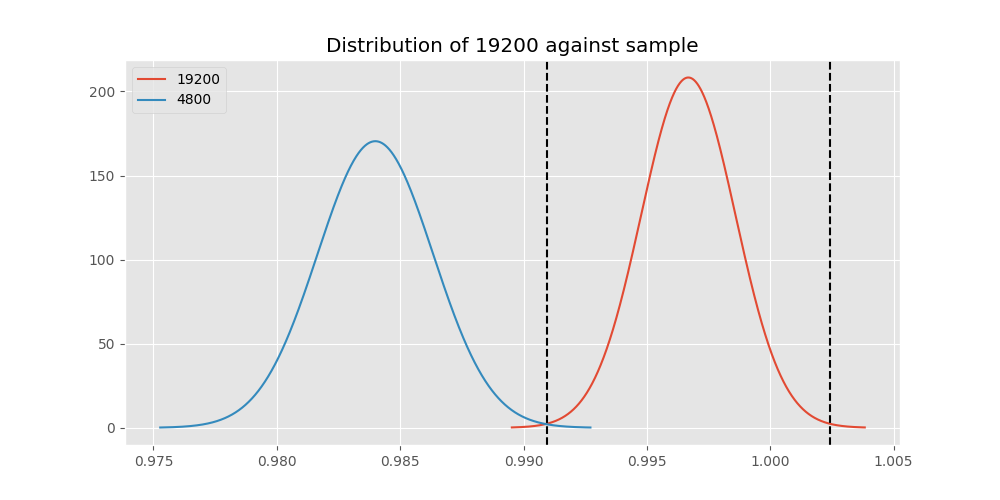 
## Testing Results for 19200 against 200 
19200 has a success rate of 0.9966777408637874
200 has a success rate of 0.998960498960499
$H_{0}$: There is not a difference between 19200 and 200
$H_{A}$: There is a difference between 19200 and 200
An $/alpha$ of 0.002777777777777778 was used in this test.
__independent t-testing__: With a t-statistic of -1.0646984848382777 and a p-value of 0.2871503671603844, _we failed to reject the null hypothssis_
__Man-Whitney testing__: With a u-statistic of 433351.5 and a p-value of 0.2872727824263054, _we failed to reject the null hypothssis_
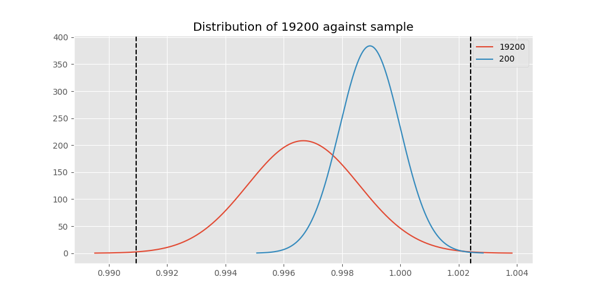 
## Testing Results for 19200 against 38400 
19200 has a success rate of 0.9966777408637874
38400 has a success rate of 0.3508771929824561
$H_{0}$: There is not a difference between 19200 and 38400
$H_{A}$: There is a difference between 19200 and 38400
An $/alpha$ of 0.002777777777777778 was used in this test.
__independent t-testing__: With a t-statistic of 36.62187250482618 and a p-value of 2.5713437287611005e-184, _we **reject** the null hypothssis_
__Man-Whitney testing__: With a u-statistic of 42355.5 and a p-value of 1.1489189868538124e-123, _we **reject** the null hypothssis_
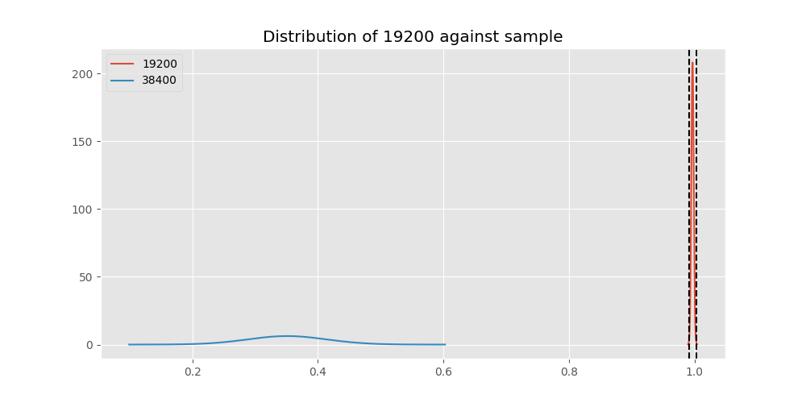 
## Testing Results for 19200 against 2400 
19200 has a success rate of 0.9966777408637874
2400 has a success rate of 0.9869848156182213
$H_{0}$: There is not a difference between 19200 and 2400
$H_{A}$: There is a difference between 19200 and 2400
An $/alpha$ of 0.002777777777777778 was used in this test.
__independent t-testing__: With a t-statistic of 2.0933622650136527 and a p-value of 0.03650139715989531, _we failed to reject the null hypothssis_
__Man-Whitney testing__: With a u-statistic of 210159.0 and a p-value of 0.03659519715153212, _we failed to reject the null hypothssis_
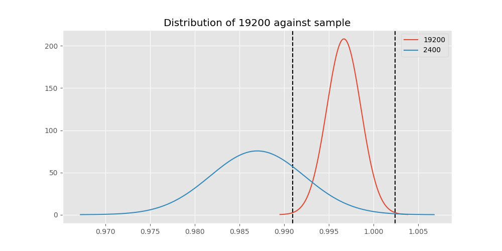 
## Testing Results for 19200 against 12500 
19200 has a success rate of 0.9966777408637874
12500 has a success rate of 0.9948320413436692
$H_{0}$: There is not a difference between 19200 and 12500
$H_{A}$: There is a difference between 19200 and 12500
An $/alpha$ of 0.002777777777777778 was used in this test.
__independent t-testing__: With a t-statistic of 0.4885645605997094 and a p-value of 0.6252331782784586, _we failed to reject the null hypothssis_
__Man-Whitney testing__: With a u-statistic of 175053.0 and a p-value of 0.6255843978204252, _we failed to reject the null hypothssis_
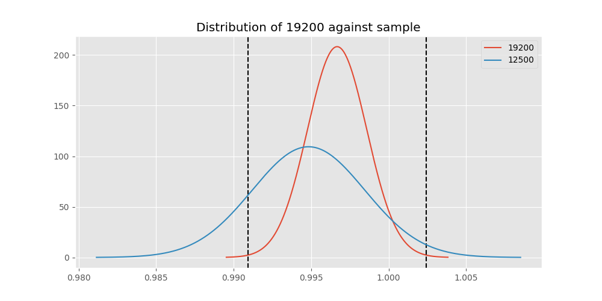 
## Testing Results for 19200 against 0 
19200 has a success rate of 0.9966777408637874
0 has a success rate of 0.7672253258845437
$H_{0}$: There is not a difference between 19200 and 0
$H_{A}$: There is a difference between 19200 and 0
An $/alpha$ of 0.002777777777777778 was used in this test.
__independent t-testing__: With a t-statistic of 16.05604716458435 and a p-value of 1.734855126721068e-53, _we **reject** the null hypothssis_
__Man-Whitney testing__: With a u-statistic of 298087.5 and a p-value of 1.6909021522913896e-49, _we **reject** the null hypothssis_
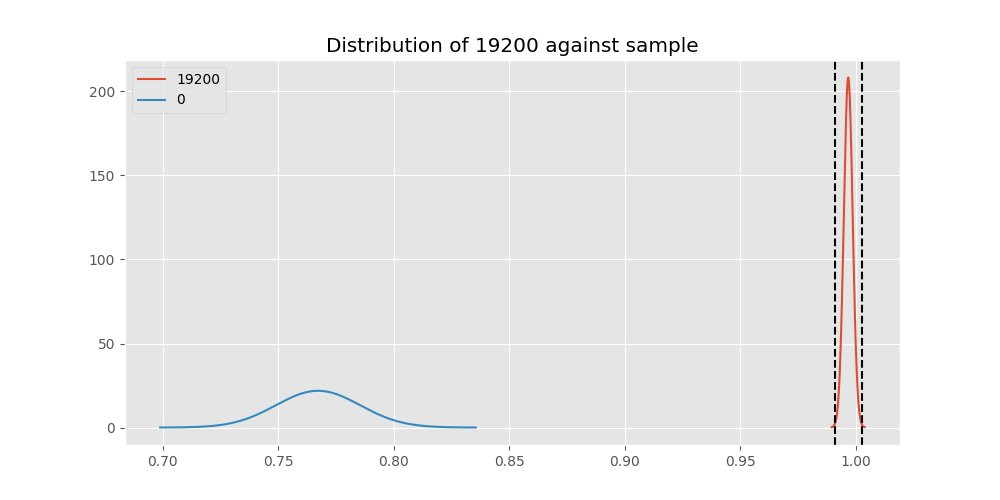 
