# Testing Results For 200 
$H_{0}$: There is not a difference in collection success against 200 
$H_{A}$: There is a difference in collection success against 200
An $\alpha$ of 0.002777777777777778 was used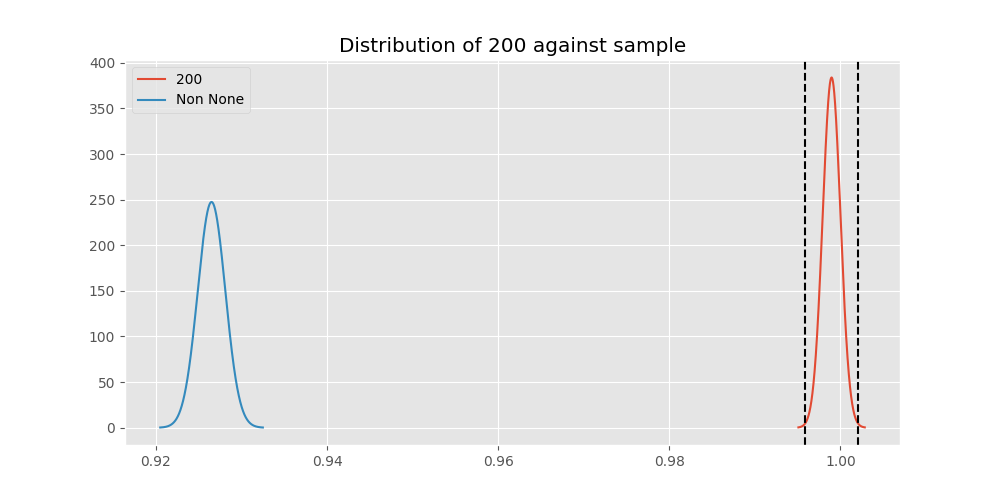 
Out of 10 tests, there were 8 rejections from 10 independent-t test.
Out of 10 tests, there were 8 rejections from 10 Man Whitney u-tests.
## Testing Results for 200 against 128000 
200 has a success rate of 0.998960498960499
128000 has a success rate of 0.7627118644067796
$H_{0}$: There is not a difference between 200 and 128000
$H_{A}$: There is a difference between 200 and 128000
An $/alpha$ of 0.002777777777777778 was used in this test.
__independent t-testing__: With a t-statistic of 16.45480707437204 and a p-value of 3.9397269370416017e-54, _we **reject** the null hypothssis_
__Man-Whitney testing__: With a u-statistic of 35083.5 and a p-value of 1.7535579104886934e-48, _we **reject** the null hypothssis_
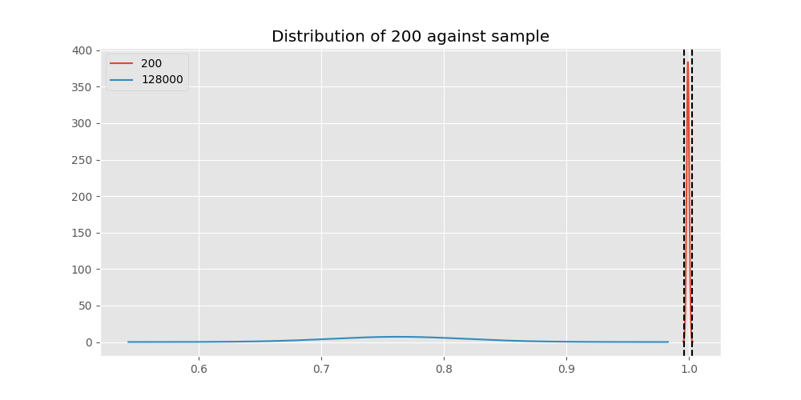 
## Testing Results for 200 against 9600 
200 has a success rate of 0.998960498960499
9600 has a success rate of 0.911736952892502
$H_{0}$: There is not a difference between 200 and 9600
$H_{A}$: There is a difference between 200 and 9600
An $/alpha$ of 0.002777777777777778 was used in this test.
__independent t-testing__: With a t-statistic of 9.531735877797402 and a p-value of 1.7836630514274984e-21, _we **reject** the null hypothssis_
__Man-Whitney testing__: With a u-statistic of 7204744.5 and a p-value of 2.0431416661578627e-21, _we **reject** the null hypothssis_
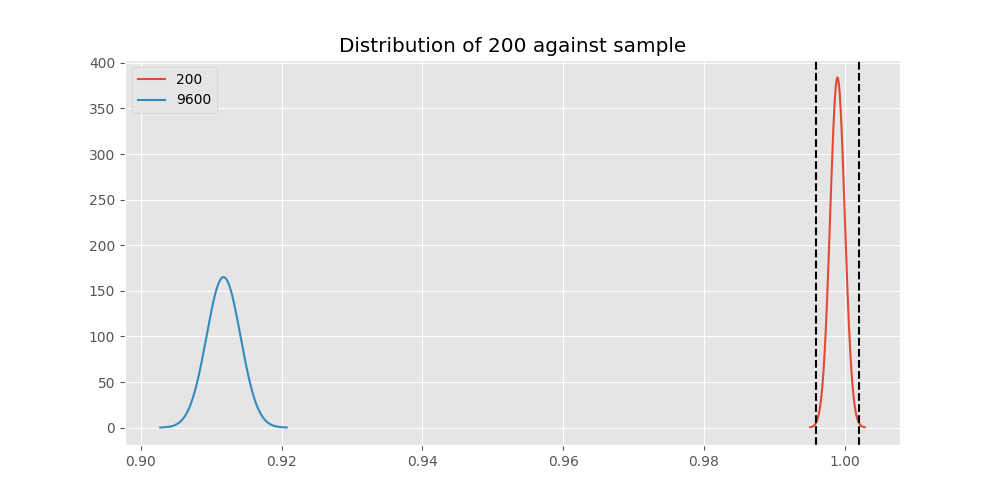 
## Testing Results for 200 against 9766 
200 has a success rate of 0.998960498960499
9766 has a success rate of 0.9770114942528736
$H_{0}$: There is not a difference between 200 and 9766
$H_{A}$: There is a difference between 200 and 9766
An $/alpha$ of 0.002777777777777778 was used in this test.
__independent t-testing__: With a t-statistic of 3.691620776017776 and a p-value of 0.00023432075043384117, _we **reject** the null hypothssis_
__Man-Whitney testing__: With a u-statistic of 42765.5 and a p-value of 0.0002448562216711762, _we **reject** the null hypothssis_
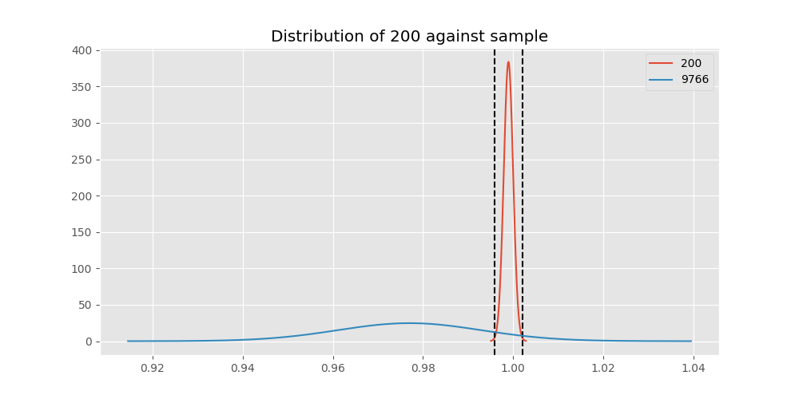 
## Testing Results for 200 against 1200 
200 has a success rate of 0.998960498960499
1200 has a success rate of 0.9236590983876275
$H_{0}$: There is not a difference between 200 and 1200
$H_{A}$: There is a difference between 200 and 1200
An $/alpha$ of 0.002777777777777778 was used in this test.
__independent t-testing__: With a t-statistic of 8.783929455927796 and a p-value of 1.9579502865024313e-18, _we **reject** the null hypothssis_
__Man-Whitney testing__: With a u-statistic of 3143663.0 and a p-value of 2.3986264043579845e-18, _we **reject** the null hypothssis_
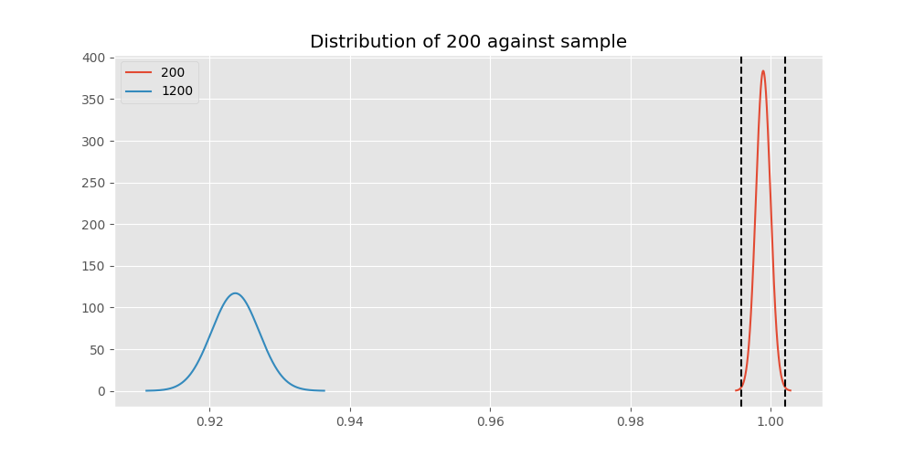 
## Testing Results for 200 against 4800 
200 has a success rate of 0.998960498960499
4800 has a success rate of 0.9839944328462074
$H_{0}$: There is not a difference between 200 and 4800
$H_{A}$: There is a difference between 200 and 4800
An $/alpha$ of 0.002777777777777778 was used in this test.
__independent t-testing__: With a t-statistic of 3.6577146677159993 and a p-value of 0.0002578931032964401, _we **reject** the null hypothssis_
__Man-Whitney testing__: With a u-statistic of 1403083.0 and a p-value of 0.0002604722049353837, _we **reject** the null hypothssis_
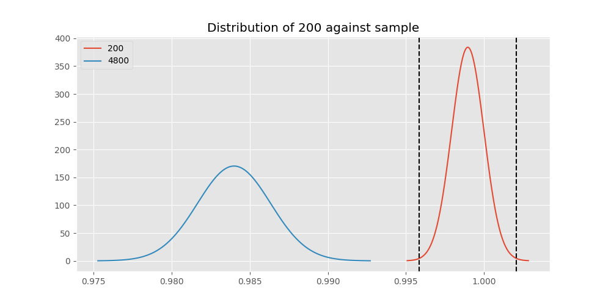 
## Testing Results for 200 against 38400 
200 has a success rate of 0.998960498960499
38400 has a success rate of 0.3508771929824561
$H_{0}$: There is not a difference between 200 and 38400
$H_{A}$: There is a difference between 200 and 38400
An $/alpha$ of 0.002777777777777778 was used in this test.
__independent t-testing__: With a t-statistic of 40.54652077026436 and a p-value of 1.2251164136195226e-214, _we **reject** the null hypothssis_
__Man-Whitney testing__: With a u-statistic of 45185.5 and a p-value of 8.666234317026107e-139, _we **reject** the null hypothssis_
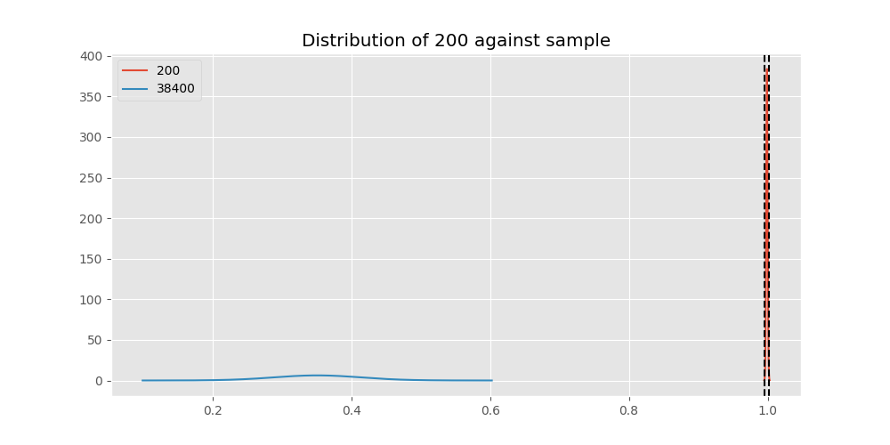 
## Testing Results for 200 against 2400 
200 has a success rate of 0.998960498960499
2400 has a success rate of 0.9869848156182213
$H_{0}$: There is not a difference between 200 and 2400
$H_{A}$: There is a difference between 200 and 2400
An $/alpha$ of 0.002777777777777778 was used in this test.
__independent t-testing__: With a t-statistic of 3.0293717062193375 and a p-value of 0.0024948455741429397, _we **reject** the null hypothssis_
__Man-Whitney testing__: With a u-statistic of 224396.5 and a p-value of 0.002526659989015966, _we **reject** the null hypothssis_
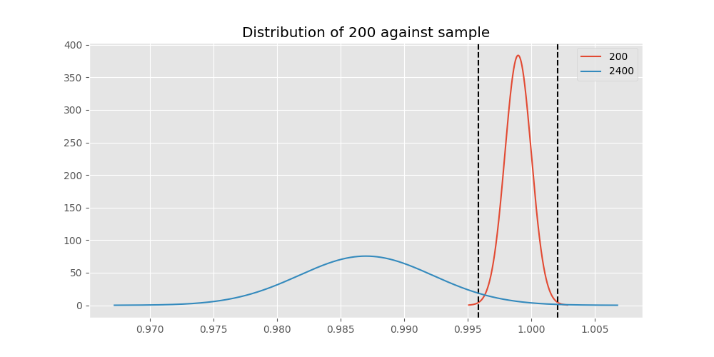 
## Testing Results for 200 against 12500 
200 has a success rate of 0.998960498960499
12500 has a success rate of 0.9948320413436692
$H_{0}$: There is not a difference between 200 and 12500
$H_{A}$: There is a difference between 200 and 12500
An $/alpha$ of 0.002777777777777778 was used in this test.
__independent t-testing__: With a t-statistic of 1.4560389402258018 and a p-value of 0.14561488592297828, _we failed to reject the null hypothssis_
__Man-Whitney testing__: With a u-statistic of 186915.5 and a p-value of 0.14581120331065603, _we failed to reject the null hypothssis_
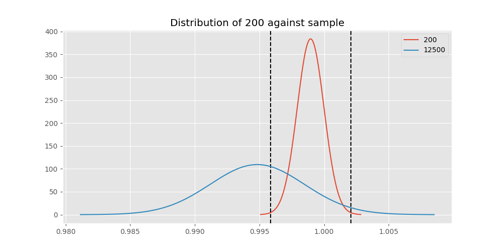 
## Testing Results for 200 against 19200 
200 has a success rate of 0.998960498960499
19200 has a success rate of 0.9966777408637874
$H_{0}$: There is not a difference between 200 and 19200
$H_{A}$: There is a difference between 200 and 19200
An $/alpha$ of 0.002777777777777778 was used in this test.
__independent t-testing__: With a t-statistic of 1.0646984848382777 and a p-value of 0.2871503671603844, _we failed to reject the null hypothssis_
__Man-Whitney testing__: With a u-statistic of 435334.5 and a p-value of 0.2872727824263054, _we failed to reject the null hypothssis_
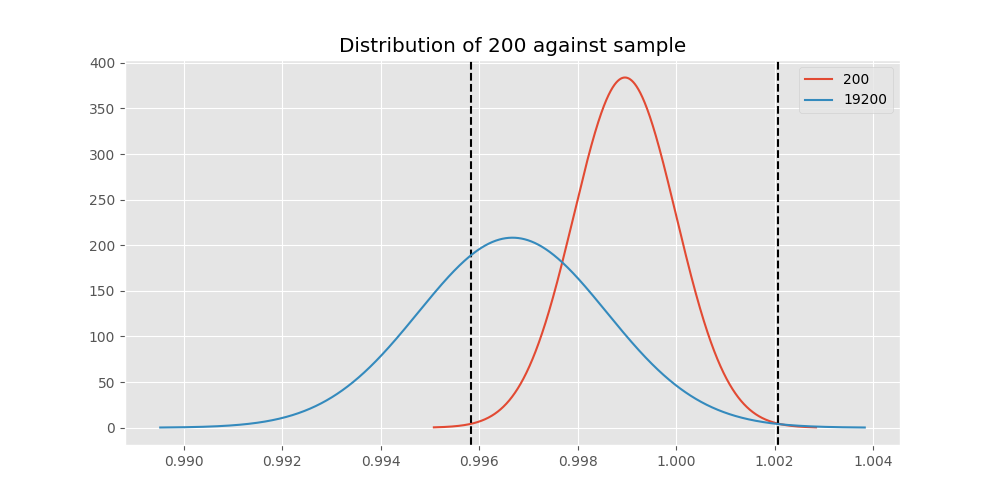 
## Testing Results for 200 against 0 
200 has a success rate of 0.998960498960499
0 has a success rate of 0.7672253258845437
$H_{0}$: There is not a difference between 200 and 0
$H_{A}$: There is a difference between 200 and 0
An $/alpha$ of 0.002777777777777778 was used in this test.
__independent t-testing__: With a t-statistic of 16.908694049613818 and a p-value of 7.842571628321952e-59, _we **reject** the null hypothssis_
__Man-Whitney testing__: With a u-statistic of 318153.5 and a p-value of 3.5337291298344174e-54, _we **reject** the null hypothssis_
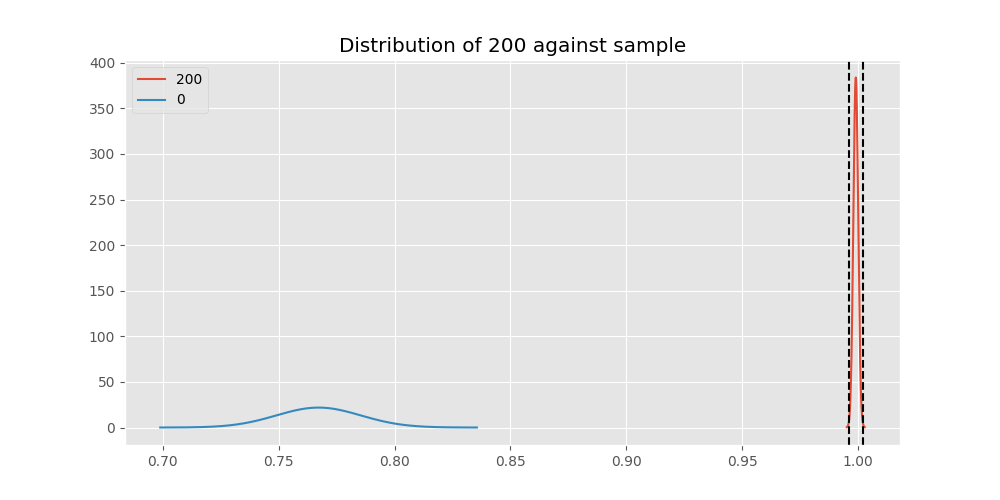 
