# Testing Results For 2400 
$H_{0}$: There is not a difference in collection success against 2400 
$H_{A}$: There is a difference in collection success against 2400
An $\alpha$ of 0.002777777777777778 was used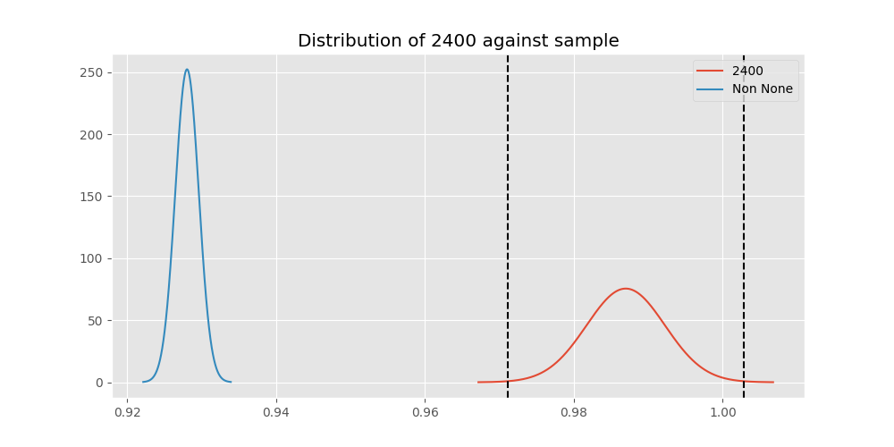 
Out of 10 tests, there were 5 rejections from 10 independent-t test.
Out of 10 tests, there were 6 rejections from 10 Man Whitney u-tests.
## Testing Results for 2400 against 128000 
2400 has a success rate of 0.9869848156182213
128000 has a success rate of 0.7627118644067796
$H_{0}$: There is not a difference between 2400 and 128000
$H_{A}$: There is a difference between 2400 and 128000
An $/alpha$ of 0.002777777777777778 was used in this test.
__independent t-testing__: With a t-statistic of 9.060750376004583 and a p-value of 2.6509816698420296e-18, _we **reject** the null hypothssis_
__Man-Whitney testing__: With a u-statistic of 16649.5 and a p-value of 3.609933375069642e-17, _we **reject** the null hypothssis_
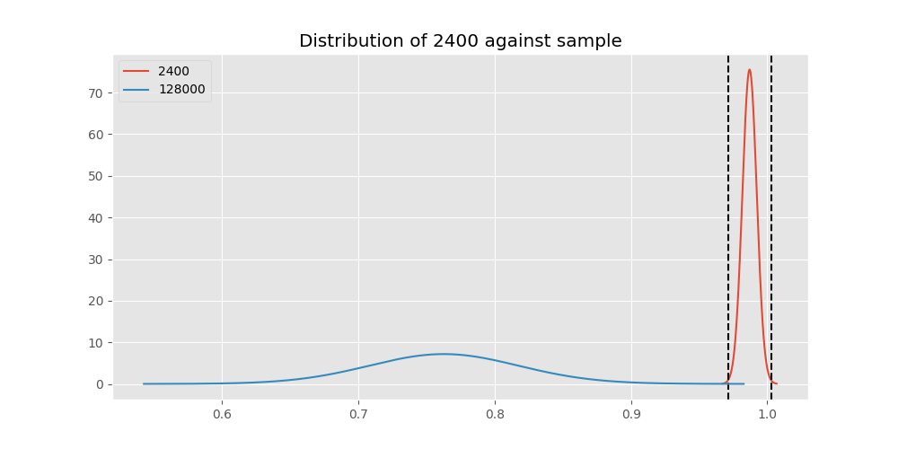 
## Testing Results for 2400 against 9600 
2400 has a success rate of 0.9869848156182213
9600 has a success rate of 0.911736952892502
$H_{0}$: There is not a difference between 2400 and 9600
$H_{A}$: There is a difference between 2400 and 9600
An $/alpha$ of 0.002777777777777778 was used in this test.
__independent t-testing__: With a t-statistic of 5.679800707192776 and a p-value of 1.3748880539688373e-08, _we **reject** the null hypothssis_
__Man-Whitney testing__: With a u-statistic of 3414555.5 and a p-value of 1.3985720409658674e-08, _we **reject** the null hypothssis_
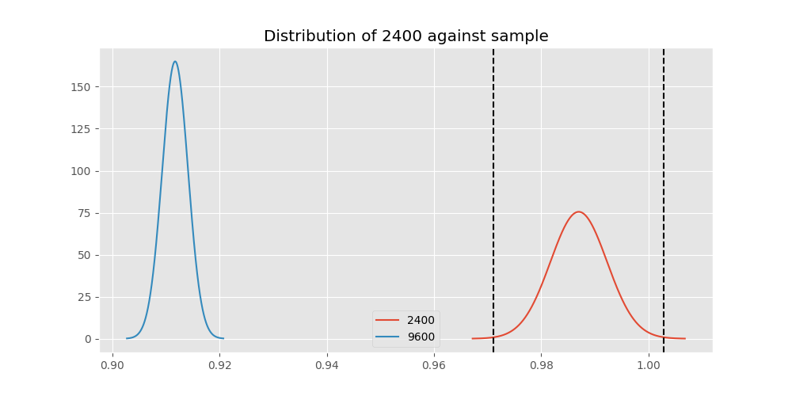 
## Testing Results for 2400 against 9766 
2400 has a success rate of 0.9869848156182213
9766 has a success rate of 0.9770114942528736
$H_{0}$: There is not a difference between 2400 and 9766
$H_{A}$: There is a difference between 2400 and 9766
An $/alpha$ of 0.002777777777777778 was used in this test.
__independent t-testing__: With a t-statistic of 0.7104032976878943 and a p-value of 0.4777573935700068, _we failed to reject the null hypothssis_
__Man-Whitney testing__: With a u-statistic of 20253.5 and a p-value of 0.4783565290173376, _we failed to reject the null hypothssis_
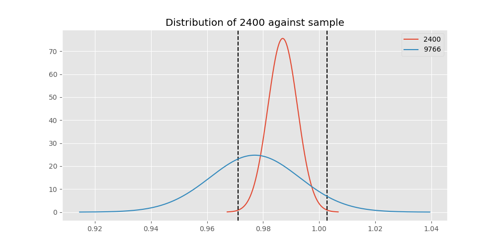 
## Testing Results for 2400 against 1200 
2400 has a success rate of 0.9869848156182213
1200 has a success rate of 0.9236590983876275
$H_{0}$: There is not a difference between 2400 and 1200
$H_{A}$: There is a difference between 2400 and 1200
An $/alpha$ of 0.002777777777777778 was used in this test.
__independent t-testing__: With a t-statistic of 5.084517494575419 and a p-value of 3.7881409681883556e-07, _we **reject** the null hypothssis_
__Man-Whitney testing__: With a u-statistic of 1489697.0 and a p-value of 3.8779630380773803e-07, _we **reject** the null hypothssis_
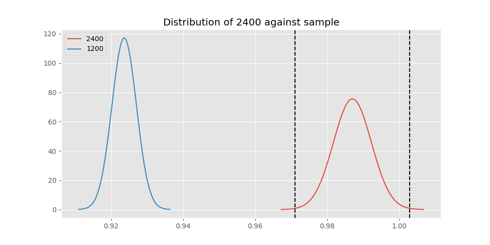 
## Testing Results for 2400 against 4800 
2400 has a success rate of 0.9869848156182213
4800 has a success rate of 0.9839944328462074
$H_{0}$: There is not a difference between 2400 and 4800
$H_{A}$: There is a difference between 2400 and 4800
An $/alpha$ of 0.002777777777777778 was used in this test.
__independent t-testing__: With a t-statistic of 0.4809680646983755 and a p-value of 0.6305707666772116, _we failed to reject the null hypothssis_
__Man-Whitney testing__: With a u-statistic of 664438.0 and a p-value of 0.6305860732449757, _we failed to reject the null hypothssis_
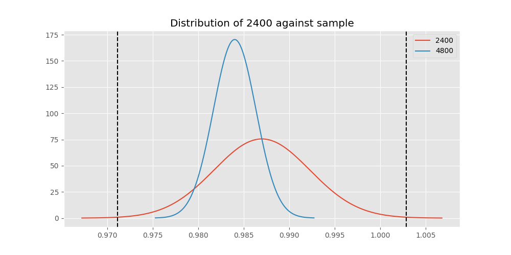 
## Testing Results for 2400 against 200 
2400 has a success rate of 0.9869848156182213
200 has a success rate of 0.998960498960499
$H_{0}$: There is not a difference between 2400 and 200
$H_{A}$: There is a difference between 2400 and 200
An $/alpha$ of 0.002777777777777778 was used in this test.
__independent t-testing__: With a t-statistic of -2.2235912144179477 and a p-value of 0.02662570137776828, _we failed to reject the null hypothssis_
__Man-Whitney testing__: With a u-statistic of 219085.5 and a p-value of 0.002526659989015966, _we **reject** the null hypothssis_
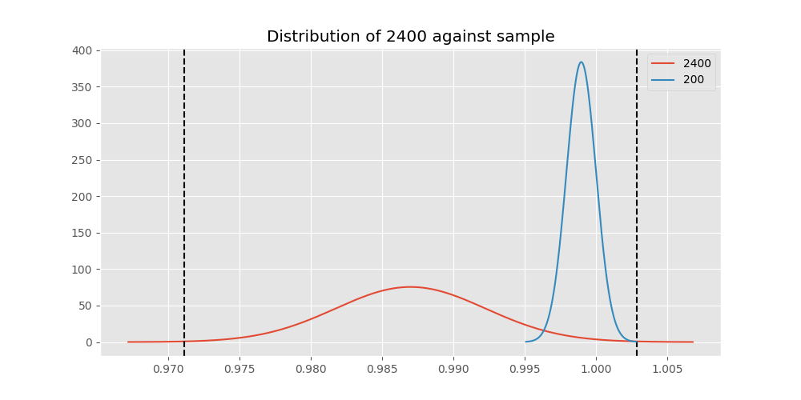 
## Testing Results for 2400 against 38400 
2400 has a success rate of 0.9869848156182213
38400 has a success rate of 0.3508771929824561
$H_{0}$: There is not a difference between 2400 and 38400
$H_{A}$: There is a difference between 2400 and 38400
An $/alpha$ of 0.002777777777777778 was used in this test.
__independent t-testing__: With a t-statistic of 23.66995400289858 and a p-value of 2.0638788068539633e-84, _we **reject** the null hypothssis_
__Man-Whitney testing__: With a u-statistic of 21496.0 and a p-value of 1.7827450606533624e-60, _we **reject** the null hypothssis_
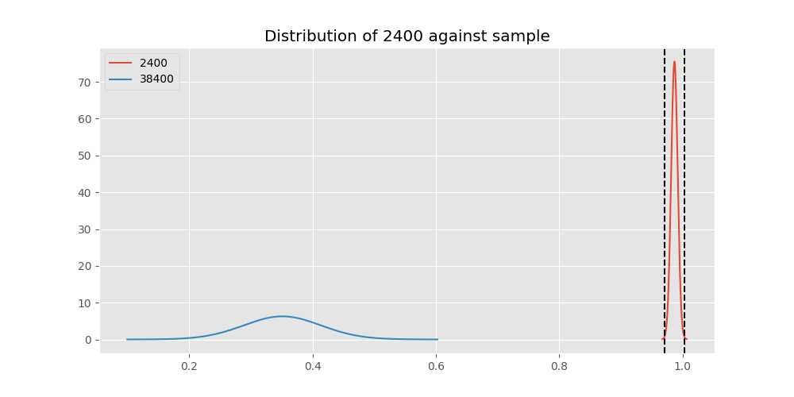 
## Testing Results for 2400 against 12500 
2400 has a success rate of 0.9869848156182213
12500 has a success rate of 0.9948320413436692
$H_{0}$: There is not a difference between 2400 and 12500
$H_{A}$: There is a difference between 2400 and 12500
An $/alpha$ of 0.002777777777777778 was used in this test.
__independent t-testing__: With a t-statistic of -1.177003967210446 and a p-value of 0.2395249603321808, _we failed to reject the null hypothssis_
__Man-Whitney testing__: With a u-statistic of 88503.5 and a p-value of 0.2396365187813544, _we failed to reject the null hypothssis_
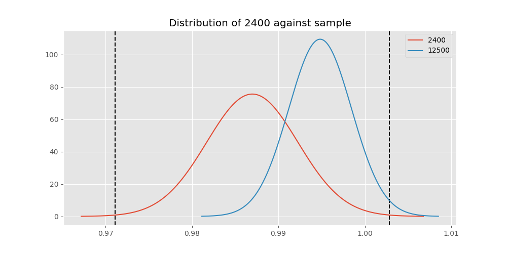 
## Testing Results for 2400 against 19200 
2400 has a success rate of 0.9869848156182213
19200 has a success rate of 0.9966777408637874
$H_{0}$: There is not a difference between 2400 and 19200
$H_{A}$: There is a difference between 2400 and 19200
An $/alpha$ of 0.002777777777777778 was used in this test.
__independent t-testing__: With a t-statistic of -2.0933622650136527 and a p-value of 0.03650139715989531, _we failed to reject the null hypothssis_
__Man-Whitney testing__: With a u-statistic of 206124.0 and a p-value of 0.03659519715153212, _we failed to reject the null hypothssis_
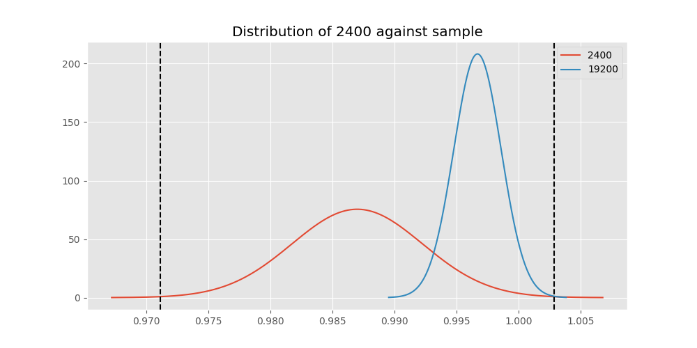 
## Testing Results for 2400 against 0 
2400 has a success rate of 0.9869848156182213
0 has a success rate of 0.7672253258845437
$H_{0}$: There is not a difference between 2400 and 0
$H_{A}$: There is a difference between 2400 and 0
An $/alpha$ of 0.002777777777777778 was used in this test.
__independent t-testing__: With a t-statistic of 10.8248596347799 and a p-value of 6.79189203813128e-26, _we **reject** the null hypothssis_
__Man-Whitney testing__: With a u-statistic of 150980.0 and a p-value of 1.2561123971756823e-24, _we **reject** the null hypothssis_
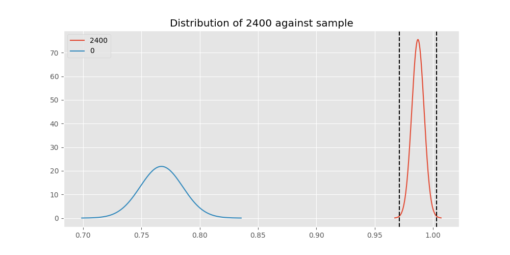 
