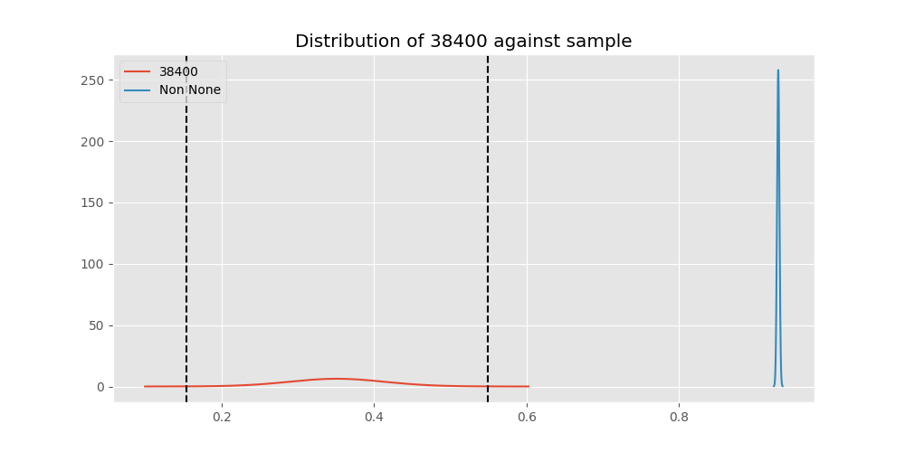
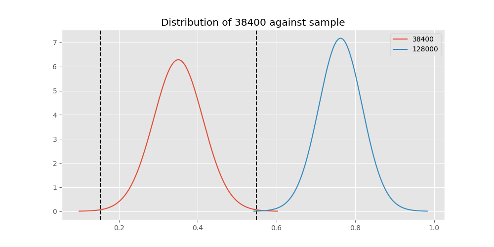
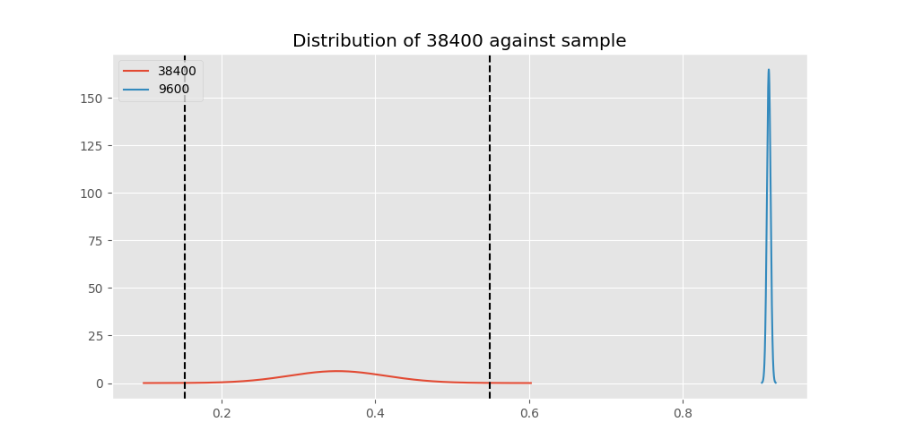
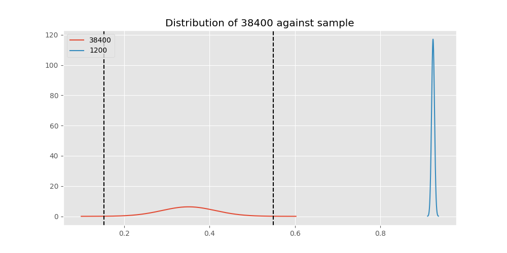
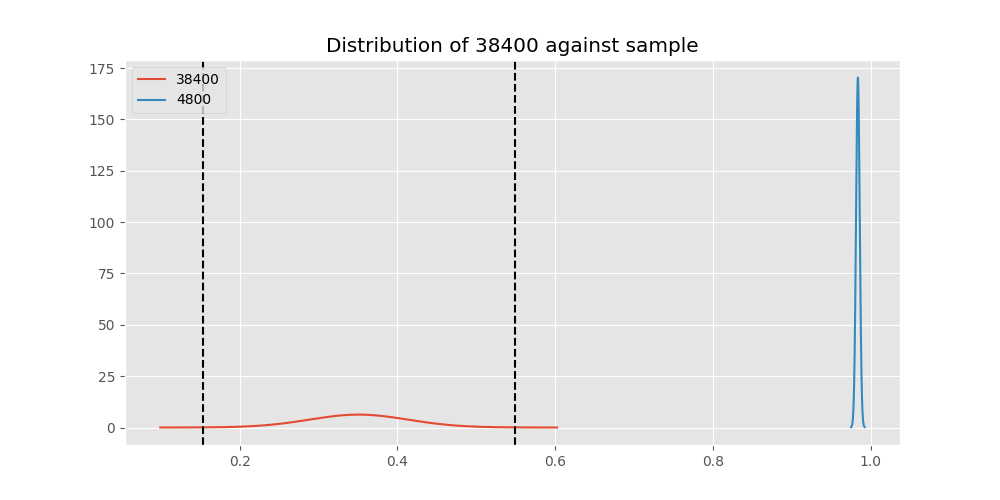
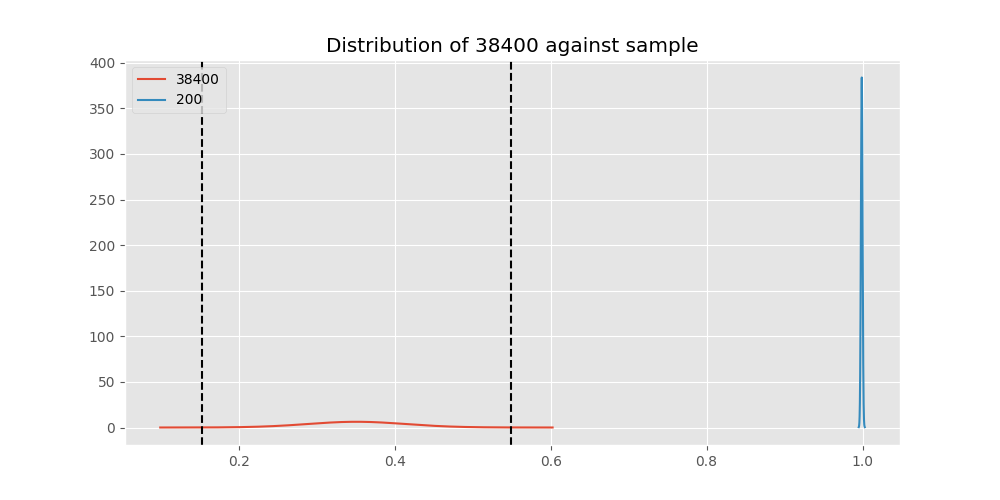
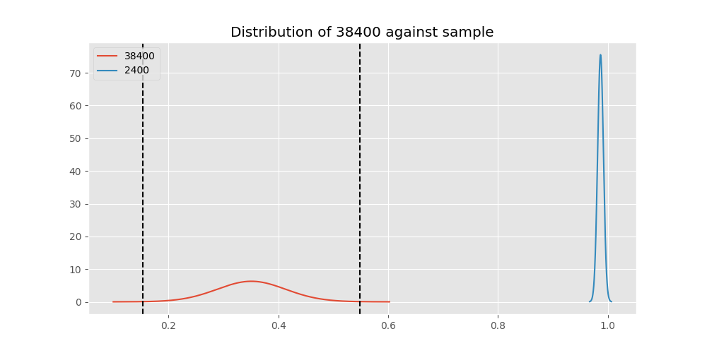
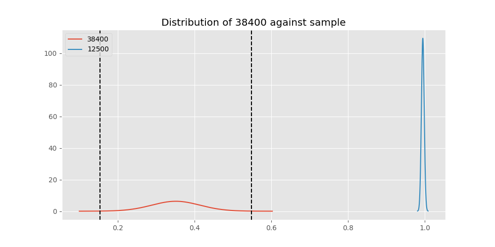
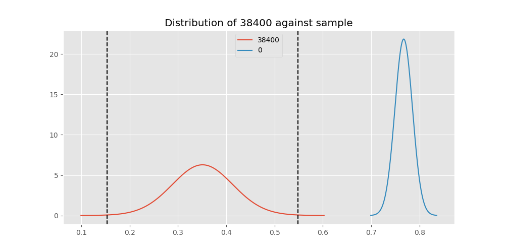

# Testing Results For 38400 
$H_{0}$: There is not a difference in collection success against 38400 
$H_{A}$: There is a difference in collection success against 38400
An $\alpha$ of 0.002777777777777778 was used 
Out of 10 tests, there were 10 rejections from 10 independent-t test.
Out of 10 tests, there were 10 rejections from 10 Man Whitney u-tests.
## Testing Results for 38400 against 128000 
38400 has a success rate of 0.3508771929824561
128000 has a success rate of 0.7627118644067796
$H_{0}$: There is not a difference between 38400 and 128000
$H_{A}$: There is a difference between 38400 and 128000
An $/alpha$ of 0.002777777777777778 was used in this test.
__independent t-testing__: With a t-statistic of -4.867416673082675 and a p-value of 3.664771155738698e-06, _we **reject** the null hypothssis_
__Man-Whitney testing__: With a u-statistic of 989.0 and a p-value of 8.78582103387024e-06, _we **reject** the null hypothssis_
 
## Testing Results for 38400 against 9600 
38400 has a success rate of 0.3508771929824561
9600 has a success rate of 0.911736952892502
$H_{0}$: There is not a difference between 38400 and 9600
$H_{A}$: There is a difference between 38400 and 9600
An $/alpha$ of 0.002777777777777778 was used in this test.
__independent t-testing__: With a t-statistic of -14.839117514528112 and a p-value of 1.963000613725507e-49, _we **reject** the null hypothssis_
__Man-Whitney testing__: With a u-statistic of 172426.0 and a p-value of 4.595786196927554e-49, _we **reject** the null hypothssis_
 
## Testing Results for 38400 against 9766 
38400 has a success rate of 0.3508771929824561
9766 has a success rate of 0.9770114942528736
$H_{0}$: There is not a difference between 38400 and 9766
$H_{A}$: There is a difference between 38400 and 9766
An $/alpha$ of 0.002777777777777778 was used in this test.
__independent t-testing__: With a t-statistic of -9.51713819920332 and a p-value of 8.011388655242025e-14, _we **reject** the null hypothssis_
__Man-Whitney testing__: With a u-statistic of 927.0 and a p-value of 1.7667602053423378e-16, _we **reject** the null hypothssis_
 
## Testing Results for 38400 against 1200 
38400 has a success rate of 0.3508771929824561
1200 has a success rate of 0.9236590983876275
$H_{0}$: There is not a difference between 38400 and 1200
$H_{A}$: There is a difference between 38400 and 1200
An $/alpha$ of 0.002777777777777778 was used in this test.
__independent t-testing__: With a t-statistic of -16.041362956890854 and a p-value of 9.266144581959505e-57, _we **reject** the null hypothssis_
__Man-Whitney testing__: With a u-statistic of 74004.0 and a p-value of 1.1701290907708633e-55, _we **reject** the null hypothssis_
 
## Testing Results for 38400 against 4800 
38400 has a success rate of 0.3508771929824561
4800 has a success rate of 0.9839944328462074
$H_{0}$: There is not a difference between 38400 and 4800
$H_{A}$: There is a difference between 38400 and 4800
An $/alpha$ of 0.002777777777777778 was used in this test.
__independent t-testing__: With a t-statistic of -9.920753732405467 and a p-value of 5.919641926643567e-14, _we **reject** the null hypothssis_
__Man-Whitney testing__: With a u-statistic of 30051.0 and a p-value of 5.128326294119444e-179, _we **reject** the null hypothssis_
 
## Testing Results for 38400 against 200 
38400 has a success rate of 0.3508771929824561
200 has a success rate of 0.998960498960499
$H_{0}$: There is not a difference between 38400 and 200
$H_{A}$: There is a difference between 38400 and 200
An $/alpha$ of 0.002777777777777778 was used in this test.
__independent t-testing__: With a t-statistic of -10.160759226492203 and a p-value of 2.5416936316220192e-14, _we **reject** the null hypothssis_
__Man-Whitney testing__: With a u-statistic of 9648.5 and a p-value of 8.666234317026107e-139, _we **reject** the null hypothssis_
 
## Testing Results for 38400 against 2400 
38400 has a success rate of 0.3508771929824561
2400 has a success rate of 0.9869848156182213
$H_{0}$: There is not a difference between 38400 and 2400
$H_{A}$: There is a difference between 38400 and 2400
An $/alpha$ of 0.002777777777777778 was used in this test.
__independent t-testing__: With a t-statistic of -9.940260218458267 and a p-value of 4.891476618975376e-14, _we **reject** the null hypothssis_
__Man-Whitney testing__: With a u-statistic of 4781.0 and a p-value of 1.7827450606533624e-60, _we **reject** the null hypothssis_
 
## Testing Results for 38400 against 12500 
38400 has a success rate of 0.3508771929824561
12500 has a success rate of 0.9948320413436692
$H_{0}$: There is not a difference between 38400 and 12500
$H_{A}$: There is a difference between 38400 and 12500
An $/alpha$ of 0.002777777777777778 was used in this test.
__independent t-testing__: With a t-statistic of -10.080880585673471 and a p-value of 3.170308068264972e-14, _we **reject** the null hypothssis_
__Man-Whitney testing__: With a u-statistic of 3927.0 and a p-value of 9.846957612520742e-58, _we **reject** the null hypothssis_
 
## Testing Results for 38400 against 19200 
38400 has a success rate of 0.3508771929824561
19200 has a success rate of 0.9966777408637874
$H_{0}$: There is not a difference between 38400 and 19200
$H_{A}$: There is a difference between 38400 and 19200
An $/alpha$ of 0.002777777777777778 was used in this test.
__independent t-testing__: With a t-statistic of -10.121747828214284 and a p-value of 2.8840912109289364e-14, _we **reject** the null hypothssis_
__Man-Whitney testing__: With a u-statistic of 9115.5 and a p-value of 1.1489189868538124e-123, _we **reject** the null hypothssis_
 
## Testing Results for 38400 against 0 
38400 has a success rate of 0.3508771929824561
0 has a success rate of 0.7672253258845437
$H_{0}$: There is not a difference between 38400 and 0
$H_{A}$: There is a difference between 38400 and 0
An $/alpha$ of 0.002777777777777778 was used in this test.
__independent t-testing__: With a t-statistic of -6.968889126694881 and a p-value of 8.543776187854162e-12, _we **reject** the null hypothssis_
__Man-Whitney testing__: With a u-statistic of 8932.5 and a p-value of 2.0191172537909124e-11, _we **reject** the null hypothssis_
 
