# Testing Results For 4800 
$H_{0}$: There is not a difference in collection success against 4800 
$H_{A}$: There is a difference in collection success against 4800
An $\alpha$ of 0.002777777777777778 was used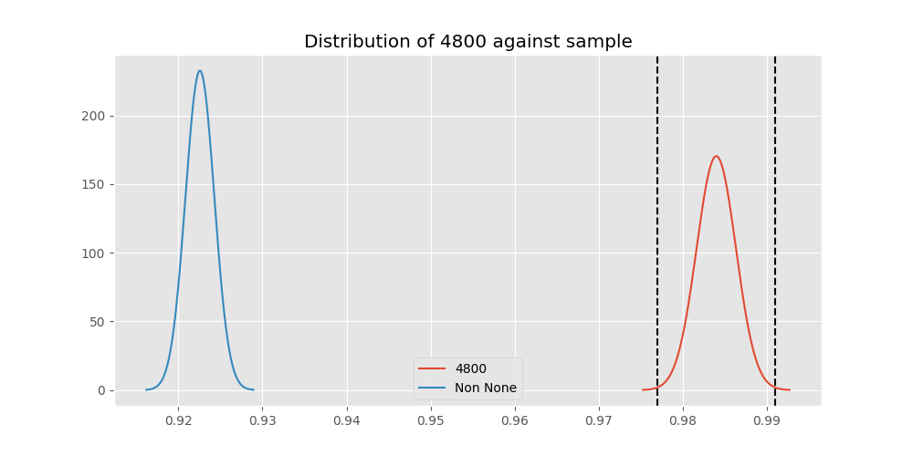 
Out of 10 tests, there were 7 rejections from 10 independent-t test.
Out of 10 tests, there were 6 rejections from 10 Man Whitney u-tests.
## Testing Results for 4800 against 128000 
4800 has a success rate of 0.9839944328462074
128000 has a success rate of 0.7627118644067796
$H_{0}$: There is not a difference between 4800 and 128000
$H_{A}$: There is a difference between 4800 and 128000
An $/alpha$ of 0.002777777777777778 was used in this test.
__independent t-testing__: With a t-statistic of 12.178690682827778 and a p-value of 2.5420146450569473e-33, _we **reject** the null hypothssis_
__Man-Whitney testing__: With a u-statistic of 103544.0 and a p-value of 1.4423870089048027e-32, _we **reject** the null hypothssis_
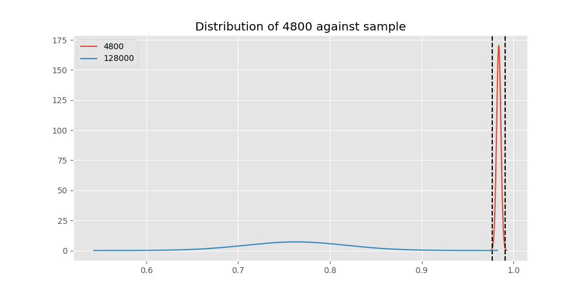 
## Testing Results for 4800 against 9600 
4800 has a success rate of 0.9839944328462074
9600 has a success rate of 0.911736952892502
$H_{0}$: There is not a difference between 4800 and 9600
$H_{A}$: There is a difference between 4800 and 9600
An $/alpha$ of 0.002777777777777778 was used in this test.
__independent t-testing__: With a t-statistic of 13.3840207115037 and a p-value of 1.2162617142077254e-40, _we **reject** the null hypothssis_
__Man-Whitney testing__: With a u-statistic of 21228070.0 and a p-value of 1.9453724300587976e-40, _we **reject** the null hypothssis_
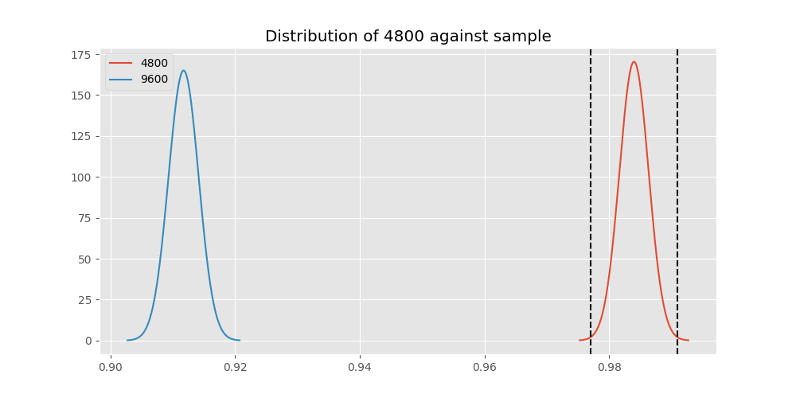 
## Testing Results for 4800 against 9766 
4800 has a success rate of 0.9839944328462074
9766 has a success rate of 0.9770114942528736
$H_{0}$: There is not a difference between 4800 and 9766
$H_{A}$: There is a difference between 4800 and 9766
An $/alpha$ of 0.002777777777777778 was used in this test.
__independent t-testing__: With a t-statistic of 0.5079743556608318 and a p-value of 0.611509190680608, _we failed to reject the null hypothssis_
__Man-Whitney testing__: With a u-statistic of 125892.0 and a p-value of 0.6116307405711391, _we failed to reject the null hypothssis_
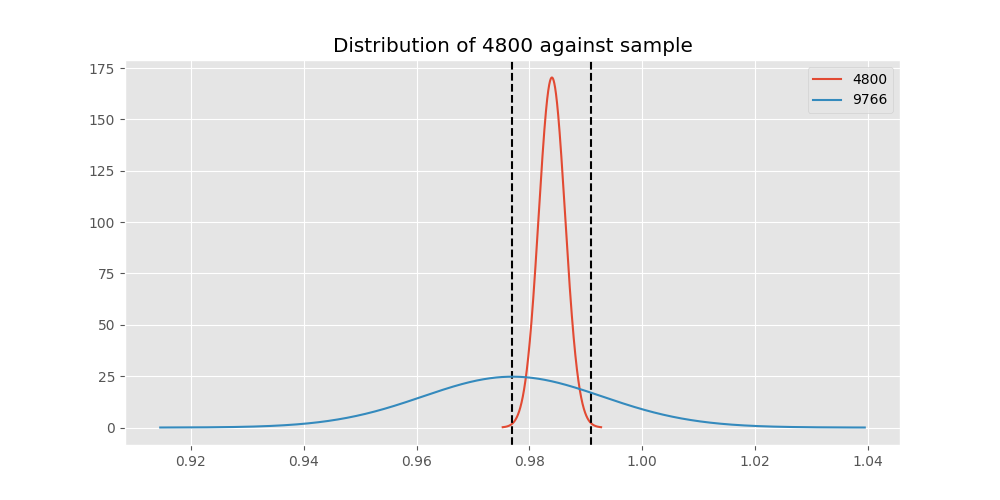 
## Testing Results for 4800 against 1200 
4800 has a success rate of 0.9839944328462074
1200 has a success rate of 0.9236590983876275
$H_{0}$: There is not a difference between 4800 and 1200
$H_{A}$: There is a difference between 4800 and 1200
An $/alpha$ of 0.002777777777777778 was used in this test.
__independent t-testing__: With a t-statistic of 11.583248083374484 and a p-value of 8.305710202959042e-31, _we **reject** the null hypothssis_
__Man-Whitney testing__: With a u-statistic of 9261060.0 and a p-value of 1.349762752223752e-30, _we **reject** the null hypothssis_
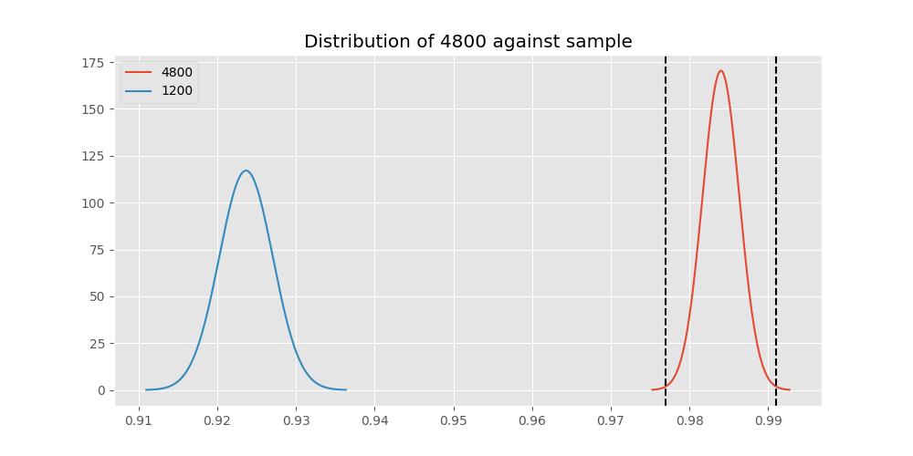 
## Testing Results for 4800 against 200 
4800 has a success rate of 0.9839944328462074
200 has a success rate of 0.998960498960499
$H_{0}$: There is not a difference between 4800 and 200
$H_{A}$: There is a difference between 4800 and 200
An $/alpha$ of 0.002777777777777778 was used in this test.
__independent t-testing__: With a t-statistic of -5.842187736764512 and a p-value of 5.597931983014086e-09, _we **reject** the null hypothssis_
__Man-Whitney testing__: With a u-statistic of 1361705.0 and a p-value of 0.0002604722049353837, _we **reject** the null hypothssis_
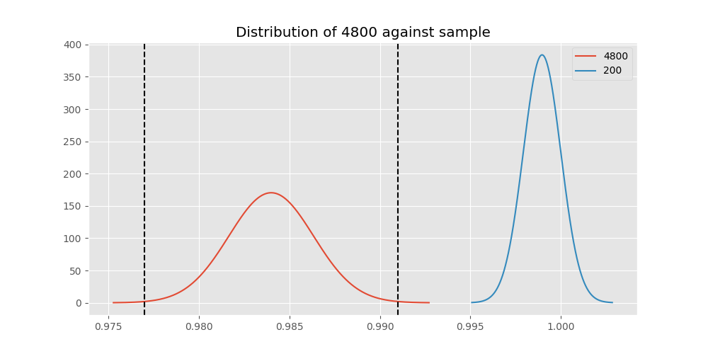 
## Testing Results for 4800 against 38400 
4800 has a success rate of 0.9839944328462074
38400 has a success rate of 0.3508771929824561
$H_{0}$: There is not a difference between 4800 and 38400
$H_{A}$: There is a difference between 4800 and 38400
An $/alpha$ of 0.002777777777777778 was used in this test.
__independent t-testing__: With a t-statistic of 33.564712161161204 and a p-value of 2.895285460221212e-209, _we **reject** the null hypothssis_
__Man-Whitney testing__: With a u-statistic of 133767.0 and a p-value of 5.128326294119444e-179, _we **reject** the null hypothssis_
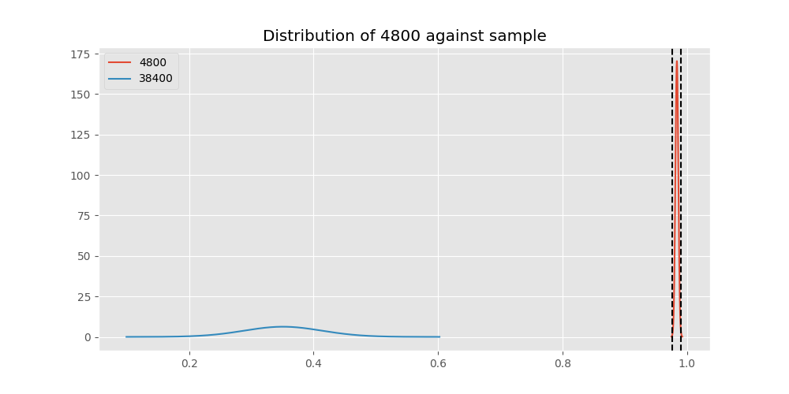 
## Testing Results for 4800 against 2400 
4800 has a success rate of 0.9839944328462074
2400 has a success rate of 0.9869848156182213
$H_{0}$: There is not a difference between 4800 and 2400
$H_{A}$: There is a difference between 4800 and 2400
An $/alpha$ of 0.002777777777777778 was used in this test.
__independent t-testing__: With a t-statistic of -0.4809680646983755 and a p-value of 0.6305707666772116, _we failed to reject the null hypothssis_
__Man-Whitney testing__: With a u-statistic of 660476.0 and a p-value of 0.6305860732449757, _we failed to reject the null hypothssis_
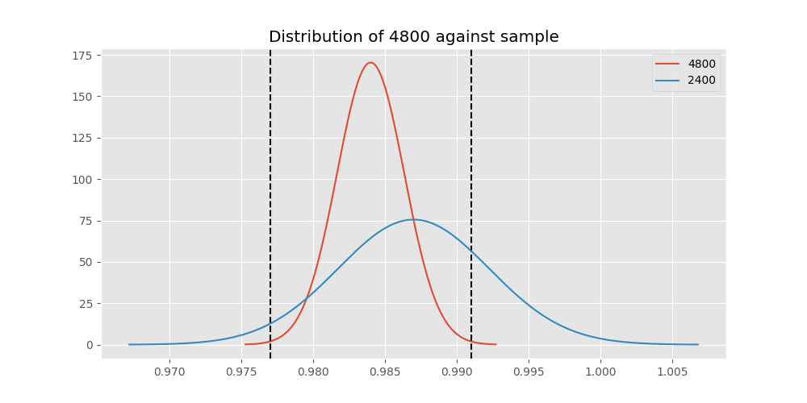 
## Testing Results for 4800 against 12500 
4800 has a success rate of 0.9839944328462074
12500 has a success rate of 0.9948320413436692
$H_{0}$: There is not a difference between 4800 and 12500
$H_{A}$: There is a difference between 4800 and 12500
An $/alpha$ of 0.002777777777777778 was used in this test.
__independent t-testing__: With a t-statistic of -1.6621971584750204 and a p-value of 0.09656941847011857, _we failed to reject the null hypothssis_
__Man-Whitney testing__: With a u-statistic of 550092.0 and a p-value of 0.09659098663665654, _we failed to reject the null hypothssis_
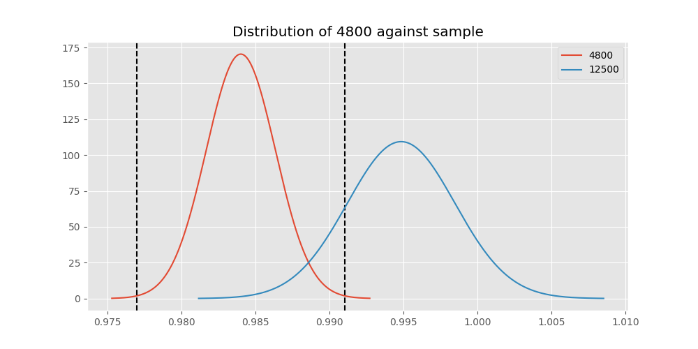 
## Testing Results for 4800 against 19200 
4800 has a success rate of 0.9839944328462074
19200 has a success rate of 0.9966777408637874
$H_{0}$: There is not a difference between 4800 and 19200
$H_{A}$: There is a difference between 4800 and 19200
An $/alpha$ of 0.002777777777777778 was used in this test.
__independent t-testing__: With a t-statistic of -4.192321882848958 and a p-value of 2.833691288501862e-05, _we **reject** the null hypothssis_
__Man-Whitney testing__: With a u-statistic of 1281153.0 and a p-value of 0.003308071815067368, _we failed to reject the null hypothssis_
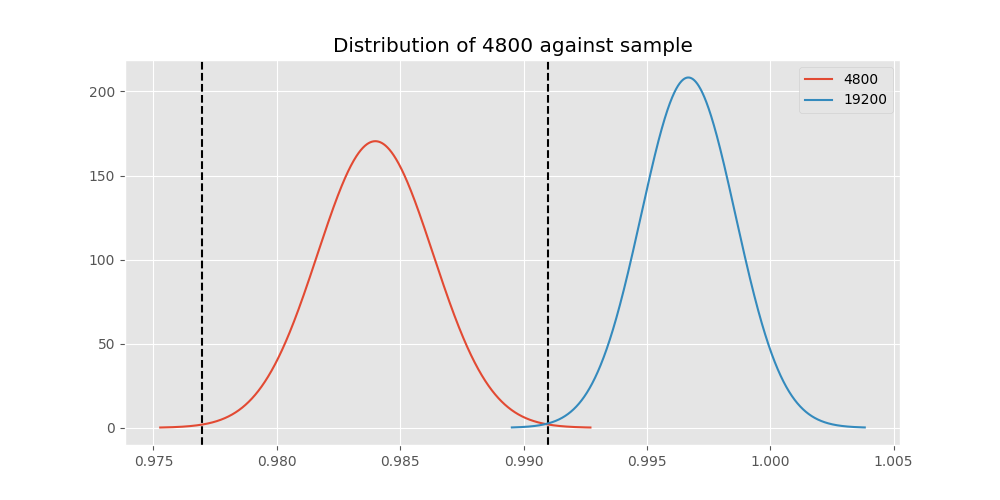 
## Testing Results for 4800 against 0 
4800 has a success rate of 0.9839944328462074
0 has a success rate of 0.7672253258845437
$H_{0}$: There is not a difference between 4800 and 0
$H_{A}$: There is a difference between 4800 and 0
An $/alpha$ of 0.002777777777777778 was used in this test.
__independent t-testing__: With a t-statistic of 22.658653613951827 and a p-value of 5.334423328514599e-106, _we **reject** the null hypothssis_
__Man-Whitney testing__: With a u-statistic of 938943.0 and a p-value of 4.513236216865601e-99, _we **reject** the null hypothssis_
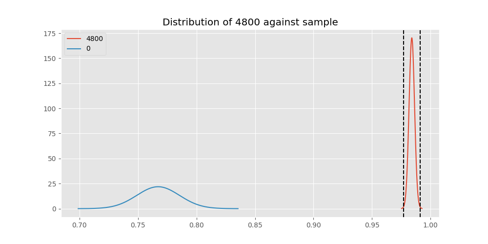 
