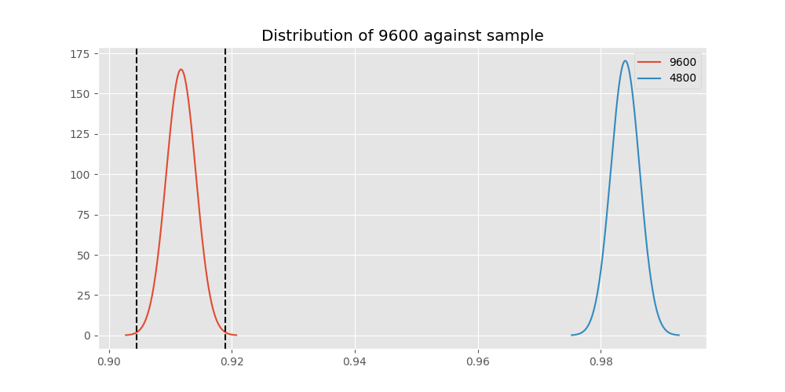
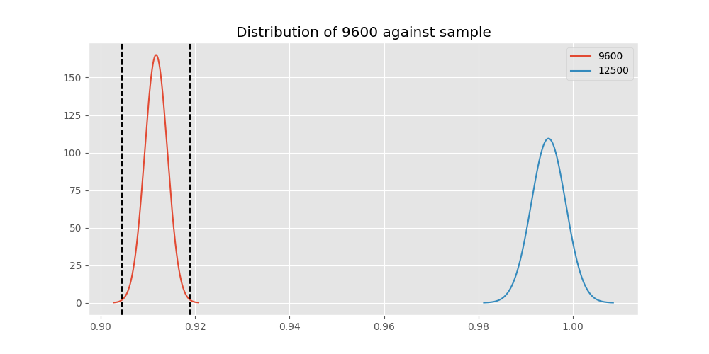

# Testing Results For 9600 
$H_{0}$: There is not a difference in collection success against 9600 
$H_{A}$: There is a difference in collection success against 9600
An $\alpha$ of 0.002777777777777778 was used 
Out of 10 tests, there were 8 rejections from 10 independent-t test.
Out of 10 tests, there were 8 rejections from 10 Man Whitney u-tests.
## Testing Results for 9600 against 128000 
9600 has a success rate of 0.911736952892502
128000 has a success rate of 0.7627118644067796
$H_{0}$: There is not a difference between 9600 and 128000
$H_{A}$: There is a difference between 9600 and 128000
An $/alpha$ of 0.002777777777777778 was used in this test.
__independent t-testing__: With a t-statistic of 4.0155807260017795 and a p-value of 5.9612671429247404e-05, _we **reject** the null hypothssis_
__Man-Whitney testing__: With a u-statistic of 466988.5 and a p-value of 5.9861930618880434e-05, _we **reject** the null hypothssis_
 
## Testing Results for 9600 against 9766 
9600 has a success rate of 0.911736952892502
9766 has a success rate of 0.9770114942528736
$H_{0}$: There is not a difference between 9600 and 9766
$H_{A}$: There is a difference between 9600 and 9766
An $/alpha$ of 0.002777777777777778 was used in this test.
__independent t-testing__: With a t-statistic of -2.1442010680512107 and a p-value of 0.032034117313079584, _we failed to reject the null hypothssis_
__Man-Whitney testing__: With a u-statistic of 560180.5 and a p-value of 0.03204126101708757, _we failed to reject the null hypothssis_
 
## Testing Results for 9600 against 1200 
9600 has a success rate of 0.911736952892502
1200 has a success rate of 0.9236590983876275
$H_{0}$: There is not a difference between 9600 and 1200
$H_{A}$: There is a difference between 9600 and 1200
An $/alpha$ of 0.002777777777777778 was used in this test.
__independent t-testing__: With a t-statistic of -2.782389818920597 and a p-value of 0.005401112608021061, _we failed to reject the null hypothssis_
__Man-Whitney testing__: With a u-statistic of 41369143.0 and a p-value of 0.005403923234506852, _we failed to reject the null hypothssis_
 
## Testing Results for 9600 against 4800 
9600 has a success rate of 0.911736952892502
4800 has a success rate of 0.9839944328462074
$H_{0}$: There is not a difference between 9600 and 4800
$H_{A}$: There is a difference between 9600 and 4800
An $/alpha$ of 0.002777777777777778 was used in this test.
__independent t-testing__: With a t-statistic of -21.473106184130902 and a p-value of 5.16242722114807e-100, _we **reject** the null hypothssis_
__Man-Whitney testing__: With a u-statistic of 18367028.0 and a p-value of 1.9453724300587976e-40, _we **reject** the null hypothssis_
 
## Testing Results for 9600 against 200 
9600 has a success rate of 0.911736952892502
200 has a success rate of 0.998960498960499
$H_{0}$: There is not a difference between 9600 and 200
$H_{A}$: There is a difference between 9600 and 200
An $/alpha$ of 0.002777777777777778 was used in this test.
__independent t-testing__: With a t-statistic of -33.15244621045887 and a p-value of 2.0173726855732133e-231, _we **reject** the null hypothssis_
__Man-Whitney testing__: With a u-statistic of 6048729.5 and a p-value of 2.0431416661578627e-21, _we **reject** the null hypothssis_
 
## Testing Results for 9600 against 38400 
9600 has a success rate of 0.911736952892502
38400 has a success rate of 0.3508771929824561
$H_{0}$: There is not a difference between 9600 and 38400
$H_{A}$: There is a difference between 9600 and 38400
An $/alpha$ of 0.002777777777777778 was used in this test.
__independent t-testing__: With a t-statistic of 14.839117514528112 and a p-value of 1.963000613725507e-49, _we **reject** the null hypothssis_
__Man-Whitney testing__: With a u-statistic of 612863.0 and a p-value of 4.595786196927554e-49, _we **reject** the null hypothssis_
 
## Testing Results for 9600 against 2400 
9600 has a success rate of 0.911736952892502
2400 has a success rate of 0.9869848156182213
$H_{0}$: There is not a difference between 9600 and 2400
$H_{A}$: There is a difference between 9600 and 2400
An $/alpha$ of 0.002777777777777778 was used in this test.
__independent t-testing__: With a t-statistic of -12.949321619577319 and a p-value of 2.1399468260024217e-34, _we **reject** the null hypothssis_
__Man-Whitney testing__: With a u-statistic of 2936641.5 and a p-value of 1.3985720409658674e-08, _we **reject** the null hypothssis_
 
## Testing Results for 9600 against 12500 
9600 has a success rate of 0.911736952892502
12500 has a success rate of 0.9948320413436692
$H_{0}$: There is not a difference between 9600 and 12500
$H_{A}$: There is a difference between 9600 and 12500
An $/alpha$ of 0.002777777777777778 was used in this test.
__independent t-testing__: With a t-statistic of -18.983153449158483 and a p-value of 1.4975049849522545e-66, _we **reject** the null hypothssis_
__Man-Whitney testing__: With a u-statistic of 2444330.5 and a p-value of 8.906524380552604e-09, _we **reject** the null hypothssis_
 
## Testing Results for 9600 against 19200 
9600 has a success rate of 0.911736952892502
19200 has a success rate of 0.9966777408637874
$H_{0}$: There is not a difference between 9600 and 19200
$H_{A}$: There is a difference between 9600 and 19200
An $/alpha$ of 0.002777777777777778 was used in this test.
__independent t-testing__: With a t-statistic of -27.540331864436215 and a p-value of 5.733201188940195e-156, _we **reject** the null hypothssis_
__Man-Whitney testing__: With a u-statistic of 5691957.0 and a p-value of 3.2245098826264857e-19, _we **reject** the null hypothssis_
 
## Testing Results for 9600 against 0 
9600 has a success rate of 0.911736952892502
0 has a success rate of 0.7672253258845437
$H_{0}$: There is not a difference between 9600 and 0
$H_{A}$: There is a difference between 9600 and 0
An $/alpha$ of 0.002777777777777778 was used in this test.
__independent t-testing__: With a t-statistic of 11.324523650927388 and a p-value of 1.3259976730946525e-29, _we **reject** the null hypothssis_
__Man-Whitney testing__: With a u-statistic of 4233691.0 and a p-value of 1.753564103693323e-29, _we **reject** the null hypothssis_
 
