# Testing Results For 9766 
$H_{0}$: There is not a difference in collection success against 9766 
$H_{A}$: There is a difference in collection success against 9766
An $\alpha$ of 0.002777777777777778 was used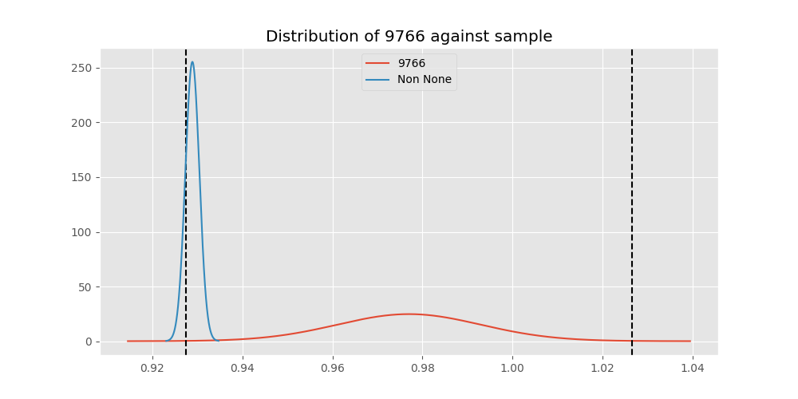 
Out of 10 tests, there were 3 rejections from 10 independent-t test.
Out of 10 tests, there were 4 rejections from 10 Man Whitney u-tests.
## Testing Results for 9766 against 128000 
9766 has a success rate of 0.9770114942528736
128000 has a success rate of 0.7627118644067796
$H_{0}$: There is not a difference between 9766 and 128000
$H_{A}$: There is a difference between 9766 and 128000
An $/alpha$ of 0.002777777777777778 was used in this test.
__independent t-testing__: With a t-statistic of 4.290184803690716 and a p-value of 3.2572332293562166e-05, _we **reject** the null hypothssis_
__Man-Whitney testing__: With a u-statistic of 3116.5 and a p-value of 5.1198510050596593e-05, _we **reject** the null hypothssis_
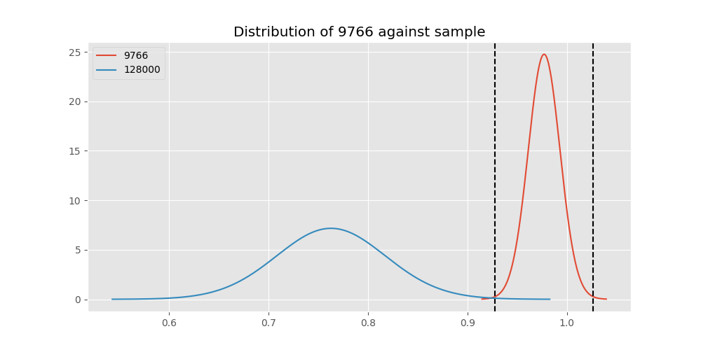 
## Testing Results for 9766 against 9600 
9766 has a success rate of 0.9770114942528736
9600 has a success rate of 0.911736952892502
$H_{0}$: There is not a difference between 9766 and 9600
$H_{A}$: There is a difference between 9766 and 9600
An $/alpha$ of 0.002777777777777778 was used in this test.
__independent t-testing__: With a t-statistic of 2.1442010680512107 and a p-value of 0.032034117313079584, _we failed to reject the null hypothssis_
__Man-Whitney testing__: With a u-statistic of 638418.5 and a p-value of 0.03204126101708757, _we failed to reject the null hypothssis_
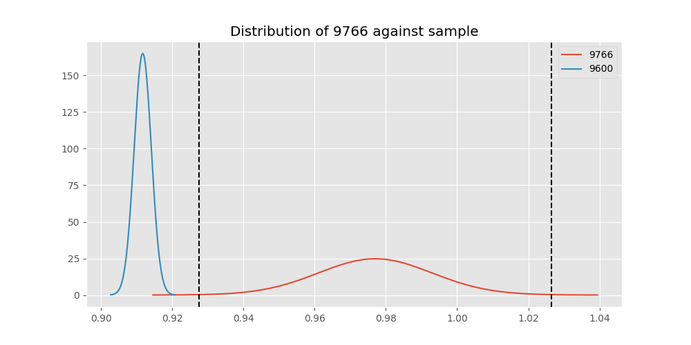 
## Testing Results for 9766 against 1200 
9766 has a success rate of 0.9770114942528736
1200 has a success rate of 0.9236590983876275
$H_{0}$: There is not a difference between 9766 and 1200
$H_{A}$: There is a difference between 9766 and 1200
An $/alpha$ of 0.002777777777777778 was used in this test.
__independent t-testing__: With a t-statistic of 1.8694799184963997 and a p-value of 0.06160345861056654, _we failed to reject the null hypothssis_
__Man-Whitney testing__: With a u-statistic of 278499.0 and a p-value of 0.06161788476978813, _we failed to reject the null hypothssis_
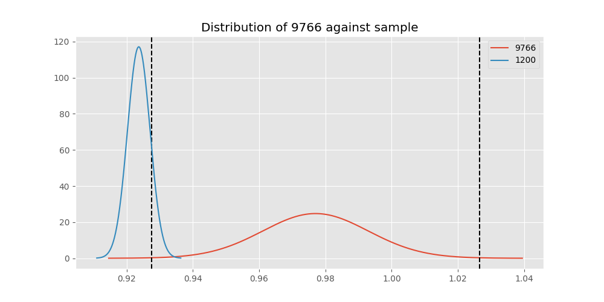 
## Testing Results for 9766 against 4800 
9766 has a success rate of 0.9770114942528736
4800 has a success rate of 0.9839944328462074
$H_{0}$: There is not a difference between 9766 and 4800
$H_{A}$: There is a difference between 9766 and 4800
An $/alpha$ of 0.002777777777777778 was used in this test.
__independent t-testing__: With a t-statistic of -0.5079743556608318 and a p-value of 0.611509190680608, _we failed to reject the null hypothssis_
__Man-Whitney testing__: With a u-statistic of 124146.0 and a p-value of 0.6116307405711391, _we failed to reject the null hypothssis_
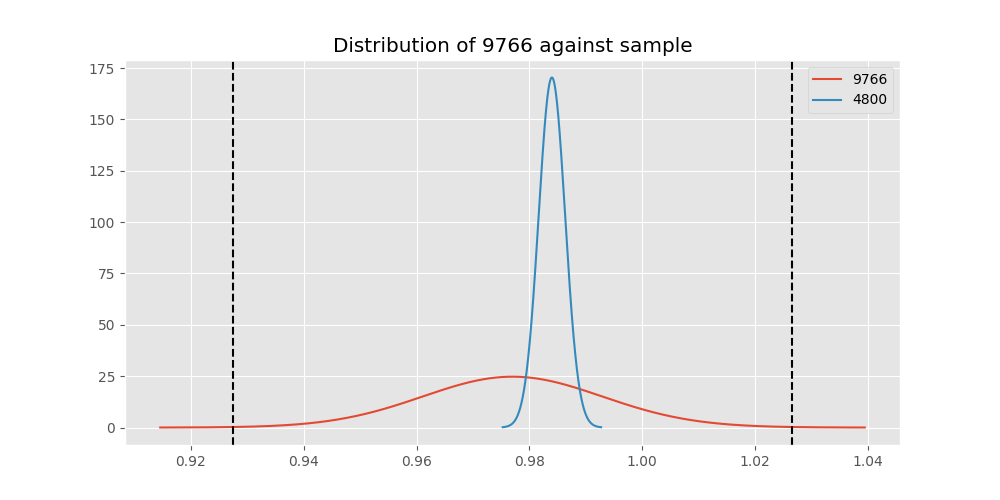 
## Testing Results for 9766 against 200 
9766 has a success rate of 0.9770114942528736
200 has a success rate of 0.998960498960499
$H_{0}$: There is not a difference between 9766 and 200
$H_{A}$: There is a difference between 9766 and 200
An $/alpha$ of 0.002777777777777778 was used in this test.
__independent t-testing__: With a t-statistic of -1.3553836931972834 and a p-value of 0.17881534007209862, _we failed to reject the null hypothssis_
__Man-Whitney testing__: With a u-statistic of 40928.5 and a p-value of 0.0002448562216711762, _we **reject** the null hypothssis_
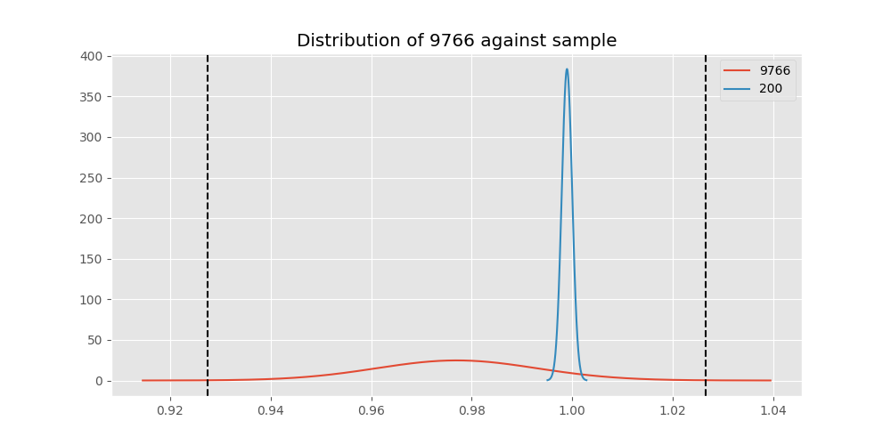 
## Testing Results for 9766 against 38400 
9766 has a success rate of 0.9770114942528736
38400 has a success rate of 0.3508771929824561
$H_{0}$: There is not a difference between 9766 and 38400
$H_{A}$: There is a difference between 9766 and 38400
An $/alpha$ of 0.002777777777777778 was used in this test.
__independent t-testing__: With a t-statistic of 11.32930733711292 and a p-value of 1.3454027692882281e-21, _we **reject** the null hypothssis_
__Man-Whitney testing__: With a u-statistic of 4032.0 and a p-value of 1.7667602053423378e-16, _we **reject** the null hypothssis_
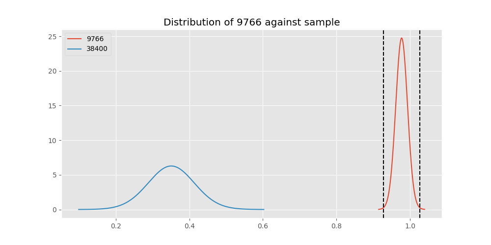 
## Testing Results for 9766 against 2400 
9766 has a success rate of 0.9770114942528736
2400 has a success rate of 0.9869848156182213
$H_{0}$: There is not a difference between 9766 and 2400
$H_{A}$: There is a difference between 9766 and 2400
An $/alpha$ of 0.002777777777777778 was used in this test.
__independent t-testing__: With a t-statistic of -0.7104032976878943 and a p-value of 0.4777573935700068, _we failed to reject the null hypothssis_
__Man-Whitney testing__: With a u-statistic of 19853.5 and a p-value of 0.4783565290173376, _we failed to reject the null hypothssis_
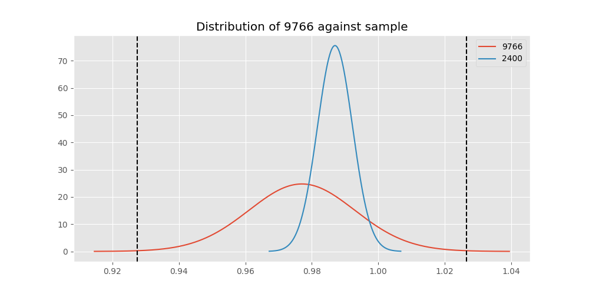 
## Testing Results for 9766 against 12500 
9766 has a success rate of 0.9770114942528736
12500 has a success rate of 0.9948320413436692
$H_{0}$: There is not a difference between 9766 and 12500
$H_{A}$: There is a difference between 9766 and 12500
An $/alpha$ of 0.002777777777777778 was used in this test.
__independent t-testing__: With a t-statistic of -1.0756319853465557 and a p-value of 0.2848177505617992, _we failed to reject the null hypothssis_
__Man-Whitney testing__: With a u-statistic of 16534.5 and a p-value of 0.10154016890477036, _we failed to reject the null hypothssis_
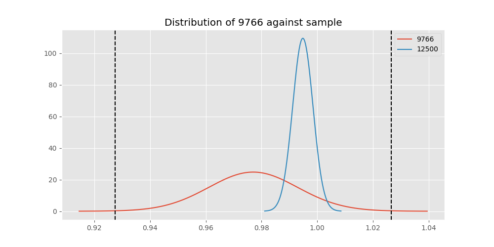 
## Testing Results for 9766 against 19200 
9766 has a success rate of 0.9770114942528736
19200 has a success rate of 0.9966777408637874
$H_{0}$: There is not a difference between 9766 and 19200
$H_{A}$: There is a difference between 9766 and 19200
An $/alpha$ of 0.002777777777777778 was used in this test.
__independent t-testing__: With a t-statistic of -1.208466103563947 and a p-value of 0.23008953757753056, _we failed to reject the null hypothssis_
__Man-Whitney testing__: With a u-statistic of 38508.0 and a p-value of 0.013566838882898561, _we failed to reject the null hypothssis_
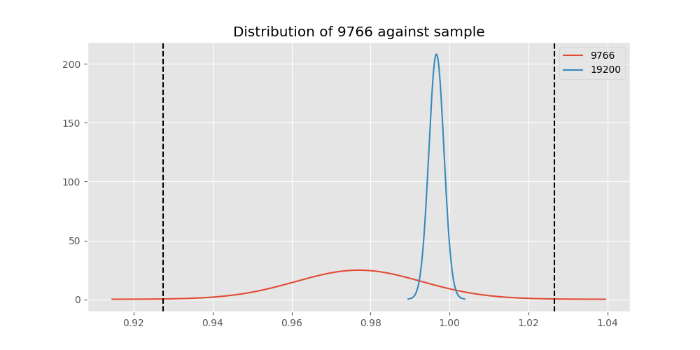 
## Testing Results for 9766 against 0 
9766 has a success rate of 0.9770114942528736
0 has a success rate of 0.7672253258845437
$H_{0}$: There is not a difference between 9766 and 0
$H_{A}$: There is a difference between 9766 and 0
An $/alpha$ of 0.002777777777777778 was used in this test.
__independent t-testing__: With a t-statistic of 4.5764650497217225 and a p-value of 5.711189637325272e-06, _we **reject** the null hypothssis_
__Man-Whitney testing__: With a u-statistic of 28260.0 and a p-value of 6.654017373638392e-06, _we **reject** the null hypothssis_
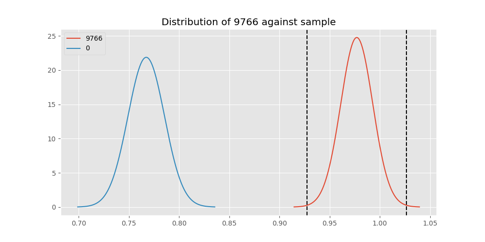 
