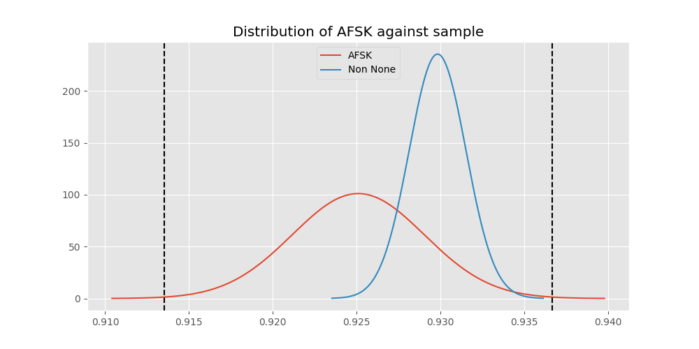
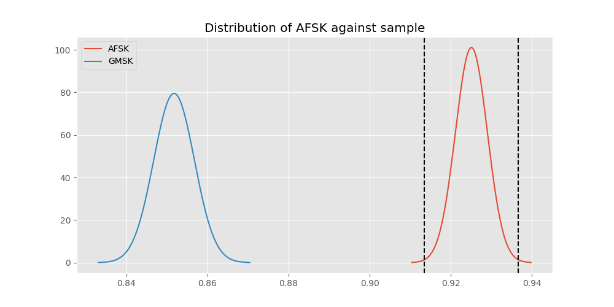
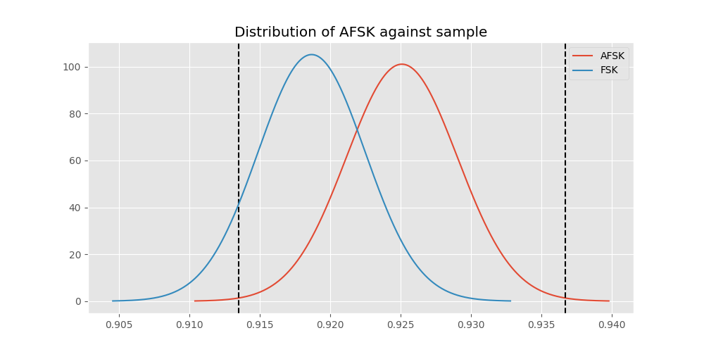
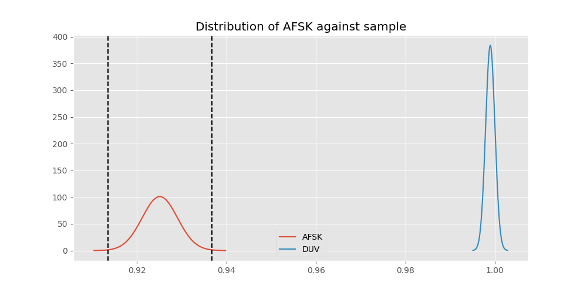
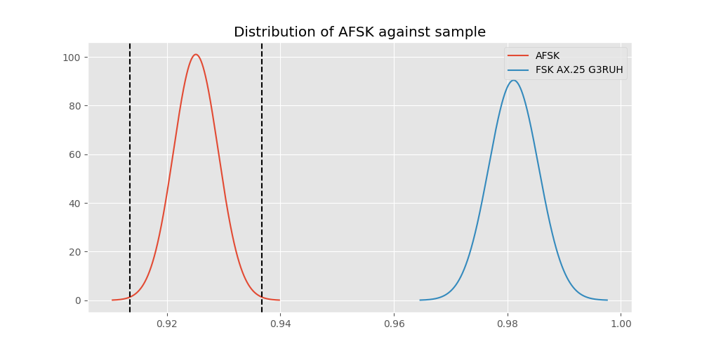
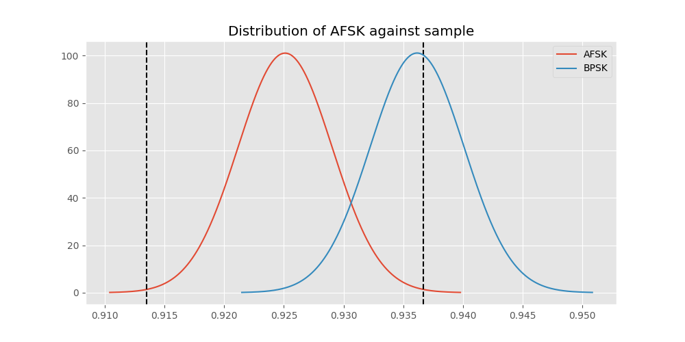
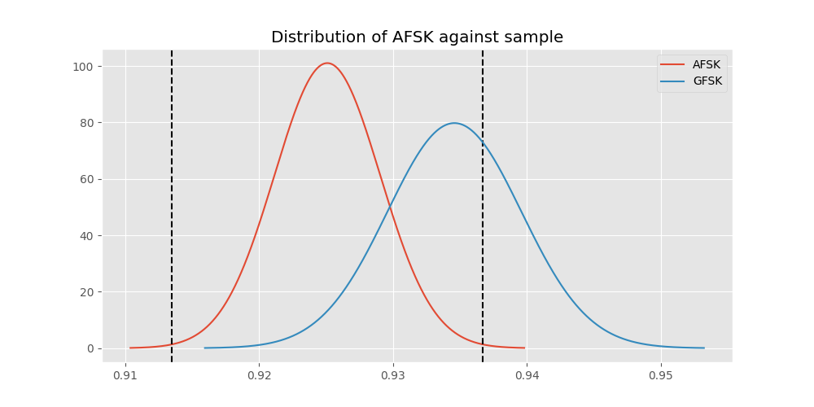
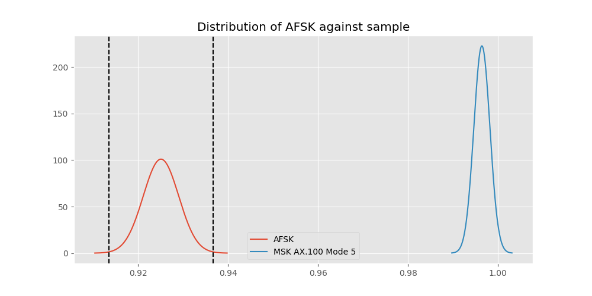

# Testing Results For AFSK 
$H_{0}$: There is not a difference in collection success against AFSK 
$H_{A}$: There is a difference in collection success against AFSK
An $\alpha$ of 0.0033333333333333335 was used 
Out of 7 tests, there were 4 rejections from 7 independent-t test.
Out of 7 tests, there were 4 rejections from 7 Man Whitney u-tests.
## Testing Results for AFSK against GMSK 
AFSK has a success rate of 0.9251012145748988
GMSK has a success rate of 0.8517632994620442
$H_{0}$: There is not a difference between AFSK and GMSK
$H_{A}$: There is a difference between AFSK and GMSK
An $/alpha$ of 0.0033333333333333335 was used in this test.
__independent t-testing__: With a t-statistic of 11.287647364756824 and a p-value of 2.3256417265165762e-29, _we **reject** the null hypothssis_
__Man-Whitney testing__: With a u-statistic of 11975485.5 and a p-value of 3.520443603521049e-29, _we **reject** the null hypothssis_
 
## Testing Results for AFSK against FSK 
AFSK has a success rate of 0.9251012145748988
FSK has a success rate of 0.9186897880539499
$H_{0}$: There is not a difference between AFSK and FSK
$H_{A}$: There is a difference between AFSK and FSK
An $/alpha$ of 0.0033333333333333335 was used in this test.
__independent t-testing__: With a t-statistic of 1.1674887588802758 and a p-value of 0.24304193913990807, _we failed to reject the null hypothssis_
__Man-Whitney testing__: With a u-statistic of 11611341.0 and a p-value of 0.24302510749964956, _we failed to reject the null hypothssis_
 
## Testing Results for AFSK against DUV 
AFSK has a success rate of 0.9251012145748988
DUV has a success rate of 0.998960498960499
$H_{0}$: There is not a difference between AFSK and DUV
$H_{A}$: There is a difference between AFSK and DUV
An $/alpha$ of 0.0033333333333333335 was used in this test.
__independent t-testing__: With a t-statistic of -18.090690815152012 and a p-value of 6.785538856070922e-71, _we **reject** the null hypothssis_
__Man-Whitney testing__: With a u-statistic of 1980576.0 and a p-value of 6.248213356720007e-18, _we **reject** the null hypothssis_
 
## Testing Results for AFSK against FSK AX.25 G3RUH 
AFSK has a success rate of 0.9251012145748988
FSK AX.25 G3RUH has a success rate of 0.9811122770199371
$H_{0}$: There is not a difference between AFSK and FSK AX.25 G3RUH
$H_{A}$: There is a difference between AFSK and FSK AX.25 G3RUH
An $/alpha$ of 0.0033333333333333335 was used in this test.
__independent t-testing__: With a t-statistic of -6.38709200441965 and a p-value of 1.8323015224869618e-10, _we **reject** the null hypothssis_
__Man-Whitney testing__: With a u-statistic of 1999858.5 and a p-value of 1.9701323362594972e-10, _we **reject** the null hypothssis_
 
## Testing Results for AFSK against BPSK 
AFSK has a success rate of 0.9251012145748988
BPSK has a success rate of 0.9361646690984888
$H_{0}$: There is not a difference between AFSK and BPSK
$H_{A}$: There is a difference between AFSK and BPSK
An $/alpha$ of 0.0033333333333333335 was used in this test.
__independent t-testing__: With a t-statistic of -1.9711469827900128 and a p-value of 0.0487403074371672, _we failed to reject the null hypothssis_
__Man-Whitney testing__: With a u-statistic of 8437482.0 and a p-value of 0.048747522924186014, _we failed to reject the null hypothssis_
 
## Testing Results for AFSK against GFSK 
AFSK has a success rate of 0.9251012145748988
GFSK has a success rate of 0.9345870809484873
$H_{0}$: There is not a difference between AFSK and GFSK
$H_{A}$: There is a difference between AFSK and GFSK
An $/alpha$ of 0.0033333333333333335 was used in this test.
__independent t-testing__: With a t-statistic of -1.4621348227037727 and a p-value of 0.14374987572110262, _we failed to reject the null hypothssis_
__Man-Whitney testing__: With a u-statistic of 5385879.0 and a p-value of 0.1437412231302876, _we failed to reject the null hypothssis_
 
## Testing Results for AFSK against MSK AX.100 Mode 5 
AFSK has a success rate of 0.9251012145748988
MSK AX.100 Mode 5 has a success rate of 0.9964125560538116
$H_{0}$: There is not a difference between AFSK and MSK AX.100 Mode 5
$H_{A}$: There is a difference between AFSK and MSK AX.100 Mode 5
An $/alpha$ of 0.0033333333333333335 was used in this test.
__independent t-testing__: With a t-statistic of -16.448116523819657 and a p-value of 2.185802400186372e-59, _we **reject** the null hypothssis_
__Man-Whitney testing__: With a u-statistic of 2301889.5 and a p-value of 4.547091622192063e-19, _we **reject** the null hypothssis_
 
