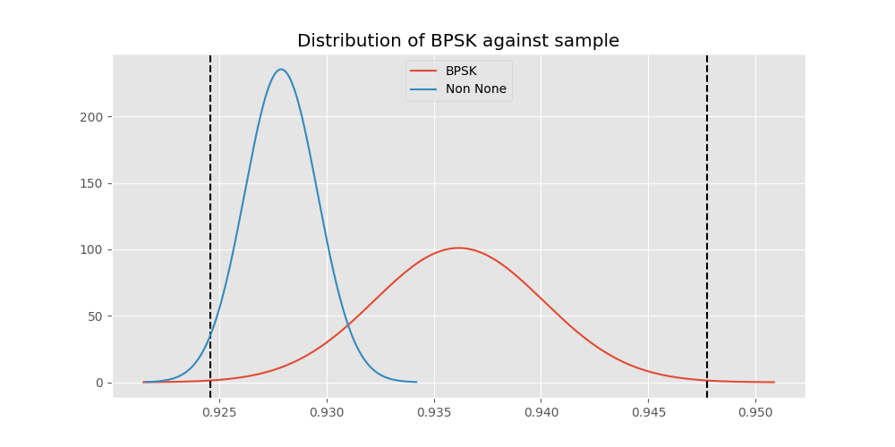
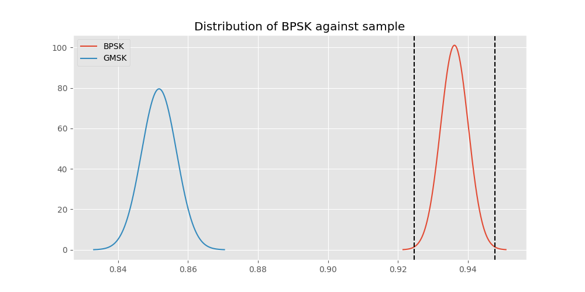
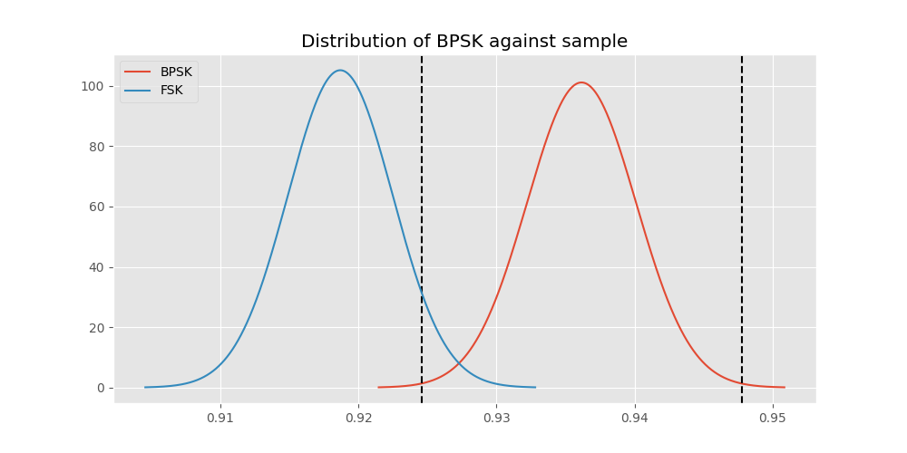
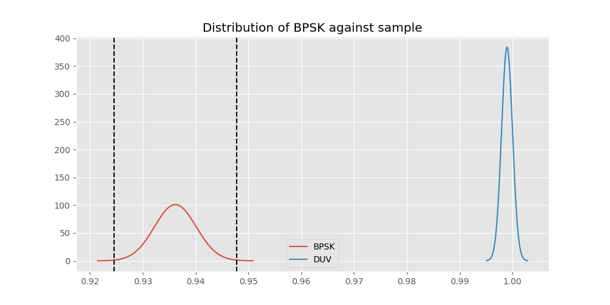
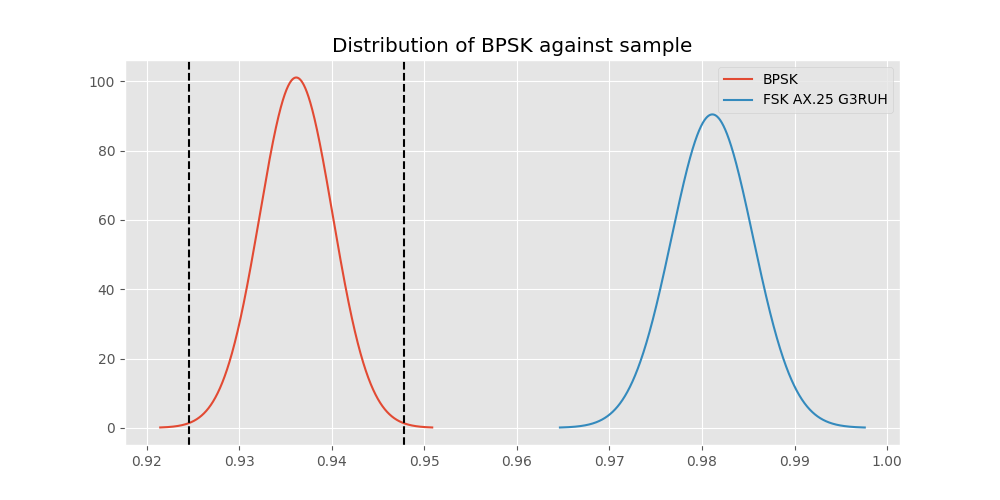
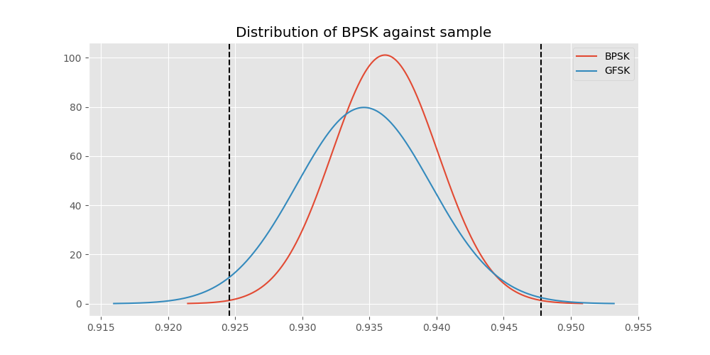
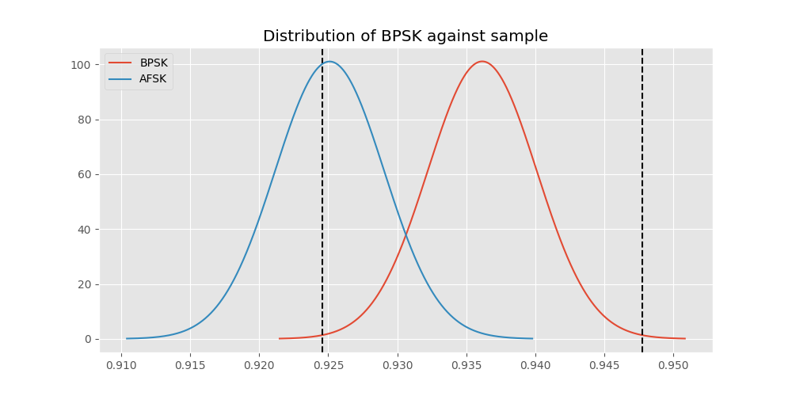

# Testing Results For BPSK 
$H_{0}$: There is not a difference in collection success against BPSK 
$H_{A}$: There is a difference in collection success against BPSK
An $\alpha$ of 0.0033333333333333335 was used 
Out of 7 tests, there were 5 rejections from 7 independent-t test.
Out of 7 tests, there were 5 rejections from 7 Man Whitney u-tests.
## Testing Results for BPSK against GMSK 
BPSK has a success rate of 0.9361646690984888
GMSK has a success rate of 0.8517632994620442
$H_{0}$: There is not a difference between BPSK and GMSK
$H_{A}$: There is a difference between BPSK and GMSK
An $/alpha$ of 0.0033333333333333335 was used in this test.
__independent t-testing__: With a t-statistic of 12.60776089855921 and a p-value of 3.9068967115655746e-36, _we **reject** the null hypothssis_
__Man-Whitney testing__: With a u-statistic of 10444369.5 and a p-value of 7.771786430951665e-36, _we **reject** the null hypothssis_
 
## Testing Results for BPSK against FSK 
BPSK has a success rate of 0.9361646690984888
FSK has a success rate of 0.9186897880539499
$H_{0}$: There is not a difference between BPSK and FSK
$H_{A}$: There is a difference between BPSK and FSK
An $/alpha$ of 0.0033333333333333335 was used in this test.
__independent t-testing__: With a t-statistic of 3.1393736309468094 and a p-value of 0.0016985536585924748, _we **reject** the null hypothssis_
__Man-Whitney testing__: With a u-statistic of 10133653.0 and a p-value of 0.0017020596801169804, _we **reject** the null hypothssis_
 
## Testing Results for BPSK against DUV 
BPSK has a success rate of 0.9361646690984888
DUV has a success rate of 0.998960498960499
$H_{0}$: There is not a difference between BPSK and DUV
$H_{A}$: There is a difference between BPSK and DUV
An $/alpha$ of 0.0033333333333333335 was used in this test.
__independent t-testing__: With a t-statistic of -15.387008343010745 and a p-value of 4.749958692973016e-52, _we **reject** the null hypothssis_
__Man-Whitney testing__: With a u-statistic of 1730152.0 and a p-value of 2.849423039022287e-15, _we **reject** the null hypothssis_
 
## Testing Results for BPSK against FSK AX.25 G3RUH 
BPSK has a success rate of 0.9361646690984888
FSK AX.25 G3RUH has a success rate of 0.9811122770199371
$H_{0}$: There is not a difference between BPSK and FSK AX.25 G3RUH
$H_{A}$: There is a difference between BPSK and FSK AX.25 G3RUH
An $/alpha$ of 0.0033333333333333335 was used in this test.
__independent t-testing__: With a t-statistic of -5.468251402153449 and a p-value of 4.7758609385314926e-08, _we **reject** the null hypothssis_
__Man-Whitney testing__: With a u-statistic of 1746606.5 and a p-value of 4.986379890933153e-08, _we **reject** the null hypothssis_
 
## Testing Results for BPSK against GFSK 
BPSK has a success rate of 0.9361646690984888
GFSK has a success rate of 0.9345870809484873
$H_{0}$: There is not a difference between BPSK and GFSK
$H_{A}$: There is a difference between BPSK and GFSK
An $/alpha$ of 0.0033333333333333335 was used in this test.
__independent t-testing__: With a t-statistic of 0.24828255282292946 and a p-value of 0.8039239127311515, _we failed to reject the null hypothssis_
__Man-Whitney testing__: With a u-statistic of 4701279.0 and a p-value of 0.8039144227871792, _we failed to reject the null hypothssis_
 
## Testing Results for BPSK against MSK AX.100 Mode 5 
BPSK has a success rate of 0.9361646690984888
MSK AX.100 Mode 5 has a success rate of 0.9964125560538116
$H_{0}$: There is not a difference between BPSK and MSK AX.100 Mode 5
$H_{A}$: There is a difference between BPSK and MSK AX.100 Mode 5
An $/alpha$ of 0.0033333333333333335 was used in this test.
__independent t-testing__: With a t-statistic of -13.901225400558221 and a p-value of 4.1114323652873245e-43, _we **reject** the null hypothssis_
__Man-Whitney testing__: With a u-statistic of 2010773.5 and a p-value of 5.328231765527198e-16, _we **reject** the null hypothssis_
 
## Testing Results for BPSK against AFSK 
BPSK has a success rate of 0.9361646690984888
AFSK has a success rate of 0.9251012145748988
$H_{0}$: There is not a difference between BPSK and AFSK
$H_{A}$: There is a difference between BPSK and AFSK
An $/alpha$ of 0.0033333333333333335 was used in this test.
__independent t-testing__: With a t-statistic of 1.9711469827900128 and a p-value of 0.0487403074371672, _we failed to reject the null hypothssis_
__Man-Whitney testing__: With a u-statistic of 8626266.0 and a p-value of 0.048747522924186014, _we failed to reject the null hypothssis_
 
