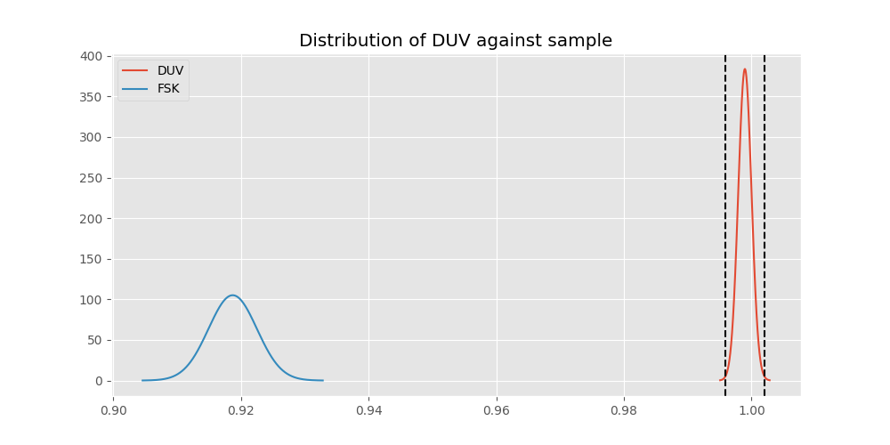

# Testing Results For DUV 
$H_{0}$: There is not a difference in collection success against DUV 
$H_{A}$: There is a difference in collection success against DUV
An $\alpha$ of 0.0033333333333333335 was used 
Out of 7 tests, there were 6 rejections from 7 independent-t test.
Out of 7 tests, there were 6 rejections from 7 Man Whitney u-tests.
## Testing Results for DUV against GMSK 
DUV has a success rate of 0.998960498960499
GMSK has a success rate of 0.8517632994620442
$H_{0}$: There is not a difference between DUV and GMSK
$H_{A}$: There is a difference between DUV and GMSK
An $/alpha$ of 0.0033333333333333335 was used in this test.
__independent t-testing__: With a t-statistic of 12.836159170129845 and a p-value of 3.1784256825068366e-37, _we **reject** the null hypothssis_
__Man-Whitney testing__: With a u-statistic of 2769493.5 and a p-value of 9.371675477534137e-37, _we **reject** the null hypothssis_
 
## Testing Results for DUV against FSK 
DUV has a success rate of 0.998960498960499
FSK has a success rate of 0.9186897880539499
$H_{0}$: There is not a difference between DUV and FSK
$H_{A}$: There is a difference between DUV and FSK
An $/alpha$ of 0.0033333333333333335 was used in this test.
__independent t-testing__: With a t-statistic of 9.096163145482226 and a p-value of 1.24123122695673e-19, _we **reject** the null hypothssis_
__Man-Whitney testing__: With a u-statistic of 2696777.0 and a p-value of 1.620685483324071e-19, _we **reject** the null hypothssis_
 
## Testing Results for DUV against FSK AX.25 G3RUH 
DUV has a success rate of 0.998960498960499
FSK AX.25 G3RUH has a success rate of 0.9811122770199371
$H_{0}$: There is not a difference between DUV and FSK AX.25 G3RUH
$H_{A}$: There is a difference between DUV and FSK AX.25 G3RUH
An $/alpha$ of 0.0033333333333333335 was used in this test.
__independent t-testing__: With a t-statistic of 3.9541949127211535 and a p-value of 7.958864343595576e-05, _we **reject** the null hypothssis_
__Man-Whitney testing__: With a u-statistic of 466574.5 and a p-value of 8.184846705807991e-05, _we **reject** the null hypothssis_
 
## Testing Results for DUV against BPSK 
DUV has a success rate of 0.998960498960499
BPSK has a success rate of 0.9361646690984888
$H_{0}$: There is not a difference between DUV and BPSK
$H_{A}$: There is a difference between DUV and BPSK
An $/alpha$ of 0.0033333333333333335 was used in this test.
__independent t-testing__: With a t-statistic of 7.948358537818578 and a p-value of 2.3378293656848824e-15, _we **reject** the null hypothssis_
__Man-Whitney testing__: With a u-statistic of 1962004.0 and a p-value of 2.849423039022287e-15, _we **reject** the null hypothssis_
 
## Testing Results for DUV against GFSK 
DUV has a success rate of 0.998960498960499
GFSK has a success rate of 0.9345870809484873
$H_{0}$: There is not a difference between DUV and GFSK
$H_{A}$: There is a difference between DUV and GFSK
An $/alpha$ of 0.0033333333333333335 was used in this test.
__independent t-testing__: With a t-statistic of 8.045983835389073 and a p-value of 1.1701320138403754e-15, _we **reject** the null hypothssis_
__Man-Whitney testing__: With a u-statistic of 1252263.0 and a p-value of 1.5649467228577746e-15, _we **reject** the null hypothssis_
 
## Testing Results for DUV against MSK AX.100 Mode 5 
DUV has a success rate of 0.998960498960499
MSK AX.100 Mode 5 has a success rate of 0.9964125560538116
$H_{0}$: There is not a difference between DUV and MSK AX.100 Mode 5
$H_{A}$: There is a difference between DUV and MSK AX.100 Mode 5
An $/alpha$ of 0.0033333333333333335 was used in this test.
__independent t-testing__: With a t-statistic of 1.181380615495045 and a p-value of 0.2375869358896933, _we failed to reject the null hypothssis_
__Man-Whitney testing__: With a u-statistic of 537681.5 and a p-value of 0.2376679475857556, _we failed to reject the null hypothssis_
 
## Testing Results for DUV against AFSK 
DUV has a success rate of 0.998960498960499
AFSK has a success rate of 0.9251012145748988
$H_{0}$: There is not a difference between DUV and AFSK
$H_{A}$: There is a difference between DUV and AFSK
An $/alpha$ of 0.0033333333333333335 was used in this test.
__independent t-testing__: With a t-statistic of 8.687149198303258 and a p-value of 4.857942064977767e-18, _we **reject** the null hypothssis_
__Man-Whitney testing__: With a u-statistic of 2296476.0 and a p-value of 6.248213356720007e-18, _we **reject** the null hypothssis_
 
