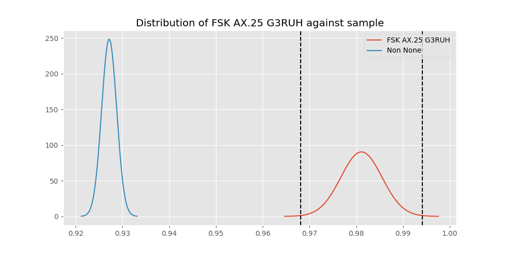
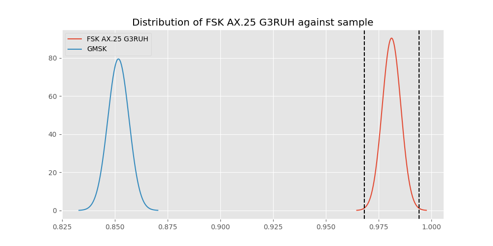
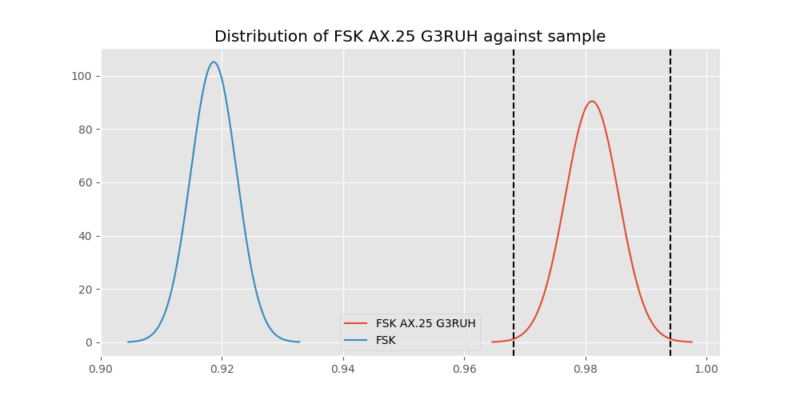
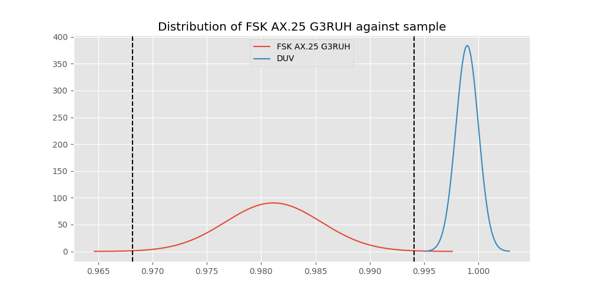
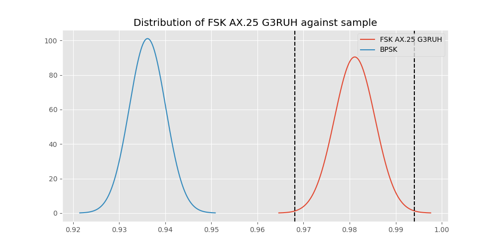
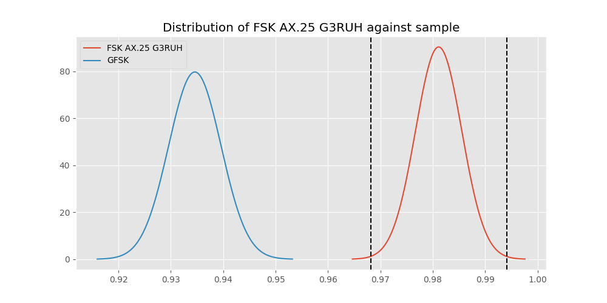
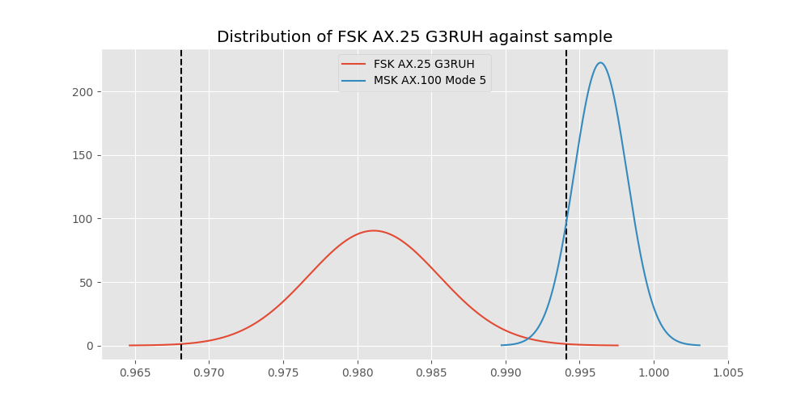
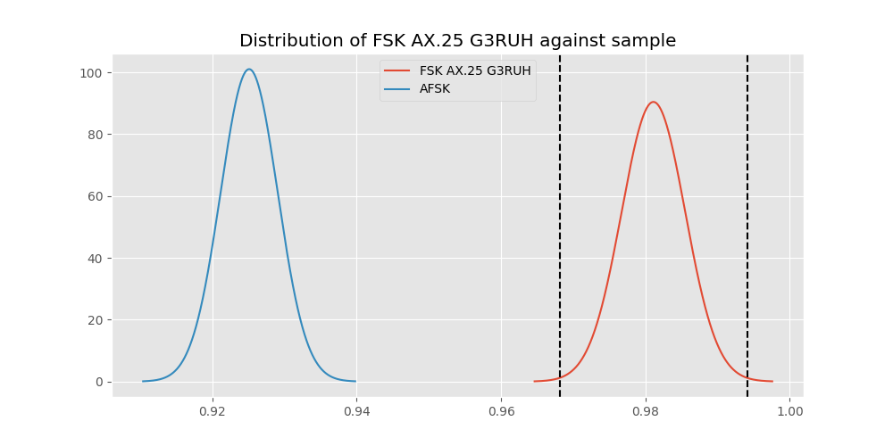

# Testing Results For FSK AX.25 G3RUH 
$H_{0}$: There is not a difference in collection success against FSK AX.25 G3RUH 
$H_{A}$: There is a difference in collection success against FSK AX.25 G3RUH
An $\alpha$ of 0.0033333333333333335 was used 
Out of 7 tests, there were 7 rejections from 7 independent-t test.
Out of 7 tests, there were 7 rejections from 7 Man Whitney u-tests.
## Testing Results for FSK AX.25 G3RUH against GMSK 
FSK AX.25 G3RUH has a success rate of 0.9811122770199371
GMSK has a success rate of 0.8517632994620442
$H_{0}$: There is not a difference between FSK AX.25 G3RUH and GMSK
$H_{A}$: There is a difference between FSK AX.25 G3RUH and GMSK
An $/alpha$ of 0.0033333333333333335 was used in this test.
__independent t-testing__: With a t-statistic of 11.082322890801095 and a p-value of 2.8794395014097857e-28, _we **reject** the null hypothssis_
__Man-Whitney testing__: With a u-statistic of 2700898.5 and a p-value of 5.27111818467214e-28, _we **reject** the null hypothssis_
 
## Testing Results for FSK AX.25 G3RUH against FSK 
FSK AX.25 G3RUH has a success rate of 0.9811122770199371
FSK has a success rate of 0.9186897880539499
$H_{0}$: There is not a difference between FSK AX.25 G3RUH and FSK
$H_{A}$: There is a difference between FSK AX.25 G3RUH and FSK
An $/alpha$ of 0.0033333333333333335 was used in this test.
__independent t-testing__: With a t-statistic of 6.894248927298171 and a p-value of 5.956566660193578e-12, _we **reject** the null hypothssis_
__Man-Whitney testing__: With a u-statistic of 2627408.0 and a p-value of 6.498999210734942e-12, _we **reject** the null hypothssis_
 
## Testing Results for FSK AX.25 G3RUH against DUV 
FSK AX.25 G3RUH has a success rate of 0.9811122770199371
DUV has a success rate of 0.998960498960499
$H_{0}$: There is not a difference between FSK AX.25 G3RUH and DUV
$H_{A}$: There is a difference between FSK AX.25 G3RUH and DUV
An $/alpha$ of 0.0033333333333333335 was used in this test.
__independent t-testing__: With a t-statistic of -3.9376095033547487 and a p-value of 8.76850068063941e-05, _we **reject** the null hypothssis_
__Man-Whitney testing__: With a u-statistic of 450211.5 and a p-value of 8.184846705807991e-05, _we **reject** the null hypothssis_
 
## Testing Results for FSK AX.25 G3RUH against BPSK 
FSK AX.25 G3RUH has a success rate of 0.9811122770199371
BPSK has a success rate of 0.9361646690984888
$H_{0}$: There is not a difference between FSK AX.25 G3RUH and BPSK
$H_{A}$: There is a difference between FSK AX.25 G3RUH and BPSK
An $/alpha$ of 0.0033333333333333335 was used in this test.
__independent t-testing__: With a t-statistic of 5.468251402153449 and a p-value of 4.7758609385314926e-08, _we **reject** the null hypothssis_
__Man-Whitney testing__: With a u-statistic of 1911007.5 and a p-value of 4.986379890933153e-08, _we **reject** the null hypothssis_
 
## Testing Results for FSK AX.25 G3RUH against GFSK 
FSK AX.25 G3RUH has a success rate of 0.9811122770199371
GFSK has a success rate of 0.9345870809484873
$H_{0}$: There is not a difference between FSK AX.25 G3RUH and GFSK
$H_{A}$: There is a difference between FSK AX.25 G3RUH and GFSK
An $/alpha$ of 0.0033333333333333335 was used in this test.
__independent t-testing__: With a t-statistic of 5.491927503163467 and a p-value of 4.2678892616510806e-08, _we **reject** the null hypothssis_
__Man-Whitney testing__: With a u-statistic of 1219745.0 and a p-value of 4.5395705959178144e-08, _we **reject** the null hypothssis_
 
## Testing Results for FSK AX.25 G3RUH against MSK AX.100 Mode 5 
FSK AX.25 G3RUH has a success rate of 0.9811122770199371
MSK AX.100 Mode 5 has a success rate of 0.9964125560538116
$H_{0}$: There is not a difference between FSK AX.25 G3RUH and MSK AX.100 Mode 5
$H_{A}$: There is a difference between FSK AX.25 G3RUH and MSK AX.100 Mode 5
An $/alpha$ of 0.0033333333333333335 was used in this test.
__independent t-testing__: With a t-statistic of -3.2131755826908903 and a p-value of 0.0013459380502760265, _we **reject** the null hypothssis_
__Man-Whitney testing__: With a u-statistic of 523168.5 and a p-value of 0.000725969357638514, _we **reject** the null hypothssis_
 
## Testing Results for FSK AX.25 G3RUH against AFSK 
FSK AX.25 G3RUH has a success rate of 0.9811122770199371
AFSK has a success rate of 0.9251012145748988
$H_{0}$: There is not a difference between FSK AX.25 G3RUH and AFSK
$H_{A}$: There is a difference between FSK AX.25 G3RUH and AFSK
An $/alpha$ of 0.0033333333333333335 was used in this test.
__independent t-testing__: With a t-statistic of 6.38709200441965 and a p-value of 1.8323015224869618e-10, _we **reject** the null hypothssis_
__Man-Whitney testing__: With a u-statistic of 2237179.5 and a p-value of 1.9701323362594972e-10, _we **reject** the null hypothssis_
 
