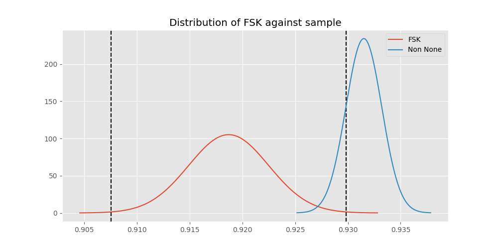
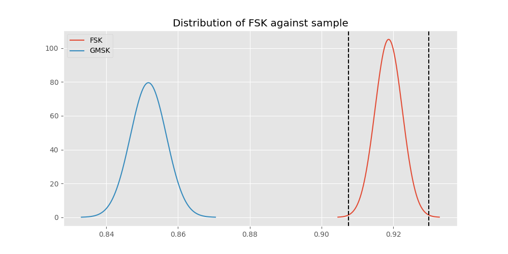
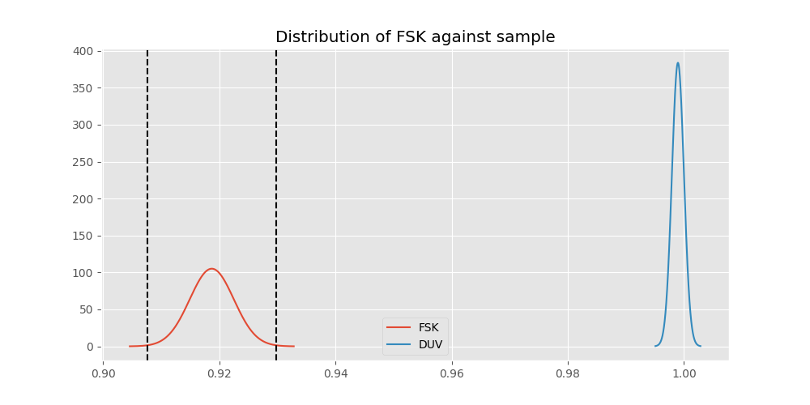
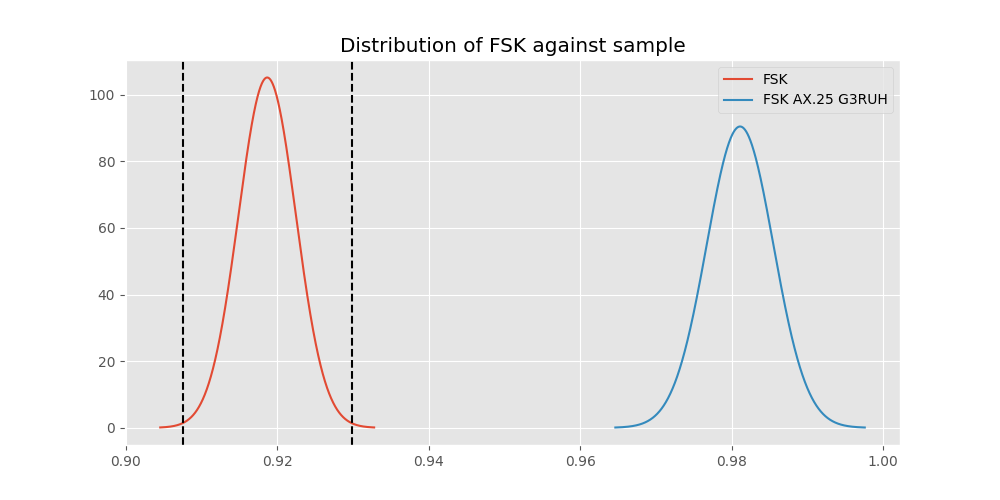
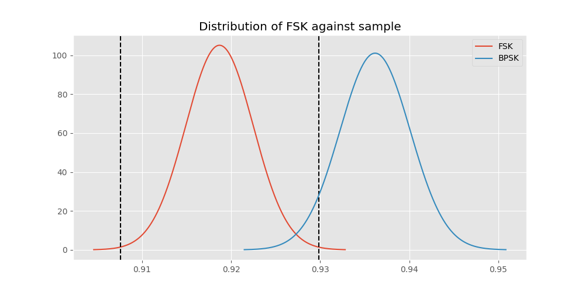
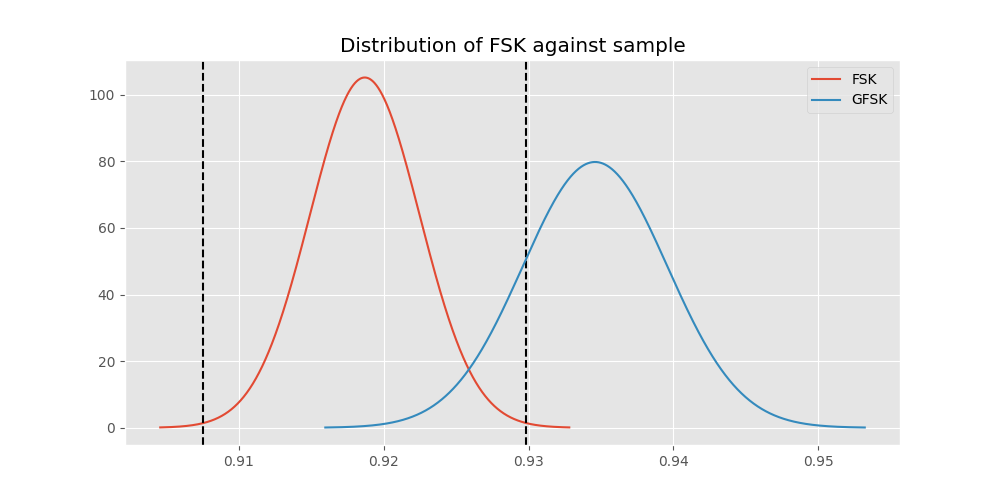
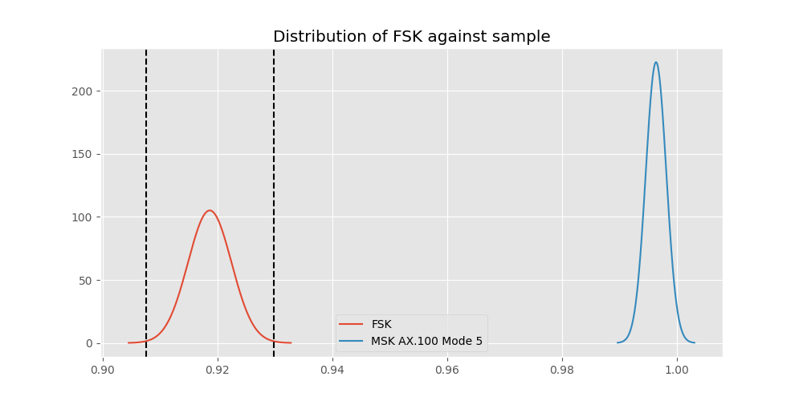
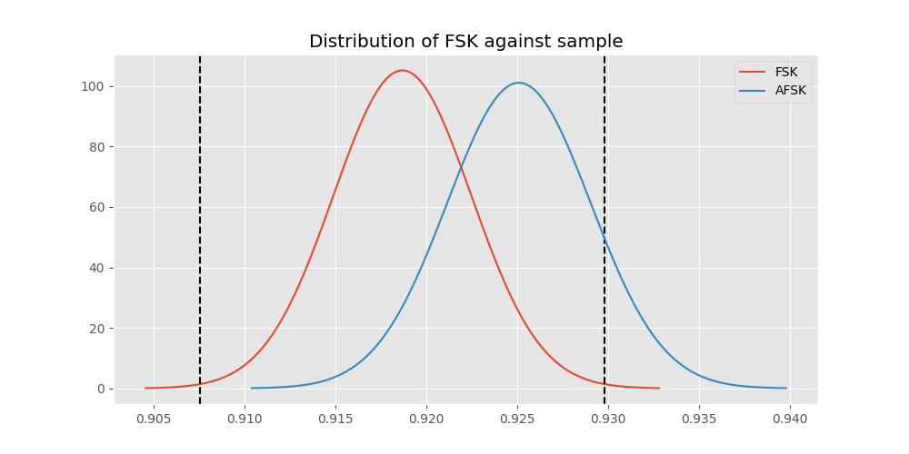

# Testing Results For FSK 
$H_{0}$: There is not a difference in collection success against FSK 
$H_{A}$: There is a difference in collection success against FSK
An $\alpha$ of 0.0033333333333333335 was used 
Out of 7 tests, there were 5 rejections from 7 independent-t test.
Out of 7 tests, there were 5 rejections from 7 Man Whitney u-tests.
## Testing Results for FSK against GMSK 
FSK has a success rate of 0.9186897880539499
GMSK has a success rate of 0.8517632994620442
$H_{0}$: There is not a difference between FSK and GMSK
$H_{A}$: There is a difference between FSK and GMSK
An $/alpha$ of 0.0033333333333333335 was used in this test.
__independent t-testing__: With a t-statistic of 10.686858541734104 and a p-value of 1.619338453076005e-26, _we **reject** the null hypothssis_
__Man-Whitney testing__: With a u-statistic of 13895976.0 and a p-value of 2.206048682627997e-26, _we **reject** the null hypothssis_
 
## Testing Results for FSK against DUV 
FSK has a success rate of 0.9186897880539499
DUV has a success rate of 0.998960498960499
$H_{0}$: There is not a difference between FSK and DUV
$H_{A}$: There is a difference between FSK and DUV
An $/alpha$ of 0.0033333333333333335 was used in this test.
__independent t-testing__: With a t-statistic of -20.404465297969526 and a p-value of 1.9312825100018106e-89, _we **reject** the null hypothssis_
__Man-Whitney testing__: With a u-statistic of 2296003.0 and a p-value of 1.620685483324071e-19, _we **reject** the null hypothssis_
 
## Testing Results for FSK against FSK AX.25 G3RUH 
FSK has a success rate of 0.9186897880539499
FSK AX.25 G3RUH has a success rate of 0.9811122770199371
$H_{0}$: There is not a difference between FSK and FSK AX.25 G3RUH
$H_{A}$: There is a difference between FSK and FSK AX.25 G3RUH
An $/alpha$ of 0.0033333333333333335 was used in this test.
__independent t-testing__: With a t-statistic of -10.7273300197371 and a p-value of 2.644204016919244e-26, _we **reject** the null hypothssis_
__Man-Whitney testing__: With a u-statistic of 2318662.0 and a p-value of 6.498999210734942e-12, _we **reject** the null hypothssis_
 
## Testing Results for FSK against BPSK 
FSK has a success rate of 0.9186897880539499
BPSK has a success rate of 0.9361646690984888
$H_{0}$: There is not a difference between FSK and BPSK
$H_{A}$: There is a difference between FSK and BPSK
An $/alpha$ of 0.0033333333333333335 was used in this test.
__independent t-testing__: With a t-statistic of -3.1393736309468094 and a p-value of 0.0016985536585924748, _we **reject** the null hypothssis_
__Man-Whitney testing__: With a u-statistic of 9785567.0 and a p-value of 0.0017020596801169804, _we **reject** the null hypothssis_
 
## Testing Results for FSK against GFSK 
FSK has a success rate of 0.9186897880539499
GFSK has a success rate of 0.9345870809484873
$H_{0}$: There is not a difference between FSK and GFSK
$H_{A}$: There is a difference between FSK and GFSK
An $/alpha$ of 0.0033333333333333335 was used in this test.
__independent t-testing__: With a t-statistic of -2.443440112091683 and a p-value of 0.014570477166635704, _we failed to reject the null hypothssis_
__Man-Whitney testing__: With a u-statistic of 6246464.0 and a p-value of 0.014580553843219967, _we failed to reject the null hypothssis_
 
## Testing Results for FSK against MSK AX.100 Mode 5 
FSK has a success rate of 0.9186897880539499
MSK AX.100 Mode 5 has a success rate of 0.9964125560538116
$H_{0}$: There is not a difference between FSK and MSK AX.100 Mode 5
$H_{A}$: There is a difference between FSK and MSK AX.100 Mode 5
An $/alpha$ of 0.0033333333333333335 was used in this test.
__independent t-testing__: With a t-statistic of -18.52412680706007 and a p-value of 1.2296190646087432e-74, _we **reject** the null hypothssis_
__Man-Whitney testing__: With a u-statistic of 2668540.0 and a p-value of 6.5741488952351656e-21, _we **reject** the null hypothssis_
 
## Testing Results for FSK against AFSK 
FSK has a success rate of 0.9186897880539499
AFSK has a success rate of 0.9251012145748988
$H_{0}$: There is not a difference between FSK and AFSK
$H_{A}$: There is a difference between FSK and AFSK
An $/alpha$ of 0.0033333333333333335 was used in this test.
__independent t-testing__: With a t-statistic of -1.1674887588802758 and a p-value of 0.24304193913990807, _we failed to reject the null hypothssis_
__Man-Whitney testing__: With a u-statistic of 11463399.0 and a p-value of 0.24302510749964956, _we failed to reject the null hypothssis_
 
