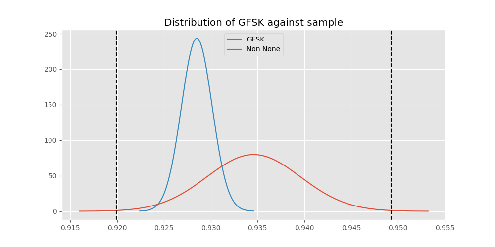
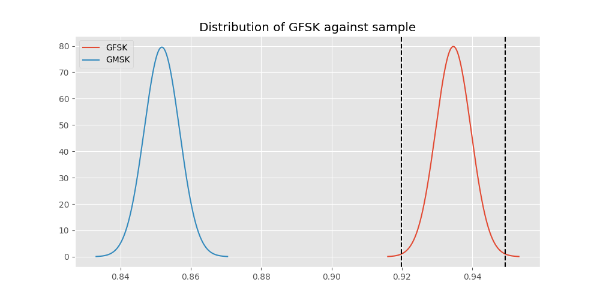
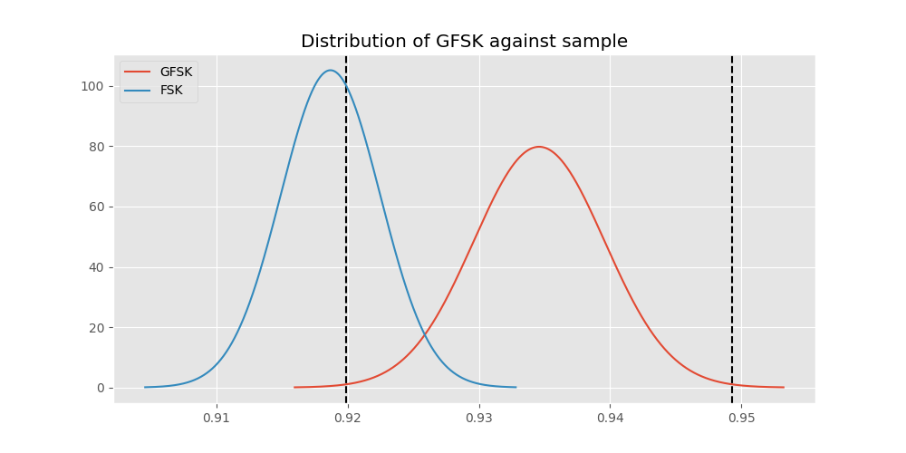
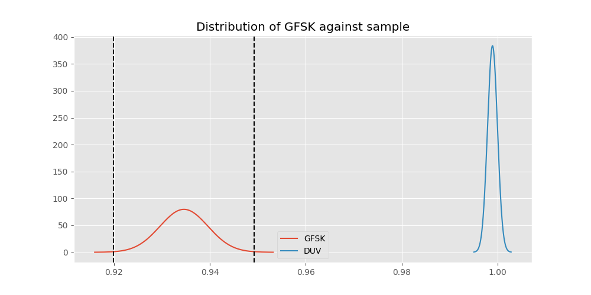
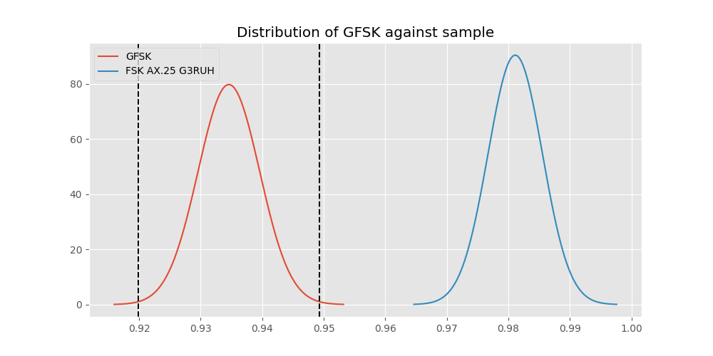
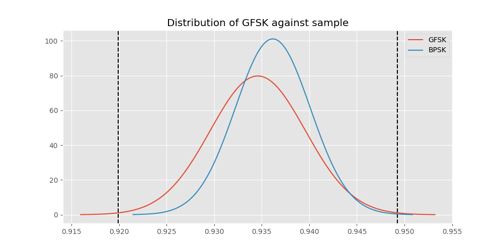
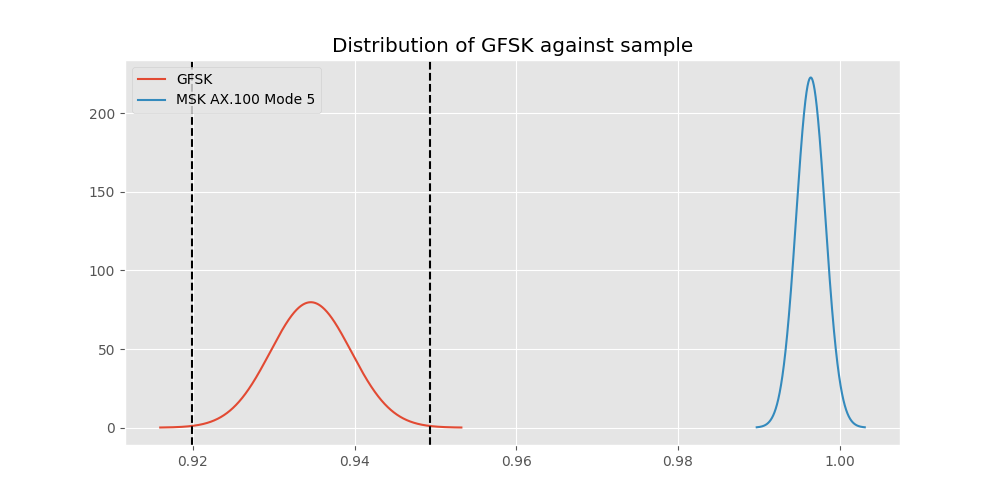
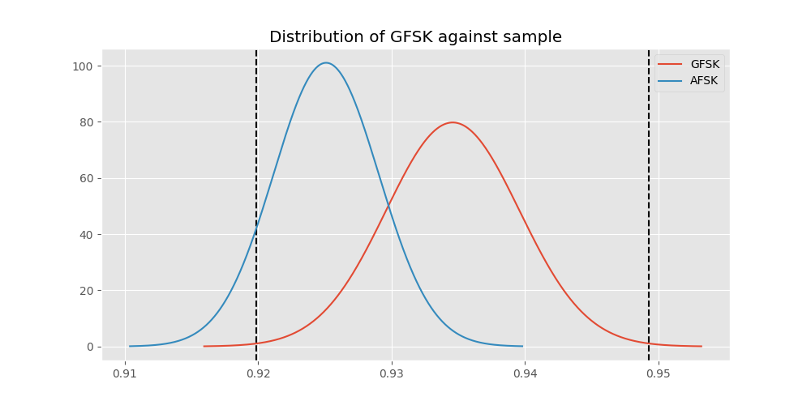

# Testing Results For GFSK 
$H_{0}$: There is not a difference in collection success against GFSK 
$H_{A}$: There is a difference in collection success against GFSK
An $\alpha$ of 0.0033333333333333335 was used 
Out of 7 tests, there were 4 rejections from 7 independent-t test.
Out of 7 tests, there were 4 rejections from 7 Man Whitney u-tests.
## Testing Results for GFSK against GMSK 
GFSK has a success rate of 0.9345870809484873
GMSK has a success rate of 0.8517632994620442
$H_{0}$: There is not a difference between GFSK and GMSK
$H_{A}$: There is a difference between GFSK and GMSK
An $/alpha$ of 0.0033333333333333335 was used in this test.
__independent t-testing__: With a t-statistic of 10.367753168043798 and a p-value of 5.13652704095779e-25, _we **reject** the null hypothssis_
__Man-Whitney testing__: With a u-statistic of 6646629.0 and a p-value of 7.4555173509628135e-25, _we **reject** the null hypothssis_
 
## Testing Results for GFSK against FSK 
GFSK has a success rate of 0.9345870809484873
FSK has a success rate of 0.9186897880539499
$H_{0}$: There is not a difference between GFSK and FSK
$H_{A}$: There is a difference between GFSK and FSK
An $/alpha$ of 0.0033333333333333335 was used in this test.
__independent t-testing__: With a t-statistic of 2.443440112091683 and a p-value of 0.014570477166635704, _we failed to reject the null hypothssis_
__Man-Whitney testing__: With a u-statistic of 6448276.0 and a p-value of 0.014580553843219967, _we failed to reject the null hypothssis_
 
## Testing Results for GFSK against DUV 
GFSK has a success rate of 0.9345870809484873
DUV has a success rate of 0.998960498960499
$H_{0}$: There is not a difference between GFSK and DUV
$H_{A}$: There is a difference between GFSK and DUV
An $/alpha$ of 0.0033333333333333335 was used in this test.
__independent t-testing__: With a t-statistic of -12.604255906539558 and a p-value of 2.0364486776327953e-35, _we **reject** the null hypothssis_
__Man-Whitney testing__: With a u-statistic of 1100789.0 and a p-value of 1.5649467228577746e-15, _we **reject** the null hypothssis_
 
## Testing Results for GFSK against FSK AX.25 G3RUH 
GFSK has a success rate of 0.9345870809484873
FSK AX.25 G3RUH has a success rate of 0.9811122770199371
$H_{0}$: There is not a difference between GFSK and FSK AX.25 G3RUH
$H_{A}$: There is a difference between GFSK and FSK AX.25 G3RUH
An $/alpha$ of 0.0033333333333333335 was used in this test.
__independent t-testing__: With a t-statistic of -5.491927503163467 and a p-value of 4.2678892616510806e-08, _we **reject** the null hypothssis_
__Man-Whitney testing__: With a u-statistic of 1111293.0 and a p-value of 4.5395705959178144e-08, _we **reject** the null hypothssis_
 
## Testing Results for GFSK against BPSK 
GFSK has a success rate of 0.9345870809484873
BPSK has a success rate of 0.9361646690984888
$H_{0}$: There is not a difference between GFSK and BPSK
$H_{A}$: There is a difference between GFSK and BPSK
An $/alpha$ of 0.0033333333333333335 was used in this test.
__independent t-testing__: With a t-statistic of -0.24828255282292946 and a p-value of 0.8039239127311515, _we failed to reject the null hypothssis_
__Man-Whitney testing__: With a u-statistic of 4686469.0 and a p-value of 0.8039144227871792, _we failed to reject the null hypothssis_
 
## Testing Results for GFSK against MSK AX.100 Mode 5 
GFSK has a success rate of 0.9345870809484873
MSK AX.100 Mode 5 has a success rate of 0.9964125560538116
$H_{0}$: There is not a difference between GFSK and MSK AX.100 Mode 5
$H_{A}$: There is a difference between GFSK and MSK AX.100 Mode 5
An $/alpha$ of 0.0033333333333333335 was used in this test.
__independent t-testing__: With a t-statistic of -11.63983451006798 and a p-value of 1.1645159858151797e-30, _we **reject** the null hypothssis_
__Man-Whitney testing__: With a u-statistic of 1279337.0 and a p-value of 3.30073548744382e-16, _we **reject** the null hypothssis_
 
## Testing Results for GFSK against AFSK 
GFSK has a success rate of 0.9345870809484873
AFSK has a success rate of 0.9251012145748988
$H_{0}$: There is not a difference between GFSK and AFSK
$H_{A}$: There is a difference between GFSK and AFSK
An $/alpha$ of 0.0033333333333333335 was used in this test.
__independent t-testing__: With a t-statistic of 1.4621348227037727 and a p-value of 0.14374987572110262, _we failed to reject the null hypothssis_
__Man-Whitney testing__: With a u-statistic of 5489037.0 and a p-value of 0.1437412231302876, _we failed to reject the null hypothssis_
 
