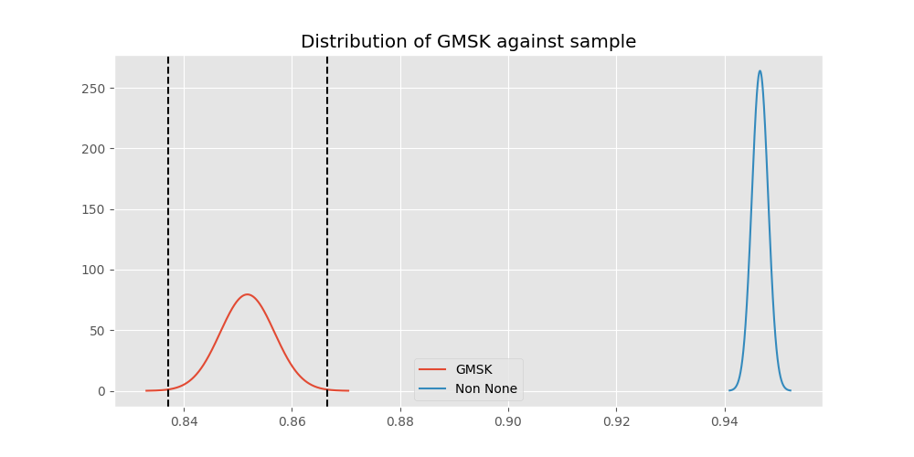
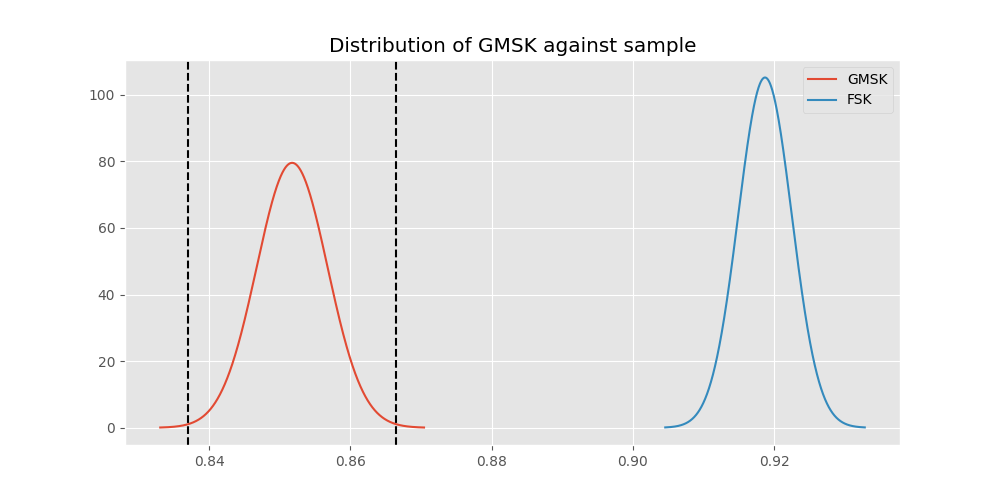
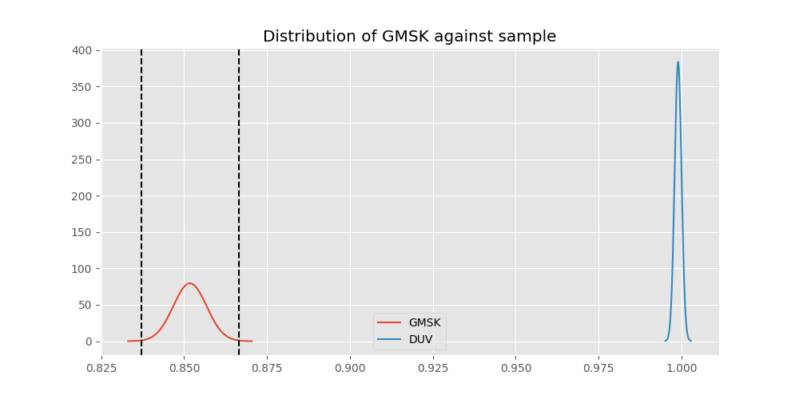
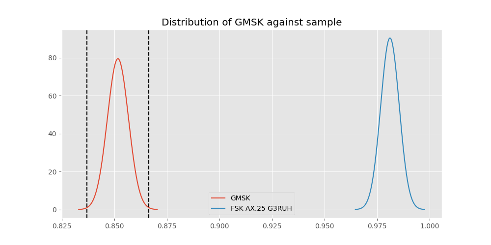
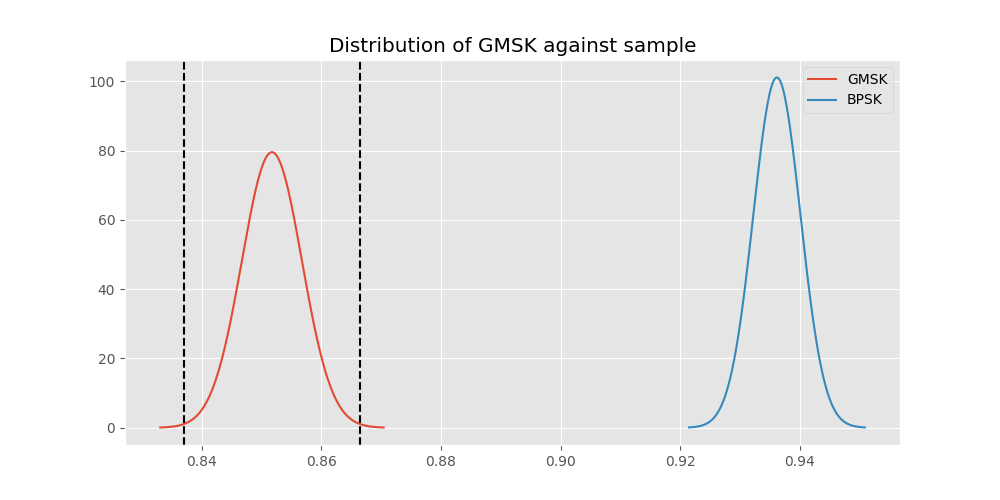
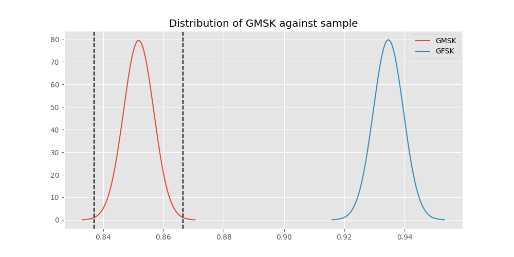
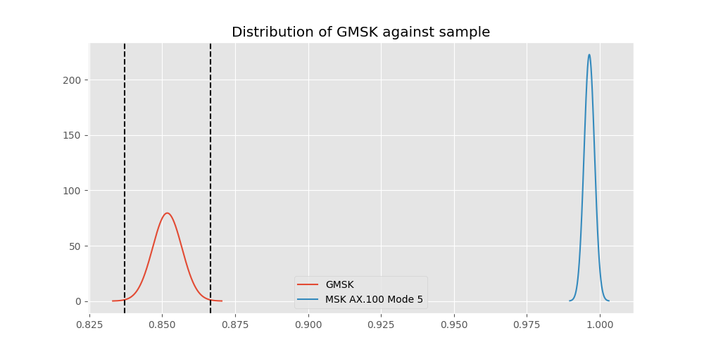
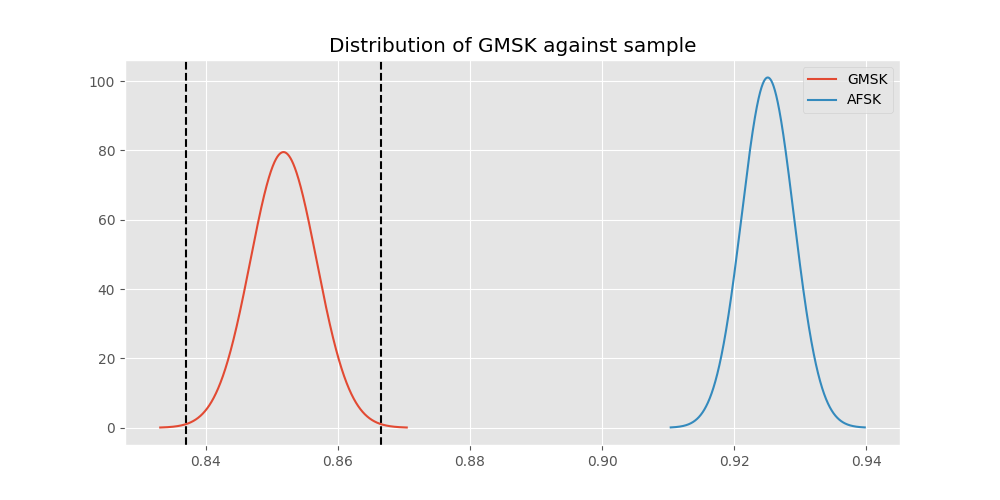

# Testing Results For GMSK 
$H_{0}$: There is not a difference in collection success against GMSK 
$H_{A}$: There is a difference in collection success against GMSK
An $\alpha$ of 0.0033333333333333335 was used 
Out of 7 tests, there were 7 rejections from 7 independent-t test.
Out of 7 tests, there were 7 rejections from 7 Man Whitney u-tests.
## Testing Results for GMSK against FSK 
GMSK has a success rate of 0.8517632994620442
FSK has a success rate of 0.9186897880539499
$H_{0}$: There is not a difference between GMSK and FSK
$H_{A}$: There is a difference between GMSK and FSK
An $/alpha$ of 0.0033333333333333335 was used in this test.
__independent t-testing__: With a t-statistic of -10.686858541734104 and a p-value of 1.619338453076005e-26, _we **reject** the null hypothssis_
__Man-Whitney testing__: With a u-statistic of 12152634.0 and a p-value of 2.206048682627997e-26, _we **reject** the null hypothssis_
 
## Testing Results for GMSK against DUV 
GMSK has a success rate of 0.8517632994620442
DUV has a success rate of 0.998960498960499
$H_{0}$: There is not a difference between GMSK and DUV
$H_{A}$: There is a difference between GMSK and DUV
An $/alpha$ of 0.0033333333333333335 was used in this test.
__independent t-testing__: With a t-statistic of -28.734059068329216 and a p-value of 4.227565594016028e-169, _we **reject** the null hypothssis_
__Man-Whitney testing__: With a u-statistic of 2058784.5 and a p-value of 9.371675477534137e-37, _we **reject** the null hypothssis_
 
## Testing Results for GMSK against FSK AX.25 G3RUH 
GMSK has a success rate of 0.8517632994620442
FSK AX.25 G3RUH has a success rate of 0.9811122770199371
$H_{0}$: There is not a difference between GMSK and FSK AX.25 G3RUH
$H_{A}$: There is a difference between GMSK and FSK AX.25 G3RUH
An $/alpha$ of 0.0033333333333333335 was used in this test.
__independent t-testing__: With a t-statistic of -19.362568220741974 and a p-value of 9.867414164785747e-80, _we **reject** the null hypothssis_
__Man-Whitney testing__: With a u-statistic of 2082208.5 and a p-value of 5.27111818467214e-28, _we **reject** the null hypothssis_
 
## Testing Results for GMSK against BPSK 
GMSK has a success rate of 0.8517632994620442
BPSK has a success rate of 0.9361646690984888
$H_{0}$: There is not a difference between GMSK and BPSK
$H_{A}$: There is a difference between GMSK and BPSK
An $/alpha$ of 0.0033333333333333335 was used in this test.
__independent t-testing__: With a t-statistic of -12.60776089855921 and a p-value of 3.9068967115655746e-36, _we **reject** the null hypothssis_
__Man-Whitney testing__: With a u-statistic of 8818552.5 and a p-value of 7.771786430951665e-36, _we **reject** the null hypothssis_
 
## Testing Results for GMSK against GFSK 
GMSK has a success rate of 0.8517632994620442
GFSK has a success rate of 0.9345870809484873
$H_{0}$: There is not a difference between GMSK and GFSK
$H_{A}$: There is a difference between GMSK and GFSK
An $/alpha$ of 0.0033333333333333335 was used in this test.
__independent t-testing__: With a t-statistic of -10.367753168043798 and a p-value of 5.13652704095779e-25, _we **reject** the null hypothssis_
__Man-Whitney testing__: With a u-statistic of 5629845.0 and a p-value of 7.4555173509628135e-25, _we **reject** the null hypothssis_
 
## Testing Results for GMSK against MSK AX.100 Mode 5 
GMSK has a success rate of 0.8517632994620442
MSK AX.100 Mode 5 has a success rate of 0.9964125560538116
$H_{0}$: There is not a difference between GMSK and MSK AX.100 Mode 5
$H_{A}$: There is a difference between GMSK and MSK AX.100 Mode 5
An $/alpha$ of 0.0033333333333333335 was used in this test.
__independent t-testing__: With a t-statistic of -27.156958268954895 and a p-value of 3.3845424908094295e-153, _we **reject** the null hypothssis_
__Man-Whitney testing__: With a u-statistic of 2393350.5 and a p-value of 1.1684945267986013e-40, _we **reject** the null hypothssis_
 
## Testing Results for GMSK against AFSK 
GMSK has a success rate of 0.8517632994620442
AFSK has a success rate of 0.9251012145748988
$H_{0}$: There is not a difference between GMSK and AFSK
$H_{A}$: There is a difference between GMSK and AFSK
An $/alpha$ of 0.0033333333333333335 was used in this test.
__independent t-testing__: With a t-statistic of -11.287647364756824 and a p-value of 2.3256417265165762e-29, _we **reject** the null hypothssis_
__Man-Whitney testing__: With a u-statistic of 10338988.5 and a p-value of 3.520443603521049e-29, _we **reject** the null hypothssis_
 
