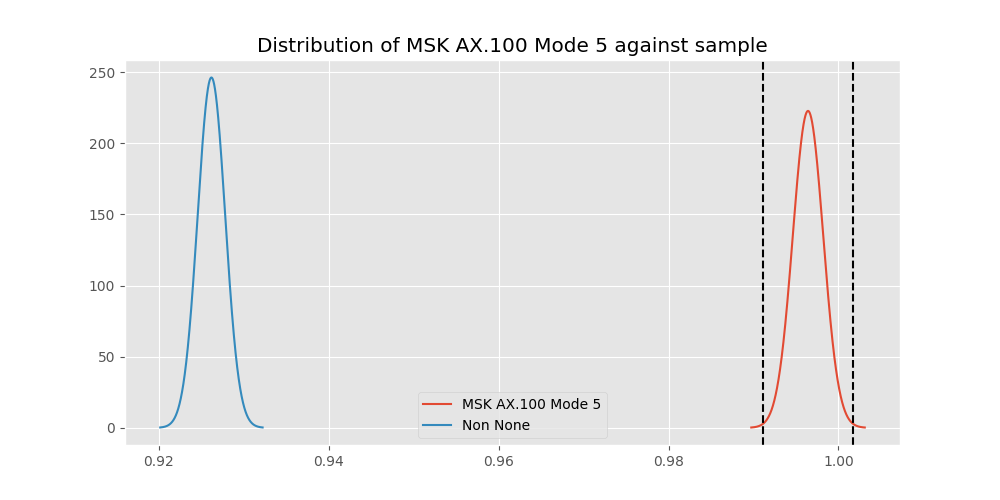

# Testing Results For MSK AX.100 Mode 5 
$H_{0}$: There is not a difference in collection success against MSK AX.100 Mode 5 
$H_{A}$: There is a difference in collection success against MSK AX.100 Mode 5
An $\alpha$ of 0.0033333333333333335 was used 
Out of 7 tests, there were 6 rejections from 7 independent-t test.
Out of 7 tests, there were 6 rejections from 7 Man Whitney u-tests.
## Testing Results for MSK AX.100 Mode 5 against GMSK 
MSK AX.100 Mode 5 has a success rate of 0.9964125560538116
GMSK has a success rate of 0.8517632994620442
$H_{0}$: There is not a difference between MSK AX.100 Mode 5 and GMSK
$H_{A}$: There is a difference between MSK AX.100 Mode 5 and GMSK
An $/alpha$ of 0.0033333333333333335 was used in this test.
__independent t-testing__: With a t-statistic of 13.54827652775156 and a p-value of 3.165162860179405e-41, _we **reject** the null hypothssis_
__Man-Whitney testing__: With a u-statistic of 3202834.5 and a p-value of 1.1684945267986013e-40, _we **reject** the null hypothssis_
 
## Testing Results for MSK AX.100 Mode 5 against FSK 
MSK AX.100 Mode 5 has a success rate of 0.9964125560538116
FSK has a success rate of 0.9186897880539499
$H_{0}$: There is not a difference between MSK AX.100 Mode 5 and FSK
$H_{A}$: There is a difference between MSK AX.100 Mode 5 and FSK
An $/alpha$ of 0.0033333333333333335 was used in this test.
__independent t-testing__: With a t-statistic of 9.445801314393194 and a p-value of 4.8560761143769454e-21, _we **reject** the null hypothssis_
__Man-Whitney testing__: With a u-statistic of 3118310.0 and a p-value of 6.5741488952351656e-21, _we **reject** the null hypothssis_
 
## Testing Results for MSK AX.100 Mode 5 against DUV 
MSK AX.100 Mode 5 has a success rate of 0.9964125560538116
DUV has a success rate of 0.998960498960499
$H_{0}$: There is not a difference between MSK AX.100 Mode 5 and DUV
$H_{A}$: There is a difference between MSK AX.100 Mode 5 and DUV
An $/alpha$ of 0.0033333333333333335 was used in this test.
__independent t-testing__: With a t-statistic of -1.181380615495045 and a p-value of 0.2375869358896933, _we failed to reject the null hypothssis_
__Man-Whitney testing__: With a u-statistic of 534948.5 and a p-value of 0.2376679475857556, _we failed to reject the null hypothssis_
 
## Testing Results for MSK AX.100 Mode 5 against FSK AX.25 G3RUH 
MSK AX.100 Mode 5 has a success rate of 0.9964125560538116
FSK AX.25 G3RUH has a success rate of 0.9811122770199371
$H_{0}$: There is not a difference between MSK AX.100 Mode 5 and FSK AX.25 G3RUH
$H_{A}$: There is a difference between MSK AX.100 Mode 5 and FSK AX.25 G3RUH
An $/alpha$ of 0.0033333333333333335 was used in this test.
__independent t-testing__: With a t-statistic of 3.388344799335148 and a p-value of 0.0007163538042746876, _we **reject** the null hypothssis_
__Man-Whitney testing__: With a u-statistic of 539426.5 and a p-value of 0.000725969357638514, _we **reject** the null hypothssis_
 
## Testing Results for MSK AX.100 Mode 5 against BPSK 
MSK AX.100 Mode 5 has a success rate of 0.9964125560538116
BPSK has a success rate of 0.9361646690984888
$H_{0}$: There is not a difference between MSK AX.100 Mode 5 and BPSK
$H_{A}$: There is a difference between MSK AX.100 Mode 5 and BPSK
An $/alpha$ of 0.0033333333333333335 was used in this test.
__independent t-testing__: With a t-statistic of 8.157251696369219 and a p-value of 4.3059813707695946e-16, _we **reject** the null hypothssis_
__Man-Whitney testing__: With a u-statistic of 2268596.5 and a p-value of 5.328231765527198e-16, _we **reject** the null hypothssis_
 
## Testing Results for MSK AX.100 Mode 5 against GFSK 
MSK AX.100 Mode 5 has a success rate of 0.9964125560538116
GFSK has a success rate of 0.9345870809484873
$H_{0}$: There is not a difference between MSK AX.100 Mode 5 and GFSK
$H_{A}$: There is a difference between MSK AX.100 Mode 5 and GFSK
An $/alpha$ of 0.0033333333333333335 was used in this test.
__independent t-testing__: With a t-statistic of 8.238141331984126 and a p-value of 2.43014013735036e-16, _we **reject** the null hypothssis_
__Man-Whitney testing__: With a u-statistic of 1447953.0 and a p-value of 3.30073548744382e-16, _we **reject** the null hypothssis_
 
## Testing Results for MSK AX.100 Mode 5 against AFSK 
MSK AX.100 Mode 5 has a success rate of 0.9964125560538116
AFSK has a success rate of 0.9251012145748988
$H_{0}$: There is not a difference between MSK AX.100 Mode 5 and AFSK
$H_{A}$: There is a difference between MSK AX.100 Mode 5 and AFSK
An $/alpha$ of 0.0033333333333333335 was used in this test.
__independent t-testing__: With a t-statistic of 8.986581010328893 and a p-value of 3.4346663171701917e-19, _we **reject** the null hypothssis_
__Man-Whitney testing__: With a u-statistic of 2655400.5 and a p-value of 4.547091622192063e-19, _we **reject** the null hypothssis_
 
