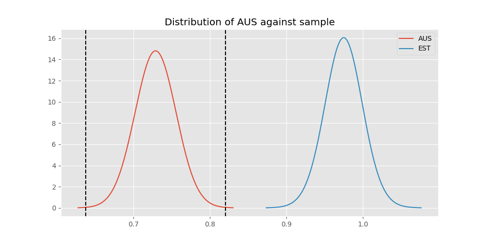
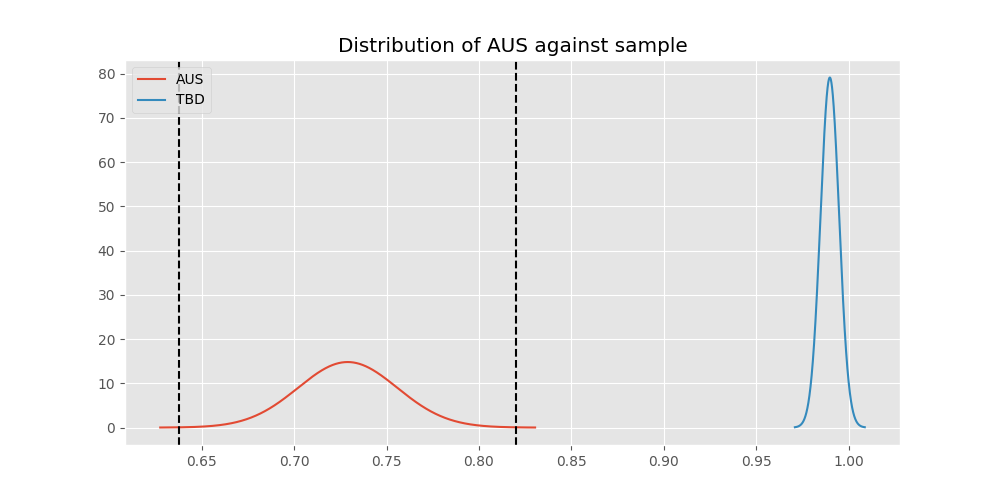

# Testing Results For AUS 
$H_{0}$: There is not a difference in collection success against AUS 
$H_{A}$: There is a difference in collection success against AUS
An $\alpha$ of 0.0008064516129032258 was used 
Out of 25 tests, there were 23 rejections from 25 independent-t test.
Out of 25 tests, there were 23 rejections from 25 Man Whitney u-tests.
## Testing Results for AUS against IND 
AUS has a success rate of 0.7289377289377289
IND has a success rate of 0.9704433497536946
$H_{0}$: There is not a difference between AUS and IND
$H_{A}$: There is a difference between AUS and IND
An $/alpha$ of 0.0008064516129032258 was used in this test.
__independent t-testing__: With a t-statistic of -8.553242450022237 and a p-value of 4.759380510156055e-16, _we **reject** the null hypothssis_
__Man-Whitney testing__: With a u-statistic of 42035.0 and a p-value of 1.856288652507405e-20, _we **reject** the null hypothssis_
 
## Testing Results for AUS against GUAT 
AUS has a success rate of 0.7289377289377289
GUAT has a success rate of 0.9705882352941176
$H_{0}$: There is not a difference between AUS and GUAT
$H_{A}$: There is a difference between AUS and GUAT
An $/alpha$ of 0.0008064516129032258 was used in this test.
__independent t-testing__: With a t-statistic of -7.118167091872398 and a p-value of 8.868215115160687e-12, _we **reject** the null hypothssis_
__Man-Whitney testing__: With a u-statistic of 7039.0 and a p-value of 1.8945273957309006e-05, _we **reject** the null hypothssis_
 
## Testing Results for AUS against IT 
AUS has a success rate of 0.7289377289377289
IT has a success rate of 0.9217391304347826
$H_{0}$: There is not a difference between AUS and IT
$H_{A}$: There is a difference between AUS and IT
An $/alpha$ of 0.0008064516129032258 was used in this test.
__independent t-testing__: With a t-statistic of -8.801898154855223 and a p-value of 4.6444004881701635e-18, _we **reject** the null hypothssis_
__Man-Whitney testing__: With a u-statistic of 101368.0 and a p-value of 1.434981957093269e-17, _we **reject** the null hypothssis_
 
## Testing Results for AUS against EST 
AUS has a success rate of 0.7289377289377289
EST has a success rate of 0.975
$H_{0}$: There is not a difference between AUS and EST
$H_{A}$: There is a difference between AUS and EST
An $/alpha$ of 0.0008064516129032258 was used in this test.
__independent t-testing__: With a t-statistic of -6.693435815046004 and a p-value of 3.901050759382534e-10, _we **reject** the null hypothssis_
__Man-Whitney testing__: With a u-statistic of 4116.5 and a p-value of 0.0006782316733652426, _we **reject** the null hypothssis_
 
## Testing Results for AUS against SKOR 
AUS has a success rate of 0.7289377289377289
SKOR has a success rate of 0.9166666666666666
$H_{0}$: There is not a difference between AUS and SKOR
$H_{A}$: There is a difference between AUS and SKOR
An $/alpha$ of 0.0008064516129032258 was used in this test.
__independent t-testing__: With a t-statistic of -3.1311967653749773 and a p-value of 0.0018961523378229772, _we failed to reject the null hypothssis_
__Man-Whitney testing__: With a u-statistic of 6652.5 and a p-value of 0.0020050641724739375, _we failed to reject the null hypothssis_
 
## Testing Results for AUS against RP 
AUS has a success rate of 0.7289377289377289
RP has a success rate of 0.6735187424425635
$H_{0}$: There is not a difference between AUS and RP
$H_{A}$: There is a difference between AUS and RP
An $/alpha$ of 0.0008064516129032258 was used in this test.
__independent t-testing__: With a t-statistic of 1.713300162630588 and a p-value of 0.08693961065231083, _we failed to reject the null hypothssis_
__Man-Whitney testing__: With a u-statistic of 119141.5 and a p-value of 0.08695994640331006, _we failed to reject the null hypothssis_
 
## Testing Results for AUS against JPN 
AUS has a success rate of 0.7289377289377289
JPN has a success rate of 0.6016371077762619
$H_{0}$: There is not a difference between AUS and JPN
$H_{A}$: There is a difference between AUS and JPN
An $/alpha$ of 0.0008064516129032258 was used in this test.
__independent t-testing__: With a t-statistic of 3.7542862674191877 and a p-value of 0.0001838161055176484, _we **reject** the null hypothssis_
__Man-Whitney testing__: With a u-statistic of 112791.5 and a p-value of 0.00019154208565678164, _we **reject** the null hypothssis_
 
## Testing Results for AUS against US 
AUS has a success rate of 0.7289377289377289
US has a success rate of 0.918885774351787
$H_{0}$: There is not a difference between AUS and US
$H_{A}$: There is a difference between AUS and US
An $/alpha$ of 0.0008064516129032258 was used in this test.
__independent t-testing__: With a t-statistic of -10.827870695513202 and a p-value of 4.522921328799471e-27, _we **reject** the null hypothssis_
__Man-Whitney testing__: With a u-statistic of 631145.5 and a p-value of 7.844276112248708e-27, _we **reject** the null hypothssis_
 
## Testing Results for AUS against KAZ 
AUS has a success rate of 0.7289377289377289
KAZ has a success rate of 0.989010989010989
$H_{0}$: There is not a difference between AUS and KAZ
$H_{A}$: There is a difference between AUS and KAZ
An $/alpha$ of 0.0008064516129032258 was used in this test.
__independent t-testing__: With a t-statistic of -9.27373201769424 and a p-value of 2.928821266535141e-18, _we **reject** the null hypothssis_
__Man-Whitney testing__: With a u-statistic of 18382.0 and a p-value of 3.401297213487305e-13, _we **reject** the null hypothssis_
 
## Testing Results for AUS against ROC 
AUS has a success rate of 0.7289377289377289
ROC has a success rate of 0.17751479289940827
$H_{0}$: There is not a difference between AUS and ROC
$H_{A}$: There is a difference between AUS and ROC
An $/alpha$ of 0.0008064516129032258 was used in this test.
__independent t-testing__: With a t-statistic of 13.328134826808473 and a p-value of 2.793116948327872e-34, _we **reject** the null hypothssis_
__Man-Whitney testing__: With a u-statistic of 35789.0 and a p-value of 2.0279446522928302e-29, _we **reject** the null hypothssis_
 
## Testing Results for AUS against THAI 
AUS has a success rate of 0.7289377289377289
THAI has a success rate of 0.9880952380952381
$H_{0}$: There is not a difference between AUS and THAI
$H_{A}$: There is a difference between AUS and THAI
An $/alpha$ of 0.0008064516129032258 was used in this test.
__independent t-testing__: With a t-statistic of -9.18062451698693 and a p-value of 5.3138995427641175e-18, _we **reject** the null hypothssis_
__Man-Whitney testing__: With a u-statistic of 16989.0 and a p-value of 2.7617718084390526e-12, _we **reject** the null hypothssis_
 
## Testing Results for AUS against FR 
AUS has a success rate of 0.7289377289377289
FR has a success rate of 0.908183632734531
$H_{0}$: There is not a difference between AUS and FR
$H_{A}$: There is a difference between AUS and FR
An $/alpha$ of 0.0008064516129032258 was used in this test.
__independent t-testing__: With a t-statistic of -6.766921732864244 and a p-value of 2.601474764695e-11, _we **reject** the null hypothssis_
__Man-Whitney testing__: With a u-statistic of 56128.5 and a p-value of 4.7448839665015553e-11, _we **reject** the null hypothssis_
 
## Testing Results for AUS against TURK 
AUS has a success rate of 0.7289377289377289
TURK has a success rate of 0.9962264150943396
$H_{0}$: There is not a difference between AUS and TURK
$H_{A}$: There is a difference between AUS and TURK
An $/alpha$ of 0.0008064516129032258 was used in this test.
__independent t-testing__: With a t-statistic of -9.8213179727482 and a p-value of 8.866818192850514e-20, _we **reject** the null hypothssis_
__Man-Whitney testing__: With a u-statistic of 26504.0 and a p-value of 3.898325206060185e-19, _we **reject** the null hypothssis_
 
## Testing Results for AUS against PRC 
AUS has a success rate of 0.7289377289377289
PRC has a success rate of 0.988759187202767
$H_{0}$: There is not a difference between AUS and PRC
$H_{A}$: There is a difference between AUS and PRC
An $/alpha$ of 0.0008064516129032258 was used in this test.
__independent t-testing__: With a t-statistic of -9.608319292735231 and a p-value of 4.860543314019657e-19, _we **reject** the null hypothssis_
__Man-Whitney testing__: With a u-statistic of 233692.5 and a p-value of 2.130722954055027e-98, _we **reject** the null hypothssis_
 
## Testing Results for AUS against BEL 
AUS has a success rate of 0.7289377289377289
BEL has a success rate of 0.8883495145631068
$H_{0}$: There is not a difference between AUS and BEL
$H_{A}$: There is a difference between AUS and BEL
An $/alpha$ of 0.0008064516129032258 was used in this test.
__independent t-testing__: With a t-statistic of -4.374393879450149 and a p-value of 1.496592564570648e-05, _we **reject** the null hypothssis_
__Man-Whitney testing__: With a u-statistic of 23636.5 and a p-value of 1.7609902347100296e-05, _we **reject** the null hypothssis_
 
## Testing Results for AUS against POL 
AUS has a success rate of 0.7289377289377289
POL has a success rate of 0.979381443298969
$H_{0}$: There is not a difference between AUS and POL
$H_{A}$: There is a difference between AUS and POL
An $/alpha$ of 0.0008064516129032258 was used in this test.
__independent t-testing__: With a t-statistic of -9.036246370772075 and a p-value of 1.9468832990722435e-17, _we **reject** the null hypothssis_
__Man-Whitney testing__: With a u-statistic of 49622.5 and a p-value of 5.8170732876011e-26, _we **reject** the null hypothssis_
 
## Testing Results for AUS against LTU 
AUS has a success rate of 0.7289377289377289
LTU has a success rate of 0.984375
$H_{0}$: There is not a difference between AUS and LTU
$H_{A}$: There is a difference between AUS and LTU
An $/alpha$ of 0.0008064516129032258 was used in this test.
__independent t-testing__: With a t-statistic of -9.177706216654709 and a p-value of 6.560732723021544e-18, _we **reject** the null hypothssis_
__Man-Whitney testing__: With a u-statistic of 32522.5 and a p-value of 7.82120544139784e-20, _we **reject** the null hypothssis_
 
## Testing Results for AUS against SVN 
AUS has a success rate of 0.7289377289377289
SVN has a success rate of 0.9770114942528736
$H_{0}$: There is not a difference between AUS and SVN
$H_{A}$: There is a difference between AUS and SVN
An $/alpha$ of 0.0008064516129032258 was used in this test.
__independent t-testing__: With a t-statistic of -7.8939243893836375 and a p-value of 3.6391615805767093e-14, _we **reject** the null hypothssis_
__Man-Whitney testing__: With a u-statistic of 8929.5 and a p-value of 8.231369589172016e-07, _we **reject** the null hypothssis_
 
## Testing Results for AUS against UKR 
AUS has a success rate of 0.7289377289377289
UKR has a success rate of 0.981549815498155
$H_{0}$: There is not a difference between AUS and UKR
$H_{A}$: There is a difference between AUS and UKR
An $/alpha$ of 0.0008064516129032258 was used in this test.
__independent t-testing__: With a t-statistic of -8.967703197304946 and a p-value of 2.539046366091483e-17, _we **reject** the null hypothssis_
__Man-Whitney testing__: With a u-statistic of 27647.0 and a p-value of 6.639614819130494e-17, _we **reject** the null hypothssis_
 
## Testing Results for AUS against CIS 
AUS has a success rate of 0.7289377289377289
CIS has a success rate of 0.837386018237082
$H_{0}$: There is not a difference between AUS and CIS
$H_{A}$: There is a difference between AUS and CIS
An $/alpha$ of 0.0008064516129032258 was used in this test.
__independent t-testing__: With a t-statistic of -3.8323128558419923 and a p-value of 0.00013548474417008117, _we **reject** the null hypothssis_
__Man-Whitney testing__: With a u-statistic of 80076.5 and a p-value of 0.0001422486296251138, _we **reject** the null hypothssis_
 
## Testing Results for AUS against SAFR 
AUS has a success rate of 0.7289377289377289
SAFR has a success rate of 0.9328358208955224
$H_{0}$: There is not a difference between AUS and SAFR
$H_{A}$: There is a difference between AUS and SAFR
An $/alpha$ of 0.0008064516129032258 was used in this test.
__independent t-testing__: With a t-statistic of -4.927249351045595 and a p-value of 1.2177260766428052e-06, _we **reject** the null hypothssis_
__Man-Whitney testing__: With a u-statistic of 14561.5 and a p-value of 1.658248629499357e-06, _we **reject** the null hypothssis_
 
## Testing Results for AUS against TBD 
AUS has a success rate of 0.7289377289377289
TBD has a success rate of 0.9898734177215189
$H_{0}$: There is not a difference between AUS and TBD
$H_{A}$: There is a difference between AUS and TBD
An $/alpha$ of 0.0008064516129032258 was used in this test.
__independent t-testing__: With a t-statistic of -9.516190837573099 and a p-value of 7.17200192562726e-19, _we **reject** the null hypothssis_
__Man-Whitney testing__: With a u-statistic of 39848.5 and a p-value of 6.000920366403696e-25, _we **reject** the null hypothssis_
 
## Testing Results for AUS against ESA 
AUS has a success rate of 0.7289377289377289
ESA has a success rate of 0.9811320754716981
$H_{0}$: There is not a difference between AUS and ESA
$H_{A}$: There is a difference between AUS and ESA
An $/alpha$ of 0.0008064516129032258 was used in this test.
__independent t-testing__: With a t-statistic of -8.393763141935416 and a p-value of 1.0548049919358382e-15, _we **reject** the null hypothssis_
__Man-Whitney testing__: With a u-statistic of 10820.0 and a p-value of 3.890279278494655e-08, _we **reject** the null hypothssis_
 
## Testing Results for AUS against UK 
AUS has a success rate of 0.7289377289377289
UK has a success rate of 0.9881796690307328
$H_{0}$: There is not a difference between AUS and UK
$H_{A}$: There is a difference between AUS and UK
An $/alpha$ of 0.0008064516129032258 was used in this test.
__independent t-testing__: With a t-statistic of -9.528327388674647 and a p-value of 7.656770318600636e-19, _we **reject** the null hypothssis_
__Man-Whitney testing__: With a u-statistic of 85542.0 and a p-value of 2.558927972542402e-45, _we **reject** the null hypothssis_
 
## Testing Results for AUS against GER 
AUS has a success rate of 0.7289377289377289
GER has a success rate of 0.9766233766233766
$H_{0}$: There is not a difference between AUS and GER
$H_{A}$: There is a difference between AUS and GER
An $/alpha$ of 0.0008064516129032258 was used in this test.
__independent t-testing__: With a t-statistic of -9.127878618324681 and a p-value of 1.4403845403791836e-17, _we **reject** the null hypothssis_
__Man-Whitney testing__: With a u-statistic of 237216.0 and a p-value of 4.191007269931049e-71, _we **reject** the null hypothssis_
 
