# Testing Results For BEL 
$H_{0}$: There is not a difference in collection success against BEL 
$H_{A}$: There is a difference in collection success against BEL
An $\alpha$ of 0.0008064516129032258 was used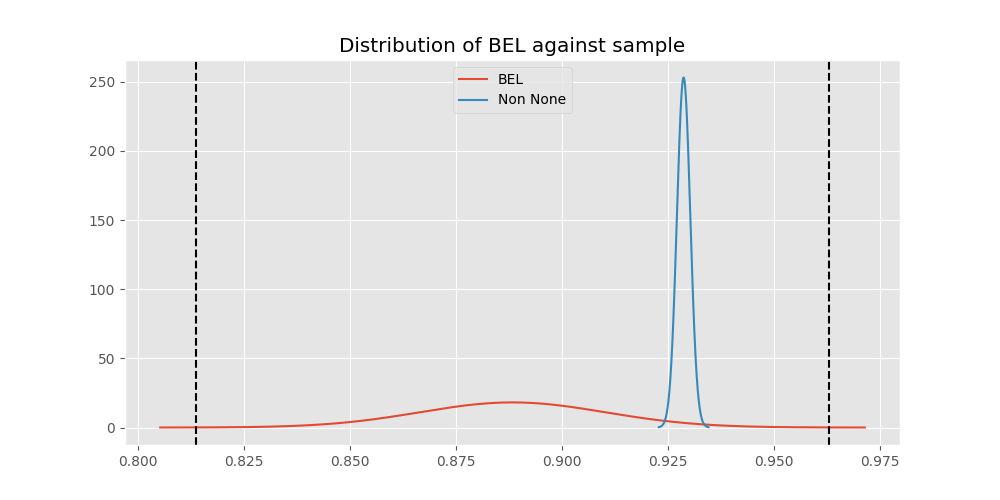 
Out of 25 tests, there were 16 rejections from 25 independent-t test.
Out of 25 tests, there were 15 rejections from 25 Man Whitney u-tests.
## Testing Results for BEL against IND 
BEL has a success rate of 0.8883495145631068
IND has a success rate of 0.9704433497536946
$H_{0}$: There is not a difference between BEL and IND
$H_{A}$: There is a difference between BEL and IND
An $/alpha$ of 0.0008064516129032258 was used in this test.
__independent t-testing__: With a t-statistic of -4.185015549910467 and a p-value of 3.270917802599457e-05, _we **reject** the null hypothssis_
__Man-Whitney testing__: With a u-statistic of 38385.0 and a p-value of 3.643789298932504e-05, _we **reject** the null hypothssis_
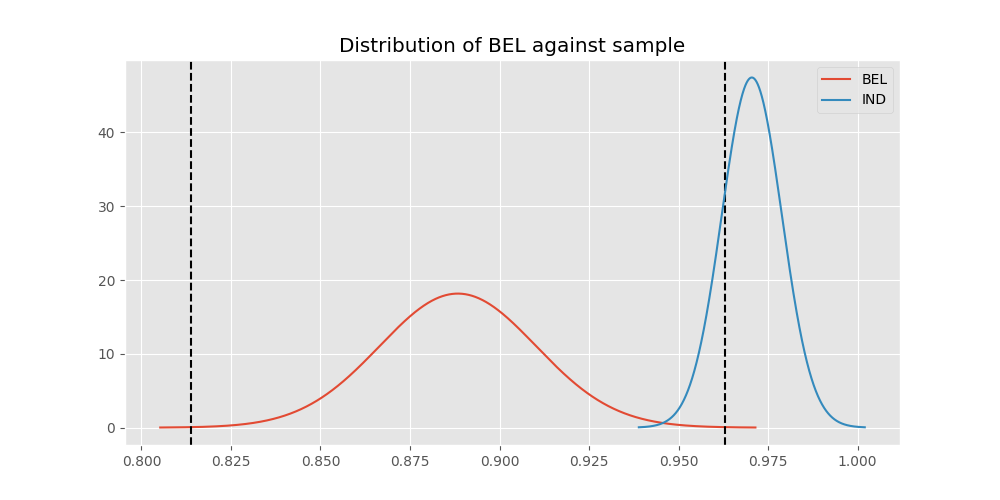 
## Testing Results for BEL against GUAT 
BEL has a success rate of 0.8883495145631068
GUAT has a success rate of 0.9705882352941176
$H_{0}$: There is not a difference between BEL and GUAT
$H_{A}$: There is a difference between BEL and GUAT
An $/alpha$ of 0.0008064516129032258 was used in this test.
__independent t-testing__: With a t-statistic of -2.0502620929087434 and a p-value of 0.041297324735355266, _we failed to reject the null hypothssis_
__Man-Whitney testing__: With a u-statistic of 6428.0 and a p-value of 0.041693358300242206, _we failed to reject the null hypothssis_
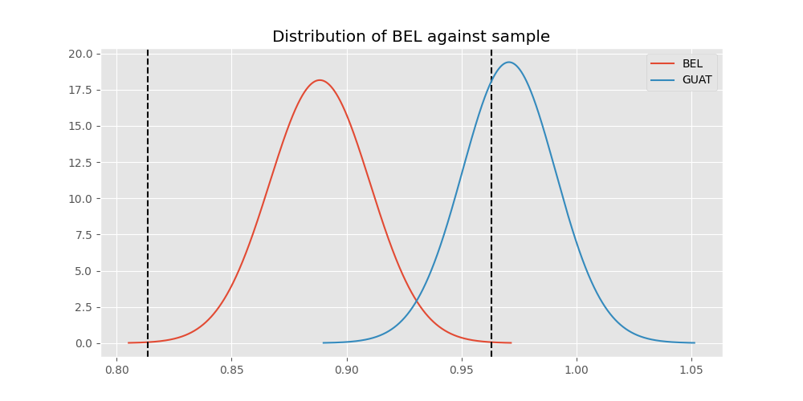 
## Testing Results for BEL against IT 
BEL has a success rate of 0.8883495145631068
IT has a success rate of 0.9217391304347826
$H_{0}$: There is not a difference between BEL and IT
$H_{A}$: There is a difference between BEL and IT
An $/alpha$ of 0.0008064516129032258 was used in this test.
__independent t-testing__: With a t-statistic of -1.558834139638132 and a p-value of 0.11931714273234562, _we failed to reject the null hypothssis_
__Man-Whitney testing__: With a u-statistic of 91596.0 and a p-value of 0.11932852573913061, _we failed to reject the null hypothssis_
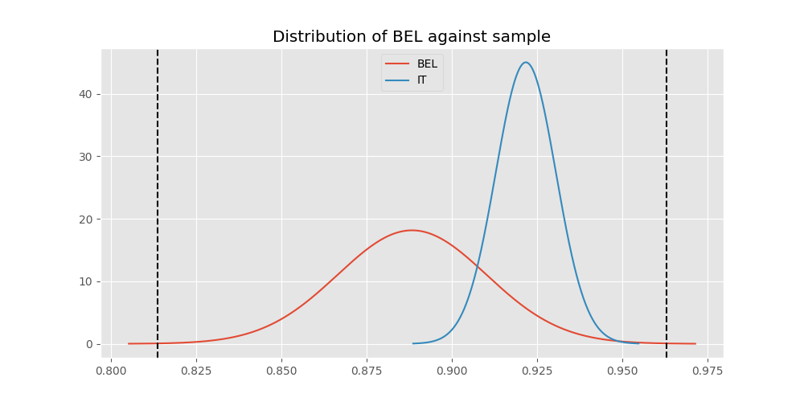 
## Testing Results for BEL against EST 
BEL has a success rate of 0.8883495145631068
EST has a success rate of 0.975
$H_{0}$: There is not a difference between BEL and EST
$H_{A}$: There is a difference between BEL and EST
An $/alpha$ of 0.0008064516129032258 was used in this test.
__independent t-testing__: With a t-statistic of -2.602189916480072 and a p-value of 0.010536380230533425, _we failed to reject the null hypothssis_
__Man-Whitney testing__: With a u-statistic of 3763.0 and a p-value of 0.09211815484820027, _we failed to reject the null hypothssis_
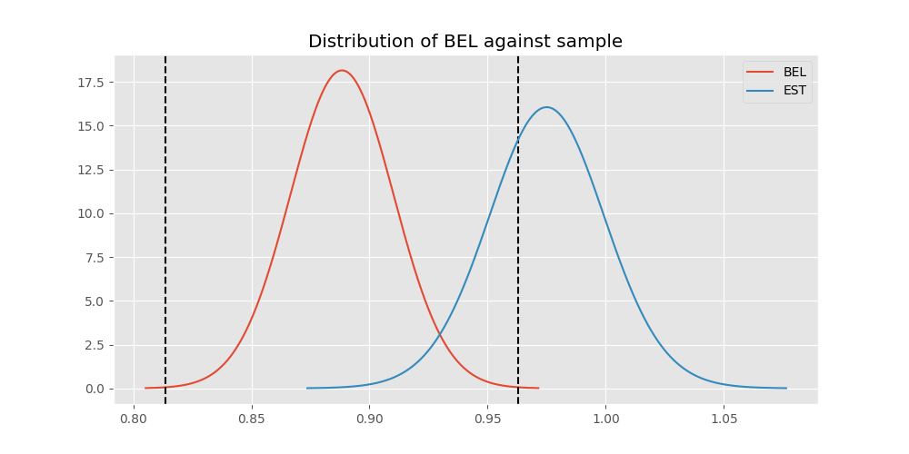 
## Testing Results for BEL against SKOR 
BEL has a success rate of 0.8883495145631068
SKOR has a success rate of 0.9166666666666666
$H_{0}$: There is not a difference between BEL and SKOR
$H_{A}$: There is a difference between BEL and SKOR
An $/alpha$ of 0.0008064516129032258 was used in this test.
__independent t-testing__: With a t-statistic of -0.6270706438008113 and a p-value of 0.5311548502324017, _we failed to reject the null hypothssis_
__Man-Whitney testing__: With a u-statistic of 6005.0 and a p-value of 0.5313174929393284, _we failed to reject the null hypothssis_
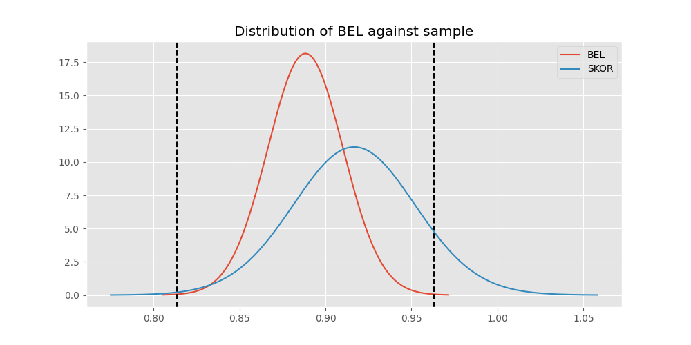 
## Testing Results for BEL against RP 
BEL has a success rate of 0.8883495145631068
RP has a success rate of 0.6735187424425635
$H_{0}$: There is not a difference between BEL and RP
$H_{A}$: There is a difference between BEL and RP
An $/alpha$ of 0.0008064516129032258 was used in this test.
__independent t-testing__: With a t-statistic of 6.228497581164248 and a p-value of 6.847175187918095e-10, _we **reject** the null hypothssis_
__Man-Whitney testing__: With a u-statistic of 103480.5 and a p-value of 9.516242944295418e-10, _we **reject** the null hypothssis_
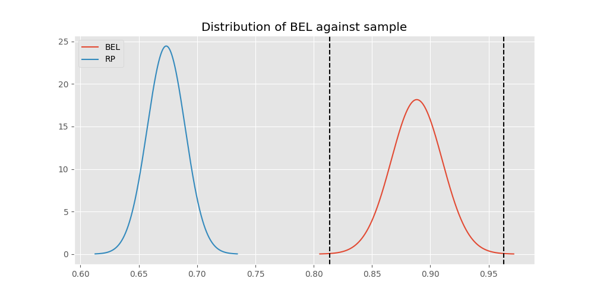 
## Testing Results for BEL against JPN 
BEL has a success rate of 0.8883495145631068
JPN has a success rate of 0.6016371077762619
$H_{0}$: There is not a difference between BEL and JPN
$H_{A}$: There is a difference between BEL and JPN
An $/alpha$ of 0.0008064516129032258 was used in this test.
__independent t-testing__: With a t-statistic of 7.947291284567103 and a p-value of 5.454063354603992e-15, _we **reject** the null hypothssis_
__Man-Whitney testing__: With a u-statistic of 97145.5 and a p-value of 1.4018100782819819e-14, _we **reject** the null hypothssis_
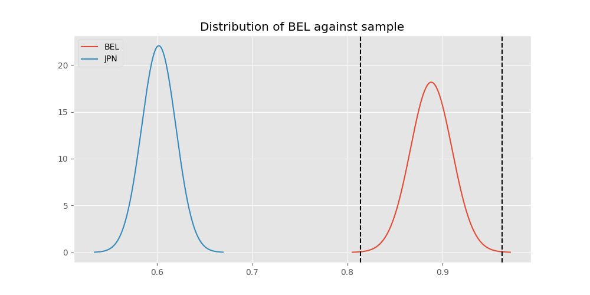 
## Testing Results for BEL against US 
BEL has a success rate of 0.8883495145631068
US has a success rate of 0.918885774351787
$H_{0}$: There is not a difference between BEL and US
$H_{A}$: There is a difference between BEL and US
An $/alpha$ of 0.0008064516129032258 was used in this test.
__independent t-testing__: With a t-statistic of -1.5678729388720556 and a p-value of 0.11696430653831784, _we failed to reject the null hypothssis_
__Man-Whitney testing__: With a u-statistic of 569971.0 and a p-value of 0.1169661091287232, _we failed to reject the null hypothssis_
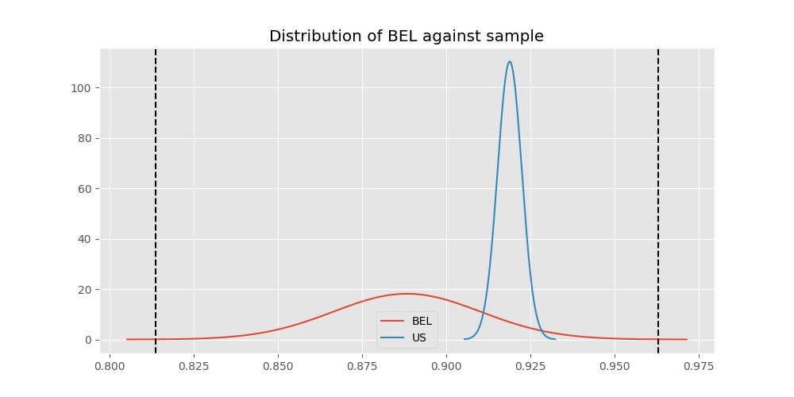 
## Testing Results for BEL against KAZ 
BEL has a success rate of 0.8883495145631068
KAZ has a success rate of 0.989010989010989
$H_{0}$: There is not a difference between BEL and KAZ
$H_{A}$: There is a difference between BEL and KAZ
An $/alpha$ of 0.0008064516129032258 was used in this test.
__independent t-testing__: With a t-statistic of -4.3163282718631395 and a p-value of 2.2732283127685354e-05, _we **reject** the null hypothssis_
__Man-Whitney testing__: With a u-statistic of 16859.0 and a p-value of 5.723662638268579e-05, _we **reject** the null hypothssis_
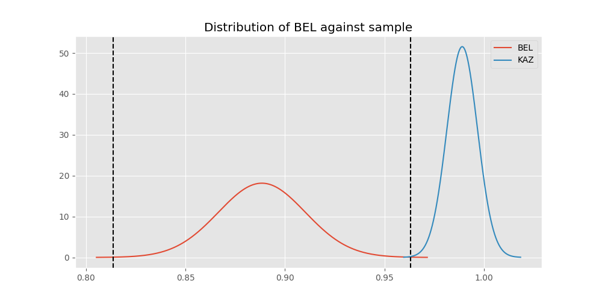 
## Testing Results for BEL against ROC 
BEL has a success rate of 0.8883495145631068
ROC has a success rate of 0.17751479289940827
$H_{0}$: There is not a difference between BEL and ROC
$H_{A}$: There is a difference between BEL and ROC
An $/alpha$ of 0.0008064516129032258 was used in this test.
__independent t-testing__: With a t-statistic of 19.695379592213186 and a p-value of 1.0381096143515418e-59, _we **reject** the null hypothssis_
__Man-Whitney testing__: With a u-statistic of 29780.5 and a p-value of 2.2951392513203422e-43, _we **reject** the null hypothssis_
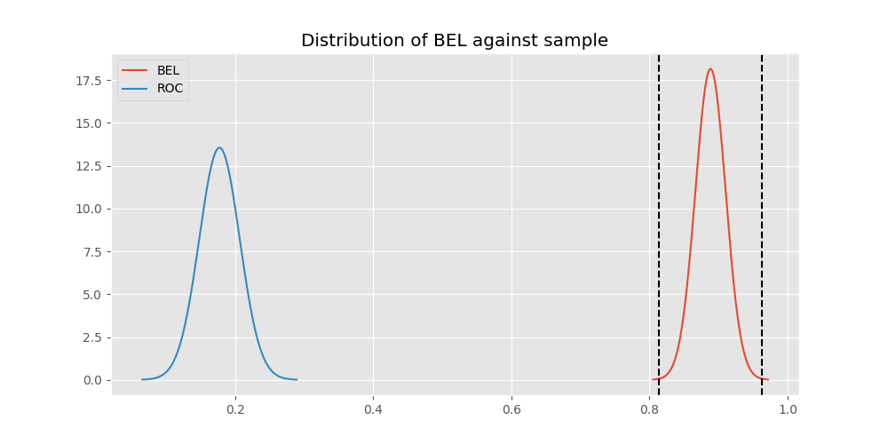 
## Testing Results for BEL against THAI 
BEL has a success rate of 0.8883495145631068
THAI has a success rate of 0.9880952380952381
$H_{0}$: There is not a difference between BEL and THAI
$H_{A}$: There is a difference between BEL and THAI
An $/alpha$ of 0.0008064516129032258 was used in this test.
__independent t-testing__: With a t-statistic of -4.236776757862886 and a p-value of 3.142457243317912e-05, _we **reject** the null hypothssis_
__Man-Whitney testing__: With a u-statistic of 15578.0 and a p-value of 0.0001252802027608564, _we **reject** the null hypothssis_
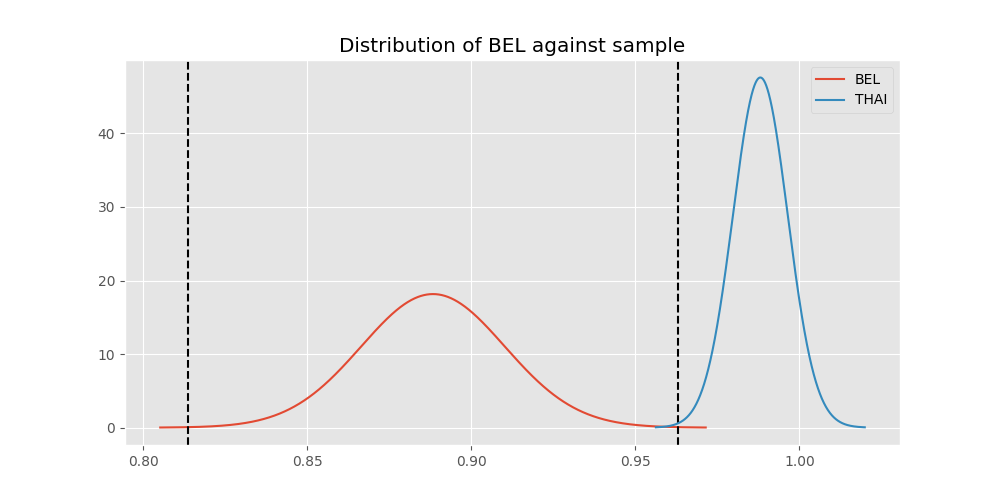 
## Testing Results for BEL against FR 
BEL has a success rate of 0.8883495145631068
FR has a success rate of 0.908183632734531
$H_{0}$: There is not a difference between BEL and FR
$H_{A}$: There is a difference between BEL and FR
An $/alpha$ of 0.0008064516129032258 was used in this test.
__independent t-testing__: With a t-statistic of -0.8067247951474997 and a p-value of 0.42009711321287935, _we failed to reject the null hypothssis_
__Man-Whitney testing__: With a u-statistic of 50579.5 and a p-value of 0.4199372146643663, _we failed to reject the null hypothssis_
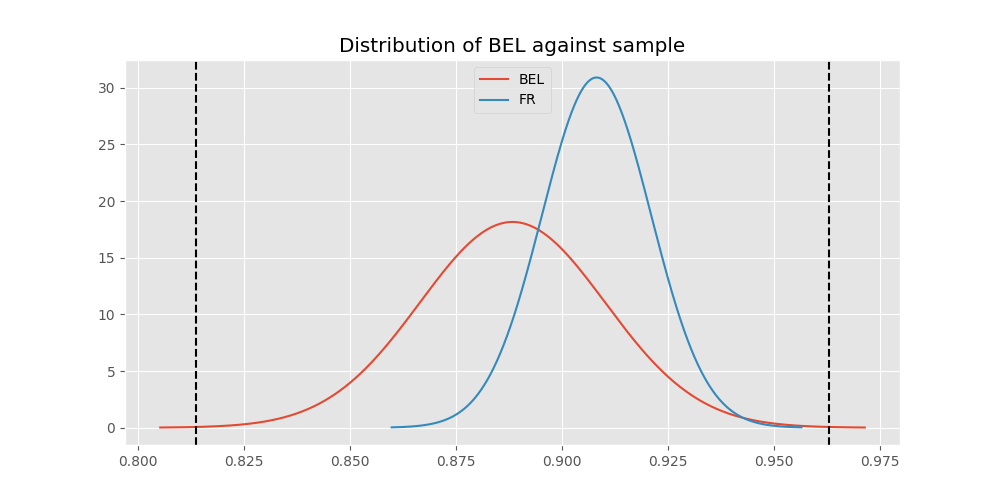 
## Testing Results for BEL against TURK 
BEL has a success rate of 0.8883495145631068
TURK has a success rate of 0.9962264150943396
$H_{0}$: There is not a difference between BEL and TURK
$H_{A}$: There is a difference between BEL and TURK
An $/alpha$ of 0.0008064516129032258 was used in this test.
__independent t-testing__: With a t-statistic of -4.833751797916291 and a p-value of 2.5337837557487626e-06, _we **reject** the null hypothssis_
__Man-Whitney testing__: With a u-statistic of 24350.5 and a p-value of 1.3294669279322158e-07, _we **reject** the null hypothssis_
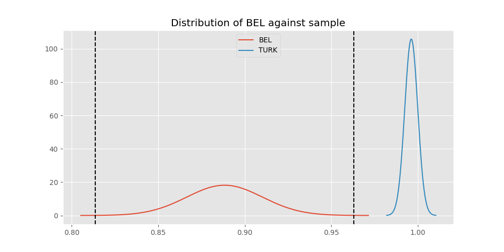 
## Testing Results for BEL against PRC 
BEL has a success rate of 0.8883495145631068
PRC has a success rate of 0.988759187202767
$H_{0}$: There is not a difference between BEL and PRC
$H_{A}$: There is a difference between BEL and PRC
An $/alpha$ of 0.0008064516129032258 was used in this test.
__independent t-testing__: With a t-statistic of -4.542378518673562 and a p-value of 9.39371465096835e-06, _we **reject** the null hypothssis_
__Man-Whitney testing__: With a u-statistic of 214317.5 and a p-value of 1.5710003232906902e-23, _we **reject** the null hypothssis_
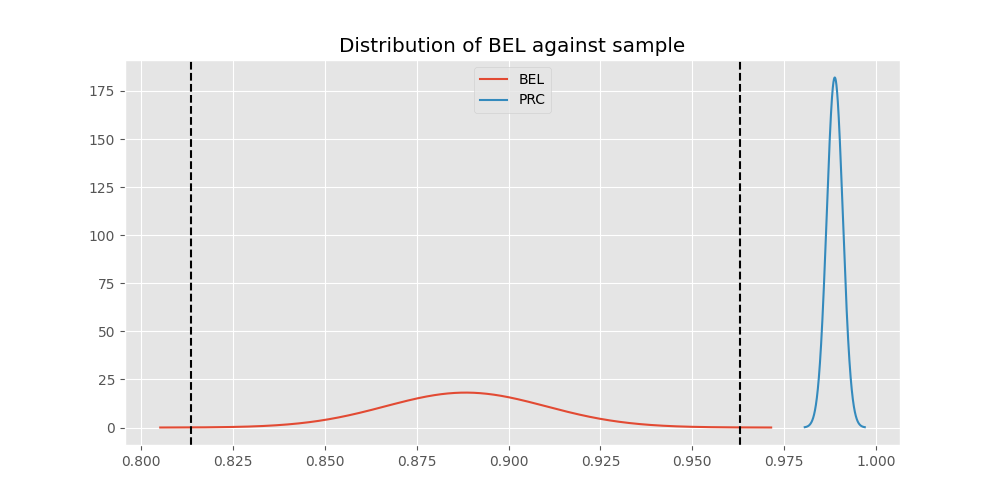 
## Testing Results for BEL against POL 
BEL has a success rate of 0.8883495145631068
POL has a success rate of 0.979381443298969
$H_{0}$: There is not a difference between BEL and POL
$H_{A}$: There is a difference between BEL and POL
An $/alpha$ of 0.0008064516129032258 was used in this test.
__independent t-testing__: With a t-statistic of -3.970881347676242 and a p-value of 9.456197640282237e-05, _we **reject** the null hypothssis_
__Man-Whitney testing__: With a u-statistic of 45407.5 and a p-value of 2.917900429423482e-07, _we **reject** the null hypothssis_
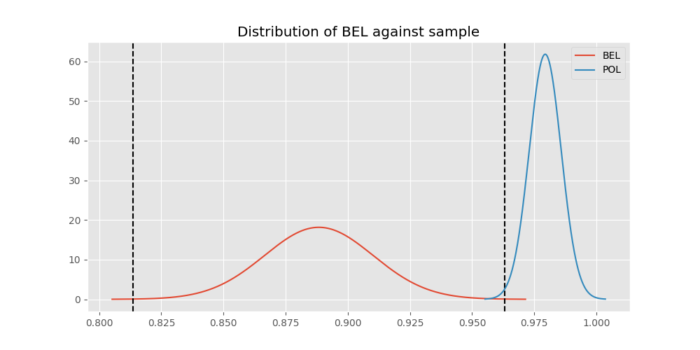 
## Testing Results for BEL against LTU 
BEL has a success rate of 0.8883495145631068
LTU has a success rate of 0.984375
$H_{0}$: There is not a difference between BEL and LTU
$H_{A}$: There is a difference between BEL and LTU
An $/alpha$ of 0.0008064516129032258 was used in this test.
__independent t-testing__: With a t-statistic of -4.163062812741303 and a p-value of 4.344102570122929e-05, _we **reject** the null hypothssis_
__Man-Whitney testing__: With a u-statistic of 29795.0 and a p-value of 1.7258381199571508e-06, _we **reject** the null hypothssis_
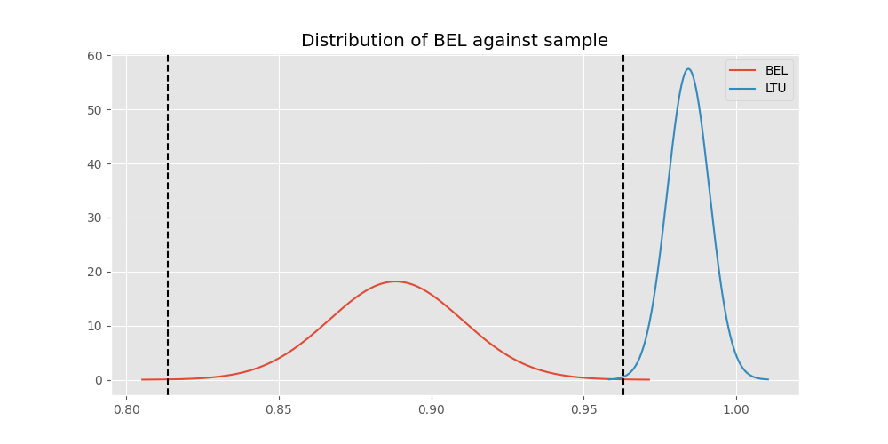 
## Testing Results for BEL against SVN 
BEL has a success rate of 0.8883495145631068
SVN has a success rate of 0.9770114942528736
$H_{0}$: There is not a difference between BEL and SVN
$H_{A}$: There is a difference between BEL and SVN
An $/alpha$ of 0.0008064516129032258 was used in this test.
__independent t-testing__: With a t-statistic of -3.248343718560668 and a p-value of 0.0012987586403263374, _we failed to reject the null hypothssis_
__Man-Whitney testing__: With a u-statistic of 8166.5 and a p-value of 0.01327349569911362, _we failed to reject the null hypothssis_
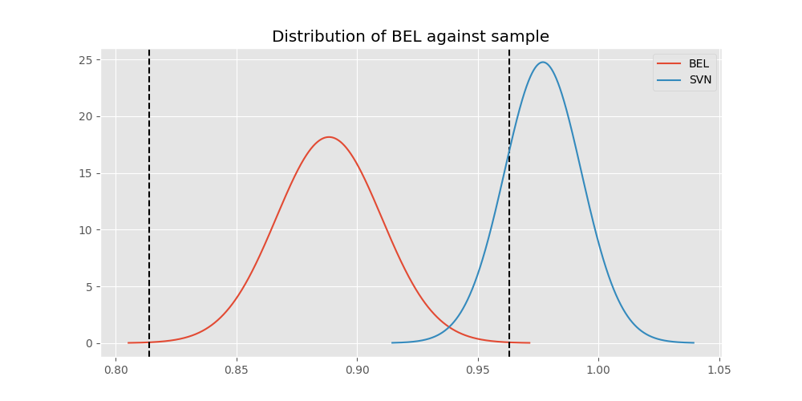 
## Testing Results for BEL against AUS 
BEL has a success rate of 0.8883495145631068
AUS has a success rate of 0.7289377289377289
$H_{0}$: There is not a difference between BEL and AUS
$H_{A}$: There is a difference between BEL and AUS
An $/alpha$ of 0.0008064516129032258 was used in this test.
__independent t-testing__: With a t-statistic of 4.374393879450149 and a p-value of 1.496592564570648e-05, _we **reject** the null hypothssis_
__Man-Whitney testing__: With a u-statistic of 32601.5 and a p-value of 1.7609902347100296e-05, _we **reject** the null hypothssis_
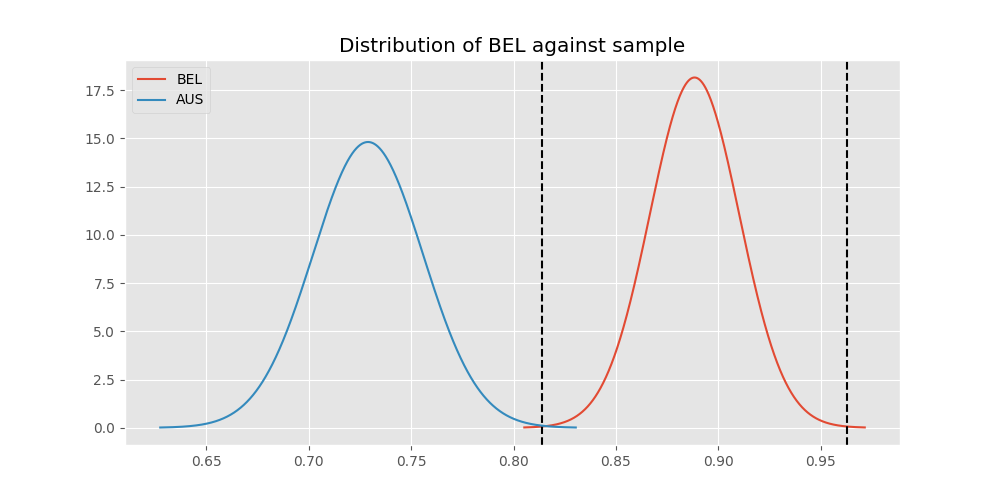 
## Testing Results for BEL against UKR 
BEL has a success rate of 0.8883495145631068
UKR has a success rate of 0.981549815498155
$H_{0}$: There is not a difference between BEL and UKR
$H_{A}$: There is a difference between BEL and UKR
An $/alpha$ of 0.0008064516129032258 was used in this test.
__independent t-testing__: With a t-statistic of -3.9708236828889154 and a p-value of 9.259087419119641e-05, _we **reject** the null hypothssis_
__Man-Whitney testing__: With a u-statistic of 25311.5 and a p-value of 1.835309920225393e-05, _we **reject** the null hypothssis_
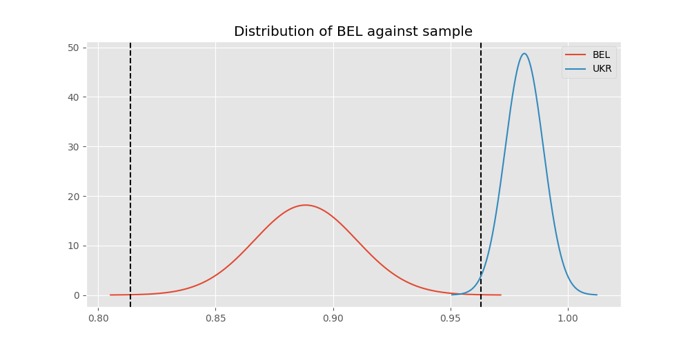 
## Testing Results for BEL against CIS 
BEL has a success rate of 0.8883495145631068
CIS has a success rate of 0.837386018237082
$H_{0}$: There is not a difference between BEL and CIS
$H_{A}$: There is a difference between BEL and CIS
An $/alpha$ of 0.0008064516129032258 was used in this test.
__independent t-testing__: With a t-statistic of 1.7866618065317479 and a p-value of 0.07434349972362533, _we failed to reject the null hypothssis_
__Man-Whitney testing__: With a u-statistic of 71228.0 and a p-value of 0.07440114543036999, _we failed to reject the null hypothssis_
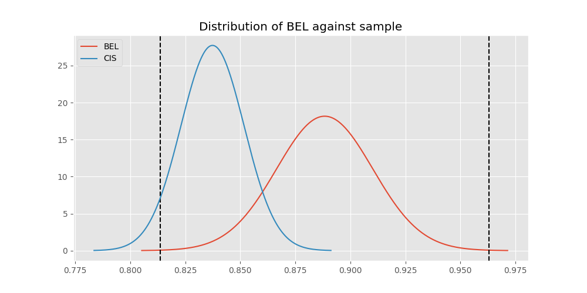 
## Testing Results for BEL against SAFR 
BEL has a success rate of 0.8883495145631068
SAFR has a success rate of 0.9328358208955224
$H_{0}$: There is not a difference between BEL and SAFR
$H_{A}$: There is a difference between BEL and SAFR
An $/alpha$ of 0.0008064516129032258 was used in this test.
__independent t-testing__: With a t-statistic of -1.372547229437559 and a p-value of 0.17080320313422054, _we failed to reject the null hypothssis_
__Man-Whitney testing__: With a u-statistic of 13188.0 and a p-value of 0.17079770712013465, _we failed to reject the null hypothssis_
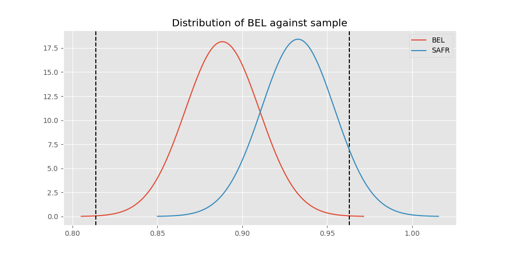 
## Testing Results for BEL against TBD 
BEL has a success rate of 0.8883495145631068
TBD has a success rate of 0.9898734177215189
$H_{0}$: There is not a difference between BEL and TBD
$H_{A}$: There is a difference between BEL and TBD
An $/alpha$ of 0.0008064516129032258 was used in this test.
__independent t-testing__: With a t-statistic of -4.498777970637901 and a p-value of 1.0916476427600508e-05, _we **reject** the null hypothssis_
__Man-Whitney testing__: With a u-statistic of 36554.5 and a p-value of 1.2156433472397032e-08, _we **reject** the null hypothssis_
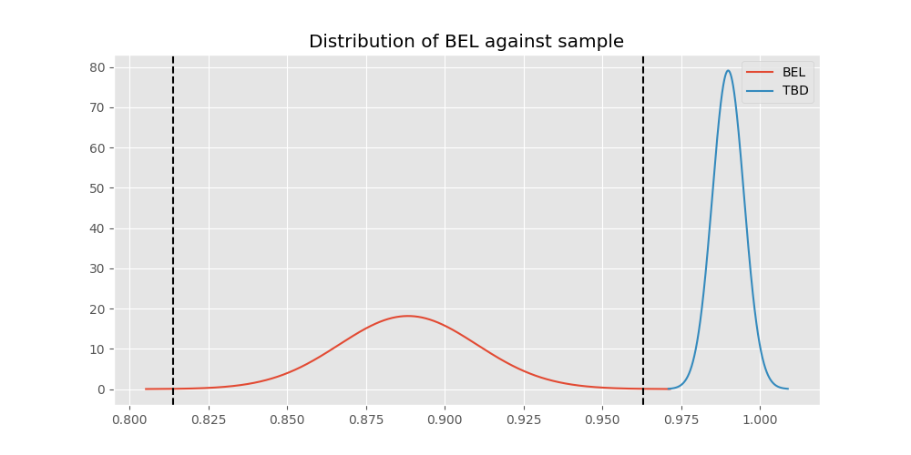 
## Testing Results for BEL against ESA 
BEL has a success rate of 0.8883495145631068
ESA has a success rate of 0.9811320754716981
$H_{0}$: There is not a difference between BEL and ESA
$H_{A}$: There is a difference between BEL and ESA
An $/alpha$ of 0.0008064516129032258 was used in this test.
__independent t-testing__: With a t-statistic of -3.611196168944752 and a p-value of 0.00035658336179710757, _we **reject** the null hypothssis_
__Man-Whitney testing__: With a u-statistic of 9905.0 and a p-value of 0.004330329047089985, _we failed to reject the null hypothssis_
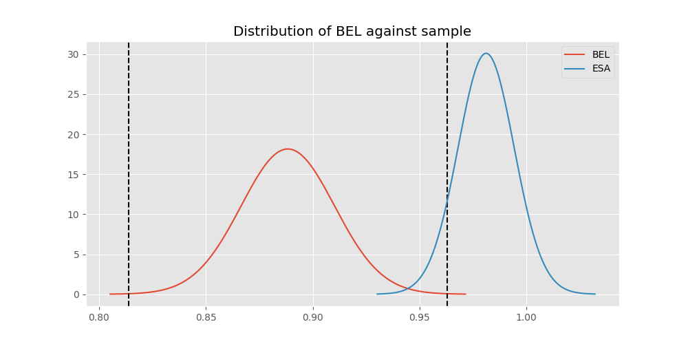 
## Testing Results for BEL against UK 
BEL has a success rate of 0.8883495145631068
UK has a success rate of 0.9881796690307328
$H_{0}$: There is not a difference between BEL and UK
$H_{A}$: There is a difference between BEL and UK
An $/alpha$ of 0.0008064516129032258 was used in this test.
__independent t-testing__: With a t-statistic of -4.475065473078317 and a p-value of 1.2333727982590796e-05, _we **reject** the null hypothssis_
__Man-Whitney testing__: With a u-statistic of 78439.0 and a p-value of 1.7401844076271341e-13, _we **reject** the null hypothssis_
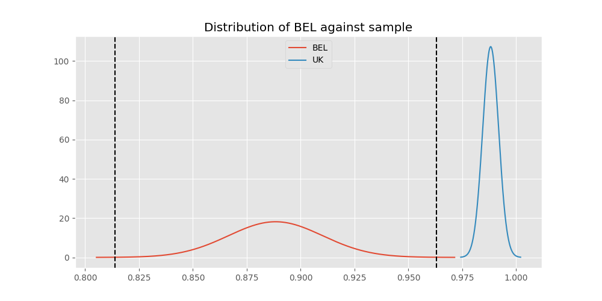 
## Testing Results for BEL against GER 
BEL has a success rate of 0.8883495145631068
GER has a success rate of 0.9766233766233766
$H_{0}$: There is not a difference between BEL and GER
$H_{A}$: There is a difference between BEL and GER
An $/alpha$ of 0.0008064516129032258 was used in this test.
__independent t-testing__: With a t-statistic of -3.9727747827085946 and a p-value of 9.715057734670125e-05, _we **reject** the null hypothssis_
__Man-Whitney testing__: With a u-statistic of 216927.0 and a p-value of 1.8335303413519e-12, _we **reject** the null hypothssis_
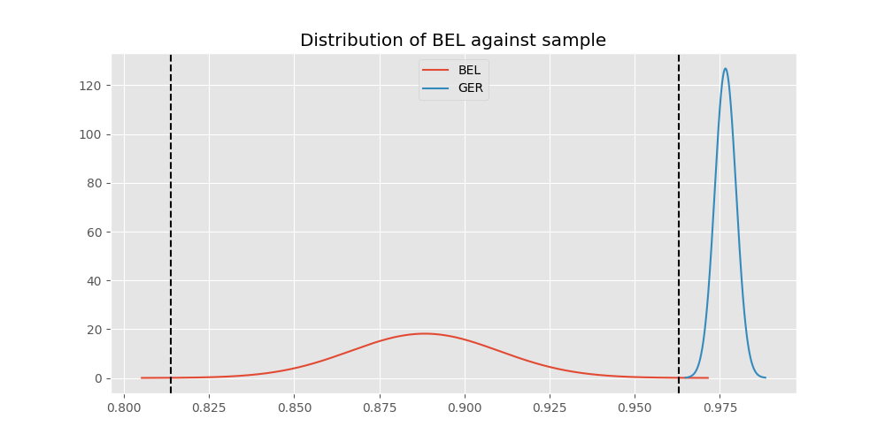 
