# Testing Results For CIS 
$H_{0}$: There is not a difference in collection success against CIS 
$H_{A}$: There is a difference in collection success against CIS
An $\alpha$ of 0.0008064516129032258 was used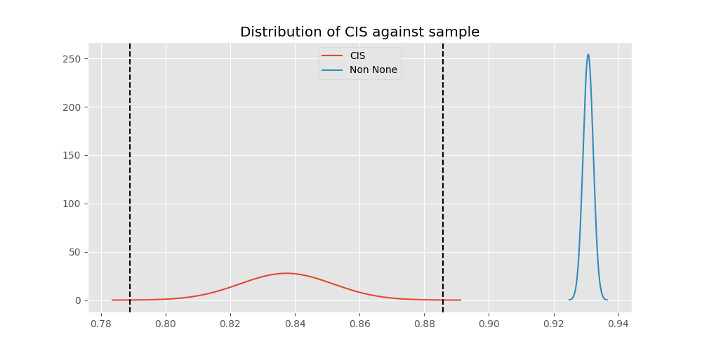 
Out of 25 tests, there were 22 rejections from 25 independent-t test.
Out of 25 tests, there were 20 rejections from 25 Man Whitney u-tests.
## Testing Results for CIS against IND 
CIS has a success rate of 0.837386018237082
IND has a success rate of 0.9704433497536946
$H_{0}$: There is not a difference between CIS and IND
$H_{A}$: There is a difference between CIS and IND
An $/alpha$ of 0.0008064516129032258 was used in this test.
__independent t-testing__: With a t-statistic of -7.979047958579687 and a p-value of 4.042168671257434e-15, _we **reject** the null hypothssis_
__Man-Whitney testing__: With a u-statistic of 115801.0 and a p-value of 2.2902938671209274e-11, _we **reject** the null hypothssis_
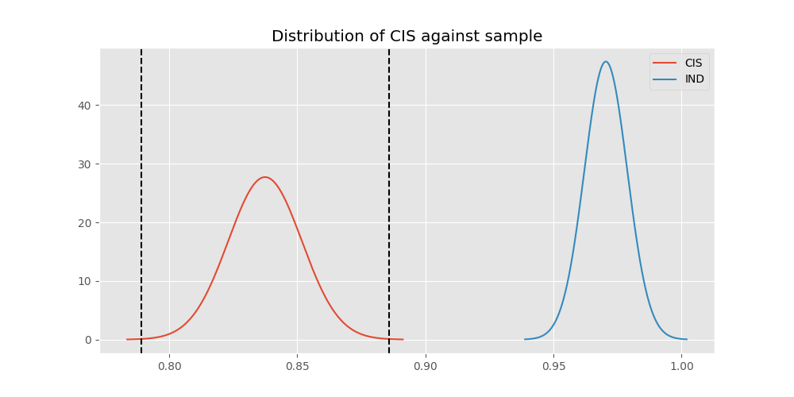 
## Testing Results for CIS against GUAT 
CIS has a success rate of 0.837386018237082
GUAT has a success rate of 0.9705882352941176
$H_{0}$: There is not a difference between CIS and GUAT
$H_{A}$: There is a difference between CIS and GUAT
An $/alpha$ of 0.0008064516129032258 was used in this test.
__independent t-testing__: With a t-statistic of -5.29292646633285 and a p-value of 4.378738821561102e-07, _we **reject** the null hypothssis_
__Man-Whitney testing__: With a u-statistic of 19392.0 and a p-value of 0.003445062932132153, _we failed to reject the null hypothssis_
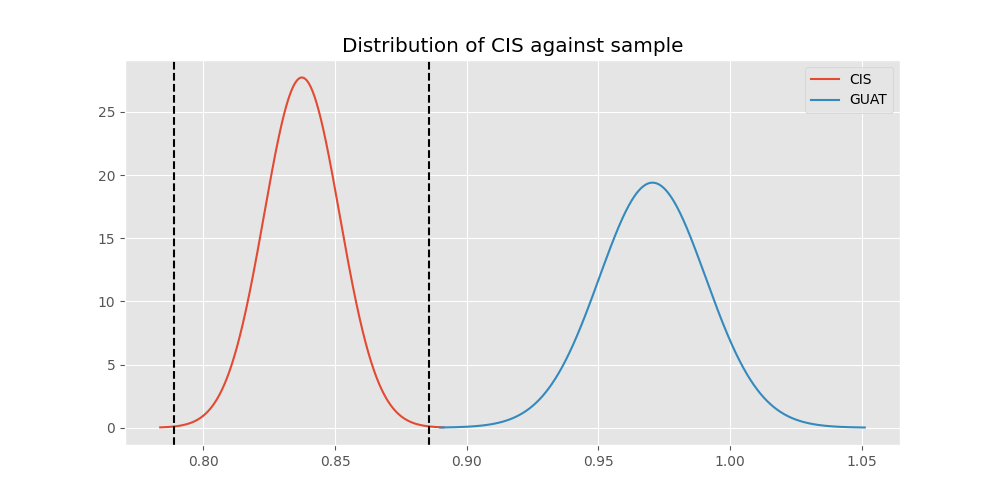 
## Testing Results for CIS against IT 
CIS has a success rate of 0.837386018237082
IT has a success rate of 0.9217391304347826
$H_{0}$: There is not a difference between CIS and IT
$H_{A}$: There is a difference between CIS and IT
An $/alpha$ of 0.0008064516129032258 was used in this test.
__independent t-testing__: With a t-statistic of -5.2519221208930364 and a p-value of 1.710481894096418e-07, _we **reject** the null hypothssis_
__Man-Whitney testing__: With a u-statistic of 277148.0 and a p-value of 1.907763939569969e-07, _we **reject** the null hypothssis_
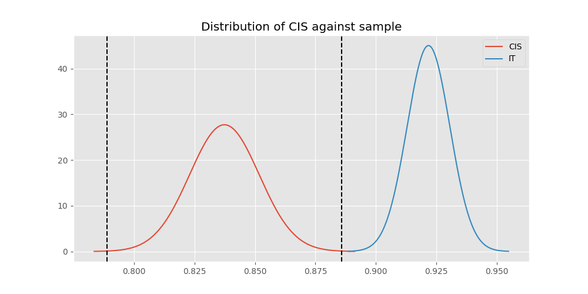 
## Testing Results for CIS against EST 
CIS has a success rate of 0.837386018237082
EST has a success rate of 0.975
$H_{0}$: There is not a difference between CIS and EST
$H_{A}$: There is a difference between CIS and EST
An $/alpha$ of 0.0008064516129032258 was used in this test.
__independent t-testing__: With a t-statistic of -4.770157410365344 and a p-value of 9.978075263796883e-06, _we **reject** the null hypothssis_
__Man-Whitney testing__: With a u-statistic of 11349.0 and a p-value of 0.019577932596382665, _we failed to reject the null hypothssis_
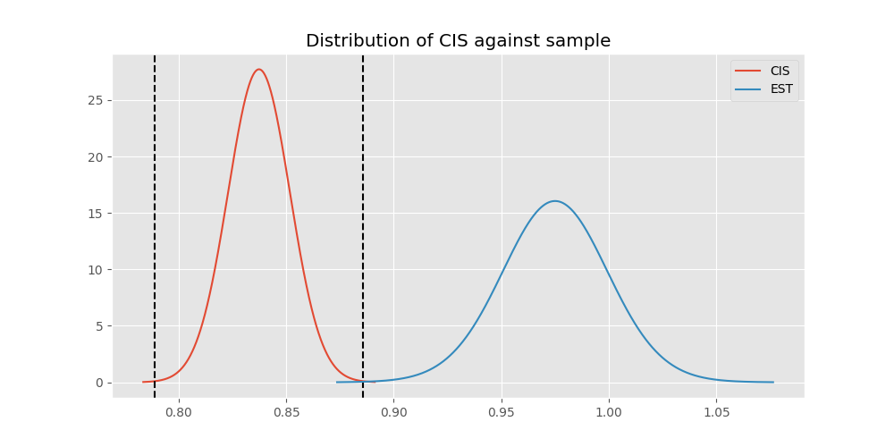 
## Testing Results for CIS against SKOR 
CIS has a success rate of 0.837386018237082
SKOR has a success rate of 0.9166666666666666
$H_{0}$: There is not a difference between CIS and SKOR
$H_{A}$: There is a difference between CIS and SKOR
An $/alpha$ of 0.0008064516129032258 was used in this test.
__independent t-testing__: With a t-statistic of -1.6209227784472569 and a p-value of 0.10547447471675091, _we failed to reject the null hypothssis_
__Man-Whitney testing__: With a u-statistic of 18175.0 and a p-value of 0.1055400076269359, _we failed to reject the null hypothssis_
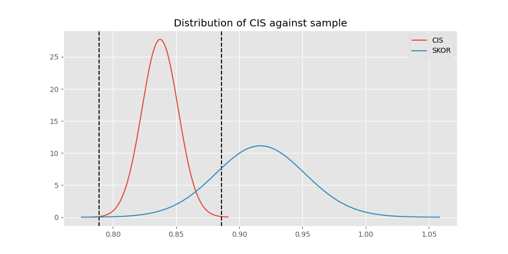 
## Testing Results for CIS against RP 
CIS has a success rate of 0.837386018237082
RP has a success rate of 0.6735187424425635
$H_{0}$: There is not a difference between CIS and RP
$H_{A}$: There is a difference between CIS and RP
An $/alpha$ of 0.0008064516129032258 was used in this test.
__independent t-testing__: With a t-statistic of 7.331959707055086 and a p-value of 3.71475177759593e-13, _we **reject** the null hypothssis_
__Man-Whitney testing__: With a u-statistic of 316668.5 and a p-value of 5.807583597568193e-13, _we **reject** the null hypothssis_
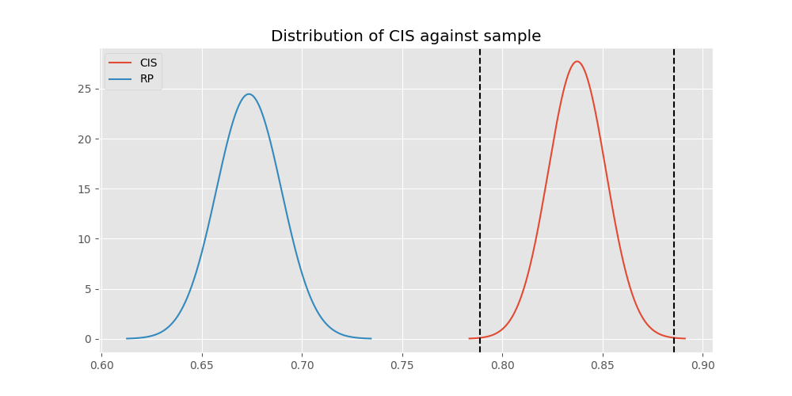 
## Testing Results for CIS against JPN 
CIS has a success rate of 0.837386018237082
JPN has a success rate of 0.6016371077762619
$H_{0}$: There is not a difference between CIS and JPN
$H_{A}$: There is a difference between CIS and JPN
An $/alpha$ of 0.0008064516129032258 was used in this test.
__independent t-testing__: With a t-statistic of 10.045031225768561 and a p-value of 5.747706962513184e-23, _we **reject** the null hypothssis_
__Man-Whitney testing__: With a u-statistic of 298009.5 and a p-value of 2.9469827520376585e-22, _we **reject** the null hypothssis_
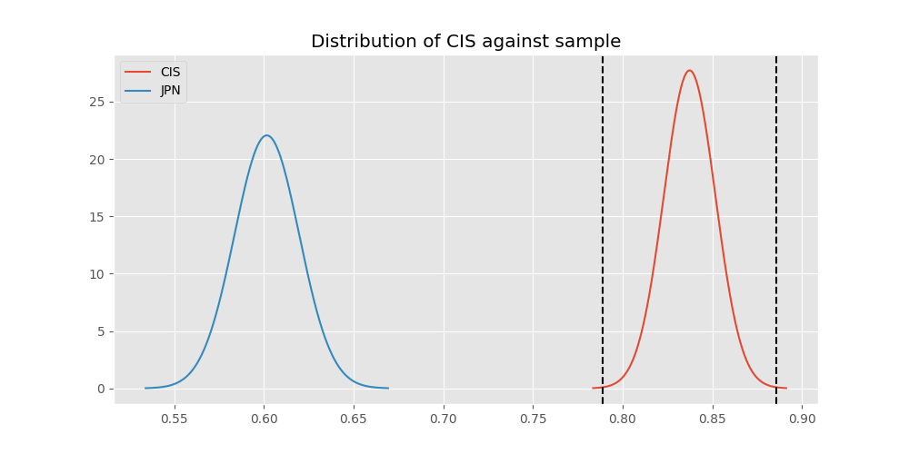 
## Testing Results for CIS against US 
CIS has a success rate of 0.837386018237082
US has a success rate of 0.918885774351787
$H_{0}$: There is not a difference between CIS and US
$H_{A}$: There is a difference between CIS and US
An $/alpha$ of 0.0008064516129032258 was used in this test.
__independent t-testing__: With a t-statistic of -6.958580638752264 and a p-value of 3.781232414585669e-12, _we **reject** the null hypothssis_
__Man-Whitney testing__: With a u-statistic of 1724881.0 and a p-value of 4.126502381031949e-12, _we **reject** the null hypothssis_
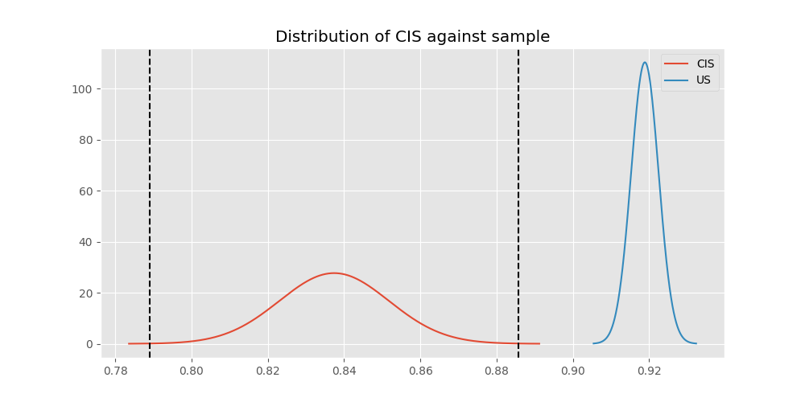 
## Testing Results for CIS against KAZ 
CIS has a success rate of 0.837386018237082
KAZ has a success rate of 0.989010989010989
$H_{0}$: There is not a difference between CIS and KAZ
$H_{A}$: There is a difference between CIS and KAZ
An $/alpha$ of 0.0008064516129032258 was used in this test.
__independent t-testing__: With a t-statistic of -9.273969197832455 and a p-value of 1.4881520822396457e-19, _we **reject** the null hypothssis_
__Man-Whitney testing__: With a u-statistic of 50799.0 and a p-value of 7.285129184803175e-08, _we **reject** the null hypothssis_
 
## Testing Results for CIS against ROC 
CIS has a success rate of 0.837386018237082
ROC has a success rate of 0.17751479289940827
$H_{0}$: There is not a difference between CIS and ROC
$H_{A}$: There is a difference between CIS and ROC
An $/alpha$ of 0.0008064516129032258 was used in this test.
__independent t-testing__: With a t-statistic of 20.55958575715903 and a p-value of 3.714515386195179e-76, _we **reject** the null hypothssis_
__Man-Whitney testing__: With a u-statistic of 92290.5 and a p-value of 8.194638676985894e-63, _we **reject** the null hypothssis_
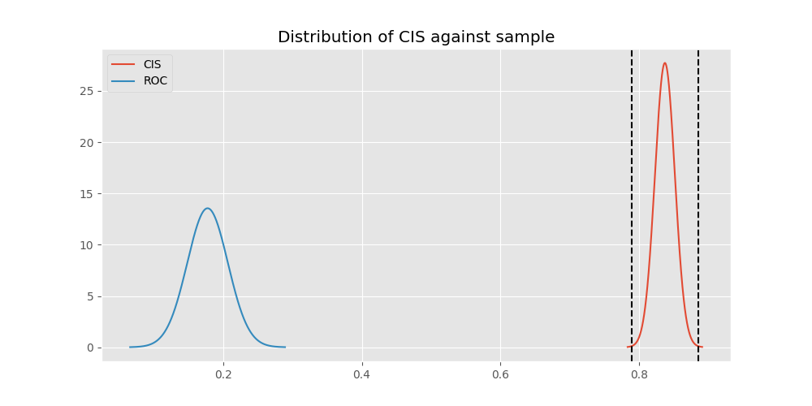 
## Testing Results for CIS against THAI 
CIS has a success rate of 0.837386018237082
THAI has a success rate of 0.9880952380952381
$H_{0}$: There is not a difference between CIS and THAI
$H_{A}$: There is a difference between CIS and THAI
An $/alpha$ of 0.0008064516129032258 was used in this test.
__independent t-testing__: With a t-statistic of -9.043841275606015 and a p-value of 1.09676185187051e-18, _we **reject** the null hypothssis_
__Man-Whitney testing__: With a u-statistic of 46942.0 and a p-value of 2.633292325907115e-07, _we **reject** the null hypothssis_
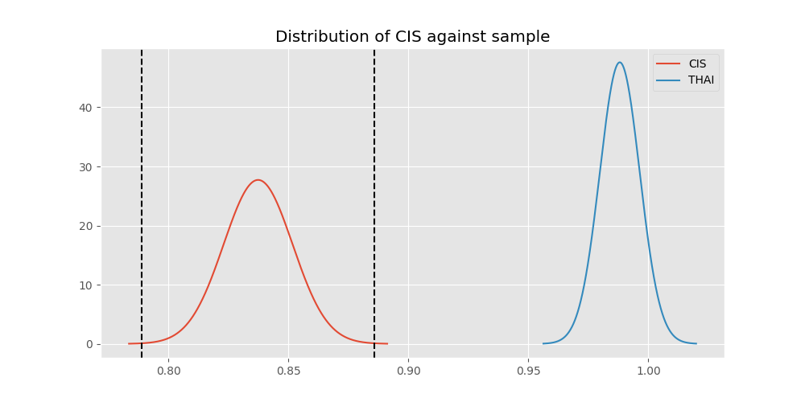 
## Testing Results for CIS against FR 
CIS has a success rate of 0.837386018237082
FR has a success rate of 0.908183632734531
$H_{0}$: There is not a difference between CIS and FR
$H_{A}$: There is a difference between CIS and FR
An $/alpha$ of 0.0008064516129032258 was used in this test.
__independent t-testing__: With a t-statistic of -3.5433670063437197 and a p-value of 0.00041079883431370973, _we **reject** the null hypothssis_
__Man-Whitney testing__: With a u-statistic of 153159.5 and a p-value of 0.00042241634188781504, _we **reject** the null hypothssis_
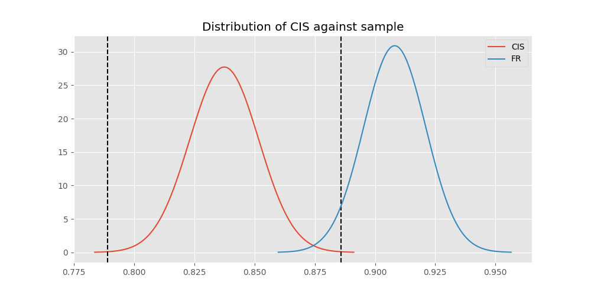 
## Testing Results for CIS against TURK 
CIS has a success rate of 0.837386018237082
TURK has a success rate of 0.9962264150943396
$H_{0}$: There is not a difference between CIS and TURK
$H_{A}$: There is a difference between CIS and TURK
An $/alpha$ of 0.0008064516129032258 was used in this test.
__independent t-testing__: With a t-statistic of -10.672665023014911 and a p-value of 7.786514880415876e-25, _we **reject** the null hypothssis_
__Man-Whitney testing__: With a u-statistic of 73336.5 and a p-value of 1.1352500224054466e-11, _we **reject** the null hypothssis_
 
## Testing Results for CIS against PRC 
CIS has a success rate of 0.837386018237082
PRC has a success rate of 0.988759187202767
$H_{0}$: There is not a difference between CIS and PRC
$H_{A}$: There is a difference between CIS and PRC
An $/alpha$ of 0.0008064516129032258 was used in this test.
__independent t-testing__: With a t-statistic of -10.39467048158904 and a p-value of 1.3195993088026324e-23, _we **reject** the null hypothssis_
__Man-Whitney testing__: With a u-statistic of 645785.5 and a p-value of 1.2457857782157252e-61, _we **reject** the null hypothssis_
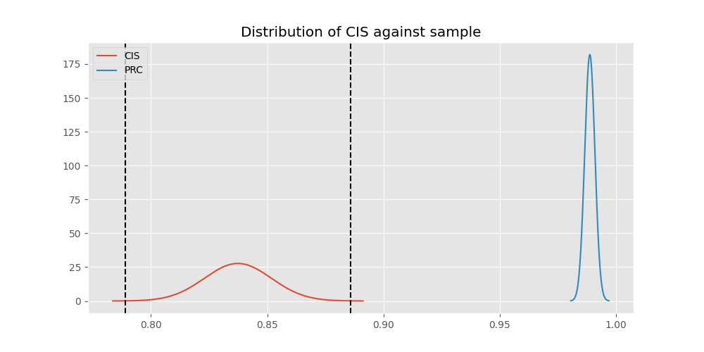 
## Testing Results for CIS against BEL 
CIS has a success rate of 0.837386018237082
BEL has a success rate of 0.8883495145631068
$H_{0}$: There is not a difference between CIS and BEL
$H_{A}$: There is a difference between CIS and BEL
An $/alpha$ of 0.0008064516129032258 was used in this test.
__independent t-testing__: With a t-statistic of -1.7866618065317479 and a p-value of 0.07434349972362533, _we failed to reject the null hypothssis_
__Man-Whitney testing__: With a u-statistic of 64320.0 and a p-value of 0.07440114543036999, _we failed to reject the null hypothssis_
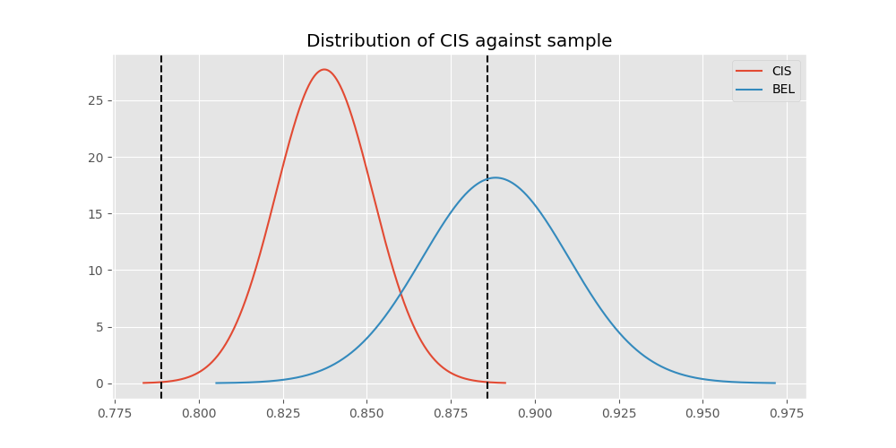 
## Testing Results for CIS against POL 
CIS has a success rate of 0.837386018237082
POL has a success rate of 0.979381443298969
$H_{0}$: There is not a difference between CIS and POL
$H_{A}$: There is a difference between CIS and POL
An $/alpha$ of 0.0008064516129032258 was used in this test.
__independent t-testing__: With a t-statistic of -8.998896795443446 and a p-value of 1.3311325049975965e-18, _we **reject** the null hypothssis_
__Man-Whitney testing__: With a u-statistic of 136907.5 and a p-value of 5.127213926555141e-15, _we **reject** the null hypothssis_
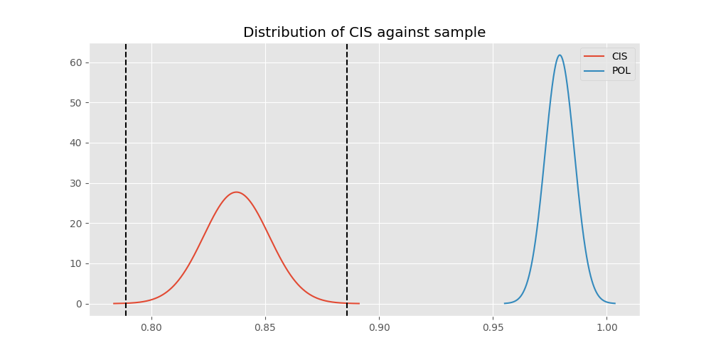 
## Testing Results for CIS against LTU 
CIS has a success rate of 0.837386018237082
LTU has a success rate of 0.984375
$H_{0}$: There is not a difference between CIS and LTU
$H_{A}$: There is a difference between CIS and LTU
An $/alpha$ of 0.0008064516129032258 was used in this test.
__independent t-testing__: With a t-statistic of -9.196207049605036 and a p-value of 2.5262600643379964e-19, _we **reject** the null hypothssis_
__Man-Whitney testing__: With a u-statistic of 89805.0 and a p-value of 1.2948717065451141e-11, _we **reject** the null hypothssis_
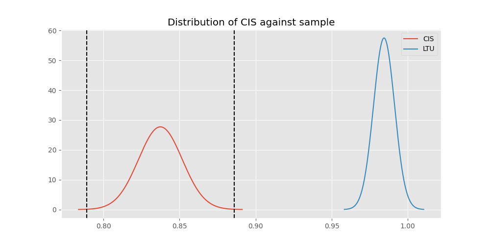 
## Testing Results for CIS against SVN 
CIS has a success rate of 0.837386018237082
SVN has a success rate of 0.9770114942528736
$H_{0}$: There is not a difference between CIS and SVN
$H_{A}$: There is a difference between CIS and SVN
An $/alpha$ of 0.0008064516129032258 was used in this test.
__independent t-testing__: With a t-statistic of -6.451264822919126 and a p-value of 5.520348367751767e-10, _we **reject** the null hypothssis_
__Man-Whitney testing__: With a u-statistic of 24626.5 and a p-value of 0.0005393534186493887, _we **reject** the null hypothssis_
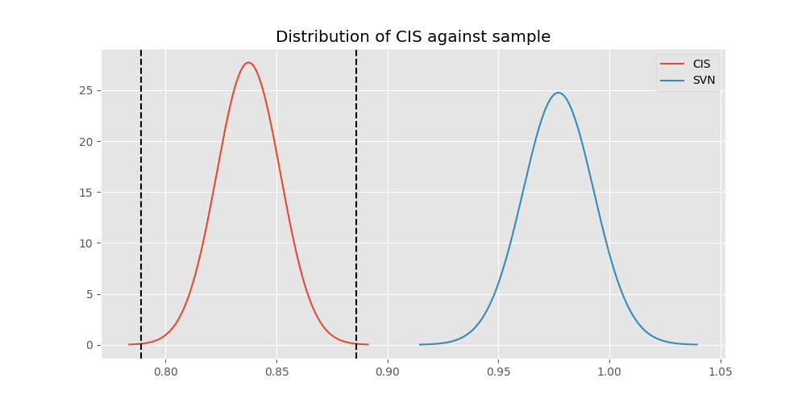 
## Testing Results for CIS against AUS 
CIS has a success rate of 0.837386018237082
AUS has a success rate of 0.7289377289377289
$H_{0}$: There is not a difference between CIS and AUS
$H_{A}$: There is a difference between CIS and AUS
An $/alpha$ of 0.0008064516129032258 was used in this test.
__independent t-testing__: With a t-statistic of 3.8323128558419923 and a p-value of 0.00013548474417008117, _we **reject** the null hypothssis_
__Man-Whitney testing__: With a u-statistic of 99557.5 and a p-value of 0.0001422486296251138, _we **reject** the null hypothssis_
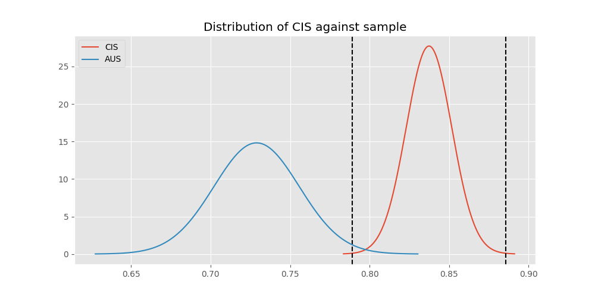 
## Testing Results for CIS against UKR 
CIS has a success rate of 0.837386018237082
UKR has a success rate of 0.981549815498155
$H_{0}$: There is not a difference between CIS and UKR
$H_{A}$: There is a difference between CIS and UKR
An $/alpha$ of 0.0008064516129032258 was used in this test.
__independent t-testing__: With a t-statistic of -8.70394154772984 and a p-value of 1.4693688655611954e-17, _we **reject** the null hypothssis_
__Man-Whitney testing__: With a u-statistic of 76305.5 and a p-value of 8.76424815161289e-10, _we **reject** the null hypothssis_
 
## Testing Results for CIS against SAFR 
CIS has a success rate of 0.837386018237082
SAFR has a success rate of 0.9328358208955224
$H_{0}$: There is not a difference between CIS and SAFR
$H_{A}$: There is a difference between CIS and SAFR
An $/alpha$ of 0.0008064516129032258 was used in this test.
__independent t-testing__: With a t-statistic of -2.8594831778804273 and a p-value of 0.004355132128861023, _we failed to reject the null hypothssis_
__Man-Whitney testing__: With a u-statistic of 39878.0 and a p-value of 0.004423596569588602, _we failed to reject the null hypothssis_
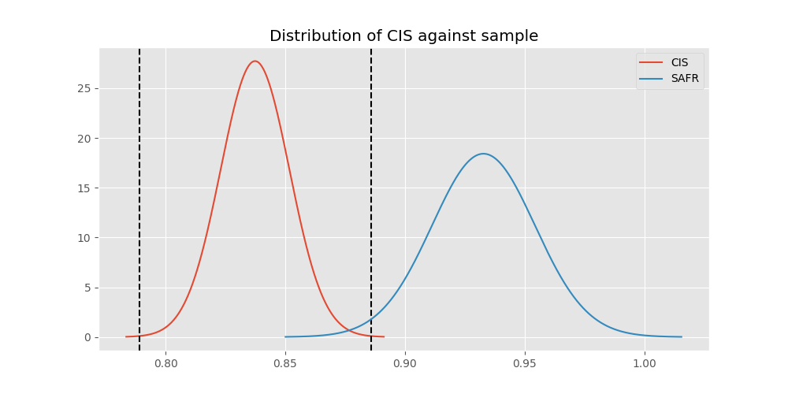 
## Testing Results for CIS against TBD 
CIS has a success rate of 0.837386018237082
TBD has a success rate of 0.9898734177215189
$H_{0}$: There is not a difference between CIS and TBD
$H_{A}$: There is a difference between CIS and TBD
An $/alpha$ of 0.0008064516129032258 was used in this test.
__independent t-testing__: With a t-statistic of -9.996154379042485 and a p-value of 2.9212985992563705e-22, _we **reject** the null hypothssis_
__Man-Whitney testing__: With a u-statistic of 110138.5 and a p-value of 6.314527551108603e-15, _we **reject** the null hypothssis_
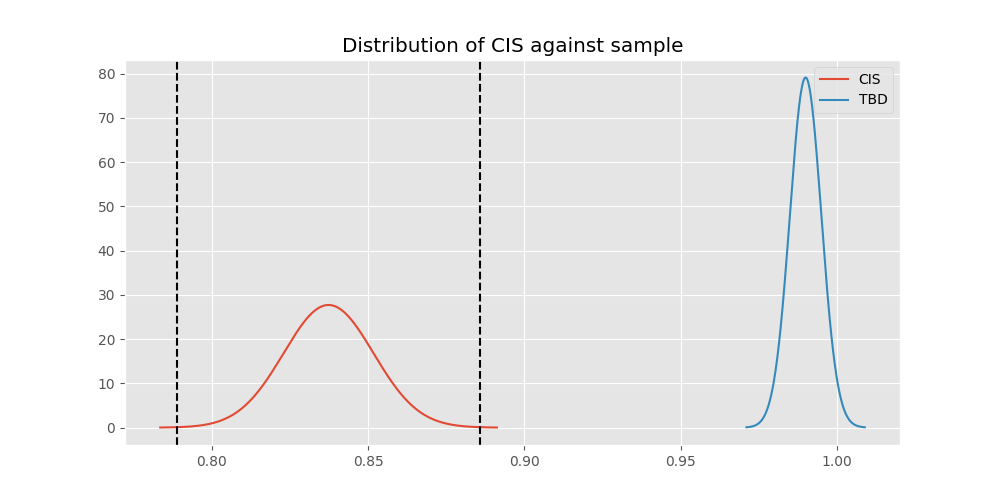 
## Testing Results for CIS against ESA 
CIS has a success rate of 0.837386018237082
ESA has a success rate of 0.9811320754716981
$H_{0}$: There is not a difference between CIS and ESA
$H_{A}$: There is a difference between CIS and ESA
An $/alpha$ of 0.0008064516129032258 was used in this test.
__independent t-testing__: With a t-statistic of -7.339665256693943 and a p-value of 1.1730032261871962e-12, _we **reject** the null hypothssis_
__Man-Whitney testing__: With a u-statistic of 29861.0 and a p-value of 8.703234036305385e-05, _we **reject** the null hypothssis_
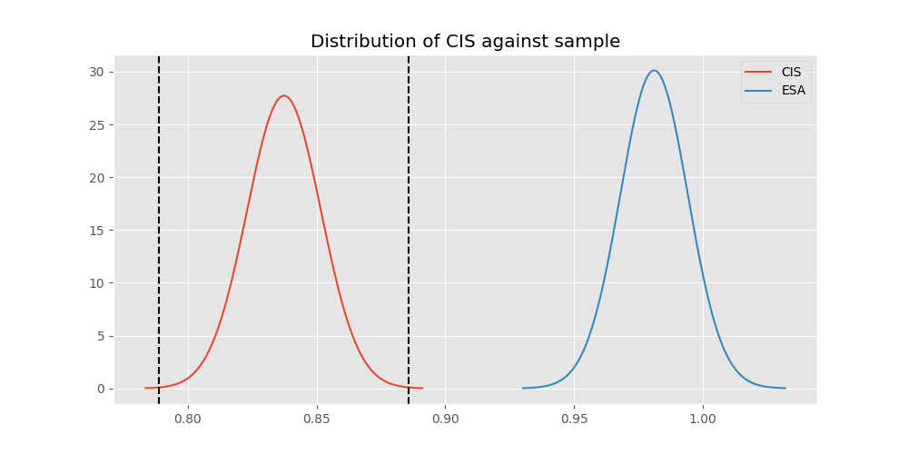 
## Testing Results for CIS against UK 
CIS has a success rate of 0.837386018237082
UK has a success rate of 0.9881796690307328
$H_{0}$: There is not a difference between CIS and UK
$H_{A}$: There is a difference between CIS and UK
An $/alpha$ of 0.0008064516129032258 was used in this test.
__independent t-testing__: With a t-statistic of -10.141539797134705 and a p-value of 9.974831424253161e-23, _we **reject** the null hypothssis_
__Man-Whitney testing__: With a u-statistic of 236363.0 and a p-value of 2.5529063773245578e-27, _we **reject** the null hypothssis_
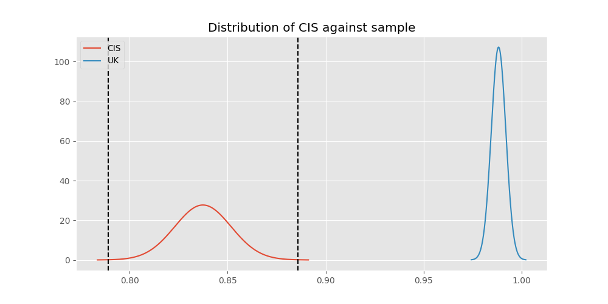 
## Testing Results for CIS against GER 
CIS has a success rate of 0.837386018237082
GER has a success rate of 0.9766233766233766
$H_{0}$: There is not a difference between CIS and GER
$H_{A}$: There is a difference between CIS and GER
An $/alpha$ of 0.0008064516129032258 was used in this test.
__independent t-testing__: With a t-statistic of -9.448809483733974 and a p-value of 4.679070490417941e-20, _we **reject** the null hypothssis_
__Man-Whitney testing__: With a u-statistic of 654171.0 and a p-value of 5.582036356526708e-44, _we **reject** the null hypothssis_
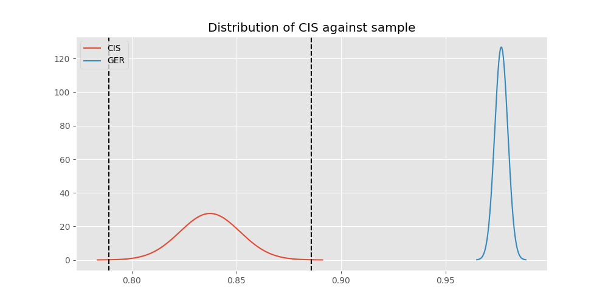 
