# Testing Results For ESA 
$H_{0}$: There is not a difference in collection success against ESA 
$H_{A}$: There is a difference in collection success against ESA
An $\alpha$ of 0.0008064516129032258 was used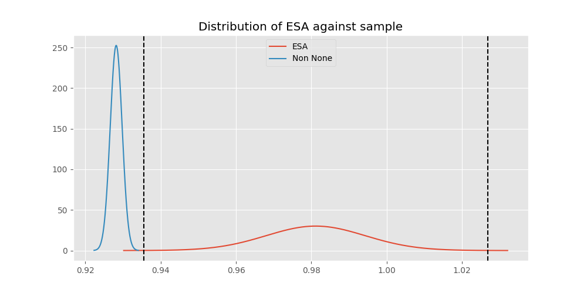 
Out of 25 tests, there were 5 rejections from 25 independent-t test.
Out of 25 tests, there were 5 rejections from 25 Man Whitney u-tests.
## Testing Results for ESA against IND 
ESA has a success rate of 0.9811320754716981
IND has a success rate of 0.9704433497536946
$H_{0}$: There is not a difference between ESA and IND
$H_{A}$: There is a difference between ESA and IND
An $/alpha$ of 0.0008064516129032258 was used in this test.
__independent t-testing__: With a t-statistic of 0.5999312329960799 and a p-value of 0.5488185208611764, _we failed to reject the null hypothssis_
__Man-Whitney testing__: With a u-statistic of 21748.0 and a p-value of 0.5491713443765249, _we failed to reject the null hypothssis_
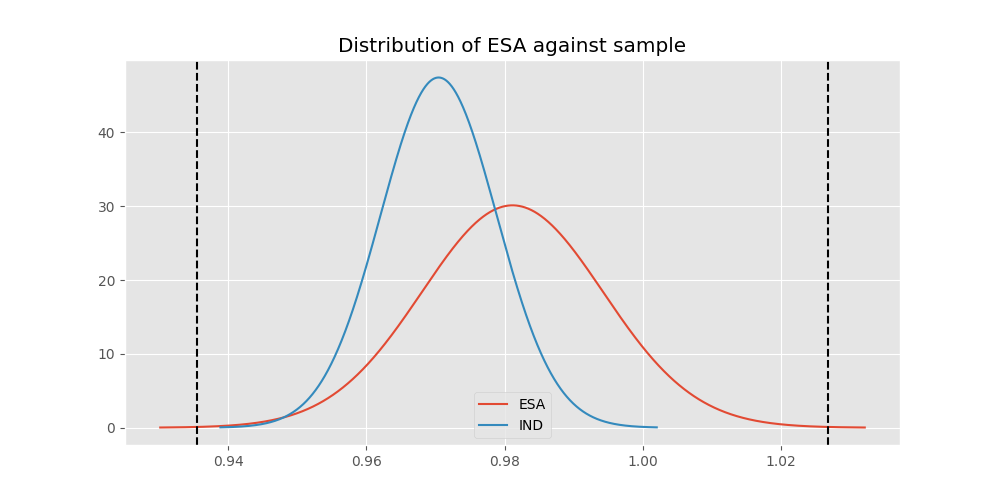 
## Testing Results for ESA against GUAT 
ESA has a success rate of 0.9811320754716981
GUAT has a success rate of 0.9705882352941176
$H_{0}$: There is not a difference between ESA and GUAT
$H_{A}$: There is a difference between ESA and GUAT
An $/alpha$ of 0.0008064516129032258 was used in this test.
__independent t-testing__: With a t-statistic of 0.4504763691659502 and a p-value of 0.6529343014784484, _we failed to reject the null hypothssis_
__Man-Whitney testing__: With a u-statistic of 3642.0 and a p-value of 0.6559030466618792, _we failed to reject the null hypothssis_
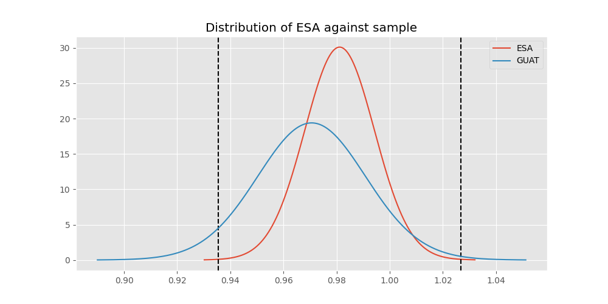 
## Testing Results for ESA against IT 
ESA has a success rate of 0.9811320754716981
IT has a success rate of 0.9217391304347826
$H_{0}$: There is not a difference between ESA and IT
$H_{A}$: There is a difference between ESA and IT
An $/alpha$ of 0.0008064516129032258 was used in this test.
__independent t-testing__: With a t-statistic of 2.2416112526442147 and a p-value of 0.025200044696326477, _we failed to reject the null hypothssis_
__Man-Whitney testing__: With a u-statistic of 51656.0 and a p-value of 0.025297002274015476, _we failed to reject the null hypothssis_
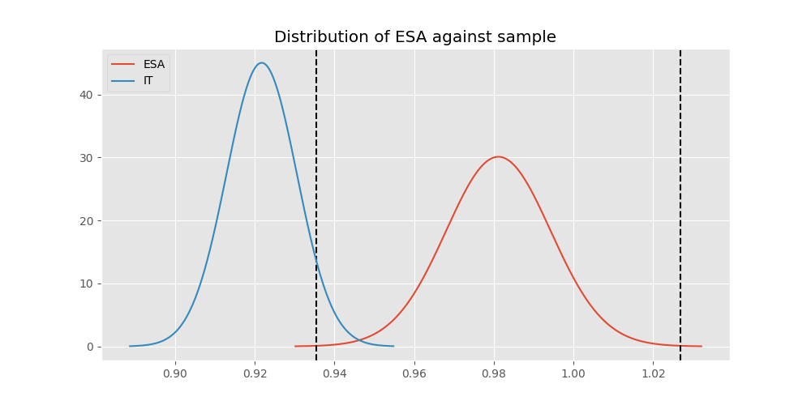 
## Testing Results for ESA against EST 
ESA has a success rate of 0.9811320754716981
EST has a success rate of 0.975
$H_{0}$: There is not a difference between ESA and EST
$H_{A}$: There is a difference between ESA and EST
An $/alpha$ of 0.0008064516129032258 was used in this test.
__independent t-testing__: With a t-statistic of 0.2313788911418916 and a p-value of 0.8173489133451068, _we failed to reject the null hypothssis_
__Man-Whitney testing__: With a u-statistic of 2133.0 and a p-value of 0.8233725542108876, _we failed to reject the null hypothssis_
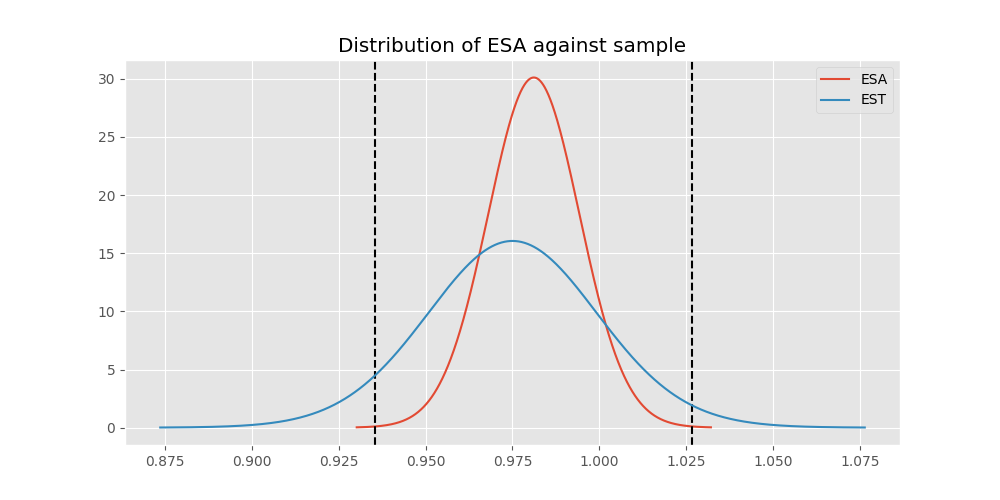 
## Testing Results for ESA against SKOR 
ESA has a success rate of 0.9811320754716981
SKOR has a success rate of 0.9166666666666666
$H_{0}$: There is not a difference between ESA and SKOR
$H_{A}$: There is a difference between ESA and SKOR
An $/alpha$ of 0.0008064516129032258 was used in this test.
__independent t-testing__: With a t-statistic of 1.9973240493318598 and a p-value of 0.04744374488773854, _we failed to reject the null hypothssis_
__Man-Whitney testing__: With a u-statistic of 3385.0 and a p-value of 0.04830839161503387, _we failed to reject the null hypothssis_
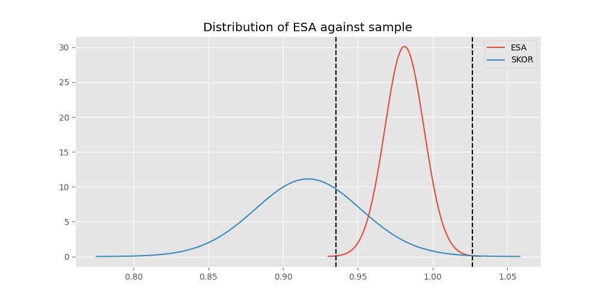 
## Testing Results for ESA against RP 
ESA has a success rate of 0.9811320754716981
RP has a success rate of 0.6735187424425635
$H_{0}$: There is not a difference between ESA and RP
$H_{A}$: There is a difference between ESA and RP
An $/alpha$ of 0.0008064516129032258 was used in this test.
__independent t-testing__: With a t-statistic of 6.710541208747643 and a p-value of 3.3641154535360056e-11, _we **reject** the null hypothssis_
__Man-Whitney testing__: With a u-statistic of 57314.0 and a p-value of 5.4832557609891105e-11, _we **reject** the null hypothssis_
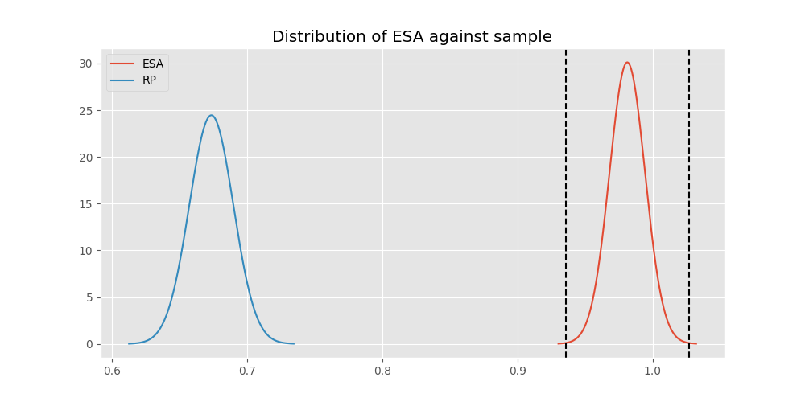 
## Testing Results for ESA against JPN 
ESA has a success rate of 0.9811320754716981
JPN has a success rate of 0.6016371077762619
$H_{0}$: There is not a difference between ESA and JPN
$H_{A}$: There is a difference between ESA and JPN
An $/alpha$ of 0.0008064516129032258 was used in this test.
__independent t-testing__: With a t-statistic of 7.927238804598102 and a p-value of 7.144484378142383e-15, _we **reject** the null hypothssis_
__Man-Whitney testing__: With a u-statistic of 53592.0 and a p-value of 2.013962713668911e-14, _we **reject** the null hypothssis_
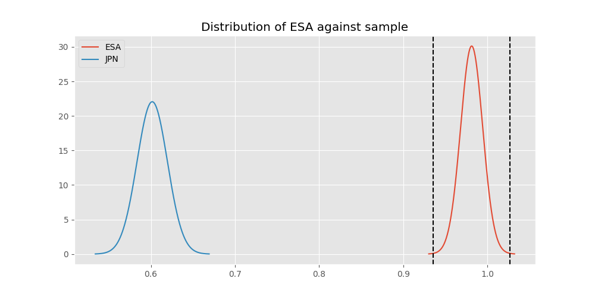 
## Testing Results for ESA against US 
ESA has a success rate of 0.9811320754716981
US has a success rate of 0.918885774351787
$H_{0}$: There is not a difference between ESA and US
$H_{A}$: There is a difference between ESA and US
An $/alpha$ of 0.0008064516129032258 was used in this test.
__independent t-testing__: With a t-statistic of 2.3416029367879427 and a p-value of 0.019234729674032443, _we failed to reject the null hypothssis_
__Man-Whitney testing__: With a u-statistic of 321355.0 and a p-value of 0.019250803829315297, _we failed to reject the null hypothssis_
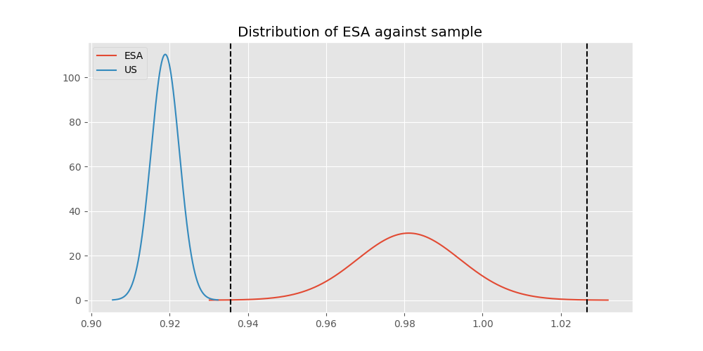 
## Testing Results for ESA against KAZ 
ESA has a success rate of 0.9811320754716981
KAZ has a success rate of 0.989010989010989
$H_{0}$: There is not a difference between ESA and KAZ
$H_{A}$: There is a difference between ESA and KAZ
An $/alpha$ of 0.0008064516129032258 was used in this test.
__independent t-testing__: With a t-statistic of -0.5493863364797461 and a p-value of 0.5831690525508639, _we failed to reject the null hypothssis_
__Man-Whitney testing__: With a u-statistic of 9570.0 and a p-value of 0.5847655780623819, _we failed to reject the null hypothssis_
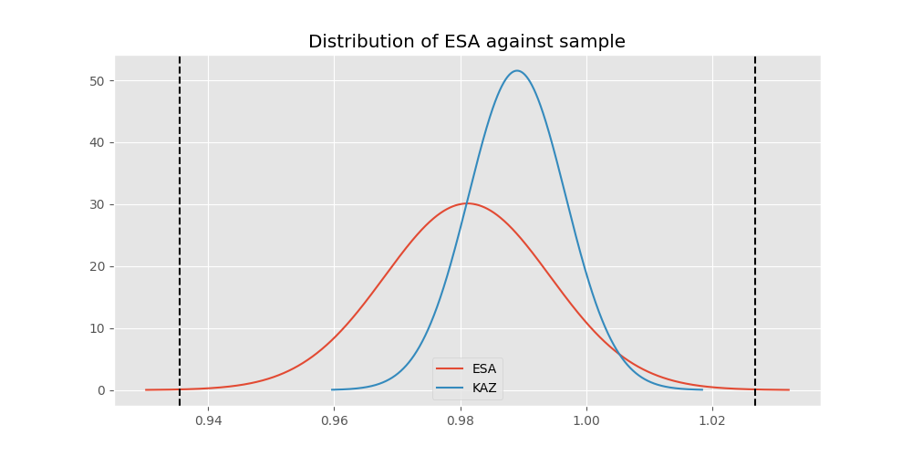 
## Testing Results for ESA against ROC 
ESA has a success rate of 0.9811320754716981
ROC has a success rate of 0.17751479289940827
$H_{0}$: There is not a difference between ESA and ROC
$H_{A}$: There is a difference between ESA and ROC
An $/alpha$ of 0.0008064516129032258 was used in this test.
__independent t-testing__: With a t-statistic of 20.76439771860241 and a p-value of 4.149799511849959e-58, _we **reject** the null hypothssis_
__Man-Whitney testing__: With a u-statistic of 16155.0 and a p-value of 2.2963531612210824e-38, _we **reject** the null hypothssis_
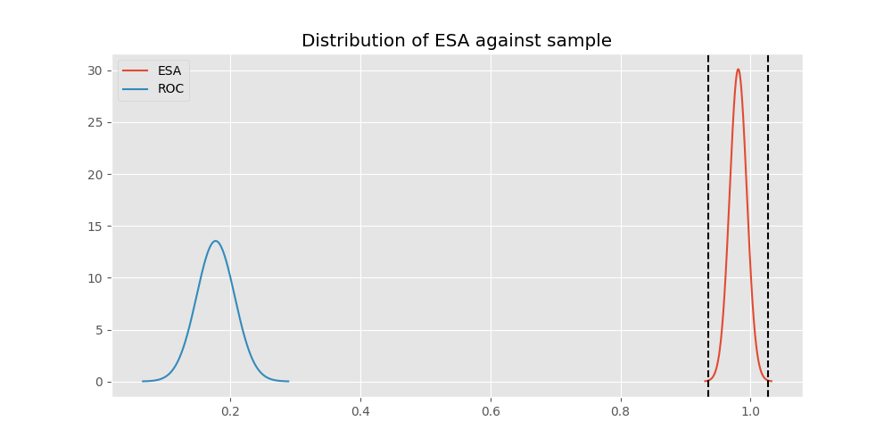 
## Testing Results for ESA against THAI 
ESA has a success rate of 0.9811320754716981
THAI has a success rate of 0.9880952380952381
$H_{0}$: There is not a difference between ESA and THAI
$H_{A}$: There is a difference between ESA and THAI
An $/alpha$ of 0.0008064516129032258 was used in this test.
__independent t-testing__: With a t-statistic of -0.46650935697335155 and a p-value of 0.6412243638424735, _we failed to reject the null hypothssis_
__Man-Whitney testing__: With a u-statistic of 8842.0 and a p-value of 0.6430693020291731, _we failed to reject the null hypothssis_
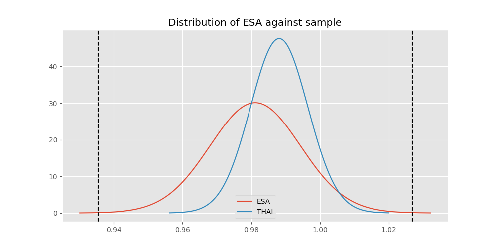 
## Testing Results for ESA against FR 
ESA has a success rate of 0.9811320754716981
FR has a success rate of 0.908183632734531
$H_{0}$: There is not a difference between ESA and FR
$H_{A}$: There is a difference between ESA and FR
An $/alpha$ of 0.0008064516129032258 was used in this test.
__independent t-testing__: With a t-statistic of 2.5376876802899497 and a p-value of 0.01140857448904033, _we failed to reject the null hypothssis_
__Man-Whitney testing__: With a u-statistic of 28490.0 and a p-value of 0.011546091407671518, _we failed to reject the null hypothssis_
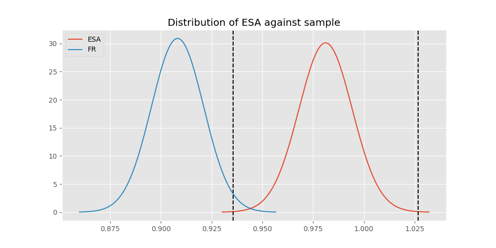 
## Testing Results for ESA against TURK 
ESA has a success rate of 0.9811320754716981
TURK has a success rate of 0.9962264150943396
$H_{0}$: There is not a difference between ESA and TURK
$H_{A}$: There is a difference between ESA and TURK
An $/alpha$ of 0.0008064516129032258 was used in this test.
__independent t-testing__: With a t-statistic of -1.0934941871663277 and a p-value of 0.27632550512763093, _we failed to reject the null hypothssis_
__Man-Whitney testing__: With a u-statistic of 13833.0 and a p-value of 0.14398718569967328, _we failed to reject the null hypothssis_
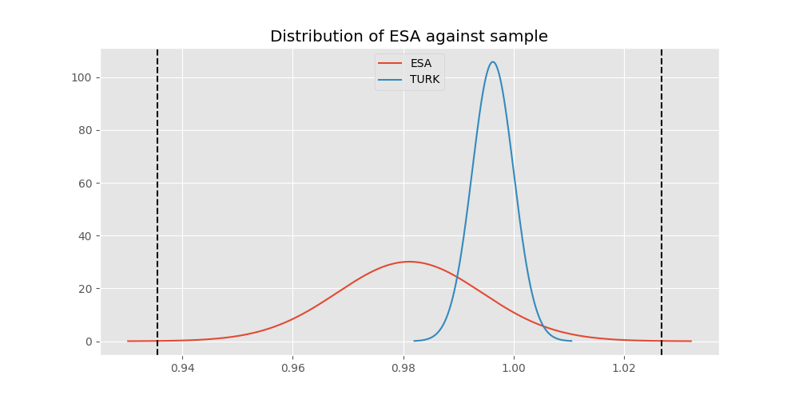 
## Testing Results for ESA against PRC 
ESA has a success rate of 0.9811320754716981
PRC has a success rate of 0.988759187202767
$H_{0}$: There is not a difference between ESA and PRC
$H_{A}$: There is a difference between ESA and PRC
An $/alpha$ of 0.0008064516129032258 was used in this test.
__independent t-testing__: With a t-statistic of -0.7176565372826468 and a p-value of 0.4730384417488508, _we failed to reject the null hypothssis_
__Man-Whitney testing__: With a u-statistic of 121654.0 and a p-value of 0.47316142930529903, _we failed to reject the null hypothssis_
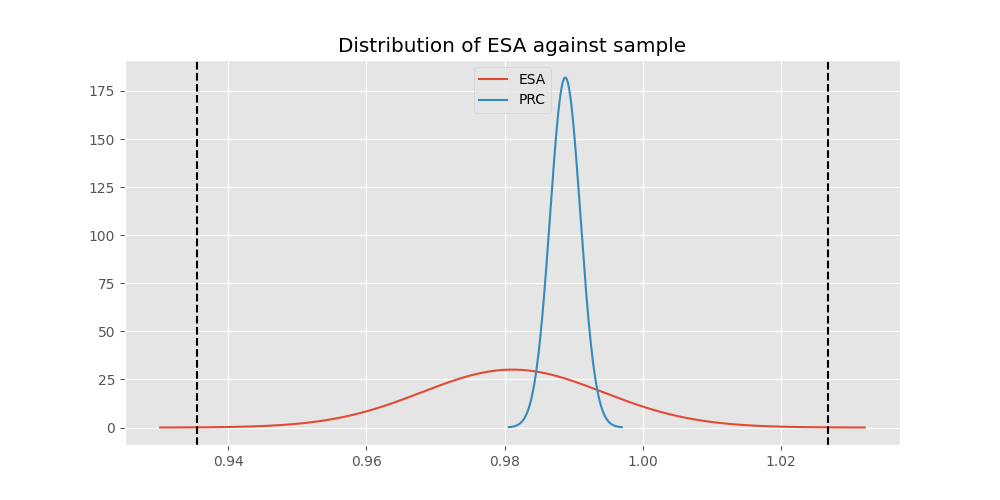 
## Testing Results for ESA against BEL 
ESA has a success rate of 0.9811320754716981
BEL has a success rate of 0.8883495145631068
$H_{0}$: There is not a difference between ESA and BEL
$H_{A}$: There is a difference between ESA and BEL
An $/alpha$ of 0.0008064516129032258 was used in this test.
__independent t-testing__: With a t-statistic of 2.8879367228769732 and a p-value of 0.004150602377895552, _we failed to reject the null hypothssis_
__Man-Whitney testing__: With a u-statistic of 11931.0 and a p-value of 0.004330329047089985, _we failed to reject the null hypothssis_
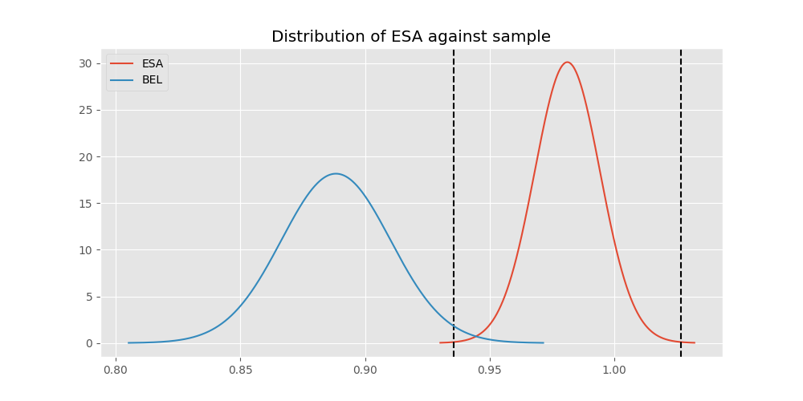 
## Testing Results for ESA against POL 
ESA has a success rate of 0.9811320754716981
POL has a success rate of 0.979381443298969
$H_{0}$: There is not a difference between ESA and POL
$H_{A}$: There is a difference between ESA and POL
An $/alpha$ of 0.0008064516129032258 was used in this test.
__independent t-testing__: With a t-statistic of 0.11557166611136227 and a p-value of 0.9080314094702533, _we failed to reject the null hypothssis_
__Man-Whitney testing__: With a u-statistic of 25750.0 and a p-value of 0.9089340178089282, _we failed to reject the null hypothssis_
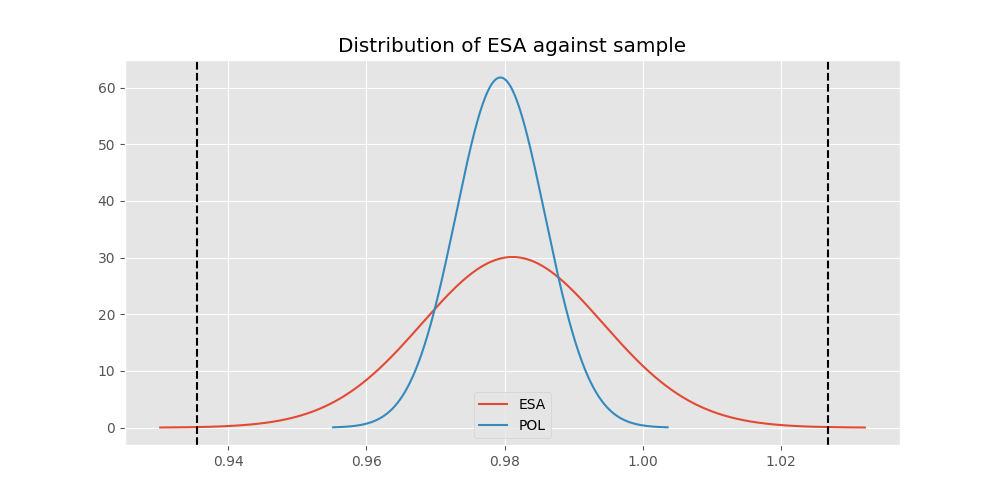 
## Testing Results for ESA against LTU 
ESA has a success rate of 0.9811320754716981
LTU has a success rate of 0.984375
$H_{0}$: There is not a difference between ESA and LTU
$H_{A}$: There is a difference between ESA and LTU
An $/alpha$ of 0.0008064516129032258 was used in this test.
__independent t-testing__: With a t-statistic of -0.227100490373261 and a p-value of 0.8204550587936861, _we failed to reject the null hypothssis_
__Man-Whitney testing__: With a u-statistic of 16905.0 and a p-value of 0.8217556580108824, _we failed to reject the null hypothssis_
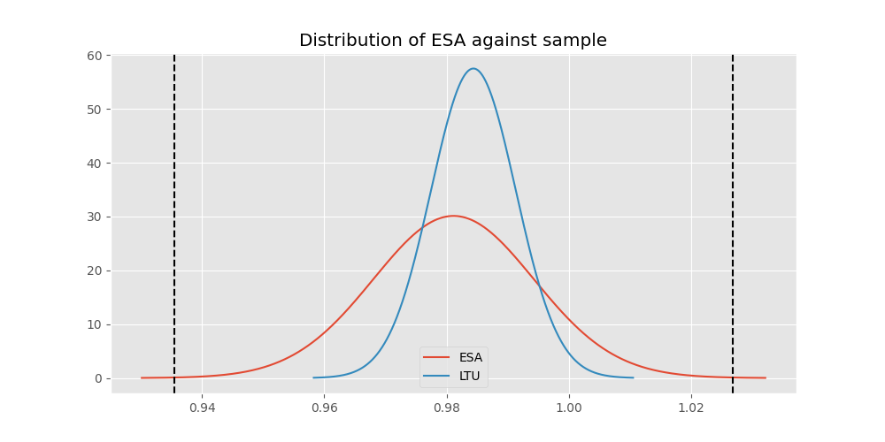 
## Testing Results for ESA against SVN 
ESA has a success rate of 0.9811320754716981
SVN has a success rate of 0.9770114942528736
$H_{0}$: There is not a difference between ESA and SVN
$H_{A}$: There is a difference between ESA and SVN
An $/alpha$ of 0.0008064516129032258 was used in this test.
__independent t-testing__: With a t-statistic of 0.19891695549683516 and a p-value of 0.8425392910415106, _we failed to reject the null hypothssis_
__Man-Whitney testing__: With a u-statistic of 4630.0 and a p-value of 0.846043909661329, _we failed to reject the null hypothssis_
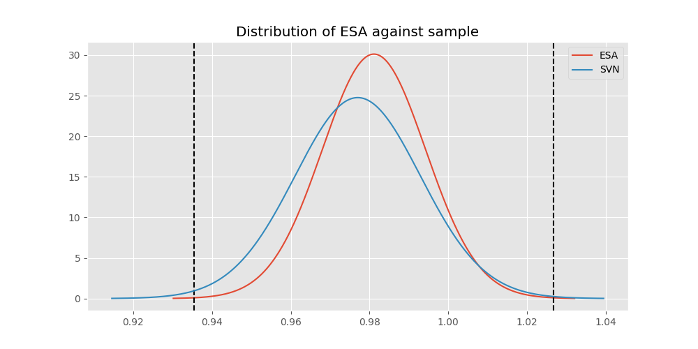 
## Testing Results for ESA against AUS 
ESA has a success rate of 0.9811320754716981
AUS has a success rate of 0.7289377289377289
$H_{0}$: There is not a difference between ESA and AUS
$H_{A}$: There is a difference between ESA and AUS
An $/alpha$ of 0.0008064516129032258 was used in this test.
__independent t-testing__: With a t-statistic of 5.722694566000287 and a p-value of 2.140399819850871e-08, _we **reject** the null hypothssis_
__Man-Whitney testing__: With a u-statistic of 18118.0 and a p-value of 3.890279278494655e-08, _we **reject** the null hypothssis_
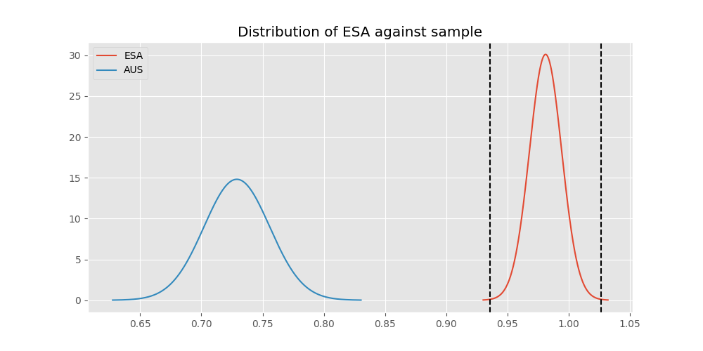 
## Testing Results for ESA against UKR 
ESA has a success rate of 0.9811320754716981
UKR has a success rate of 0.981549815498155
$H_{0}$: There is not a difference between ESA and UKR
$H_{A}$: There is a difference between ESA and UKR
An $/alpha$ of 0.0008064516129032258 was used in this test.
__independent t-testing__: With a t-statistic of -0.026940759817556427 and a p-value of 0.978521314483346, _we failed to reject the null hypothssis_
__Man-Whitney testing__: With a u-statistic of 14357.0 and a p-value of 0.9802714599065718, _we failed to reject the null hypothssis_
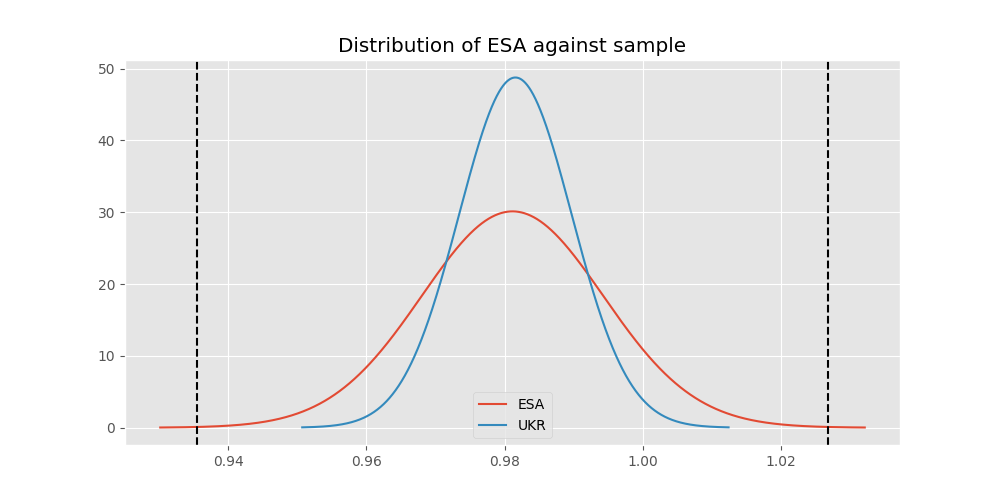 
## Testing Results for ESA against CIS 
ESA has a success rate of 0.9811320754716981
CIS has a success rate of 0.837386018237082
$H_{0}$: There is not a difference between ESA and CIS
$H_{A}$: There is a difference between ESA and CIS
An $/alpha$ of 0.0008064516129032258 was used in this test.
__independent t-testing__: With a t-statistic of 3.9621749205872883 and a p-value of 8.124372955775188e-05, _we **reject** the null hypothssis_
__Man-Whitney testing__: With a u-statistic of 39887.0 and a p-value of 8.703234036305385e-05, _we **reject** the null hypothssis_
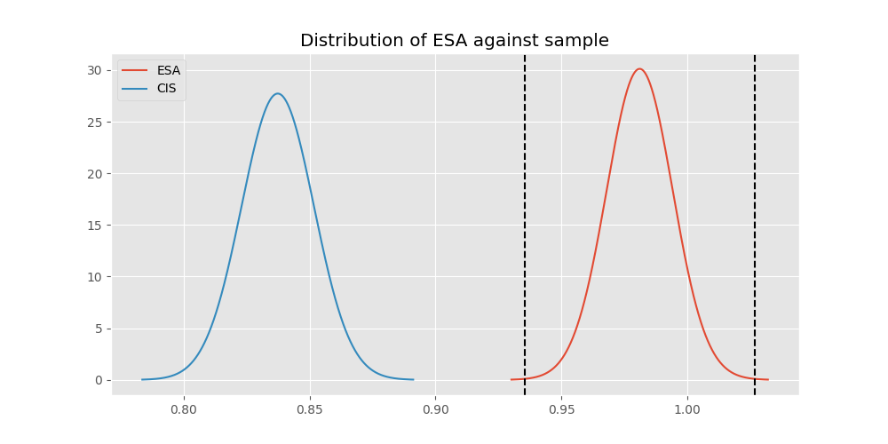 
## Testing Results for ESA against SAFR 
ESA has a success rate of 0.9811320754716981
SAFR has a success rate of 0.9328358208955224
$H_{0}$: There is not a difference between ESA and SAFR
$H_{A}$: There is a difference between ESA and SAFR
An $/alpha$ of 0.0008064516129032258 was used in this test.
__independent t-testing__: With a t-statistic of 1.7810174036925797 and a p-value of 0.07618497025453387, _we failed to reject the null hypothssis_
__Man-Whitney testing__: With a u-statistic of 7445.0 and a p-value of 0.07666140823396178, _we failed to reject the null hypothssis_
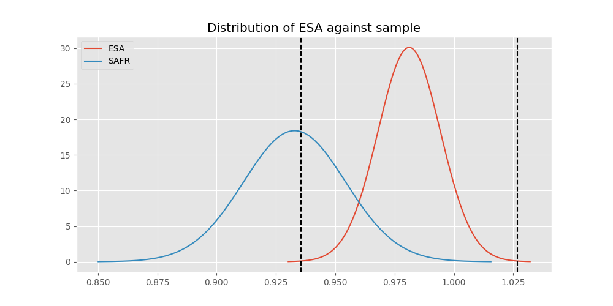 
## Testing Results for ESA against TBD 
ESA has a success rate of 0.9811320754716981
TBD has a success rate of 0.9898734177215189
$H_{0}$: There is not a difference between ESA and TBD
$H_{A}$: There is a difference between ESA and TBD
An $/alpha$ of 0.0008064516129032258 was used in this test.
__independent t-testing__: With a t-statistic of -0.7335600875060064 and a p-value of 0.4635613884087101, _we failed to reject the null hypothssis_
__Man-Whitney testing__: With a u-statistic of 20752.0 and a p-value of 0.46423329470972363, _we failed to reject the null hypothssis_
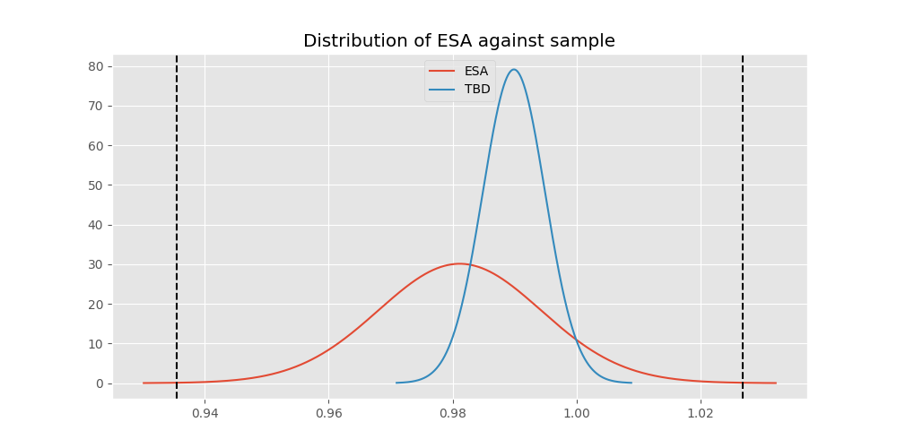 
## Testing Results for ESA against UK 
ESA has a success rate of 0.9811320754716981
UK has a success rate of 0.9881796690307328
$H_{0}$: There is not a difference between ESA and UK
$H_{A}$: There is a difference between ESA and UK
An $/alpha$ of 0.0008064516129032258 was used in this test.
__independent t-testing__: With a t-statistic of -0.6125929264820924 and a p-value of 0.5402921414277835, _we failed to reject the null hypothssis_
__Man-Whitney testing__: With a u-statistic of 44522.0 and a p-value of 0.5406537944804224, _we failed to reject the null hypothssis_
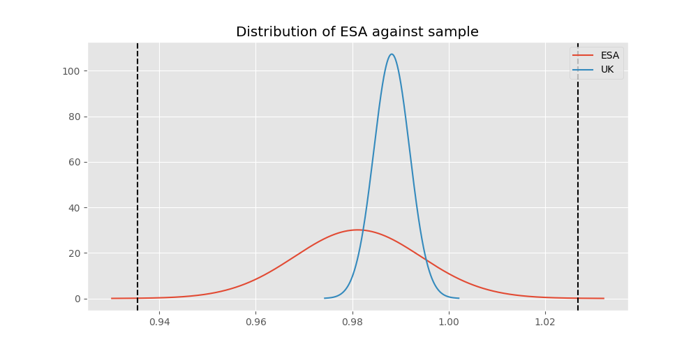 
## Testing Results for ESA against GER 
ESA has a success rate of 0.9811320754716981
GER has a success rate of 0.9766233766233766
$H_{0}$: There is not a difference between ESA and GER
$H_{A}$: There is a difference between ESA and GER
An $/alpha$ of 0.0008064516129032258 was used in this test.
__independent t-testing__: With a t-statistic of 0.30153445720083405 and a p-value of 0.7630329509193734, _we failed to reject the null hypothssis_
__Man-Whitney testing__: With a u-statistic of 122982.0 and a p-value of 0.763171981298102, _we failed to reject the null hypothssis_
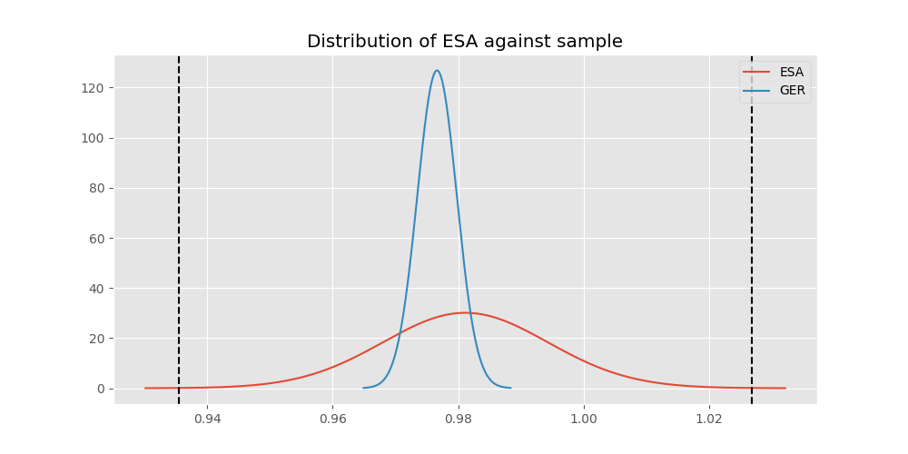 
