# Testing Results For EST 
$H_{0}$: There is not a difference in collection success against EST 
$H_{A}$: There is a difference in collection success against EST
An $\alpha$ of 0.0008064516129032258 was used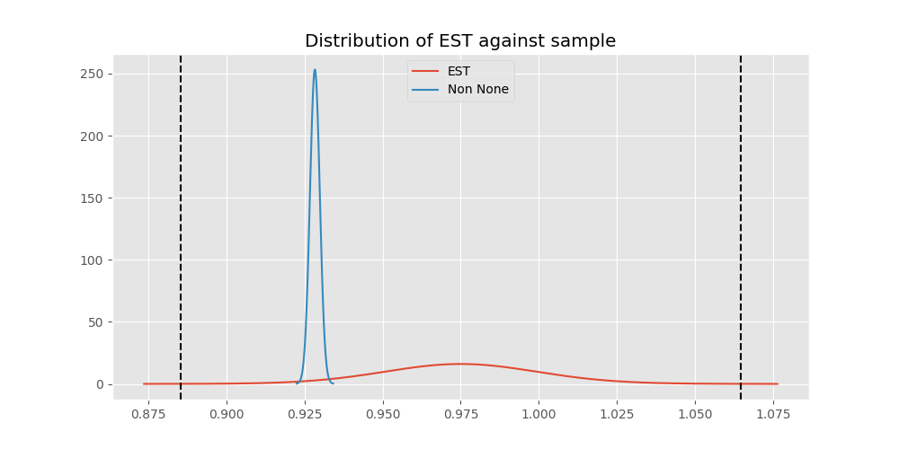 
Out of 25 tests, there were 4 rejections from 25 independent-t test.
Out of 25 tests, there were 4 rejections from 25 Man Whitney u-tests.
## Testing Results for EST against IND 
EST has a success rate of 0.975
IND has a success rate of 0.9704433497536946
$H_{0}$: There is not a difference between EST and IND
$H_{A}$: There is a difference between EST and IND
An $/alpha$ of 0.0008064516129032258 was used in this test.
__independent t-testing__: With a t-statistic of 0.16309009139156075 and a p-value of 0.8705217047985694, _we failed to reject the null hypothssis_
__Man-Whitney testing__: With a u-statistic of 8157.0 and a p-value of 0.8720442357268718, _we failed to reject the null hypothssis_
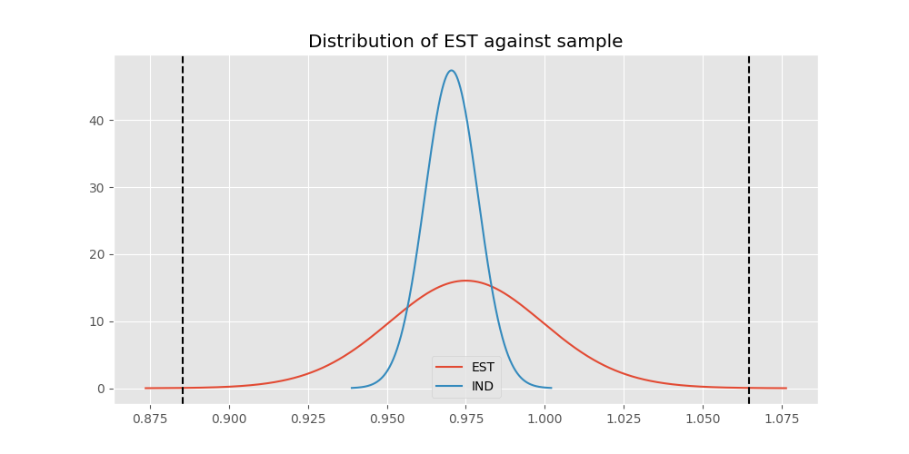 
## Testing Results for EST against GUAT 
EST has a success rate of 0.975
GUAT has a success rate of 0.9705882352941176
$H_{0}$: There is not a difference between EST and GUAT
$H_{A}$: There is a difference between EST and GUAT
An $/alpha$ of 0.0008064516129032258 was used in this test.
__independent t-testing__: With a t-statistic of 0.13348453353311476 and a p-value of 0.8940632890175448, _we failed to reject the null hypothssis_
__Man-Whitney testing__: With a u-statistic of 1366.0 and a p-value of 0.9021654512782957, _we failed to reject the null hypothssis_
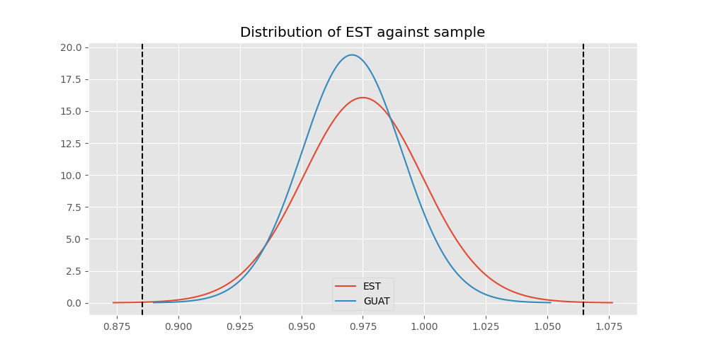 
## Testing Results for EST against IT 
EST has a success rate of 0.975
IT has a success rate of 0.9217391304347826
$H_{0}$: There is not a difference between EST and IT
$H_{A}$: There is a difference between EST and IT
An $/alpha$ of 0.0008064516129032258 was used in this test.
__independent t-testing__: With a t-statistic of 1.2437756294914366 and a p-value of 0.2138864075265589, _we failed to reject the null hypothssis_
__Man-Whitney testing__: With a u-statistic of 19380.0 and a p-value of 0.2139464518255837, _we failed to reject the null hypothssis_
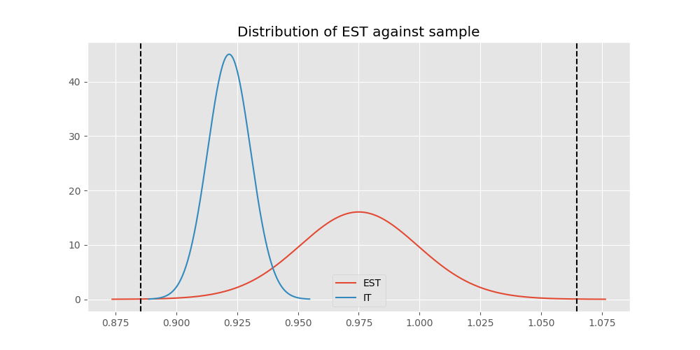 
## Testing Results for EST against SKOR 
EST has a success rate of 0.975
SKOR has a success rate of 0.9166666666666666
$H_{0}$: There is not a difference between EST and SKOR
$H_{A}$: There is a difference between EST and SKOR
An $/alpha$ of 0.0008064516129032258 was used in this test.
__independent t-testing__: With a t-statistic of 1.1999500239468373 and a p-value of 0.2330515900649629, _we failed to reject the null hypothssis_
__Man-Whitney testing__: With a u-statistic of 1270.0 and a p-value of 0.23454161992784173, _we failed to reject the null hypothssis_
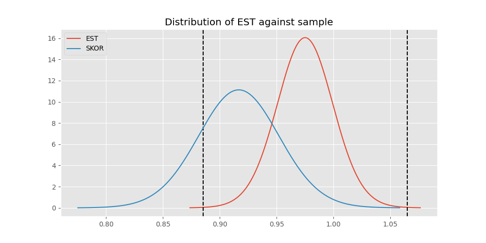 
## Testing Results for EST against RP 
EST has a success rate of 0.975
RP has a success rate of 0.6735187424425635
$H_{0}$: There is not a difference between EST and RP
$H_{A}$: There is a difference between EST and RP
An $/alpha$ of 0.0008064516129032258 was used in this test.
__independent t-testing__: With a t-statistic of 4.050640594054892 and a p-value of 5.566692983081408e-05, _we **reject** the null hypothssis_
__Man-Whitney testing__: With a u-statistic of 21526.5 and a p-value of 5.952707109104407e-05, _we **reject** the null hypothssis_
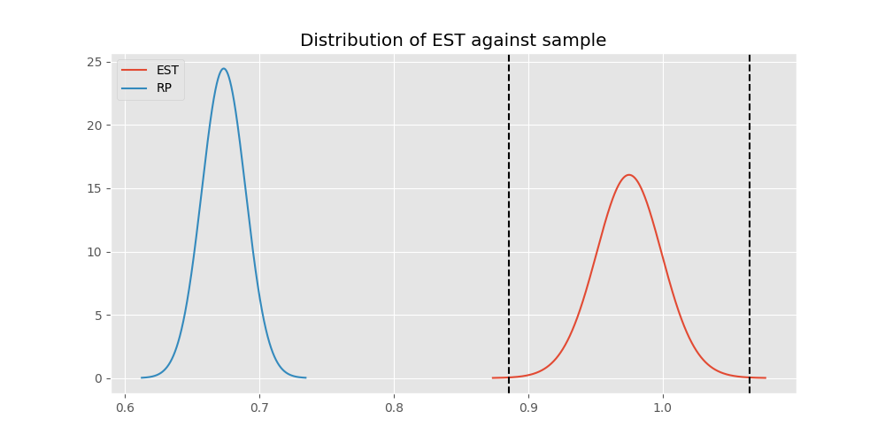 
## Testing Results for EST against JPN 
EST has a success rate of 0.975
JPN has a success rate of 0.6016371077762619
$H_{0}$: There is not a difference between EST and JPN
$H_{A}$: There is a difference between EST and JPN
An $/alpha$ of 0.0008064516129032258 was used in this test.
__independent t-testing__: With a t-statistic of 4.80385649119685 and a p-value of 1.8704570065824478e-06, _we **reject** the null hypothssis_
__Man-Whitney testing__: With a u-statistic of 20133.5 and a p-value of 2.1779023634205126e-06, _we **reject** the null hypothssis_
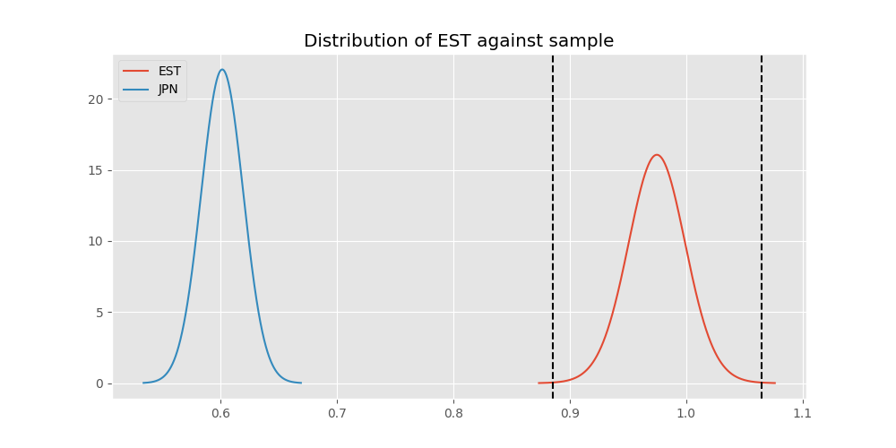 
## Testing Results for EST against US 
EST has a success rate of 0.975
US has a success rate of 0.918885774351787
$H_{0}$: There is not a difference between EST and US
$H_{A}$: There is a difference between EST and US
An $/alpha$ of 0.0008064516129032258 was used in this test.
__independent t-testing__: With a t-statistic of 1.2982282391861661 and a p-value of 0.19426102148931226, _we failed to reject the null hypothssis_
__Man-Whitney testing__: With a u-statistic of 120566.0 and a p-value of 0.19427032291701984, _we failed to reject the null hypothssis_
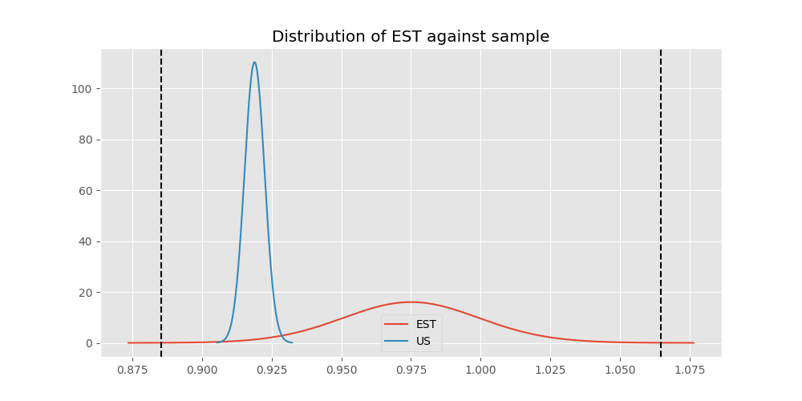 
## Testing Results for EST against KAZ 
EST has a success rate of 0.975
KAZ has a success rate of 0.989010989010989
$H_{0}$: There is not a difference between EST and KAZ
$H_{A}$: There is a difference between EST and KAZ
An $/alpha$ of 0.0008064516129032258 was used in this test.
__independent t-testing__: With a t-statistic of -0.6925258606339366 and a p-value of 0.4893374845361429, _we failed to reject the null hypothssis_
__Man-Whitney testing__: With a u-statistic of 3589.0 and a p-value of 0.4923693705131994, _we failed to reject the null hypothssis_
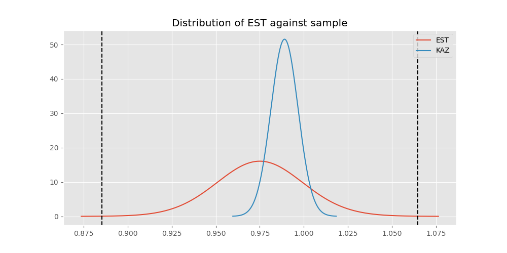 
## Testing Results for EST against ROC 
EST has a success rate of 0.975
ROC has a success rate of 0.17751479289940827
$H_{0}$: There is not a difference between EST and ROC
$H_{A}$: There is a difference between EST and ROC
An $/alpha$ of 0.0008064516129032258 was used in this test.
__independent t-testing__: With a t-statistic of 12.884515308452725 and a p-value of 2.7953882772447433e-28, _we **reject** the null hypothssis_
__Man-Whitney testing__: With a u-statistic of 6075.5 and a p-value of 6.606620248745387e-22, _we **reject** the null hypothssis_
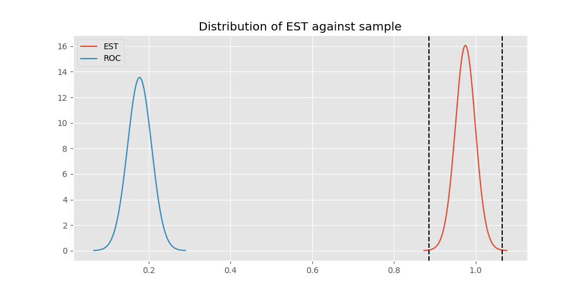 
## Testing Results for EST against THAI 
EST has a success rate of 0.975
THAI has a success rate of 0.9880952380952381
$H_{0}$: There is not a difference between EST and THAI
$H_{A}$: There is a difference between EST and THAI
An $/alpha$ of 0.0008064516129032258 was used in this test.
__independent t-testing__: With a t-statistic of -0.6218725082974537 and a p-value of 0.5347133405297371, _we failed to reject the null hypothssis_
__Man-Whitney testing__: With a u-statistic of 3316.0 and a p-value of 0.5380802987396827, _we failed to reject the null hypothssis_
 
## Testing Results for EST against FR 
EST has a success rate of 0.975
FR has a success rate of 0.908183632734531
$H_{0}$: There is not a difference between EST and FR
$H_{A}$: There is a difference between EST and FR
An $/alpha$ of 0.0008064516129032258 was used in this test.
__independent t-testing__: With a t-statistic of 1.4439496789692936 and a p-value of 0.14933411681242784, _we failed to reject the null hypothssis_
__Man-Whitney testing__: With a u-statistic of 10689.5 and a p-value of 0.14946495045778949, _we failed to reject the null hypothssis_
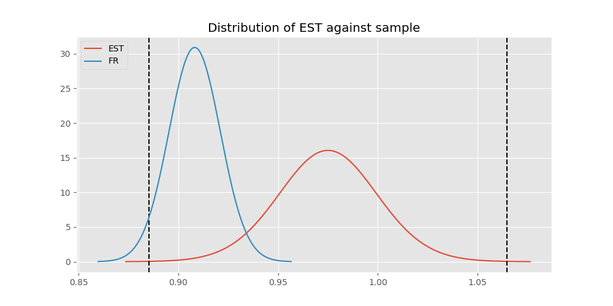 
## Testing Results for EST against TURK 
EST has a success rate of 0.975
TURK has a success rate of 0.9962264150943396
$H_{0}$: There is not a difference between EST and TURK
$H_{A}$: There is a difference between EST and TURK
An $/alpha$ of 0.0008064516129032258 was used in this test.
__independent t-testing__: With a t-statistic of -0.8395463943565382 and a p-value of 0.40605605873756156, _we failed to reject the null hypothssis_
__Man-Whitney testing__: With a u-statistic of 5187.5 and a p-value of 0.12332289441548903, _we failed to reject the null hypothssis_
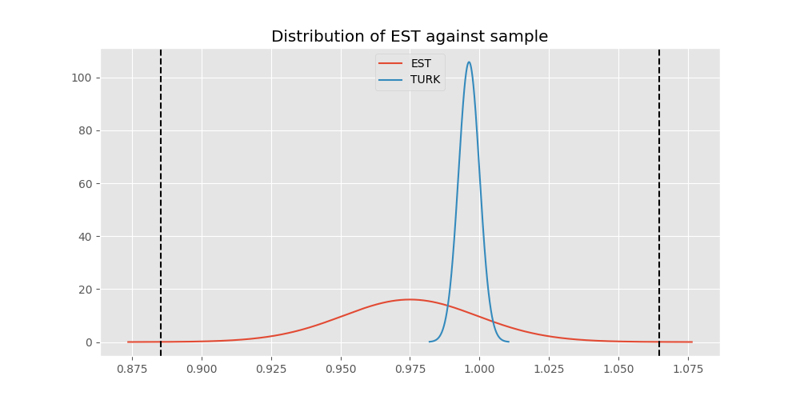 
## Testing Results for EST against PRC 
EST has a success rate of 0.975
PRC has a success rate of 0.988759187202767
$H_{0}$: There is not a difference between EST and PRC
$H_{A}$: There is a difference between EST and PRC
An $/alpha$ of 0.0008064516129032258 was used in this test.
__independent t-testing__: With a t-statistic of -0.809861473998982 and a p-value of 0.41810175692350104, _we failed to reject the null hypothssis_
__Man-Whitney testing__: With a u-statistic of 45623.5 and a p-value of 0.4183515217816217, _we failed to reject the null hypothssis_
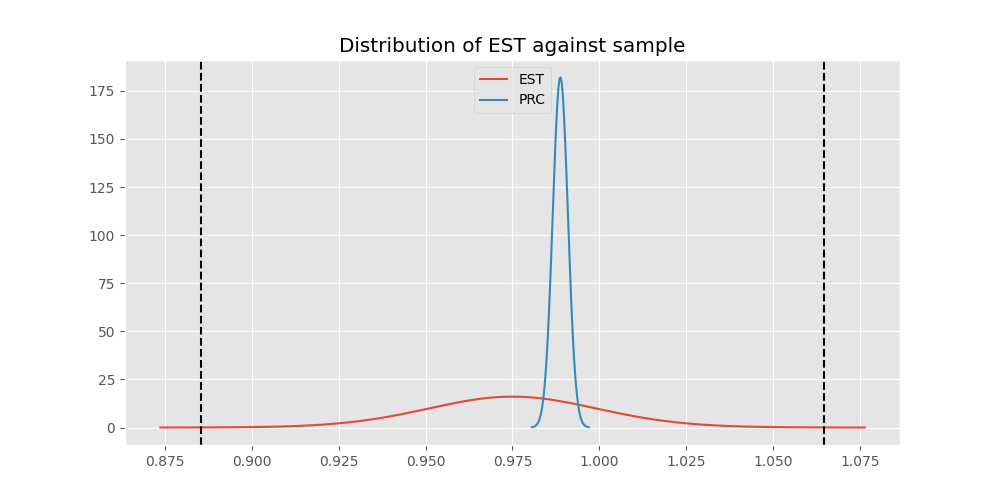 
## Testing Results for EST against BEL 
EST has a success rate of 0.975
BEL has a success rate of 0.8883495145631068
$H_{0}$: There is not a difference between EST and BEL
$H_{A}$: There is a difference between EST and BEL
An $/alpha$ of 0.0008064516129032258 was used in this test.
__independent t-testing__: With a t-statistic of 1.6931041221659573 and a p-value of 0.09171192585141437, _we failed to reject the null hypothssis_
__Man-Whitney testing__: With a u-statistic of 4477.0 and a p-value of 0.09211815484820027, _we failed to reject the null hypothssis_
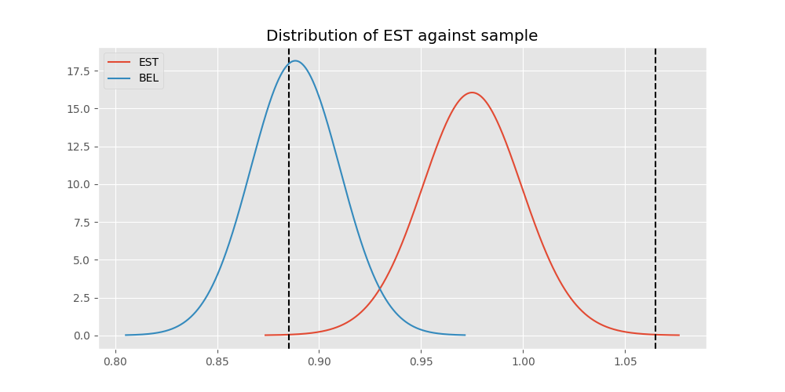 
## Testing Results for EST against POL 
EST has a success rate of 0.975
POL has a success rate of 0.979381443298969
$H_{0}$: There is not a difference between EST and POL
$H_{A}$: There is a difference between EST and POL
An $/alpha$ of 0.0008064516129032258 was used in this test.
__independent t-testing__: With a t-statistic of -0.18561168222243243 and a p-value of 0.8528212541688028, _we failed to reject the null hypothssis_
__Man-Whitney testing__: With a u-statistic of 9657.5 and a p-value of 0.8543294237330855, _we failed to reject the null hypothssis_
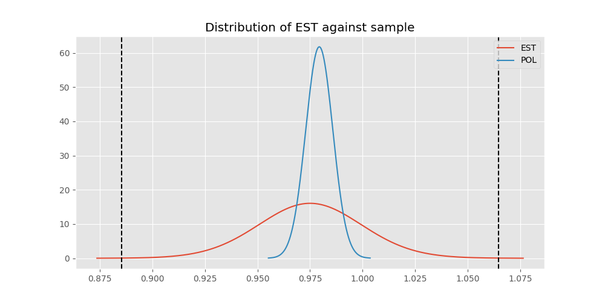 
## Testing Results for EST against LTU 
EST has a success rate of 0.975
LTU has a success rate of 0.984375
$H_{0}$: There is not a difference between EST and LTU
$H_{A}$: There is a difference between EST and LTU
An $/alpha$ of 0.0008064516129032258 was used in this test.
__independent t-testing__: With a t-statistic of -0.43556759624150465 and a p-value of 0.6634129808439229, _we failed to reject the null hypothssis_
__Man-Whitney testing__: With a u-statistic of 6340.0 and a p-value of 0.6654317188691032, _we failed to reject the null hypothssis_
 
## Testing Results for EST against SVN 
EST has a success rate of 0.975
SVN has a success rate of 0.9770114942528736
$H_{0}$: There is not a difference between EST and SVN
$H_{A}$: There is a difference between EST and SVN
An $/alpha$ of 0.0008064516129032258 was used in this test.
__independent t-testing__: With a t-statistic of -0.06878601877957705 and a p-value of 0.9452698610196946, _we failed to reject the null hypothssis_
__Man-Whitney testing__: With a u-statistic of 1736.5 and a p-value of 0.9527978336059696, _we failed to reject the null hypothssis_
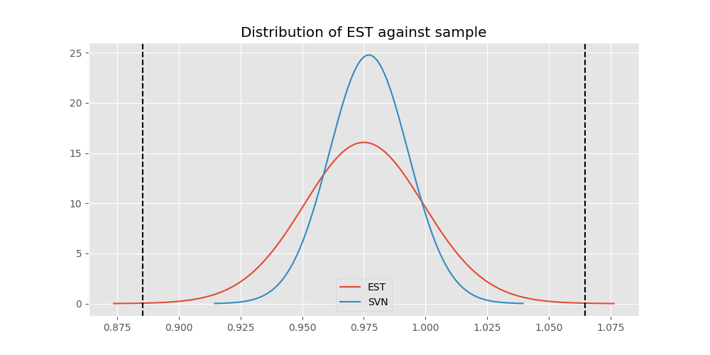 
## Testing Results for EST against AUS 
EST has a success rate of 0.975
AUS has a success rate of 0.7289377289377289
$H_{0}$: There is not a difference between EST and AUS
$H_{A}$: There is a difference between EST and AUS
An $/alpha$ of 0.0008064516129032258 was used in this test.
__independent t-testing__: With a t-statistic of 3.45870383155704 and a p-value of 0.0006184863912158881, _we **reject** the null hypothssis_
__Man-Whitney testing__: With a u-statistic of 6803.5 and a p-value of 0.0006782316733652426, _we **reject** the null hypothssis_
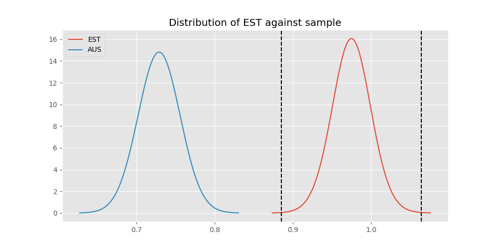 
## Testing Results for EST against UKR 
EST has a success rate of 0.975
UKR has a success rate of 0.981549815498155
$H_{0}$: There is not a difference between EST and UKR
$H_{A}$: There is a difference between EST and UKR
An $/alpha$ of 0.0008064516129032258 was used in this test.
__independent t-testing__: With a t-statistic of -0.28025449735208 and a p-value of 0.7794697875123416, _we failed to reject the null hypothssis_
__Man-Whitney testing__: With a u-statistic of 5384.5 and a p-value of 0.7819960177914747, _we failed to reject the null hypothssis_
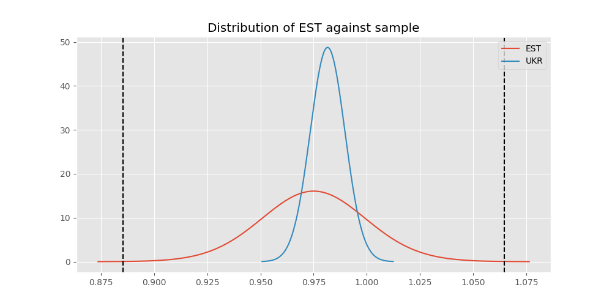 
## Testing Results for EST against CIS 
EST has a success rate of 0.975
CIS has a success rate of 0.837386018237082
$H_{0}$: There is not a difference between EST and CIS
$H_{A}$: There is a difference between EST and CIS
An $/alpha$ of 0.0008064516129032258 was used in this test.
__independent t-testing__: With a t-statistic of 2.342488739846852 and a p-value of 0.01943646703684612, _we failed to reject the null hypothssis_
__Man-Whitney testing__: With a u-statistic of 14971.0 and a p-value of 0.019577932596382665, _we failed to reject the null hypothssis_
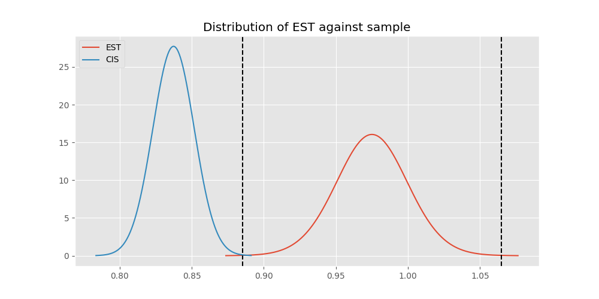 
## Testing Results for EST against SAFR 
EST has a success rate of 0.975
SAFR has a success rate of 0.9328358208955224
$H_{0}$: There is not a difference between EST and SAFR
$H_{A}$: There is a difference between EST and SAFR
An $/alpha$ of 0.0008064516129032258 was used in this test.
__independent t-testing__: With a t-statistic of 1.002613948549382 and a p-value of 0.3174555865306647, _we failed to reject the null hypothssis_
__Man-Whitney testing__: With a u-statistic of 2793.0 and a p-value of 0.3182005661603432, _we failed to reject the null hypothssis_
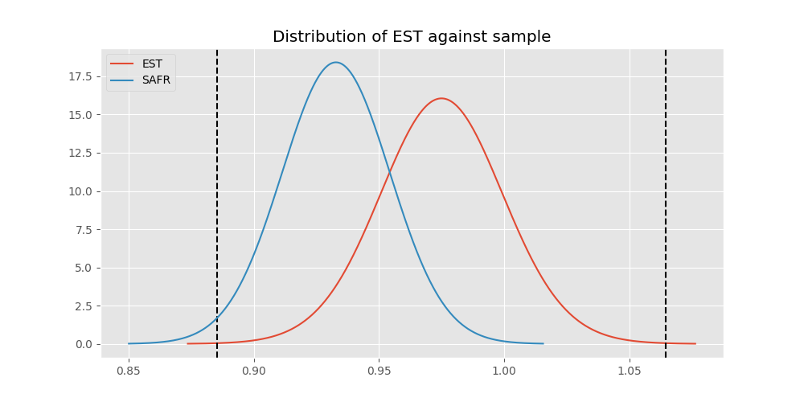 
## Testing Results for EST against TBD 
EST has a success rate of 0.975
TBD has a success rate of 0.9898734177215189
$H_{0}$: There is not a difference between EST and TBD
$H_{A}$: There is a difference between EST and TBD
An $/alpha$ of 0.0008064516129032258 was used in this test.
__independent t-testing__: With a t-statistic of -0.8396868276321698 and a p-value of 0.4015473717861068, _we failed to reject the null hypothssis_
__Man-Whitney testing__: With a u-statistic of 7782.5 and a p-value of 0.4029310773636271, _we failed to reject the null hypothssis_
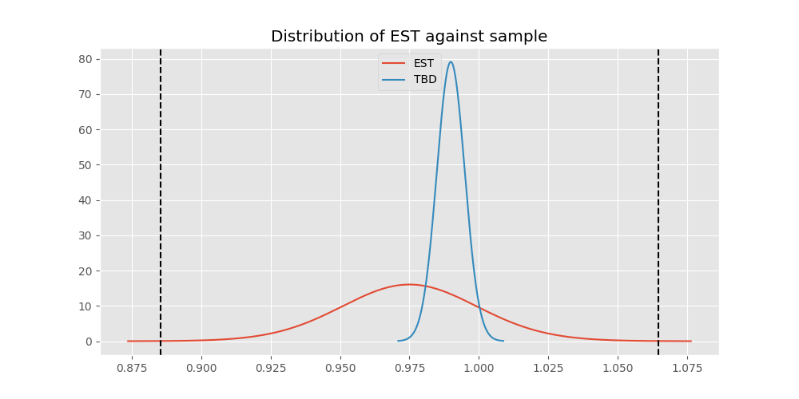 
## Testing Results for EST against ESA 
EST has a success rate of 0.975
ESA has a success rate of 0.9811320754716981
$H_{0}$: There is not a difference between EST and ESA
$H_{A}$: There is a difference between EST and ESA
An $/alpha$ of 0.0008064516129032258 was used in this test.
__independent t-testing__: With a t-statistic of -0.2313788911418916 and a p-value of 0.8173489133451068, _we failed to reject the null hypothssis_
__Man-Whitney testing__: With a u-statistic of 2107.0 and a p-value of 0.8233725542108876, _we failed to reject the null hypothssis_
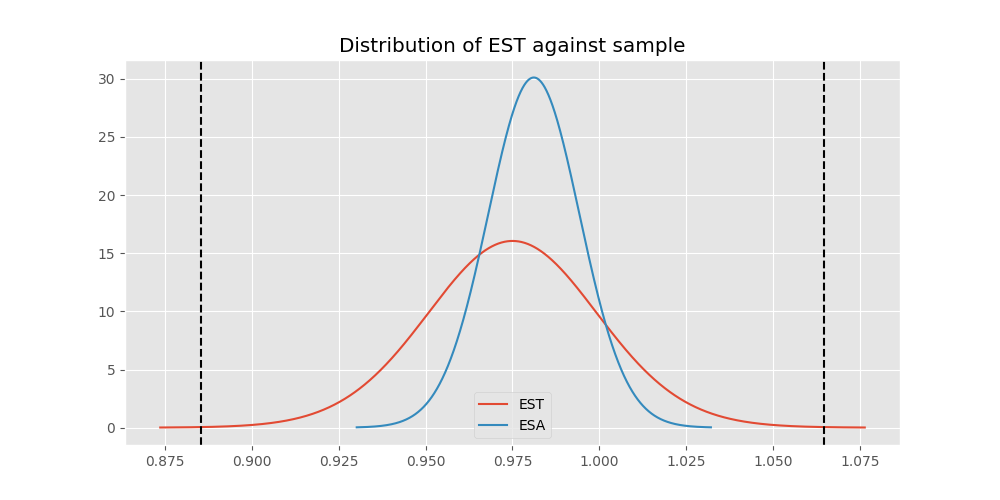 
## Testing Results for EST against UK 
EST has a success rate of 0.975
UK has a success rate of 0.9881796690307328
$H_{0}$: There is not a difference between EST and UK
$H_{A}$: There is a difference between EST and UK
An $/alpha$ of 0.0008064516129032258 was used in this test.
__independent t-testing__: With a t-statistic of -0.7349843648625919 and a p-value of 0.46254394846209135, _we failed to reject the null hypothssis_
__Man-Whitney testing__: With a u-statistic of 16697.0 and a p-value of 0.4632370705871547, _we failed to reject the null hypothssis_
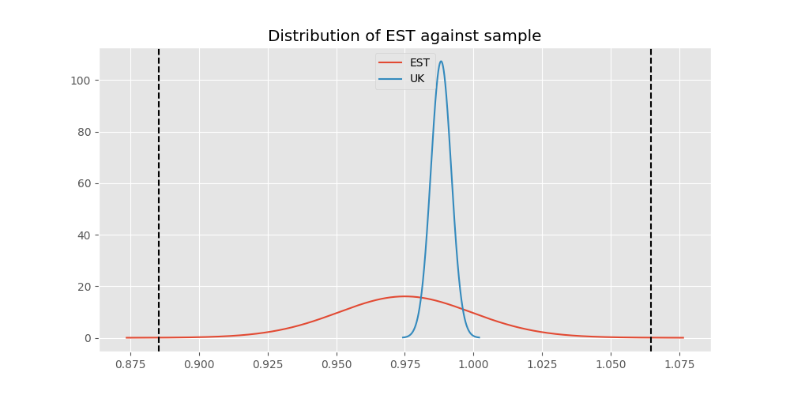 
## Testing Results for EST against GER 
EST has a success rate of 0.975
GER has a success rate of 0.9766233766233766
$H_{0}$: There is not a difference between EST and GER
$H_{A}$: There is a difference between EST and GER
An $/alpha$ of 0.0008064516129032258 was used in this test.
__independent t-testing__: With a t-statistic of -0.06730263207353025 and a p-value of 0.9463465117530654, _we failed to reject the null hypothssis_
__Man-Whitney testing__: With a u-statistic of 46125.0 and a p-value of 0.9466866941974, _we failed to reject the null hypothssis_
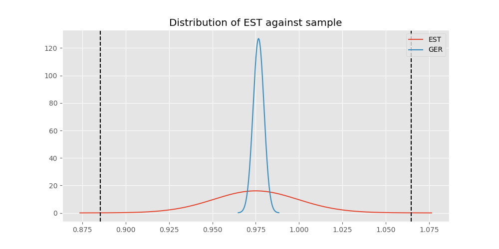 
