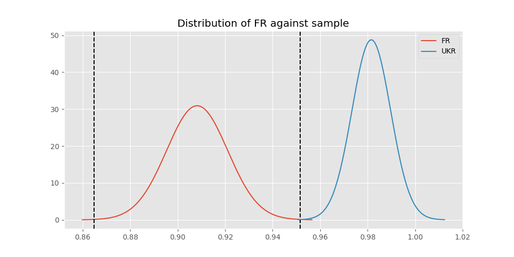
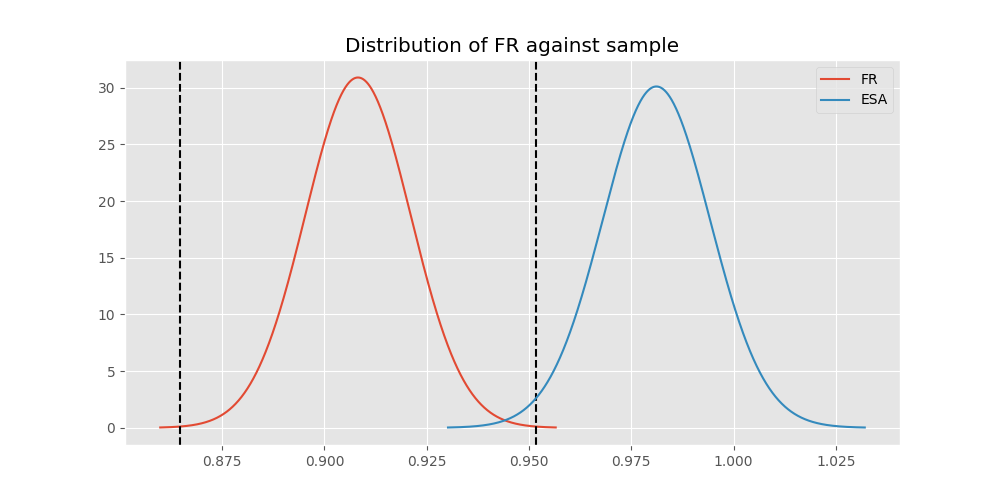

# Testing Results For FR 
$H_{0}$: There is not a difference in collection success against FR 
$H_{A}$: There is a difference in collection success against FR
An $\alpha$ of 0.0008064516129032258 was used 
Out of 25 tests, there were 17 rejections from 25 independent-t test.
Out of 25 tests, there were 16 rejections from 25 Man Whitney u-tests.
## Testing Results for FR against IND 
FR has a success rate of 0.908183632734531
IND has a success rate of 0.9704433497536946
$H_{0}$: There is not a difference between FR and IND
$H_{A}$: There is a difference between FR and IND
An $/alpha$ of 0.0008064516129032258 was used in this test.
__independent t-testing__: With a t-statistic of -3.837519033837509 and a p-value of 0.00013291733443387773, _we **reject** the null hypothssis_
__Man-Whitney testing__: With a u-statistic of 95371.0 and a p-value of 0.00013982709974137412, _we **reject** the null hypothssis_
 
## Testing Results for FR against GUAT 
FR has a success rate of 0.908183632734531
GUAT has a success rate of 0.9705882352941176
$H_{0}$: There is not a difference between FR and GUAT
$H_{A}$: There is a difference between FR and GUAT
An $/alpha$ of 0.0008064516129032258 was used in this test.
__independent t-testing__: With a t-statistic of -1.7389899173902927 and a p-value of 0.08257928056410906, _we failed to reject the null hypothssis_
__Man-Whitney testing__: With a u-statistic of 15971.0 and a p-value of 0.08272607103686486, _we failed to reject the null hypothssis_
 
## Testing Results for FR against IT 
FR has a success rate of 0.908183632734531
IT has a success rate of 0.9217391304347826
$H_{0}$: There is not a difference between FR and IT
$H_{A}$: There is a difference between FR and IT
An $/alpha$ of 0.0008064516129032258 was used in this test.
__independent t-testing__: With a t-statistic of -0.8843534574985947 and a p-value of 0.37665525388370624, _we failed to reject the null hypothssis_
__Man-Whitney testing__: With a u-statistic of 227336.0 and a p-value of 0.3765452055927193, _we failed to reject the null hypothssis_
 
## Testing Results for FR against EST 
FR has a success rate of 0.908183632734531
EST has a success rate of 0.975
$H_{0}$: There is not a difference between FR and EST
$H_{A}$: There is a difference between FR and EST
An $/alpha$ of 0.0008064516129032258 was used in this test.
__independent t-testing__: With a t-statistic of -1.4439496789692936 and a p-value of 0.14933411681242784, _we failed to reject the null hypothssis_
__Man-Whitney testing__: With a u-statistic of 9350.5 and a p-value of 0.14946495045778949, _we failed to reject the null hypothssis_
 
## Testing Results for FR against SKOR 
FR has a success rate of 0.908183632734531
SKOR has a success rate of 0.9166666666666666
$H_{0}$: There is not a difference between FR and SKOR
$H_{A}$: There is a difference between FR and SKOR
An $/alpha$ of 0.0008064516129032258 was used in this test.
__independent t-testing__: With a t-statistic of -0.2156251826962509 and a p-value of 0.8293585762220121, _we failed to reject the null hypothssis_
__Man-Whitney testing__: With a u-statistic of 14902.5 and a p-value of 0.8297964161818812, _we failed to reject the null hypothssis_
 
## Testing Results for FR against RP 
FR has a success rate of 0.908183632734531
RP has a success rate of 0.6735187424425635
$H_{0}$: There is not a difference between FR and RP
$H_{A}$: There is a difference between FR and RP
An $/alpha$ of 0.0008064516129032258 was used in this test.
__independent t-testing__: With a t-statistic of 10.093245073184734 and a p-value of 3.951727302899332e-23, _we **reject** the null hypothssis_
__Man-Whitney testing__: With a u-statistic of 255777.5 and a p-value of 2.243906604441353e-22, _we **reject** the null hypothssis_
 
## Testing Results for FR against JPN 
FR has a success rate of 0.908183632734531
JPN has a success rate of 0.6016371077762619
$H_{0}$: There is not a difference between FR and JPN
$H_{A}$: There is a difference between FR and JPN
An $/alpha$ of 0.0008064516129032258 was used in this test.
__independent t-testing__: With a t-statistic of 12.587249459490208 and a p-value of 2.8848711921935292e-34, _we **reject** the null hypothssis_
__Man-Whitney testing__: With a u-statistic of 239903.5 and a p-value of 2.073325162893984e-32, _we **reject** the null hypothssis_
 
## Testing Results for FR against US 
FR has a success rate of 0.908183632734531
US has a success rate of 0.918885774351787
$H_{0}$: There is not a difference between FR and US
$H_{A}$: There is a difference between FR and US
An $/alpha$ of 0.0008064516129032258 was used in this test.
__independent t-testing__: With a t-statistic of -0.837144847086286 and a p-value of 0.4025433844739372, _we failed to reject the null hypothssis_
__Man-Whitney testing__: With a u-statistic of 1414551.5 and a p-value of 0.4025151901048737, _we failed to reject the null hypothssis_
 
## Testing Results for FR against KAZ 
FR has a success rate of 0.908183632734531
KAZ has a success rate of 0.989010989010989
$H_{0}$: There is not a difference between FR and KAZ
$H_{A}$: There is a difference between FR and KAZ
An $/alpha$ of 0.0008064516129032258 was used in this test.
__independent t-testing__: With a t-statistic of -5.366853868264401 and a p-value of 1.0997053813275422e-07, _we **reject** the null hypothssis_
__Man-Whitney testing__: With a u-statistic of 41906.0 and a p-value of 0.0002618472320283184, _we **reject** the null hypothssis_
 
## Testing Results for FR against ROC 
FR has a success rate of 0.908183632734531
ROC has a success rate of 0.17751479289940827
$H_{0}$: There is not a difference between FR and ROC
$H_{A}$: There is a difference between FR and ROC
An $/alpha$ of 0.0008064516129032258 was used in this test.
__independent t-testing__: With a t-statistic of 26.042511260626835 and a p-value of 9.750535118868078e-104, _we **reject** the null hypothssis_
__Man-Whitney testing__: With a u-statistic of 73267.0 and a p-value of 2.834173766967532e-75, _we **reject** the null hypothssis_
 
## Testing Results for FR against THAI 
FR has a success rate of 0.908183632734531
THAI has a success rate of 0.9880952380952381
$H_{0}$: There is not a difference between FR and THAI
$H_{A}$: There is a difference between FR and THAI
An $/alpha$ of 0.0008064516129032258 was used in this test.
__independent t-testing__: With a t-statistic of -5.188522738164724 and a p-value of 2.8249879087814754e-07, _we **reject** the null hypothssis_
__Man-Whitney testing__: With a u-statistic of 38721.0 and a p-value of 0.0005202861859558988, _we **reject** the null hypothssis_
 
## Testing Results for FR against TURK 
FR has a success rate of 0.908183632734531
TURK has a success rate of 0.9962264150943396
$H_{0}$: There is not a difference between FR and TURK
$H_{A}$: There is a difference between FR and TURK
An $/alpha$ of 0.0008064516129032258 was used in this test.
__independent t-testing__: With a t-statistic of -6.543948171990803 and a p-value of 1.3169074060851813e-10, _we **reject** the null hypothssis_
__Man-Whitney testing__: With a u-statistic of 60538.0 and a p-value of 1.390818258482376e-06, _we **reject** the null hypothssis_
 
## Testing Results for FR against PRC 
FR has a success rate of 0.908183632734531
PRC has a success rate of 0.988759187202767
$H_{0}$: There is not a difference between FR and PRC
$H_{A}$: There is a difference between FR and PRC
An $/alpha$ of 0.0008064516129032258 was used in this test.
__independent t-testing__: With a t-statistic of -6.151351717149888 and a p-value of 1.516436436575414e-09, _we **reject** the null hypothssis_
__Man-Whitney testing__: With a u-statistic of 532720.5 and a p-value of 4.031560251995013e-25, _we **reject** the null hypothssis_
 
## Testing Results for FR against BEL 
FR has a success rate of 0.908183632734531
BEL has a success rate of 0.8883495145631068
$H_{0}$: There is not a difference between FR and BEL
$H_{A}$: There is a difference between FR and BEL
An $/alpha$ of 0.0008064516129032258 was used in this test.
__independent t-testing__: With a t-statistic of 0.8067247951474997 and a p-value of 0.42009711321287935, _we failed to reject the null hypothssis_
__Man-Whitney testing__: With a u-statistic of 52626.5 and a p-value of 0.4199372146643663, _we failed to reject the null hypothssis_
 
## Testing Results for FR against POL 
FR has a success rate of 0.908183632734531
POL has a success rate of 0.979381443298969
$H_{0}$: There is not a difference between FR and POL
$H_{A}$: There is a difference between FR and POL
An $/alpha$ of 0.0008064516129032258 was used in this test.
__independent t-testing__: With a t-statistic of -4.930825561336341 and a p-value of 1.013239853726803e-06, _we **reject** the null hypothssis_
__Man-Whitney testing__: With a u-statistic of 112842.5 and a p-value of 1.3909619650054006e-06, _we **reject** the null hypothssis_
 
## Testing Results for FR against LTU 
FR has a success rate of 0.908183632734531
LTU has a success rate of 0.984375
$H_{0}$: There is not a difference between FR and LTU
$H_{A}$: There is a difference between FR and LTU
An $/alpha$ of 0.0008064516129032258 was used in this test.
__independent t-testing__: With a t-statistic of -5.196351878280281 and a p-value of 2.6358008678284027e-07, _we **reject** the null hypothssis_
__Man-Whitney testing__: With a u-statistic of 74052.5 and a p-value of 1.0433466170250747e-05, _we **reject** the null hypothssis_
 
## Testing Results for FR against SVN 
FR has a success rate of 0.908183632734531
SVN has a success rate of 0.9770114942528736
$H_{0}$: There is not a difference between FR and SVN
$H_{A}$: There is a difference between FR and SVN
An $/alpha$ of 0.0008064516129032258 was used in this test.
__independent t-testing__: With a t-statistic of -2.169256150442861 and a p-value of 0.030464553831423262, _we failed to reject the null hypothssis_
__Man-Whitney testing__: With a u-statistic of 20293.5 and a p-value of 0.030639731331953492, _we failed to reject the null hypothssis_
 
## Testing Results for FR against AUS 
FR has a success rate of 0.908183632734531
AUS has a success rate of 0.7289377289377289
$H_{0}$: There is not a difference between FR and AUS
$H_{A}$: There is a difference between FR and AUS
An $/alpha$ of 0.0008064516129032258 was used in this test.
__independent t-testing__: With a t-statistic of 6.766921732864244 and a p-value of 2.601474764695e-11, _we **reject** the null hypothssis_
__Man-Whitney testing__: With a u-statistic of 80644.5 and a p-value of 4.7448839665015553e-11, _we **reject** the null hypothssis_
 
## Testing Results for FR against UKR 
FR has a success rate of 0.908183632734531
UKR has a success rate of 0.981549815498155
$H_{0}$: There is not a difference between FR and UKR
$H_{A}$: There is a difference between FR and UKR
An $/alpha$ of 0.0008064516129032258 was used in this test.
__independent t-testing__: With a t-statistic of -4.7976816658297805 and a p-value of 1.93395709296586e-06, _we **reject** the null hypothssis_
__Man-Whitney testing__: With a u-statistic of 62905.0 and a p-value of 9.074751100284445e-05, _we **reject** the null hypothssis_
 
## Testing Results for FR against CIS 
FR has a success rate of 0.908183632734531
CIS has a success rate of 0.837386018237082
$H_{0}$: There is not a difference between FR and CIS
$H_{A}$: There is a difference between FR and CIS
An $/alpha$ of 0.0008064516129032258 was used in this test.
__independent t-testing__: With a t-statistic of 3.5433670063437197 and a p-value of 0.00041079883431370973, _we **reject** the null hypothssis_
__Man-Whitney testing__: With a u-statistic of 176498.5 and a p-value of 0.00042241634188781504, _we **reject** the null hypothssis_
 
## Testing Results for FR against SAFR 
FR has a success rate of 0.908183632734531
SAFR has a success rate of 0.9328358208955224
$H_{0}$: There is not a difference between FR and SAFR
$H_{A}$: There is a difference between FR and SAFR
An $/alpha$ of 0.0008064516129032258 was used in this test.
__independent t-testing__: With a t-statistic of -0.9003495536247891 and a p-value of 0.368276656677084, _we failed to reject the null hypothssis_
__Man-Whitney testing__: With a u-statistic of 32739.5 and a p-value of 0.3681522093515758, _we failed to reject the null hypothssis_
 
## Testing Results for FR against TBD 
FR has a success rate of 0.908183632734531
TBD has a success rate of 0.9898734177215189
$H_{0}$: There is not a difference between FR and TBD
$H_{A}$: There is a difference between FR and TBD
An $/alpha$ of 0.0008064516129032258 was used in this test.
__independent t-testing__: With a t-statistic of -5.8921703486447585 and a p-value of 6.140471636131192e-09, _we **reject** the null hypothssis_
__Man-Whitney testing__: With a u-statistic of 90864.5 and a p-value of 1.252489392786127e-07, _we **reject** the null hypothssis_
 
## Testing Results for FR against ESA 
FR has a success rate of 0.908183632734531
ESA has a success rate of 0.9811320754716981
$H_{0}$: There is not a difference between FR and ESA
$H_{A}$: There is a difference between FR and ESA
An $/alpha$ of 0.0008064516129032258 was used in this test.
__independent t-testing__: With a t-statistic of -3.938407647109797 and a p-value of 9.983464230624224e-05, _we **reject** the null hypothssis_
__Man-Whitney testing__: With a u-statistic of 24616.0 and a p-value of 0.011546091407671518, _we failed to reject the null hypothssis_
 
## Testing Results for FR against UK 
FR has a success rate of 0.908183632734531
UK has a success rate of 0.9881796690307328
$H_{0}$: There is not a difference between FR and UK
$H_{A}$: There is a difference between FR and UK
An $/alpha$ of 0.0008064516129032258 was used in this test.
__independent t-testing__: With a t-statistic of -5.952714645230964 and a p-value of 4.552253382119936e-09, _we **reject** the null hypothssis_
__Man-Whitney testing__: With a u-statistic of 194970.0 and a p-value of 1.1945587976971466e-12, _we **reject** the null hypothssis_
 
## Testing Results for FR against GER 
FR has a success rate of 0.908183632734531
GER has a success rate of 0.9766233766233766
$H_{0}$: There is not a difference between FR and GER
$H_{A}$: There is a difference between FR and GER
An $/alpha$ of 0.0008064516129032258 was used in this test.
__independent t-testing__: With a t-statistic of -7.570600900476318 and a p-value of 5.007025620725156e-14, _we **reject** the null hypothssis_
__Man-Whitney testing__: With a u-statistic of 539052.0 and a p-value of 6.591119446245568e-14, _we **reject** the null hypothssis_
 
