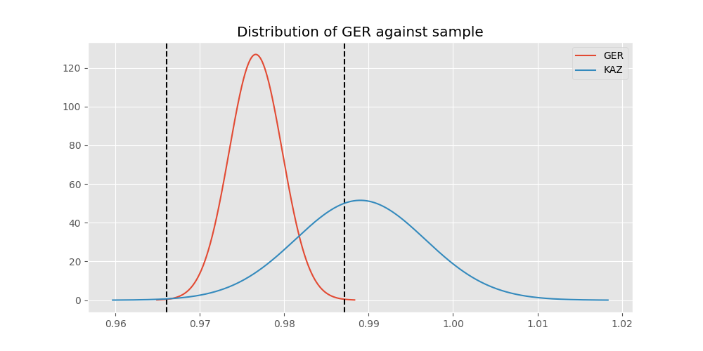

# Testing Results For GER 
$H_{0}$: There is not a difference in collection success against GER 
$H_{A}$: There is a difference in collection success against GER
An $\alpha$ of 0.0008064516129032258 was used 
Out of 25 tests, there were 10 rejections from 25 independent-t test.
Out of 25 tests, there were 9 rejections from 25 Man Whitney u-tests.
## Testing Results for GER against IND 
GER has a success rate of 0.9766233766233766
IND has a success rate of 0.9704433497536946
$H_{0}$: There is not a difference between GER and IND
$H_{A}$: There is a difference between GER and IND
An $/alpha$ of 0.0008064516129032258 was used in this test.
__independent t-testing__: With a t-statistic of 0.7456136725152911 and a p-value of 0.4559653902325812, _we failed to reject the null hypothssis_
__Man-Whitney testing__: With a u-statistic of 471828.0 and a p-value of 0.45594171223895885, _we failed to reject the null hypothssis_
 
## Testing Results for GER against GUAT 
GER has a success rate of 0.9766233766233766
GUAT has a success rate of 0.9705882352941176
$H_{0}$: There is not a difference between GER and GUAT
$H_{A}$: There is a difference between GER and GUAT
An $/alpha$ of 0.0008064516129032258 was used in this test.
__independent t-testing__: With a t-statistic of 0.32333710275238536 and a p-value of 0.7464684120589732, _we failed to reject the null hypothssis_
__Man-Whitney testing__: With a u-statistic of 79014.0 and a p-value of 0.746652161058214, _we failed to reject the null hypothssis_
 
## Testing Results for GER against IT 
GER has a success rate of 0.9766233766233766
IT has a success rate of 0.9217391304347826
$H_{0}$: There is not a difference between GER and IT
$H_{A}$: There is a difference between GER and IT
An $/alpha$ of 0.0008064516129032258 was used in this test.
__independent t-testing__: With a t-statistic of 7.329122457833136 and a p-value of 2.913409429833487e-13, _we **reject** the null hypothssis_
__Man-Whitney testing__: With a u-statistic of 1120920.0 and a p-value of 3.5960482340493356e-13, _we **reject** the null hypothssis_
 
## Testing Results for GER against EST 
GER has a success rate of 0.9766233766233766
EST has a success rate of 0.975
$H_{0}$: There is not a difference between GER and EST
$H_{A}$: There is a difference between GER and EST
An $/alpha$ of 0.0008064516129032258 was used in this test.
__independent t-testing__: With a t-statistic of 0.06730263207353025 and a p-value of 0.9463465117530654, _we failed to reject the null hypothssis_
__Man-Whitney testing__: With a u-statistic of 46275.0 and a p-value of 0.9466866941974, _we failed to reject the null hypothssis_
 
## Testing Results for GER against SKOR 
GER has a success rate of 0.9766233766233766
SKOR has a success rate of 0.9166666666666666
$H_{0}$: There is not a difference between GER and SKOR
$H_{A}$: There is a difference between GER and SKOR
An $/alpha$ of 0.0008064516129032258 was used in this test.
__independent t-testing__: With a t-statistic of 2.946993798223825 and a p-value of 0.0032401428359085088, _we failed to reject the null hypothssis_
__Man-Whitney testing__: With a u-statistic of 73455.0 and a p-value of 0.0032623529410540607, _we failed to reject the null hypothssis_
 
## Testing Results for GER against RP 
GER has a success rate of 0.9766233766233766
RP has a success rate of 0.6735187424425635
$H_{0}$: There is not a difference between GER and RP
$H_{A}$: There is a difference between GER and RP
An $/alpha$ of 0.0008064516129032258 was used in this test.
__independent t-testing__: With a t-statistic of 27.34388347108726 and a p-value of 7.908408884002371e-148, _we **reject** the null hypothssis_
__Man-Whitney testing__: With a u-statistic of 1244706.0 and a p-value of 2.3784914483551017e-133, _we **reject** the null hypothssis_
 
## Testing Results for GER against JPN 
GER has a success rate of 0.9766233766233766
JPN has a success rate of 0.6016371077762619
$H_{0}$: There is not a difference between GER and JPN
$H_{A}$: There is a difference between GER and JPN
An $/alpha$ of 0.0008064516129032258 was used in this test.
__independent t-testing__: With a t-statistic of 32.27510045059419 and a p-value of 8.71605424426982e-197, _we **reject** the null hypothssis_
__Man-Whitney testing__: With a u-statistic of 1164084.0 and a p-value of 8.257934092399759e-171, _we **reject** the null hypothssis_
 
## Testing Results for GER against US 
GER has a success rate of 0.9766233766233766
US has a success rate of 0.918885774351787
$H_{0}$: There is not a difference between GER and US
$H_{A}$: There is a difference between GER and US
An $/alpha$ of 0.0008064516129032258 was used in this test.
__independent t-testing__: With a t-statistic of 9.58641078094583 and a p-value of 1.1912251403037153e-21, _we **reject** the null hypothssis_
__Man-Whitney testing__: With a u-statistic of 6973389.0 and a p-value of 1.5352669604841573e-21, _we **reject** the null hypothssis_
 
## Testing Results for GER against KAZ 
GER has a success rate of 0.9766233766233766
KAZ has a success rate of 0.989010989010989
$H_{0}$: There is not a difference between GER and KAZ
$H_{A}$: There is a difference between GER and KAZ
An $/alpha$ of 0.0008064516129032258 was used in this test.
__independent t-testing__: With a t-statistic of -1.085423021435501 and a p-value of 0.2778394133866279, _we failed to reject the null hypothssis_
__Man-Whitney testing__: With a u-statistic of 207606.0 and a p-value of 0.2778437982788988, _we failed to reject the null hypothssis_
 
## Testing Results for GER against ROC 
GER has a success rate of 0.9766233766233766
ROC has a success rate of 0.17751479289940827
$H_{0}$: There is not a difference between GER and ROC
$H_{A}$: There is a difference between GER and ROC
An $/alpha$ of 0.0008064516129032258 was used in this test.
__independent t-testing__: With a t-statistic of 56.72508049772952 and a p-value of 0.0, _we **reject** the null hypothssis_
__Man-Whitney testing__: With a u-statistic of 351177.0 and a p-value of 1.9469177084204907e-306, _we **reject** the null hypothssis_
 
## Testing Results for GER against THAI 
GER has a success rate of 0.9766233766233766
THAI has a success rate of 0.9880952380952381
$H_{0}$: There is not a difference between GER and THAI
$H_{A}$: There is a difference between GER and THAI
An $/alpha$ of 0.0008064516129032258 was used in this test.
__independent t-testing__: With a t-statistic of -0.9657629605886184 and a p-value of 0.33425712319488965, _we failed to reject the null hypothssis_
__Man-Whitney testing__: With a u-statistic of 191814.0 and a p-value of 0.33426482439395233, _we failed to reject the null hypothssis_
 
## Testing Results for GER against FR 
GER has a success rate of 0.9766233766233766
FR has a success rate of 0.908183632734531
$H_{0}$: There is not a difference between GER and FR
$H_{A}$: There is a difference between GER and FR
An $/alpha$ of 0.0008064516129032258 was used in this test.
__independent t-testing__: With a t-statistic of 7.570600900476318 and a p-value of 5.007025620725156e-14, _we **reject** the null hypothssis_
__Man-Whitney testing__: With a u-statistic of 618258.0 and a p-value of 6.591119446245568e-14, _we **reject** the null hypothssis_
 
## Testing Results for GER against TURK 
GER has a success rate of 0.9766233766233766
TURK has a success rate of 0.9962264150943396
$H_{0}$: There is not a difference between GER and TURK
$H_{A}$: There is a difference between GER and TURK
An $/alpha$ of 0.0008064516129032258 was used in this test.
__independent t-testing__: With a t-statistic of -3.9908743731048473 and a p-value of 7.258944555289058e-05, _we **reject** the null hypothssis_
__Man-Whitney testing__: With a u-statistic of 300075.0 and a p-value of 0.036621043550505, _we failed to reject the null hypothssis_
 
## Testing Results for GER against PRC 
GER has a success rate of 0.9766233766233766
PRC has a success rate of 0.988759187202767
$H_{0}$: There is not a difference between GER and PRC
$H_{A}$: There is a difference between GER and PRC
An $/alpha$ of 0.0008064516129032258 was used in this test.
__independent t-testing__: With a t-statistic of -3.166539346385634 and a p-value of 0.001552683061506122, _we failed to reject the null hypothssis_
__Man-Whitney testing__: With a u-statistic of 2639094.0 and a p-value of 0.0015593636818869504, _we failed to reject the null hypothssis_
 
## Testing Results for GER against BEL 
GER has a success rate of 0.9766233766233766
BEL has a success rate of 0.8883495145631068
$H_{0}$: There is not a difference between GER and BEL
$H_{A}$: There is a difference between GER and BEL
An $/alpha$ of 0.0008064516129032258 was used in this test.
__independent t-testing__: With a t-statistic of 7.115958481660033 and a p-value of 1.4435330787166053e-12, _we **reject** the null hypothssis_
__Man-Whitney testing__: With a u-statistic of 258933.0 and a p-value of 1.8335303413519e-12, _we **reject** the null hypothssis_
 
## Testing Results for GER against POL 
GER has a success rate of 0.9766233766233766
POL has a success rate of 0.979381443298969
$H_{0}$: There is not a difference between GER and POL
$H_{A}$: There is a difference between GER and POL
An $/alpha$ of 0.0008064516129032258 was used in this test.
__independent t-testing__: With a t-statistic of -0.3690428871693021 and a p-value of 0.712123731346761, _we failed to reject the null hypothssis_
__Man-Whitney testing__: With a u-statistic of 558630.0 and a p-value of 0.7121422609409738, _we failed to reject the null hypothssis_
 
## Testing Results for GER against LTU 
GER has a success rate of 0.9766233766233766
LTU has a success rate of 0.984375
$H_{0}$: There is not a difference between GER and LTU
$H_{A}$: There is a difference between GER and LTU
An $/alpha$ of 0.0008064516129032258 was used in this test.
__independent t-testing__: With a t-statistic of -0.8773499838508461 and a p-value of 0.38037676688460376, _we failed to reject the null hypothssis_
__Man-Whitney testing__: With a u-statistic of 366735.0 and a p-value of 0.38035885433813954, _we failed to reject the null hypothssis_
 
## Testing Results for GER against SVN 
GER has a success rate of 0.9766233766233766
SVN has a success rate of 0.9770114942528736
$H_{0}$: There is not a difference between GER and SVN
$H_{A}$: There is a difference between GER and SVN
An $/alpha$ of 0.0008064516129032258 was used in this test.
__independent t-testing__: With a t-statistic of -0.023517279195087684 and a p-value of 0.9812396146027021, _we failed to reject the null hypothssis_
__Man-Whitney testing__: With a u-statistic of 100446.0 and a p-value of 0.9814742913409801, _we failed to reject the null hypothssis_
 
## Testing Results for GER against AUS 
GER has a success rate of 0.9766233766233766
AUS has a success rate of 0.7289377289377289
$H_{0}$: There is not a difference between GER and AUS
$H_{A}$: There is a difference between GER and AUS
An $/alpha$ of 0.0008064516129032258 was used in this test.
__independent t-testing__: With a t-statistic of 19.036205128970767 and a p-value of 1.0385643250967792e-75, _we **reject** the null hypothssis_
__Man-Whitney testing__: With a u-statistic of 393414.0 and a p-value of 4.191007269931049e-71, _we **reject** the null hypothssis_
 
## Testing Results for GER against UKR 
GER has a success rate of 0.9766233766233766
UKR has a success rate of 0.981549815498155
$H_{0}$: There is not a difference between GER and UKR
$H_{A}$: There is a difference between GER and UKR
An $/alpha$ of 0.0008064516129032258 was used in this test.
__independent t-testing__: With a t-statistic of -0.5131839098688111 and a p-value of 0.6078666356656524, _we failed to reject the null hypothssis_
__Man-Whitney testing__: With a u-statistic of 311463.0 and a p-value of 0.6078878333167195, _we failed to reject the null hypothssis_
 
## Testing Results for GER against CIS 
GER has a success rate of 0.9766233766233766
CIS has a success rate of 0.837386018237082
$H_{0}$: There is not a difference between GER and CIS
$H_{A}$: There is a difference between GER and CIS
An $/alpha$ of 0.0008064516129032258 was used in this test.
__independent t-testing__: With a t-statistic of 14.38361198221987 and a p-value of 2.132910189085647e-45, _we **reject** the null hypothssis_
__Man-Whitney testing__: With a u-statistic of 865809.0 and a p-value of 5.582036356526708e-44, _we **reject** the null hypothssis_
 
## Testing Results for GER against SAFR 
GER has a success rate of 0.9766233766233766
SAFR has a success rate of 0.9328358208955224
$H_{0}$: There is not a difference between GER and SAFR
$H_{A}$: There is a difference between GER and SAFR
An $/alpha$ of 0.0008064516129032258 was used in this test.
__independent t-testing__: With a t-statistic of 3.1145320960316645 and a p-value of 0.0018637453042995333, _we failed to reject the null hypothssis_
__Man-Whitney testing__: With a u-statistic of 161547.0 and a p-value of 0.0018786691158890472, _we failed to reject the null hypothssis_
 
## Testing Results for GER against TBD 
GER has a success rate of 0.9766233766233766
TBD has a success rate of 0.9898734177215189
$H_{0}$: There is not a difference between GER and TBD
$H_{A}$: There is a difference between GER and TBD
An $/alpha$ of 0.0008064516129032258 was used in this test.
__independent t-testing__: With a t-statistic of -1.6802755728975687 and a p-value of 0.09301926115350621, _we failed to reject the null hypothssis_
__Man-Whitney testing__: With a u-statistic of 450180.0 and a p-value of 0.09304092795628624, _we failed to reject the null hypothssis_
 
## Testing Results for GER against ESA 
GER has a success rate of 0.9766233766233766
ESA has a success rate of 0.9811320754716981
$H_{0}$: There is not a difference between GER and ESA
$H_{A}$: There is a difference between GER and ESA
An $/alpha$ of 0.0008064516129032258 was used in this test.
__independent t-testing__: With a t-statistic of -0.30153445720083405 and a p-value of 0.7630329509193734, _we failed to reject the null hypothssis_
__Man-Whitney testing__: With a u-statistic of 121878.0 and a p-value of 0.763171981298102, _we failed to reject the null hypothssis_
 
## Testing Results for GER against UK 
GER has a success rate of 0.9766233766233766
UK has a success rate of 0.9881796690307328
$H_{0}$: There is not a difference between GER and UK
$H_{A}$: There is a difference between GER and UK
An $/alpha$ of 0.0008064516129032258 was used in this test.
__independent t-testing__: With a t-statistic of -2.0408796026662377 and a p-value of 0.041345884416928526, _we failed to reject the null hypothssis_
__Man-Whitney testing__: With a u-statistic of 965838.0 and a p-value of 0.04137360647234414, _we failed to reject the null hypothssis_
 
