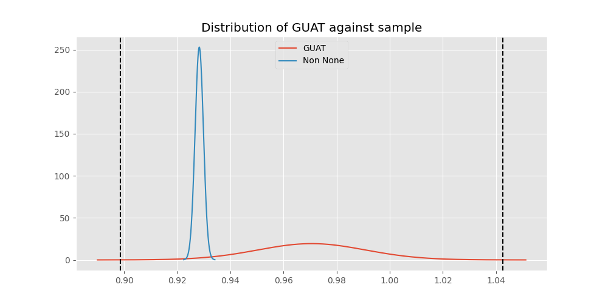
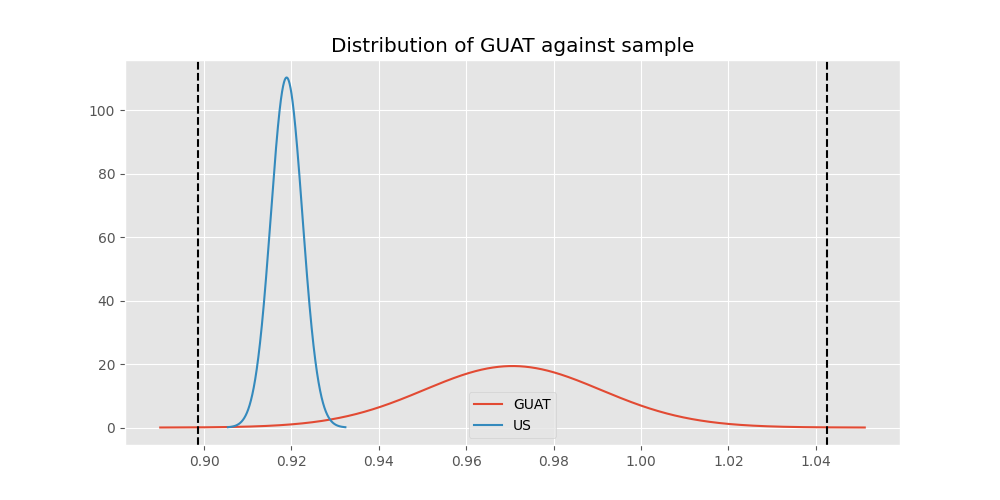
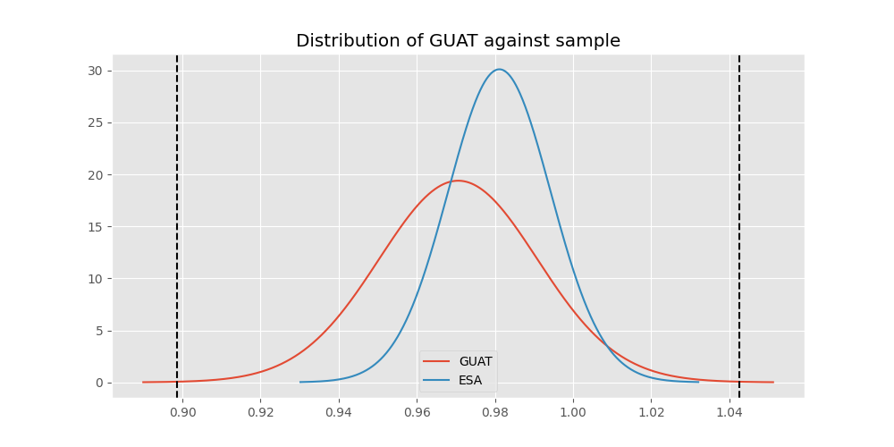

# Testing Results For GUAT 
$H_{0}$: There is not a difference in collection success against GUAT 
$H_{A}$: There is a difference in collection success against GUAT
An $\alpha$ of 0.0008064516129032258 was used 
Out of 25 tests, there were 4 rejections from 25 independent-t test.
Out of 25 tests, there were 4 rejections from 25 Man Whitney u-tests.
## Testing Results for GUAT against IND 
GUAT has a success rate of 0.9705882352941176
IND has a success rate of 0.9704433497536946
$H_{0}$: There is not a difference between GUAT and IND
$H_{A}$: There is a difference between GUAT and IND
An $/alpha$ of 0.0008064516129032258 was used in this test.
__independent t-testing__: With a t-statistic of 0.006517343380663062 and a p-value of 0.9948027027626605, _we failed to reject the null hypothssis_
__Man-Whitney testing__: With a u-statistic of 13806.0 and a p-value of 0.9960958207701575, _we failed to reject the null hypothssis_
 
## Testing Results for GUAT against IT 
GUAT has a success rate of 0.9705882352941176
IT has a success rate of 0.9217391304347826
$H_{0}$: There is not a difference between GUAT and IT
$H_{A}$: There is a difference between GUAT and IT
An $/alpha$ of 0.0008064516129032258 was used in this test.
__independent t-testing__: With a t-statistic of 1.4768428544810634 and a p-value of 0.1400370705197277, _we failed to reject the null hypothssis_
__Man-Whitney testing__: With a u-statistic of 32808.0 and a p-value of 0.14008432990175126, _we failed to reject the null hypothssis_
 
## Testing Results for GUAT against EST 
GUAT has a success rate of 0.9705882352941176
EST has a success rate of 0.975
$H_{0}$: There is not a difference between GUAT and EST
$H_{A}$: There is a difference between GUAT and EST
An $/alpha$ of 0.0008064516129032258 was used in this test.
__independent t-testing__: With a t-statistic of -0.13348453353311476 and a p-value of 0.8940632890175448, _we failed to reject the null hypothssis_
__Man-Whitney testing__: With a u-statistic of 1354.0 and a p-value of 0.9021654512782957, _we failed to reject the null hypothssis_
 
## Testing Results for GUAT against SKOR 
GUAT has a success rate of 0.9705882352941176
SKOR has a success rate of 0.9166666666666666
$H_{0}$: There is not a difference between GUAT and SKOR
$H_{A}$: There is a difference between GUAT and SKOR
An $/alpha$ of 0.0008064516129032258 was used in this test.
__independent t-testing__: With a t-statistic of 1.3378238775237676 and a p-value of 0.18336346539587134, _we failed to reject the null hypothssis_
__Man-Whitney testing__: With a u-statistic of 2150.0 and a p-value of 0.18430326745302517, _we failed to reject the null hypothssis_
 
## Testing Results for GUAT against RP 
GUAT has a success rate of 0.9705882352941176
RP has a success rate of 0.6735187424425635
$H_{0}$: There is not a difference between GUAT and RP
$H_{A}$: There is a difference between GUAT and RP
An $/alpha$ of 0.0008064516129032258 was used in this test.
__independent t-testing__: With a t-statistic of 5.190594203626756 and a p-value of 2.596101163929337e-07, _we **reject** the null hypothssis_
__Man-Whitney testing__: With a u-statistic of 36471.0 and a p-value of 3.111295533468898e-07, _we **reject** the null hypothssis_
 
## Testing Results for GUAT against JPN 
GUAT has a success rate of 0.9705882352941176
JPN has a success rate of 0.6016371077762619
$H_{0}$: There is not a difference between GUAT and JPN
$H_{A}$: There is a difference between GUAT and JPN
An $/alpha$ of 0.0008064516129032258 was used in this test.
__independent t-testing__: With a t-statistic of 6.172874504049621 and a p-value of 1.0658781160817916e-09, _we **reject** the null hypothssis_
__Man-Whitney testing__: With a u-statistic of 34117.0 and a p-value of 1.5976149543690298e-09, _we **reject** the null hypothssis_
 
## Testing Results for GUAT against US 
GUAT has a success rate of 0.9705882352941176
US has a success rate of 0.918885774351787
$H_{0}$: There is not a difference between GUAT and US
$H_{A}$: There is a difference between GUAT and US
An $/alpha$ of 0.0008064516129032258 was used in this test.
__independent t-testing__: With a t-statistic of 1.5578393374420147 and a p-value of 0.1193261438090073, _we failed to reject the null hypothssis_
__Man-Whitney testing__: With a u-statistic of 204106.0 and a p-value of 0.11933538036340385, _we failed to reject the null hypothssis_
 
## Testing Results for GUAT against KAZ 
GUAT has a success rate of 0.9705882352941176
KAZ has a success rate of 0.989010989010989
$H_{0}$: There is not a difference between GUAT and KAZ
$H_{A}$: There is a difference between GUAT and KAZ
An $/alpha$ of 0.0008064516129032258 was used in this test.
__independent t-testing__: With a t-statistic of -1.0311026557955925 and a p-value of 0.30349719178573387, _we failed to reject the null hypothssis_
__Man-Whitney testing__: With a u-statistic of 6074.0 and a p-value of 0.30467948445135906, _we failed to reject the null hypothssis_
 
## Testing Results for GUAT against ROC 
GUAT has a success rate of 0.9705882352941176
ROC has a success rate of 0.17751479289940827
$H_{0}$: There is not a difference between GUAT and ROC
$H_{A}$: There is a difference between GUAT and ROC
An $/alpha$ of 0.0008064516129032258 was used in this test.
__independent t-testing__: With a t-statistic of 16.409742292286996 and a p-value of 7.712111467832538e-41, _we **reject** the null hypothssis_
__Man-Whitney testing__: With a u-statistic of 10303.0 and a p-value of 3.0846319496288884e-29, _we **reject** the null hypothssis_
 
## Testing Results for GUAT against THAI 
GUAT has a success rate of 0.9705882352941176
THAI has a success rate of 0.9880952380952381
$H_{0}$: There is not a difference between GUAT and THAI
$H_{A}$: There is a difference between GUAT and THAI
An $/alpha$ of 0.0008064516129032258 was used in this test.
__independent t-testing__: With a t-statistic of -0.941403261023071 and a p-value of 0.3474690820502212, _we failed to reject the null hypothssis_
__Man-Whitney testing__: With a u-statistic of 5612.0 and a p-value of 0.3487981429968735, _we failed to reject the null hypothssis_
 
## Testing Results for GUAT against FR 
GUAT has a success rate of 0.9705882352941176
FR has a success rate of 0.908183632734531
$H_{0}$: There is not a difference between GUAT and FR
$H_{A}$: There is a difference between GUAT and FR
An $/alpha$ of 0.0008064516129032258 was used in this test.
__independent t-testing__: With a t-statistic of 1.7389899173902927 and a p-value of 0.08257928056410906, _we failed to reject the null hypothssis_
__Man-Whitney testing__: With a u-statistic of 18097.0 and a p-value of 0.08272607103686486, _we failed to reject the null hypothssis_
 
## Testing Results for GUAT against TURK 
GUAT has a success rate of 0.9705882352941176
TURK has a success rate of 0.9962264150943396
$H_{0}$: There is not a difference between GUAT and TURK
$H_{A}$: There is a difference between GUAT and TURK
An $/alpha$ of 0.0008064516129032258 was used in this test.
__independent t-testing__: With a t-statistic of -1.2218215328587174 and a p-value of 0.22578629765306163, _we failed to reject the null hypothssis_
__Man-Whitney testing__: With a u-statistic of 8779.0 and a p-value of 0.04673144190719224, _we failed to reject the null hypothssis_
 
## Testing Results for GUAT against PRC 
GUAT has a success rate of 0.9705882352941176
PRC has a success rate of 0.988759187202767
$H_{0}$: There is not a difference between GUAT and PRC
$H_{A}$: There is a difference between GUAT and PRC
An $/alpha$ of 0.0008064516129032258 was used in this test.
__independent t-testing__: With a t-statistic of -1.3699301556159544 and a p-value of 0.1708379796047041, _we failed to reject the null hypothssis_
__Man-Whitney testing__: With a u-statistic of 77213.0 and a p-value of 0.1709371833248695, _we failed to reject the null hypothssis_
 
## Testing Results for GUAT against BEL 
GUAT has a success rate of 0.9705882352941176
BEL has a success rate of 0.8883495145631068
$H_{0}$: There is not a difference between GUAT and BEL
$H_{A}$: There is a difference between GUAT and BEL
An $/alpha$ of 0.0008064516129032258 was used in this test.
__independent t-testing__: With a t-statistic of 2.0502620929087434 and a p-value of 0.041297324735355266, _we failed to reject the null hypothssis_
__Man-Whitney testing__: With a u-statistic of 7580.0 and a p-value of 0.041693358300242206, _we failed to reject the null hypothssis_
 
## Testing Results for GUAT against POL 
GUAT has a success rate of 0.9705882352941176
POL has a success rate of 0.979381443298969
$H_{0}$: There is not a difference between GUAT and POL
$H_{A}$: There is a difference between GUAT and POL
An $/alpha$ of 0.0008064516129032258 was used in this test.
__independent t-testing__: With a t-statistic of -0.46531229422398923 and a p-value of 0.6418916788332989, _we failed to reject the null hypothssis_
__Man-Whitney testing__: With a u-statistic of 16345.0 and a p-value of 0.6426210915838657, _we failed to reject the null hypothssis_
 
## Testing Results for GUAT against LTU 
GUAT has a success rate of 0.9705882352941176
LTU has a success rate of 0.984375
$H_{0}$: There is not a difference between GUAT and LTU
$H_{A}$: There is a difference between GUAT and LTU
An $/alpha$ of 0.0008064516129032258 was used in this test.
__independent t-testing__: With a t-statistic of -0.7743030514228872 and a p-value of 0.43922560118707565, _we failed to reject the null hypothssis_
__Man-Whitney testing__: With a u-statistic of 10730.0 and a p-value of 0.44004239383461796, _we failed to reject the null hypothssis_
 
## Testing Results for GUAT against SVN 
GUAT has a success rate of 0.9705882352941176
SVN has a success rate of 0.9770114942528736
$H_{0}$: There is not a difference between GUAT and SVN
$H_{A}$: There is a difference between GUAT and SVN
An $/alpha$ of 0.0008064516129032258 was used in this test.
__independent t-testing__: With a t-statistic of -0.24870500755269678 and a p-value of 0.8039225029666714, _we failed to reject the null hypothssis_
__Man-Whitney testing__: With a u-statistic of 2939.0 and a p-value of 0.8080819913303539, _we failed to reject the null hypothssis_
 
## Testing Results for GUAT against AUS 
GUAT has a success rate of 0.9705882352941176
AUS has a success rate of 0.7289377289377289
$H_{0}$: There is not a difference between GUAT and AUS
$H_{A}$: There is a difference between GUAT and AUS
An $/alpha$ of 0.0008064516129032258 was used in this test.
__independent t-testing__: With a t-statistic of 4.391450277131548 and a p-value of 1.5069395261968075e-05, _we **reject** the null hypothssis_
__Man-Whitney testing__: With a u-statistic of 11525.0 and a p-value of 1.8945273957309006e-05, _we **reject** the null hypothssis_
 
## Testing Results for GUAT against UKR 
GUAT has a success rate of 0.9705882352941176
UKR has a success rate of 0.981549815498155
$H_{0}$: There is not a difference between GUAT and UKR
$H_{A}$: There is a difference between GUAT and UKR
An $/alpha$ of 0.0008064516129032258 was used in this test.
__independent t-testing__: With a t-statistic of -0.566912648061645 and a p-value of 0.5711509248403434, _we failed to reject the null hypothssis_
__Man-Whitney testing__: With a u-statistic of 9113.0 and a p-value of 0.5722960062353261, _we failed to reject the null hypothssis_
 
## Testing Results for GUAT against CIS 
GUAT has a success rate of 0.9705882352941176
CIS has a success rate of 0.837386018237082
$H_{0}$: There is not a difference between GUAT and CIS
$H_{A}$: There is a difference between GUAT and CIS
An $/alpha$ of 0.0008064516129032258 was used in this test.
__independent t-testing__: With a t-statistic of 2.9408363886845708 and a p-value of 0.00337765063474148, _we failed to reject the null hypothssis_
__Man-Whitney testing__: With a u-statistic of 25352.0 and a p-value of 0.003445062932132153, _we failed to reject the null hypothssis_
 
## Testing Results for GUAT against SAFR 
GUAT has a success rate of 0.9705882352941176
SAFR has a success rate of 0.9328358208955224
$H_{0}$: There is not a difference between GUAT and SAFR
$H_{A}$: There is a difference between GUAT and SAFR
An $/alpha$ of 0.0008064516129032258 was used in this test.
__independent t-testing__: With a t-statistic of 1.1153212276746267 and a p-value of 0.2660511329420984, _we failed to reject the null hypothssis_
__Man-Whitney testing__: With a u-statistic of 4728.0 and a p-value of 0.26639414836436337, _we failed to reject the null hypothssis_
 
## Testing Results for GUAT against TBD 
GUAT has a success rate of 0.9705882352941176
TBD has a success rate of 0.9898734177215189
$H_{0}$: There is not a difference between GUAT and TBD
$H_{A}$: There is a difference between GUAT and TBD
An $/alpha$ of 0.0008064516129032258 was used in this test.
__independent t-testing__: With a t-statistic of -1.2983328752039256 and a p-value of 0.1948221038659381, _we failed to reject the null hypothssis_
__Man-Whitney testing__: With a u-statistic of 13171.0 and a p-value of 0.19536648597577888, _we failed to reject the null hypothssis_
 
## Testing Results for GUAT against ESA 
GUAT has a success rate of 0.9705882352941176
ESA has a success rate of 0.9811320754716981
$H_{0}$: There is not a difference between GUAT and ESA
$H_{A}$: There is a difference between GUAT and ESA
An $/alpha$ of 0.0008064516129032258 was used in this test.
__independent t-testing__: With a t-statistic of -0.4504763691659502 and a p-value of 0.6529343014784484, _we failed to reject the null hypothssis_
__Man-Whitney testing__: With a u-statistic of 3566.0 and a p-value of 0.6559030466618792, _we failed to reject the null hypothssis_
 
## Testing Results for GUAT against UK 
GUAT has a success rate of 0.9705882352941176
UK has a success rate of 0.9881796690307328
$H_{0}$: There is not a difference between GUAT and UK
$H_{A}$: There is a difference between GUAT and UK
An $/alpha$ of 0.0008064516129032258 was used in this test.
__independent t-testing__: With a t-statistic of -1.2257498367494246 and a p-value of 0.22060925479118543, _we failed to reject the null hypothssis_
__Man-Whitney testing__: With a u-statistic of 28258.0 and a p-value of 0.22087610930682178, _we failed to reject the null hypothssis_
 
## Testing Results for GUAT against GER 
GUAT has a success rate of 0.9705882352941176
GER has a success rate of 0.9766233766233766
$H_{0}$: There is not a difference between GUAT and GER
$H_{A}$: There is a difference between GUAT and GER
An $/alpha$ of 0.0008064516129032258 was used in this test.
__independent t-testing__: With a t-statistic of -0.32333710275238536 and a p-value of 0.7464684120589732, _we failed to reject the null hypothssis_
__Man-Whitney testing__: With a u-statistic of 78066.0 and a p-value of 0.746652161058214, _we failed to reject the null hypothssis_
 
