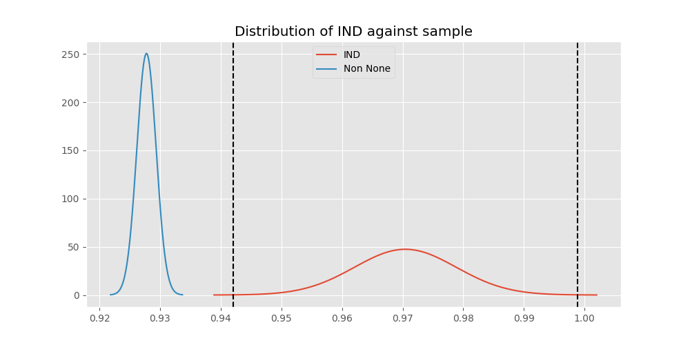

# Testing Results For IND 
$H_{0}$: There is not a difference in collection success against IND 
$H_{A}$: There is a difference in collection success against IND
An $\alpha$ of 0.0008064516129032258 was used 
Out of 25 tests, there were 9 rejections from 25 independent-t test.
Out of 25 tests, there were 9 rejections from 25 Man Whitney u-tests.
## Testing Results for IND against GUAT 
IND has a success rate of 0.9704433497536946
GUAT has a success rate of 0.9705882352941176
$H_{0}$: There is not a difference between IND and GUAT
$H_{A}$: There is a difference between IND and GUAT
An $/alpha$ of 0.0008064516129032258 was used in this test.
__independent t-testing__: With a t-statistic of -0.006517343380663062 and a p-value of 0.9948027027626605, _we failed to reject the null hypothssis_
__Man-Whitney testing__: With a u-statistic of 13802.0 and a p-value of 0.9960958207701575, _we failed to reject the null hypothssis_
 
## Testing Results for IND against IT 
IND has a success rate of 0.9704433497536946
IT has a success rate of 0.9217391304347826
$H_{0}$: There is not a difference between IND and IT
$H_{A}$: There is a difference between IND and IT
An $/alpha$ of 0.0008064516129032258 was used in this test.
__independent t-testing__: With a t-statistic of 3.3675892308919653 and a p-value of 0.000780053359199639, _we **reject** the null hypothssis_
__Man-Whitney testing__: With a u-statistic of 195856.0 and a p-value of 0.0007955441172665066, _we **reject** the null hypothssis_
 
## Testing Results for IND against EST 
IND has a success rate of 0.9704433497536946
EST has a success rate of 0.975
$H_{0}$: There is not a difference between IND and EST
$H_{A}$: There is a difference between IND and EST
An $/alpha$ of 0.0008064516129032258 was used in this test.
__independent t-testing__: With a t-statistic of -0.16309009139156075 and a p-value of 0.8705217047985694, _we failed to reject the null hypothssis_
__Man-Whitney testing__: With a u-statistic of 8083.0 and a p-value of 0.8720442357268718, _we failed to reject the null hypothssis_
 
## Testing Results for IND against SKOR 
IND has a success rate of 0.9704433497536946
SKOR has a success rate of 0.9166666666666666
$H_{0}$: There is not a difference between IND and SKOR
$H_{A}$: There is a difference between IND and SKOR
An $/alpha$ of 0.0008064516129032258 was used in this test.
__independent t-testing__: With a t-statistic of 2.0790141316412853 and a p-value of 0.03816480224211275, _we failed to reject the null hypothssis_
__Man-Whitney testing__: With a u-statistic of 12835.0 and a p-value of 0.03844810236875583, _we failed to reject the null hypothssis_
 
## Testing Results for IND against RP 
IND has a success rate of 0.9704433497536946
RP has a success rate of 0.6735187424425635
$H_{0}$: There is not a difference between IND and RP
$H_{A}$: There is a difference between IND and RP
An $/alpha$ of 0.0008064516129032258 was used in this test.
__independent t-testing__: With a t-statistic of 12.358738691102793 and a p-value of 3.694675594217836e-33, _we **reject** the null hypothssis_
__Man-Whitney testing__: With a u-statistic of 217729.0 and a p-value of 2.0087586264610584e-31, _we **reject** the null hypothssis_
 
## Testing Results for IND against JPN 
IND has a success rate of 0.9704433497536946
JPN has a success rate of 0.6016371077762619
$H_{0}$: There is not a difference between IND and JPN
$H_{A}$: There is a difference between IND and JPN
An $/alpha$ of 0.0008064516129032258 was used in this test.
__independent t-testing__: With a t-statistic of 14.6870871772865 and a p-value of 7.59450034665302e-45, _we **reject** the null hypothssis_
__Man-Whitney testing__: With a u-statistic of 203677.0 and a p-value of 2.316504428107598e-41, _we **reject** the null hypothssis_
 
## Testing Results for IND against US 
IND has a success rate of 0.9704433497536946
US has a success rate of 0.918885774351787
$H_{0}$: There is not a difference between IND and US
$H_{A}$: There is a difference between IND and US
An $/alpha$ of 0.0008064516129032258 was used in this test.
__independent t-testing__: With a t-statistic of 3.753542056211576 and a p-value of 0.000175970430155051, _we **reject** the null hypothssis_
__Man-Whitney testing__: With a u-statistic of 1218465.0 and a p-value of 0.0001771884872431819, _we **reject** the null hypothssis_
 
## Testing Results for IND against KAZ 
IND has a success rate of 0.9704433497536946
KAZ has a success rate of 0.989010989010989
$H_{0}$: There is not a difference between IND and KAZ
$H_{A}$: There is a difference between IND and KAZ
An $/alpha$ of 0.0008064516129032258 was used in this test.
__independent t-testing__: With a t-statistic of -1.365129064377848 and a p-value of 0.17273634058977458, _we failed to reject the null hypothssis_
__Man-Whitney testing__: With a u-statistic of 36260.0 and a p-value of 0.17284099490812344, _we failed to reject the null hypothssis_
 
## Testing Results for IND against ROC 
IND has a success rate of 0.9704433497536946
ROC has a success rate of 0.17751479289940827
$H_{0}$: There is not a difference between IND and ROC
$H_{A}$: There is a difference between IND and ROC
An $/alpha$ of 0.0008064516129032258 was used in this test.
__independent t-testing__: With a t-statistic of 34.40421362977151 and a p-value of 1.648250744971649e-141, _we **reject** the null hypothssis_
__Man-Whitney testing__: With a u-statistic of 61510.0 and a p-value of 4.2140982732280854e-86, _we **reject** the null hypothssis_
 
## Testing Results for IND against THAI 
IND has a success rate of 0.9704433497536946
THAI has a success rate of 0.9880952380952381
$H_{0}$: There is not a difference between IND and THAI
$H_{A}$: There is a difference between IND and THAI
An $/alpha$ of 0.0008064516129032258 was used in this test.
__independent t-testing__: With a t-statistic of -1.2469190498962157 and a p-value of 0.21293751545639833, _we failed to reject the null hypothssis_
__Man-Whitney testing__: With a u-statistic of 33502.0 and a p-value of 0.2130285958055247, _we failed to reject the null hypothssis_
 
## Testing Results for IND against FR 
IND has a success rate of 0.9704433497536946
FR has a success rate of 0.908183632734531
$H_{0}$: There is not a difference between IND and FR
$H_{A}$: There is a difference between IND and FR
An $/alpha$ of 0.0008064516129032258 was used in this test.
__independent t-testing__: With a t-statistic of 3.837519033837509 and a p-value of 0.00013291733443387773, _we **reject** the null hypothssis_
__Man-Whitney testing__: With a u-statistic of 108035.0 and a p-value of 0.00013982709974137412, _we **reject** the null hypothssis_
 
## Testing Results for IND against TURK 
IND has a success rate of 0.9704433497536946
TURK has a success rate of 0.9962264150943396
$H_{0}$: There is not a difference between IND and TURK
$H_{A}$: There is a difference between IND and TURK
An $/alpha$ of 0.0008064516129032258 was used in this test.
__independent t-testing__: With a t-statistic of -2.7955417837544245 and a p-value of 0.005362274914257556, _we failed to reject the null hypothssis_
__Man-Whitney testing__: With a u-statistic of 52408.0 and a p-value of 0.01798092741272375, _we failed to reject the null hypothssis_
 
## Testing Results for IND against PRC 
IND has a success rate of 0.9704433497536946
PRC has a success rate of 0.988759187202767
$H_{0}$: There is not a difference between IND and PRC
$H_{A}$: There is a difference between IND and PRC
An $/alpha$ of 0.0008064516129032258 was used in this test.
__independent t-testing__: With a t-statistic of -2.903051510700778 and a p-value of 0.0037252355694146638, _we failed to reject the null hypothssis_
__Man-Whitney testing__: With a u-statistic of 460939.0 and a p-value of 0.0037444521143469613, _we failed to reject the null hypothssis_
 
## Testing Results for IND against BEL 
IND has a success rate of 0.9704433497536946
BEL has a success rate of 0.8883495145631068
$H_{0}$: There is not a difference between IND and BEL
$H_{A}$: There is a difference between IND and BEL
An $/alpha$ of 0.0008064516129032258 was used in this test.
__independent t-testing__: With a t-statistic of 4.185015549910467 and a p-value of 3.270917802599457e-05, _we **reject** the null hypothssis_
__Man-Whitney testing__: With a u-statistic of 45251.0 and a p-value of 3.643789298932504e-05, _we **reject** the null hypothssis_
 
## Testing Results for IND against POL 
IND has a success rate of 0.9704433497536946
POL has a success rate of 0.979381443298969
$H_{0}$: There is not a difference between IND and POL
$H_{A}$: There is a difference between IND and POL
An $/alpha$ of 0.0008064516129032258 was used in this test.
__independent t-testing__: With a t-statistic of -0.855632326946844 and a p-value of 0.39243172850347363, _we failed to reject the null hypothssis_
__Man-Whitney testing__: With a u-statistic of 97575.0 and a p-value of 0.3923989783086115, _we failed to reject the null hypothssis_
 
## Testing Results for IND against LTU 
IND has a success rate of 0.9704433497536946
LTU has a success rate of 0.984375
$H_{0}$: There is not a difference between IND and LTU
$H_{A}$: There is a difference between IND and LTU
An $/alpha$ of 0.0008064516129032258 was used in this test.
__independent t-testing__: With a t-statistic of -1.2320179832008489 and a p-value of 0.21834233851208235, _we failed to reject the null hypothssis_
__Man-Whitney testing__: With a u-statistic of 64055.0 and a p-value of 0.2183611006686722, _we failed to reject the null hypothssis_
 
## Testing Results for IND against SVN 
IND has a success rate of 0.9704433497536946
SVN has a success rate of 0.9770114942528736
$H_{0}$: There is not a difference between IND and SVN
$H_{A}$: There is a difference between IND and SVN
An $/alpha$ of 0.0008064516129032258 was used in this test.
__independent t-testing__: With a t-statistic of -0.3340593728485691 and a p-value of 0.7384773879302273, _we failed to reject the null hypothssis_
__Man-Whitney testing__: With a u-statistic of 17545.0 and a p-value of 0.7391945402365296, _we failed to reject the null hypothssis_
 
## Testing Results for IND against AUS 
IND has a success rate of 0.9704433497536946
AUS has a success rate of 0.7289377289377289
$H_{0}$: There is not a difference between IND and AUS
$H_{A}$: There is a difference between IND and AUS
An $/alpha$ of 0.0008064516129032258 was used in this test.
__independent t-testing__: With a t-statistic of 9.913410735580943 and a p-value of 1.009341775300236e-21, _we **reject** the null hypothssis_
__Man-Whitney testing__: With a u-statistic of 68803.0 and a p-value of 1.856288652507405e-20, _we **reject** the null hypothssis_
 
## Testing Results for IND against UKR 
IND has a success rate of 0.9704433497536946
UKR has a success rate of 0.981549815498155
$H_{0}$: There is not a difference between IND and UKR
$H_{A}$: There is a difference between IND and UKR
An $/alpha$ of 0.0008064516129032258 was used in this test.
__independent t-testing__: With a t-statistic of -0.9041527956185024 and a p-value of 0.36623695731918204, _we failed to reject the null hypothssis_
__Man-Whitney testing__: With a u-statistic of 54402.0 and a p-value of 0.36624208654434154, _we failed to reject the null hypothssis_
 
## Testing Results for IND against CIS 
IND has a success rate of 0.9704433497536946
CIS has a success rate of 0.837386018237082
$H_{0}$: There is not a difference between IND and CIS
$H_{A}$: There is a difference between IND and CIS
An $/alpha$ of 0.0008064516129032258 was used in this test.
__independent t-testing__: With a t-statistic of 6.828386363011794 and a p-value of 1.4423713078711526e-11, _we **reject** the null hypothssis_
__Man-Whitney testing__: With a u-statistic of 151347.0 and a p-value of 2.2902938671209274e-11, _we **reject** the null hypothssis_
 
## Testing Results for IND against SAFR 
IND has a success rate of 0.9704433497536946
SAFR has a success rate of 0.9328358208955224
$H_{0}$: There is not a difference between IND and SAFR
$H_{A}$: There is a difference between IND and SAFR
An $/alpha$ of 0.0008064516129032258 was used in this test.
__independent t-testing__: With a t-statistic of 1.9558091920705956 and a p-value of 0.05100477693517752, _we failed to reject the null hypothssis_
__Man-Whitney testing__: With a u-statistic of 28225.0 and a p-value of 0.05120591099307721, _we failed to reject the null hypothssis_
 
## Testing Results for IND against TBD 
IND has a success rate of 0.9704433497536946
TBD has a success rate of 0.9898734177215189
$H_{0}$: There is not a difference between IND and TBD
$H_{A}$: There is a difference between IND and TBD
An $/alpha$ of 0.0008064516129032258 was used in this test.
__independent t-testing__: With a t-statistic of -1.9672688693414135 and a p-value of 0.04949781381052486, _we failed to reject the null hypothssis_
__Man-Whitney testing__: With a u-statistic of 78627.0 and a p-value of 0.04963233056045496, _we failed to reject the null hypothssis_
 
## Testing Results for IND against ESA 
IND has a success rate of 0.9704433497536946
ESA has a success rate of 0.9811320754716981
$H_{0}$: There is not a difference between IND and ESA
$H_{A}$: There is a difference between IND and ESA
An $/alpha$ of 0.0008064516129032258 was used in this test.
__independent t-testing__: With a t-statistic of -0.5999312329960799 and a p-value of 0.5488185208611764, _we failed to reject the null hypothssis_
__Man-Whitney testing__: With a u-statistic of 21288.0 and a p-value of 0.5491713443765249, _we failed to reject the null hypothssis_
 
## Testing Results for IND against UK 
IND has a success rate of 0.9704433497536946
UK has a success rate of 0.9881796690307328
$H_{0}$: There is not a difference between IND and UK
$H_{A}$: There is a difference between IND and UK
An $/alpha$ of 0.0008064516129032258 was used in this test.
__independent t-testing__: With a t-statistic of -2.2385747660975093 and a p-value of 0.025359045989603212, _we failed to reject the null hypothssis_
__Man-Whitney testing__: With a u-statistic of 168692.0 and a p-value of 0.025441806828201997, _we failed to reject the null hypothssis_
 
## Testing Results for IND against GER 
IND has a success rate of 0.9704433497536946
GER has a success rate of 0.9766233766233766
$H_{0}$: There is not a difference between IND and GER
$H_{A}$: There is a difference between IND and GER
An $/alpha$ of 0.0008064516129032258 was used in this test.
__independent t-testing__: With a t-statistic of -0.7456136725152911 and a p-value of 0.4559653902325812, _we failed to reject the null hypothssis_
__Man-Whitney testing__: With a u-statistic of 466032.0 and a p-value of 0.45594171223895885, _we failed to reject the null hypothssis_
 
