# Testing Results For IT 
$H_{0}$: There is not a difference in collection success against IT 
$H_{A}$: There is a difference in collection success against IT
An $\alpha$ of 0.0008064516129032258 was used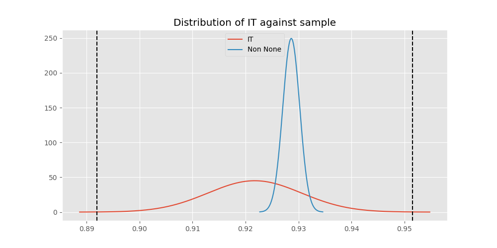 
Out of 25 tests, there were 16 rejections from 25 independent-t test.
Out of 25 tests, there were 14 rejections from 25 Man Whitney u-tests.
## Testing Results for IT against IND 
IT has a success rate of 0.9217391304347826
IND has a success rate of 0.9704433497536946
$H_{0}$: There is not a difference between IT and IND
$H_{A}$: There is a difference between IT and IND
An $/alpha$ of 0.0008064516129032258 was used in this test.
__independent t-testing__: With a t-statistic of -3.3675892308919653 and a p-value of 0.000780053359199639, _we **reject** the null hypothssis_
__Man-Whitney testing__: With a u-statistic of 177664.0 and a p-value of 0.0007955441172665066, _we **reject** the null hypothssis_
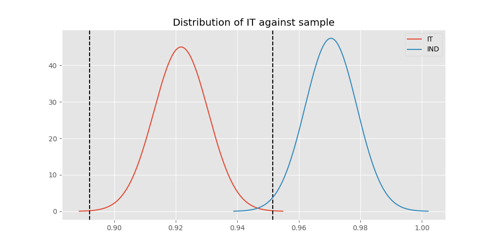 
## Testing Results for IT against GUAT 
IT has a success rate of 0.9217391304347826
GUAT has a success rate of 0.9705882352941176
$H_{0}$: There is not a difference between IT and GUAT
$H_{A}$: There is a difference between IT and GUAT
An $/alpha$ of 0.0008064516129032258 was used in this test.
__independent t-testing__: With a t-statistic of -1.4768428544810634 and a p-value of 0.1400370705197277, _we failed to reject the null hypothssis_
__Man-Whitney testing__: With a u-statistic of 29752.0 and a p-value of 0.14008432990175126, _we failed to reject the null hypothssis_
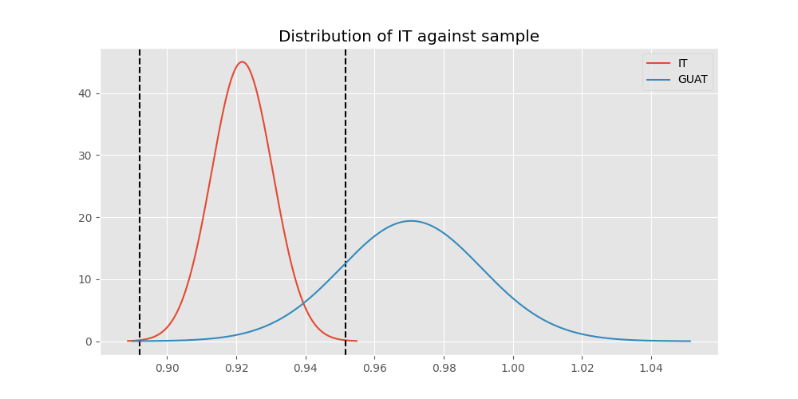 
## Testing Results for IT against EST 
IT has a success rate of 0.9217391304347826
EST has a success rate of 0.975
$H_{0}$: There is not a difference between IT and EST
$H_{A}$: There is a difference between IT and EST
An $/alpha$ of 0.0008064516129032258 was used in this test.
__independent t-testing__: With a t-statistic of -1.2437756294914366 and a p-value of 0.2138864075265589, _we failed to reject the null hypothssis_
__Man-Whitney testing__: With a u-statistic of 17420.0 and a p-value of 0.2139464518255837, _we failed to reject the null hypothssis_
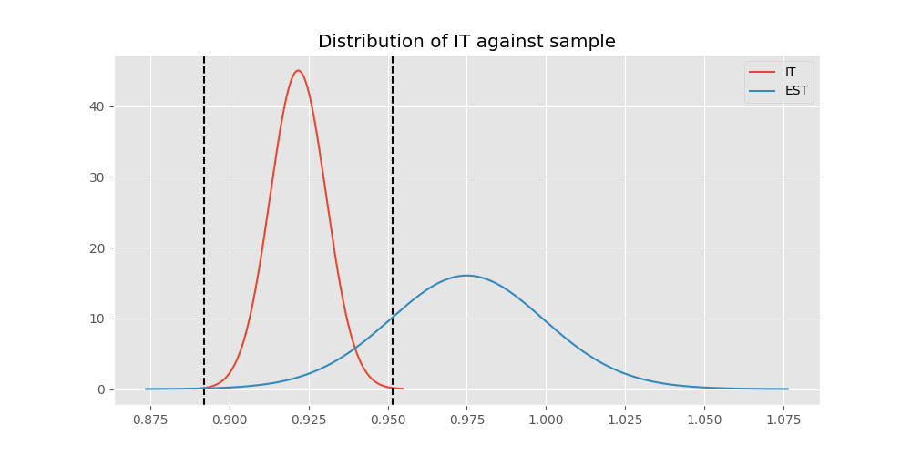 
## Testing Results for IT against SKOR 
IT has a success rate of 0.9217391304347826
SKOR has a success rate of 0.9166666666666666
$H_{0}$: There is not a difference between IT and SKOR
$H_{A}$: There is a difference between IT and SKOR
An $/alpha$ of 0.0008064516129032258 was used in this test.
__independent t-testing__: With a t-statistic of 0.14134261362683975 and a p-value of 0.8876283945757788, _we failed to reject the null hypothssis_
__Man-Whitney testing__: With a u-statistic of 27740.0 and a p-value of 0.8879423345714593, _we failed to reject the null hypothssis_
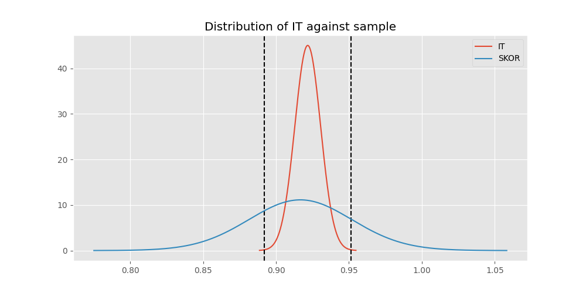 
## Testing Results for IT against RP 
IT has a success rate of 0.9217391304347826
RP has a success rate of 0.6735187424425635
$H_{0}$: There is not a difference between IT and RP
$H_{A}$: There is a difference between IT and RP
An $/alpha$ of 0.0008064516129032258 was used in this test.
__independent t-testing__: With a t-statistic of 13.734761649236921 and a p-value of 7.71153270543527e-41, _we **reject** the null hypothssis_
__Man-Whitney testing__: With a u-statistic of 474848.0 and a p-value of 6.24980689033007e-39, _we **reject** the null hypothssis_
 
## Testing Results for IT against JPN 
IT has a success rate of 0.9217391304347826
JPN has a success rate of 0.6016371077762619
$H_{0}$: There is not a difference between IT and JPN
$H_{A}$: There is a difference between IT and JPN
An $/alpha$ of 0.0008064516129032258 was used in this test.
__independent t-testing__: With a t-statistic of 16.885928218841443 and a p-value of 3.9116162344302803e-59, _we **reject** the null hypothssis_
__Man-Whitney testing__: With a u-statistic of 445112.0 and a p-value of 7.548055792778898e-55, _we **reject** the null hypothssis_
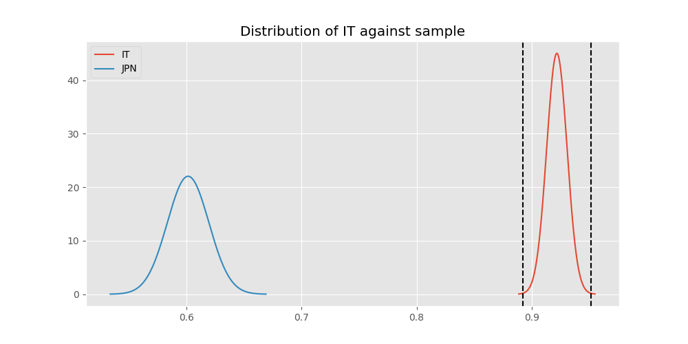 
## Testing Results for IT against US 
IT has a success rate of 0.9217391304347826
US has a success rate of 0.918885774351787
$H_{0}$: There is not a difference between IT and US
$H_{A}$: There is a difference between IT and US
An $/alpha$ of 0.0008064516129032258 was used in this test.
__independent t-testing__: With a t-statistic of 0.29480032113522425 and a p-value of 0.7681556567758342, _we failed to reject the null hypothssis_
__Man-Whitney testing__: With a u-statistic of 2633172.0 and a p-value of 0.7681459354184519, _we failed to reject the null hypothssis_
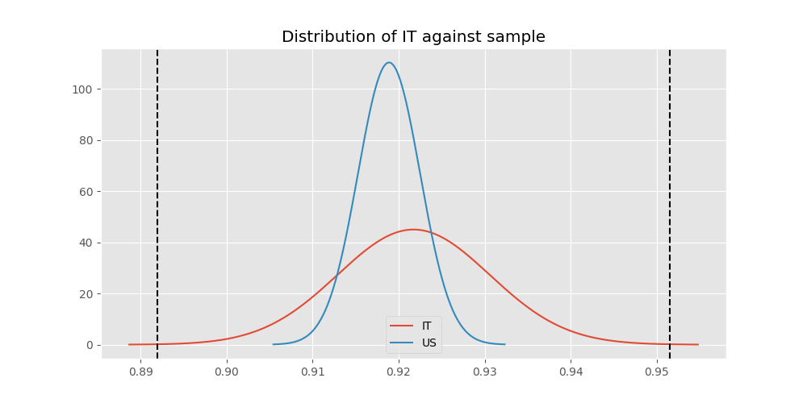 
## Testing Results for IT against KAZ 
IT has a success rate of 0.9217391304347826
KAZ has a success rate of 0.989010989010989
$H_{0}$: There is not a difference between IT and KAZ
$H_{A}$: There is a difference between IT and KAZ
An $/alpha$ of 0.0008064516129032258 was used in this test.
__independent t-testing__: With a t-statistic of -5.715395200450954 and a p-value of 1.602239784038974e-08, _we **reject** the null hypothssis_
__Man-Whitney testing__: With a u-statistic of 78088.0 and a p-value of 0.0009284540295501323, _we failed to reject the null hypothssis_
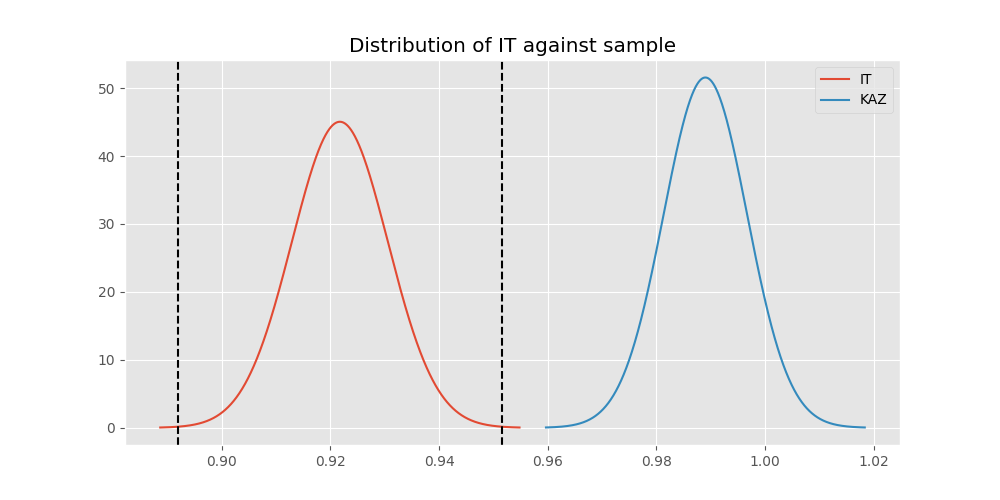 
## Testing Results for IT against ROC 
IT has a success rate of 0.9217391304347826
ROC has a success rate of 0.17751479289940827
$H_{0}$: There is not a difference between IT and ROC
$H_{A}$: There is a difference between IT and ROC
An $/alpha$ of 0.0008064516129032258 was used in this test.
__independent t-testing__: With a t-statistic of 30.727440174049867 and a p-value of 9.54166172308629e-150, _we **reject** the null hypothssis_
__Man-Whitney testing__: With a u-statistic of 135596.0 and a p-value of 5.3608406254551e-112, _we **reject** the null hypothssis_
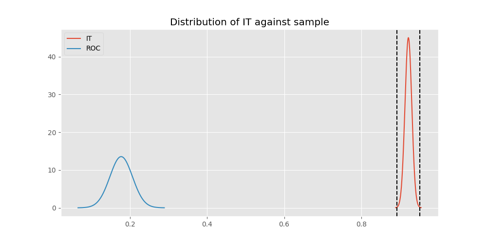 
## Testing Results for IT against THAI 
IT has a success rate of 0.9217391304347826
THAI has a success rate of 0.9880952380952381
$H_{0}$: There is not a difference between IT and THAI
$H_{A}$: There is a difference between IT and THAI
An $/alpha$ of 0.0008064516129032258 was used in this test.
__independent t-testing__: With a t-statistic of -5.4373543942161975 and a p-value of 7.836147737241871e-08, _we **reject** the null hypothssis_
__Man-Whitney testing__: With a u-statistic of 72152.0 and a p-value of 0.0016920903548474915, _we failed to reject the null hypothssis_
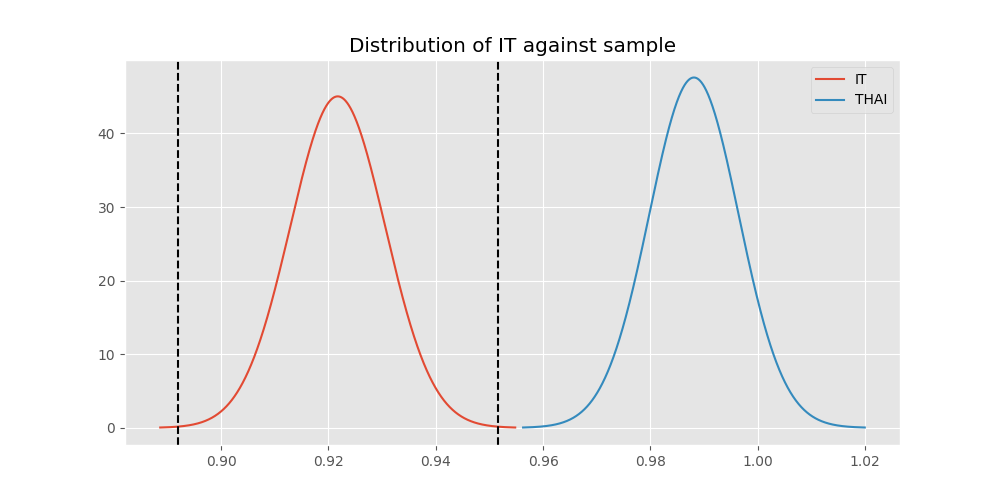 
## Testing Results for IT against FR 
IT has a success rate of 0.9217391304347826
FR has a success rate of 0.908183632734531
$H_{0}$: There is not a difference between IT and FR
$H_{A}$: There is a difference between IT and FR
An $/alpha$ of 0.0008064516129032258 was used in this test.
__independent t-testing__: With a t-statistic of 0.8843534574985947 and a p-value of 0.37665525388370624, _we failed to reject the null hypothssis_
__Man-Whitney testing__: With a u-statistic of 233584.0 and a p-value of 0.3765452055927193, _we failed to reject the null hypothssis_
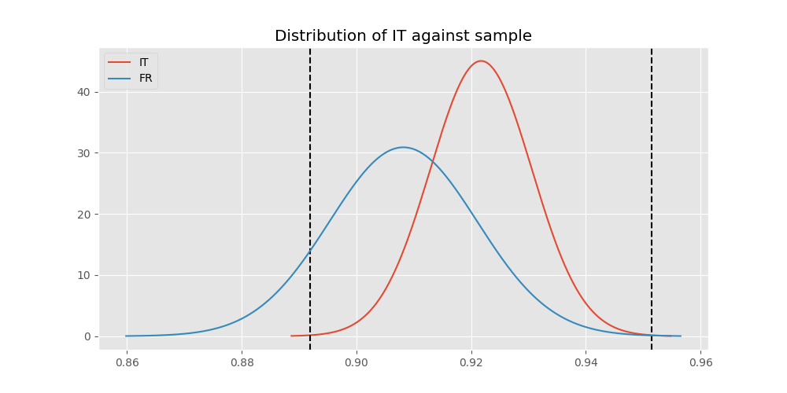 
## Testing Results for IT against TURK 
IT has a success rate of 0.9217391304347826
TURK has a success rate of 0.9962264150943396
$H_{0}$: There is not a difference between IT and TURK
$H_{A}$: There is a difference between IT and TURK
An $/alpha$ of 0.0008064516129032258 was used in this test.
__independent t-testing__: With a t-statistic of -7.735038404715729 and a p-value of 2.2479173548906293e-14, _we **reject** the null hypothssis_
__Man-Whitney testing__: With a u-statistic of 112820.0 and a p-value of 8.9302361563212e-06, _we **reject** the null hypothssis_
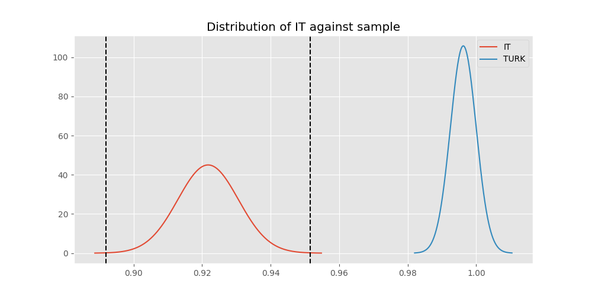 
## Testing Results for IT against PRC 
IT has a success rate of 0.9217391304347826
PRC has a success rate of 0.988759187202767
$H_{0}$: There is not a difference between IT and PRC
$H_{A}$: There is a difference between IT and PRC
An $/alpha$ of 0.0008064516129032258 was used in this test.
__independent t-testing__: With a t-statistic of -7.343085502767647 and a p-value of 4.2242678133806586e-13, _we **reject** the null hypothssis_
__Man-Whitney testing__: With a u-statistic of 992672.0 and a p-value of 1.1554534137978016e-23, _we **reject** the null hypothssis_
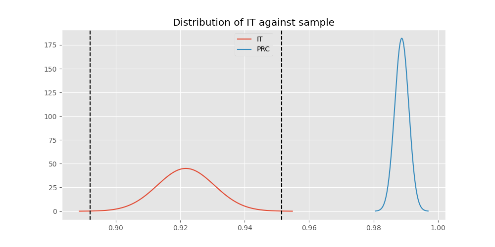 
## Testing Results for IT against BEL 
IT has a success rate of 0.9217391304347826
BEL has a success rate of 0.8883495145631068
$H_{0}$: There is not a difference between IT and BEL
$H_{A}$: There is a difference between IT and BEL
An $/alpha$ of 0.0008064516129032258 was used in this test.
__independent t-testing__: With a t-statistic of 1.558834139638132 and a p-value of 0.11931714273234562, _we failed to reject the null hypothssis_
__Man-Whitney testing__: With a u-statistic of 97924.0 and a p-value of 0.11932852573913061, _we failed to reject the null hypothssis_
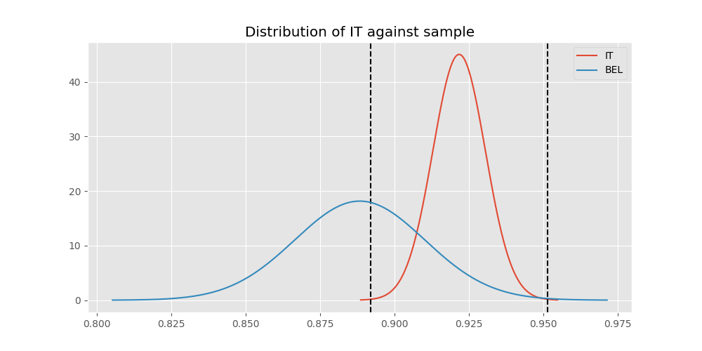 
## Testing Results for IT against POL 
IT has a success rate of 0.9217391304347826
POL has a success rate of 0.979381443298969
$H_{0}$: There is not a difference between IT and POL
$H_{A}$: There is a difference between IT and POL
An $/alpha$ of 0.0008064516129032258 was used in this test.
__independent t-testing__: With a t-statistic of -4.40895988554487 and a p-value of 1.117870137348658e-05, _we **reject** the null hypothssis_
__Man-Whitney testing__: With a u-statistic of 210240.0 and a p-value of 1.1861401311215056e-05, _we **reject** the null hypothssis_
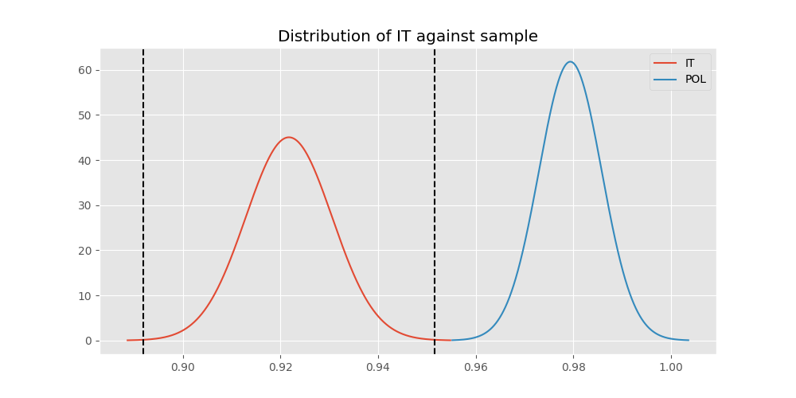 
## Testing Results for IT against LTU 
IT has a success rate of 0.9217391304347826
LTU has a success rate of 0.984375
$H_{0}$: There is not a difference between IT and LTU
$H_{A}$: There is a difference between IT and LTU
An $/alpha$ of 0.0008064516129032258 was used in this test.
__independent t-testing__: With a t-statistic of -5.564391542114744 and a p-value of 3.272550301469427e-08, _we **reject** the null hypothssis_
__Man-Whitney testing__: With a u-statistic of 137980.0 and a p-value of 6.406372571518625e-05, _we **reject** the null hypothssis_
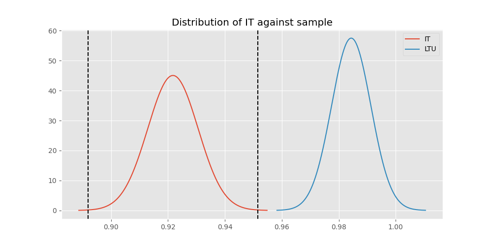 
## Testing Results for IT against SVN 
IT has a success rate of 0.9217391304347826
SVN has a success rate of 0.9770114942528736
$H_{0}$: There is not a difference between IT and SVN
$H_{A}$: There is a difference between IT and SVN
An $/alpha$ of 0.0008064516129032258 was used in this test.
__independent t-testing__: With a t-statistic of -1.8899850090351122 and a p-value of 0.059047524329393766, _we failed to reject the null hypothssis_
__Man-Whitney testing__: With a u-statistic of 37808.0 and a p-value of 0.05914057003010387, _we failed to reject the null hypothssis_
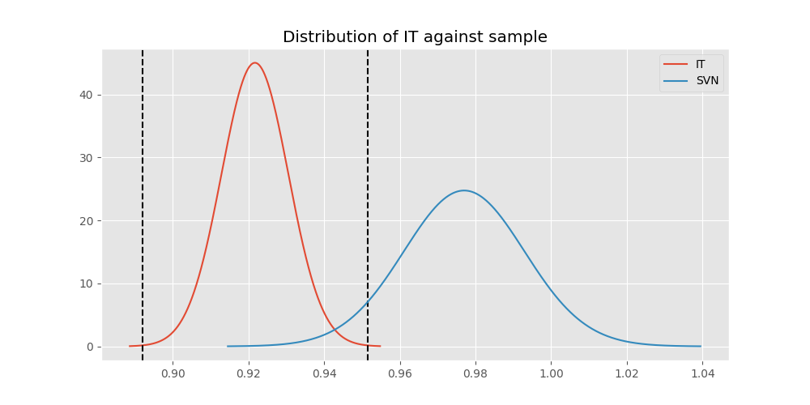 
## Testing Results for IT against AUS 
IT has a success rate of 0.9217391304347826
AUS has a success rate of 0.7289377289377289
$H_{0}$: There is not a difference between IT and AUS
$H_{A}$: There is a difference between IT and AUS
An $/alpha$ of 0.0008064516129032258 was used in this test.
__independent t-testing__: With a t-statistic of 8.801898154855223 and a p-value of 4.6444004881701635e-18, _we **reject** the null hypothssis_
__Man-Whitney testing__: With a u-statistic of 149792.0 and a p-value of 1.434981957093269e-17, _we **reject** the null hypothssis_
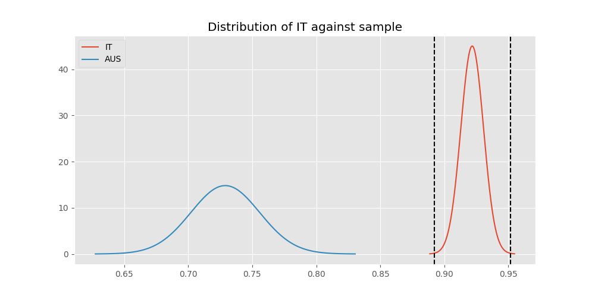 
## Testing Results for IT against UKR 
IT has a success rate of 0.9217391304347826
UKR has a success rate of 0.981549815498155
$H_{0}$: There is not a difference between IT and UKR
$H_{A}$: There is a difference between IT and UKR
An $/alpha$ of 0.0008064516129032258 was used in this test.
__independent t-testing__: With a t-statistic of -3.534516105678728 and a p-value of 0.00042421268732491485, _we **reject** the null hypothssis_
__Man-Whitney testing__: With a u-statistic of 117204.0 and a p-value of 0.00043590326078764437, _we **reject** the null hypothssis_
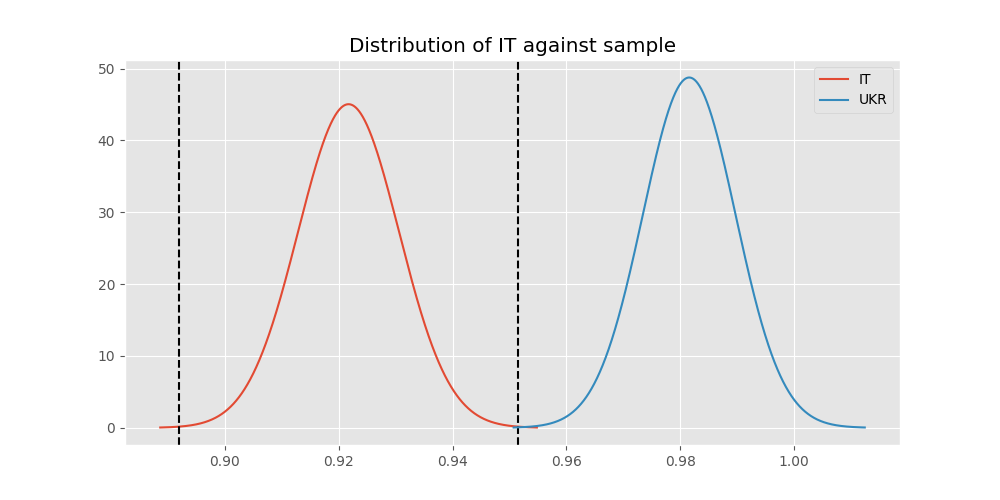 
## Testing Results for IT against CIS 
IT has a success rate of 0.9217391304347826
CIS has a success rate of 0.837386018237082
$H_{0}$: There is not a difference between IT and CIS
$H_{A}$: There is a difference between IT and CIS
An $/alpha$ of 0.0008064516129032258 was used in this test.
__independent t-testing__: With a t-statistic of 5.2519221208930364 and a p-value of 1.710481894096418e-07, _we **reject** the null hypothssis_
__Man-Whitney testing__: With a u-statistic of 328212.0 and a p-value of 1.907763939569969e-07, _we **reject** the null hypothssis_
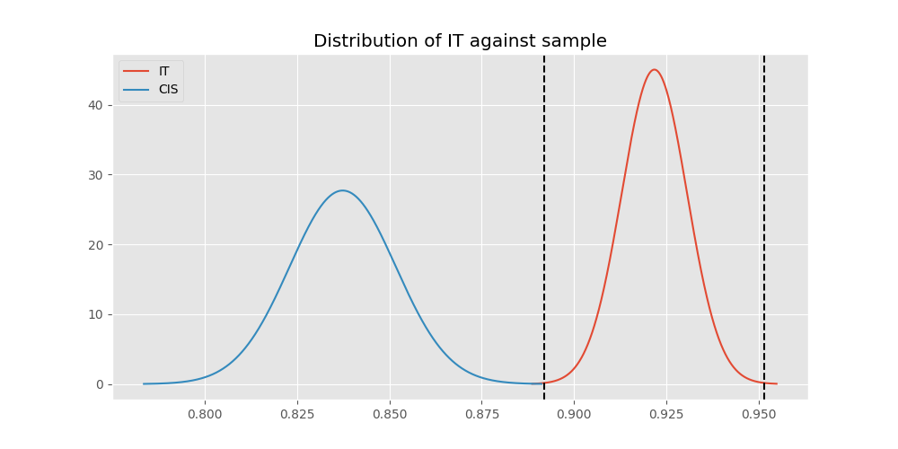 
## Testing Results for IT against SAFR 
IT has a success rate of 0.9217391304347826
SAFR has a success rate of 0.9328358208955224
$H_{0}$: There is not a difference between IT and SAFR
$H_{A}$: There is a difference between IT and SAFR
An $/alpha$ of 0.0008064516129032258 was used in this test.
__independent t-testing__: With a t-statistic of -0.4501845164606476 and a p-value of 0.6526701532927088, _we failed to reject the null hypothssis_
__Man-Whitney testing__: With a u-statistic of 60956.0 and a p-value of 0.6526918037805368, _we failed to reject the null hypothssis_
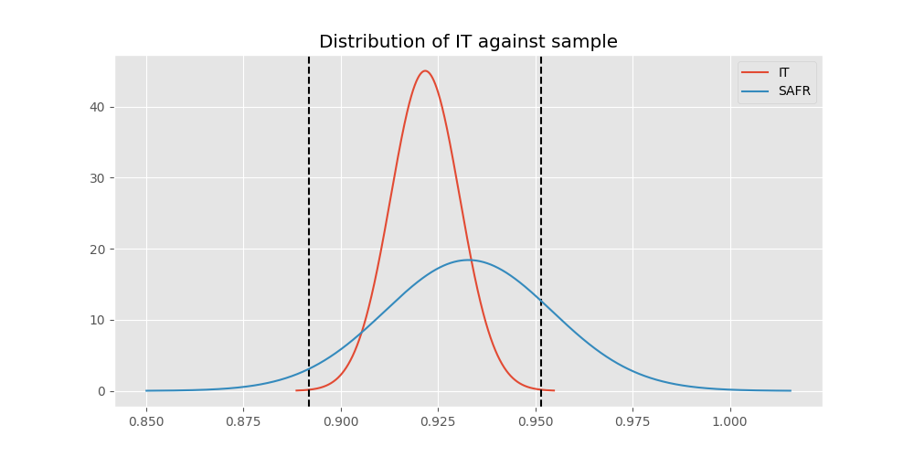 
## Testing Results for IT against TBD 
IT has a success rate of 0.9217391304347826
TBD has a success rate of 0.9898734177215189
$H_{0}$: There is not a difference between IT and TBD
$H_{A}$: There is a difference between IT and TBD
An $/alpha$ of 0.0008064516129032258 was used in this test.
__independent t-testing__: With a t-statistic of -6.683178283434494 and a p-value of 3.465623250371886e-11, _we **reject** the null hypothssis_
__Man-Whitney testing__: With a u-statistic of 169320.0 and a p-value of 1.2239435697904865e-06, _we **reject** the null hypothssis_
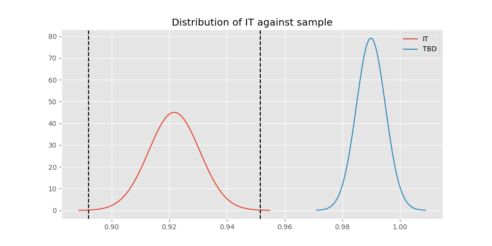 
## Testing Results for IT against ESA 
IT has a success rate of 0.9217391304347826
ESA has a success rate of 0.9811320754716981
$H_{0}$: There is not a difference between IT and ESA
$H_{A}$: There is a difference between IT and ESA
An $/alpha$ of 0.0008064516129032258 was used in this test.
__independent t-testing__: With a t-statistic of -2.2416112526442147 and a p-value of 0.025200044696326477, _we failed to reject the null hypothssis_
__Man-Whitney testing__: With a u-statistic of 45864.0 and a p-value of 0.025297002274015476, _we failed to reject the null hypothssis_
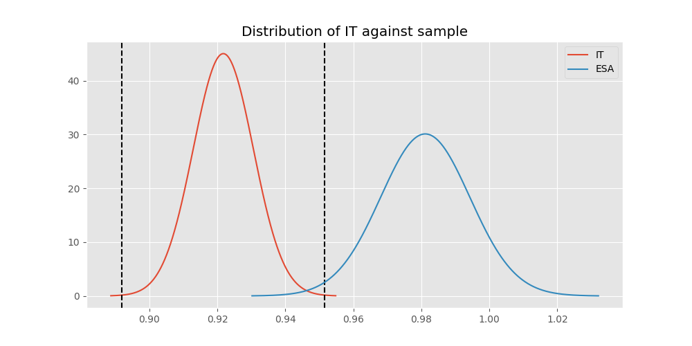 
## Testing Results for IT against UK 
IT has a success rate of 0.9217391304347826
UK has a success rate of 0.9881796690307328
$H_{0}$: There is not a difference between IT and UK
$H_{A}$: There is a difference between IT and UK
An $/alpha$ of 0.0008064516129032258 was used in this test.
__independent t-testing__: With a t-statistic of -6.914989212372925 and a p-value of 7.501585319501089e-12, _we **reject** the null hypothssis_
__Man-Whitney testing__: With a u-statistic of 363304.0 and a p-value of 3.432417769601214e-11, _we **reject** the null hypothssis_
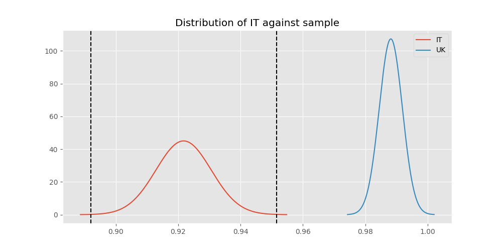 
## Testing Results for IT against GER 
IT has a success rate of 0.9217391304347826
GER has a success rate of 0.9766233766233766
$H_{0}$: There is not a difference between IT and GER
$H_{A}$: There is a difference between IT and GER
An $/alpha$ of 0.0008064516129032258 was used in this test.
__independent t-testing__: With a t-statistic of -7.329122457833136 and a p-value of 2.913409429833487e-13, _we **reject** the null hypothssis_
__Man-Whitney testing__: With a u-statistic of 1004280.0 and a p-value of 3.5960482340493356e-13, _we **reject** the null hypothssis_
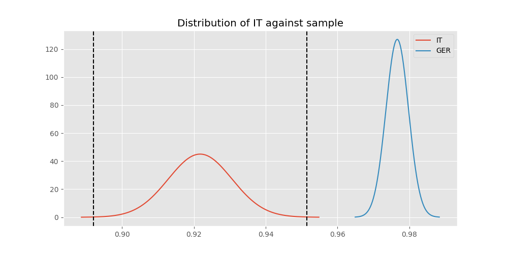 
