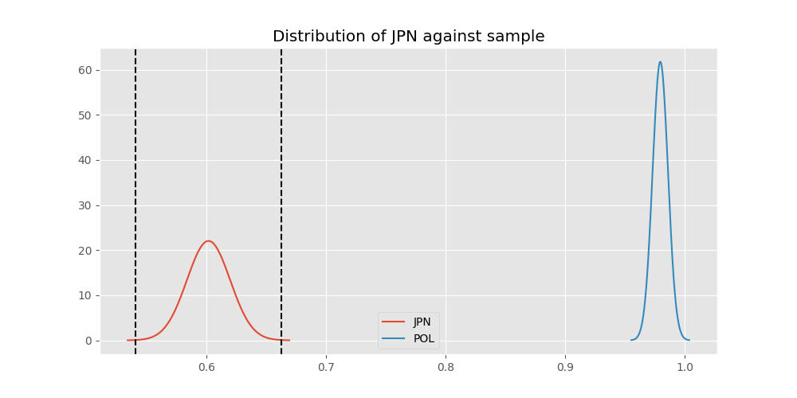
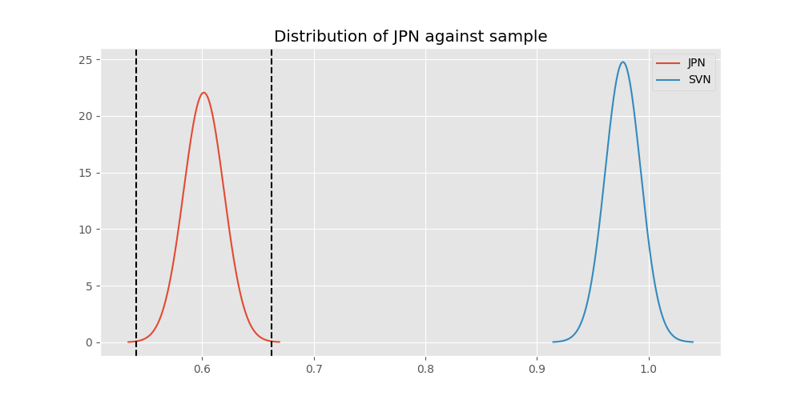
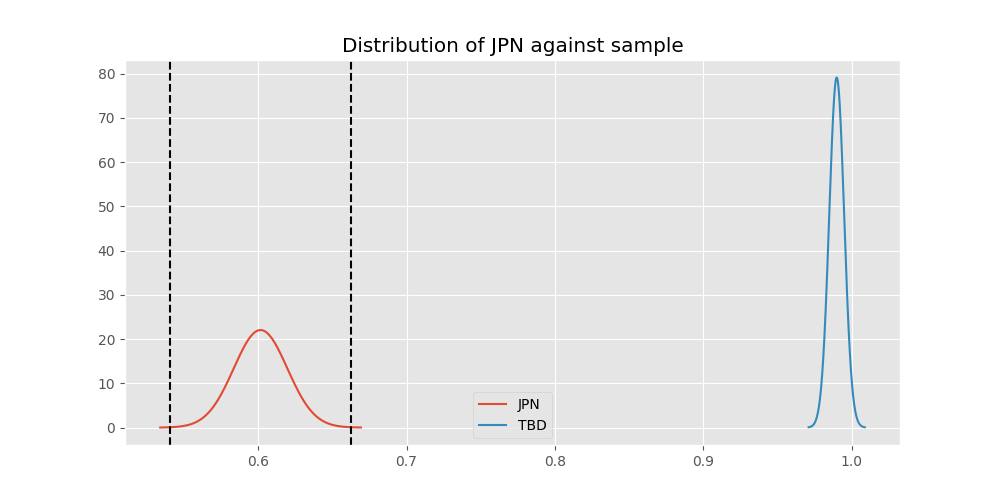

# Testing Results For JPN 
$H_{0}$: There is not a difference in collection success against JPN 
$H_{A}$: There is a difference in collection success against JPN
An $\alpha$ of 0.0008064516129032258 was used 
Out of 25 tests, there were 24 rejections from 25 independent-t test.
Out of 25 tests, there were 24 rejections from 25 Man Whitney u-tests.
## Testing Results for JPN against IND 
JPN has a success rate of 0.6016371077762619
IND has a success rate of 0.9704433497536946
$H_{0}$: There is not a difference between JPN and IND
$H_{A}$: There is a difference between JPN and IND
An $/alpha$ of 0.0008064516129032258 was used in this test.
__independent t-testing__: With a t-statistic of -18.48100932857587 and a p-value of 8.083658466390163e-66, _we **reject** the null hypothssis_
__Man-Whitney testing__: With a u-statistic of 93921.0 and a p-value of 2.316504428107598e-41, _we **reject** the null hypothssis_
 
## Testing Results for JPN against GUAT 
JPN has a success rate of 0.6016371077762619
GUAT has a success rate of 0.9705882352941176
$H_{0}$: There is not a difference between JPN and GUAT
$H_{A}$: There is a difference between JPN and GUAT
An $/alpha$ of 0.0008064516129032258 was used in this test.
__independent t-testing__: With a t-statistic of -13.440969769515075 and a p-value of 1.0109677961227702e-29, _we **reject** the null hypothssis_
__Man-Whitney testing__: With a u-statistic of 15727.0 and a p-value of 1.5976149543690298e-09, _we **reject** the null hypothssis_
 
## Testing Results for JPN against IT 
JPN has a success rate of 0.6016371077762619
IT has a success rate of 0.9217391304347826
$H_{0}$: There is not a difference between JPN and IT
$H_{A}$: There is a difference between JPN and IT
An $/alpha$ of 0.0008064516129032258 was used in this test.
__independent t-testing__: With a t-statistic of -16.885928218841443 and a p-value of 3.9116162344302803e-59, _we **reject** the null hypothssis_
__Man-Whitney testing__: With a u-statistic of 229248.0 and a p-value of 7.548055792778898e-55, _we **reject** the null hypothssis_
 
## Testing Results for JPN against EST 
JPN has a success rate of 0.6016371077762619
EST has a success rate of 0.975
$H_{0}$: There is not a difference between JPN and EST
$H_{A}$: There is a difference between JPN and EST
An $/alpha$ of 0.0008064516129032258 was used in this test.
__independent t-testing__: With a t-statistic of -12.09810582266342 and a p-value of 1.6277923024972495e-20, _we **reject** the null hypothssis_
__Man-Whitney testing__: With a u-statistic of 9186.5 and a p-value of 2.1779023634205126e-06, _we **reject** the null hypothssis_
 
## Testing Results for JPN against SKOR 
JPN has a success rate of 0.6016371077762619
SKOR has a success rate of 0.9166666666666666
$H_{0}$: There is not a difference between JPN and SKOR
$H_{A}$: There is a difference between JPN and SKOR
An $/alpha$ of 0.0008064516129032258 was used in this test.
__independent t-testing__: With a t-statistic of -4.914498800791853 and a p-value of 1.0822864392906384e-06, _we **reject** the null hypothssis_
__Man-Whitney testing__: With a u-statistic of 15062.5 and a p-value of 1.2734413429259224e-06, _we **reject** the null hypothssis_
 
## Testing Results for JPN against RP 
JPN has a success rate of 0.6016371077762619
RP has a success rate of 0.6735187424425635
$H_{0}$: There is not a difference between JPN and RP
$H_{A}$: There is a difference between JPN and RP
An $/alpha$ of 0.0008064516129032258 was used in this test.
__independent t-testing__: With a t-statistic of -2.957937725898757 and a p-value of 0.003143720085633095, _we failed to reject the null hypothssis_
__Man-Whitney testing__: With a u-statistic of 281308.5 and a p-value of 0.0031721308855370287, _we failed to reject the null hypothssis_
 
## Testing Results for JPN against US 
JPN has a success rate of 0.6016371077762619
US has a success rate of 0.918885774351787
$H_{0}$: There is not a difference between JPN and US
$H_{A}$: There is a difference between JPN and US
An $/alpha$ of 0.0008064516129032258 was used in this test.
__independent t-testing__: With a t-statistic of -26.463359262059626 and a p-value of 1.3991189856098773e-146, _we **reject** the null hypothssis_
__Man-Whitney testing__: With a u-statistic of 1428303.5 and a p-value of 2.120957264162862e-139, _we **reject** the null hypothssis_
 
## Testing Results for JPN against KAZ 
JPN has a success rate of 0.6016371077762619
KAZ has a success rate of 0.989010989010989
$H_{0}$: There is not a difference between JPN and KAZ
$H_{A}$: There is a difference between JPN and KAZ
An $/alpha$ of 0.0008064516129032258 was used in this test.
__independent t-testing__: With a t-statistic of -19.67954000192521 and a p-value of 5.135618665311655e-72, _we **reject** the null hypothssis_
__Man-Whitney testing__: With a u-statistic of 40864.0 and a p-value of 1.3681957259501688e-23, _we **reject** the null hypothssis_
 
## Testing Results for JPN against ROC 
JPN has a success rate of 0.6016371077762619
ROC has a success rate of 0.17751479289940827
$H_{0}$: There is not a difference between JPN and ROC
$H_{A}$: There is a difference between JPN and ROC
An $/alpha$ of 0.0008064516129032258 was used in this test.
__independent t-testing__: With a t-statistic of 10.534331149036287 and a p-value of 1.5036129184857482e-24, _we **reject** the null hypothssis_
__Man-Whitney testing__: With a u-statistic of 88208.0 and a p-value of 2.65985405072133e-23, _we **reject** the null hypothssis_
 
## Testing Results for JPN against THAI 
JPN has a success rate of 0.6016371077762619
THAI has a success rate of 0.9880952380952381
$H_{0}$: There is not a difference between JPN and THAI
$H_{A}$: There is a difference between JPN and THAI
An $/alpha$ of 0.0008064516129032258 was used in this test.
__independent t-testing__: With a t-statistic of -19.37491926752151 and a p-value of 3.7716100435160636e-70, _we **reject** the null hypothssis_
__Man-Whitney testing__: With a u-statistic of 37777.0 and a p-value of 5.938364967613091e-22, _we **reject** the null hypothssis_
 
## Testing Results for JPN against FR 
JPN has a success rate of 0.6016371077762619
FR has a success rate of 0.908183632734531
$H_{0}$: There is not a difference between JPN and FR
$H_{A}$: There is a difference between JPN and FR
An $/alpha$ of 0.0008064516129032258 was used in this test.
__independent t-testing__: With a t-statistic of -12.587249459490208 and a p-value of 2.8848711921935292e-34, _we **reject** the null hypothssis_
__Man-Whitney testing__: With a u-statistic of 127329.5 and a p-value of 2.073325162893984e-32, _we **reject** the null hypothssis_
 
## Testing Results for JPN against TURK 
JPN has a success rate of 0.6016371077762619
TURK has a success rate of 0.9962264150943396
$H_{0}$: There is not a difference between JPN and TURK
$H_{A}$: There is a difference between JPN and TURK
An $/alpha$ of 0.0008064516129032258 was used in this test.
__independent t-testing__: With a t-statistic of -21.347627641137912 and a p-value of 3.0573404423532042e-80, _we **reject** the null hypothssis_
__Man-Whitney testing__: With a u-statistic of 58799.0 and a p-value of 1.317070557950771e-33, _we **reject** the null hypothssis_
 
## Testing Results for JPN against PRC 
JPN has a success rate of 0.6016371077762619
PRC has a success rate of 0.988759187202767
$H_{0}$: There is not a difference between JPN and PRC
$H_{A}$: There is a difference between JPN and PRC
An $/alpha$ of 0.0008064516129032258 was used in this test.
__independent t-testing__: With a t-statistic of -21.23888268178168 and a p-value of 8.098418824582894e-79, _we **reject** the null hypothssis_
__Man-Whitney testing__: With a u-statistic of 519545.5 and a p-value of 5.812488939037513e-196, _we **reject** the null hypothssis_
 
## Testing Results for JPN against BEL 
JPN has a success rate of 0.6016371077762619
BEL has a success rate of 0.8883495145631068
$H_{0}$: There is not a difference between JPN and BEL
$H_{A}$: There is a difference between JPN and BEL
An $/alpha$ of 0.0008064516129032258 was used in this test.
__independent t-testing__: With a t-statistic of -7.947291284567103 and a p-value of 5.454063354603992e-15, _we **reject** the null hypothssis_
__Man-Whitney testing__: With a u-statistic of 53852.5 and a p-value of 1.4018100782819819e-14, _we **reject** the null hypothssis_
 
## Testing Results for JPN against POL 
JPN has a success rate of 0.6016371077762619
POL has a success rate of 0.979381443298969
$H_{0}$: There is not a difference between JPN and POL
$H_{A}$: There is a difference between JPN and POL
An $/alpha$ of 0.0008064516129032258 was used in this test.
__independent t-testing__: With a t-statistic of -19.660859005216945 and a p-value of 5.64361045444552e-72, _we **reject** the null hypothssis_
__Man-Whitney testing__: With a u-statistic of 110607.5 and a p-value of 1.8464904061588767e-50, _we **reject** the null hypothssis_
 
## Testing Results for JPN against LTU 
JPN has a success rate of 0.6016371077762619
LTU has a success rate of 0.984375
$H_{0}$: There is not a difference between JPN and LTU
$H_{A}$: There is a difference between JPN and LTU
An $/alpha$ of 0.0008064516129032258 was used in this test.
__independent t-testing__: With a t-statistic of -19.747819798745034 and a p-value of 1.288364821535063e-72, _we **reject** the null hypothssis_
__Man-Whitney testing__: With a u-statistic of 72392.5 and a p-value of 6.894452952464775e-37, _we **reject** the null hypothssis_
 
## Testing Results for JPN against SVN 
JPN has a success rate of 0.6016371077762619
SVN has a success rate of 0.9770114942528736
$H_{0}$: There is not a difference between JPN and SVN
$H_{A}$: There is a difference between JPN and SVN
An $/alpha$ of 0.0008064516129032258 was used in this test.
__independent t-testing__: With a t-statistic of -15.47253540471759 and a p-value of 5.741410378710938e-42, _we **reject** the null hypothssis_
__Man-Whitney testing__: With a u-statistic of 19916.5 and a p-value of 5.267888567793956e-12, _we **reject** the null hypothssis_
 
## Testing Results for JPN against AUS 
JPN has a success rate of 0.6016371077762619
AUS has a success rate of 0.7289377289377289
$H_{0}$: There is not a difference between JPN and AUS
$H_{A}$: There is a difference between JPN and AUS
An $/alpha$ of 0.0008064516129032258 was used in this test.
__independent t-testing__: With a t-statistic of -3.7542862674191877 and a p-value of 0.0001838161055176484, _we **reject** the null hypothssis_
__Man-Whitney testing__: With a u-statistic of 87317.5 and a p-value of 0.00019154208565678164, _we **reject** the null hypothssis_
 
## Testing Results for JPN against UKR 
JPN has a success rate of 0.6016371077762619
UKR has a success rate of 0.981549815498155
$H_{0}$: There is not a difference between JPN and UKR
$H_{A}$: There is a difference between JPN and UKR
An $/alpha$ of 0.0008064516129032258 was used in this test.
__independent t-testing__: With a t-statistic of -19.127807667887517 and a p-value of 2.750463358588918e-69, _we **reject** the null hypothssis_
__Man-Whitney testing__: With a u-statistic of 61588.0 and a p-value of 1.2380870255254619e-31, _we **reject** the null hypothssis_
 
## Testing Results for JPN against CIS 
JPN has a success rate of 0.6016371077762619
CIS has a success rate of 0.837386018237082
$H_{0}$: There is not a difference between JPN and CIS
$H_{A}$: There is a difference between JPN and CIS
An $/alpha$ of 0.0008064516129032258 was used in this test.
__independent t-testing__: With a t-statistic of -10.045031225768561 and a p-value of 5.747706962513184e-23, _we **reject** the null hypothssis_
__Man-Whitney testing__: With a u-statistic of 184304.5 and a p-value of 2.9469827520376585e-22, _we **reject** the null hypothssis_
 
## Testing Results for JPN against SAFR 
JPN has a success rate of 0.6016371077762619
SAFR has a success rate of 0.9328358208955224
$H_{0}$: There is not a difference between JPN and SAFR
$H_{A}$: There is a difference between JPN and SAFR
An $/alpha$ of 0.0008064516129032258 was used in this test.
__independent t-testing__: With a t-statistic of -7.64180284379652 and a p-value of 5.6833537718544813e-14, _we **reject** the null hypothssis_
__Man-Whitney testing__: With a u-statistic of 32845.5 and a p-value of 1.3591495517027263e-13, _we **reject** the null hypothssis_
 
## Testing Results for JPN against TBD 
JPN has a success rate of 0.6016371077762619
TBD has a success rate of 0.9898734177215189
$H_{0}$: There is not a difference between JPN and TBD
$H_{A}$: There is a difference between JPN and TBD
An $/alpha$ of 0.0008064516129032258 was used in this test.
__independent t-testing__: With a t-statistic of -20.667844150877418 and a p-value of 4.686330274125044e-77, _we **reject** the null hypothssis_
__Man-Whitney testing__: With a u-statistic of 88563.5 and a p-value of 2.4190639259269883e-45, _we **reject** the null hypothssis_
 
## Testing Results for JPN against ESA 
JPN has a success rate of 0.6016371077762619
ESA has a success rate of 0.9811320754716981
$H_{0}$: There is not a difference between JPN and ESA
$H_{A}$: There is a difference between JPN and ESA
An $/alpha$ of 0.0008064516129032258 was used in this test.
__independent t-testing__: With a t-statistic of -16.908714182903758 and a p-value of 2.4502471151941124e-52, _we **reject** the null hypothssis_
__Man-Whitney testing__: With a u-statistic of 24106.0 and a p-value of 2.013962713668911e-14, _we **reject** the null hypothssis_
 
## Testing Results for JPN against UK 
JPN has a success rate of 0.6016371077762619
UK has a success rate of 0.9881796690307328
$H_{0}$: There is not a difference between JPN and UK
$H_{A}$: There is a difference between JPN and UK
An $/alpha$ of 0.0008064516129032258 was used in this test.
__independent t-testing__: With a t-statistic of -20.925057119966567 and a p-value of 8.98965826220656e-78, _we **reject** the null hypothssis_
__Man-Whitney testing__: With a u-statistic of 190208.0 and a p-value of 1.936272798403053e-84, _we **reject** the null hypothssis_
 
## Testing Results for JPN against GER 
JPN has a success rate of 0.6016371077762619
GER has a success rate of 0.9766233766233766
$H_{0}$: There is not a difference between JPN and GER
$H_{A}$: There is a difference between JPN and GER
An $/alpha$ of 0.0008064516129032258 was used in this test.
__independent t-testing__: With a t-statistic of -20.417555490084165 and a p-value of 1.6593729618190647e-74, _we **reject** the null hypothssis_
__Man-Whitney testing__: With a u-statistic of 529146.0 and a p-value of 8.257934092399759e-171, _we **reject** the null hypothssis_
 
