# Testing Results For KAZ 
$H_{0}$: There is not a difference in collection success against KAZ 
$H_{A}$: There is a difference in collection success against KAZ
An $\alpha$ of 0.0008064516129032258 was used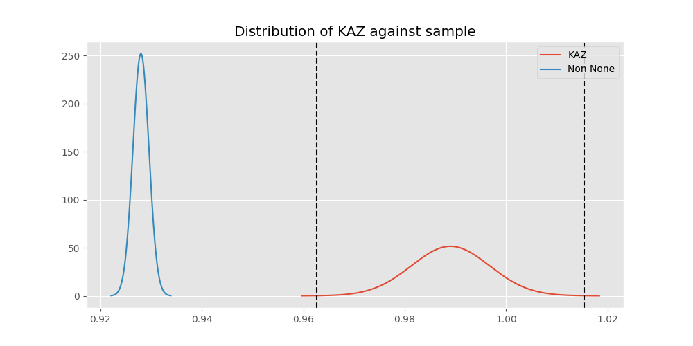 
Out of 25 tests, there were 8 rejections from 25 independent-t test.
Out of 25 tests, there were 8 rejections from 25 Man Whitney u-tests.
## Testing Results for KAZ against IND 
KAZ has a success rate of 0.989010989010989
IND has a success rate of 0.9704433497536946
$H_{0}$: There is not a difference between KAZ and IND
$H_{A}$: There is a difference between KAZ and IND
An $/alpha$ of 0.0008064516129032258 was used in this test.
__independent t-testing__: With a t-statistic of 1.365129064377848 and a p-value of 0.17273634058977458, _we failed to reject the null hypothssis_
__Man-Whitney testing__: With a u-statistic of 37632.0 and a p-value of 0.17284099490812344, _we failed to reject the null hypothssis_
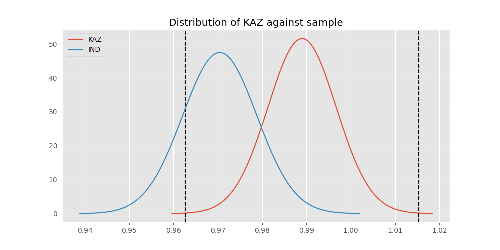 
## Testing Results for KAZ against GUAT 
KAZ has a success rate of 0.989010989010989
GUAT has a success rate of 0.9705882352941176
$H_{0}$: There is not a difference between KAZ and GUAT
$H_{A}$: There is a difference between KAZ and GUAT
An $/alpha$ of 0.0008064516129032258 was used in this test.
__independent t-testing__: With a t-statistic of 1.0311026557955925 and a p-value of 0.30349719178573387, _we failed to reject the null hypothssis_
__Man-Whitney testing__: With a u-statistic of 6302.0 and a p-value of 0.30467948445135906, _we failed to reject the null hypothssis_
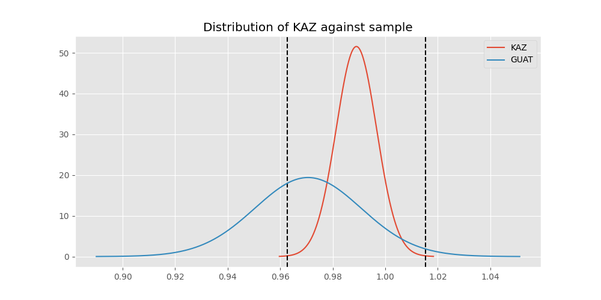 
## Testing Results for KAZ against IT 
KAZ has a success rate of 0.989010989010989
IT has a success rate of 0.9217391304347826
$H_{0}$: There is not a difference between KAZ and IT
$H_{A}$: There is a difference between KAZ and IT
An $/alpha$ of 0.0008064516129032258 was used in this test.
__independent t-testing__: With a t-statistic of 3.3267548562632276 and a p-value of 0.0009076876400542403, _we failed to reject the null hypothssis_
__Man-Whitney testing__: With a u-statistic of 89352.0 and a p-value of 0.0009284540295501323, _we failed to reject the null hypothssis_
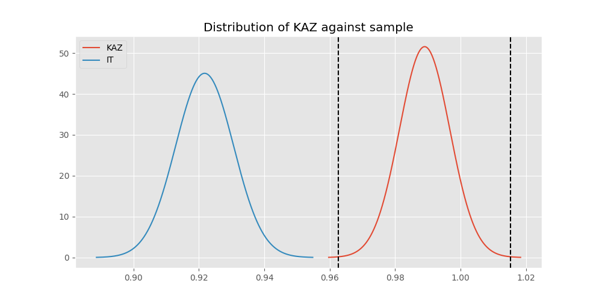 
## Testing Results for KAZ against EST 
KAZ has a success rate of 0.989010989010989
EST has a success rate of 0.975
$H_{0}$: There is not a difference between KAZ and EST
$H_{A}$: There is a difference between KAZ and EST
An $/alpha$ of 0.0008064516129032258 was used in this test.
__independent t-testing__: With a t-statistic of 0.6925258606339366 and a p-value of 0.4893374845361429, _we failed to reject the null hypothssis_
__Man-Whitney testing__: With a u-statistic of 3691.0 and a p-value of 0.4923693705131994, _we failed to reject the null hypothssis_
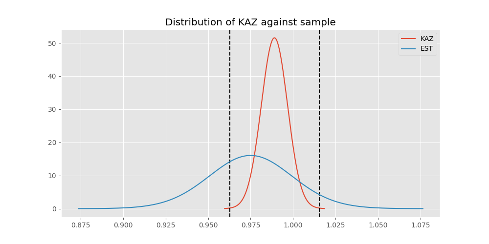 
## Testing Results for KAZ against SKOR 
KAZ has a success rate of 0.989010989010989
SKOR has a success rate of 0.9166666666666666
$H_{0}$: There is not a difference between KAZ and SKOR
$H_{A}$: There is a difference between KAZ and SKOR
An $/alpha$ of 0.0008064516129032258 was used in this test.
__independent t-testing__: With a t-statistic of 2.93911738597121 and a p-value of 0.0036125574916850253, _we failed to reject the null hypothssis_
__Man-Whitney testing__: With a u-statistic of 5855.0 and a p-value of 0.0038529555863848473, _we failed to reject the null hypothssis_
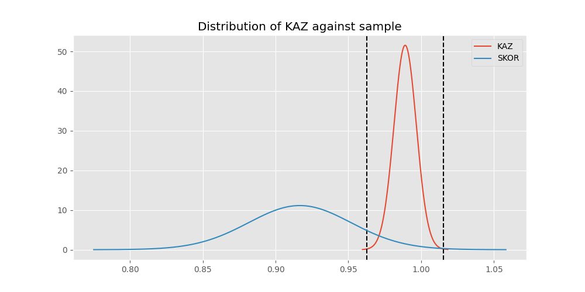 
## Testing Results for KAZ against RP 
KAZ has a success rate of 0.989010989010989
RP has a success rate of 0.6735187424425635
$H_{0}$: There is not a difference between KAZ and RP
$H_{A}$: There is a difference between KAZ and RP
An $/alpha$ of 0.0008064516129032258 was used in this test.
__independent t-testing__: With a t-statistic of 9.018625706207727 and a p-value of 9.410929182377194e-19, _we **reject** the null hypothssis_
__Man-Whitney testing__: With a u-statistic of 99000.0 and a p-value of 3.985365634371595e-18, _we **reject** the null hypothssis_
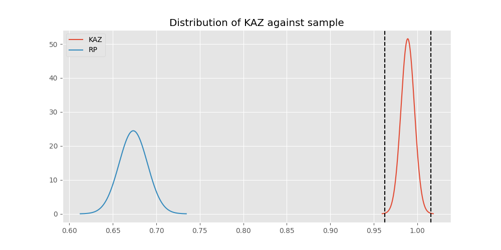 
## Testing Results for KAZ against JPN 
KAZ has a success rate of 0.989010989010989
JPN has a success rate of 0.6016371077762619
$H_{0}$: There is not a difference between KAZ and JPN
$H_{A}$: There is a difference between KAZ and JPN
An $/alpha$ of 0.0008064516129032258 was used in this test.
__independent t-testing__: With a t-statistic of 10.603588074384463 and a p-value of 7.463655705667632e-25, _we **reject** the null hypothssis_
__Man-Whitney testing__: With a u-statistic of 92542.0 and a p-value of 1.3681957259501688e-23, _we **reject** the null hypothssis_
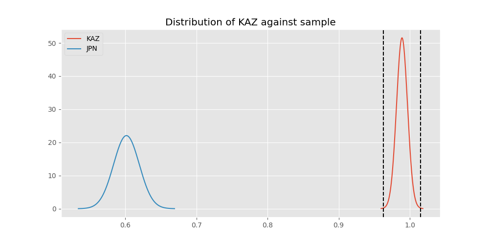 
## Testing Results for KAZ against US 
KAZ has a success rate of 0.989010989010989
US has a success rate of 0.918885774351787
$H_{0}$: There is not a difference between KAZ and US
$H_{A}$: There is a difference between KAZ and US
An $/alpha$ of 0.0008064516129032258 was used in this test.
__independent t-testing__: With a t-statistic of 3.4566040005930234 and a p-value of 0.0005508937989993605, _we **reject** the null hypothssis_
__Man-Whitney testing__: With a u-statistic of 555853.0 and a p-value of 0.0005536741895619362, _we **reject** the null hypothssis_
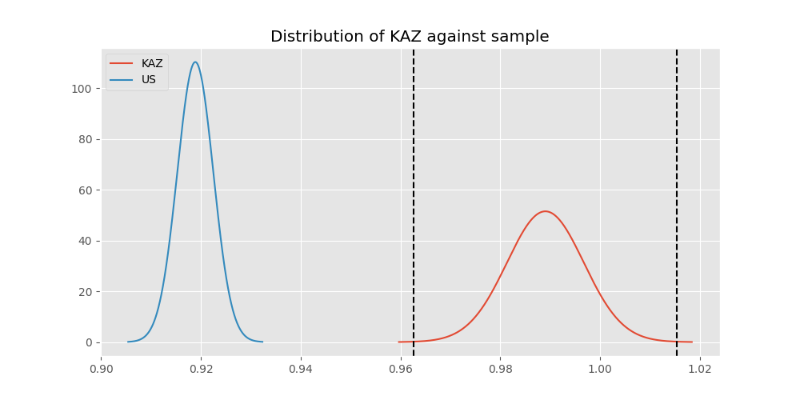 
## Testing Results for KAZ against ROC 
KAZ has a success rate of 0.989010989010989
ROC has a success rate of 0.17751479289940827
$H_{0}$: There is not a difference between KAZ and ROC
$H_{A}$: There is a difference between KAZ and ROC
An $/alpha$ of 0.0008064516129032258 was used in this test.
__independent t-testing__: With a t-statistic of 27.488755401771634 and a p-value of 2.475625779887251e-89, _we **reject** the null hypothssis_
__Man-Whitney testing__: With a u-statistic of 27859.0 and a p-value of 5.312774508385664e-54, _we **reject** the null hypothssis_
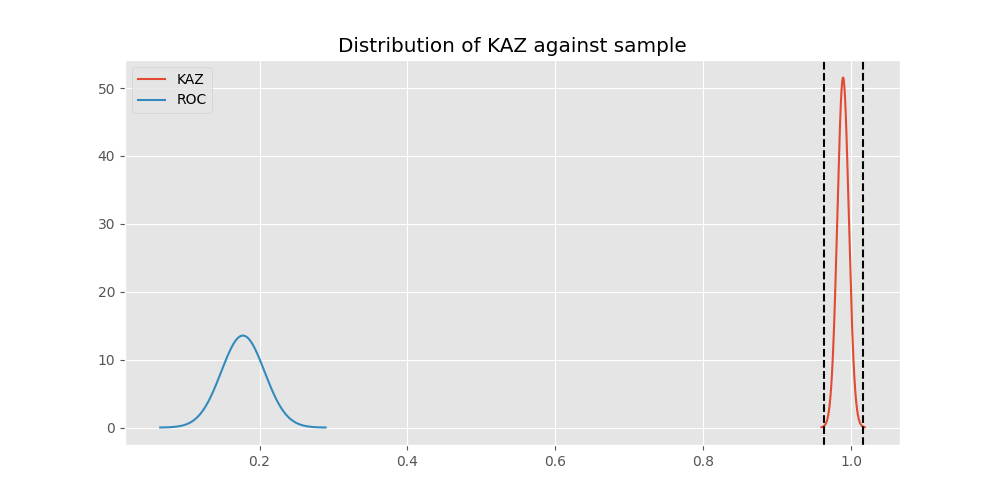 
## Testing Results for KAZ against THAI 
KAZ has a success rate of 0.989010989010989
THAI has a success rate of 0.9880952380952381
$H_{0}$: There is not a difference between KAZ and THAI
$H_{A}$: There is a difference between KAZ and THAI
An $/alpha$ of 0.0008064516129032258 was used in this test.
__independent t-testing__: With a t-statistic of 0.08029588635445108 and a p-value of 0.936048085838562, _we failed to reject the null hypothssis_
__Man-Whitney testing__: With a u-statistic of 15302.0 and a p-value of 0.9381950651058252, _we failed to reject the null hypothssis_
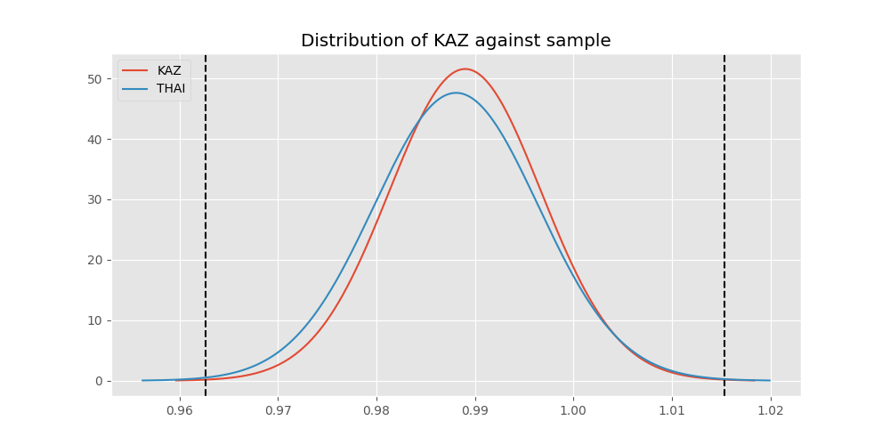 
## Testing Results for KAZ against FR 
KAZ has a success rate of 0.989010989010989
FR has a success rate of 0.908183632734531
$H_{0}$: There is not a difference between KAZ and FR
$H_{A}$: There is a difference between KAZ and FR
An $/alpha$ of 0.0008064516129032258 was used in this test.
__independent t-testing__: With a t-statistic of 3.684384323733391 and a p-value of 0.00024745856281429456, _we **reject** the null hypothssis_
__Man-Whitney testing__: With a u-statistic of 49276.0 and a p-value of 0.0002618472320283184, _we **reject** the null hypothssis_
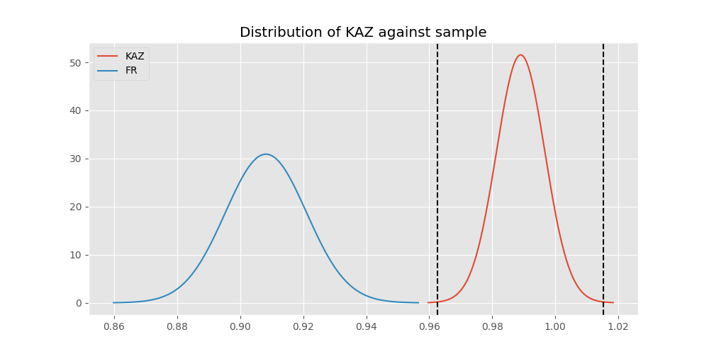 
## Testing Results for KAZ against TURK 
KAZ has a success rate of 0.989010989010989
TURK has a success rate of 0.9962264150943396
$H_{0}$: There is not a difference between KAZ and TURK
$H_{A}$: There is a difference between KAZ and TURK
An $/alpha$ of 0.0008064516129032258 was used in this test.
__independent t-testing__: With a t-statistic of -0.9167654528640253 and a p-value of 0.359762119611566, _we failed to reject the null hypothssis_
__Man-Whitney testing__: With a u-statistic of 23941.0 and a p-value of 0.36056206062847607, _we failed to reject the null hypothssis_
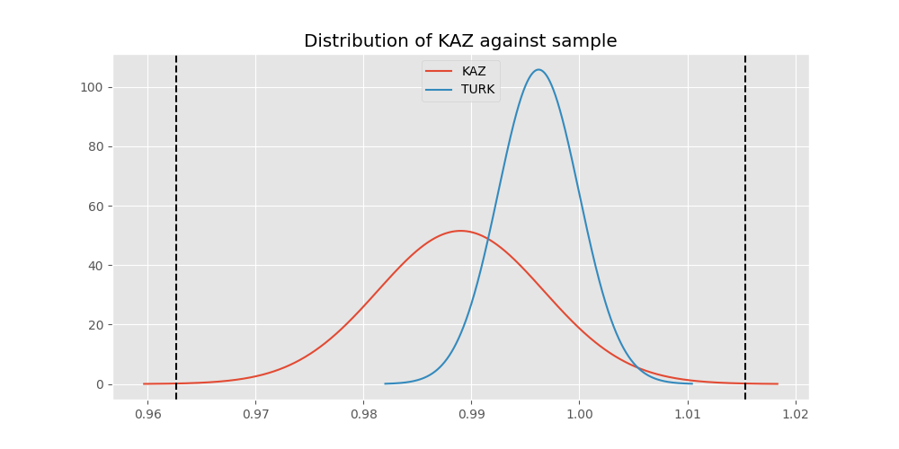 
## Testing Results for KAZ against PRC 
KAZ has a success rate of 0.989010989010989
PRC has a success rate of 0.988759187202767
$H_{0}$: There is not a difference between KAZ and PRC
$H_{A}$: There is a difference between KAZ and PRC
An $/alpha$ of 0.0008064516129032258 was used in this test.
__independent t-testing__: With a t-statistic of 0.0310370179670198 and a p-value of 0.9752425022348316, _we failed to reject the null hypothssis_
__Man-Whitney testing__: With a u-statistic of 210536.0 and a p-value of 0.9754686163297901, _we failed to reject the null hypothssis_
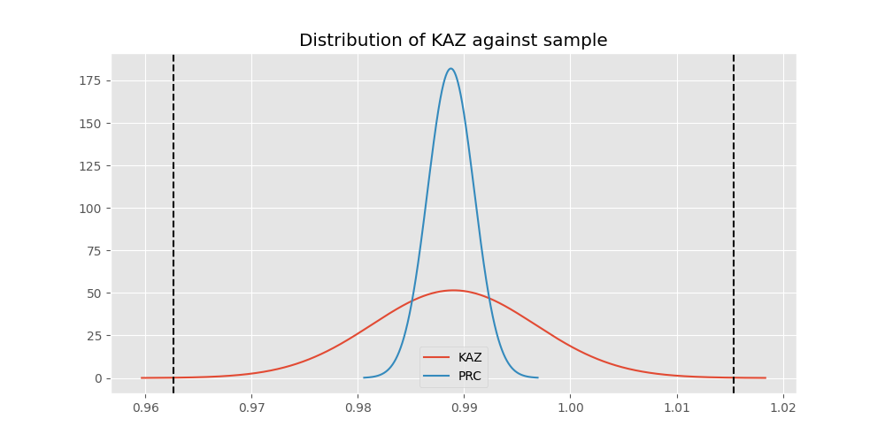 
## Testing Results for KAZ against BEL 
KAZ has a success rate of 0.989010989010989
BEL has a success rate of 0.8883495145631068
$H_{0}$: There is not a difference between KAZ and BEL
$H_{A}$: There is a difference between KAZ and BEL
An $/alpha$ of 0.0008064516129032258 was used in this test.
__independent t-testing__: With a t-statistic of 4.1066610928869665 and a p-value of 4.9027463106196596e-05, _we **reject** the null hypothssis_
__Man-Whitney testing__: With a u-statistic of 20633.0 and a p-value of 5.723662638268579e-05, _we **reject** the null hypothssis_
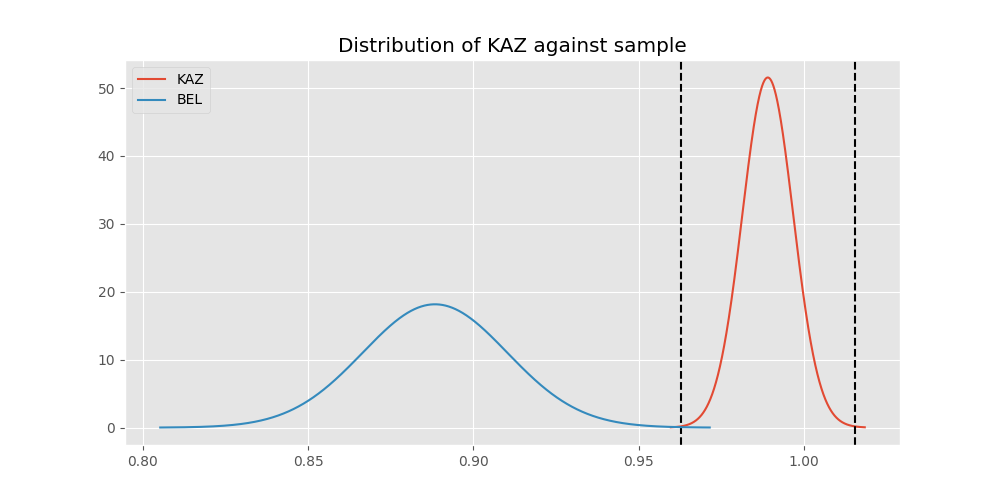 
## Testing Results for KAZ against POL 
KAZ has a success rate of 0.989010989010989
POL has a success rate of 0.979381443298969
$H_{0}$: There is not a difference between KAZ and POL
$H_{A}$: There is a difference between KAZ and POL
An $/alpha$ of 0.0008064516129032258 was used in this test.
__independent t-testing__: With a t-statistic of 0.8326033596771462 and a p-value of 0.40536737154466773, _we failed to reject the null hypothssis_
__Man-Whitney testing__: With a u-statistic of 44560.0 and a p-value of 0.40551313701125513, _we failed to reject the null hypothssis_
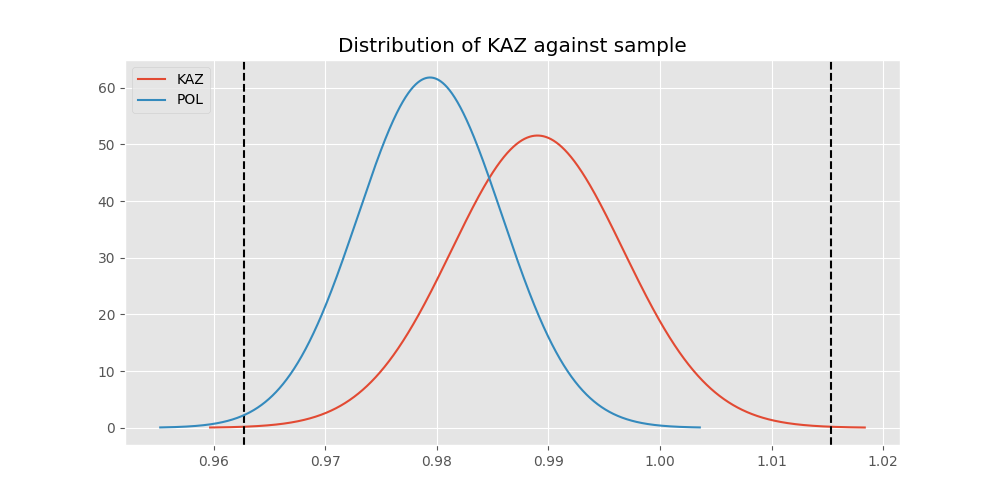 
## Testing Results for KAZ against LTU 
KAZ has a success rate of 0.989010989010989
LTU has a success rate of 0.984375
$H_{0}$: There is not a difference between KAZ and LTU
$H_{A}$: There is a difference between KAZ and LTU
An $/alpha$ of 0.0008064516129032258 was used in this test.
__independent t-testing__: With a t-statistic of 0.42507437156183525 and a p-value of 0.670965332227934, _we failed to reject the null hypothssis_
__Man-Whitney testing__: With a u-statistic of 29255.0 and a p-value of 0.6716775932725534, _we failed to reject the null hypothssis_
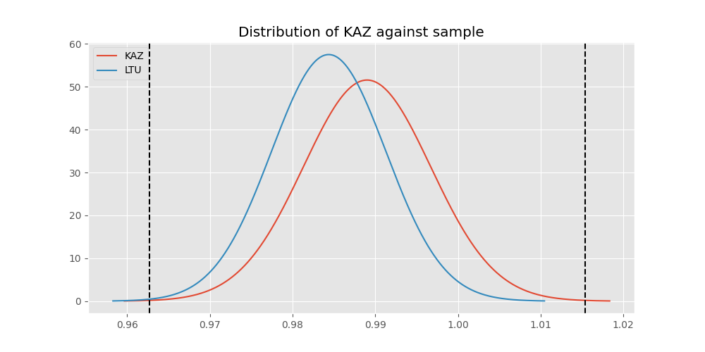 
## Testing Results for KAZ against SVN 
KAZ has a success rate of 0.989010989010989
SVN has a success rate of 0.9770114942528736
$H_{0}$: There is not a difference between KAZ and SVN
$H_{A}$: There is a difference between KAZ and SVN
An $/alpha$ of 0.0008064516129032258 was used in this test.
__independent t-testing__: With a t-statistic of 0.7586274157602008 and a p-value of 0.44874461212834904, _we failed to reject the null hypothssis_
__Man-Whitney testing__: With a u-statistic of 8012.0 and a p-value of 0.4501092019086128, _we failed to reject the null hypothssis_
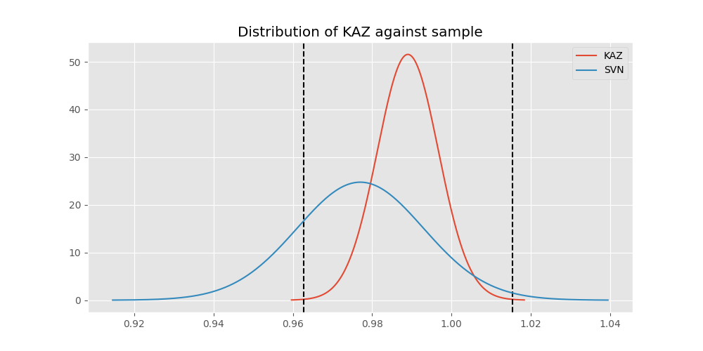 
## Testing Results for KAZ against AUS 
KAZ has a success rate of 0.989010989010989
AUS has a success rate of 0.7289377289377289
$H_{0}$: There is not a difference between KAZ and AUS
$H_{A}$: There is a difference between KAZ and AUS
An $/alpha$ of 0.0008064516129032258 was used in this test.
__independent t-testing__: With a t-statistic of 7.735258226777392 and a p-value of 6.755675902058204e-14, _we **reject** the null hypothssis_
__Man-Whitney testing__: With a u-statistic of 31304.0 and a p-value of 3.401297213487305e-13, _we **reject** the null hypothssis_
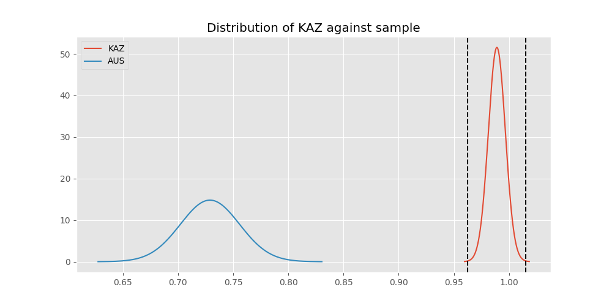 
## Testing Results for KAZ against UKR 
KAZ has a success rate of 0.989010989010989
UKR has a success rate of 0.981549815498155
$H_{0}$: There is not a difference between KAZ and UKR
$H_{A}$: There is a difference between KAZ and UKR
An $/alpha$ of 0.0008064516129032258 was used in this test.
__independent t-testing__: With a t-statistic of 0.630072260434642 and a p-value of 0.5289663970837093, _we failed to reject the null hypothssis_
__Man-Whitney testing__: With a u-statistic of 24845.0 and a p-value of 0.5294933100533011, _we failed to reject the null hypothssis_
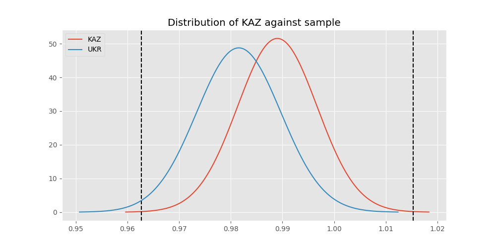 
## Testing Results for KAZ against CIS 
KAZ has a success rate of 0.989010989010989
CIS has a success rate of 0.837386018237082
$H_{0}$: There is not a difference between KAZ and CIS
$H_{A}$: There is a difference between KAZ and CIS
An $/alpha$ of 0.0008064516129032258 was used in this test.
__independent t-testing__: With a t-statistic of 5.476528941604809 and a p-value of 5.736039714532216e-08, _we **reject** the null hypothssis_
__Man-Whitney testing__: With a u-statistic of 68957.0 and a p-value of 7.285129184803175e-08, _we **reject** the null hypothssis_
 
## Testing Results for KAZ against SAFR 
KAZ has a success rate of 0.989010989010989
SAFR has a success rate of 0.9328358208955224
$H_{0}$: There is not a difference between KAZ and SAFR
$H_{A}$: There is a difference between KAZ and SAFR
An $/alpha$ of 0.0008064516129032258 was used in this test.
__independent t-testing__: With a t-statistic of 2.7151271490839823 and a p-value of 0.006991551056317203, _we failed to reject the null hypothssis_
__Man-Whitney testing__: With a u-statistic of 12879.0 and a p-value of 0.007228851470583799, _we failed to reject the null hypothssis_
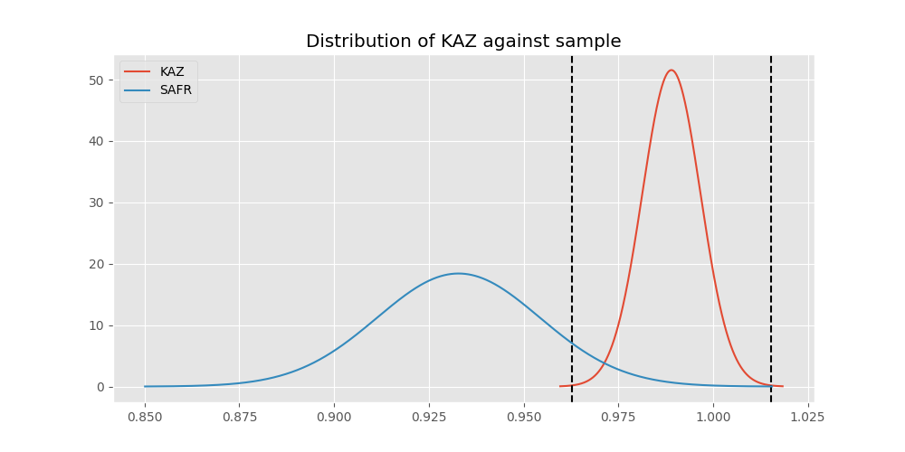 
## Testing Results for KAZ against TBD 
KAZ has a success rate of 0.989010989010989
TBD has a success rate of 0.9898734177215189
$H_{0}$: There is not a difference between KAZ and TBD
$H_{A}$: There is a difference between KAZ and TBD
An $/alpha$ of 0.0008064516129032258 was used in this test.
__independent t-testing__: With a t-statistic of -0.09473295399401913 and a p-value of 0.9245599448739414, _we failed to reject the null hypothssis_
__Man-Whitney testing__: With a u-statistic of 35914.0 and a p-value of 0.9256769197721212, _we failed to reject the null hypothssis_
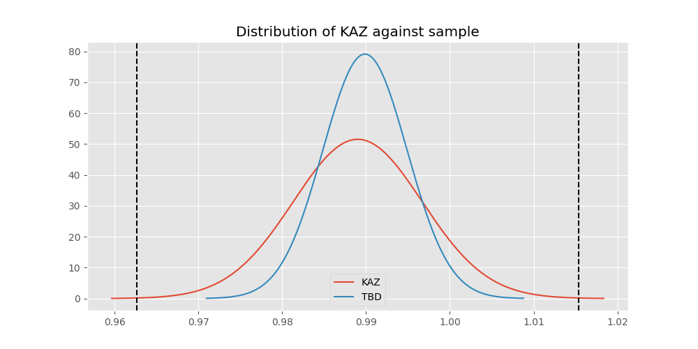 
## Testing Results for KAZ against ESA 
KAZ has a success rate of 0.989010989010989
ESA has a success rate of 0.9811320754716981
$H_{0}$: There is not a difference between KAZ and ESA
$H_{A}$: There is a difference between KAZ and ESA
An $/alpha$ of 0.0008064516129032258 was used in this test.
__independent t-testing__: With a t-statistic of 0.5493863364797461 and a p-value of 0.5831690525508639, _we failed to reject the null hypothssis_
__Man-Whitney testing__: With a u-statistic of 9722.0 and a p-value of 0.5847655780623819, _we failed to reject the null hypothssis_
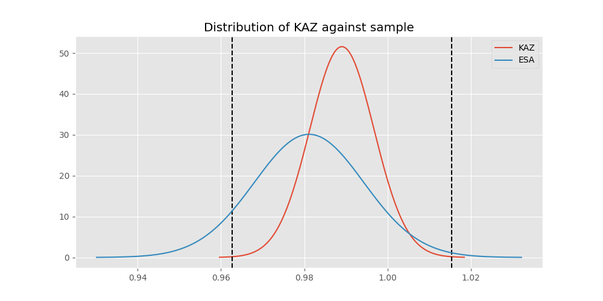 
## Testing Results for KAZ against UK 
KAZ has a success rate of 0.989010989010989
UK has a success rate of 0.9881796690307328
$H_{0}$: There is not a difference between KAZ and UK
$H_{A}$: There is a difference between KAZ and UK
An $/alpha$ of 0.0008064516129032258 was used in this test.
__independent t-testing__: With a t-statistic of 0.0946296410544959 and a p-value of 0.9246274824178002, _we failed to reject the null hypothssis_
__Man-Whitney testing__: With a u-statistic of 77050.0 and a p-value of 0.9251602494493244, _we failed to reject the null hypothssis_
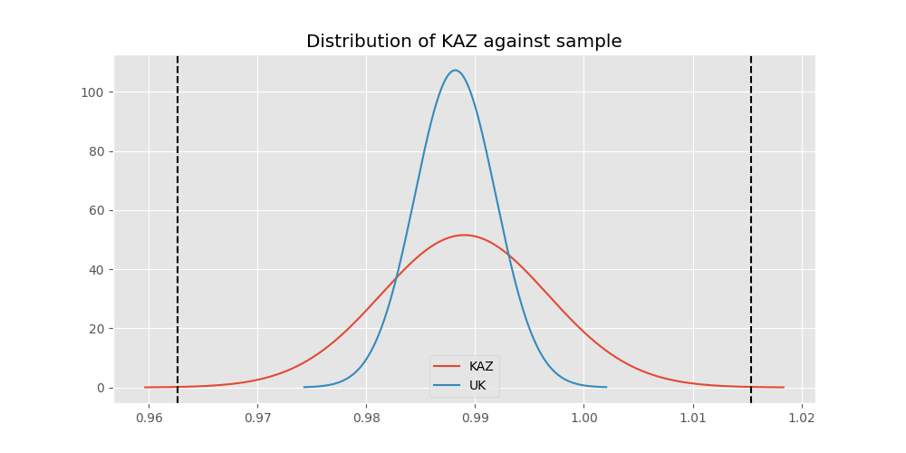 
## Testing Results for KAZ against GER 
KAZ has a success rate of 0.989010989010989
GER has a success rate of 0.9766233766233766
$H_{0}$: There is not a difference between KAZ and GER
$H_{A}$: There is a difference between KAZ and GER
An $/alpha$ of 0.0008064516129032258 was used in this test.
__independent t-testing__: With a t-statistic of 1.085423021435501 and a p-value of 0.2778394133866279, _we failed to reject the null hypothssis_
__Man-Whitney testing__: With a u-statistic of 212814.0 and a p-value of 0.2778437982788988, _we failed to reject the null hypothssis_
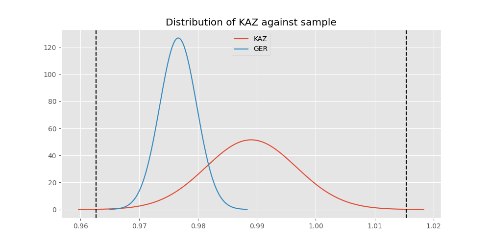 
