# Testing Results For LTU 
$H_{0}$: There is not a difference in collection success against LTU 
$H_{A}$: There is a difference in collection success against LTU
An $\alpha$ of 0.0008064516129032258 was used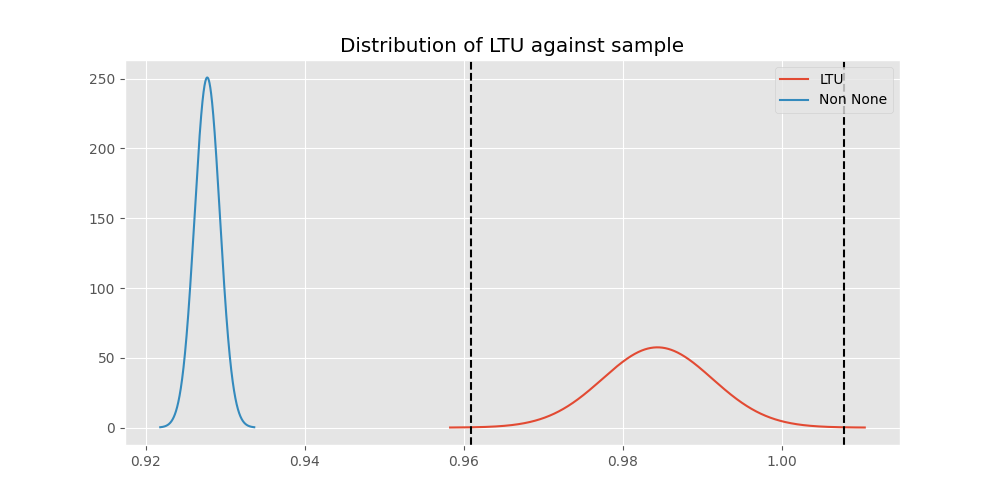 
Out of 25 tests, there were 9 rejections from 25 independent-t test.
Out of 25 tests, there were 9 rejections from 25 Man Whitney u-tests.
## Testing Results for LTU against IND 
LTU has a success rate of 0.984375
IND has a success rate of 0.9704433497536946
$H_{0}$: There is not a difference between LTU and IND
$H_{A}$: There is a difference between LTU and IND
An $/alpha$ of 0.0008064516129032258 was used in this test.
__independent t-testing__: With a t-statistic of 1.2320179832008489 and a p-value of 0.21834233851208235, _we failed to reject the null hypothssis_
__Man-Whitney testing__: With a u-statistic of 65865.0 and a p-value of 0.2183611006686722, _we failed to reject the null hypothssis_
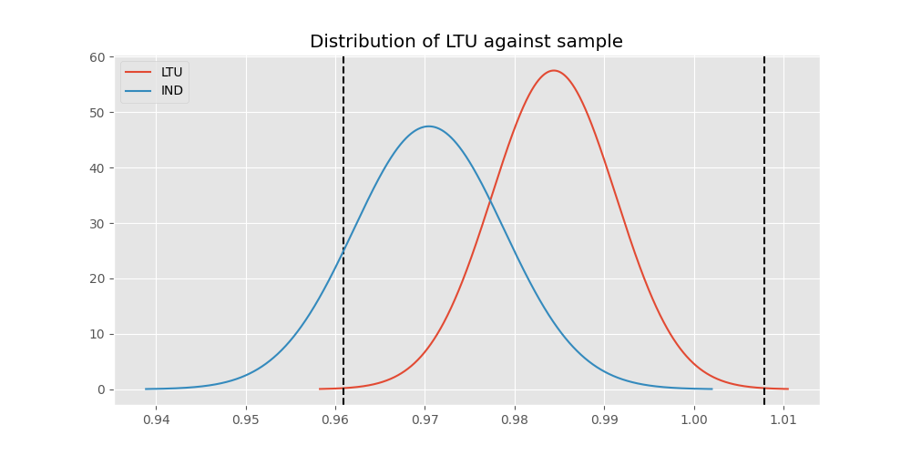 
## Testing Results for LTU against GUAT 
LTU has a success rate of 0.984375
GUAT has a success rate of 0.9705882352941176
$H_{0}$: There is not a difference between LTU and GUAT
$H_{A}$: There is a difference between LTU and GUAT
An $/alpha$ of 0.0008064516129032258 was used in this test.
__independent t-testing__: With a t-statistic of 0.7743030514228872 and a p-value of 0.43922560118707565, _we failed to reject the null hypothssis_
__Man-Whitney testing__: With a u-statistic of 11030.0 and a p-value of 0.44004239383461796, _we failed to reject the null hypothssis_
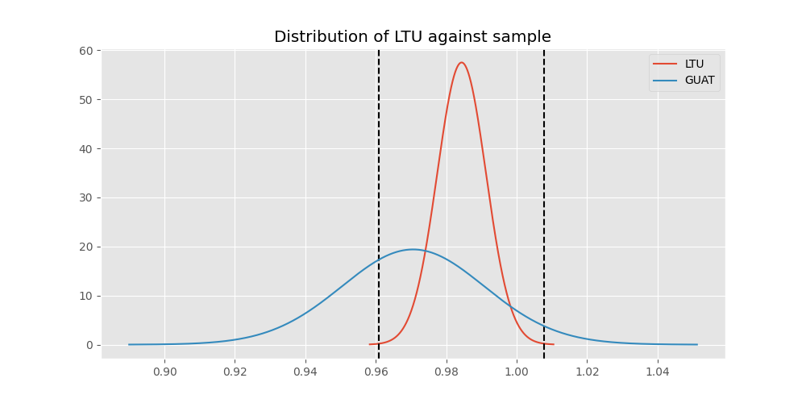 
## Testing Results for LTU against IT 
LTU has a success rate of 0.984375
IT has a success rate of 0.9217391304347826
$H_{0}$: There is not a difference between LTU and IT
$H_{A}$: There is a difference between LTU and IT
An $/alpha$ of 0.0008064516129032258 was used in this test.
__independent t-testing__: With a t-statistic of 4.021944218619191 and a p-value of 6.121183258069942e-05, _we **reject** the null hypothssis_
__Man-Whitney testing__: With a u-statistic of 156420.0 and a p-value of 6.406372571518625e-05, _we **reject** the null hypothssis_
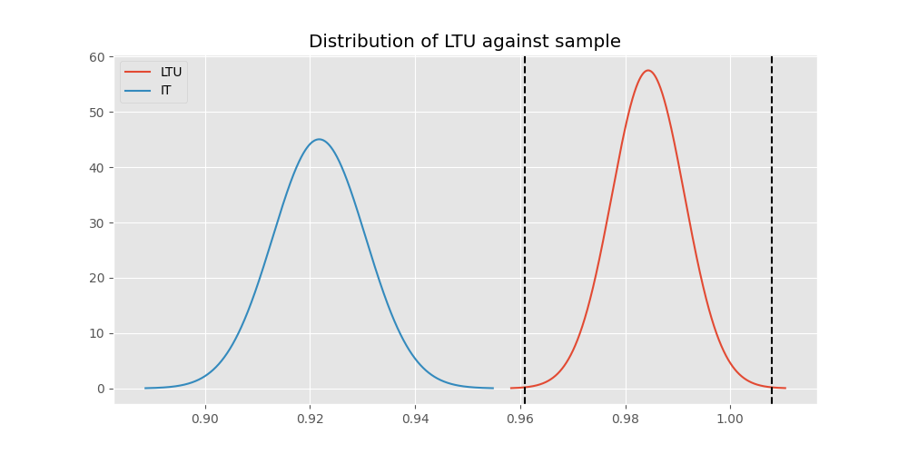 
## Testing Results for LTU against EST 
LTU has a success rate of 0.984375
EST has a success rate of 0.975
$H_{0}$: There is not a difference between LTU and EST
$H_{A}$: There is a difference between LTU and EST
An $/alpha$ of 0.0008064516129032258 was used in this test.
__independent t-testing__: With a t-statistic of 0.43556759624150465 and a p-value of 0.6634129808439229, _we failed to reject the null hypothssis_
__Man-Whitney testing__: With a u-statistic of 6460.0 and a p-value of 0.6654317188691032, _we failed to reject the null hypothssis_
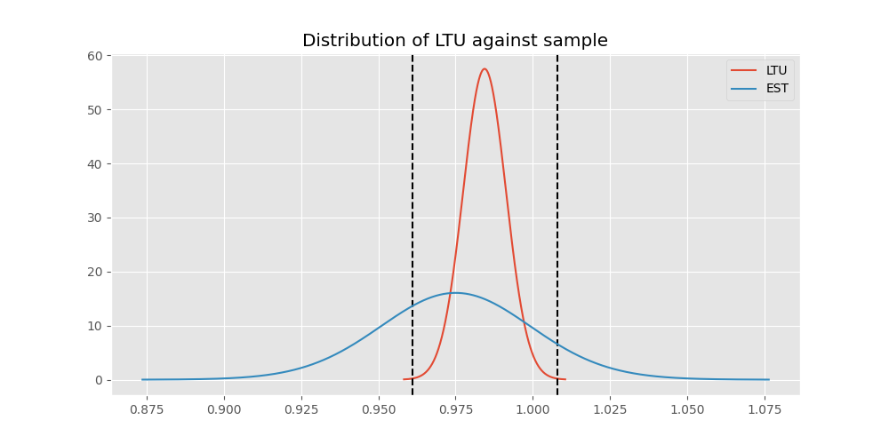 
## Testing Results for LTU against SKOR 
LTU has a success rate of 0.984375
SKOR has a success rate of 0.9166666666666666
$H_{0}$: There is not a difference between LTU and SKOR
$H_{A}$: There is a difference between LTU and SKOR
An $/alpha$ of 0.0008064516129032258 was used in this test.
__independent t-testing__: With a t-statistic of 3.035051183841291 and a p-value of 0.002571399824014427, _we failed to reject the null hypothssis_
__Man-Whitney testing__: With a u-statistic of 10250.0 and a p-value of 0.002696367523200168, _we failed to reject the null hypothssis_
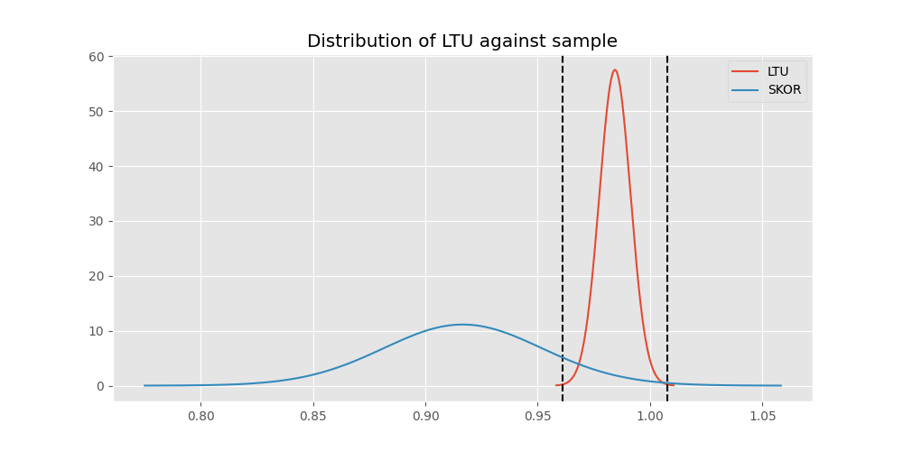 
## Testing Results for LTU against RP 
LTU has a success rate of 0.984375
RP has a success rate of 0.6735187424425635
$H_{0}$: There is not a difference between LTU and RP
$H_{A}$: There is a difference between LTU and RP
An $/alpha$ of 0.0008064516129032258 was used in this test.
__independent t-testing__: With a t-statistic of 11.691024829169763 and a p-value of 6.571546290410377e-30, _we **reject** the null hypothssis_
__Man-Whitney testing__: With a u-statistic of 173452.5 and a p-value of 2.078638097416989e-28, _we **reject** the null hypothssis_
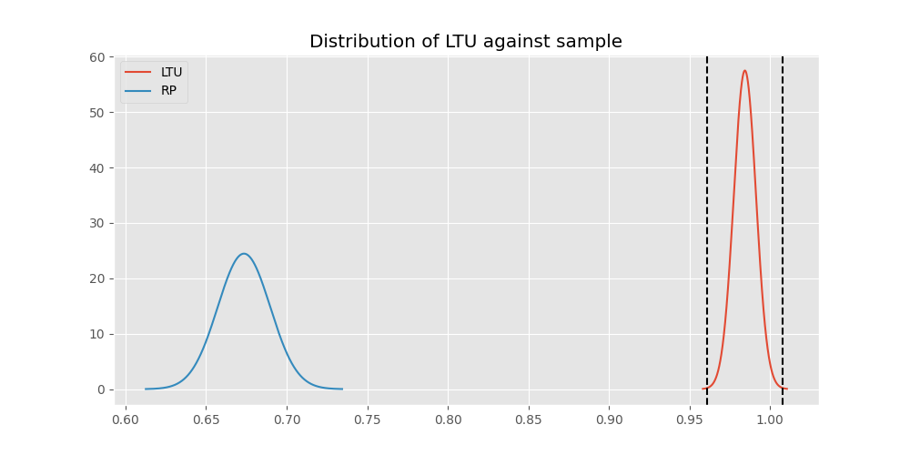 
## Testing Results for LTU against JPN 
LTU has a success rate of 0.984375
JPN has a success rate of 0.6016371077762619
$H_{0}$: There is not a difference between LTU and JPN
$H_{A}$: There is a difference between LTU and JPN
An $/alpha$ of 0.0008064516129032258 was used in this test.
__independent t-testing__: With a t-statistic of 13.780241998424057 and a p-value of 7.777613638073326e-40, _we **reject** the null hypothssis_
__Man-Whitney testing__: With a u-statistic of 162167.5 and a p-value of 6.894452952464775e-37, _we **reject** the null hypothssis_
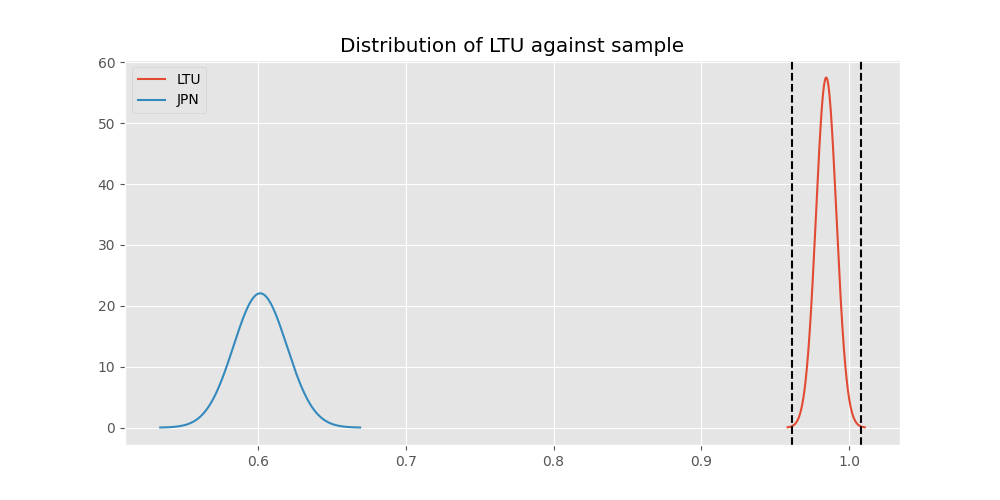 
## Testing Results for LTU against US 
LTU has a success rate of 0.984375
US has a success rate of 0.918885774351787
$H_{0}$: There is not a difference between LTU and US
$H_{A}$: There is a difference between LTU and US
An $/alpha$ of 0.0008064516129032258 was used in this test.
__independent t-testing__: With a t-statistic of 4.265753909815359 and a p-value of 2.0227736007222614e-05, _we **reject** the null hypothssis_
__Man-Whitney testing__: With a u-statistic of 973090.0 and a p-value of 2.047512712580144e-05, _we **reject** the null hypothssis_
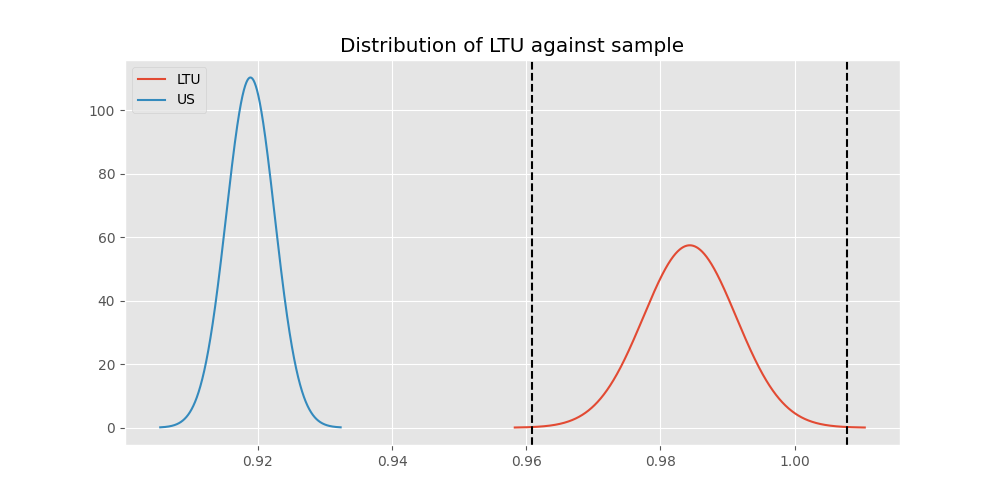 
## Testing Results for LTU against KAZ 
LTU has a success rate of 0.984375
KAZ has a success rate of 0.989010989010989
$H_{0}$: There is not a difference between LTU and KAZ
$H_{A}$: There is a difference between LTU and KAZ
An $/alpha$ of 0.0008064516129032258 was used in this test.
__independent t-testing__: With a t-statistic of -0.42507437156183525 and a p-value of 0.670965332227934, _we failed to reject the null hypothssis_
__Man-Whitney testing__: With a u-statistic of 28985.0 and a p-value of 0.6716775932725534, _we failed to reject the null hypothssis_
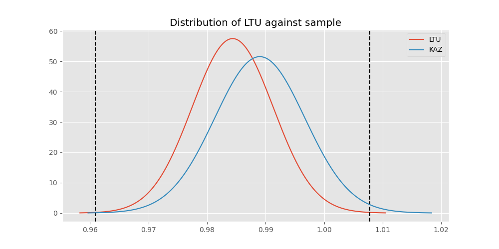 
## Testing Results for LTU against ROC 
LTU has a success rate of 0.984375
ROC has a success rate of 0.17751479289940827
$H_{0}$: There is not a difference between LTU and ROC
$H_{A}$: There is a difference between LTU and ROC
An $/alpha$ of 0.0008064516129032258 was used in this test.
__independent t-testing__: With a t-statistic of 34.419694929757945 and a p-value of 1.6055876048295055e-132, _we **reject** the null hypothssis_
__Man-Whitney testing__: With a u-statistic of 48857.5 and a p-value of 3.4446820136198523e-77, _we **reject** the null hypothssis_
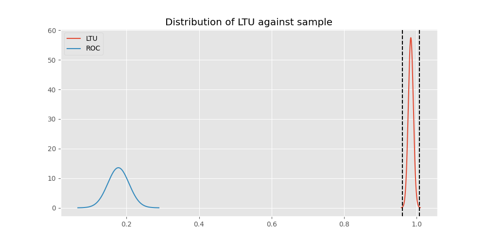 
## Testing Results for LTU against THAI 
LTU has a success rate of 0.984375
THAI has a success rate of 0.9880952380952381
$H_{0}$: There is not a difference between LTU and THAI
$H_{A}$: There is a difference between LTU and THAI
An $/alpha$ of 0.0008064516129032258 was used in this test.
__independent t-testing__: With a t-statistic of -0.32775168498333435 and a p-value of 0.7432405620459179, _we failed to reject the null hypothssis_
__Man-Whitney testing__: With a u-statistic of 26780.0 and a p-value of 0.7441125161564671, _we failed to reject the null hypothssis_
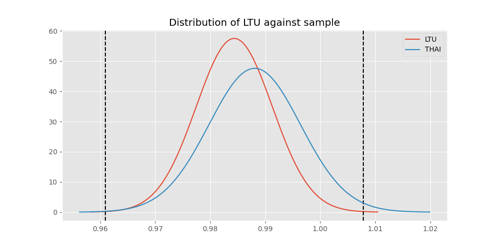 
## Testing Results for LTU against FR 
LTU has a success rate of 0.984375
FR has a success rate of 0.908183632734531
$H_{0}$: There is not a difference between LTU and FR
$H_{A}$: There is a difference between LTU and FR
An $/alpha$ of 0.0008064516129032258 was used in this test.
__independent t-testing__: With a t-statistic of 4.45881397172047 and a p-value of 9.390376650095595e-06, _we **reject** the null hypothssis_
__Man-Whitney testing__: With a u-statistic of 86267.5 and a p-value of 1.0433466170250747e-05, _we **reject** the null hypothssis_
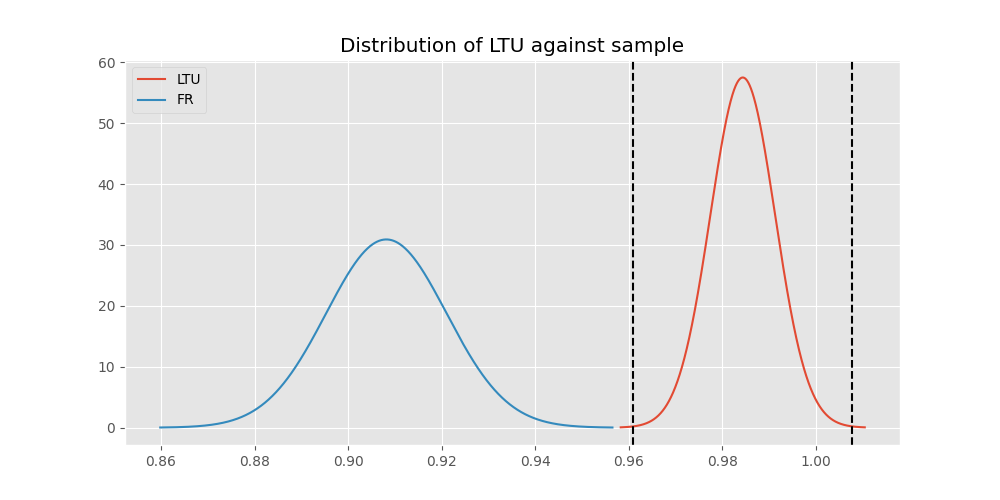 
## Testing Results for LTU against TURK 
LTU has a success rate of 0.984375
TURK has a success rate of 0.9962264150943396
$H_{0}$: There is not a difference between LTU and TURK
$H_{A}$: There is a difference between LTU and TURK
An $/alpha$ of 0.0008064516129032258 was used in this test.
__independent t-testing__: With a t-statistic of -1.4996289325403676 and a p-value of 0.13436223920027565, _we failed to reject the null hypothssis_
__Man-Whitney testing__: With a u-statistic of 41897.5 and a p-value of 0.1574786481648468, _we failed to reject the null hypothssis_
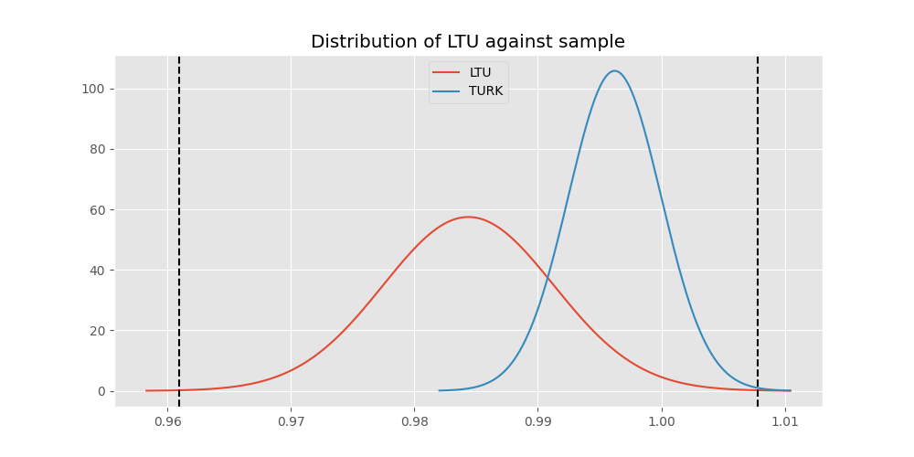 
## Testing Results for LTU against PRC 
LTU has a success rate of 0.984375
PRC has a success rate of 0.988759187202767
$H_{0}$: There is not a difference between LTU and PRC
$H_{A}$: There is a difference between LTU and PRC
An $/alpha$ of 0.0008064516129032258 was used in this test.
__independent t-testing__: With a t-statistic of -0.6812650807926846 and a p-value of 0.4957637312498092, _we failed to reject the null hypothssis_
__Man-Whitney testing__: With a u-statistic of 368457.5 and a p-value of 0.4957927283367223, _we failed to reject the null hypothssis_
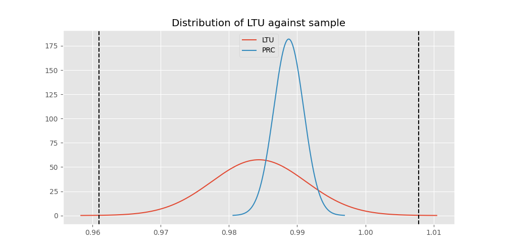 
## Testing Results for LTU against BEL 
LTU has a success rate of 0.984375
BEL has a success rate of 0.8883495145631068
$H_{0}$: There is not a difference between LTU and BEL
$H_{A}$: There is a difference between LTU and BEL
An $/alpha$ of 0.0008064516129032258 was used in this test.
__independent t-testing__: With a t-statistic of 4.8870341863195135 and a p-value of 1.3626876361098828e-06, _we **reject** the null hypothssis_
__Man-Whitney testing__: With a u-statistic of 36125.0 and a p-value of 1.7258381199571508e-06, _we **reject** the null hypothssis_
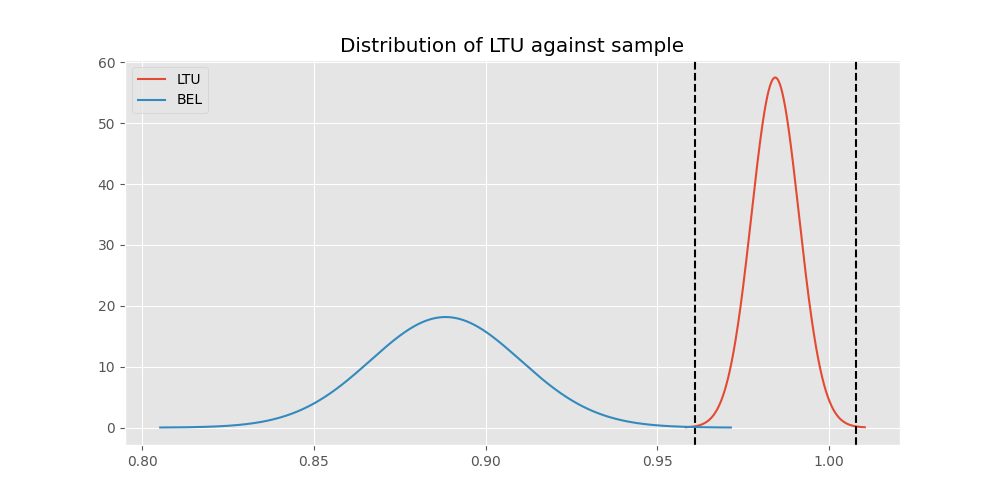 
## Testing Results for LTU against POL 
LTU has a success rate of 0.984375
POL has a success rate of 0.979381443298969
$H_{0}$: There is not a difference between LTU and POL
$H_{A}$: There is a difference between LTU and POL
An $/alpha$ of 0.0008064516129032258 was used in this test.
__independent t-testing__: With a t-statistic of 0.5121832477368726 and a p-value of 0.6086636024619916, _we failed to reject the null hypothssis_
__Man-Whitney testing__: With a u-statistic of 77987.5 and a p-value of 0.6088209564541922, _we failed to reject the null hypothssis_
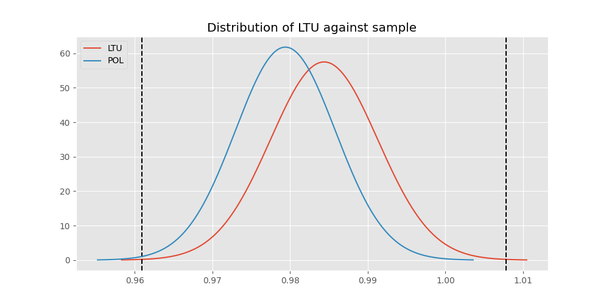 
## Testing Results for LTU against SVN 
LTU has a success rate of 0.984375
SVN has a success rate of 0.9770114942528736
$H_{0}$: There is not a difference between LTU and SVN
$H_{A}$: There is a difference between LTU and SVN
An $/alpha$ of 0.0008064516129032258 was used in this test.
__independent t-testing__: With a t-statistic of 0.46739583728734246 and a p-value of 0.6404680749321405, _we failed to reject the null hypothssis_
__Man-Whitney testing__: With a u-statistic of 14022.5 and a p-value of 0.6415274919226741, _we failed to reject the null hypothssis_
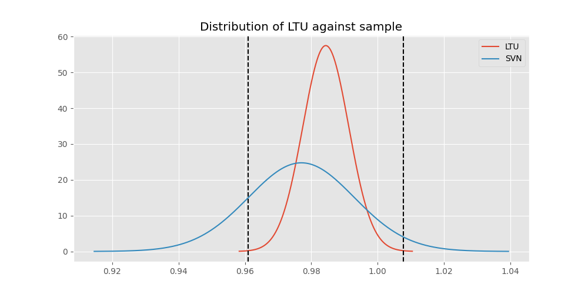 
## Testing Results for LTU against AUS 
LTU has a success rate of 0.984375
AUS has a success rate of 0.7289377289377289
$H_{0}$: There is not a difference between LTU and AUS
$H_{A}$: There is a difference between LTU and AUS
An $/alpha$ of 0.0008064516129032258 was used in this test.
__independent t-testing__: With a t-statistic of 9.823919413519745 and a p-value of 3.358968157013105e-21, _we **reject** the null hypothssis_
__Man-Whitney testing__: With a u-statistic of 54837.5 and a p-value of 7.82120544139784e-20, _we **reject** the null hypothssis_
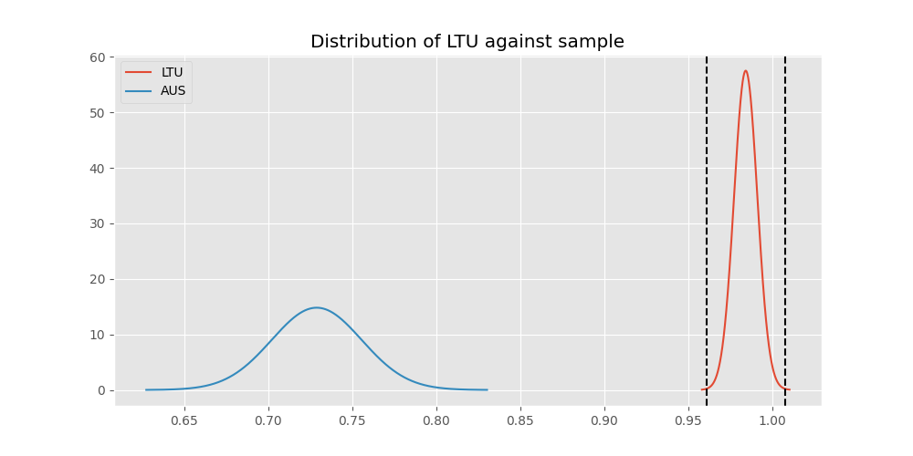 
## Testing Results for LTU against UKR 
LTU has a success rate of 0.984375
UKR has a success rate of 0.981549815498155
$H_{0}$: There is not a difference between LTU and UKR
$H_{A}$: There is a difference between LTU and UKR
An $/alpha$ of 0.0008064516129032258 was used in this test.
__independent t-testing__: With a t-statistic of 0.26491216515130905 and a p-value of 0.7911698067107378, _we failed to reject the null hypothssis_
__Man-Whitney testing__: With a u-statistic of 43482.5 and a p-value of 0.7917498427079567, _we failed to reject the null hypothssis_
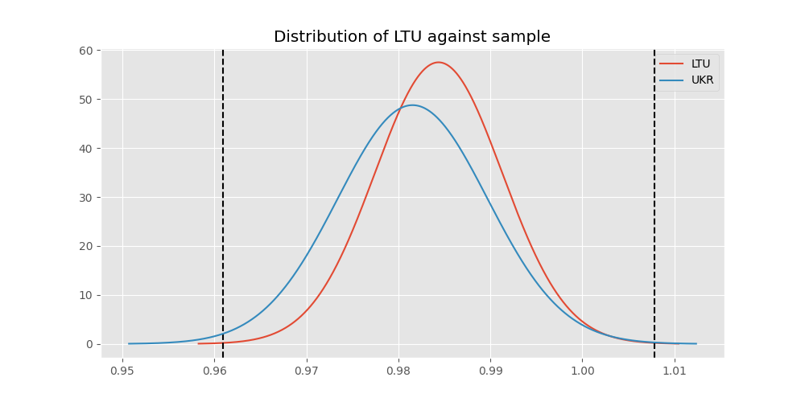 
## Testing Results for LTU against CIS 
LTU has a success rate of 0.984375
CIS has a success rate of 0.837386018237082
$H_{0}$: There is not a difference between LTU and CIS
$H_{A}$: There is a difference between LTU and CIS
An $/alpha$ of 0.0008064516129032258 was used in this test.
__independent t-testing__: With a t-statistic of 6.9304484347824085 and a p-value of 7.61366649110897e-12, _we **reject** the null hypothssis_
__Man-Whitney testing__: With a u-statistic of 120755.0 and a p-value of 1.2948717065451141e-11, _we **reject** the null hypothssis_
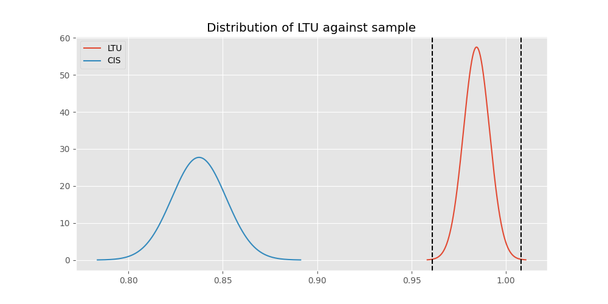 
## Testing Results for LTU against SAFR 
LTU has a success rate of 0.984375
SAFR has a success rate of 0.9328358208955224
$H_{0}$: There is not a difference between LTU and SAFR
$H_{A}$: There is a difference between LTU and SAFR
An $/alpha$ of 0.0008064516129032258 was used in this test.
__independent t-testing__: With a t-statistic of 2.9180753147482266 and a p-value of 0.003697636416224416, _we failed to reject the null hypothssis_
__Man-Whitney testing__: With a u-statistic of 22545.0 and a p-value of 0.003817542013790642, _we failed to reject the null hypothssis_
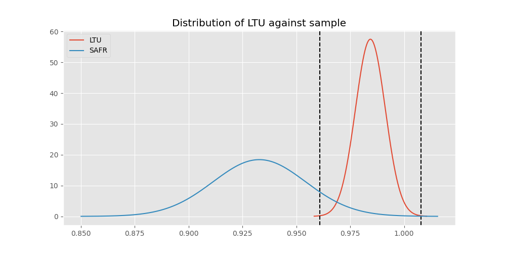 
## Testing Results for LTU against TBD 
LTU has a success rate of 0.984375
TBD has a success rate of 0.9898734177215189
$H_{0}$: There is not a difference between LTU and TBD
$H_{A}$: There is a difference between LTU and TBD
An $/alpha$ of 0.0008064516129032258 was used in this test.
__independent t-testing__: With a t-statistic of -0.6550328229107256 and a p-value of 0.5126578855129468, _we failed to reject the null hypothssis_
__Man-Whitney testing__: With a u-statistic of 62852.5 and a p-value of 0.5128850514230756, _we failed to reject the null hypothssis_
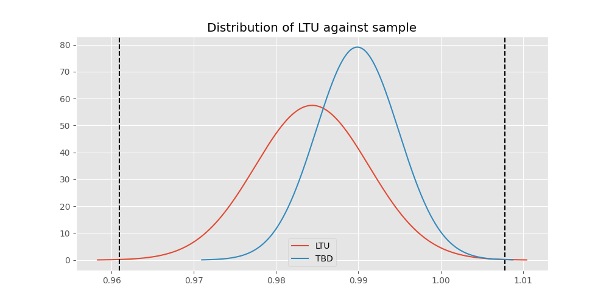 
## Testing Results for LTU against ESA 
LTU has a success rate of 0.984375
ESA has a success rate of 0.9811320754716981
$H_{0}$: There is not a difference between LTU and ESA
$H_{A}$: There is a difference between LTU and ESA
An $/alpha$ of 0.0008064516129032258 was used in this test.
__independent t-testing__: With a t-statistic of 0.227100490373261 and a p-value of 0.8204550587936861, _we failed to reject the null hypothssis_
__Man-Whitney testing__: With a u-statistic of 17015.0 and a p-value of 0.8217556580108824, _we failed to reject the null hypothssis_
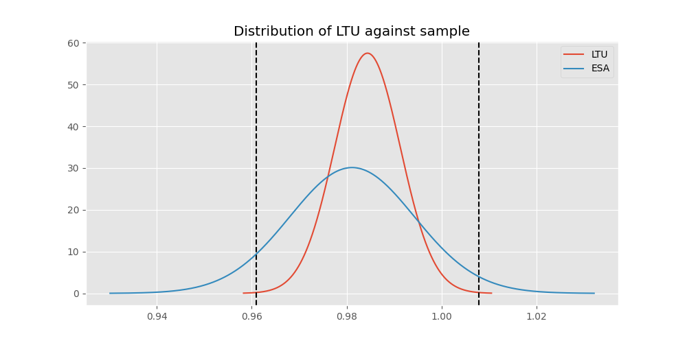 
## Testing Results for LTU against UK 
LTU has a success rate of 0.984375
UK has a success rate of 0.9881796690307328
$H_{0}$: There is not a difference between LTU and UK
$H_{A}$: There is a difference between LTU and UK
An $/alpha$ of 0.0008064516129032258 was used in this test.
__independent t-testing__: With a t-statistic of -0.5140667879212862 and a p-value of 0.6073028723882501, _we failed to reject the null hypothssis_
__Man-Whitney testing__: With a u-statistic of 134845.0 and a p-value of 0.6074408176335387, _we failed to reject the null hypothssis_
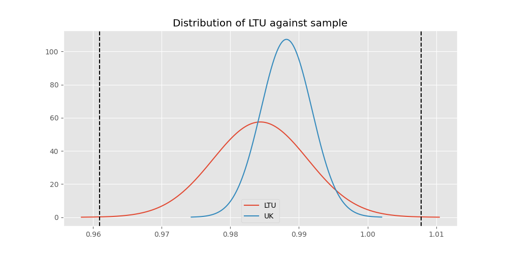 
## Testing Results for LTU against GER 
LTU has a success rate of 0.984375
GER has a success rate of 0.9766233766233766
$H_{0}$: There is not a difference between LTU and GER
$H_{A}$: There is a difference between LTU and GER
An $/alpha$ of 0.0008064516129032258 was used in this test.
__independent t-testing__: With a t-statistic of 0.8773499838508461 and a p-value of 0.38037676688460376, _we failed to reject the null hypothssis_
__Man-Whitney testing__: With a u-statistic of 372465.0 and a p-value of 0.38035885433813954, _we failed to reject the null hypothssis_
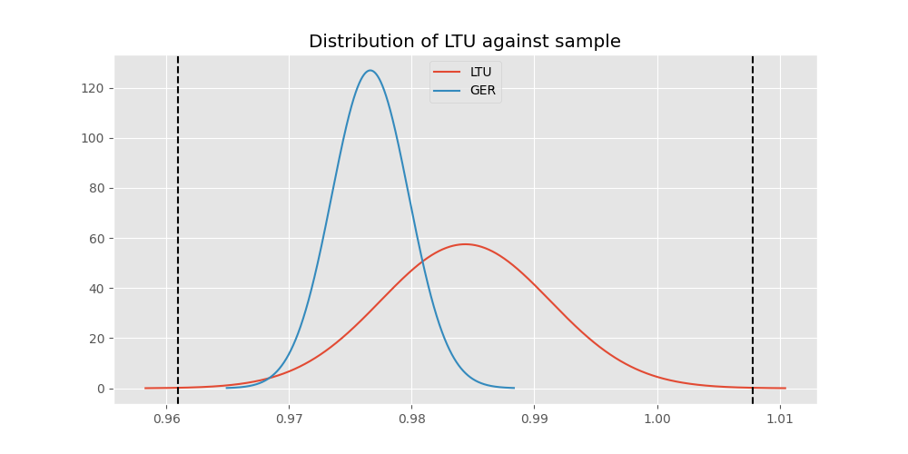 
