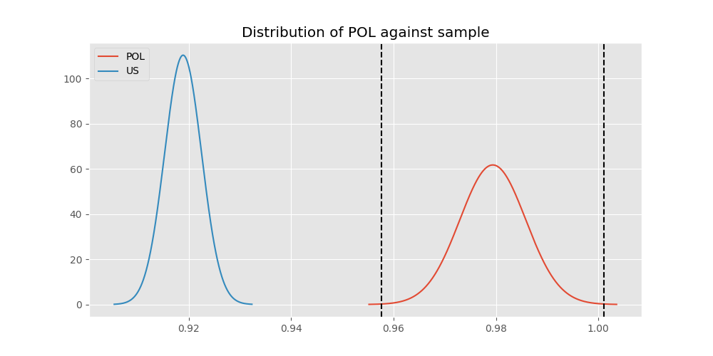
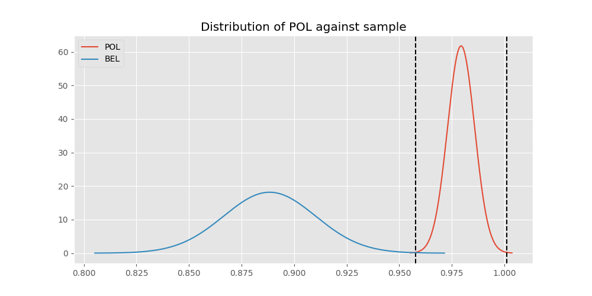

# Testing Results For POL 
$H_{0}$: There is not a difference in collection success against POL 
$H_{A}$: There is a difference in collection success against POL
An $\alpha$ of 0.0008064516129032258 was used 
Out of 25 tests, there were 9 rejections from 25 independent-t test.
Out of 25 tests, there were 9 rejections from 25 Man Whitney u-tests.
## Testing Results for POL against IND 
POL has a success rate of 0.979381443298969
IND has a success rate of 0.9704433497536946
$H_{0}$: There is not a difference between POL and IND
$H_{A}$: There is a difference between POL and IND
An $/alpha$ of 0.0008064516129032258 was used in this test.
__independent t-testing__: With a t-statistic of 0.855632326946844 and a p-value of 0.39243172850347363, _we failed to reject the null hypothssis_
__Man-Whitney testing__: With a u-statistic of 99335.0 and a p-value of 0.3923989783086115, _we failed to reject the null hypothssis_
 
## Testing Results for POL against GUAT 
POL has a success rate of 0.979381443298969
GUAT has a success rate of 0.9705882352941176
$H_{0}$: There is not a difference between POL and GUAT
$H_{A}$: There is a difference between POL and GUAT
An $/alpha$ of 0.0008064516129032258 was used in this test.
__independent t-testing__: With a t-statistic of 0.46531229422398923 and a p-value of 0.6418916788332989, _we failed to reject the null hypothssis_
__Man-Whitney testing__: With a u-statistic of 16635.0 and a p-value of 0.6426210915838657, _we failed to reject the null hypothssis_
 
## Testing Results for POL against IT 
POL has a success rate of 0.979381443298969
IT has a success rate of 0.9217391304347826
$H_{0}$: There is not a difference between POL and IT
$H_{A}$: There is a difference between POL and IT
An $/alpha$ of 0.0008064516129032258 was used in this test.
__independent t-testing__: With a t-statistic of 4.40895988554487 and a p-value of 1.117870137348658e-05, _we **reject** the null hypothssis_
__Man-Whitney testing__: With a u-statistic of 235960.0 and a p-value of 1.1861401311215056e-05, _we **reject** the null hypothssis_
 
## Testing Results for POL against EST 
POL has a success rate of 0.979381443298969
EST has a success rate of 0.975
$H_{0}$: There is not a difference between POL and EST
$H_{A}$: There is a difference between POL and EST
An $/alpha$ of 0.0008064516129032258 was used in this test.
__independent t-testing__: With a t-statistic of 0.18561168222243243 and a p-value of 0.8528212541688028, _we failed to reject the null hypothssis_
__Man-Whitney testing__: With a u-statistic of 9742.5 and a p-value of 0.8543294237330855, _we failed to reject the null hypothssis_
 
## Testing Results for POL against SKOR 
POL has a success rate of 0.979381443298969
SKOR has a success rate of 0.9166666666666666
$H_{0}$: There is not a difference between POL and SKOR
$H_{A}$: There is a difference between POL and SKOR
An $/alpha$ of 0.0008064516129032258 was used in this test.
__independent t-testing__: With a t-statistic of 2.8163178629541394 and a p-value of 0.0050344091240951995, _we failed to reject the null hypothssis_
__Man-Whitney testing__: With a u-statistic of 15462.5 and a p-value of 0.005157772513306234, _we failed to reject the null hypothssis_
 
## Testing Results for POL against RP 
POL has a success rate of 0.979381443298969
RP has a success rate of 0.6735187424425635
$H_{0}$: There is not a difference between POL and RP
$H_{A}$: There is a difference between POL and RP
An $/alpha$ of 0.0008064516129032258 was used in this test.
__independent t-testing__: With a t-statistic of 13.982067739827448 and a p-value of 1.6460285264406644e-41, _we **reject** the null hypothssis_
__Man-Whitney testing__: With a u-statistic of 261887.5 and a p-value of 6.562101194199868e-39, _we **reject** the null hypothssis_
 
## Testing Results for POL against JPN 
POL has a success rate of 0.979381443298969
JPN has a success rate of 0.6016371077762619
$H_{0}$: There is not a difference between POL and JPN
$H_{A}$: There is a difference between POL and JPN
An $/alpha$ of 0.0008064516129032258 was used in this test.
__independent t-testing__: With a t-statistic of 16.52437182328671 and a p-value of 1.7220625400611517e-55, _we **reject** the null hypothssis_
__Man-Whitney testing__: With a u-statistic of 244897.5 and a p-value of 1.8464904061588767e-50, _we **reject** the null hypothssis_
 
## Testing Results for POL against US 
POL has a success rate of 0.979381443298969
US has a success rate of 0.918885774351787
$H_{0}$: There is not a difference between POL and US
$H_{A}$: There is a difference between POL and US
An $/alpha$ of 0.0008064516129032258 was used in this test.
__independent t-testing__: With a t-statistic of 4.823959243564522 and a p-value of 1.4410550003952735e-06, _we **reject** the null hypothssis_
__Man-Whitney testing__: With a u-statistic of 1467927.5 and a p-value of 1.469945675309742e-06, _we **reject** the null hypothssis_
 
## Testing Results for POL against KAZ 
POL has a success rate of 0.979381443298969
KAZ has a success rate of 0.989010989010989
$H_{0}$: There is not a difference between POL and KAZ
$H_{A}$: There is a difference between POL and KAZ
An $/alpha$ of 0.0008064516129032258 was used in this test.
__independent t-testing__: With a t-statistic of -0.8326033596771462 and a p-value of 0.40536737154466773, _we failed to reject the null hypothssis_
__Man-Whitney testing__: With a u-statistic of 43710.0 and a p-value of 0.40551313701125513, _we failed to reject the null hypothssis_
 
## Testing Results for POL against ROC 
POL has a success rate of 0.979381443298969
ROC has a success rate of 0.17751479289940827
$H_{0}$: There is not a difference between POL and ROC
$H_{A}$: There is a difference between POL and ROC
An $/alpha$ of 0.0008064516129032258 was used in this test.
__independent t-testing__: With a t-statistic of 39.042796731721104 and a p-value of 8.269661304494504e-173, _we **reject** the null hypothssis_
__Man-Whitney testing__: With a u-statistic of 73845.0 and a p-value of 1.8076652598298684e-101, _we **reject** the null hypothssis_
 
## Testing Results for POL against THAI 
POL has a success rate of 0.979381443298969
THAI has a success rate of 0.9880952380952381
$H_{0}$: There is not a difference between POL and THAI
$H_{A}$: There is a difference between POL and THAI
An $/alpha$ of 0.0008064516129032258 was used in this test.
__independent t-testing__: With a t-statistic of -0.72389973927425 and a p-value of 0.4693873357200635, _we failed to reject the null hypothssis_
__Man-Whitney testing__: With a u-statistic of 40385.0 and a p-value of 0.46959131916945374, _we failed to reject the null hypothssis_
 
## Testing Results for POL against FR 
POL has a success rate of 0.979381443298969
FR has a success rate of 0.908183632734531
$H_{0}$: There is not a difference between POL and FR
$H_{A}$: There is a difference between POL and FR
An $/alpha$ of 0.0008064516129032258 was used in this test.
__independent t-testing__: With a t-statistic of 4.88220257761287 and a p-value of 1.223534005293769e-06, _we **reject** the null hypothssis_
__Man-Whitney testing__: With a u-statistic of 130142.5 and a p-value of 1.3909619650054006e-06, _we **reject** the null hypothssis_
 
## Testing Results for POL against TURK 
POL has a success rate of 0.979381443298969
TURK has a success rate of 0.9962264150943396
$H_{0}$: There is not a difference between POL and TURK
$H_{A}$: There is a difference between POL and TURK
An $/alpha$ of 0.0008064516129032258 was used in this test.
__independent t-testing__: With a t-statistic of -2.2517699819242387 and a p-value of 0.024638463271344842, _we failed to reject the null hypothssis_
__Man-Whitney testing__: With a u-statistic of 63180.0 and a p-value of 0.0669135123713524, _we failed to reject the null hypothssis_
 
## Testing Results for POL against PRC 
POL has a success rate of 0.979381443298969
PRC has a success rate of 0.988759187202767
$H_{0}$: There is not a difference between POL and PRC
$H_{A}$: There is a difference between POL and PRC
An $/alpha$ of 0.0008064516129032258 was used in this test.
__independent t-testing__: With a t-statistic of -1.6663955800068597 and a p-value of 0.0957466592351153, _we failed to reject the null hypothssis_
__Man-Whitney testing__: With a u-statistic of 555642.5 and a p-value of 0.09577155452247846, _we failed to reject the null hypothssis_
 
## Testing Results for POL against BEL 
POL has a success rate of 0.979381443298969
BEL has a success rate of 0.8883495145631068
$H_{0}$: There is not a difference between POL and BEL
$H_{A}$: There is a difference between POL and BEL
An $/alpha$ of 0.0008064516129032258 was used in this test.
__independent t-testing__: With a t-statistic of 5.226121789660743 and a p-value of 2.2969747432747463e-07, _we **reject** the null hypothssis_
__Man-Whitney testing__: With a u-statistic of 54502.5 and a p-value of 2.917900429423482e-07, _we **reject** the null hypothssis_
 
## Testing Results for POL against LTU 
POL has a success rate of 0.979381443298969
LTU has a success rate of 0.984375
$H_{0}$: There is not a difference between POL and LTU
$H_{A}$: There is a difference between POL and LTU
An $/alpha$ of 0.0008064516129032258 was used in this test.
__independent t-testing__: With a t-statistic of -0.5121832477368726 and a p-value of 0.6086636024619916, _we failed to reject the null hypothssis_
__Man-Whitney testing__: With a u-statistic of 77212.5 and a p-value of 0.6088209564541922, _we failed to reject the null hypothssis_
 
## Testing Results for POL against SVN 
POL has a success rate of 0.979381443298969
SVN has a success rate of 0.9770114942528736
$H_{0}$: There is not a difference between POL and SVN
$H_{A}$: There is a difference between POL and SVN
An $/alpha$ of 0.0008064516129032258 was used in this test.
__independent t-testing__: With a t-statistic of 0.14178489110636858 and a p-value of 0.8873000162626039, _we failed to reject the null hypothssis_
__Man-Whitney testing__: With a u-statistic of 21147.5 and a p-value of 0.8882747176022044, _we failed to reject the null hypothssis_
 
## Testing Results for POL against AUS 
POL has a success rate of 0.979381443298969
AUS has a success rate of 0.7289377289377289
$H_{0}$: There is not a difference between POL and AUS
$H_{A}$: There is a difference between POL and AUS
An $/alpha$ of 0.0008064516129032258 was used in this test.
__independent t-testing__: With a t-statistic of 11.399844458751762 and a p-value of 6.845919599123987e-28, _we **reject** the null hypothssis_
__Man-Whitney testing__: With a u-statistic of 82782.5 and a p-value of 5.8170732876011e-26, _we **reject** the null hypothssis_
 
## Testing Results for POL against UKR 
POL has a success rate of 0.979381443298969
UKR has a success rate of 0.981549815498155
$H_{0}$: There is not a difference between POL and UKR
$H_{A}$: There is a difference between POL and UKR
An $/alpha$ of 0.0008064516129032258 was used in this test.
__independent t-testing__: With a t-statistic of -0.2047539828009911 and a p-value of 0.8378196001214827, _we failed to reject the null hypothssis_
__Man-Whitney testing__: With a u-statistic of 65575.0 and a p-value of 0.8382244603547566, _we failed to reject the null hypothssis_
 
## Testing Results for POL against CIS 
POL has a success rate of 0.979381443298969
CIS has a success rate of 0.837386018237082
$H_{0}$: There is not a difference between POL and CIS
$H_{A}$: There is a difference between POL and CIS
An $/alpha$ of 0.0008064516129032258 was used in this test.
__independent t-testing__: With a t-statistic of 8.03891677010047 and a p-value of 2.2500132661085565e-15, _we **reject** the null hypothssis_
__Man-Whitney testing__: With a u-statistic of 182222.5 and a p-value of 5.127213926555141e-15, _we **reject** the null hypothssis_
 
## Testing Results for POL against SAFR 
POL has a success rate of 0.979381443298969
SAFR has a success rate of 0.9328358208955224
$H_{0}$: There is not a difference between POL and SAFR
$H_{A}$: There is a difference between POL and SAFR
An $/alpha$ of 0.0008064516129032258 was used in this test.
__independent t-testing__: With a t-statistic of 2.777735795829607 and a p-value of 0.005640329749783976, _we failed to reject the null hypothssis_
__Man-Whitney testing__: With a u-statistic of 34007.5 and a p-value of 0.00574746056729222, _we failed to reject the null hypothssis_
 
## Testing Results for POL against TBD 
POL has a success rate of 0.979381443298969
TBD has a success rate of 0.9898734177215189
$H_{0}$: There is not a difference between POL and TBD
$H_{A}$: There is a difference between POL and TBD
An $/alpha$ of 0.0008064516129032258 was used in this test.
__independent t-testing__: With a t-statistic of -1.236884012604609 and a p-value of 0.21646087527888908, _we failed to reject the null hypothssis_
__Man-Whitney testing__: With a u-statistic of 94782.5 and a p-value of 0.216497153517494, _we failed to reject the null hypothssis_
 
## Testing Results for POL against ESA 
POL has a success rate of 0.979381443298969
ESA has a success rate of 0.9811320754716981
$H_{0}$: There is not a difference between POL and ESA
$H_{A}$: There is a difference between POL and ESA
An $/alpha$ of 0.0008064516129032258 was used in this test.
__independent t-testing__: With a t-statistic of -0.11557166611136227 and a p-value of 0.9080314094702533, _we failed to reject the null hypothssis_
__Man-Whitney testing__: With a u-statistic of 25660.0 and a p-value of 0.9089340178089282, _we failed to reject the null hypothssis_
 
## Testing Results for POL against UK 
POL has a success rate of 0.979381443298969
UK has a success rate of 0.9881796690307328
$H_{0}$: There is not a difference between POL and UK
$H_{A}$: There is a difference between POL and UK
An $/alpha$ of 0.0008064516129032258 was used in this test.
__independent t-testing__: With a t-statistic of -1.2695812463960625 and a p-value of 0.2044560968660586, _we failed to reject the null hypothssis_
__Man-Whitney testing__: With a u-statistic of 203350.0 and a p-value of 0.20446327691169697, _we failed to reject the null hypothssis_
 
## Testing Results for POL against GER 
POL has a success rate of 0.979381443298969
GER has a success rate of 0.9766233766233766
$H_{0}$: There is not a difference between POL and GER
$H_{A}$: There is a difference between POL and GER
An $/alpha$ of 0.0008064516129032258 was used in this test.
__independent t-testing__: With a t-statistic of 0.3690428871693021 and a p-value of 0.712123731346761, _we failed to reject the null hypothssis_
__Man-Whitney testing__: With a u-statistic of 561720.0 and a p-value of 0.7121422609409738, _we failed to reject the null hypothssis_
 
