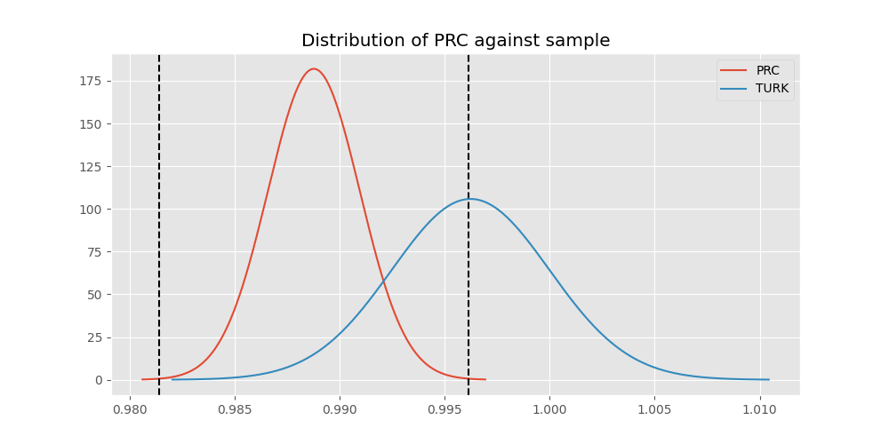
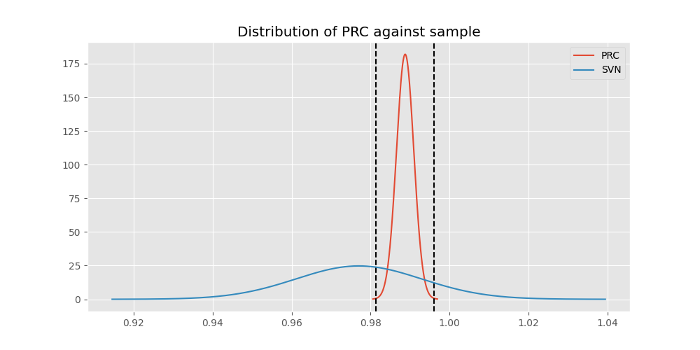

# Testing Results For PRC 
$H_{0}$: There is not a difference in collection success against PRC 
$H_{A}$: There is a difference in collection success against PRC
An $\alpha$ of 0.0008064516129032258 was used 
Out of 25 tests, there were 11 rejections from 25 independent-t test.
Out of 25 tests, there were 11 rejections from 25 Man Whitney u-tests.
## Testing Results for PRC against IND 
PRC has a success rate of 0.988759187202767
IND has a success rate of 0.9704433497536946
$H_{0}$: There is not a difference between PRC and IND
$H_{A}$: There is a difference between PRC and IND
An $/alpha$ of 0.0008064516129032258 was used in this test.
__independent t-testing__: With a t-statistic of 2.903051510700778 and a p-value of 0.0037252355694146638, _we failed to reject the null hypothssis_
__Man-Whitney testing__: With a u-statistic of 478139.0 and a p-value of 0.0037444521143469613, _we failed to reject the null hypothssis_
 
## Testing Results for PRC against GUAT 
PRC has a success rate of 0.988759187202767
GUAT has a success rate of 0.9705882352941176
$H_{0}$: There is not a difference between PRC and GUAT
$H_{A}$: There is a difference between PRC and GUAT
An $/alpha$ of 0.0008064516129032258 was used in this test.
__independent t-testing__: With a t-statistic of 1.3699301556159544 and a p-value of 0.1708379796047041, _we failed to reject the null hypothssis_
__Man-Whitney testing__: With a u-statistic of 80071.0 and a p-value of 0.1709371833248695, _we failed to reject the null hypothssis_
 
## Testing Results for PRC against IT 
PRC has a success rate of 0.988759187202767
IT has a success rate of 0.9217391304347826
$H_{0}$: There is not a difference between PRC and IT
$H_{A}$: There is a difference between PRC and IT
An $/alpha$ of 0.0008064516129032258 was used in this test.
__independent t-testing__: With a t-statistic of 10.18558797732011 and a p-value of 5.279827893988721e-24, _we **reject** the null hypothssis_
__Man-Whitney testing__: With a u-statistic of 1135288.0 and a p-value of 1.1554534137978016e-23, _we **reject** the null hypothssis_
 
## Testing Results for PRC against EST 
PRC has a success rate of 0.988759187202767
EST has a success rate of 0.975
$H_{0}$: There is not a difference between PRC and EST
$H_{A}$: There is a difference between PRC and EST
An $/alpha$ of 0.0008064516129032258 was used in this test.
__independent t-testing__: With a t-statistic of 0.809861473998982 and a p-value of 0.41810175692350104, _we failed to reject the null hypothssis_
__Man-Whitney testing__: With a u-statistic of 46896.5 and a p-value of 0.4183515217816217, _we failed to reject the null hypothssis_
 
## Testing Results for PRC against SKOR 
PRC has a success rate of 0.988759187202767
SKOR has a success rate of 0.9166666666666666
$H_{0}$: There is not a difference between PRC and SKOR
$H_{A}$: There is a difference between PRC and SKOR
An $/alpha$ of 0.0008064516129032258 was used in this test.
__independent t-testing__: With a t-statistic of 4.87767922685427 and a p-value of 1.144588470658943e-06, _we **reject** the null hypothssis_
__Man-Whitney testing__: With a u-statistic of 74392.5 and a p-value of 1.210399596742153e-06, _we **reject** the null hypothssis_
 
## Testing Results for PRC against RP 
PRC has a success rate of 0.988759187202767
RP has a success rate of 0.6735187424425635
$H_{0}$: There is not a difference between PRC and RP
$H_{A}$: There is a difference between PRC and RP
An $/alpha$ of 0.0008064516129032258 was used in this test.
__independent t-testing__: With a t-statistic of 30.25342996313065 and a p-value of 1.196212825618086e-176, _we **reject** the null hypothssis_
__Man-Whitney testing__: With a u-statistic of 1257929.5 and a p-value of 3.6191019078408783e-156, _we **reject** the null hypothssis_
 
## Testing Results for PRC against JPN 
PRC has a success rate of 0.988759187202767
JPN has a success rate of 0.6016371077762619
$H_{0}$: There is not a difference between PRC and JPN
$H_{A}$: There is a difference between PRC and JPN
An $/alpha$ of 0.0008064516129032258 was used in this test.
__independent t-testing__: With a t-statistic of 35.50836909607111 and a p-value of 2.2182391715214405e-231, _we **reject** the null hypothssis_
__Man-Whitney testing__: With a u-statistic of 1175883.5 and a p-value of 5.812488939037513e-196, _we **reject** the null hypothssis_
 
## Testing Results for PRC against US 
PRC has a success rate of 0.988759187202767
US has a success rate of 0.918885774351787
$H_{0}$: There is not a difference between PRC and US
$H_{A}$: There is a difference between PRC and US
An $/alpha$ of 0.0008064516129032258 was used in this test.
__independent t-testing__: With a t-statistic of 11.951604989072043 and a p-value of 1.2046583788508746e-32, _we **reject** the null hypothssis_
__Man-Whitney testing__: With a u-statistic of 7062557.5 and a p-value of 2.222726796040256e-32, _we **reject** the null hypothssis_
 
## Testing Results for PRC against KAZ 
PRC has a success rate of 0.988759187202767
KAZ has a success rate of 0.989010989010989
$H_{0}$: There is not a difference between PRC and KAZ
$H_{A}$: There is a difference between PRC and KAZ
An $/alpha$ of 0.0008064516129032258 was used in this test.
__independent t-testing__: With a t-statistic of -0.0310370179670198 and a p-value of 0.9752425022348316, _we failed to reject the null hypothssis_
__Man-Whitney testing__: With a u-statistic of 210430.0 and a p-value of 0.9754686163297901, _we failed to reject the null hypothssis_
 
## Testing Results for PRC against ROC 
PRC has a success rate of 0.988759187202767
ROC has a success rate of 0.17751479289940827
$H_{0}$: There is not a difference between PRC and ROC
$H_{A}$: There is a difference between PRC and ROC
An $/alpha$ of 0.0008064516129032258 was used in this test.
__independent t-testing__: With a t-statistic of 71.42806016857332 and a p-value of 0.0, _we **reject** the null hypothssis_
__Man-Whitney testing__: With a u-statistic of 354005.0 and a p-value of 0.0, _we **reject** the null hypothssis_
 
## Testing Results for PRC against THAI 
PRC has a success rate of 0.988759187202767
THAI has a success rate of 0.9880952380952381
$H_{0}$: There is not a difference between PRC and THAI
$H_{A}$: There is a difference between PRC and THAI
An $/alpha$ of 0.0008064516129032258 was used in this test.
__independent t-testing__: With a t-statistic of 0.07862999786852705 and a p-value of 0.9373332726112292, _we failed to reject the null hypothssis_
__Man-Whitney testing__: With a u-statistic of 194421.0 and a p-value of 0.9375568609347938, _we failed to reject the null hypothssis_
 
## Testing Results for PRC against FR 
PRC has a success rate of 0.988759187202767
FR has a success rate of 0.908183632734531
$H_{0}$: There is not a difference between PRC and FR
$H_{A}$: There is a difference between PRC and FR
An $/alpha$ of 0.0008064516129032258 was used in this test.
__independent t-testing__: With a t-statistic of 10.554911272929822 and a p-value of 1.440298744758114e-25, _we **reject** the null hypothssis_
__Man-Whitney testing__: With a u-statistic of 626092.5 and a p-value of 4.031560251995013e-25, _we **reject** the null hypothssis_
 
## Testing Results for PRC against TURK 
PRC has a success rate of 0.988759187202767
TURK has a success rate of 0.9962264150943396
$H_{0}$: There is not a difference between PRC and TURK
$H_{A}$: There is a difference between PRC and TURK
An $/alpha$ of 0.0008064516129032258 was used in this test.
__independent t-testing__: With a t-statistic of -1.1308727898538105 and a p-value of 0.25821391098818675, _we failed to reject the null hypothssis_
__Man-Whitney testing__: With a u-statistic of 304184.0 and a p-value of 0.2582384188837469, _we failed to reject the null hypothssis_
 
## Testing Results for PRC against BEL 
PRC has a success rate of 0.988759187202767
BEL has a success rate of 0.8883495145631068
$H_{0}$: There is not a difference between PRC and BEL
$H_{A}$: There is a difference between PRC and BEL
An $/alpha$ of 0.0008064516129032258 was used in this test.
__independent t-testing__: With a t-statistic of 10.199684843848024 and a p-value of 5.7784267900565255e-24, _we **reject** the null hypothssis_
__Man-Whitney testing__: With a u-statistic of 262160.5 and a p-value of 1.5710003232906902e-23, _we **reject** the null hypothssis_
 
## Testing Results for PRC against POL 
PRC has a success rate of 0.988759187202767
POL has a success rate of 0.979381443298969
$H_{0}$: There is not a difference between PRC and POL
$H_{A}$: There is a difference between PRC and POL
An $/alpha$ of 0.0008064516129032258 was used in this test.
__independent t-testing__: With a t-statistic of 1.6663955800068597 and a p-value of 0.0957466592351153, _we failed to reject the null hypothssis_
__Man-Whitney testing__: With a u-statistic of 566162.5 and a p-value of 0.09577155452247846, _we failed to reject the null hypothssis_
 
## Testing Results for PRC against LTU 
PRC has a success rate of 0.988759187202767
LTU has a success rate of 0.984375
$H_{0}$: There is not a difference between PRC and LTU
$H_{A}$: There is a difference between PRC and LTU
An $/alpha$ of 0.0008064516129032258 was used in this test.
__independent t-testing__: With a t-statistic of 0.6812650807926846 and a p-value of 0.4957637312498092, _we failed to reject the null hypothssis_
__Man-Whitney testing__: With a u-statistic of 371702.5 and a p-value of 0.4957927283367223, _we failed to reject the null hypothssis_
 
## Testing Results for PRC against SVN 
PRC has a success rate of 0.988759187202767
SVN has a success rate of 0.9770114942528736
$H_{0}$: There is not a difference between PRC and SVN
$H_{A}$: There is a difference between PRC and SVN
An $/alpha$ of 0.0008064516129032258 was used in this test.
__independent t-testing__: With a t-statistic of 1.0015648602812843 and a p-value of 0.3166548520993417, _we failed to reject the null hypothssis_
__Man-Whitney testing__: With a u-statistic of 101797.5 and a p-value of 0.3167588714628278, _we failed to reject the null hypothssis_
 
## Testing Results for PRC against AUS 
PRC has a success rate of 0.988759187202767
AUS has a success rate of 0.7289377289377289
$H_{0}$: There is not a difference between PRC and AUS
$H_{A}$: There is a difference between PRC and AUS
An $/alpha$ of 0.0008064516129032258 was used in this test.
__independent t-testing__: With a t-statistic of 23.125207049020286 and a p-value of 1.0773359252709268e-107, _we **reject** the null hypothssis_
__Man-Whitney testing__: With a u-statistic of 397756.5 and a p-value of 2.130722954055027e-98, _we **reject** the null hypothssis_
 
## Testing Results for PRC against UKR 
PRC has a success rate of 0.988759187202767
UKR has a success rate of 0.981549815498155
$H_{0}$: There is not a difference between PRC and UKR
$H_{A}$: There is a difference between PRC and UKR
An $/alpha$ of 0.0008064516129032258 was used in this test.
__independent t-testing__: With a t-statistic of 1.0311720930287518 and a p-value of 0.30255670373857013, _we failed to reject the null hypothssis_
__Man-Whitney testing__: With a u-statistic of 315671.0 and a p-value of 0.30257305060496775, _we failed to reject the null hypothssis_
 
## Testing Results for PRC against CIS 
PRC has a success rate of 0.988759187202767
CIS has a success rate of 0.837386018237082
$H_{0}$: There is not a difference between PRC and CIS
$H_{A}$: There is a difference between PRC and CIS
An $/alpha$ of 0.0008064516129032258 was used in this test.
__independent t-testing__: With a t-statistic of 17.384957712074083 and a p-value of 1.517975135370986e-64, _we **reject** the null hypothssis_
__Man-Whitney testing__: With a u-statistic of 876168.5 and a p-value of 1.2457857782157252e-61, _we **reject** the null hypothssis_
 
## Testing Results for PRC against SAFR 
PRC has a success rate of 0.988759187202767
SAFR has a success rate of 0.9328358208955224
$H_{0}$: There is not a difference between PRC and SAFR
$H_{A}$: There is a difference between PRC and SAFR
An $/alpha$ of 0.0008064516129032258 was used in this test.
__independent t-testing__: With a t-statistic of 5.329150833709781 and a p-value of 1.0769925718897838e-07, _we **reject** the null hypothssis_
__Man-Whitney testing__: With a u-statistic of 163637.5 and a p-value of 1.1628236996568815e-07, _we **reject** the null hypothssis_
 
## Testing Results for PRC against TBD 
PRC has a success rate of 0.988759187202767
TBD has a success rate of 0.9898734177215189
$H_{0}$: There is not a difference between PRC and TBD
$H_{A}$: There is a difference between PRC and TBD
An $/alpha$ of 0.0008064516129032258 was used in this test.
__independent t-testing__: With a t-statistic of -0.19546205573474054 and a p-value of 0.8450459149692113, _we failed to reject the null hypothssis_
__Man-Whitney testing__: With a u-statistic of 456308.5 and a p-value of 0.8451543797581994, _we failed to reject the null hypothssis_
 
## Testing Results for PRC against ESA 
PRC has a success rate of 0.988759187202767
ESA has a success rate of 0.9811320754716981
$H_{0}$: There is not a difference between PRC and ESA
$H_{A}$: There is a difference between PRC and ESA
An $/alpha$ of 0.0008064516129032258 was used in this test.
__independent t-testing__: With a t-statistic of 0.7176565372826468 and a p-value of 0.4730384417488508, _we failed to reject the null hypothssis_
__Man-Whitney testing__: With a u-statistic of 123524.0 and a p-value of 0.47316142930529903, _we failed to reject the null hypothssis_
 
## Testing Results for PRC against UK 
PRC has a success rate of 0.988759187202767
UK has a success rate of 0.9881796690307328
$H_{0}$: There is not a difference between PRC and UK
$H_{A}$: There is a difference between PRC and UK
An $/alpha$ of 0.0008064516129032258 was used in this test.
__independent t-testing__: With a t-statistic of 0.13584428566312748 and a p-value of 0.8919530415494294, _we failed to reject the null hypothssis_
__Man-Whitney testing__: With a u-statistic of 978966.0 and a p-value of 0.8920224049560895, _we failed to reject the null hypothssis_
 
## Testing Results for PRC against GER 
PRC has a success rate of 0.988759187202767
GER has a success rate of 0.9766233766233766
$H_{0}$: There is not a difference between PRC and GER
$H_{A}$: There is a difference between PRC and GER
An $/alpha$ of 0.0008064516129032258 was used in this test.
__independent t-testing__: With a t-statistic of 3.166539346385634 and a p-value of 0.001552683061506122, _we failed to reject the null hypothssis_
__Man-Whitney testing__: With a u-statistic of 2703936.0 and a p-value of 0.0015593636818869504, _we failed to reject the null hypothssis_
 
