# Testing Results For ROC 
$H_{0}$: There is not a difference in collection success against ROC 
$H_{A}$: There is a difference in collection success against ROC
An $\alpha$ of 0.0008064516129032258 was used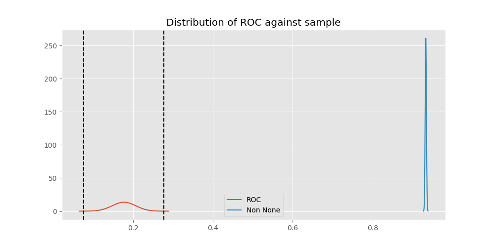 
Out of 25 tests, there were 25 rejections from 25 independent-t test.
Out of 25 tests, there were 25 rejections from 25 Man Whitney u-tests.
## Testing Results for ROC against IND 
ROC has a success rate of 0.17751479289940827
IND has a success rate of 0.9704433497536946
$H_{0}$: There is not a difference between ROC and IND
$H_{A}$: There is a difference between ROC and IND
An $/alpha$ of 0.0008064516129032258 was used in this test.
__independent t-testing__: With a t-statistic of -25.863997202146496 and a p-value of 4.29736859044376e-65, _we **reject** the null hypothssis_
__Man-Whitney testing__: With a u-statistic of 7104.0 and a p-value of 4.2140982732280854e-86, _we **reject** the null hypothssis_
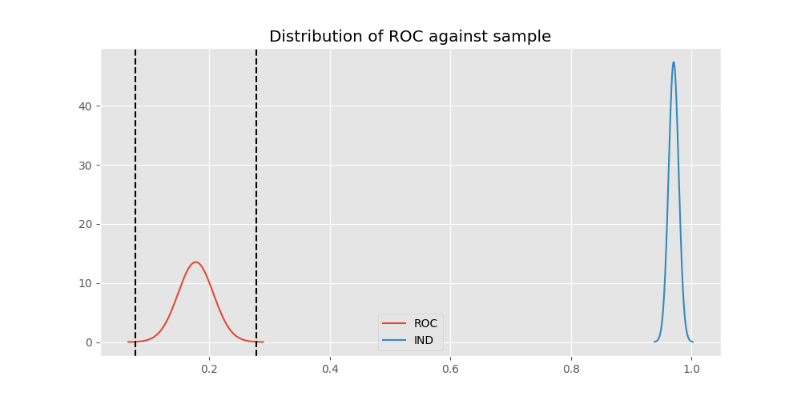 
## Testing Results for ROC against GUAT 
ROC has a success rate of 0.17751479289940827
GUAT has a success rate of 0.9705882352941176
$H_{0}$: There is not a difference between ROC and GUAT
$H_{A}$: There is a difference between ROC and GUAT
An $/alpha$ of 0.0008064516129032258 was used in this test.
__independent t-testing__: With a t-statistic of -22.03715160481653 and a p-value of 6.842437615282749e-59, _we **reject** the null hypothssis_
__Man-Whitney testing__: With a u-statistic of 1189.0 and a p-value of 3.0846319496288884e-29, _we **reject** the null hypothssis_
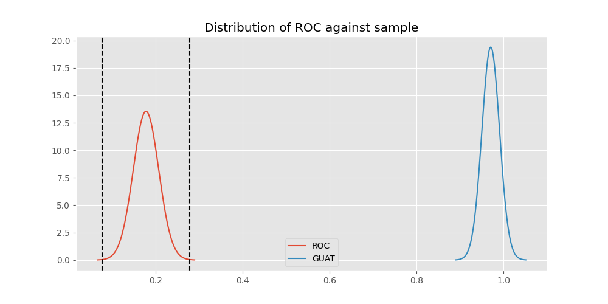 
## Testing Results for ROC against IT 
ROC has a success rate of 0.17751479289940827
IT has a success rate of 0.9217391304347826
$H_{0}$: There is not a difference between ROC and IT
$H_{A}$: There is a difference between ROC and IT
An $/alpha$ of 0.0008064516129032258 was used in this test.
__independent t-testing__: With a t-statistic of -30.727440174049867 and a p-value of 9.54166172308629e-150, _we **reject** the null hypothssis_
__Man-Whitney testing__: With a u-statistic of 19884.0 and a p-value of 5.3608406254551e-112, _we **reject** the null hypothssis_
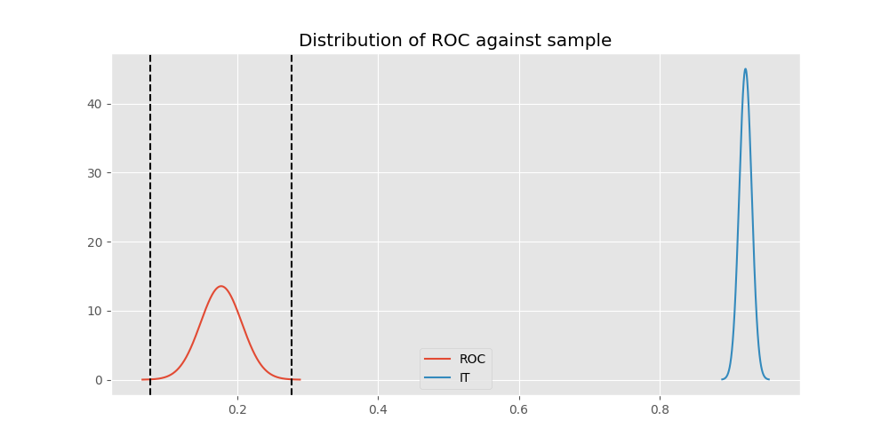 
## Testing Results for ROC against EST 
ROC has a success rate of 0.17751479289940827
EST has a success rate of 0.975
$H_{0}$: There is not a difference between ROC and EST
$H_{A}$: There is a difference between ROC and EST
An $/alpha$ of 0.0008064516129032258 was used in this test.
__independent t-testing__: With a t-statistic of -20.6318213550432 and a p-value of 3.719646995309524e-46, _we **reject** the null hypothssis_
__Man-Whitney testing__: With a u-statistic of 684.5 and a p-value of 6.606620248745387e-22, _we **reject** the null hypothssis_
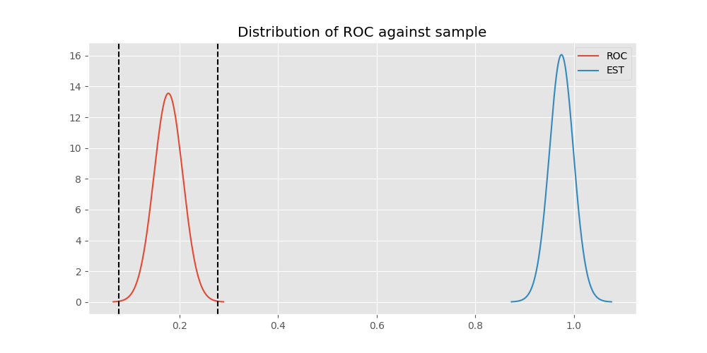 
## Testing Results for ROC against SKOR 
ROC has a success rate of 0.17751479289940827
SKOR has a success rate of 0.9166666666666666
$H_{0}$: There is not a difference between ROC and SKOR
$H_{A}$: There is a difference between ROC and SKOR
An $/alpha$ of 0.0008064516129032258 was used in this test.
__independent t-testing__: With a t-statistic of -13.700182394787713 and a p-value of 1.5489552359446367e-31, _we **reject** the null hypothssis_
__Man-Whitney testing__: With a u-statistic of 1322.5 and a p-value of 3.0797915637153473e-24, _we **reject** the null hypothssis_
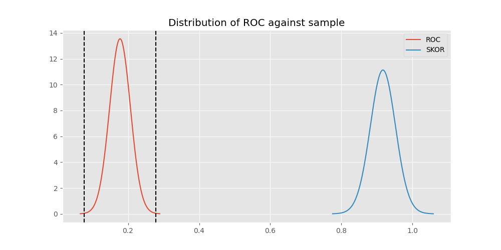 
## Testing Results for ROC against RP 
ROC has a success rate of 0.17751479289940827
RP has a success rate of 0.6735187424425635
$H_{0}$: There is not a difference between ROC and RP
$H_{A}$: There is a difference between ROC and RP
An $/alpha$ of 0.0008064516129032258 was used in this test.
__independent t-testing__: With a t-statistic of -12.89017615434443 and a p-value of 2.876300463910149e-35, _we **reject** the null hypothssis_
__Man-Whitney testing__: With a u-statistic of 35220.0 and a p-value of 7.564621363471199e-33, _we **reject** the null hypothssis_
 
## Testing Results for ROC against JPN 
ROC has a success rate of 0.17751479289940827
JPN has a success rate of 0.6016371077762619
$H_{0}$: There is not a difference between ROC and JPN
$H_{A}$: There is a difference between ROC and JPN
An $/alpha$ of 0.0008064516129032258 was used in this test.
__independent t-testing__: With a t-statistic of -10.534331149036287 and a p-value of 1.5036129184857482e-24, _we **reject** the null hypothssis_
__Man-Whitney testing__: With a u-statistic of 35669.0 and a p-value of 2.65985405072133e-23, _we **reject** the null hypothssis_
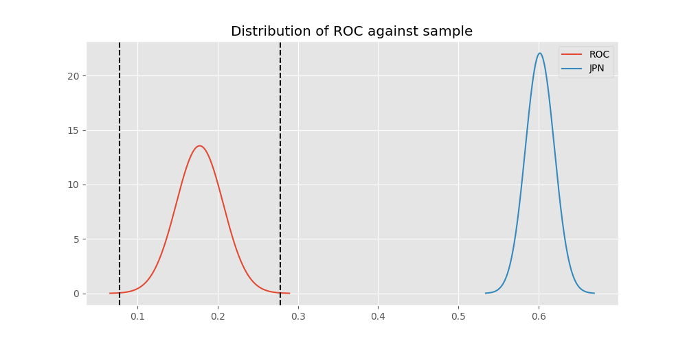 
## Testing Results for ROC against US 
ROC has a success rate of 0.17751479289940827
US has a success rate of 0.918885774351787
$H_{0}$: There is not a difference between ROC and US
$H_{A}$: There is a difference between ROC and US
An $/alpha$ of 0.0008064516129032258 was used in this test.
__independent t-testing__: With a t-statistic of -34.31495978625418 and a p-value of 2.267460467395017e-235, _we **reject** the null hypothssis_
__Man-Whitney testing__: With a u-statistic of 124743.5 and a p-value of 2.3297400550195373e-215, _we **reject** the null hypothssis_
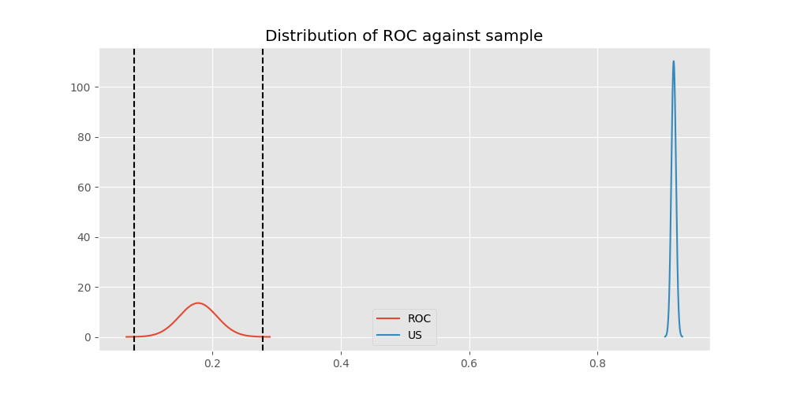 
## Testing Results for ROC against KAZ 
ROC has a success rate of 0.17751479289940827
KAZ has a success rate of 0.989010989010989
$H_{0}$: There is not a difference between ROC and KAZ
$H_{A}$: There is a difference between ROC and KAZ
An $/alpha$ of 0.0008064516129032258 was used in this test.
__independent t-testing__: With a t-statistic of -26.622710269608568 and a p-value of 3.1841956025223975e-66, _we **reject** the null hypothssis_
__Man-Whitney testing__: With a u-statistic of 2899.0 and a p-value of 5.312774508385664e-54, _we **reject** the null hypothssis_
 
## Testing Results for ROC against THAI 
ROC has a success rate of 0.17751479289940827
THAI has a success rate of 0.9880952380952381
$H_{0}$: There is not a difference between ROC and THAI
$H_{A}$: There is a difference between ROC and THAI
An $/alpha$ of 0.0008064516129032258 was used in this test.
__independent t-testing__: With a t-statistic of -26.445188977318438 and a p-value of 2.03236807048132e-66, _we **reject** the null hypothssis_
__Man-Whitney testing__: With a u-statistic of 2689.0 and a p-value of 2.995521061002053e-51, _we **reject** the null hypothssis_
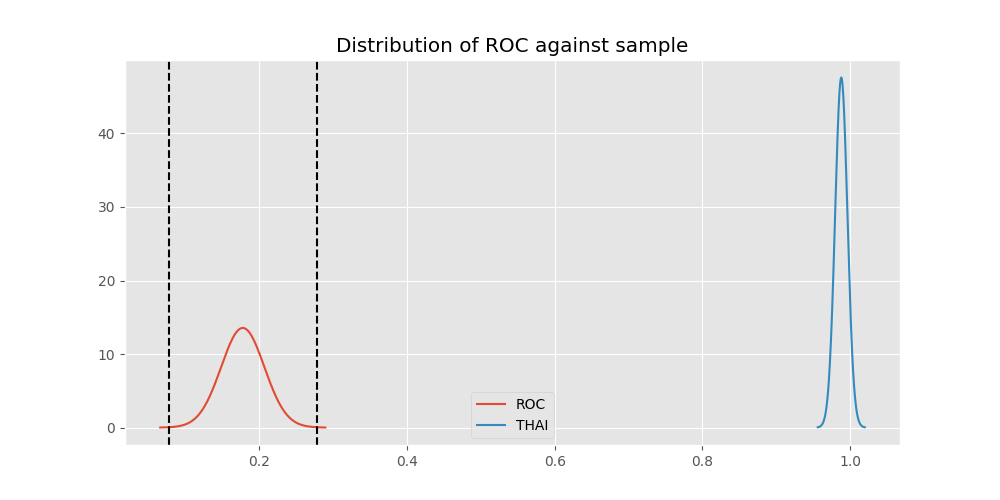 
## Testing Results for ROC against FR 
ROC has a success rate of 0.17751479289940827
FR has a success rate of 0.908183632734531
$H_{0}$: There is not a difference between ROC and FR
$H_{A}$: There is a difference between ROC and FR
An $/alpha$ of 0.0008064516129032258 was used in this test.
__independent t-testing__: With a t-statistic of -26.042511260626835 and a p-value of 9.750535118868078e-104, _we **reject** the null hypothssis_
__Man-Whitney testing__: With a u-statistic of 11402.0 and a p-value of 2.834173766967532e-75, _we **reject** the null hypothssis_
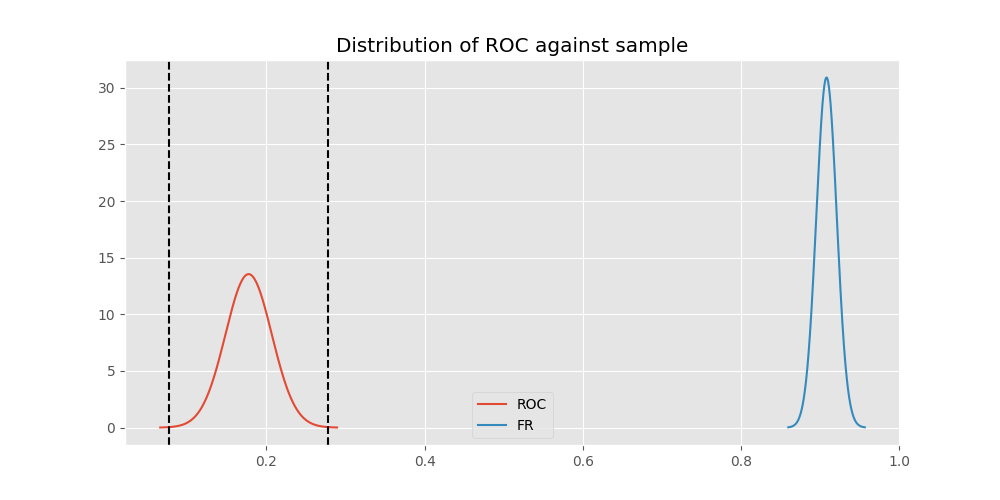 
## Testing Results for ROC against TURK 
ROC has a success rate of 0.17751479289940827
TURK has a success rate of 0.9962264150943396
$H_{0}$: There is not a difference between ROC and TURK
$H_{A}$: There is a difference between ROC and TURK
An $/alpha$ of 0.0008064516129032258 was used in this test.
__independent t-testing__: With a t-statistic of -27.547049028488544 and a p-value of 2.9546814464215155e-65, _we **reject** the null hypothssis_
__Man-Whitney testing__: With a u-statistic of 4059.5 and a p-value of 1.2031831495467728e-70, _we **reject** the null hypothssis_
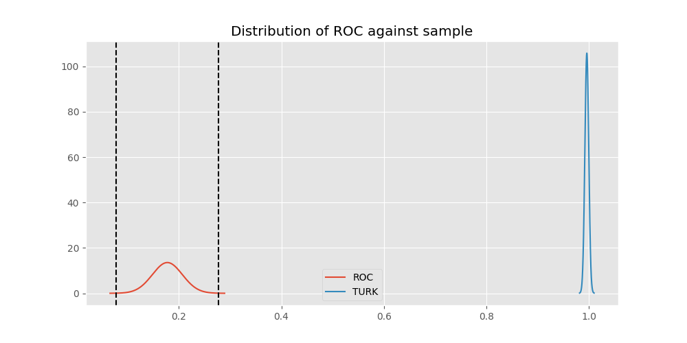 
## Testing Results for ROC against PRC 
ROC has a success rate of 0.17751479289940827
PRC has a success rate of 0.988759187202767
$H_{0}$: There is not a difference between ROC and PRC
$H_{A}$: There is a difference between ROC and PRC
An $/alpha$ of 0.0008064516129032258 was used in this test.
__independent t-testing__: With a t-statistic of -27.44272131901795 and a p-value of 2.498889073007458e-64, _we **reject** the null hypothssis_
__Man-Whitney testing__: With a u-statistic of 36892.0 and a p-value of 0.0, _we **reject** the null hypothssis_
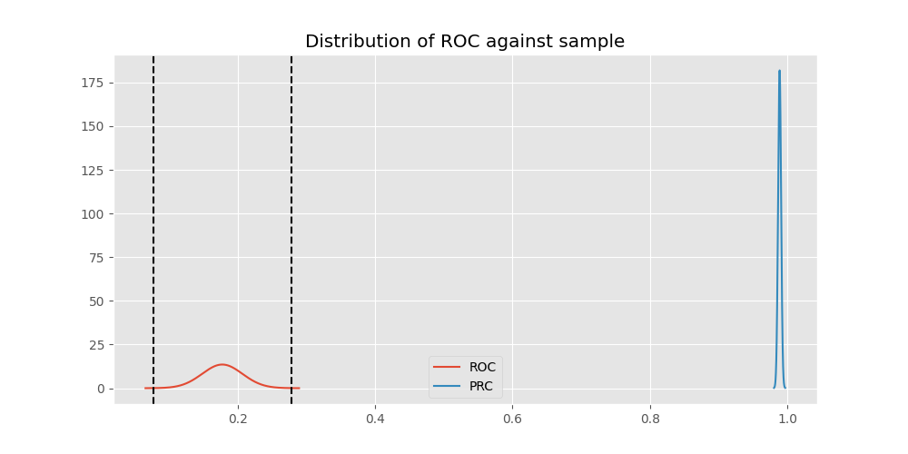 
## Testing Results for ROC against BEL 
ROC has a success rate of 0.17751479289940827
BEL has a success rate of 0.8883495145631068
$H_{0}$: There is not a difference between ROC and BEL
$H_{A}$: There is a difference between ROC and BEL
An $/alpha$ of 0.0008064516129032258 was used in this test.
__independent t-testing__: With a t-statistic of -19.695379592213186 and a p-value of 1.0381096143515418e-59, _we **reject** the null hypothssis_
__Man-Whitney testing__: With a u-statistic of 5033.5 and a p-value of 2.2951392513203422e-43, _we **reject** the null hypothssis_
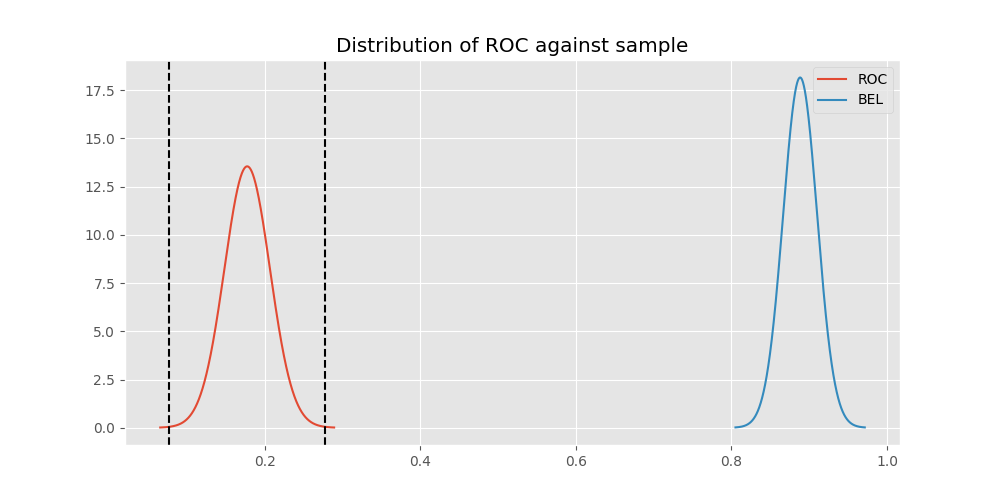 
## Testing Results for ROC against POL 
ROC has a success rate of 0.17751479289940827
POL has a success rate of 0.979381443298969
$H_{0}$: There is not a difference between ROC and POL
$H_{A}$: There is a difference between ROC and POL
An $/alpha$ of 0.0008064516129032258 was used in this test.
__independent t-testing__: With a t-statistic of -26.57010197216028 and a p-value of 5.971238292094135e-65, _we **reject** the null hypothssis_
__Man-Whitney testing__: With a u-statistic of 8120.0 and a p-value of 1.8076652598298684e-101, _we **reject** the null hypothssis_
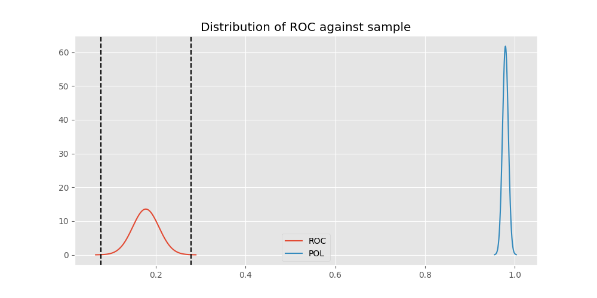 
## Testing Results for ROC against LTU 
ROC has a success rate of 0.17751479289940827
LTU has a success rate of 0.984375
$H_{0}$: There is not a difference between ROC and LTU
$H_{A}$: There is a difference between ROC and LTU
An $/alpha$ of 0.0008064516129032258 was used in this test.
__independent t-testing__: With a t-statistic of -26.64075990040298 and a p-value of 1.5255717078261282e-65, _we **reject** the null hypothssis_
__Man-Whitney testing__: With a u-statistic of 5222.5 and a p-value of 3.4446820136198523e-77, _we **reject** the null hypothssis_
 
## Testing Results for ROC against SVN 
ROC has a success rate of 0.17751479289940827
SVN has a success rate of 0.9770114942528736
$H_{0}$: There is not a difference between ROC and SVN
$H_{A}$: There is a difference between ROC and SVN
An $/alpha$ of 0.0008064516129032258 was used in this test.
__independent t-testing__: With a t-statistic of -23.781168171359706 and a p-value of 3.2524815598139704e-65, _we **reject** the null hypothssis_
__Man-Whitney testing__: With a u-statistic of 1474.0 and a p-value of 5.323926219323849e-34, _we **reject** the null hypothssis_
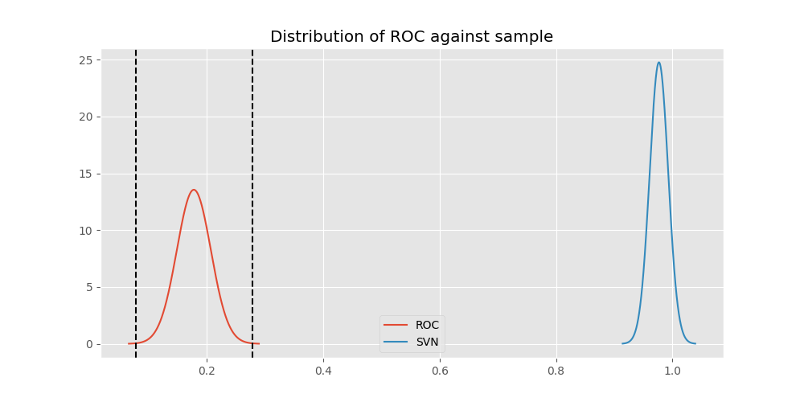 
## Testing Results for ROC against AUS 
ROC has a success rate of 0.17751479289940827
AUS has a success rate of 0.7289377289377289
$H_{0}$: There is not a difference between ROC and AUS
$H_{A}$: There is a difference between ROC and AUS
An $/alpha$ of 0.0008064516129032258 was used in this test.
__independent t-testing__: With a t-statistic of -13.328134826808473 and a p-value of 2.793116948327872e-34, _we **reject** the null hypothssis_
__Man-Whitney testing__: With a u-statistic of 10348.0 and a p-value of 2.0279446522928302e-29, _we **reject** the null hypothssis_
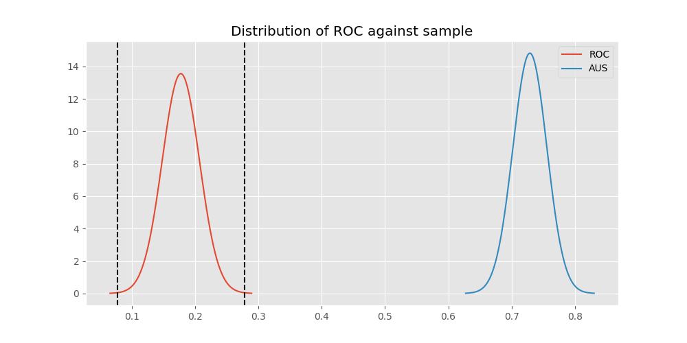 
## Testing Results for ROC against UKR 
ROC has a success rate of 0.17751479289940827
UKR has a success rate of 0.981549815498155
$H_{0}$: There is not a difference between ROC and UKR
$H_{A}$: There is a difference between ROC and UKR
An $/alpha$ of 0.0008064516129032258 was used in this test.
__independent t-testing__: With a t-statistic of -26.278735310995774 and a p-value of 7.245383867121832e-66, _we **reject** the null hypothssis_
__Man-Whitney testing__: With a u-statistic of 4487.5 and a p-value of 2.7852596407761565e-68, _we **reject** the null hypothssis_
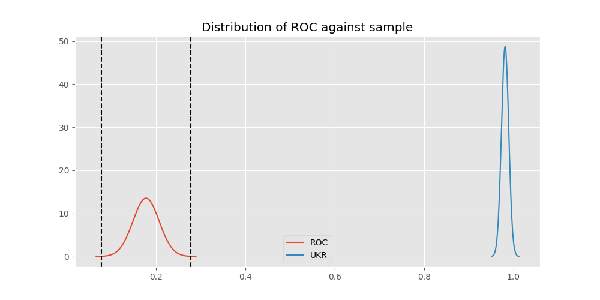 
## Testing Results for ROC against CIS 
ROC has a success rate of 0.17751479289940827
CIS has a success rate of 0.837386018237082
$H_{0}$: There is not a difference between ROC and CIS
$H_{A}$: There is a difference between ROC and CIS
An $/alpha$ of 0.0008064516129032258 was used in this test.
__independent t-testing__: With a t-statistic of -20.55958575715903 and a p-value of 3.714515386195179e-76, _we **reject** the null hypothssis_
__Man-Whitney testing__: With a u-statistic of 18911.5 and a p-value of 8.194638676985894e-63, _we **reject** the null hypothssis_
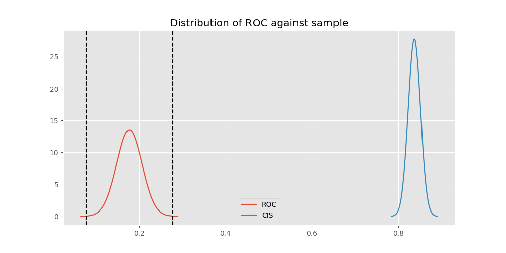 
## Testing Results for ROC against SAFR 
ROC has a success rate of 0.17751479289940827
SAFR has a success rate of 0.9328358208955224
$H_{0}$: There is not a difference between ROC and SAFR
$H_{A}$: There is a difference between ROC and SAFR
An $/alpha$ of 0.0008064516129032258 was used in this test.
__independent t-testing__: With a t-statistic of -19.70024589596001 and a p-value of 4.453170747424458e-56, _we **reject** the null hypothssis_
__Man-Whitney testing__: With a u-statistic of 2770.5 and a p-value of 7.157470504860569e-39, _we **reject** the null hypothssis_
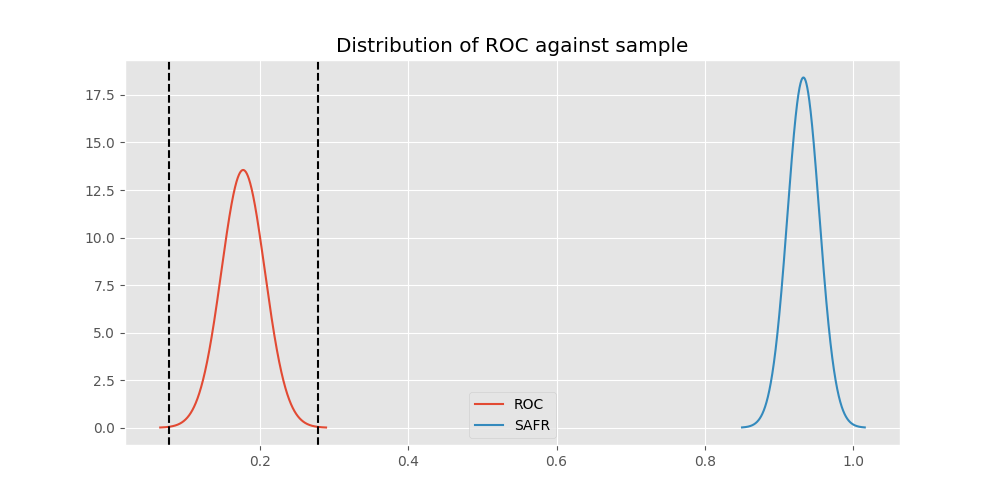 
## Testing Results for ROC against TBD 
ROC has a success rate of 0.17751479289940827
TBD has a success rate of 0.9898734177215189
$H_{0}$: There is not a difference between ROC and TBD
$H_{A}$: There is a difference between ROC and TBD
An $/alpha$ of 0.0008064516129032258 was used in this test.
__independent t-testing__: With a t-statistic of -27.161606770855556 and a p-value of 3.3649982287040054e-65, _we **reject** the null hypothssis_
__Man-Whitney testing__: With a u-statistic of 6263.0 and a p-value of 1.373343250488629e-91, _we **reject** the null hypothssis_
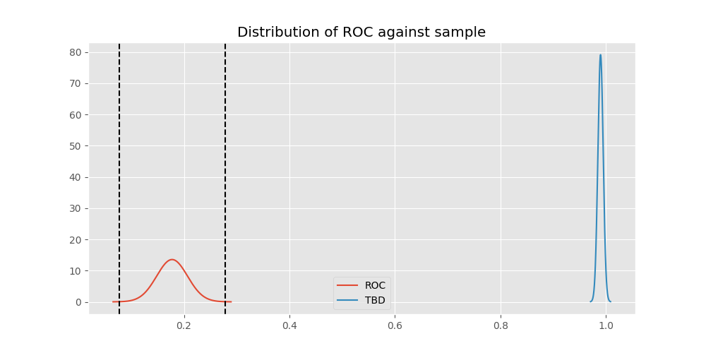 
## Testing Results for ROC against ESA 
ROC has a success rate of 0.17751479289940827
ESA has a success rate of 0.9811320754716981
$H_{0}$: There is not a difference between ROC and ESA
$H_{A}$: There is a difference between ROC and ESA
An $/alpha$ of 0.0008064516129032258 was used in this test.
__independent t-testing__: With a t-statistic of -24.85501266631925 and a p-value of 7.58850327153242e-67, _we **reject** the null hypothssis_
__Man-Whitney testing__: With a u-statistic of 1759.0 and a p-value of 2.2963531612210824e-38, _we **reject** the null hypothssis_
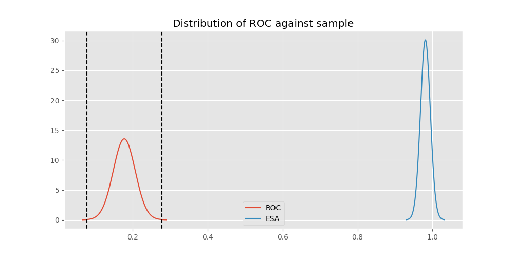 
## Testing Results for ROC against UK 
ROC has a success rate of 0.17751479289940827
UK has a success rate of 0.9881796690307328
$H_{0}$: There is not a difference between ROC and UK
$H_{A}$: There is a difference between ROC and UK
An $/alpha$ of 0.0008064516129032258 was used in this test.
__independent t-testing__: With a t-statistic of -27.2827381630084 and a p-value of 1.2252190126803959e-64, _we **reject** the null hypothssis_
__Man-Whitney testing__: With a u-statistic of 13535.0 and a p-value of 1.365060057872485e-162, _we **reject** the null hypothssis_
 
## Testing Results for ROC against GER 
ROC has a success rate of 0.17751479289940827
GER has a success rate of 0.9766233766233766
$H_{0}$: There is not a difference between ROC and GER
$H_{A}$: There is a difference between ROC and GER
An $/alpha$ of 0.0008064516129032258 was used in this test.
__independent t-testing__: With a t-statistic of -26.95395851514354 and a p-value of 1.2892137051657456e-63, _we **reject** the null hypothssis_
__Man-Whitney testing__: With a u-statistic of 39213.0 and a p-value of 1.9469177084204907e-306, _we **reject** the null hypothssis_
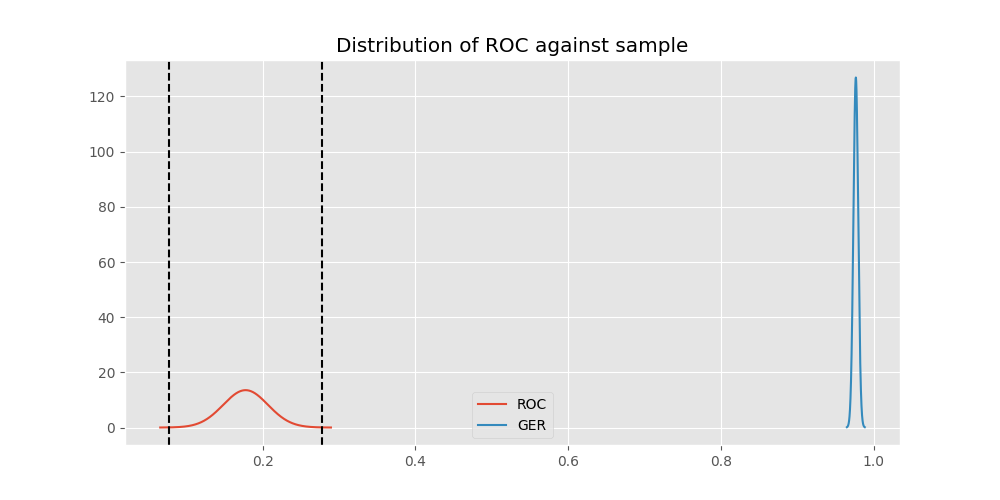 
