# Testing Results For RP 
$H_{0}$: There is not a difference in collection success against RP 
$H_{A}$: There is a difference in collection success against RP
An $\alpha$ of 0.0008064516129032258 was used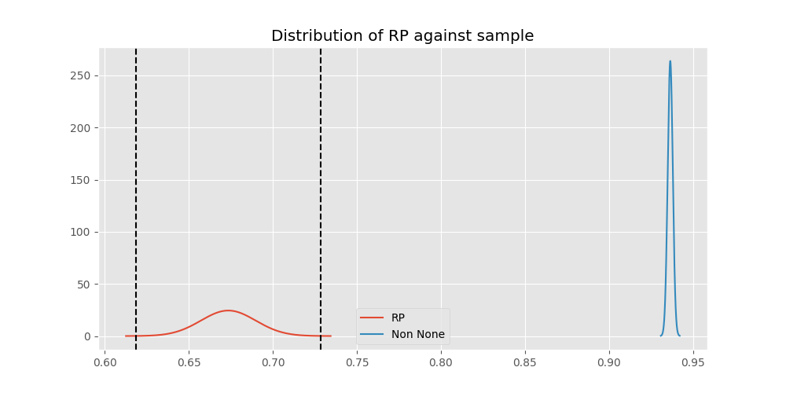 
Out of 25 tests, there were 23 rejections from 25 independent-t test.
Out of 25 tests, there were 23 rejections from 25 Man Whitney u-tests.
## Testing Results for RP against IND 
RP has a success rate of 0.6735187424425635
IND has a success rate of 0.9704433497536946
$H_{0}$: There is not a difference between RP and IND
$H_{A}$: There is a difference between RP and IND
An $/alpha$ of 0.0008064516129032258 was used in this test.
__independent t-testing__: With a t-statistic of -16.173685678895925 and a p-value of 3.3522368160980567e-53, _we **reject** the null hypothssis_
__Man-Whitney testing__: With a u-statistic of 118033.0 and a p-value of 2.0087586264610584e-31, _we **reject** the null hypothssis_
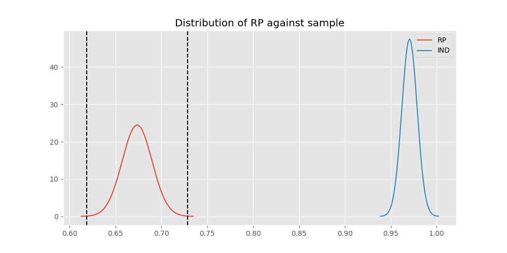 
## Testing Results for RP against GUAT 
RP has a success rate of 0.6735187424425635
GUAT has a success rate of 0.9705882352941176
$H_{0}$: There is not a difference between RP and GUAT
$H_{A}$: There is a difference between RP and GUAT
An $/alpha$ of 0.0008064516129032258 was used in this test.
__independent t-testing__: With a t-statistic of -11.290583249813945 and a p-value of 1.8601667103101576e-22, _we **reject** the null hypothssis_
__Man-Whitney testing__: With a u-statistic of 19765.0 and a p-value of 3.111295533468898e-07, _we **reject** the null hypothssis_
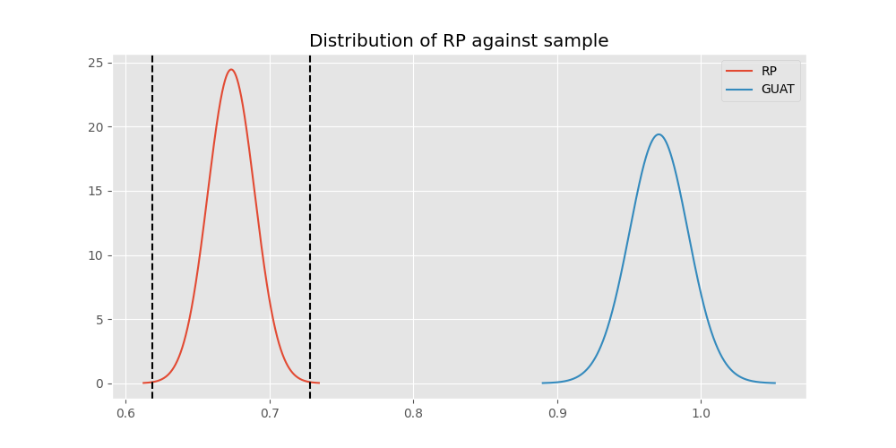 
## Testing Results for RP against IT 
RP has a success rate of 0.6735187424425635
IT has a success rate of 0.9217391304347826
$H_{0}$: There is not a difference between RP and IT
$H_{A}$: There is a difference between RP and IT
An $/alpha$ of 0.0008064516129032258 was used in this test.
__independent t-testing__: With a t-statistic of -13.734761649236921 and a p-value of 7.71153270543527e-41, _we **reject** the null hypothssis_
__Man-Whitney testing__: With a u-statistic of 285992.0 and a p-value of 6.24980689033007e-39, _we **reject** the null hypothssis_
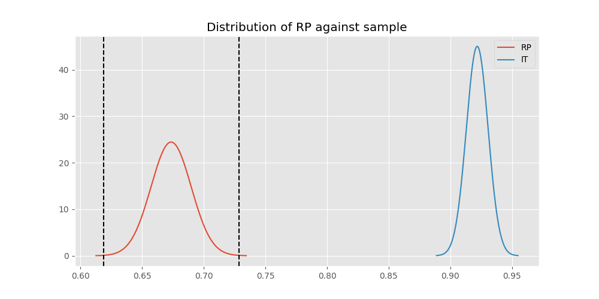 
## Testing Results for RP against EST 
RP has a success rate of 0.6735187424425635
EST has a success rate of 0.975
$H_{0}$: There is not a difference between RP and EST
$H_{A}$: There is a difference between RP and EST
An $/alpha$ of 0.0008064516129032258 was used in this test.
__independent t-testing__: With a t-statistic of -10.098799871470861 and a p-value of 7.47818547951946e-16, _we **reject** the null hypothssis_
__Man-Whitney testing__: With a u-statistic of 11553.5 and a p-value of 5.952707109104407e-05, _we **reject** the null hypothssis_
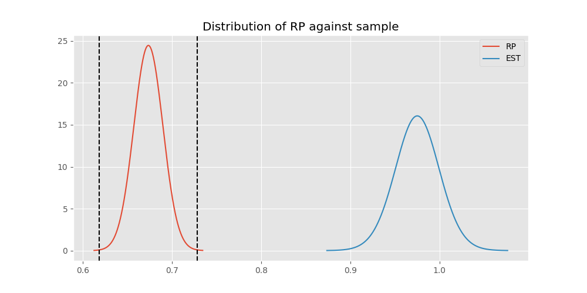 
## Testing Results for RP against SKOR 
RP has a success rate of 0.6735187424425635
SKOR has a success rate of 0.9166666666666666
$H_{0}$: There is not a difference between RP and SKOR
$H_{A}$: There is a difference between RP and SKOR
An $/alpha$ of 0.0008064516129032258 was used in this test.
__independent t-testing__: With a t-statistic of -3.9622960270612464 and a p-value of 8.02080301402496e-05, _we **reject** the null hypothssis_
__Man-Whitney testing__: With a u-statistic of 18777.5 and a p-value of 8.512120853176641e-05, _we **reject** the null hypothssis_
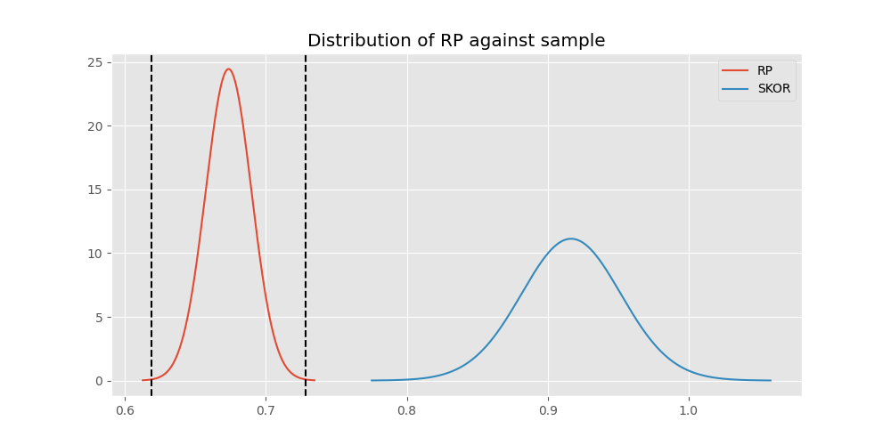 
## Testing Results for RP against JPN 
RP has a success rate of 0.6735187424425635
JPN has a success rate of 0.6016371077762619
$H_{0}$: There is not a difference between RP and JPN
$H_{A}$: There is a difference between RP and JPN
An $/alpha$ of 0.0008064516129032258 was used in this test.
__independent t-testing__: With a t-statistic of 2.957937725898757 and a p-value of 0.003143720085633095, _we failed to reject the null hypothssis_
__Man-Whitney testing__: With a u-statistic of 324882.5 and a p-value of 0.0031721308855370287, _we failed to reject the null hypothssis_
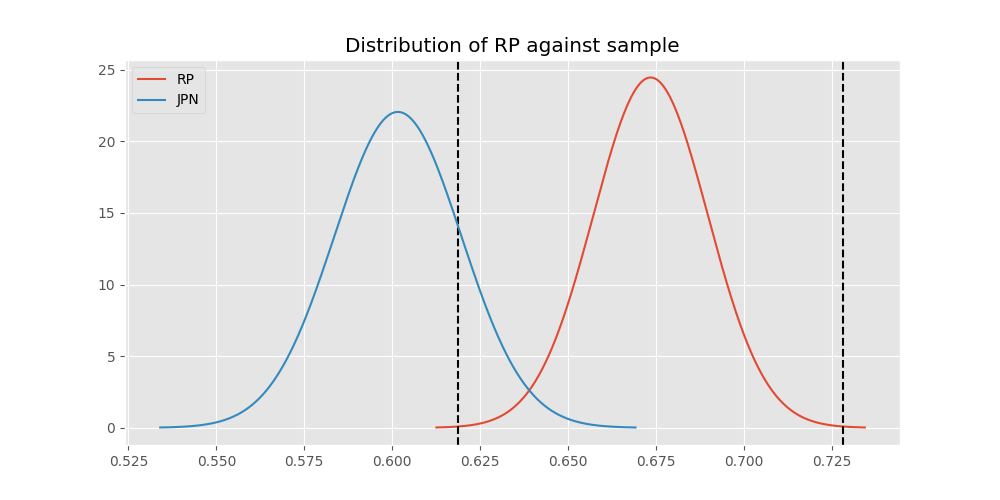 
## Testing Results for RP against US 
RP has a success rate of 0.6735187424425635
US has a success rate of 0.918885774351787
$H_{0}$: There is not a difference between RP and US
$H_{A}$: There is a difference between RP and US
An $/alpha$ of 0.0008064516129032258 was used in this test.
__independent t-testing__: With a t-statistic of -21.629422409555847 and a p-value of 2.918355451632686e-100, _we **reject** the null hypothssis_
__Man-Whitney testing__: With a u-statistic of 1781128.5 and a p-value of 5.845207027183763e-97, _we **reject** the null hypothssis_
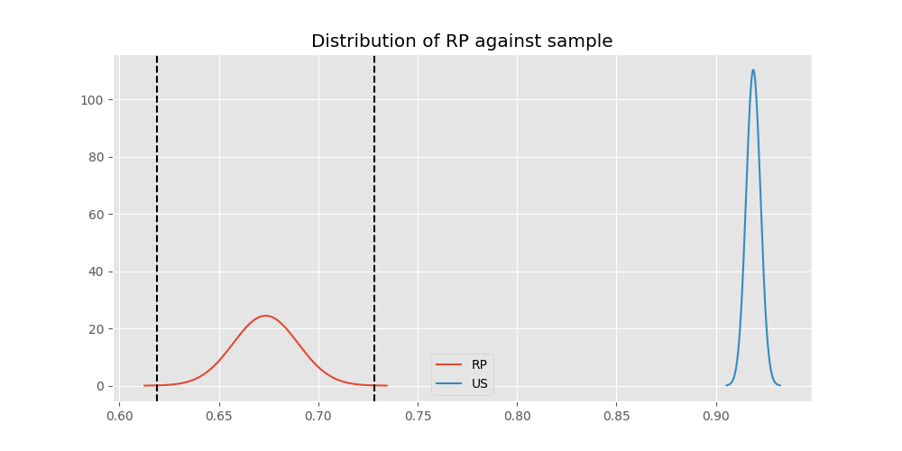 
## Testing Results for RP against KAZ 
RP has a success rate of 0.6735187424425635
KAZ has a success rate of 0.989010989010989
$H_{0}$: There is not a difference between RP and KAZ
$H_{A}$: There is a difference between RP and KAZ
An $/alpha$ of 0.0008064516129032258 was used in this test.
__independent t-testing__: With a t-statistic of -17.466595697162717 and a p-value of 7.056027752155062e-60, _we **reject** the null hypothssis_
__Man-Whitney testing__: With a u-statistic of 51514.0 and a p-value of 3.985365634371595e-18, _we **reject** the null hypothssis_
 
## Testing Results for RP against ROC 
RP has a success rate of 0.6735187424425635
ROC has a success rate of 0.17751479289940827
$H_{0}$: There is not a difference between RP and ROC
$H_{A}$: There is a difference between RP and ROC
An $/alpha$ of 0.0008064516129032258 was used in this test.
__independent t-testing__: With a t-statistic of 12.89017615434443 and a p-value of 2.876300463910149e-35, _we **reject** the null hypothssis_
__Man-Whitney testing__: With a u-statistic of 104543.0 and a p-value of 7.564621363471199e-33, _we **reject** the null hypothssis_
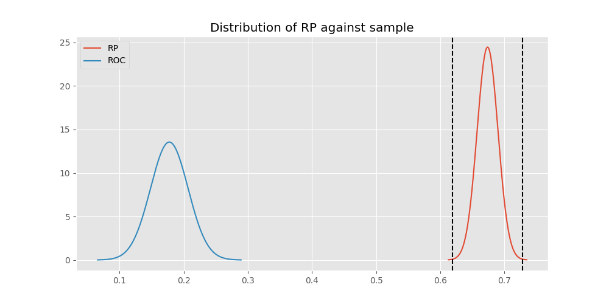 
## Testing Results for RP against THAI 
RP has a success rate of 0.6735187424425635
THAI has a success rate of 0.9880952380952381
$H_{0}$: There is not a difference between RP and THAI
$H_{A}$: There is a difference between RP and THAI
An $/alpha$ of 0.0008064516129032258 was used in this test.
__independent t-testing__: With a t-statistic of -17.14499137976606 and a p-value of 7.78109411827354e-58, _we **reject** the null hypothssis_
__Man-Whitney testing__: With a u-statistic of 47615.0 and a p-value of 7.677595012828063e-17, _we **reject** the null hypothssis_
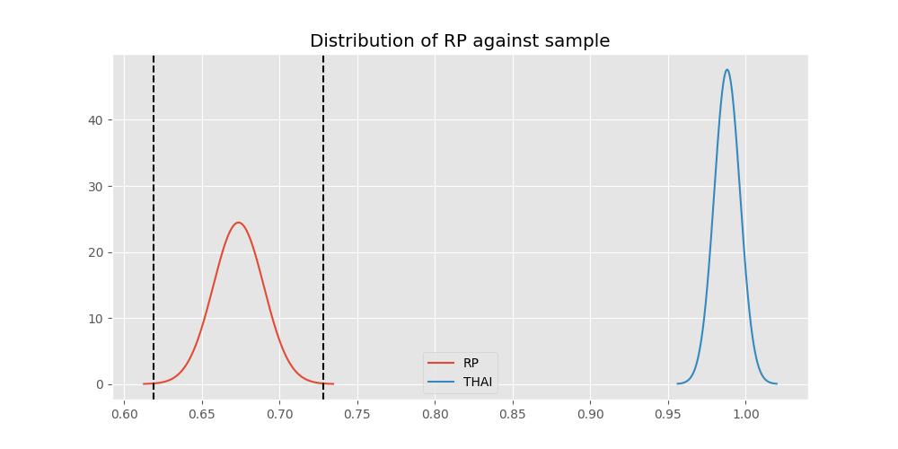 
## Testing Results for RP against FR 
RP has a success rate of 0.6735187424425635
FR has a success rate of 0.908183632734531
$H_{0}$: There is not a difference between RP and FR
$H_{A}$: There is a difference between RP and FR
An $/alpha$ of 0.0008064516129032258 was used in this test.
__independent t-testing__: With a t-statistic of -10.093245073184734 and a p-value of 3.951727302899332e-23, _we **reject** the null hypothssis_
__Man-Whitney testing__: With a u-statistic of 158549.5 and a p-value of 2.243906604441353e-22, _we **reject** the null hypothssis_
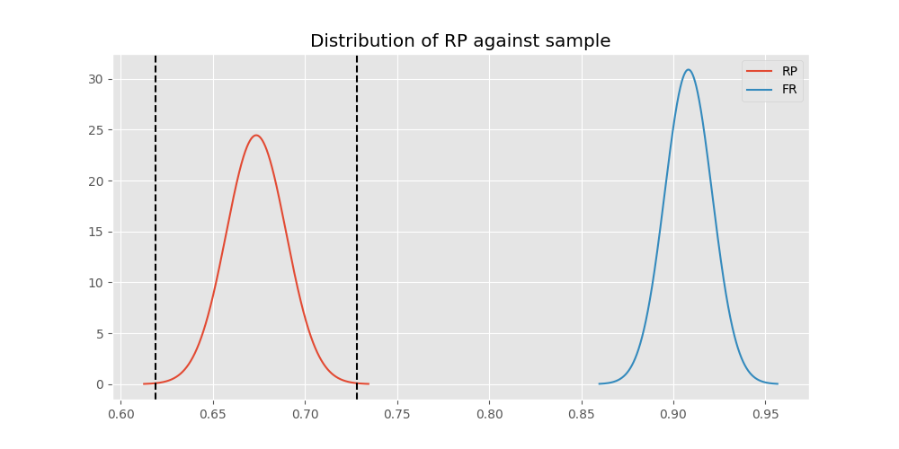 
## Testing Results for RP against TURK 
RP has a success rate of 0.6735187424425635
TURK has a success rate of 0.9962264150943396
$H_{0}$: There is not a difference between RP and TURK
$H_{A}$: There is a difference between RP and TURK
An $/alpha$ of 0.0008064516129032258 was used in this test.
__independent t-testing__: With a t-statistic of -19.269921212624133 and a p-value of 1.2141814890411412e-69, _we **reject** the null hypothssis_
__Man-Whitney testing__: With a u-statistic of 74216.0 and a p-value of 3.738510756582525e-26, _we **reject** the null hypothssis_
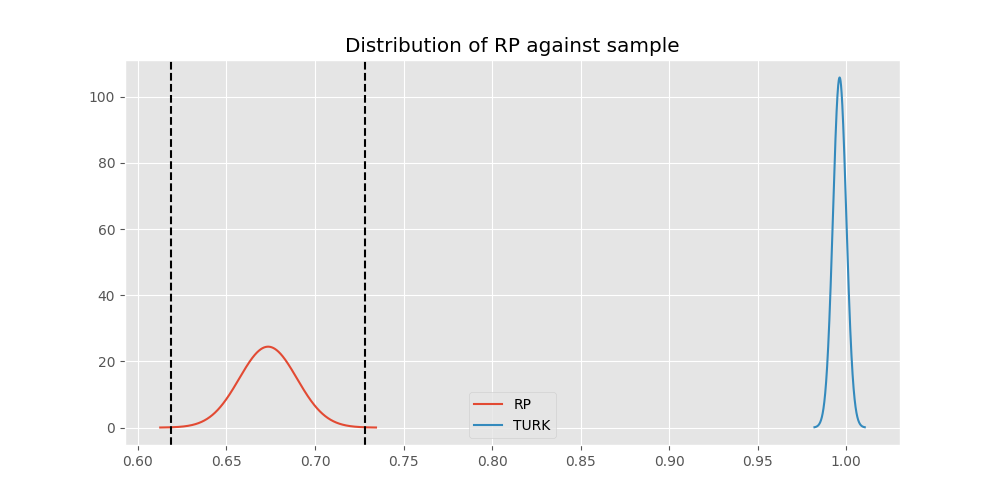 
## Testing Results for RP against PRC 
RP has a success rate of 0.6735187424425635
PRC has a success rate of 0.988759187202767
$H_{0}$: There is not a difference between RP and PRC
$H_{A}$: There is a difference between RP and PRC
An $/alpha$ of 0.0008064516129032258 was used in this test.
__independent t-testing__: With a t-statistic of -19.148805993574836 and a p-value of 2.6624205087084507e-68, _we **reject** the null hypothssis_
__Man-Whitney testing__: With a u-statistic of 654921.5 and a p-value of 3.6191019078408783e-156, _we **reject** the null hypothssis_
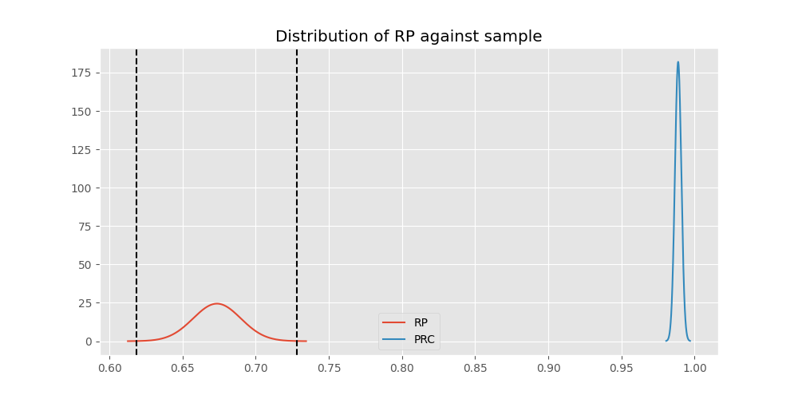 
## Testing Results for RP against BEL 
RP has a success rate of 0.6735187424425635
BEL has a success rate of 0.8883495145631068
$H_{0}$: There is not a difference between RP and BEL
$H_{A}$: There is a difference between RP and BEL
An $/alpha$ of 0.0008064516129032258 was used in this test.
__independent t-testing__: With a t-statistic of -6.228497581164248 and a p-value of 6.847175187918095e-10, _we **reject** the null hypothssis_
__Man-Whitney testing__: With a u-statistic of 66881.5 and a p-value of 9.516242944295418e-10, _we **reject** the null hypothssis_
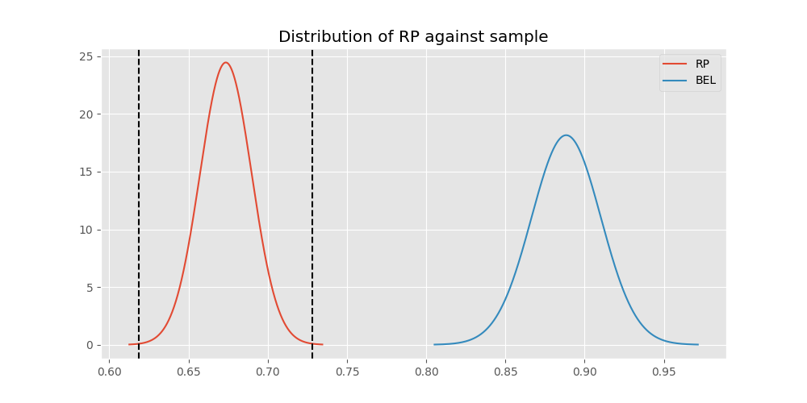 
## Testing Results for RP against POL 
RP has a success rate of 0.6735187424425635
POL has a success rate of 0.979381443298969
$H_{0}$: There is not a difference between RP and POL
$H_{A}$: There is a difference between RP and POL
An $/alpha$ of 0.0008064516129032258 was used in this test.
__independent t-testing__: With a t-statistic of -17.430008809002832 and a p-value of 5.041138864019199e-60, _we **reject** the null hypothssis_
__Man-Whitney testing__: With a u-statistic of 139207.5 and a p-value of 6.562101194199868e-39, _we **reject** the null hypothssis_
 
## Testing Results for RP against LTU 
RP has a success rate of 0.6735187424425635
LTU has a success rate of 0.984375
$H_{0}$: There is not a difference between RP and LTU
$H_{A}$: There is a difference between RP and LTU
An $/alpha$ of 0.0008064516129032258 was used in this test.
__independent t-testing__: With a t-statistic of -17.530689274465836 and a p-value of 1.2542599489213674e-60, _we **reject** the null hypothssis_
__Man-Whitney testing__: With a u-statistic of 91187.5 and a p-value of 2.078638097416989e-28, _we **reject** the null hypothssis_
 
## Testing Results for RP against SVN 
RP has a success rate of 0.6735187424425635
SVN has a success rate of 0.9770114942528736
$H_{0}$: There is not a difference between RP and SVN
$H_{A}$: There is a difference between RP and SVN
An $/alpha$ of 0.0008064516129032258 was used in this test.
__independent t-testing__: With a t-statistic of -13.215646372575923 and a p-value of 4.71492561722858e-32, _we **reject** the null hypothssis_
__Man-Whitney testing__: With a u-statistic of 25056.5 and a p-value of 3.955252669465662e-09, _we **reject** the null hypothssis_
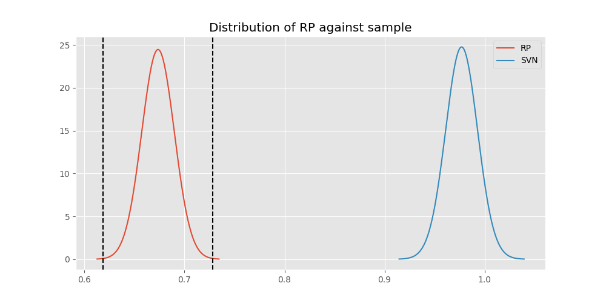 
## Testing Results for RP against AUS 
RP has a success rate of 0.6735187424425635
AUS has a success rate of 0.7289377289377289
$H_{0}$: There is not a difference between RP and AUS
$H_{A}$: There is a difference between RP and AUS
An $/alpha$ of 0.0008064516129032258 was used in this test.
__independent t-testing__: With a t-statistic of -1.713300162630588 and a p-value of 0.08693961065231083, _we failed to reject the null hypothssis_
__Man-Whitney testing__: With a u-statistic of 106629.5 and a p-value of 0.08695994640331006, _we failed to reject the null hypothssis_
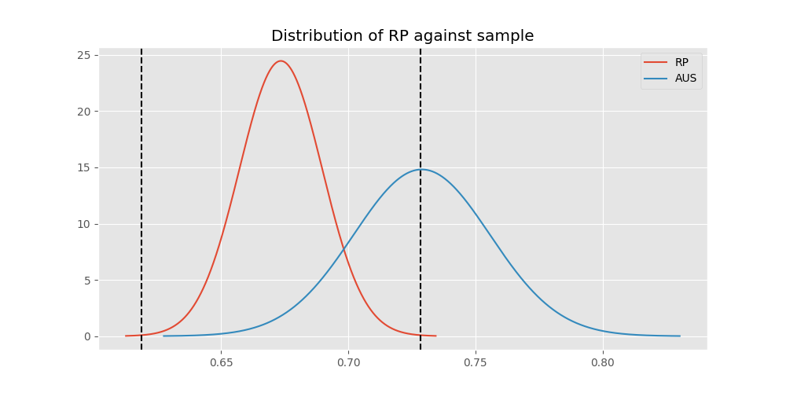 
## Testing Results for RP against UKR 
RP has a success rate of 0.6735187424425635
UKR has a success rate of 0.981549815498155
$H_{0}$: There is not a difference between RP and UKR
$H_{A}$: There is a difference between RP and UKR
An $/alpha$ of 0.0008064516129032258 was used in this test.
__independent t-testing__: With a t-statistic of -16.872769814335108 and a p-value of 6.785110305380694e-57, _we **reject** the null hypothssis_
__Man-Whitney testing__: With a u-statistic of 77541.0 and a p-value of 3.237806474955346e-24, _we **reject** the null hypothssis_
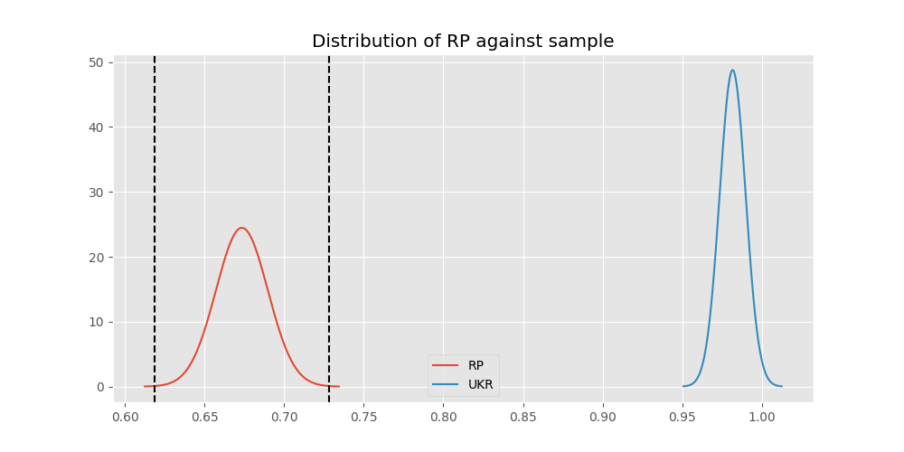 
## Testing Results for RP against CIS 
RP has a success rate of 0.6735187424425635
CIS has a success rate of 0.837386018237082
$H_{0}$: There is not a difference between RP and CIS
$H_{A}$: There is a difference between RP and CIS
An $/alpha$ of 0.0008064516129032258 was used in this test.
__independent t-testing__: With a t-statistic of -7.331959707055086 and a p-value of 3.71475177759593e-13, _we **reject** the null hypothssis_
__Man-Whitney testing__: With a u-statistic of 227497.5 and a p-value of 5.807583597568193e-13, _we **reject** the null hypothssis_
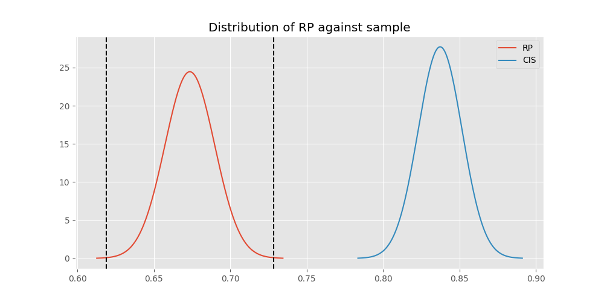 
## Testing Results for RP against SAFR 
RP has a success rate of 0.6735187424425635
SAFR has a success rate of 0.9328358208955224
$H_{0}$: There is not a difference between RP and SAFR
$H_{A}$: There is a difference between RP and SAFR
An $/alpha$ of 0.0008064516129032258 was used in this test.
__independent t-testing__: With a t-statistic of -6.252109745667473 and a p-value of 6.086982967384351e-10, _we **reject** the null hypothssis_
__Man-Whitney testing__: With a u-statistic of 41040.5 and a p-value of 8.708713440734534e-10, _we **reject** the null hypothssis_
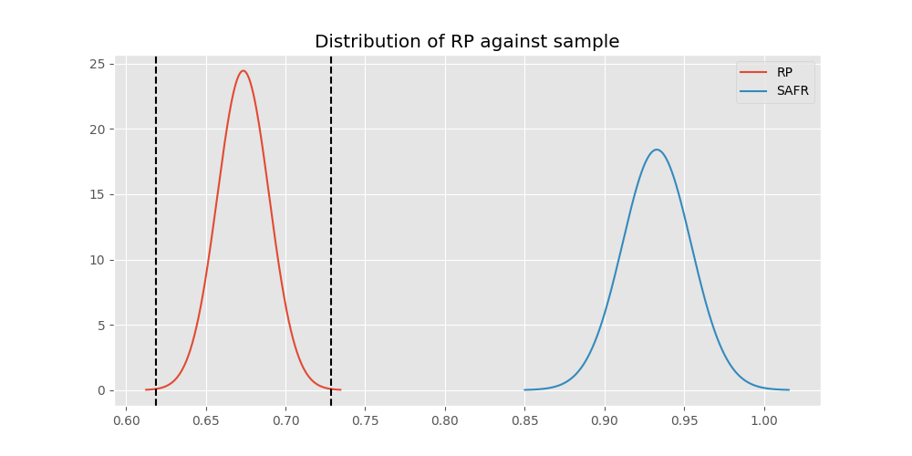 
## Testing Results for RP against TBD 
RP has a success rate of 0.6735187424425635
TBD has a success rate of 0.9898734177215189
$H_{0}$: There is not a difference between RP and TBD
$H_{A}$: There is a difference between RP and TBD
An $/alpha$ of 0.0008064516129032258 was used in this test.
__independent t-testing__: With a t-statistic of -18.524239272617763 and a p-value of 7.507490244763537e-66, _we **reject** the null hypothssis_
__Man-Whitney testing__: With a u-statistic of 111661.5 and a p-value of 2.7292555519352585e-35, _we **reject** the null hypothssis_
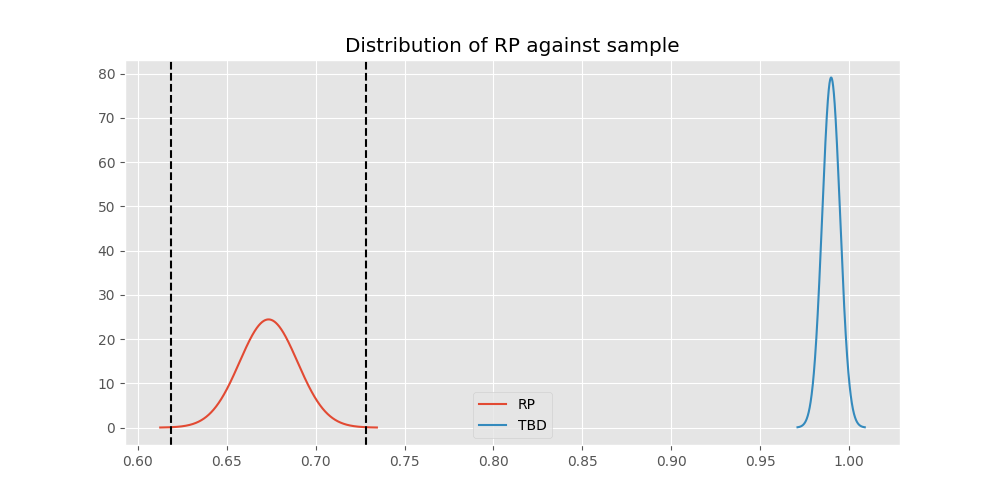 
## Testing Results for RP against ESA 
RP has a success rate of 0.6735187424425635
ESA has a success rate of 0.9811320754716981
$H_{0}$: There is not a difference between RP and ESA
$H_{A}$: There is a difference between RP and ESA
An $/alpha$ of 0.0008064516129032258 was used in this test.
__independent t-testing__: With a t-statistic of -14.623137340367913 and a p-value of 9.971432501859152e-41, _we **reject** the null hypothssis_
__Man-Whitney testing__: With a u-statistic of 30348.0 and a p-value of 5.4832557609891105e-11, _we **reject** the null hypothssis_
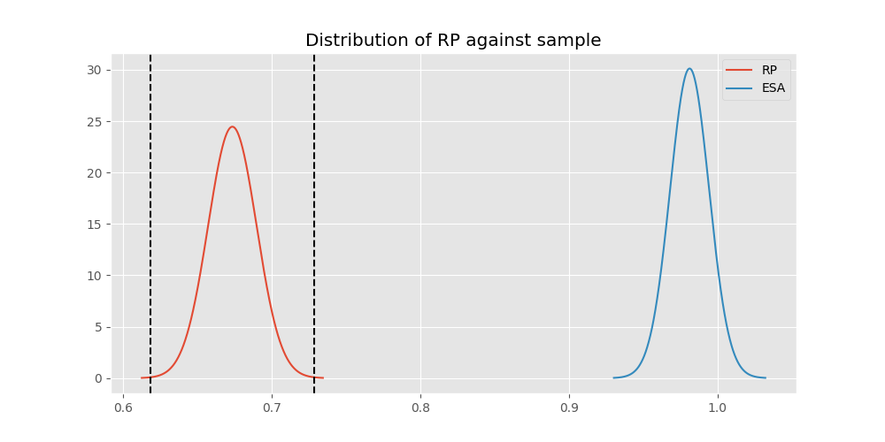 
## Testing Results for RP against UK 
RP has a success rate of 0.6735187424425635
UK has a success rate of 0.9881796690307328
$H_{0}$: There is not a difference between RP and UK
$H_{A}$: There is a difference between RP and UK
An $/alpha$ of 0.0008064516129032258 was used in this test.
__independent t-testing__: With a t-statistic of -18.803399478346662 and a p-value of 6.563973841517115e-67, _we **reject** the null hypothssis_
__Man-Whitney testing__: With a u-statistic of 239746.0 and a p-value of 1.5208017248258414e-66, _we **reject** the null hypothssis_
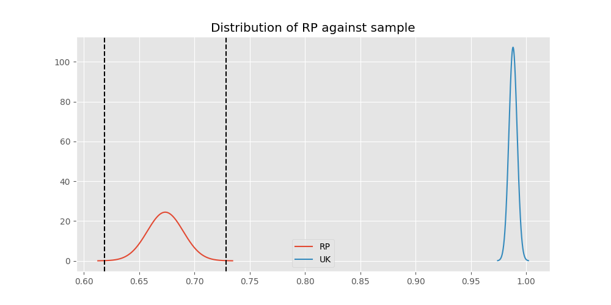 
## Testing Results for RP against GER 
RP has a success rate of 0.6735187424425635
GER has a success rate of 0.9766233766233766
$H_{0}$: There is not a difference between RP and GER
$H_{A}$: There is a difference between RP and GER
An $/alpha$ of 0.0008064516129032258 was used in this test.
__independent t-testing__: With a t-statistic of -18.241462979634488 and a p-value of 2.1924066958985728e-63, _we **reject** the null hypothssis_
__Man-Whitney testing__: With a u-statistic of 665664.0 and a p-value of 2.3784914483551017e-133, _we **reject** the null hypothssis_
 
