# Testing Results For SAFR 
$H_{0}$: There is not a difference in collection success against SAFR 
$H_{A}$: There is a difference in collection success against SAFR
An $\alpha$ of 0.0008064516129032258 was used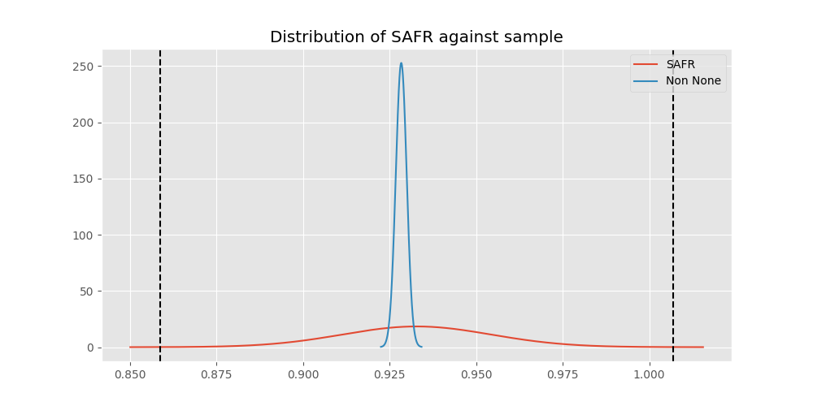 
Out of 25 tests, there were 4 rejections from 25 independent-t test.
Out of 25 tests, there were 8 rejections from 25 Man Whitney u-tests.
## Testing Results for SAFR against IND 
SAFR has a success rate of 0.9328358208955224
IND has a success rate of 0.9704433497536946
$H_{0}$: There is not a difference between SAFR and IND
$H_{A}$: There is a difference between SAFR and IND
An $/alpha$ of 0.0008064516129032258 was used in this test.
__independent t-testing__: With a t-statistic of -1.9558091920705956 and a p-value of 0.05100477693517752, _we failed to reject the null hypothssis_
__Man-Whitney testing__: With a u-statistic of 26179.0 and a p-value of 0.05120591099307721, _we failed to reject the null hypothssis_
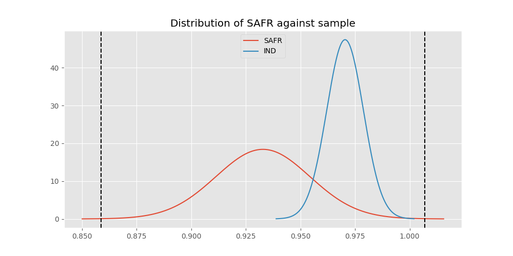 
## Testing Results for SAFR against GUAT 
SAFR has a success rate of 0.9328358208955224
GUAT has a success rate of 0.9705882352941176
$H_{0}$: There is not a difference between SAFR and GUAT
$H_{A}$: There is a difference between SAFR and GUAT
An $/alpha$ of 0.0008064516129032258 was used in this test.
__independent t-testing__: With a t-statistic of -1.1153212276746267 and a p-value of 0.2660511329420984, _we failed to reject the null hypothssis_
__Man-Whitney testing__: With a u-statistic of 4384.0 and a p-value of 0.26639414836436337, _we failed to reject the null hypothssis_
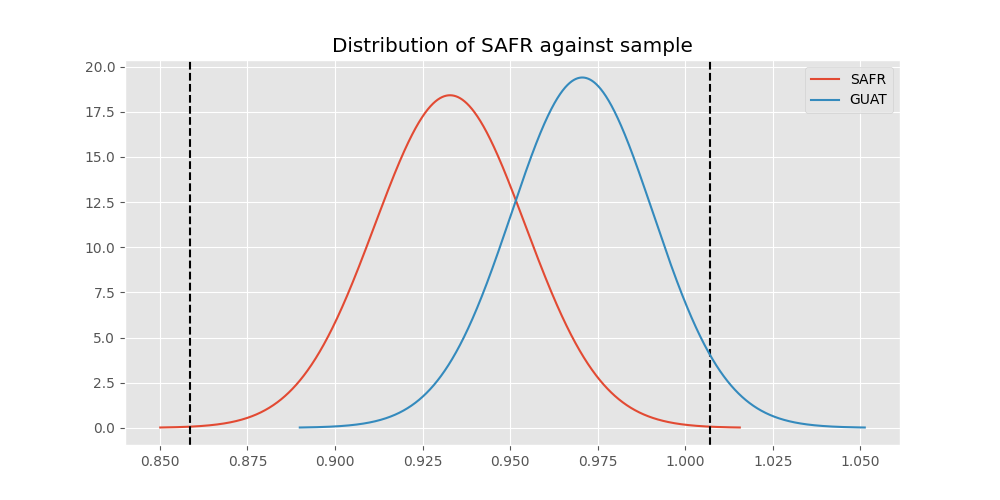 
## Testing Results for SAFR against IT 
SAFR has a success rate of 0.9328358208955224
IT has a success rate of 0.9217391304347826
$H_{0}$: There is not a difference between SAFR and IT
$H_{A}$: There is a difference between SAFR and IT
An $/alpha$ of 0.0008064516129032258 was used in this test.
__independent t-testing__: With a t-statistic of 0.4501845164606476 and a p-value of 0.6526701532927088, _we failed to reject the null hypothssis_
__Man-Whitney testing__: With a u-statistic of 62324.0 and a p-value of 0.6526918037805368, _we failed to reject the null hypothssis_
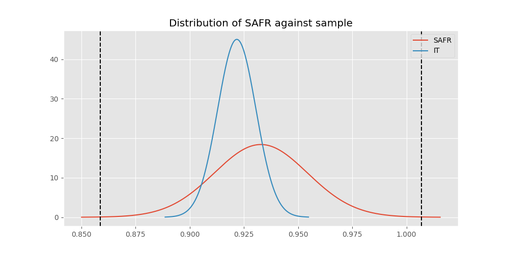 
## Testing Results for SAFR against EST 
SAFR has a success rate of 0.9328358208955224
EST has a success rate of 0.975
$H_{0}$: There is not a difference between SAFR and EST
$H_{A}$: There is a difference between SAFR and EST
An $/alpha$ of 0.0008064516129032258 was used in this test.
__independent t-testing__: With a t-statistic of -1.002613948549382 and a p-value of 0.3174555865306647, _we failed to reject the null hypothssis_
__Man-Whitney testing__: With a u-statistic of 2567.0 and a p-value of 0.3182005661603432, _we failed to reject the null hypothssis_
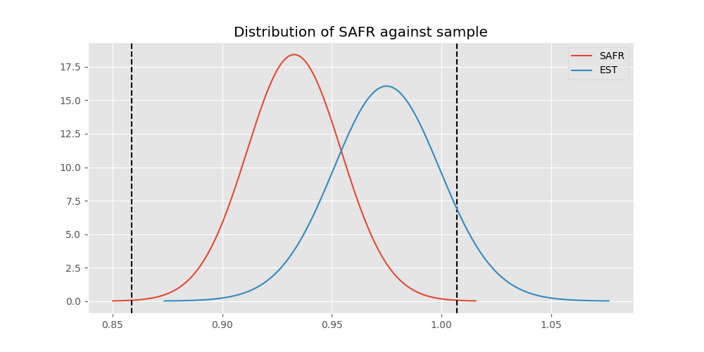 
## Testing Results for SAFR against SKOR 
SAFR has a success rate of 0.9328358208955224
SKOR has a success rate of 0.9166666666666666
$H_{0}$: There is not a difference between SAFR and SKOR
$H_{A}$: There is a difference between SAFR and SKOR
An $/alpha$ of 0.0008064516129032258 was used in this test.
__independent t-testing__: With a t-statistic of 0.40035649178738814 and a p-value of 0.6893390683083949, _we failed to reject the null hypothssis_
__Man-Whitney testing__: With a u-statistic of 4085.0 and a p-value of 0.6905241134645188, _we failed to reject the null hypothssis_
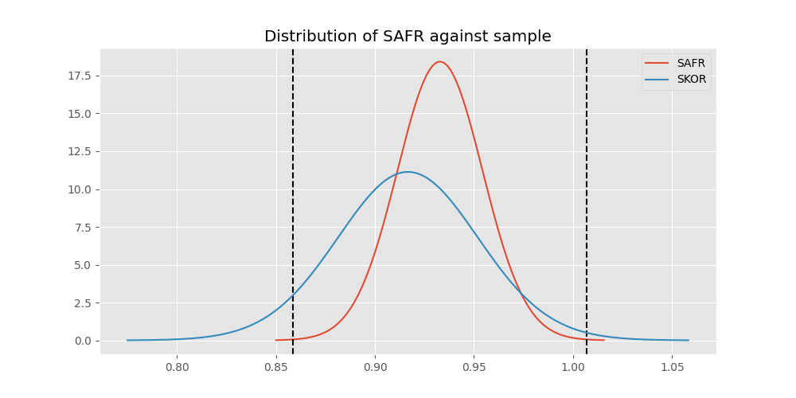 
## Testing Results for SAFR against RP 
SAFR has a success rate of 0.9328358208955224
RP has a success rate of 0.6735187424425635
$H_{0}$: There is not a difference between SAFR and RP
$H_{A}$: There is a difference between SAFR and RP
An $/alpha$ of 0.0008064516129032258 was used in this test.
__independent t-testing__: With a t-statistic of 6.252109745667473 and a p-value of 6.086982967384351e-10, _we **reject** the null hypothssis_
__Man-Whitney testing__: With a u-statistic of 69777.5 and a p-value of 8.708713440734534e-10, _we **reject** the null hypothssis_
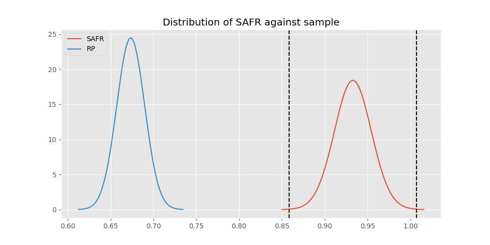 
## Testing Results for SAFR against JPN 
SAFR has a success rate of 0.9328358208955224
JPN has a success rate of 0.6016371077762619
$H_{0}$: There is not a difference between SAFR and JPN
$H_{A}$: There is a difference between SAFR and JPN
An $/alpha$ of 0.0008064516129032258 was used in this test.
__independent t-testing__: With a t-statistic of 7.64180284379652 and a p-value of 5.6833537718544813e-14, _we **reject** the null hypothssis_
__Man-Whitney testing__: With a u-statistic of 65376.5 and a p-value of 1.3591495517027263e-13, _we **reject** the null hypothssis_
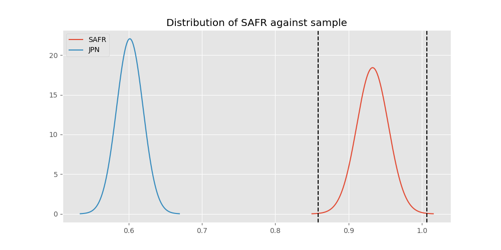 
## Testing Results for SAFR against US 
SAFR has a success rate of 0.9328358208955224
US has a success rate of 0.918885774351787
$H_{0}$: There is not a difference between SAFR and US
$H_{A}$: There is a difference between SAFR and US
An $/alpha$ of 0.0008064516129032258 was used in this test.
__independent t-testing__: With a t-statistic of 0.5856404582399014 and a p-value of 0.5581397838262816, _we failed to reject the null hypothssis_
__Man-Whitney testing__: With a u-statistic of 387771.0 and a p-value of 0.5581319072609857, _we failed to reject the null hypothssis_
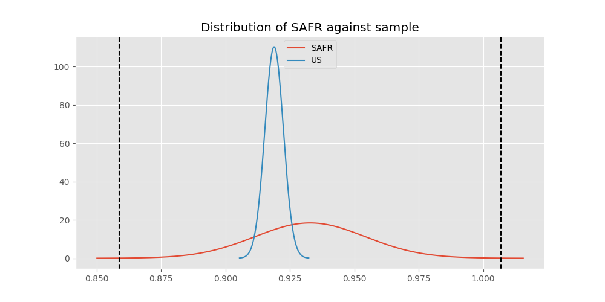 
## Testing Results for SAFR against KAZ 
SAFR has a success rate of 0.9328358208955224
KAZ has a success rate of 0.989010989010989
$H_{0}$: There is not a difference between SAFR and KAZ
$H_{A}$: There is a difference between SAFR and KAZ
An $/alpha$ of 0.0008064516129032258 was used in this test.
__independent t-testing__: With a t-statistic of -2.437514822469165 and a p-value of 0.01583705214469376, _we failed to reject the null hypothssis_
__Man-Whitney testing__: With a u-statistic of 11509.0 and a p-value of 0.007228851470583799, _we failed to reject the null hypothssis_
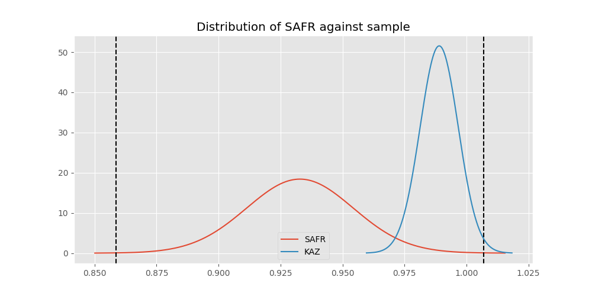 
## Testing Results for SAFR against ROC 
SAFR has a success rate of 0.9328358208955224
ROC has a success rate of 0.17751479289940827
$H_{0}$: There is not a difference between SAFR and ROC
$H_{A}$: There is a difference between SAFR and ROC
An $/alpha$ of 0.0008064516129032258 was used in this test.
__independent t-testing__: With a t-statistic of 19.70024589596001 and a p-value of 4.453170747424458e-56, _we **reject** the null hypothssis_
__Man-Whitney testing__: With a u-statistic of 19875.5 and a p-value of 7.157470504860569e-39, _we **reject** the null hypothssis_
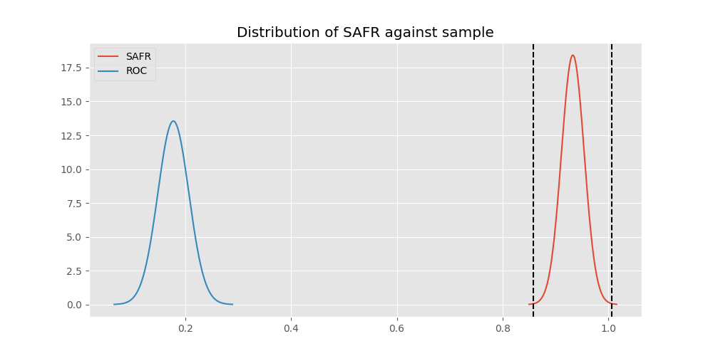 
## Testing Results for SAFR against THAI 
SAFR has a success rate of 0.9328358208955224
THAI has a success rate of 0.9880952380952381
$H_{0}$: There is not a difference between SAFR and THAI
$H_{A}$: There is a difference between SAFR and THAI
An $/alpha$ of 0.0008064516129032258 was used in this test.
__independent t-testing__: With a t-statistic of -2.3746607861680706 and a p-value of 0.018662235464513247, _we failed to reject the null hypothssis_
__Man-Whitney testing__: With a u-statistic of 10634.0 and a p-value of 0.011072131638100556, _we failed to reject the null hypothssis_
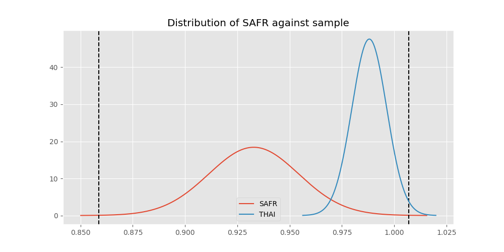 
## Testing Results for SAFR against FR 
SAFR has a success rate of 0.9328358208955224
FR has a success rate of 0.908183632734531
$H_{0}$: There is not a difference between SAFR and FR
$H_{A}$: There is a difference between SAFR and FR
An $/alpha$ of 0.0008064516129032258 was used in this test.
__independent t-testing__: With a t-statistic of 0.9003495536247891 and a p-value of 0.368276656677084, _we failed to reject the null hypothssis_
__Man-Whitney testing__: With a u-statistic of 34394.5 and a p-value of 0.3681522093515758, _we failed to reject the null hypothssis_
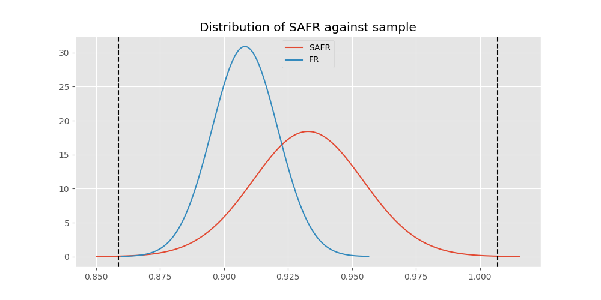 
## Testing Results for SAFR against TURK 
SAFR has a success rate of 0.9328358208955224
TURK has a success rate of 0.9962264150943396
$H_{0}$: There is not a difference between SAFR and TURK
$H_{A}$: There is a difference between SAFR and TURK
An $/alpha$ of 0.0008064516129032258 was used in this test.
__independent t-testing__: With a t-statistic of -2.877480537928249 and a p-value of 0.004632155069396717, _we failed to reject the null hypothssis_
__Man-Whitney testing__: With a u-statistic of 16629.5 and a p-value of 0.00013387794578510244, _we **reject** the null hypothssis_
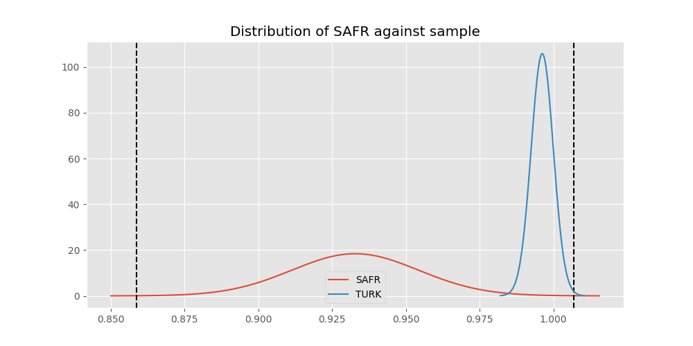 
## Testing Results for SAFR against PRC 
SAFR has a success rate of 0.9328358208955224
PRC has a success rate of 0.988759187202767
$H_{0}$: There is not a difference between SAFR and PRC
$H_{A}$: There is a difference between SAFR and PRC
An $/alpha$ of 0.0008064516129032258 was used in this test.
__independent t-testing__: With a t-statistic of -2.563556692601814 and a p-value of 0.011449556568776893, _we failed to reject the null hypothssis_
__Man-Whitney testing__: With a u-statistic of 146304.5 and a p-value of 1.1628236996568815e-07, _we **reject** the null hypothssis_
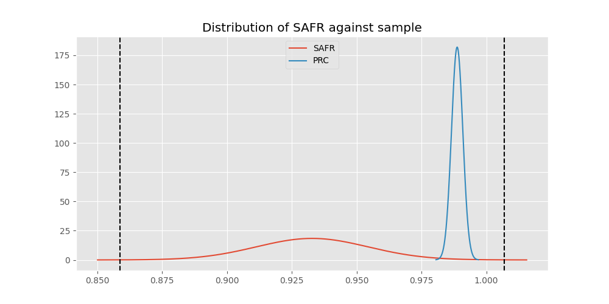 
## Testing Results for SAFR against BEL 
SAFR has a success rate of 0.9328358208955224
BEL has a success rate of 0.8883495145631068
$H_{0}$: There is not a difference between SAFR and BEL
$H_{A}$: There is a difference between SAFR and BEL
An $/alpha$ of 0.0008064516129032258 was used in this test.
__independent t-testing__: With a t-statistic of 1.372547229437559 and a p-value of 0.17080320313422054, _we failed to reject the null hypothssis_
__Man-Whitney testing__: With a u-statistic of 14416.0 and a p-value of 0.17079770712013465, _we failed to reject the null hypothssis_
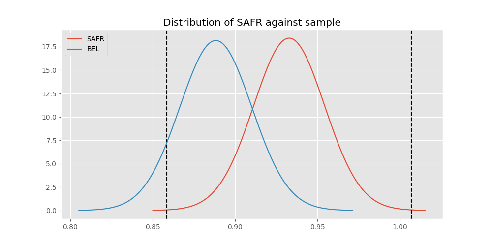 
## Testing Results for SAFR against POL 
SAFR has a success rate of 0.9328358208955224
POL has a success rate of 0.979381443298969
$H_{0}$: There is not a difference between SAFR and POL
$H_{A}$: There is a difference between SAFR and POL
An $/alpha$ of 0.0008064516129032258 was used in this test.
__independent t-testing__: With a t-statistic of -2.777735795829607 and a p-value of 0.005640329749783976, _we failed to reject the null hypothssis_
__Man-Whitney testing__: With a u-statistic of 30982.5 and a p-value of 0.00574746056729222, _we failed to reject the null hypothssis_
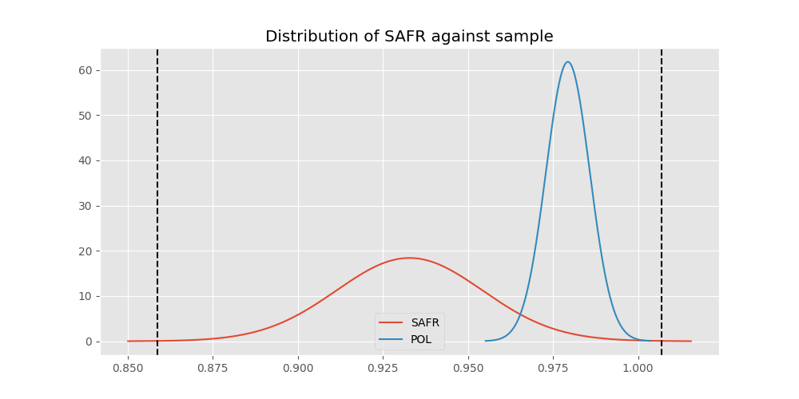 
## Testing Results for SAFR against LTU 
SAFR has a success rate of 0.9328358208955224
LTU has a success rate of 0.984375
$H_{0}$: There is not a difference between SAFR and LTU
$H_{A}$: There is a difference between SAFR and LTU
An $/alpha$ of 0.0008064516129032258 was used in this test.
__independent t-testing__: With a t-statistic of -2.2616823073089733 and a p-value of 0.025056065002005794, _we failed to reject the null hypothssis_
__Man-Whitney testing__: With a u-statistic of 20335.0 and a p-value of 0.003817542013790642, _we failed to reject the null hypothssis_
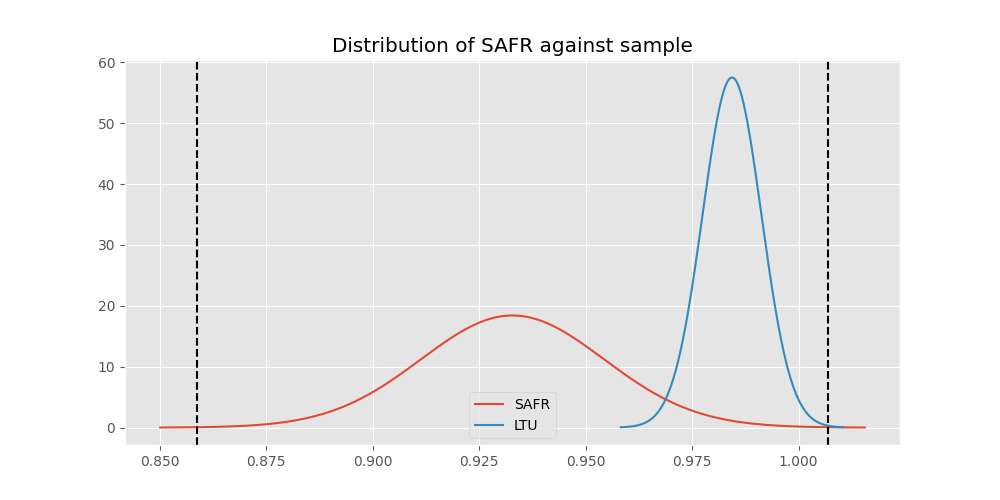 
## Testing Results for SAFR against SVN 
SAFR has a success rate of 0.9328358208955224
SVN has a success rate of 0.9770114942528736
$H_{0}$: There is not a difference between SAFR and SVN
$H_{A}$: There is a difference between SAFR and SVN
An $/alpha$ of 0.0008064516129032258 was used in this test.
__independent t-testing__: With a t-statistic of -1.4759120809052222 and a p-value of 0.1414038385933043, _we failed to reject the null hypothssis_
__Man-Whitney testing__: With a u-statistic of 5571.5 and a p-value of 0.1418010027306433, _we failed to reject the null hypothssis_
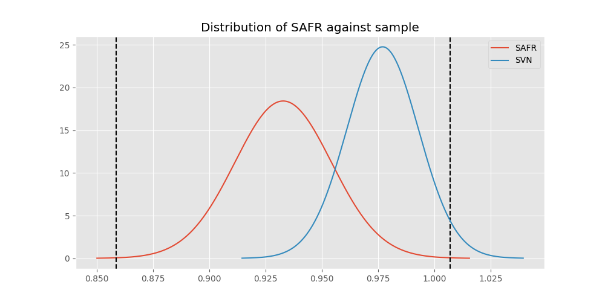 
## Testing Results for SAFR against AUS 
SAFR has a success rate of 0.9328358208955224
AUS has a success rate of 0.7289377289377289
$H_{0}$: There is not a difference between SAFR and AUS
$H_{A}$: There is a difference between SAFR and AUS
An $/alpha$ of 0.0008064516129032258 was used in this test.
__independent t-testing__: With a t-statistic of 4.927249351045595 and a p-value of 1.2177260766428052e-06, _we **reject** the null hypothssis_
__Man-Whitney testing__: With a u-statistic of 22020.5 and a p-value of 1.658248629499357e-06, _we **reject** the null hypothssis_
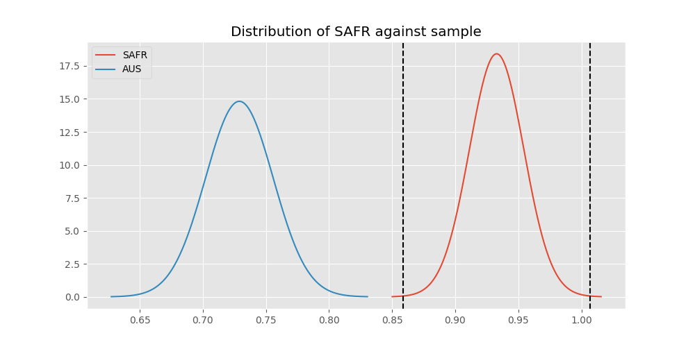 
## Testing Results for SAFR against UKR 
SAFR has a success rate of 0.9328358208955224
UKR has a success rate of 0.981549815498155
$H_{0}$: There is not a difference between SAFR and UKR
$H_{A}$: There is a difference between SAFR and UKR
An $/alpha$ of 0.0008064516129032258 was used in this test.
__independent t-testing__: With a t-statistic of -2.5388472546093928 and a p-value of 0.011497067882821366, _we failed to reject the null hypothssis_
__Man-Whitney testing__: With a u-statistic of 17272.5 and a p-value of 0.011719442187673276, _we failed to reject the null hypothssis_
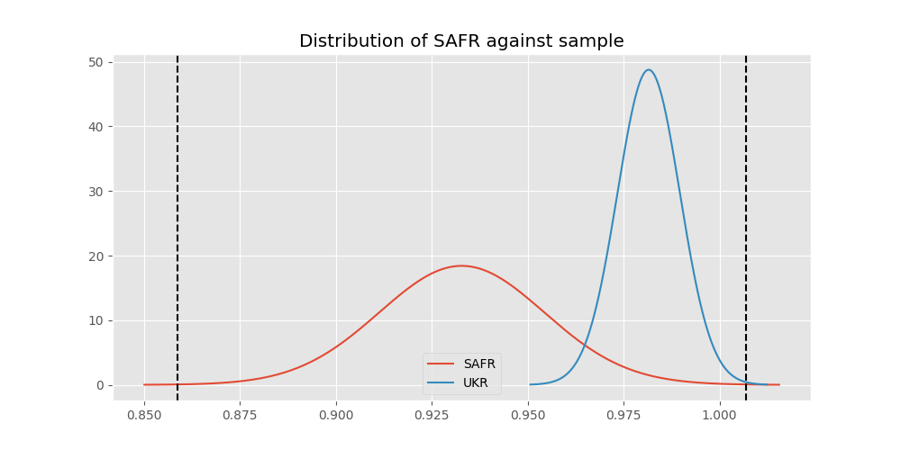 
## Testing Results for SAFR against CIS 
SAFR has a success rate of 0.9328358208955224
CIS has a success rate of 0.837386018237082
$H_{0}$: There is not a difference between SAFR and CIS
$H_{A}$: There is a difference between SAFR and CIS
An $/alpha$ of 0.0008064516129032258 was used in this test.
__independent t-testing__: With a t-statistic of 2.8594831778804273 and a p-value of 0.004355132128861023, _we failed to reject the null hypothssis_
__Man-Whitney testing__: With a u-statistic of 48294.0 and a p-value of 0.004423596569588602, _we failed to reject the null hypothssis_
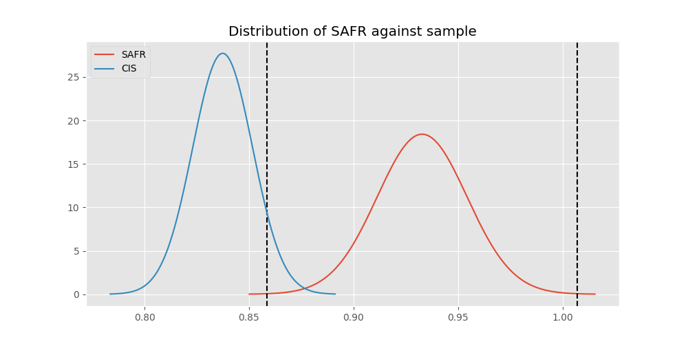 
## Testing Results for SAFR against TBD 
SAFR has a success rate of 0.9328358208955224
TBD has a success rate of 0.9898734177215189
$H_{0}$: There is not a difference between SAFR and TBD
$H_{A}$: There is a difference between SAFR and TBD
An $/alpha$ of 0.0008064516129032258 was used in this test.
__independent t-testing__: With a t-statistic of -2.559727304312411 and a p-value of 0.011480735527251276, _we failed to reject the null hypothssis_
__Man-Whitney testing__: With a u-statistic of 24955.5 and a p-value of 0.0002329171291079488, _we **reject** the null hypothssis_
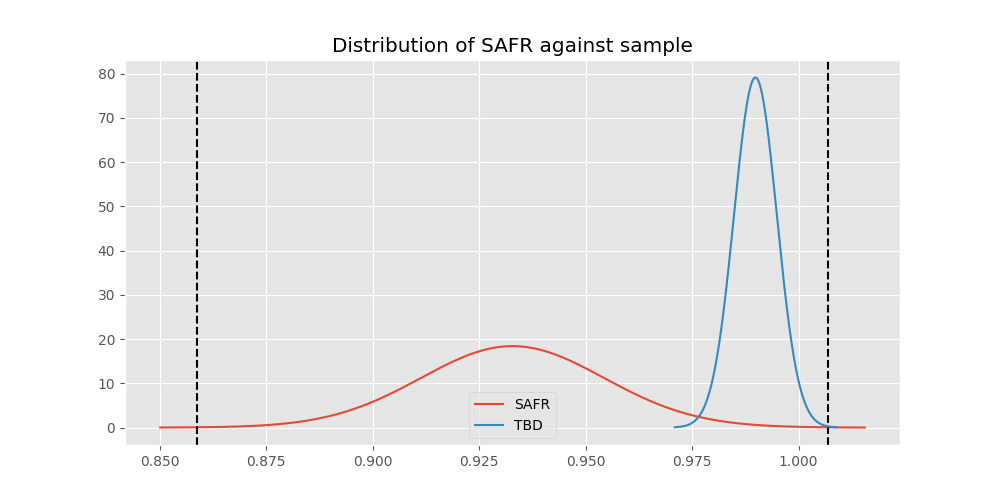 
## Testing Results for SAFR against ESA 
SAFR has a success rate of 0.9328358208955224
ESA has a success rate of 0.9811320754716981
$H_{0}$: There is not a difference between SAFR and ESA
$H_{A}$: There is a difference between SAFR and ESA
An $/alpha$ of 0.0008064516129032258 was used in this test.
__independent t-testing__: With a t-statistic of -1.7810174036925797 and a p-value of 0.07618497025453387, _we failed to reject the null hypothssis_
__Man-Whitney testing__: With a u-statistic of 6759.0 and a p-value of 0.07666140823396178, _we failed to reject the null hypothssis_
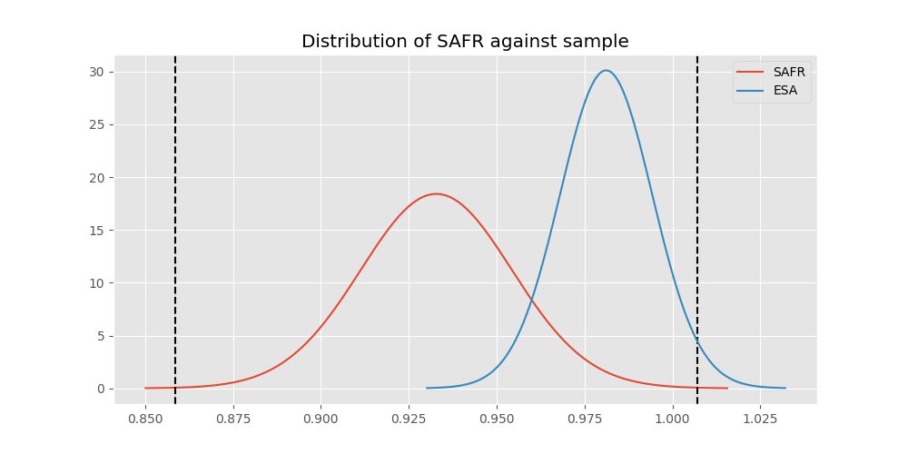 
## Testing Results for SAFR against UK 
SAFR has a success rate of 0.9328358208955224
UK has a success rate of 0.9881796690307328
$H_{0}$: There is not a difference between SAFR and UK
$H_{A}$: There is a difference between SAFR and UK
An $/alpha$ of 0.0008064516129032258 was used in this test.
__independent t-testing__: With a t-statistic of -2.513294998154857 and a p-value of 0.013086722036427316, _we failed to reject the null hypothssis_
__Man-Whitney testing__: With a u-statistic of 53545.0 and a p-value of 1.6025187421930382e-05, _we **reject** the null hypothssis_
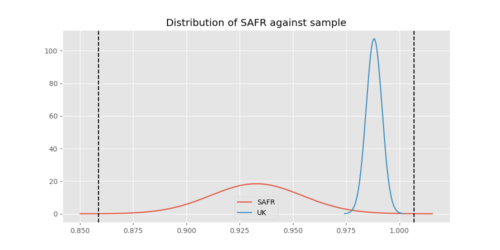 
## Testing Results for SAFR against GER 
SAFR has a success rate of 0.9328358208955224
GER has a success rate of 0.9766233766233766
$H_{0}$: There is not a difference between SAFR and GER
$H_{A}$: There is a difference between SAFR and GER
An $/alpha$ of 0.0008064516129032258 was used in this test.
__independent t-testing__: With a t-statistic of -3.1145320960316645 and a p-value of 0.0018637453042995333, _we failed to reject the null hypothssis_
__Man-Whitney testing__: With a u-statistic of 147993.0 and a p-value of 0.0018786691158890472, _we failed to reject the null hypothssis_
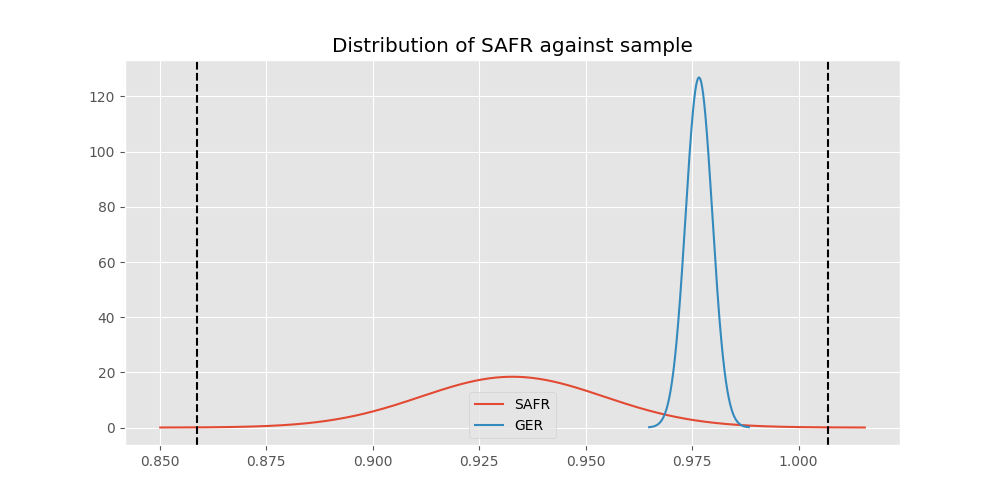 
