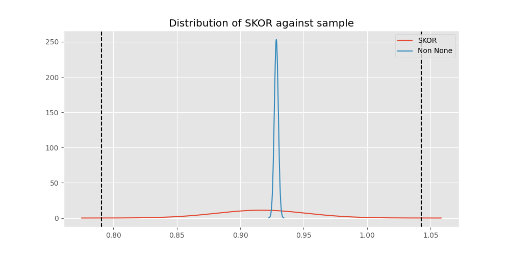
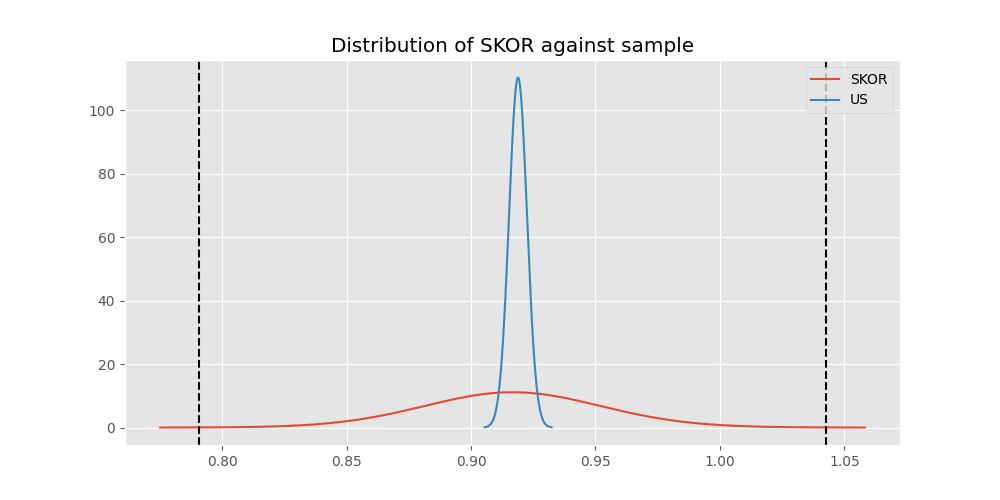

# Testing Results For SKOR 
$H_{0}$: There is not a difference in collection success against SKOR 
$H_{A}$: There is a difference in collection success against SKOR
An $\alpha$ of 0.0008064516129032258 was used 
Out of 25 tests, there were 3 rejections from 25 independent-t test.
Out of 25 tests, there were 7 rejections from 25 Man Whitney u-tests.
## Testing Results for SKOR against IND 
SKOR has a success rate of 0.9166666666666666
IND has a success rate of 0.9704433497536946
$H_{0}$: There is not a difference between SKOR and IND
$H_{A}$: There is a difference between SKOR and IND
An $/alpha$ of 0.0008064516129032258 was used in this test.
__independent t-testing__: With a t-statistic of -2.0790141316412853 and a p-value of 0.03816480224211275, _we failed to reject the null hypothssis_
__Man-Whitney testing__: With a u-statistic of 11525.0 and a p-value of 0.03844810236875583, _we failed to reject the null hypothssis_
 
## Testing Results for SKOR against GUAT 
SKOR has a success rate of 0.9166666666666666
GUAT has a success rate of 0.9705882352941176
$H_{0}$: There is not a difference between SKOR and GUAT
$H_{A}$: There is a difference between SKOR and GUAT
An $/alpha$ of 0.0008064516129032258 was used in this test.
__independent t-testing__: With a t-statistic of -1.3378238775237676 and a p-value of 0.18336346539587134, _we failed to reject the null hypothssis_
__Man-Whitney testing__: With a u-statistic of 1930.0 and a p-value of 0.18430326745302517, _we failed to reject the null hypothssis_
 
## Testing Results for SKOR against IT 
SKOR has a success rate of 0.9166666666666666
IT has a success rate of 0.9217391304347826
$H_{0}$: There is not a difference between SKOR and IT
$H_{A}$: There is a difference between SKOR and IT
An $/alpha$ of 0.0008064516129032258 was used in this test.
__independent t-testing__: With a t-statistic of -0.14134261362683975 and a p-value of 0.8876283945757788, _we failed to reject the null hypothssis_
__Man-Whitney testing__: With a u-statistic of 27460.0 and a p-value of 0.8879423345714593, _we failed to reject the null hypothssis_
 
## Testing Results for SKOR against EST 
SKOR has a success rate of 0.9166666666666666
EST has a success rate of 0.975
$H_{0}$: There is not a difference between SKOR and EST
$H_{A}$: There is a difference between SKOR and EST
An $/alpha$ of 0.0008064516129032258 was used in this test.
__independent t-testing__: With a t-statistic of -1.1999500239468373 and a p-value of 0.2330515900649629, _we failed to reject the null hypothssis_
__Man-Whitney testing__: With a u-statistic of 1130.0 and a p-value of 0.23454161992784173, _we failed to reject the null hypothssis_
 
## Testing Results for SKOR against RP 
SKOR has a success rate of 0.9166666666666666
RP has a success rate of 0.6735187424425635
$H_{0}$: There is not a difference between SKOR and RP
$H_{A}$: There is a difference between SKOR and RP
An $/alpha$ of 0.0008064516129032258 was used in this test.
__independent t-testing__: With a t-statistic of 3.9622960270612464 and a p-value of 8.02080301402496e-05, _we **reject** the null hypothssis_
__Man-Whitney testing__: With a u-statistic of 30842.5 and a p-value of 8.512120853176641e-05, _we **reject** the null hypothssis_
 
## Testing Results for SKOR against JPN 
SKOR has a success rate of 0.9166666666666666
JPN has a success rate of 0.6016371077762619
$H_{0}$: There is not a difference between SKOR and JPN
$H_{A}$: There is a difference between SKOR and JPN
An $/alpha$ of 0.0008064516129032258 was used in this test.
__independent t-testing__: With a t-statistic of 4.914498800791853 and a p-value of 1.0822864392906384e-06, _we **reject** the null hypothssis_
__Man-Whitney testing__: With a u-statistic of 28917.5 and a p-value of 1.2734413429259224e-06, _we **reject** the null hypothssis_
 
## Testing Results for SKOR against US 
SKOR has a success rate of 0.9166666666666666
US has a success rate of 0.918885774351787
$H_{0}$: There is not a difference between SKOR and US
$H_{A}$: There is a difference between SKOR and US
An $/alpha$ of 0.0008064516129032258 was used in this test.
__independent t-testing__: With a t-statistic of -0.06261416454472508 and a p-value of 0.9500759201592746, _we failed to reject the null hypothssis_
__Man-Whitney testing__: With a u-statistic of 170860.0 and a p-value of 0.9501350557477768, _we failed to reject the null hypothssis_
 
## Testing Results for SKOR against KAZ 
SKOR has a success rate of 0.9166666666666666
KAZ has a success rate of 0.989010989010989
$H_{0}$: There is not a difference between SKOR and KAZ
$H_{A}$: There is a difference between SKOR and KAZ
An $/alpha$ of 0.0008064516129032258 was used in this test.
__independent t-testing__: With a t-statistic of -1.9654919194335798 and a p-value of 0.05366229929641911, _we failed to reject the null hypothssis_
__Man-Whitney testing__: With a u-statistic of 5065.0 and a p-value of 0.0038529555863848473, _we failed to reject the null hypothssis_
 
## Testing Results for SKOR against ROC 
SKOR has a success rate of 0.9166666666666666
ROC has a success rate of 0.17751479289940827
$H_{0}$: There is not a difference between SKOR and ROC
$H_{A}$: There is a difference between SKOR and ROC
An $/alpha$ of 0.0008064516129032258 was used in this test.
__independent t-testing__: With a t-statistic of 13.700182394787713 and a p-value of 1.5489552359446367e-31, _we **reject** the null hypothssis_
__Man-Whitney testing__: With a u-statistic of 8817.5 and a p-value of 3.0797915637153473e-24, _we **reject** the null hypothssis_
 
## Testing Results for SKOR against THAI 
SKOR has a success rate of 0.9166666666666666
THAI has a success rate of 0.9880952380952381
$H_{0}$: There is not a difference between SKOR and THAI
$H_{A}$: There is a difference between SKOR and THAI
An $/alpha$ of 0.0008064516129032258 was used in this test.
__independent t-testing__: With a t-statistic of -1.9332121015571477 and a p-value of 0.05753280410183769, _we failed to reject the null hypothssis_
__Man-Whitney testing__: With a u-statistic of 4680.0 and a p-value of 0.0060833171073590864, _we failed to reject the null hypothssis_
 
## Testing Results for SKOR against FR 
SKOR has a success rate of 0.9166666666666666
FR has a success rate of 0.908183632734531
$H_{0}$: There is not a difference between SKOR and FR
$H_{A}$: There is a difference between SKOR and FR
An $/alpha$ of 0.0008064516129032258 was used in this test.
__independent t-testing__: With a t-statistic of 0.2156251826962509 and a p-value of 0.8293585762220121, _we failed to reject the null hypothssis_
__Man-Whitney testing__: With a u-statistic of 15157.5 and a p-value of 0.8297964161818812, _we failed to reject the null hypothssis_
 
## Testing Results for SKOR against TURK 
SKOR has a success rate of 0.9166666666666666
TURK has a success rate of 0.9962264150943396
$H_{0}$: There is not a difference between SKOR and TURK
$H_{A}$: There is a difference between SKOR and TURK
An $/alpha$ of 0.0008064516129032258 was used in this test.
__independent t-testing__: With a t-statistic of -2.1990194633969793 and a p-value of 0.031722684084460655, _we failed to reject the null hypothssis_
__Man-Whitney testing__: With a u-statistic of 7317.5 and a p-value of 3.718669902878006e-05, _we **reject** the null hypothssis_
 
## Testing Results for SKOR against PRC 
SKOR has a success rate of 0.9166666666666666
PRC has a success rate of 0.988759187202767
$H_{0}$: There is not a difference between SKOR and PRC
$H_{A}$: There is a difference between SKOR and PRC
An $/alpha$ of 0.0008064516129032258 was used in this test.
__independent t-testing__: With a t-statistic of -1.9998450599748803 and a p-value of 0.05009333344582772, _we failed to reject the null hypothssis_
__Man-Whitney testing__: With a u-statistic of 64387.5 and a p-value of 1.210399596742153e-06, _we **reject** the null hypothssis_
 
## Testing Results for SKOR against BEL 
SKOR has a success rate of 0.9166666666666666
BEL has a success rate of 0.8883495145631068
$H_{0}$: There is not a difference between SKOR and BEL
$H_{A}$: There is a difference between SKOR and BEL
An $/alpha$ of 0.0008064516129032258 was used in this test.
__independent t-testing__: With a t-statistic of 0.6270706438008113 and a p-value of 0.5311548502324017, _we failed to reject the null hypothssis_
__Man-Whitney testing__: With a u-statistic of 6355.0 and a p-value of 0.5313174929393284, _we failed to reject the null hypothssis_
 
## Testing Results for SKOR against POL 
SKOR has a success rate of 0.9166666666666666
POL has a success rate of 0.979381443298969
$H_{0}$: There is not a difference between SKOR and POL
$H_{A}$: There is a difference between SKOR and POL
An $/alpha$ of 0.0008064516129032258 was used in this test.
__independent t-testing__: With a t-statistic of -2.8163178629541394 and a p-value of 0.0050344091240951995, _we failed to reject the null hypothssis_
__Man-Whitney testing__: With a u-statistic of 13637.5 and a p-value of 0.005157772513306234, _we failed to reject the null hypothssis_
 
## Testing Results for SKOR against LTU 
SKOR has a success rate of 0.9166666666666666
LTU has a success rate of 0.984375
$H_{0}$: There is not a difference between SKOR and LTU
$H_{A}$: There is a difference between SKOR and LTU
An $/alpha$ of 0.0008064516129032258 was used in this test.
__independent t-testing__: With a t-statistic of -1.8476230327010523 and a p-value of 0.0693187267019828, _we failed to reject the null hypothssis_
__Man-Whitney testing__: With a u-statistic of 8950.0 and a p-value of 0.002696367523200168, _we failed to reject the null hypothssis_
 
## Testing Results for SKOR against SVN 
SKOR has a success rate of 0.9166666666666666
SVN has a success rate of 0.9770114942528736
$H_{0}$: There is not a difference between SKOR and SVN
$H_{A}$: There is a difference between SKOR and SVN
An $/alpha$ of 0.0008064516129032258 was used in this test.
__independent t-testing__: With a t-statistic of -1.693555983170286 and a p-value of 0.09249683449487586, _we failed to reject the null hypothssis_
__Man-Whitney testing__: With a u-statistic of 2452.5 and a p-value of 0.09344832837186035, _we failed to reject the null hypothssis_
 
## Testing Results for SKOR against AUS 
SKOR has a success rate of 0.9166666666666666
AUS has a success rate of 0.7289377289377289
$H_{0}$: There is not a difference between SKOR and AUS
$H_{A}$: There is a difference between SKOR and AUS
An $/alpha$ of 0.0008064516129032258 was used in this test.
__independent t-testing__: With a t-statistic of 3.1311967653749773 and a p-value of 0.0018961523378229772, _we failed to reject the null hypothssis_
__Man-Whitney testing__: With a u-statistic of 9727.5 and a p-value of 0.0020050641724739375, _we failed to reject the null hypothssis_
 
## Testing Results for SKOR against UKR 
SKOR has a success rate of 0.9166666666666666
UKR has a success rate of 0.981549815498155
$H_{0}$: There is not a difference between SKOR and UKR
$H_{A}$: There is a difference between SKOR and UKR
An $/alpha$ of 0.0008064516129032258 was used in this test.
__independent t-testing__: With a t-statistic of -1.7582281380374507 and a p-value of 0.08339927991313374, _we failed to reject the null hypothssis_
__Man-Whitney testing__: With a u-statistic of 7602.5 and a p-value of 0.008043520670299315, _we failed to reject the null hypothssis_
 
## Testing Results for SKOR against CIS 
SKOR has a success rate of 0.9166666666666666
CIS has a success rate of 0.837386018237082
$H_{0}$: There is not a difference between SKOR and CIS
$H_{A}$: There is a difference between SKOR and CIS
An $/alpha$ of 0.0008064516129032258 was used in this test.
__independent t-testing__: With a t-statistic of 1.6209227784472569 and a p-value of 0.10547447471675091, _we failed to reject the null hypothssis_
__Man-Whitney testing__: With a u-statistic of 21305.0 and a p-value of 0.1055400076269359, _we failed to reject the null hypothssis_
 
## Testing Results for SKOR against SAFR 
SKOR has a success rate of 0.9166666666666666
SAFR has a success rate of 0.9328358208955224
$H_{0}$: There is not a difference between SKOR and SAFR
$H_{A}$: There is a difference between SKOR and SAFR
An $/alpha$ of 0.0008064516129032258 was used in this test.
__independent t-testing__: With a t-statistic of -0.40035649178738814 and a p-value of 0.6893390683083949, _we failed to reject the null hypothssis_
__Man-Whitney testing__: With a u-statistic of 3955.0 and a p-value of 0.6905241134645188, _we failed to reject the null hypothssis_
 
## Testing Results for SKOR against TBD 
SKOR has a success rate of 0.9166666666666666
TBD has a success rate of 0.9898734177215189
$H_{0}$: There is not a difference between SKOR and TBD
$H_{A}$: There is a difference between SKOR and TBD
An $/alpha$ of 0.0008064516129032258 was used in this test.
__independent t-testing__: With a t-statistic of -2.0148208047210208 and a p-value of 0.04831264866511937, _we failed to reject the null hypothssis_
__Man-Whitney testing__: With a u-statistic of 10982.5 and a p-value of 0.00015184250659102666, _we **reject** the null hypothssis_
 
## Testing Results for SKOR against ESA 
SKOR has a success rate of 0.9166666666666666
ESA has a success rate of 0.9811320754716981
$H_{0}$: There is not a difference between SKOR and ESA
$H_{A}$: There is a difference between SKOR and ESA
An $/alpha$ of 0.0008064516129032258 was used in this test.
__independent t-testing__: With a t-statistic of -1.6807991914918112 and a p-value of 0.09694160775605333, _we failed to reject the null hypothssis_
__Man-Whitney testing__: With a u-statistic of 2975.0 and a p-value of 0.04830839161503387, _we failed to reject the null hypothssis_
 
## Testing Results for SKOR against UK 
SKOR has a success rate of 0.9166666666666666
UK has a success rate of 0.9881796690307328
$H_{0}$: There is not a difference between SKOR and UK
$H_{A}$: There is a difference between SKOR and UK
An $/alpha$ of 0.0008064516129032258 was used in this test.
__independent t-testing__: With a t-statistic of -1.9769233352296849 and a p-value of 0.05263068314739536, _we failed to reject the null hypothssis_
__Man-Whitney testing__: With a u-statistic of 23565.0 and a p-value of 2.7715746934420966e-05, _we **reject** the null hypothssis_
 
## Testing Results for SKOR against GER 
SKOR has a success rate of 0.9166666666666666
GER has a success rate of 0.9766233766233766
$H_{0}$: There is not a difference between SKOR and GER
$H_{A}$: There is a difference between SKOR and GER
An $/alpha$ of 0.0008064516129032258 was used in this test.
__independent t-testing__: With a t-statistic of -2.946993798223825 and a p-value of 0.0032401428359085088, _we failed to reject the null hypothssis_
__Man-Whitney testing__: With a u-statistic of 65145.0 and a p-value of 0.0032623529410540607, _we failed to reject the null hypothssis_
 
