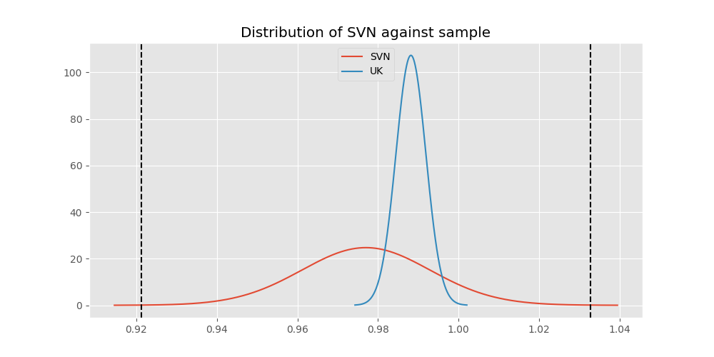

# Testing Results For SVN 
$H_{0}$: There is not a difference in collection success against SVN 
$H_{A}$: There is a difference in collection success against SVN
An $\alpha$ of 0.0008064516129032258 was used 
Out of 25 tests, there were 5 rejections from 25 independent-t test.
Out of 25 tests, there were 5 rejections from 25 Man Whitney u-tests.
## Testing Results for SVN against IND 
SVN has a success rate of 0.9770114942528736
IND has a success rate of 0.9704433497536946
$H_{0}$: There is not a difference between SVN and IND
$H_{A}$: There is a difference between SVN and IND
An $/alpha$ of 0.0008064516129032258 was used in this test.
__independent t-testing__: With a t-statistic of 0.3340593728485691 and a p-value of 0.7384773879302273, _we failed to reject the null hypothssis_
__Man-Whitney testing__: With a u-statistic of 17777.0 and a p-value of 0.7391945402365296, _we failed to reject the null hypothssis_
 
## Testing Results for SVN against GUAT 
SVN has a success rate of 0.9770114942528736
GUAT has a success rate of 0.9705882352941176
$H_{0}$: There is not a difference between SVN and GUAT
$H_{A}$: There is a difference between SVN and GUAT
An $/alpha$ of 0.0008064516129032258 was used in this test.
__independent t-testing__: With a t-statistic of 0.24870500755269678 and a p-value of 0.8039225029666714, _we failed to reject the null hypothssis_
__Man-Whitney testing__: With a u-statistic of 2977.0 and a p-value of 0.8080819913303539, _we failed to reject the null hypothssis_
 
## Testing Results for SVN against IT 
SVN has a success rate of 0.9770114942528736
IT has a success rate of 0.9217391304347826
$H_{0}$: There is not a difference between SVN and IT
$H_{A}$: There is a difference between SVN and IT
An $/alpha$ of 0.0008064516129032258 was used in this test.
__independent t-testing__: With a t-statistic of 1.8899850090351122 and a p-value of 0.059047524329393766, _we failed to reject the null hypothssis_
__Man-Whitney testing__: With a u-statistic of 42232.0 and a p-value of 0.05914057003010387, _we failed to reject the null hypothssis_
 
## Testing Results for SVN against EST 
SVN has a success rate of 0.9770114942528736
EST has a success rate of 0.975
$H_{0}$: There is not a difference between SVN and EST
$H_{A}$: There is a difference between SVN and EST
An $/alpha$ of 0.0008064516129032258 was used in this test.
__independent t-testing__: With a t-statistic of 0.06878601877957705 and a p-value of 0.9452698610196946, _we failed to reject the null hypothssis_
__Man-Whitney testing__: With a u-statistic of 1743.5 and a p-value of 0.9527978336059696, _we failed to reject the null hypothssis_
 
## Testing Results for SVN against SKOR 
SVN has a success rate of 0.9770114942528736
SKOR has a success rate of 0.9166666666666666
$H_{0}$: There is not a difference between SVN and SKOR
$H_{A}$: There is a difference between SVN and SKOR
An $/alpha$ of 0.0008064516129032258 was used in this test.
__independent t-testing__: With a t-statistic of 1.693555983170286 and a p-value of 0.09249683449487586, _we failed to reject the null hypothssis_
__Man-Whitney testing__: With a u-statistic of 2767.5 and a p-value of 0.09344832837186035, _we failed to reject the null hypothssis_
 
## Testing Results for SVN against RP 
SVN has a success rate of 0.9770114942528736
RP has a success rate of 0.6735187424425635
$H_{0}$: There is not a difference between SVN and RP
$H_{A}$: There is a difference between SVN and RP
An $/alpha$ of 0.0008064516129032258 was used in this test.
__independent t-testing__: With a t-statistic of 5.998013626319597 and a p-value of 2.876936380883027e-09, _we **reject** the null hypothssis_
__Man-Whitney testing__: With a u-statistic of 46892.5 and a p-value of 3.955252669465662e-09, _we **reject** the null hypothssis_
 
## Testing Results for SVN against JPN 
SVN has a success rate of 0.9770114942528736
JPN has a success rate of 0.6016371077762619
$H_{0}$: There is not a difference between SVN and JPN
$H_{A}$: There is a difference between SVN and JPN
An $/alpha$ of 0.0008064516129032258 was used in this test.
__independent t-testing__: With a t-statistic of 7.10371125554648 and a p-value of 2.6423620568105965e-12, _we **reject** the null hypothssis_
__Man-Whitney testing__: With a u-statistic of 43854.5 and a p-value of 5.267888567793956e-12, _we **reject** the null hypothssis_
 
## Testing Results for SVN against US 
SVN has a success rate of 0.9770114942528736
US has a success rate of 0.918885774351787
$H_{0}$: There is not a difference between SVN and US
$H_{A}$: There is a difference between SVN and US
An $/alpha$ of 0.0008064516129032258 was used in this test.
__independent t-testing__: With a t-statistic of 1.9809735883014885 and a p-value of 0.0476414513054468, _we failed to reject the null hypothssis_
__Man-Whitney testing__: With a u-statistic of 262730.5 and a p-value of 0.04765800905633906, _we failed to reject the null hypothssis_
 
## Testing Results for SVN against KAZ 
SVN has a success rate of 0.9770114942528736
KAZ has a success rate of 0.989010989010989
$H_{0}$: There is not a difference between SVN and KAZ
$H_{A}$: There is a difference between SVN and KAZ
An $/alpha$ of 0.0008064516129032258 was used in this test.
__independent t-testing__: With a t-statistic of -0.7586274157602008 and a p-value of 0.44874461212834904, _we failed to reject the null hypothssis_
__Man-Whitney testing__: With a u-statistic of 7822.0 and a p-value of 0.4501092019086128, _we failed to reject the null hypothssis_
 
## Testing Results for SVN against ROC 
SVN has a success rate of 0.9770114942528736
ROC has a success rate of 0.17751479289940827
$H_{0}$: There is not a difference between SVN and ROC
$H_{A}$: There is a difference between SVN and ROC
An $/alpha$ of 0.0008064516129032258 was used in this test.
__independent t-testing__: With a t-statistic of 18.712961889325577 and a p-value of 1.053247547356522e-49, _we **reject** the null hypothssis_
__Man-Whitney testing__: With a u-statistic of 13229.0 and a p-value of 5.323926219323849e-34, _we **reject** the null hypothssis_
 
## Testing Results for SVN against THAI 
SVN has a success rate of 0.9770114942528736
THAI has a success rate of 0.9880952380952381
$H_{0}$: There is not a difference between SVN and THAI
$H_{A}$: There is a difference between SVN and THAI
An $/alpha$ of 0.0008064516129032258 was used in this test.
__independent t-testing__: With a t-statistic of -0.673260054873375 and a p-value of 0.501396394976555, _we failed to reject the null hypothssis_
__Man-Whitney testing__: With a u-statistic of 7227.0 and a p-value of 0.5029691010278687, _we failed to reject the null hypothssis_
 
## Testing Results for SVN against FR 
SVN has a success rate of 0.9770114942528736
FR has a success rate of 0.908183632734531
$H_{0}$: There is not a difference between SVN and FR
$H_{A}$: There is a difference between SVN and FR
An $/alpha$ of 0.0008064516129032258 was used in this test.
__independent t-testing__: With a t-statistic of 2.169256150442861 and a p-value of 0.030464553831423262, _we failed to reject the null hypothssis_
__Man-Whitney testing__: With a u-statistic of 23293.5 and a p-value of 0.030639731331953492, _we failed to reject the null hypothssis_
 
## Testing Results for SVN against TURK 
SVN has a success rate of 0.9770114942528736
TURK has a success rate of 0.9962264150943396
$H_{0}$: There is not a difference between SVN and TURK
$H_{A}$: There is a difference between SVN and TURK
An $/alpha$ of 0.0008064516129032258 was used in this test.
__independent t-testing__: With a t-statistic of -1.1578549623264645 and a p-value of 0.2498095188400728, _we failed to reject the null hypothssis_
__Man-Whitney testing__: With a u-statistic of 11306.0 and a p-value of 0.09189875364160807, _we failed to reject the null hypothssis_
 
## Testing Results for SVN against PRC 
SVN has a success rate of 0.9770114942528736
PRC has a success rate of 0.988759187202767
$H_{0}$: There is not a difference between SVN and PRC
$H_{A}$: There is a difference between SVN and PRC
An $/alpha$ of 0.0008064516129032258 was used in this test.
__independent t-testing__: With a t-statistic of -1.0015648602812843 and a p-value of 0.3166548520993417, _we failed to reject the null hypothssis_
__Man-Whitney testing__: With a u-statistic of 99433.5 and a p-value of 0.3167588714628278, _we failed to reject the null hypothssis_
 
## Testing Results for SVN against BEL 
SVN has a success rate of 0.9770114942528736
BEL has a success rate of 0.8883495145631068
$H_{0}$: There is not a difference between SVN and BEL
$H_{A}$: There is a difference between SVN and BEL
An $/alpha$ of 0.0008064516129032258 was used in this test.
__independent t-testing__: With a t-statistic of 2.5000833949787733 and a p-value of 0.012966766134480208, _we failed to reject the null hypothssis_
__Man-Whitney testing__: With a u-statistic of 9755.5 and a p-value of 0.01327349569911362, _we failed to reject the null hypothssis_
 
## Testing Results for SVN against POL 
SVN has a success rate of 0.9770114942528736
POL has a success rate of 0.979381443298969
$H_{0}$: There is not a difference between SVN and POL
$H_{A}$: There is a difference between SVN and POL
An $/alpha$ of 0.0008064516129032258 was used in this test.
__independent t-testing__: With a t-statistic of -0.14178489110636858 and a p-value of 0.8873000162626039, _we failed to reject the null hypothssis_
__Man-Whitney testing__: With a u-statistic of 21047.5 and a p-value of 0.8882747176022044, _we failed to reject the null hypothssis_
 
## Testing Results for SVN against LTU 
SVN has a success rate of 0.9770114942528736
LTU has a success rate of 0.984375
$H_{0}$: There is not a difference between SVN and LTU
$H_{A}$: There is a difference between SVN and LTU
An $/alpha$ of 0.0008064516129032258 was used in this test.
__independent t-testing__: With a t-statistic of -0.46739583728734246 and a p-value of 0.6404680749321405, _we failed to reject the null hypothssis_
__Man-Whitney testing__: With a u-statistic of 13817.5 and a p-value of 0.6415274919226741, _we failed to reject the null hypothssis_
 
## Testing Results for SVN against AUS 
SVN has a success rate of 0.9770114942528736
AUS has a success rate of 0.7289377289377289
$H_{0}$: There is not a difference between SVN and AUS
$H_{A}$: There is a difference between SVN and AUS
An $/alpha$ of 0.0008064516129032258 was used in this test.
__independent t-testing__: With a t-statistic of 5.099457293863128 and a p-value of 5.532775347603432e-07, _we **reject** the null hypothssis_
__Man-Whitney testing__: With a u-statistic of 14821.5 and a p-value of 8.231369589172016e-07, _we **reject** the null hypothssis_
 
## Testing Results for SVN against UKR 
SVN has a success rate of 0.9770114942528736
UKR has a success rate of 0.981549815498155
$H_{0}$: There is not a difference between SVN and UKR
$H_{A}$: There is a difference between SVN and UKR
An $/alpha$ of 0.0008064516129032258 was used in this test.
__independent t-testing__: With a t-statistic of -0.26528020703435673 and a p-value of 0.7909471530783628, _we failed to reject the null hypothssis_
__Man-Whitney testing__: With a u-statistic of 11735.0 and a p-value of 0.7924397543511812, _we failed to reject the null hypothssis_
 
## Testing Results for SVN against CIS 
SVN has a success rate of 0.9770114942528736
CIS has a success rate of 0.837386018237082
$H_{0}$: There is not a difference between SVN and CIS
$H_{A}$: There is a difference between SVN and CIS
An $/alpha$ of 0.0008064516129032258 was used in this test.
__independent t-testing__: With a t-statistic of 3.4866959173701644 and a p-value of 0.0005177678016054558, _we **reject** the null hypothssis_
__Man-Whitney testing__: With a u-statistic of 32619.5 and a p-value of 0.0005393534186493887, _we **reject** the null hypothssis_
 
## Testing Results for SVN against SAFR 
SVN has a success rate of 0.9770114942528736
SAFR has a success rate of 0.9328358208955224
$H_{0}$: There is not a difference between SVN and SAFR
$H_{A}$: There is a difference between SVN and SAFR
An $/alpha$ of 0.0008064516129032258 was used in this test.
__independent t-testing__: With a t-statistic of 1.4759120809052222 and a p-value of 0.1414038385933043, _we failed to reject the null hypothssis_
__Man-Whitney testing__: With a u-statistic of 6086.5 and a p-value of 0.1418010027306433, _we failed to reject the null hypothssis_
 
## Testing Results for SVN against TBD 
SVN has a success rate of 0.9770114942528736
TBD has a success rate of 0.9898734177215189
$H_{0}$: There is not a difference between SVN and TBD
$H_{A}$: There is a difference between SVN and TBD
An $/alpha$ of 0.0008064516129032258 was used in this test.
__independent t-testing__: With a t-statistic of -0.9784491999756497 and a p-value of 0.32834507964612614, _we failed to reject the null hypothssis_
__Man-Whitney testing__: With a u-statistic of 16961.5 and a p-value of 0.32892633017256456, _we failed to reject the null hypothssis_
 
## Testing Results for SVN against ESA 
SVN has a success rate of 0.9770114942528736
ESA has a success rate of 0.9811320754716981
$H_{0}$: There is not a difference between SVN and ESA
$H_{A}$: There is a difference between SVN and ESA
An $/alpha$ of 0.0008064516129032258 was used in this test.
__independent t-testing__: With a t-statistic of -0.19891695549683516 and a p-value of 0.8425392910415106, _we failed to reject the null hypothssis_
__Man-Whitney testing__: With a u-statistic of 4592.0 and a p-value of 0.846043909661329, _we failed to reject the null hypothssis_
 
## Testing Results for SVN against UK 
SVN has a success rate of 0.9770114942528736
UK has a success rate of 0.9881796690307328
$H_{0}$: There is not a difference between SVN and UK
$H_{A}$: There is a difference between SVN and UK
An $/alpha$ of 0.0008064516129032258 was used in this test.
__independent t-testing__: With a t-statistic of -0.8797552320635138 and a p-value of 0.3792189429854683, _we failed to reject the null hypothssis_
__Man-Whitney testing__: With a u-statistic of 36390.0 and a p-value of 0.3795143141994185, _we failed to reject the null hypothssis_
 
## Testing Results for SVN against GER 
SVN has a success rate of 0.9770114942528736
GER has a success rate of 0.9766233766233766
$H_{0}$: There is not a difference between SVN and GER
$H_{A}$: There is a difference between SVN and GER
An $/alpha$ of 0.0008064516129032258 was used in this test.
__independent t-testing__: With a t-statistic of 0.023517279195087684 and a p-value of 0.9812396146027021, _we failed to reject the null hypothssis_
__Man-Whitney testing__: With a u-statistic of 100524.0 and a p-value of 0.9814742913409801, _we failed to reject the null hypothssis_
 
