# Testing Results For TBD 
$H_{0}$: There is not a difference in collection success against TBD 
$H_{A}$: There is a difference in collection success against TBD
An $\alpha$ of 0.0008064516129032258 was used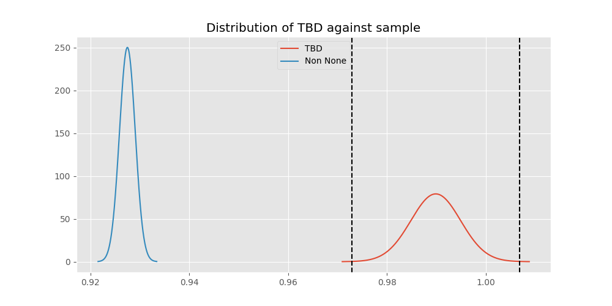 
Out of 25 tests, there were 11 rejections from 25 independent-t test.
Out of 25 tests, there were 11 rejections from 25 Man Whitney u-tests.
## Testing Results for TBD against IND 
TBD has a success rate of 0.9898734177215189
IND has a success rate of 0.9704433497536946
$H_{0}$: There is not a difference between TBD and IND
$H_{A}$: There is a difference between TBD and IND
An $/alpha$ of 0.0008064516129032258 was used in this test.
__independent t-testing__: With a t-statistic of 1.9672688693414135 and a p-value of 0.04949781381052486, _we failed to reject the null hypothssis_
__Man-Whitney testing__: With a u-statistic of 81743.0 and a p-value of 0.04963233056045496, _we failed to reject the null hypothssis_
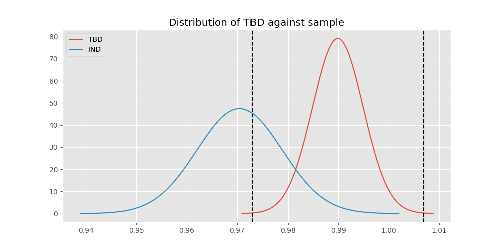 
## Testing Results for TBD against GUAT 
TBD has a success rate of 0.9898734177215189
GUAT has a success rate of 0.9705882352941176
$H_{0}$: There is not a difference between TBD and GUAT
$H_{A}$: There is a difference between TBD and GUAT
An $/alpha$ of 0.0008064516129032258 was used in this test.
__independent t-testing__: With a t-statistic of 1.2983328752039256 and a p-value of 0.1948221038659381, _we failed to reject the null hypothssis_
__Man-Whitney testing__: With a u-statistic of 13689.0 and a p-value of 0.19536648597577888, _we failed to reject the null hypothssis_
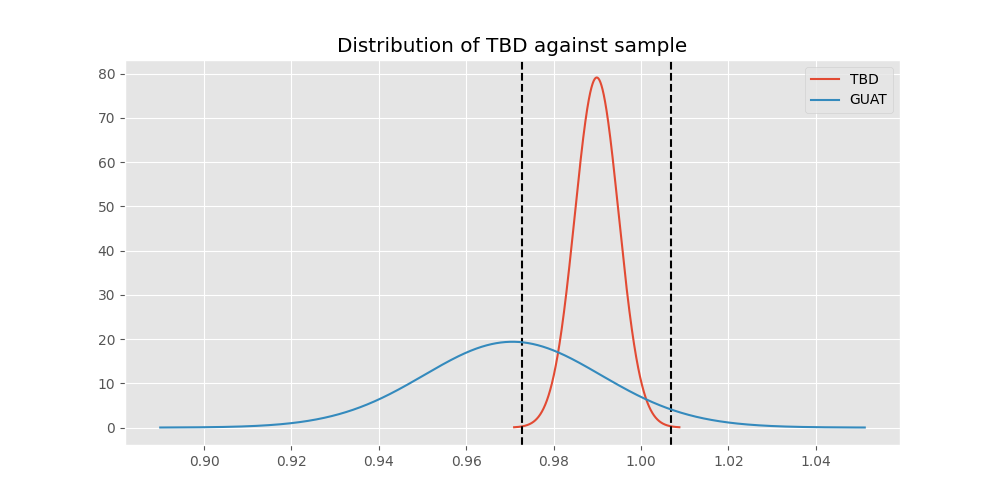 
## Testing Results for TBD against IT 
TBD has a success rate of 0.9898734177215189
IT has a success rate of 0.9217391304347826
$H_{0}$: There is not a difference between TBD and IT
$H_{A}$: There is a difference between TBD and IT
An $/alpha$ of 0.0008064516129032258 was used in this test.
__independent t-testing__: With a t-statistic of 4.894109559638208 and a p-value of 1.1098922984976577e-06, _we **reject** the null hypothssis_
__Man-Whitney testing__: With a u-statistic of 194080.0 and a p-value of 1.2239435697904865e-06, _we **reject** the null hypothssis_
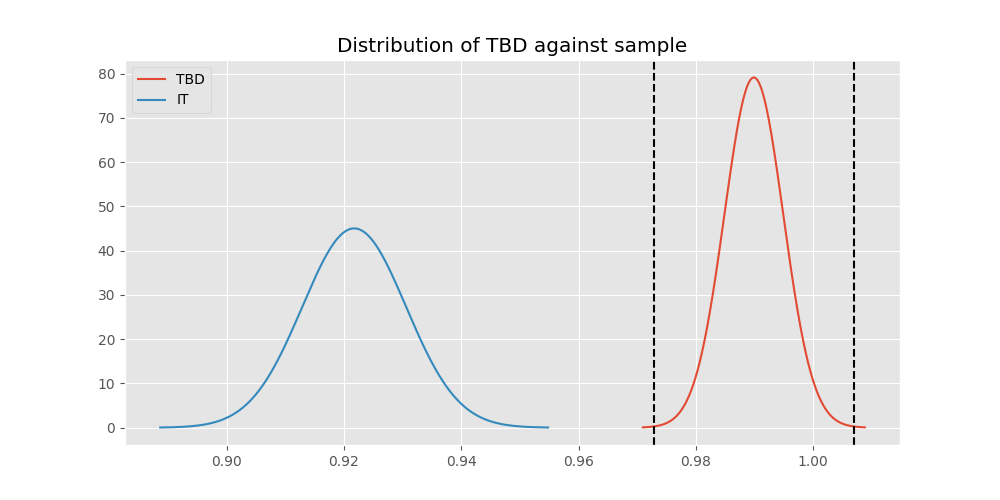 
## Testing Results for TBD against EST 
TBD has a success rate of 0.9898734177215189
EST has a success rate of 0.975
$H_{0}$: There is not a difference between TBD and EST
$H_{A}$: There is a difference between TBD and EST
An $/alpha$ of 0.0008064516129032258 was used in this test.
__independent t-testing__: With a t-statistic of 0.8396868276321698 and a p-value of 0.4015473717861068, _we failed to reject the null hypothssis_
__Man-Whitney testing__: With a u-statistic of 8017.5 and a p-value of 0.4029310773636271, _we failed to reject the null hypothssis_
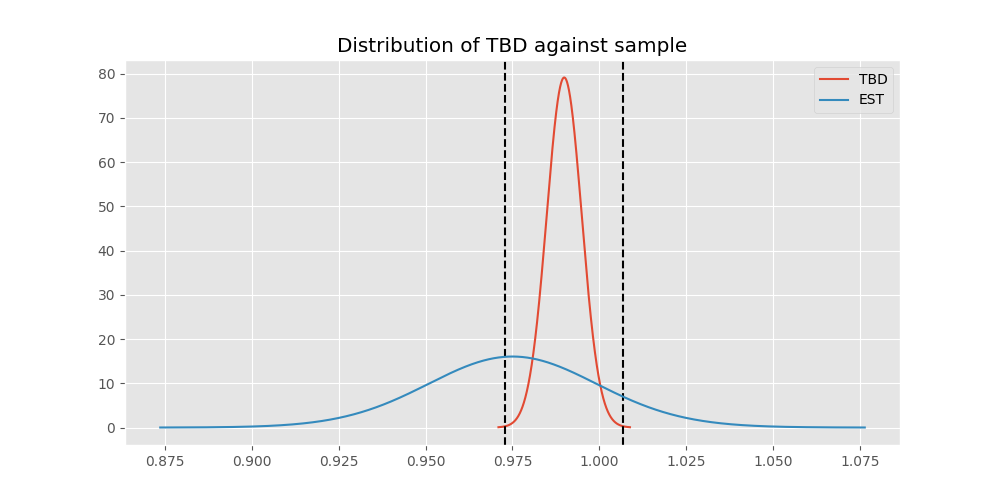 
## Testing Results for TBD against SKOR 
TBD has a success rate of 0.9898734177215189
SKOR has a success rate of 0.9166666666666666
$H_{0}$: There is not a difference between TBD and SKOR
$H_{A}$: There is a difference between TBD and SKOR
An $/alpha$ of 0.0008064516129032258 was used in this test.
__independent t-testing__: With a t-statistic of 3.8474049809050235 and a p-value of 0.00013650356372725447, _we **reject** the null hypothssis_
__Man-Whitney testing__: With a u-statistic of 12717.5 and a p-value of 0.00015184250659102666, _we **reject** the null hypothssis_
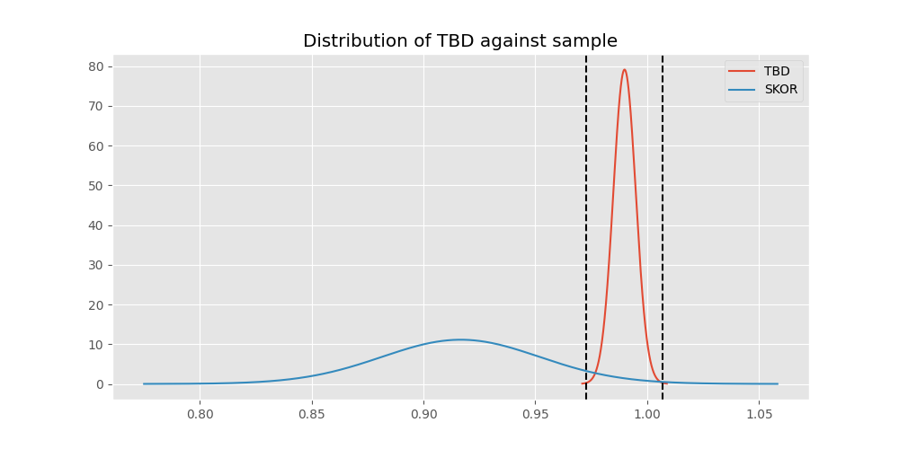 
## Testing Results for TBD against RP 
TBD has a success rate of 0.9898734177215189
RP has a success rate of 0.6735187424425635
$H_{0}$: There is not a difference between TBD and RP
$H_{A}$: There is a difference between TBD and RP
An $/alpha$ of 0.0008064516129032258 was used in this test.
__independent t-testing__: With a t-statistic of 13.253660798593884 and a p-value of 1.4801387220115039e-37, _we **reject** the null hypothssis_
__Man-Whitney testing__: With a u-statistic of 215003.5 and a p-value of 2.7292555519352585e-35, _we **reject** the null hypothssis_
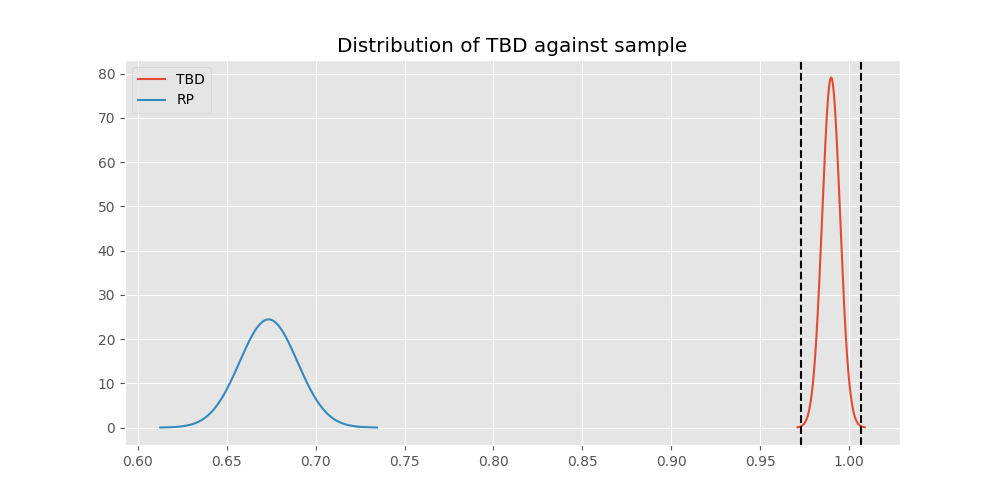 
## Testing Results for TBD against JPN 
TBD has a success rate of 0.9898734177215189
JPN has a success rate of 0.6016371077762619
$H_{0}$: There is not a difference between TBD and JPN
$H_{A}$: There is a difference between TBD and JPN
An $/alpha$ of 0.0008064516129032258 was used in this test.
__independent t-testing__: With a t-statistic of 15.572659747489935 and a p-value of 1.1454461706939224e-49, _we **reject** the null hypothssis_
__Man-Whitney testing__: With a u-statistic of 200971.5 and a p-value of 2.4190639259269883e-45, _we **reject** the null hypothssis_
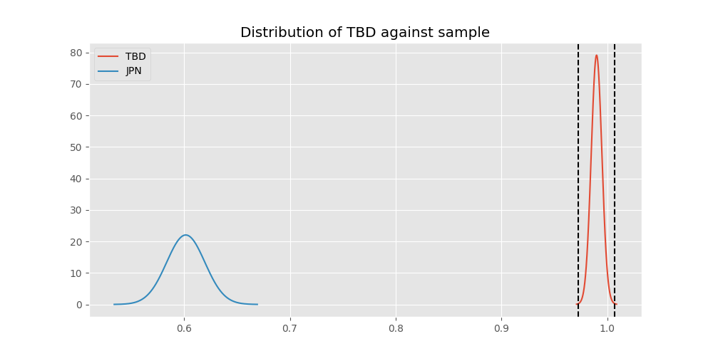 
## Testing Results for TBD against US 
TBD has a success rate of 0.9898734177215189
US has a success rate of 0.918885774351787
$H_{0}$: There is not a difference between TBD and US
$H_{A}$: There is a difference between TBD and US
An $/alpha$ of 0.0008064516129032258 was used in this test.
__independent t-testing__: With a t-statistic of 5.143032540622769 and a p-value of 2.7877199812111777e-07, _we **reject** the null hypothssis_
__Man-Whitney testing__: With a u-statistic of 1207356.5 and a p-value of 2.862100368883188e-07, _we **reject** the null hypothssis_
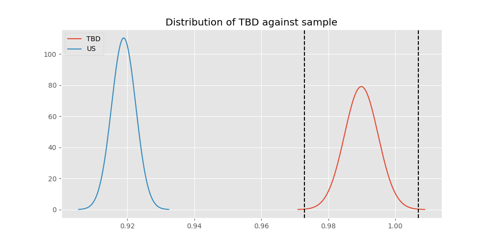 
## Testing Results for TBD against KAZ 
TBD has a success rate of 0.9898734177215189
KAZ has a success rate of 0.989010989010989
$H_{0}$: There is not a difference between TBD and KAZ
$H_{A}$: There is a difference between TBD and KAZ
An $/alpha$ of 0.0008064516129032258 was used in this test.
__independent t-testing__: With a t-statistic of 0.09473295399401913 and a p-value of 0.9245599448739414, _we failed to reject the null hypothssis_
__Man-Whitney testing__: With a u-statistic of 35976.0 and a p-value of 0.9256769197721212, _we failed to reject the null hypothssis_
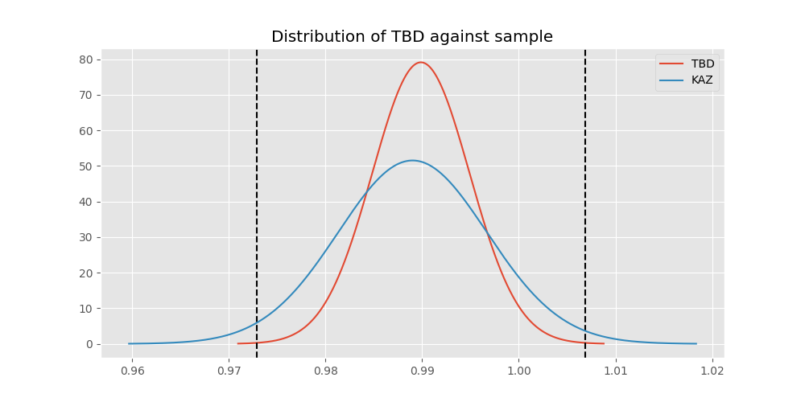 
## Testing Results for TBD against ROC 
TBD has a success rate of 0.9898734177215189
ROC has a success rate of 0.17751479289940827
$H_{0}$: There is not a difference between TBD and ROC
$H_{A}$: There is a difference between TBD and ROC
An $/alpha$ of 0.0008064516129032258 was used in this test.
__independent t-testing__: With a t-statistic of 39.15407001092202 and a p-value of 1.035641423697882e-162, _we **reject** the null hypothssis_
__Man-Whitney testing__: With a u-statistic of 60492.0 and a p-value of 1.373343250488629e-91, _we **reject** the null hypothssis_
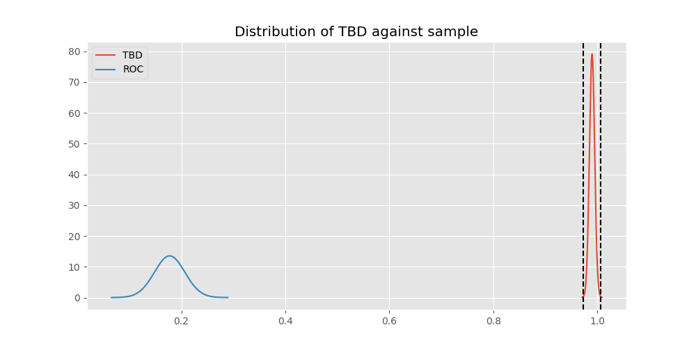 
## Testing Results for TBD against THAI 
TBD has a success rate of 0.9898734177215189
THAI has a success rate of 0.9880952380952381
$H_{0}$: There is not a difference between TBD and THAI
$H_{A}$: There is a difference between TBD and THAI
An $/alpha$ of 0.0008064516129032258 was used in this test.
__independent t-testing__: With a t-statistic of 0.18768115193070262 and a p-value of 0.8511944678699205, _we failed to reject the null hypothssis_
__Man-Whitney testing__: With a u-statistic of 33239.0 and a p-value of 0.8522482693814125, _we failed to reject the null hypothssis_
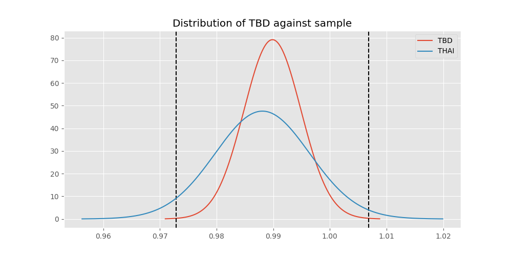 
## Testing Results for TBD against FR 
TBD has a success rate of 0.9898734177215189
FR has a success rate of 0.908183632734531
$H_{0}$: There is not a difference between TBD and FR
$H_{A}$: There is a difference between TBD and FR
An $/alpha$ of 0.0008064516129032258 was used in this test.
__independent t-testing__: With a t-statistic of 5.367488342320396 and a p-value of 1.0178987566007435e-07, _we **reject** the null hypothssis_
__Man-Whitney testing__: With a u-statistic of 107030.5 and a p-value of 1.252489392786127e-07, _we **reject** the null hypothssis_
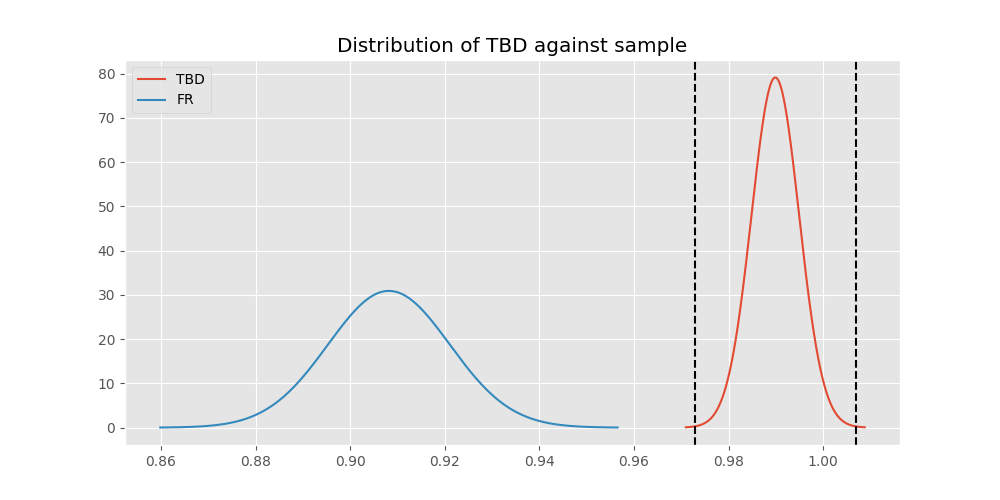 
## Testing Results for TBD against TURK 
TBD has a success rate of 0.9898734177215189
TURK has a success rate of 0.9962264150943396
$H_{0}$: There is not a difference between TBD and TURK
$H_{A}$: There is a difference between TBD and TURK
An $/alpha$ of 0.0008064516129032258 was used in this test.
__independent t-testing__: With a t-statistic of -0.9219083647772641 and a p-value of 0.3569142703020338, _we failed to reject the null hypothssis_
__Man-Whitney testing__: With a u-statistic of 52005.0 and a p-value of 0.3572452648626706, _we failed to reject the null hypothssis_
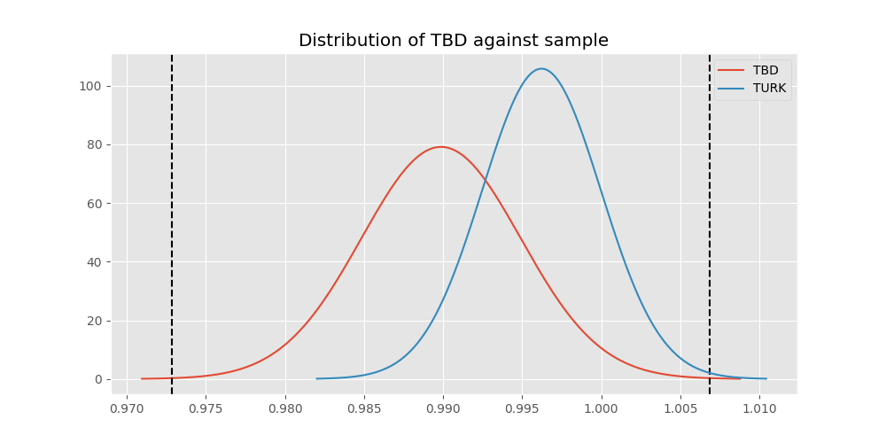 
## Testing Results for TBD against PRC 
TBD has a success rate of 0.9898734177215189
PRC has a success rate of 0.988759187202767
$H_{0}$: There is not a difference between TBD and PRC
$H_{A}$: There is a difference between TBD and PRC
An $/alpha$ of 0.0008064516129032258 was used in this test.
__independent t-testing__: With a t-statistic of 0.19546205573474054 and a p-value of 0.8450459149692113, _we failed to reject the null hypothssis_
__Man-Whitney testing__: With a u-statistic of 457326.5 and a p-value of 0.8451543797581994, _we failed to reject the null hypothssis_
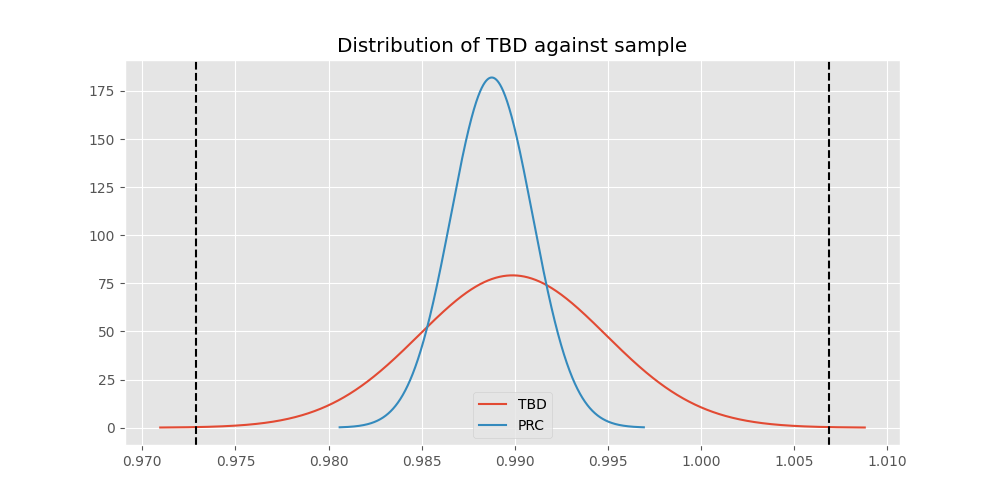 
## Testing Results for TBD against BEL 
TBD has a success rate of 0.9898734177215189
BEL has a success rate of 0.8883495145631068
$H_{0}$: There is not a difference between TBD and BEL
$H_{A}$: There is a difference between TBD and BEL
An $/alpha$ of 0.0008064516129032258 was used in this test.
__independent t-testing__: With a t-statistic of 5.85405900526183 and a p-value of 7.906967776300593e-09, _we **reject** the null hypothssis_
__Man-Whitney testing__: With a u-statistic of 44815.5 and a p-value of 1.2156433472397032e-08, _we **reject** the null hypothssis_
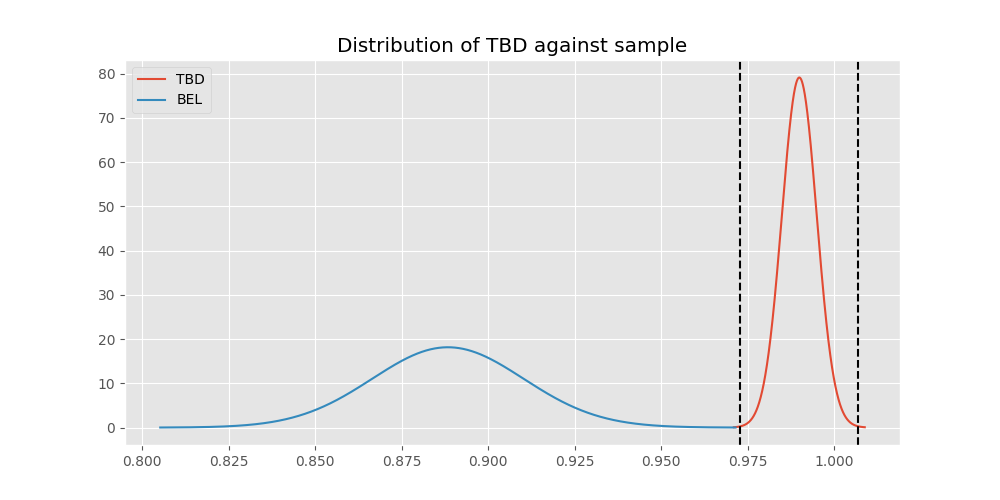 
## Testing Results for TBD against POL 
TBD has a success rate of 0.9898734177215189
POL has a success rate of 0.979381443298969
$H_{0}$: There is not a difference between TBD and POL
$H_{A}$: There is a difference between TBD and POL
An $/alpha$ of 0.0008064516129032258 was used in this test.
__independent t-testing__: With a t-statistic of 1.236884012604609 and a p-value of 0.21646087527888908, _we failed to reject the null hypothssis_
__Man-Whitney testing__: With a u-statistic of 96792.5 and a p-value of 0.216497153517494, _we failed to reject the null hypothssis_
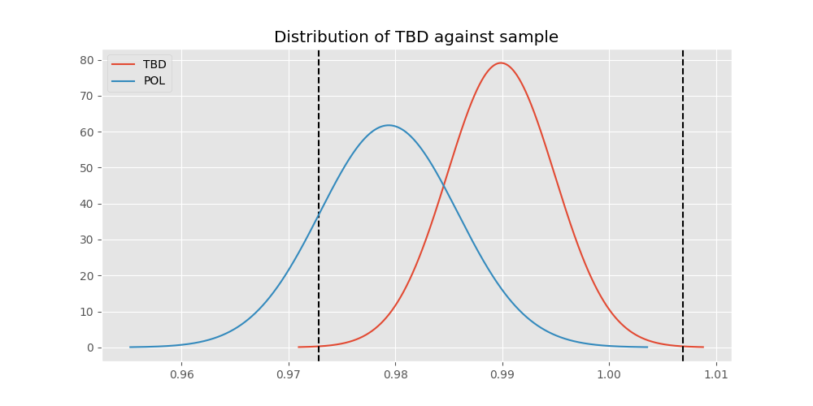 
## Testing Results for TBD against LTU 
TBD has a success rate of 0.9898734177215189
LTU has a success rate of 0.984375
$H_{0}$: There is not a difference between TBD and LTU
$H_{A}$: There is a difference between TBD and LTU
An $/alpha$ of 0.0008064516129032258 was used in this test.
__independent t-testing__: With a t-statistic of 0.6550328229107256 and a p-value of 0.5126578855129468, _we failed to reject the null hypothssis_
__Man-Whitney testing__: With a u-statistic of 63547.5 and a p-value of 0.5128850514230756, _we failed to reject the null hypothssis_
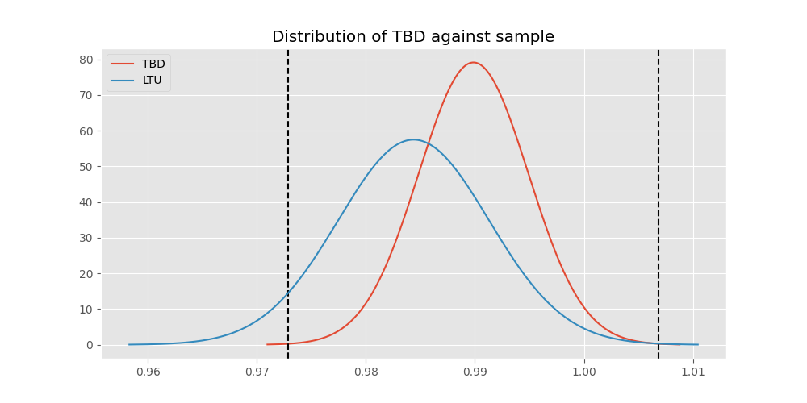 
## Testing Results for TBD against SVN 
TBD has a success rate of 0.9898734177215189
SVN has a success rate of 0.9770114942528736
$H_{0}$: There is not a difference between TBD and SVN
$H_{A}$: There is a difference between TBD and SVN
An $/alpha$ of 0.0008064516129032258 was used in this test.
__independent t-testing__: With a t-statistic of 0.9784491999756497 and a p-value of 0.32834507964612614, _we failed to reject the null hypothssis_
__Man-Whitney testing__: With a u-statistic of 17403.5 and a p-value of 0.32892633017256456, _we failed to reject the null hypothssis_
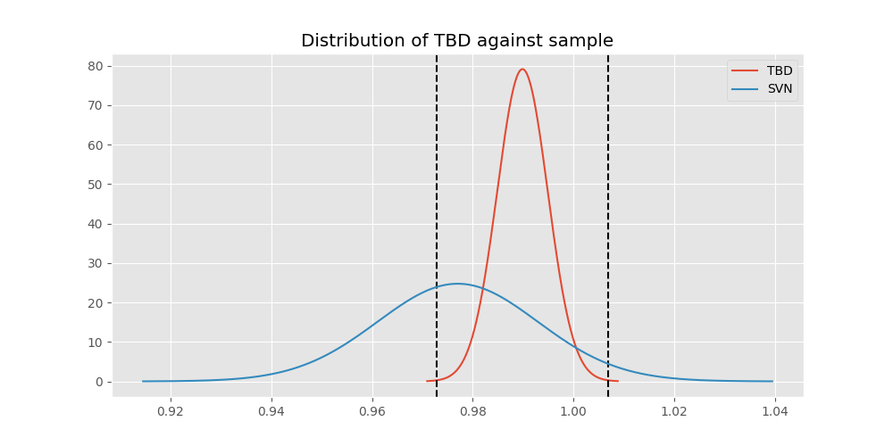 
## Testing Results for TBD against AUS 
TBD has a success rate of 0.9898734177215189
AUS has a success rate of 0.7289377289377289
$H_{0}$: There is not a difference between TBD and AUS
$H_{A}$: There is a difference between TBD and AUS
An $/alpha$ of 0.0008064516129032258 was used in this test.
__independent t-testing__: With a t-statistic of 11.243968858056872 and a p-value of 5.6072899122131136e-27, _we **reject** the null hypothssis_
__Man-Whitney testing__: With a u-statistic of 67986.5 and a p-value of 6.000920366403696e-25, _we **reject** the null hypothssis_
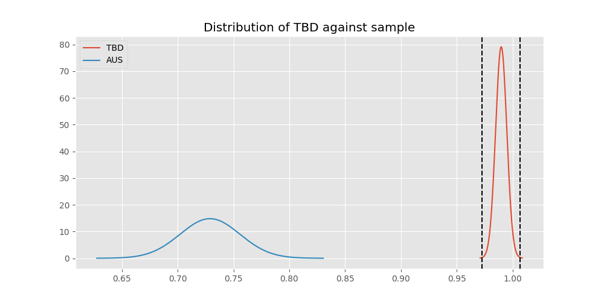 
## Testing Results for TBD against UKR 
TBD has a success rate of 0.9898734177215189
UKR has a success rate of 0.981549815498155
$H_{0}$: There is not a difference between TBD and UKR
$H_{A}$: There is a difference between TBD and UKR
An $/alpha$ of 0.0008064516129032258 was used in this test.
__independent t-testing__: With a t-statistic of 0.9131605415350165 and a p-value of 0.3614895508165433, _we failed to reject the null hypothssis_
__Man-Whitney testing__: With a u-statistic of 53968.0 and a p-value of 0.36163732254775394, _we failed to reject the null hypothssis_
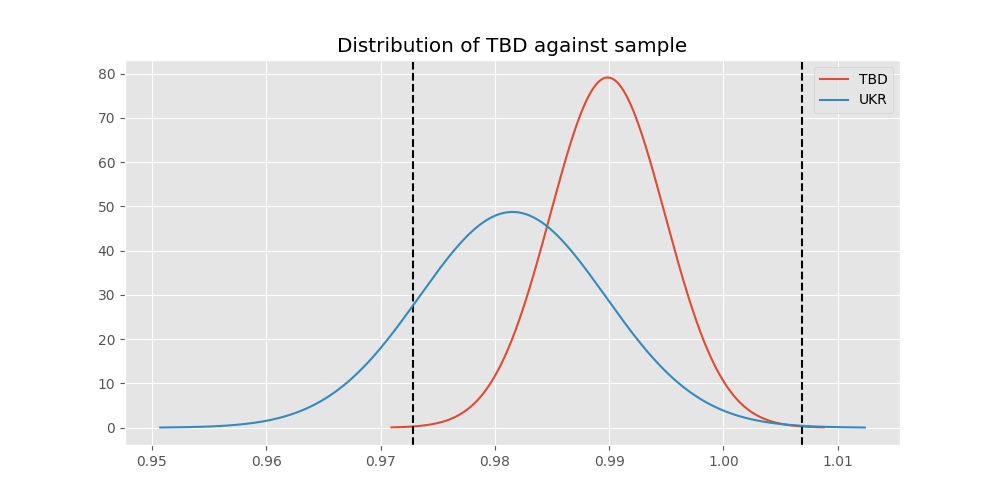 
## Testing Results for TBD against CIS 
TBD has a success rate of 0.9898734177215189
CIS has a success rate of 0.837386018237082
$H_{0}$: There is not a difference between TBD and CIS
$H_{A}$: There is a difference between TBD and CIS
An $/alpha$ of 0.0008064516129032258 was used in this test.
__independent t-testing__: With a t-statistic of 8.029490492823932 and a p-value of 2.6070117823323468e-15, _we **reject** the null hypothssis_
__Man-Whitney testing__: With a u-statistic of 149771.5 and a p-value of 6.314527551108603e-15, _we **reject** the null hypothssis_
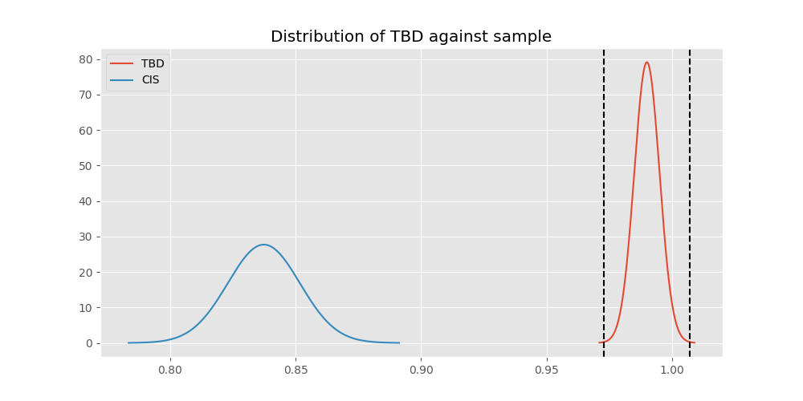 
## Testing Results for TBD against SAFR 
TBD has a success rate of 0.9898734177215189
SAFR has a success rate of 0.9328358208955224
$H_{0}$: There is not a difference between TBD and SAFR
$H_{A}$: There is a difference between TBD and SAFR
An $/alpha$ of 0.0008064516129032258 was used in this test.
__independent t-testing__: With a t-statistic of 3.726215606855246 and a p-value of 0.00021537486437829507, _we **reject** the null hypothssis_
__Man-Whitney testing__: With a u-statistic of 27974.5 and a p-value of 0.0002329171291079488, _we **reject** the null hypothssis_
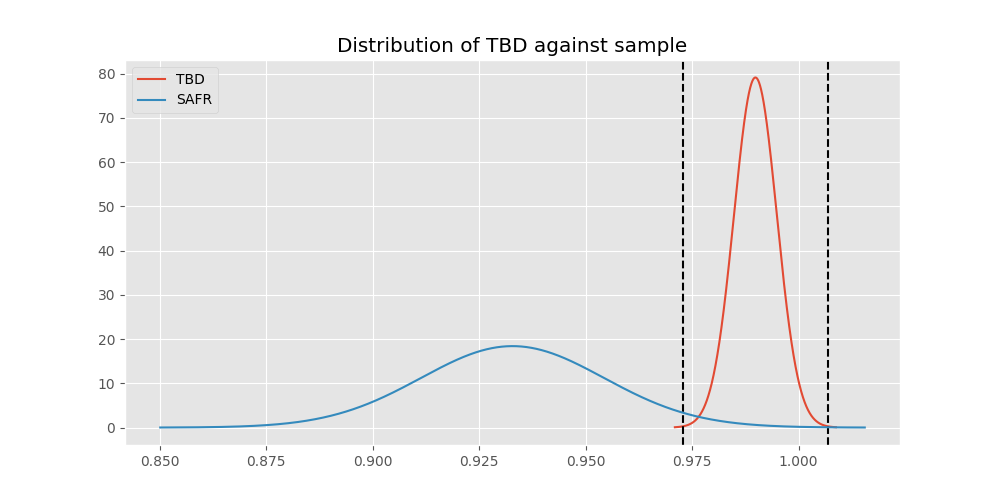 
## Testing Results for TBD against ESA 
TBD has a success rate of 0.9898734177215189
ESA has a success rate of 0.9811320754716981
$H_{0}$: There is not a difference between TBD and ESA
$H_{A}$: There is a difference between TBD and ESA
An $/alpha$ of 0.0008064516129032258 was used in this test.
__independent t-testing__: With a t-statistic of 0.7335600875060064 and a p-value of 0.4635613884087101, _we failed to reject the null hypothssis_
__Man-Whitney testing__: With a u-statistic of 21118.0 and a p-value of 0.46423329470972363, _we failed to reject the null hypothssis_
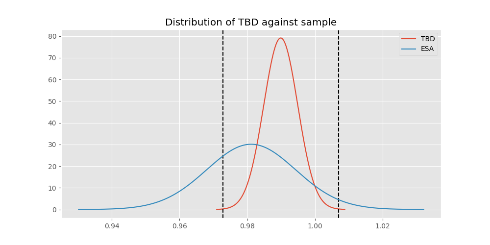 
## Testing Results for TBD against UK 
TBD has a success rate of 0.9898734177215189
UK has a success rate of 0.9881796690307328
$H_{0}$: There is not a difference between TBD and UK
$H_{A}$: There is a difference between TBD and UK
An $/alpha$ of 0.0008064516129032258 was used in this test.
__independent t-testing__: With a t-statistic of 0.26296271475284816 and a p-value of 0.7926230372396598, _we failed to reject the null hypothssis_
__Man-Whitney testing__: With a u-statistic of 167368.0 and a p-value of 0.7928614448819042, _we failed to reject the null hypothssis_
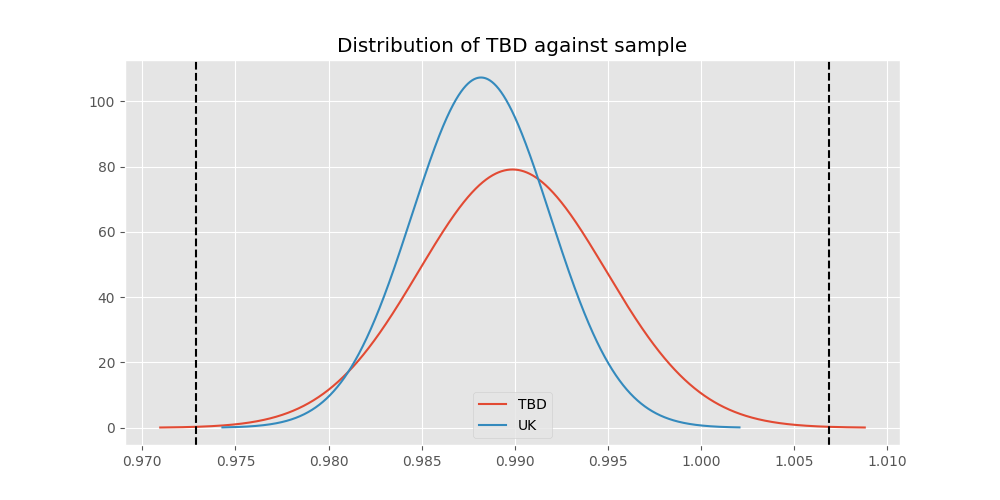 
## Testing Results for TBD against GER 
TBD has a success rate of 0.9898734177215189
GER has a success rate of 0.9766233766233766
$H_{0}$: There is not a difference between TBD and GER
$H_{A}$: There is a difference between TBD and GER
An $/alpha$ of 0.0008064516129032258 was used in this test.
__independent t-testing__: With a t-statistic of 1.6802755728975687 and a p-value of 0.09301926115350621, _we failed to reject the null hypothssis_
__Man-Whitney testing__: With a u-statistic of 462270.0 and a p-value of 0.09304092795628624, _we failed to reject the null hypothssis_
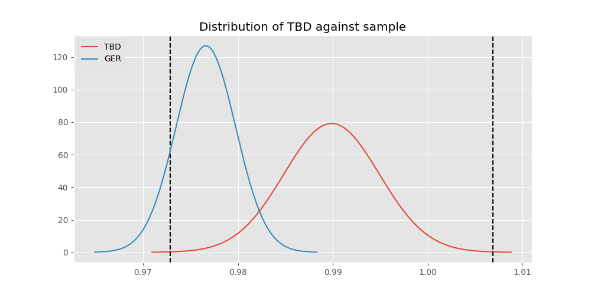 
