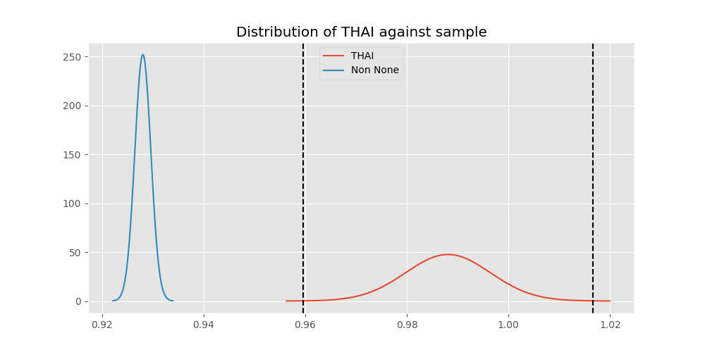

# Testing Results For THAI 
$H_{0}$: There is not a difference in collection success against THAI 
$H_{A}$: There is a difference in collection success against THAI
An $\alpha$ of 0.0008064516129032258 was used 
Out of 25 tests, there were 7 rejections from 25 independent-t test.
Out of 25 tests, there were 7 rejections from 25 Man Whitney u-tests.
## Testing Results for THAI against IND 
THAI has a success rate of 0.9880952380952381
IND has a success rate of 0.9704433497536946
$H_{0}$: There is not a difference between THAI and IND
$H_{A}$: There is a difference between THAI and IND
An $/alpha$ of 0.0008064516129032258 was used in this test.
__independent t-testing__: With a t-statistic of 1.2469190498962157 and a p-value of 0.21293751545639833, _we failed to reject the null hypothssis_
__Man-Whitney testing__: With a u-statistic of 34706.0 and a p-value of 0.2130285958055247, _we failed to reject the null hypothssis_
 
## Testing Results for THAI against GUAT 
THAI has a success rate of 0.9880952380952381
GUAT has a success rate of 0.9705882352941176
$H_{0}$: There is not a difference between THAI and GUAT
$H_{A}$: There is a difference between THAI and GUAT
An $/alpha$ of 0.0008064516129032258 was used in this test.
__independent t-testing__: With a t-statistic of 0.941403261023071 and a p-value of 0.3474690820502212, _we failed to reject the null hypothssis_
__Man-Whitney testing__: With a u-statistic of 5812.0 and a p-value of 0.3487981429968735, _we failed to reject the null hypothssis_
 
## Testing Results for THAI against IT 
THAI has a success rate of 0.9880952380952381
IT has a success rate of 0.9217391304347826
$H_{0}$: There is not a difference between THAI and IT
$H_{A}$: There is a difference between THAI and IT
An $/alpha$ of 0.0008064516129032258 was used in this test.
__independent t-testing__: With a t-statistic of 3.1527385852383394 and a p-value of 0.001661795717265248, _we failed to reject the null hypothssis_
__Man-Whitney testing__: With a u-statistic of 82408.0 and a p-value of 0.0016920903548474915, _we failed to reject the null hypothssis_
 
## Testing Results for THAI against EST 
THAI has a success rate of 0.9880952380952381
EST has a success rate of 0.975
$H_{0}$: There is not a difference between THAI and EST
$H_{A}$: There is a difference between THAI and EST
An $/alpha$ of 0.0008064516129032258 was used in this test.
__independent t-testing__: With a t-statistic of 0.6218725082974537 and a p-value of 0.5347133405297371, _we failed to reject the null hypothssis_
__Man-Whitney testing__: With a u-statistic of 3404.0 and a p-value of 0.5380802987396827, _we failed to reject the null hypothssis_
 
## Testing Results for THAI against SKOR 
THAI has a success rate of 0.9880952380952381
SKOR has a success rate of 0.9166666666666666
$H_{0}$: There is not a difference between THAI and SKOR
$H_{A}$: There is a difference between THAI and SKOR
An $/alpha$ of 0.0008064516129032258 was used in this test.
__independent t-testing__: With a t-statistic of 2.7877438734750775 and a p-value of 0.005759520740940069, _we failed to reject the null hypothssis_
__Man-Whitney testing__: With a u-statistic of 5400.0 and a p-value of 0.0060833171073590864, _we failed to reject the null hypothssis_
 
## Testing Results for THAI against RP 
THAI has a success rate of 0.9880952380952381
RP has a success rate of 0.6735187424425635
$H_{0}$: There is not a difference between THAI and RP
$H_{A}$: There is a difference between THAI and RP
An $/alpha$ of 0.0008064516129032258 was used in this test.
__independent t-testing__: With a t-statistic of 8.639587046351146 and a p-value of 2.2249700700424306e-17, _we **reject** the null hypothssis_
__Man-Whitney testing__: With a u-statistic of 91321.0 and a p-value of 7.677595012828063e-17, _we **reject** the null hypothssis_
 
## Testing Results for THAI against JPN 
THAI has a success rate of 0.9880952380952381
JPN has a success rate of 0.6016371077762619
$H_{0}$: There is not a difference between THAI and JPN
$H_{A}$: There is a difference between THAI and JPN
An $/alpha$ of 0.0008064516129032258 was used in this test.
__independent t-testing__: With a t-statistic of 10.163393850607875 and a p-value of 4.806823464396376e-23, _we **reject** the null hypothssis_
__Man-Whitney testing__: With a u-statistic of 85367.0 and a p-value of 5.938364967613091e-22, _we **reject** the null hypothssis_
 
## Testing Results for THAI against US 
THAI has a success rate of 0.9880952380952381
US has a success rate of 0.918885774351787
$H_{0}$: There is not a difference between THAI and US
$H_{A}$: There is a difference between THAI and US
An $/alpha$ of 0.0008064516129032258 was used in this test.
__independent t-testing__: With a t-statistic of 3.277635164794803 and a p-value of 0.0010528907145330524, _we failed to reject the null hypothssis_
__Man-Whitney testing__: With a u-statistic of 512656.0 and a p-value of 0.0010571006895404417, _we failed to reject the null hypothssis_
 
## Testing Results for THAI against KAZ 
THAI has a success rate of 0.9880952380952381
KAZ has a success rate of 0.989010989010989
$H_{0}$: There is not a difference between THAI and KAZ
$H_{A}$: There is a difference between THAI and KAZ
An $/alpha$ of 0.0008064516129032258 was used in this test.
__independent t-testing__: With a t-statistic of -0.08029588635445108 and a p-value of 0.936048085838562, _we failed to reject the null hypothssis_
__Man-Whitney testing__: With a u-statistic of 15274.0 and a p-value of 0.9381950651058252, _we failed to reject the null hypothssis_
 
## Testing Results for THAI against ROC 
THAI has a success rate of 0.9880952380952381
ROC has a success rate of 0.17751479289940827
$H_{0}$: There is not a difference between THAI and ROC
$H_{A}$: There is a difference between THAI and ROC
An $/alpha$ of 0.0008064516129032258 was used in this test.
__independent t-testing__: With a t-statistic of 26.378304542753778 and a p-value of 9.14229501758365e-84, _we **reject** the null hypothssis_
__Man-Whitney testing__: With a u-statistic of 25703.0 and a p-value of 2.995521061002053e-51, _we **reject** the null hypothssis_
 
## Testing Results for THAI against FR 
THAI has a success rate of 0.9880952380952381
FR has a success rate of 0.908183632734531
$H_{0}$: There is not a difference between THAI and FR
$H_{A}$: There is a difference between THAI and FR
An $/alpha$ of 0.0008064516129032258 was used in this test.
__independent t-testing__: With a t-statistic of 3.4997022577504033 and a p-value of 0.0004967727056963897, _we **reject** the null hypothssis_
__Man-Whitney testing__: With a u-statistic of 45447.0 and a p-value of 0.0005202861859558988, _we **reject** the null hypothssis_
 
## Testing Results for THAI against TURK 
THAI has a success rate of 0.9880952380952381
TURK has a success rate of 0.9962264150943396
$H_{0}$: There is not a difference between THAI and TURK
$H_{A}$: There is a difference between THAI and TURK
An $/alpha$ of 0.0008064516129032258 was used in this test.
__independent t-testing__: With a t-statistic of -0.992820690441888 and a p-value of 0.3213543952105111, _we failed to reject the null hypothssis_
__Man-Whitney testing__: With a u-statistic of 22079.0 and a p-value of 0.322127937722792, _we failed to reject the null hypothssis_
 
## Testing Results for THAI against PRC 
THAI has a success rate of 0.9880952380952381
PRC has a success rate of 0.988759187202767
$H_{0}$: There is not a difference between THAI and PRC
$H_{A}$: There is a difference between THAI and PRC
An $/alpha$ of 0.0008064516129032258 was used in this test.
__independent t-testing__: With a t-statistic of -0.07862999786852705 and a p-value of 0.9373332726112292, _we failed to reject the null hypothssis_
__Man-Whitney testing__: With a u-statistic of 194163.0 and a p-value of 0.9375568609347938, _we failed to reject the null hypothssis_
 
## Testing Results for THAI against BEL 
THAI has a success rate of 0.9880952380952381
BEL has a success rate of 0.8883495145631068
$H_{0}$: There is not a difference between THAI and BEL
$H_{A}$: There is a difference between THAI and BEL
An $/alpha$ of 0.0008064516129032258 was used in this test.
__independent t-testing__: With a t-statistic of 3.909438942985504 and a p-value of 0.00010992878207882294, _we **reject** the null hypothssis_
__Man-Whitney testing__: With a u-statistic of 19030.0 and a p-value of 0.0001252802027608564, _we **reject** the null hypothssis_
 
## Testing Results for THAI against POL 
THAI has a success rate of 0.9880952380952381
POL has a success rate of 0.979381443298969
$H_{0}$: There is not a difference between THAI and POL
$H_{A}$: There is a difference between THAI and POL
An $/alpha$ of 0.0008064516129032258 was used in this test.
__independent t-testing__: With a t-statistic of 0.72389973927425 and a p-value of 0.4693873357200635, _we failed to reject the null hypothssis_
__Man-Whitney testing__: With a u-statistic of 41095.0 and a p-value of 0.46959131916945374, _we failed to reject the null hypothssis_
 
## Testing Results for THAI against LTU 
THAI has a success rate of 0.9880952380952381
LTU has a success rate of 0.984375
$H_{0}$: There is not a difference between THAI and LTU
$H_{A}$: There is a difference between THAI and LTU
An $/alpha$ of 0.0008064516129032258 was used in this test.
__independent t-testing__: With a t-statistic of 0.32775168498333435 and a p-value of 0.7432405620459179, _we failed to reject the null hypothssis_
__Man-Whitney testing__: With a u-statistic of 26980.0 and a p-value of 0.7441125161564671, _we failed to reject the null hypothssis_
 
## Testing Results for THAI against SVN 
THAI has a success rate of 0.9880952380952381
SVN has a success rate of 0.9770114942528736
$H_{0}$: There is not a difference between THAI and SVN
$H_{A}$: There is a difference between THAI and SVN
An $/alpha$ of 0.0008064516129032258 was used in this test.
__independent t-testing__: With a t-statistic of 0.673260054873375 and a p-value of 0.501396394976555, _we failed to reject the null hypothssis_
__Man-Whitney testing__: With a u-statistic of 7389.0 and a p-value of 0.5029691010278687, _we failed to reject the null hypothssis_
 
## Testing Results for THAI against AUS 
THAI has a success rate of 0.9880952380952381
AUS has a success rate of 0.7289377289377289
$H_{0}$: There is not a difference between THAI and AUS
$H_{A}$: There is a difference between THAI and AUS
An $/alpha$ of 0.0008064516129032258 was used in this test.
__independent t-testing__: With a t-statistic of 7.405229689403582 and a p-value of 6.751992448869383e-13, _we **reject** the null hypothssis_
__Man-Whitney testing__: With a u-statistic of 28875.0 and a p-value of 2.7617718084390526e-12, _we **reject** the null hypothssis_
 
## Testing Results for THAI against UKR 
THAI has a success rate of 0.9880952380952381
UKR has a success rate of 0.981549815498155
$H_{0}$: There is not a difference between THAI and UKR
$H_{A}$: There is a difference between THAI and UKR
An $/alpha$ of 0.0008064516129032258 was used in this test.
__independent t-testing__: With a t-statistic of 0.5310885178064343 and a p-value of 0.5956272556735086, _we failed to reject the null hypothssis_
__Man-Whitney testing__: With a u-statistic of 22913.0 and a p-value of 0.5962917387466211, _we failed to reject the null hypothssis_
 
## Testing Results for THAI against CIS 
THAI has a success rate of 0.9880952380952381
CIS has a success rate of 0.837386018237082
$H_{0}$: There is not a difference between THAI and CIS
$H_{A}$: There is a difference between THAI and CIS
An $/alpha$ of 0.0008064516129032258 was used in this test.
__independent t-testing__: With a t-statistic of 5.229847007089013 and a p-value of 2.1527195675211925e-07, _we **reject** the null hypothssis_
__Man-Whitney testing__: With a u-statistic of 63602.0 and a p-value of 2.633292325907115e-07, _we **reject** the null hypothssis_
 
## Testing Results for THAI against SAFR 
THAI has a success rate of 0.9880952380952381
SAFR has a success rate of 0.9328358208955224
$H_{0}$: There is not a difference between THAI and SAFR
$H_{A}$: There is a difference between THAI and SAFR
An $/alpha$ of 0.0008064516129032258 was used in this test.
__independent t-testing__: With a t-statistic of 2.5659326543985372 and a p-value of 0.010775468649314106, _we failed to reject the null hypothssis_
__Man-Whitney testing__: With a u-statistic of 11878.0 and a p-value of 0.011072131638100556, _we failed to reject the null hypothssis_
 
## Testing Results for THAI against TBD 
THAI has a success rate of 0.9880952380952381
TBD has a success rate of 0.9898734177215189
$H_{0}$: There is not a difference between THAI and TBD
$H_{A}$: There is a difference between THAI and TBD
An $/alpha$ of 0.0008064516129032258 was used in this test.
__independent t-testing__: With a t-statistic of -0.18768115193070262 and a p-value of 0.8511944678699205, _we failed to reject the null hypothssis_
__Man-Whitney testing__: With a u-statistic of 33121.0 and a p-value of 0.8522482693814125, _we failed to reject the null hypothssis_
 
## Testing Results for THAI against ESA 
THAI has a success rate of 0.9880952380952381
ESA has a success rate of 0.9811320754716981
$H_{0}$: There is not a difference between THAI and ESA
$H_{A}$: There is a difference between THAI and ESA
An $/alpha$ of 0.0008064516129032258 was used in this test.
__independent t-testing__: With a t-statistic of 0.46650935697335155 and a p-value of 0.6412243638424735, _we failed to reject the null hypothssis_
__Man-Whitney testing__: With a u-statistic of 8966.0 and a p-value of 0.6430693020291731, _we failed to reject the null hypothssis_
 
## Testing Results for THAI against UK 
THAI has a success rate of 0.9880952380952381
UK has a success rate of 0.9881796690307328
$H_{0}$: There is not a difference between THAI and UK
$H_{A}$: There is a difference between THAI and UK
An $/alpha$ of 0.0008064516129032258 was used in this test.
__independent t-testing__: With a t-statistic of -0.009234368781174807 and a p-value of 0.9926339644355466, _we failed to reject the null hypothssis_
__Man-Whitney testing__: With a u-statistic of 71058.0 and a p-value of 0.9932427813569753, _we failed to reject the null hypothssis_
 
## Testing Results for THAI against GER 
THAI has a success rate of 0.9880952380952381
GER has a success rate of 0.9766233766233766
$H_{0}$: There is not a difference between THAI and GER
$H_{A}$: There is a difference between THAI and GER
An $/alpha$ of 0.0008064516129032258 was used in this test.
__independent t-testing__: With a t-statistic of 0.9657629605886184 and a p-value of 0.33425712319488965, _we failed to reject the null hypothssis_
__Man-Whitney testing__: With a u-statistic of 196266.0 and a p-value of 0.33426482439395233, _we failed to reject the null hypothssis_
 
