# Testing Results For TURK 
$H_{0}$: There is not a difference in collection success against TURK 
$H_{A}$: There is a difference in collection success against TURK
An $\alpha$ of 0.0008064516129032258 was used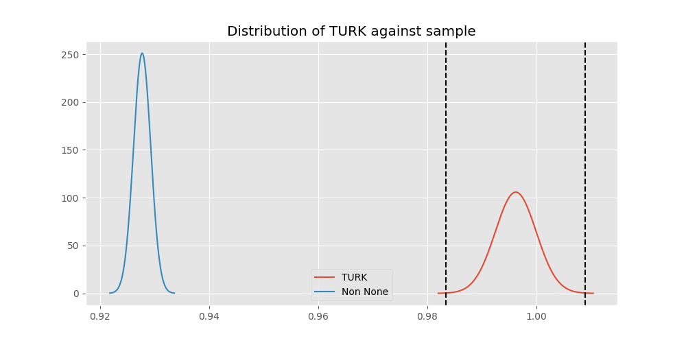 
Out of 25 tests, there were 11 rejections from 25 independent-t test.
Out of 25 tests, there were 11 rejections from 25 Man Whitney u-tests.
## Testing Results for TURK against IND 
TURK has a success rate of 0.9962264150943396
IND has a success rate of 0.9704433497536946
$H_{0}$: There is not a difference between TURK and IND
$H_{A}$: There is a difference between TURK and IND
An $/alpha$ of 0.0008064516129032258 was used in this test.
__independent t-testing__: With a t-statistic of 2.3750469358742006 and a p-value of 0.017827655383784547, _we failed to reject the null hypothssis_
__Man-Whitney testing__: With a u-statistic of 55182.0 and a p-value of 0.01798092741272375, _we failed to reject the null hypothssis_
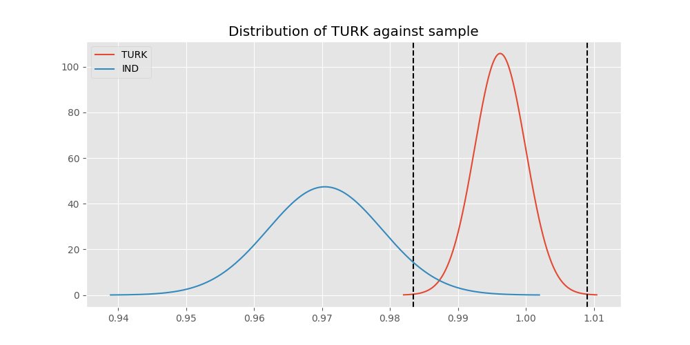 
## Testing Results for TURK against GUAT 
TURK has a success rate of 0.9962264150943396
GUAT has a success rate of 0.9705882352941176
$H_{0}$: There is not a difference between TURK and GUAT
$H_{A}$: There is a difference between TURK and GUAT
An $/alpha$ of 0.0008064516129032258 was used in this test.
__independent t-testing__: With a t-statistic of 2.0020490054367546 and a p-value of 0.046095031188415646, _we failed to reject the null hypothssis_
__Man-Whitney testing__: With a u-statistic of 9241.0 and a p-value of 0.04673144190719224, _we failed to reject the null hypothssis_
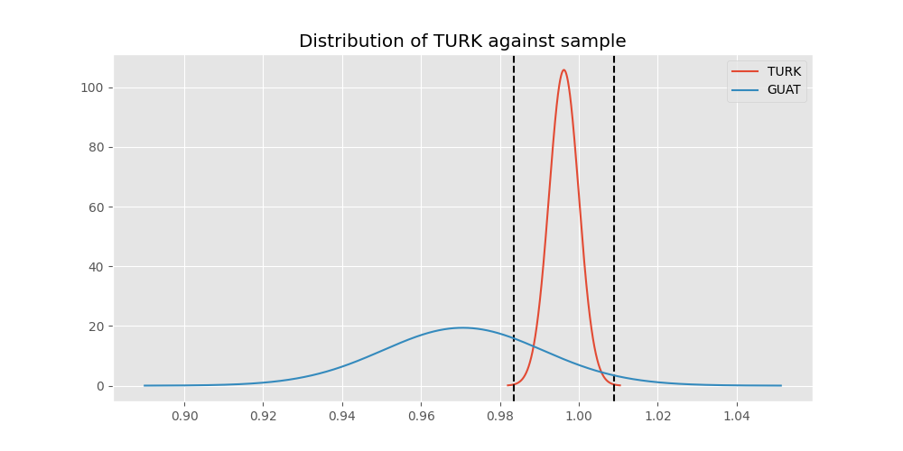 
## Testing Results for TURK against IT 
TURK has a success rate of 0.9962264150943396
IT has a success rate of 0.9217391304347826
$H_{0}$: There is not a difference between TURK and IT
$H_{A}$: There is a difference between TURK and IT
An $/alpha$ of 0.0008064516129032258 was used in this test.
__independent t-testing__: With a t-statistic of 4.477406208327433 and a p-value of 8.285571757584597e-06, _we **reject** the null hypothssis_
__Man-Whitney testing__: With a u-statistic of 130980.0 and a p-value of 8.9302361563212e-06, _we **reject** the null hypothssis_
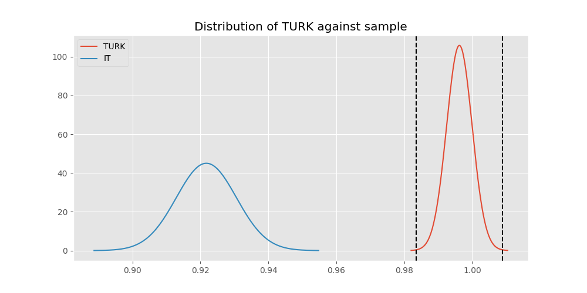 
## Testing Results for TURK against EST 
TURK has a success rate of 0.9962264150943396
EST has a success rate of 0.975
$H_{0}$: There is not a difference between TURK and EST
$H_{A}$: There is a difference between TURK and EST
An $/alpha$ of 0.0008064516129032258 was used in this test.
__independent t-testing__: With a t-statistic of 1.5514319283573648 and a p-value of 0.12184204359995392, _we failed to reject the null hypothssis_
__Man-Whitney testing__: With a u-statistic of 5412.5 and a p-value of 0.12332289441548903, _we failed to reject the null hypothssis_
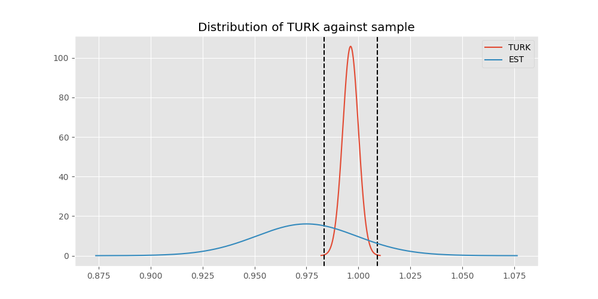 
## Testing Results for TURK against SKOR 
TURK has a success rate of 0.9962264150943396
SKOR has a success rate of 0.9166666666666666
$H_{0}$: There is not a difference between TURK and SKOR
$H_{A}$: There is a difference between TURK and SKOR
An $/alpha$ of 0.0008064516129032258 was used in this test.
__independent t-testing__: With a t-statistic of 4.23400705900083 and a p-value of 2.9963333379935116e-05, _we **reject** the null hypothssis_
__Man-Whitney testing__: With a u-statistic of 8582.5 and a p-value of 3.718669902878006e-05, _we **reject** the null hypothssis_
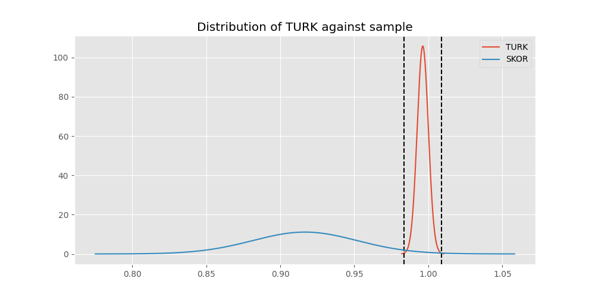 
## Testing Results for TURK against RP 
TURK has a success rate of 0.9962264150943396
RP has a success rate of 0.6735187424425635
$H_{0}$: There is not a difference between TURK and RP
$H_{A}$: There is a difference between TURK and RP
An $/alpha$ of 0.0008064516129032258 was used in this test.
__independent t-testing__: With a t-statistic of 11.162046825732537 and a p-value of 1.8079608013341323e-27, _we **reject** the null hypothssis_
__Man-Whitney testing__: With a u-statistic of 144939.0 and a p-value of 3.738510756582525e-26, _we **reject** the null hypothssis_
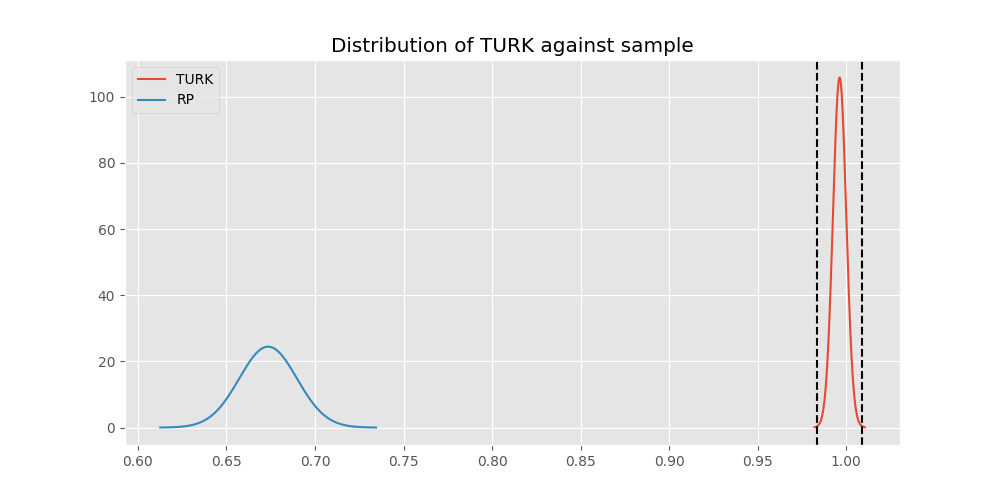 
## Testing Results for TURK against JPN 
TURK has a success rate of 0.9962264150943396
JPN has a success rate of 0.6016371077762619
$H_{0}$: There is not a difference between TURK and JPN
$H_{A}$: There is a difference between TURK and JPN
An $/alpha$ of 0.0008064516129032258 was used in this test.
__independent t-testing__: With a t-statistic of 13.070674289213127 and a p-value of 3.788428198494312e-36, _we **reject** the null hypothssis_
__Man-Whitney testing__: With a u-statistic of 135446.0 and a p-value of 1.317070557950771e-33, _we **reject** the null hypothssis_
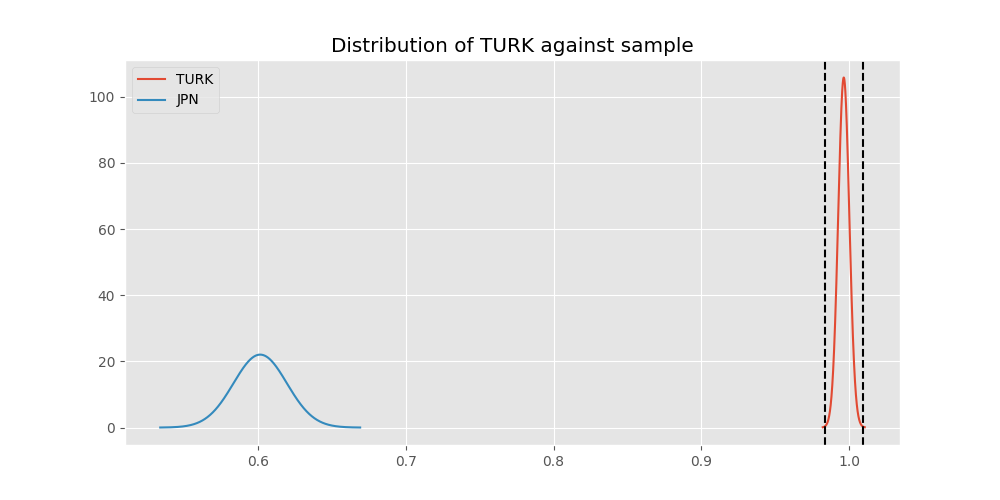 
## Testing Results for TURK against US 
TURK has a success rate of 0.9962264150943396
US has a success rate of 0.918885774351787
$H_{0}$: There is not a difference between TURK and US
$H_{A}$: There is a difference between TURK and US
An $/alpha$ of 0.0008064516129032258 was used in this test.
__independent t-testing__: With a t-statistic of 4.605436755614236 and a p-value of 4.2014012854853884e-06, _we **reject** the null hypothssis_
__Man-Whitney testing__: With a u-statistic of 814803.5 and a p-value of 4.273353344147236e-06, _we **reject** the null hypothssis_
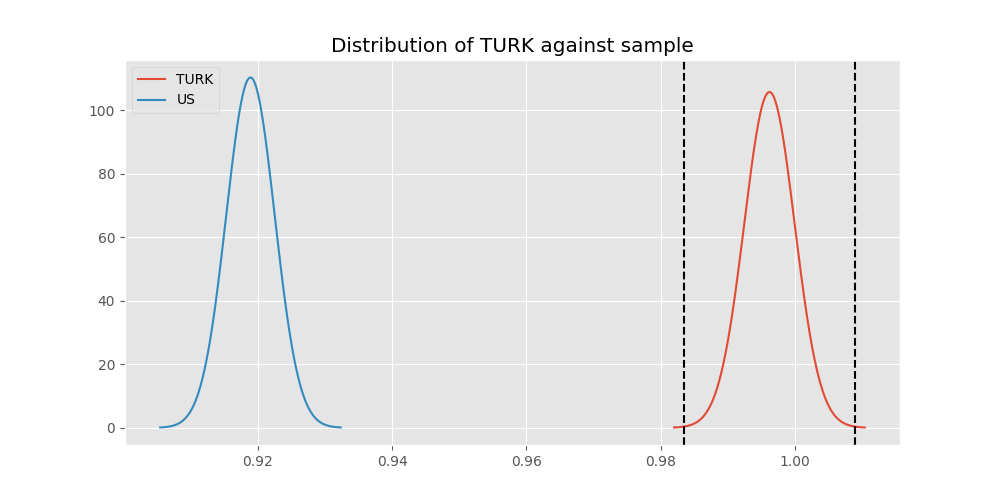 
## Testing Results for TURK against KAZ 
TURK has a success rate of 0.9962264150943396
KAZ has a success rate of 0.989010989010989
$H_{0}$: There is not a difference between TURK and KAZ
$H_{A}$: There is a difference between TURK and KAZ
An $/alpha$ of 0.0008064516129032258 was used in this test.
__independent t-testing__: With a t-statistic of 0.9167654528640253 and a p-value of 0.359762119611566, _we failed to reject the null hypothssis_
__Man-Whitney testing__: With a u-statistic of 24289.0 and a p-value of 0.36056206062847607, _we failed to reject the null hypothssis_
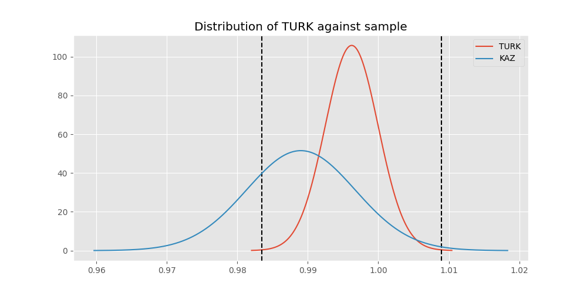 
## Testing Results for TURK against ROC 
TURK has a success rate of 0.9962264150943396
ROC has a success rate of 0.17751479289940827
$H_{0}$: There is not a difference between TURK and ROC
$H_{A}$: There is a difference between TURK and ROC
An $/alpha$ of 0.0008064516129032258 was used in this test.
__independent t-testing__: With a t-statistic of 34.11730349667781 and a p-value of 1.1536306747227618e-124, _we **reject** the null hypothssis_
__Man-Whitney testing__: With a u-statistic of 40725.5 and a p-value of 1.2031831495467728e-70, _we **reject** the null hypothssis_
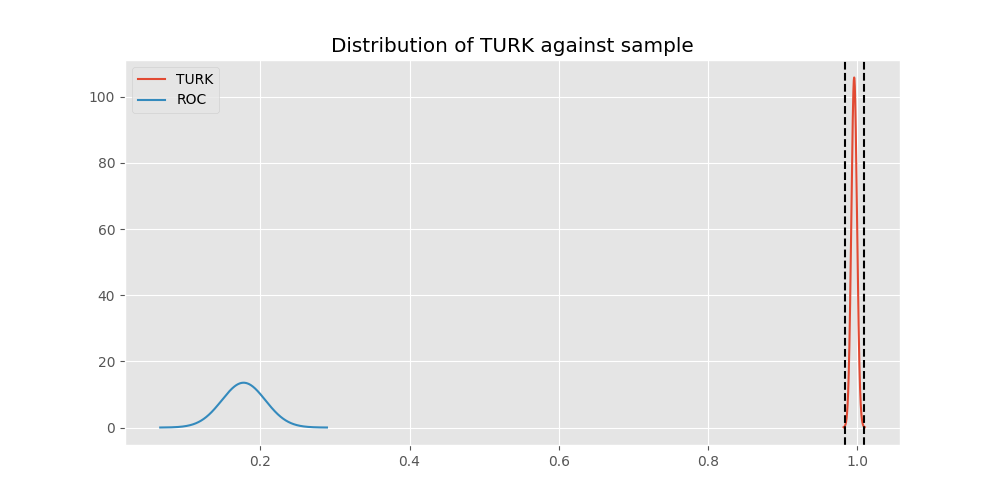 
## Testing Results for TURK against THAI 
TURK has a success rate of 0.9962264150943396
THAI has a success rate of 0.9880952380952381
$H_{0}$: There is not a difference between TURK and THAI
$H_{A}$: There is a difference between TURK and THAI
An $/alpha$ of 0.0008064516129032258 was used in this test.
__independent t-testing__: With a t-statistic of 0.992820690441888 and a p-value of 0.3213543952105111, _we failed to reject the null hypothssis_
__Man-Whitney testing__: With a u-statistic of 22441.0 and a p-value of 0.322127937722792, _we failed to reject the null hypothssis_
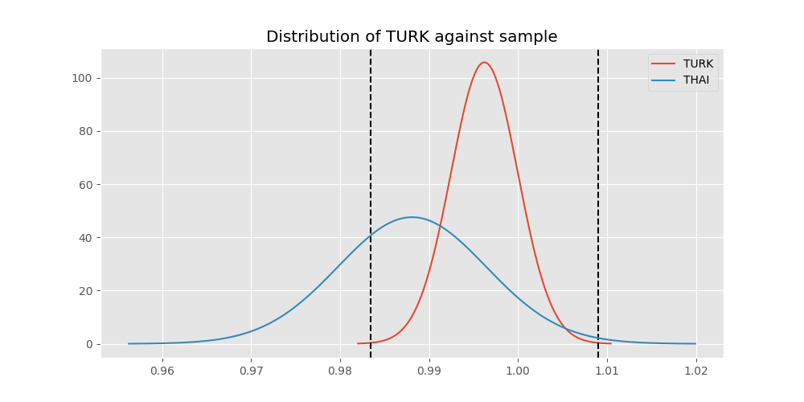 
## Testing Results for TURK against FR 
TURK has a success rate of 0.9962264150943396
FR has a success rate of 0.908183632734531
$H_{0}$: There is not a difference between TURK and FR
$H_{A}$: There is a difference between TURK and FR
An $/alpha$ of 0.0008064516129032258 was used in this test.
__independent t-testing__: With a t-statistic of 4.898742987360366 and a p-value of 1.177838925286824e-06, _we **reject** the null hypothssis_
__Man-Whitney testing__: With a u-statistic of 72227.0 and a p-value of 1.390818258482376e-06, _we **reject** the null hypothssis_
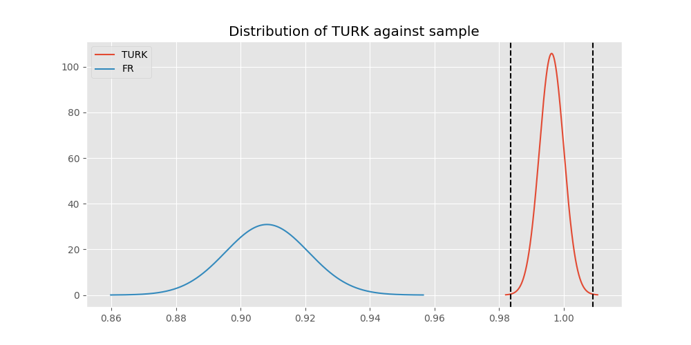 
## Testing Results for TURK against PRC 
TURK has a success rate of 0.9962264150943396
PRC has a success rate of 0.988759187202767
$H_{0}$: There is not a difference between TURK and PRC
$H_{A}$: There is a difference between TURK and PRC
An $/alpha$ of 0.0008064516129032258 was used in this test.
__independent t-testing__: With a t-statistic of 1.1308727898538105 and a p-value of 0.25821391098818675, _we failed to reject the null hypothssis_
__Man-Whitney testing__: With a u-statistic of 308761.0 and a p-value of 0.2582384188837469, _we failed to reject the null hypothssis_
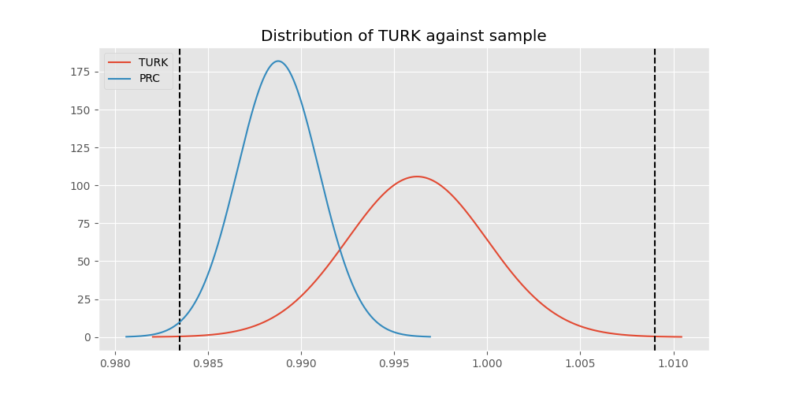 
## Testing Results for TURK against BEL 
TURK has a success rate of 0.9962264150943396
BEL has a success rate of 0.8883495145631068
$H_{0}$: There is not a difference between TURK and BEL
$H_{A}$: There is a difference between TURK and BEL
An $/alpha$ of 0.0008064516129032258 was used in this test.
__independent t-testing__: With a t-statistic of 5.433347325940515 and a p-value of 8.902634298530275e-08, _we **reject** the null hypothssis_
__Man-Whitney testing__: With a u-statistic of 30239.5 and a p-value of 1.3294669279322158e-07, _we **reject** the null hypothssis_
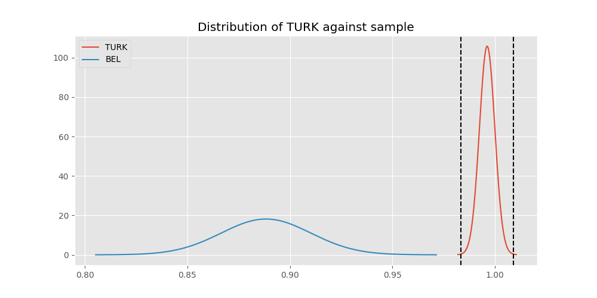 
## Testing Results for TURK against POL 
TURK has a success rate of 0.9962264150943396
POL has a success rate of 0.979381443298969
$H_{0}$: There is not a difference between TURK and POL
$H_{A}$: There is a difference between TURK and POL
An $/alpha$ of 0.0008064516129032258 was used in this test.
__independent t-testing__: With a t-statistic of 1.8360001707469173 and a p-value of 0.06675438962322491, _we failed to reject the null hypothssis_
__Man-Whitney testing__: With a u-statistic of 65345.0 and a p-value of 0.0669135123713524, _we failed to reject the null hypothssis_
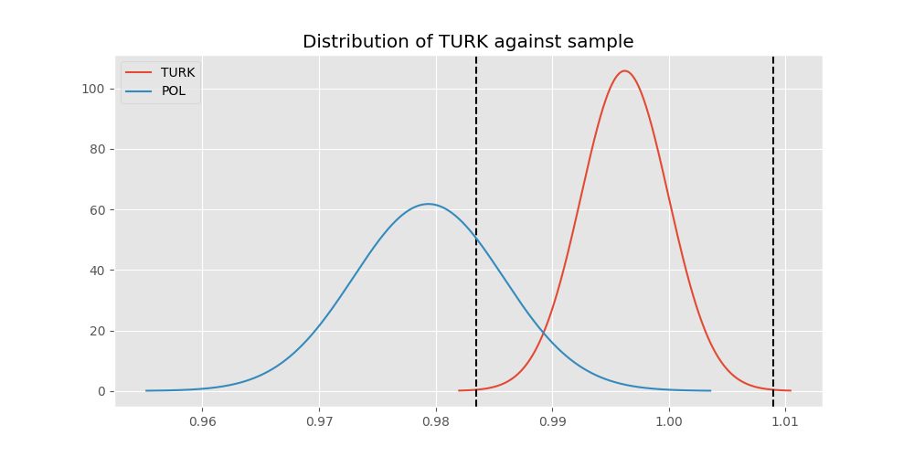 
## Testing Results for TURK against LTU 
TURK has a success rate of 0.9962264150943396
LTU has a success rate of 0.984375
$H_{0}$: There is not a difference between TURK and LTU
$H_{A}$: There is a difference between TURK and LTU
An $/alpha$ of 0.0008064516129032258 was used in this test.
__independent t-testing__: With a t-statistic of 1.416228332288618 and a p-value of 0.15724271385316727, _we failed to reject the null hypothssis_
__Man-Whitney testing__: With a u-statistic of 42902.5 and a p-value of 0.1574786481648468, _we failed to reject the null hypothssis_
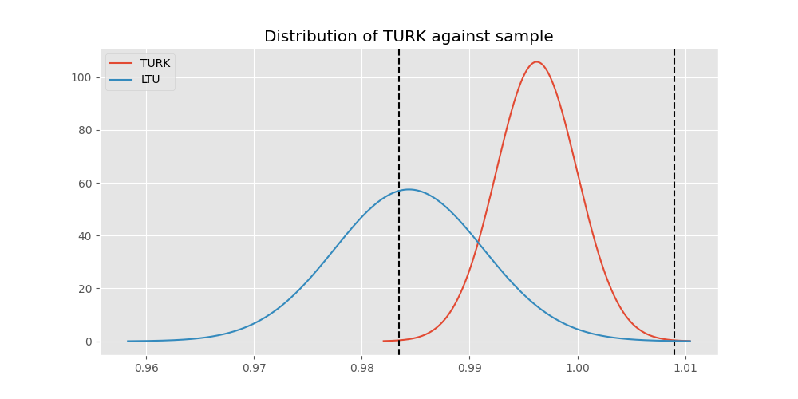 
## Testing Results for TURK against SVN 
TURK has a success rate of 0.9962264150943396
SVN has a success rate of 0.9770114942528736
$H_{0}$: There is not a difference between TURK and SVN
$H_{A}$: There is a difference between TURK and SVN
An $/alpha$ of 0.0008064516129032258 was used in this test.
__independent t-testing__: With a t-statistic of 1.6937702003518096 and a p-value of 0.09119862650658181, _we failed to reject the null hypothssis_
__Man-Whitney testing__: With a u-statistic of 11749.0 and a p-value of 0.09189875364160807, _we failed to reject the null hypothssis_
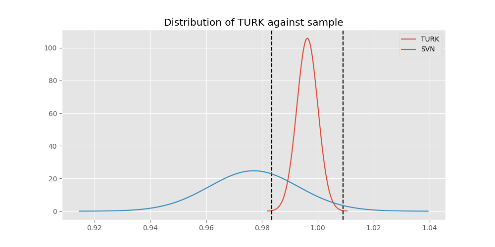 
## Testing Results for TURK against AUS 
TURK has a success rate of 0.9962264150943396
AUS has a success rate of 0.7289377289377289
$H_{0}$: There is not a difference between TURK and AUS
$H_{A}$: There is a difference between TURK and AUS
An $/alpha$ of 0.0008064516129032258 was used in this test.
__independent t-testing__: With a t-statistic of 9.68146722860896 and a p-value of 1.5450090111851118e-20, _we **reject** the null hypothssis_
__Man-Whitney testing__: With a u-statistic of 45841.0 and a p-value of 3.898325206060185e-19, _we **reject** the null hypothssis_
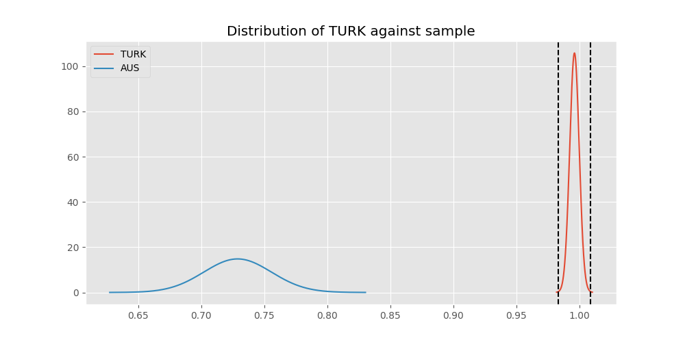 
## Testing Results for TURK against UKR 
TURK has a success rate of 0.9962264150943396
UKR has a success rate of 0.981549815498155
$H_{0}$: There is not a difference between TURK and UKR
$H_{A}$: There is a difference between TURK and UKR
An $/alpha$ of 0.0008064516129032258 was used in this test.
__independent t-testing__: With a t-statistic of 1.615656339787436 and a p-value of 0.10675925696514489, _we failed to reject the null hypothssis_
__Man-Whitney testing__: With a u-statistic of 36434.5 and a p-value of 0.10702730726931242, _we failed to reject the null hypothssis_
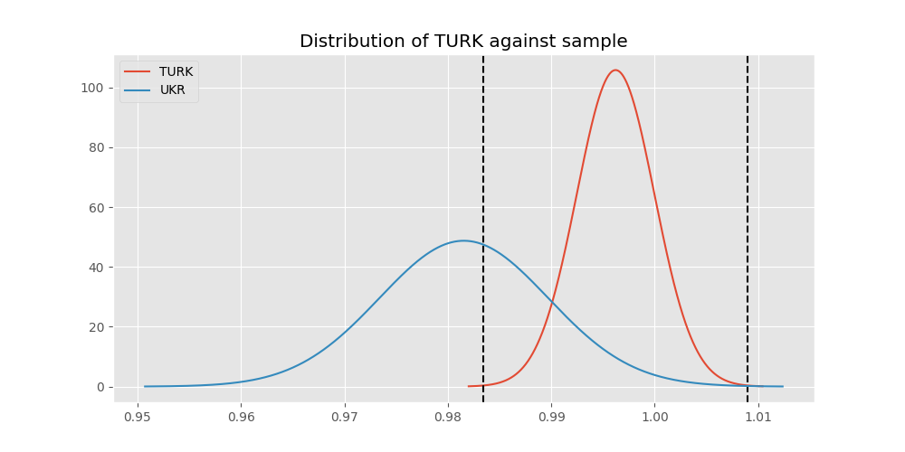 
## Testing Results for TURK against CIS 
TURK has a success rate of 0.9962264150943396
CIS has a success rate of 0.837386018237082
$H_{0}$: There is not a difference between TURK and CIS
$H_{A}$: There is a difference between TURK and CIS
An $/alpha$ of 0.0008064516129032258 was used in this test.
__independent t-testing__: With a t-statistic of 6.960974279327864 and a p-value of 6.416561736106794e-12, _we **reject** the null hypothssis_
__Man-Whitney testing__: With a u-statistic of 101033.5 and a p-value of 1.1352500224054466e-11, _we **reject** the null hypothssis_
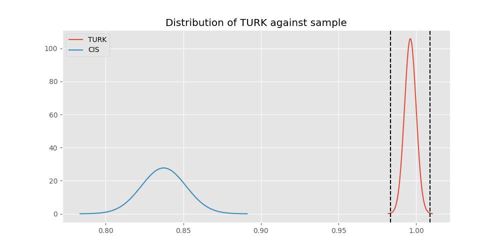 
## Testing Results for TURK against SAFR 
TURK has a success rate of 0.9962264150943396
SAFR has a success rate of 0.9328358208955224
$H_{0}$: There is not a difference between TURK and SAFR
$H_{A}$: There is a difference between TURK and SAFR
An $/alpha$ of 0.0008064516129032258 was used in this test.
__independent t-testing__: With a t-statistic of 3.8880848168292994 and a p-value of 0.00011840810865366383, _we **reject** the null hypothssis_
__Man-Whitney testing__: With a u-statistic of 18880.5 and a p-value of 0.00013387794578510244, _we **reject** the null hypothssis_
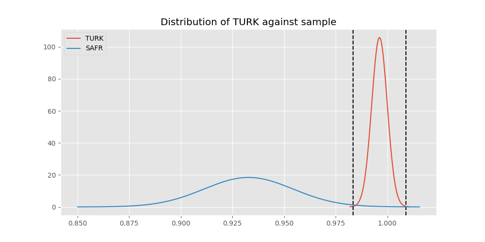 
## Testing Results for TURK against TBD 
TURK has a success rate of 0.9962264150943396
TBD has a success rate of 0.9898734177215189
$H_{0}$: There is not a difference between TURK and TBD
$H_{A}$: There is a difference between TURK and TBD
An $/alpha$ of 0.0008064516129032258 was used in this test.
__independent t-testing__: With a t-statistic of 0.9219083647772641 and a p-value of 0.3569142703020338, _we failed to reject the null hypothssis_
__Man-Whitney testing__: With a u-statistic of 52670.0 and a p-value of 0.3572452648626706, _we failed to reject the null hypothssis_
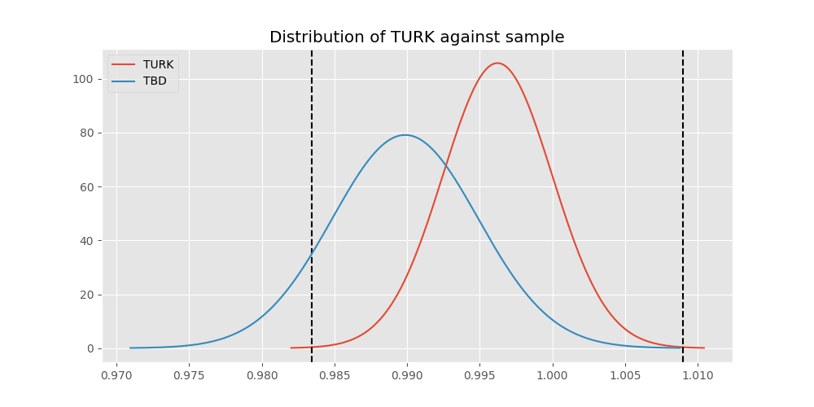 
## Testing Results for TURK against ESA 
TURK has a success rate of 0.9962264150943396
ESA has a success rate of 0.9811320754716981
$H_{0}$: There is not a difference between TURK and ESA
$H_{A}$: There is a difference between TURK and ESA
An $/alpha$ of 0.0008064516129032258 was used in this test.
__independent t-testing__: With a t-statistic of 1.4668345164135845 and a p-value of 0.14327279940600499, _we failed to reject the null hypothssis_
__Man-Whitney testing__: With a u-statistic of 14257.0 and a p-value of 0.14398718569967328, _we failed to reject the null hypothssis_
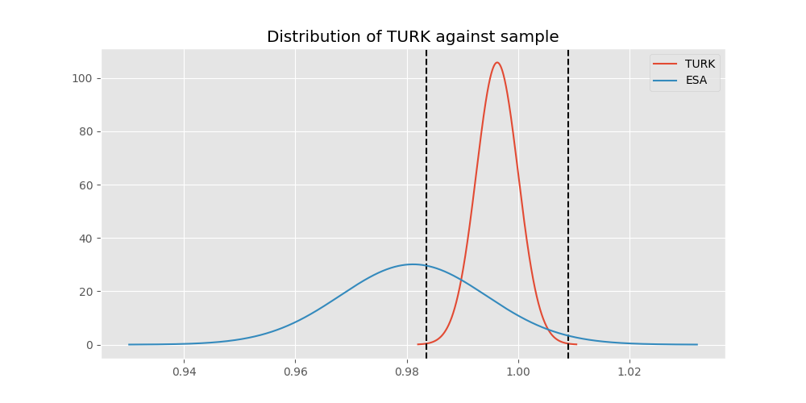 
## Testing Results for TURK against UK 
TURK has a success rate of 0.9962264150943396
UK has a success rate of 0.9881796690307328
$H_{0}$: There is not a difference between TURK and UK
$H_{A}$: There is a difference between TURK and UK
An $/alpha$ of 0.0008064516129032258 was used in this test.
__independent t-testing__: With a t-statistic of 1.1541497713054822 and a p-value of 0.24868742334104654, _we failed to reject the null hypothssis_
__Man-Whitney testing__: With a u-statistic of 112997.0 and a p-value of 0.24877188447992826, _we failed to reject the null hypothssis_
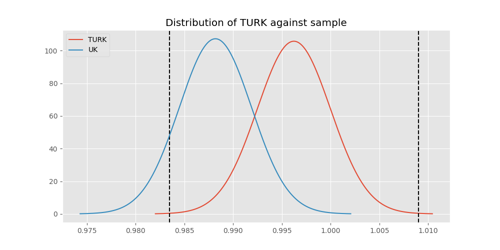 
## Testing Results for TURK against GER 
TURK has a success rate of 0.9962264150943396
GER has a success rate of 0.9766233766233766
$H_{0}$: There is not a difference between TURK and GER
$H_{A}$: There is a difference between TURK and GER
An $/alpha$ of 0.0008064516129032258 was used in this test.
__independent t-testing__: With a t-statistic of 2.09150766063592 and a p-value of 0.0365804079172935, _we failed to reject the null hypothssis_
__Man-Whitney testing__: With a u-statistic of 312075.0 and a p-value of 0.036621043550505, _we failed to reject the null hypothssis_
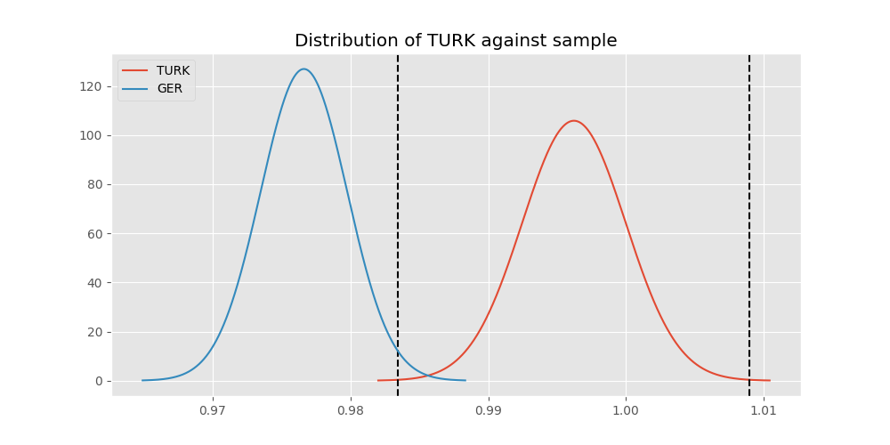 
