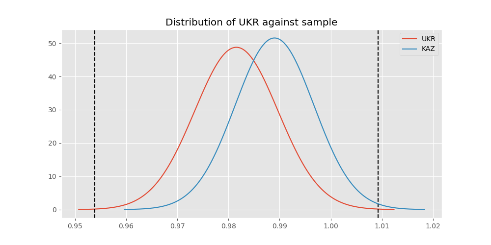
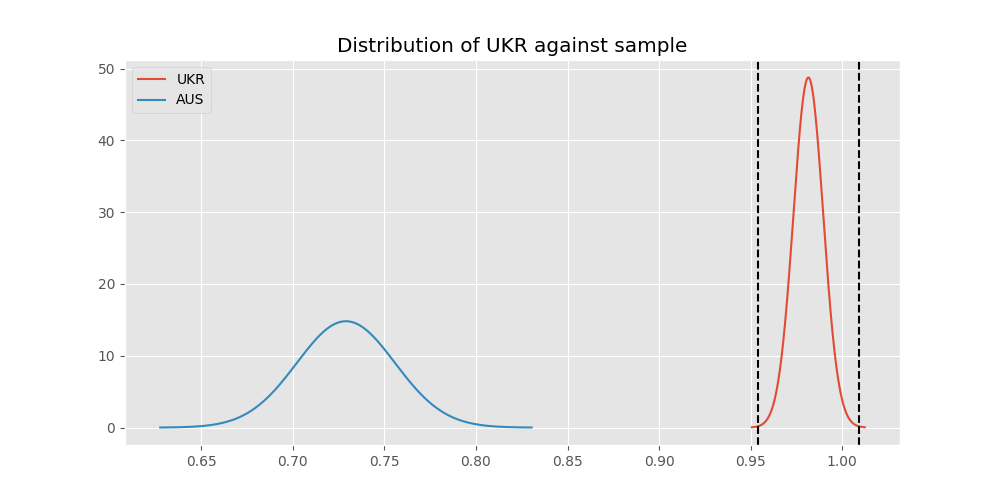

# Testing Results For UKR 
$H_{0}$: There is not a difference in collection success against UKR 
$H_{A}$: There is a difference in collection success against UKR
An $\alpha$ of 0.0008064516129032258 was used 
Out of 25 tests, there were 9 rejections from 25 independent-t test.
Out of 25 tests, there were 9 rejections from 25 Man Whitney u-tests.
## Testing Results for UKR against IND 
UKR has a success rate of 0.981549815498155
IND has a success rate of 0.9704433497536946
$H_{0}$: There is not a difference between UKR and IND
$H_{A}$: There is a difference between UKR and IND
An $/alpha$ of 0.0008064516129032258 was used in this test.
__independent t-testing__: With a t-statistic of 0.9041527956185024 and a p-value of 0.36623695731918204, _we failed to reject the null hypothssis_
__Man-Whitney testing__: With a u-statistic of 55624.0 and a p-value of 0.36624208654434154, _we failed to reject the null hypothssis_
 
## Testing Results for UKR against GUAT 
UKR has a success rate of 0.981549815498155
GUAT has a success rate of 0.9705882352941176
$H_{0}$: There is not a difference between UKR and GUAT
$H_{A}$: There is a difference between UKR and GUAT
An $/alpha$ of 0.0008064516129032258 was used in this test.
__independent t-testing__: With a t-statistic of 0.566912648061645 and a p-value of 0.5711509248403434, _we failed to reject the null hypothssis_
__Man-Whitney testing__: With a u-statistic of 9315.0 and a p-value of 0.5722960062353261, _we failed to reject the null hypothssis_
 
## Testing Results for UKR against IT 
UKR has a success rate of 0.981549815498155
IT has a success rate of 0.9217391304347826
$H_{0}$: There is not a difference between UKR and IT
$H_{A}$: There is a difference between UKR and IT
An $/alpha$ of 0.0008064516129032258 was used in this test.
__independent t-testing__: With a t-statistic of 3.534516105678728 and a p-value of 0.00042421268732491485, _we **reject** the null hypothssis_
__Man-Whitney testing__: With a u-statistic of 132116.0 and a p-value of 0.00043590326078764437, _we **reject** the null hypothssis_
 
## Testing Results for UKR against EST 
UKR has a success rate of 0.981549815498155
EST has a success rate of 0.975
$H_{0}$: There is not a difference between UKR and EST
$H_{A}$: There is a difference between UKR and EST
An $/alpha$ of 0.0008064516129032258 was used in this test.
__independent t-testing__: With a t-statistic of 0.28025449735208 and a p-value of 0.7794697875123416, _we failed to reject the null hypothssis_
__Man-Whitney testing__: With a u-statistic of 5455.5 and a p-value of 0.7819960177914747, _we failed to reject the null hypothssis_
 
## Testing Results for UKR against SKOR 
UKR has a success rate of 0.981549815498155
SKOR has a success rate of 0.9166666666666666
$H_{0}$: There is not a difference between UKR and SKOR
$H_{A}$: There is a difference between UKR and SKOR
An $/alpha$ of 0.0008064516129032258 was used in this test.
__independent t-testing__: With a t-statistic of 2.677430885603257 and a p-value of 0.007790973667646479, _we failed to reject the null hypothssis_
__Man-Whitney testing__: With a u-statistic of 8657.5 and a p-value of 0.008043520670299315, _we failed to reject the null hypothssis_
 
## Testing Results for UKR against RP 
UKR has a success rate of 0.981549815498155
RP has a success rate of 0.6735187424425635
$H_{0}$: There is not a difference between UKR and RP
$H_{A}$: There is a difference between UKR and RP
An $/alpha$ of 0.0008064516129032258 was used in this test.
__independent t-testing__: With a t-statistic of 10.660968257047127 and a p-value of 2.565424887320465e-25, _we **reject** the null hypothssis_
__Man-Whitney testing__: With a u-statistic of 146576.0 and a p-value of 3.237806474955346e-24, _we **reject** the null hypothssis_
 
## Testing Results for UKR against JPN 
UKR has a success rate of 0.981549815498155
JPN has a success rate of 0.6016371077762619
$H_{0}$: There is not a difference between UKR and JPN
$H_{A}$: There is a difference between UKR and JPN
An $/alpha$ of 0.0008064516129032258 was used in this test.
__independent t-testing__: With a t-statistic of 12.58767952545956 and a p-value of 7.727125808989057e-34, _we **reject** the null hypothssis_
__Man-Whitney testing__: With a u-statistic of 137055.0 and a p-value of 1.2380870255254619e-31, _we **reject** the null hypothssis_
 
## Testing Results for UKR against US 
UKR has a success rate of 0.981549815498155
US has a success rate of 0.918885774351787
$H_{0}$: There is not a difference between UKR and US
$H_{A}$: There is a difference between UKR and US
An $/alpha$ of 0.0008064516129032258 was used in this test.
__independent t-testing__: With a t-statistic of 3.7563022817733698 and a p-value of 0.00017408261930401588, _we **reject** the null hypothssis_
__Man-Whitney testing__: With a u-statistic of 821900.5 and a p-value of 0.00017532343361166078, _we **reject** the null hypothssis_
 
## Testing Results for UKR against KAZ 
UKR has a success rate of 0.981549815498155
KAZ has a success rate of 0.989010989010989
$H_{0}$: There is not a difference between UKR and KAZ
$H_{A}$: There is a difference between UKR and KAZ
An $/alpha$ of 0.0008064516129032258 was used in this test.
__independent t-testing__: With a t-statistic of -0.630072260434642 and a p-value of 0.5289663970837093, _we failed to reject the null hypothssis_
__Man-Whitney testing__: With a u-statistic of 24477.0 and a p-value of 0.5294933100533011, _we failed to reject the null hypothssis_
 
## Testing Results for UKR against ROC 
UKR has a success rate of 0.981549815498155
ROC has a success rate of 0.17751479289940827
$H_{0}$: There is not a difference between UKR and ROC
$H_{A}$: There is a difference between UKR and ROC
An $/alpha$ of 0.0008064516129032258 was used in this test.
__independent t-testing__: With a t-statistic of 31.564409845382862 and a p-value of 6.878967974473248e-115, _we **reject** the null hypothssis_
__Man-Whitney testing__: With a u-statistic of 41311.5 and a p-value of 2.7852596407761565e-68, _we **reject** the null hypothssis_
 
## Testing Results for UKR against THAI 
UKR has a success rate of 0.981549815498155
THAI has a success rate of 0.9880952380952381
$H_{0}$: There is not a difference between UKR and THAI
$H_{A}$: There is a difference between UKR and THAI
An $/alpha$ of 0.0008064516129032258 was used in this test.
__independent t-testing__: With a t-statistic of -0.5310885178064343 and a p-value of 0.5956272556735086, _we failed to reject the null hypothssis_
__Man-Whitney testing__: With a u-statistic of 22615.0 and a p-value of 0.5962917387466211, _we failed to reject the null hypothssis_
 
## Testing Results for UKR against FR 
UKR has a success rate of 0.981549815498155
FR has a success rate of 0.908183632734531
$H_{0}$: There is not a difference between UKR and FR
$H_{A}$: There is a difference between UKR and FR
An $/alpha$ of 0.0008064516129032258 was used in this test.
__independent t-testing__: With a t-statistic of 3.951401873451202 and a p-value of 8.483508038971604e-05, _we **reject** the null hypothssis_
__Man-Whitney testing__: With a u-statistic of 72866.0 and a p-value of 9.074751100284445e-05, _we **reject** the null hypothssis_
 
## Testing Results for UKR against TURK 
UKR has a success rate of 0.981549815498155
TURK has a success rate of 0.9962264150943396
$H_{0}$: There is not a difference between UKR and TURK
$H_{A}$: There is a difference between UKR and TURK
An $/alpha$ of 0.0008064516129032258 was used in this test.
__independent t-testing__: With a t-statistic of -1.6275898062000727 and a p-value of 0.10444218149774338, _we failed to reject the null hypothssis_
__Man-Whitney testing__: With a u-statistic of 35380.5 and a p-value of 0.10702730726931242, _we failed to reject the null hypothssis_
 
## Testing Results for UKR against PRC 
UKR has a success rate of 0.981549815498155
PRC has a success rate of 0.988759187202767
$H_{0}$: There is not a difference between UKR and PRC
$H_{A}$: There is a difference between UKR and PRC
An $/alpha$ of 0.0008064516129032258 was used in this test.
__independent t-testing__: With a t-statistic of -1.0311720930287518 and a p-value of 0.30255670373857013, _we failed to reject the null hypothssis_
__Man-Whitney testing__: With a u-statistic of 311152.0 and a p-value of 0.30257305060496775, _we failed to reject the null hypothssis_
 
## Testing Results for UKR against BEL 
UKR has a success rate of 0.981549815498155
BEL has a success rate of 0.8883495145631068
$H_{0}$: There is not a difference between UKR and BEL
$H_{A}$: There is a difference between UKR and BEL
An $/alpha$ of 0.0008064516129032258 was used in this test.
__independent t-testing__: With a t-statistic of 4.365376415179799 and a p-value of 1.5585084986240834e-05, _we **reject** the null hypothssis_
__Man-Whitney testing__: With a u-statistic of 30514.5 and a p-value of 1.835309920225393e-05, _we **reject** the null hypothssis_
 
## Testing Results for UKR against POL 
UKR has a success rate of 0.981549815498155
POL has a success rate of 0.979381443298969
$H_{0}$: There is not a difference between UKR and POL
$H_{A}$: There is a difference between UKR and POL
An $/alpha$ of 0.0008064516129032258 was used in this test.
__independent t-testing__: With a t-statistic of 0.2047539828009911 and a p-value of 0.8378196001214827, _we failed to reject the null hypothssis_
__Man-Whitney testing__: With a u-statistic of 65860.0 and a p-value of 0.8382244603547566, _we failed to reject the null hypothssis_
 
## Testing Results for UKR against LTU 
UKR has a success rate of 0.981549815498155
LTU has a success rate of 0.984375
$H_{0}$: There is not a difference between UKR and LTU
$H_{A}$: There is a difference between UKR and LTU
An $/alpha$ of 0.0008064516129032258 was used in this test.
__independent t-testing__: With a t-statistic of -0.26491216515130905 and a p-value of 0.7911698067107378, _we failed to reject the null hypothssis_
__Man-Whitney testing__: With a u-statistic of 43237.5 and a p-value of 0.7917498427079567, _we failed to reject the null hypothssis_
 
## Testing Results for UKR against SVN 
UKR has a success rate of 0.981549815498155
SVN has a success rate of 0.9770114942528736
$H_{0}$: There is not a difference between UKR and SVN
$H_{A}$: There is a difference between UKR and SVN
An $/alpha$ of 0.0008064516129032258 was used in this test.
__independent t-testing__: With a t-statistic of 0.26528020703435673 and a p-value of 0.7909471530783628, _we failed to reject the null hypothssis_
__Man-Whitney testing__: With a u-statistic of 11842.0 and a p-value of 0.7924397543511812, _we failed to reject the null hypothssis_
 
## Testing Results for UKR against AUS 
UKR has a success rate of 0.981549815498155
AUS has a success rate of 0.7289377289377289
$H_{0}$: There is not a difference between UKR and AUS
$H_{A}$: There is a difference between UKR and AUS
An $/alpha$ of 0.0008064516129032258 was used in this test.
__independent t-testing__: With a t-statistic of 8.940261550676961 and a p-value of 6.098029833657253e-18, _we **reject** the null hypothssis_
__Man-Whitney testing__: With a u-statistic of 46336.0 and a p-value of 6.639614819130494e-17, _we **reject** the null hypothssis_
 
## Testing Results for UKR against CIS 
UKR has a success rate of 0.981549815498155
CIS has a success rate of 0.837386018237082
$H_{0}$: There is not a difference between UKR and CIS
$H_{A}$: There is a difference between UKR and CIS
An $/alpha$ of 0.0008064516129032258 was used in this test.
__independent t-testing__: With a t-statistic of 6.255347016003105 and a p-value of 6.0493186441796e-10, _we **reject** the null hypothssis_
__Man-Whitney testing__: With a u-statistic of 102012.5 and a p-value of 8.76424815161289e-10, _we **reject** the null hypothssis_
 
## Testing Results for UKR against SAFR 
UKR has a success rate of 0.981549815498155
SAFR has a success rate of 0.9328358208955224
$H_{0}$: There is not a difference between UKR and SAFR
$H_{A}$: There is a difference between UKR and SAFR
An $/alpha$ of 0.0008064516129032258 was used in this test.
__independent t-testing__: With a t-statistic of 2.5388472546093928 and a p-value of 0.011497067882821366, _we failed to reject the null hypothssis_
__Man-Whitney testing__: With a u-statistic of 19041.5 and a p-value of 0.011719442187673276, _we failed to reject the null hypothssis_
 
## Testing Results for UKR against TBD 
UKR has a success rate of 0.981549815498155
TBD has a success rate of 0.9898734177215189
$H_{0}$: There is not a difference between UKR and TBD
$H_{A}$: There is a difference between UKR and TBD
An $/alpha$ of 0.0008064516129032258 was used in this test.
__independent t-testing__: With a t-statistic of -0.9131605415350165 and a p-value of 0.3614895508165433, _we failed to reject the null hypothssis_
__Man-Whitney testing__: With a u-statistic of 53077.0 and a p-value of 0.36163732254775394, _we failed to reject the null hypothssis_
 
## Testing Results for UKR against ESA 
UKR has a success rate of 0.981549815498155
ESA has a success rate of 0.9811320754716981
$H_{0}$: There is not a difference between UKR and ESA
$H_{A}$: There is a difference between UKR and ESA
An $/alpha$ of 0.0008064516129032258 was used in this test.
__independent t-testing__: With a t-statistic of 0.026940759817556427 and a p-value of 0.978521314483346, _we failed to reject the null hypothssis_
__Man-Whitney testing__: With a u-statistic of 14369.0 and a p-value of 0.9802714599065718, _we failed to reject the null hypothssis_
 
## Testing Results for UKR against UK 
UKR has a success rate of 0.981549815498155
UK has a success rate of 0.9881796690307328
$H_{0}$: There is not a difference between UKR and UK
$H_{A}$: There is a difference between UKR and UK
An $/alpha$ of 0.0008064516129032258 was used in this test.
__independent t-testing__: With a t-statistic of -0.8247212602857308 and a p-value of 0.40970625287575424, _we failed to reject the null hypothssis_
__Man-Whitney testing__: With a u-statistic of 113873.0 and a p-value of 0.40977093258472896, _we failed to reject the null hypothssis_
 
## Testing Results for UKR against GER 
UKR has a success rate of 0.981549815498155
GER has a success rate of 0.9766233766233766
$H_{0}$: There is not a difference between UKR and GER
$H_{A}$: There is a difference between UKR and GER
An $/alpha$ of 0.0008064516129032258 was used in this test.
__independent t-testing__: With a t-statistic of 0.5131839098688111 and a p-value of 0.6078666356656524, _we failed to reject the null hypothssis_
__Man-Whitney testing__: With a u-statistic of 314547.0 and a p-value of 0.6078878333167195, _we failed to reject the null hypothssis_
 
