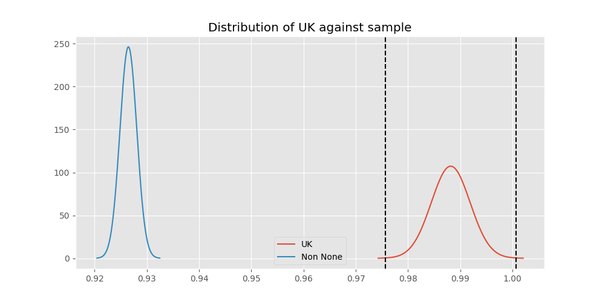
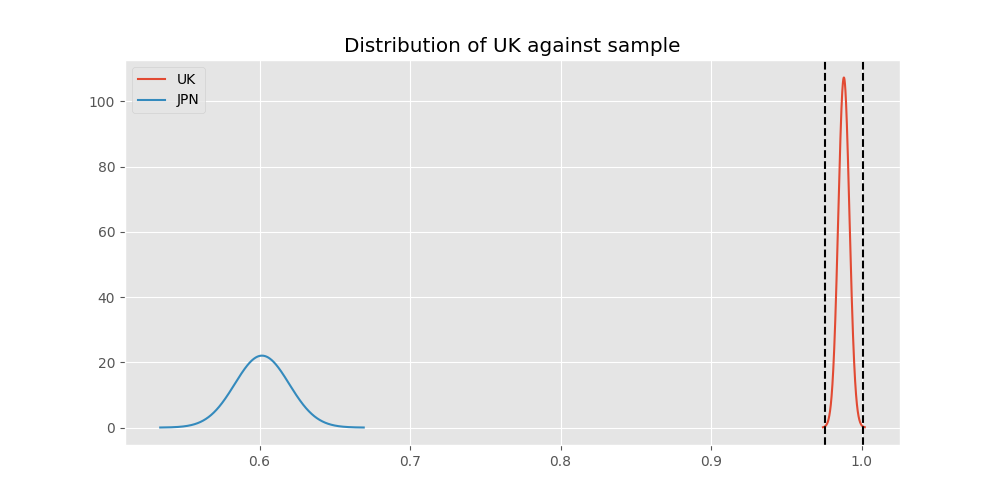

# Testing Results For UK 
$H_{0}$: There is not a difference in collection success against UK 
$H_{A}$: There is a difference in collection success against UK
An $\alpha$ of 0.0008064516129032258 was used 
Out of 25 tests, there were 11 rejections from 25 independent-t test.
Out of 25 tests, there were 11 rejections from 25 Man Whitney u-tests.
## Testing Results for UK against IND 
UK has a success rate of 0.9881796690307328
IND has a success rate of 0.9704433497536946
$H_{0}$: There is not a difference between UK and IND
$H_{A}$: There is a difference between UK and IND
An $/alpha$ of 0.0008064516129032258 was used in this test.
__independent t-testing__: With a t-statistic of 2.2385747660975093 and a p-value of 0.025359045989603212, _we failed to reject the null hypothssis_
__Man-Whitney testing__: With a u-statistic of 174784.0 and a p-value of 0.025441806828201997, _we failed to reject the null hypothssis_
 
## Testing Results for UK against GUAT 
UK has a success rate of 0.9881796690307328
GUAT has a success rate of 0.9705882352941176
$H_{0}$: There is not a difference between UK and GUAT
$H_{A}$: There is a difference between UK and GUAT
An $/alpha$ of 0.0008064516129032258 was used in this test.
__independent t-testing__: With a t-statistic of 1.2257498367494246 and a p-value of 0.22060925479118543, _we failed to reject the null hypothssis_
__Man-Whitney testing__: With a u-statistic of 29270.0 and a p-value of 0.22087610930682178, _we failed to reject the null hypothssis_
 
## Testing Results for UK against IT 
UK has a success rate of 0.9881796690307328
IT has a success rate of 0.9217391304347826
$H_{0}$: There is not a difference between UK and IT
$H_{A}$: There is a difference between UK and IT
An $/alpha$ of 0.0008064516129032258 was used in this test.
__independent t-testing__: With a t-statistic of 6.708953162011982 and a p-value of 2.6323530966595958e-11, _we **reject** the null hypothssis_
__Man-Whitney testing__: With a u-statistic of 415016.0 and a p-value of 3.432417769601214e-11, _we **reject** the null hypothssis_
 
## Testing Results for UK against EST 
UK has a success rate of 0.9881796690307328
EST has a success rate of 0.975
$H_{0}$: There is not a difference between UK and EST
$H_{A}$: There is a difference between UK and EST
An $/alpha$ of 0.0008064516129032258 was used in this test.
__independent t-testing__: With a t-statistic of 0.7349843648625919 and a p-value of 0.46254394846209135, _we failed to reject the null hypothssis_
__Man-Whitney testing__: With a u-statistic of 17143.0 and a p-value of 0.4632370705871547, _we failed to reject the null hypothssis_
 
## Testing Results for UK against SKOR 
UK has a success rate of 0.9881796690307328
SKOR has a success rate of 0.9166666666666666
$H_{0}$: There is not a difference between UK and SKOR
$H_{A}$: There is a difference between UK and SKOR
An $/alpha$ of 0.0008064516129032258 was used in this test.
__independent t-testing__: With a t-statistic of 4.231601513950719 and a p-value of 2.5570316871249384e-05, _we **reject** the null hypothssis_
__Man-Whitney testing__: With a u-statistic of 27195.0 and a p-value of 2.7715746934420966e-05, _we **reject** the null hypothssis_
 
## Testing Results for UK against RP 
UK has a success rate of 0.9881796690307328
RP has a success rate of 0.6735187424425635
$H_{0}$: There is not a difference between UK and RP
$H_{A}$: There is a difference between UK and RP
An $/alpha$ of 0.0008064516129032258 was used in this test.
__independent t-testing__: With a t-statistic of 18.996512095493046 and a p-value of 5.1844490970034825e-73, _we **reject** the null hypothssis_
__Man-Whitney testing__: With a u-statistic of 459896.0 and a p-value of 1.5208017248258414e-66, _we **reject** the null hypothssis_
 
## Testing Results for UK against JPN 
UK has a success rate of 0.9881796690307328
JPN has a success rate of 0.6016371077762619
$H_{0}$: There is not a difference between UK and JPN
$H_{A}$: There is a difference between UK and JPN
An $/alpha$ of 0.0008064516129032258 was used in this test.
__independent t-testing__: With a t-statistic of 22.331468607858127 and a p-value of 3.301246824906428e-96, _we **reject** the null hypothssis_
__Man-Whitney testing__: With a u-statistic of 429910.0 and a p-value of 1.936272798403053e-84, _we **reject** the null hypothssis_
 
## Testing Results for UK against US 
UK has a success rate of 0.9881796690307328
US has a success rate of 0.918885774351787
$H_{0}$: There is not a difference between UK and US
$H_{A}$: There is a difference between UK and US
An $/alpha$ of 0.0008064516129032258 was used in this test.
__independent t-testing__: With a t-statistic of 7.297071519648154 and a p-value of 3.2882620252293177e-13, _we **reject** the null hypothssis_
__Man-Whitney testing__: With a u-statistic of 2581793.0 and a p-value of 3.6449058609983034e-13, _we **reject** the null hypothssis_
 
## Testing Results for UK against KAZ 
UK has a success rate of 0.9881796690307328
KAZ has a success rate of 0.989010989010989
$H_{0}$: There is not a difference between UK and KAZ
$H_{A}$: There is a difference between UK and KAZ
An $/alpha$ of 0.0008064516129032258 was used in this test.
__independent t-testing__: With a t-statistic of -0.0946296410544959 and a p-value of 0.9246274824178002, _we failed to reject the null hypothssis_
__Man-Whitney testing__: With a u-statistic of 76922.0 and a p-value of 0.9251602494493244, _we failed to reject the null hypothssis_
 
## Testing Results for UK against ROC 
UK has a success rate of 0.9881796690307328
ROC has a success rate of 0.17751479289940827
$H_{0}$: There is not a difference between UK and ROC
$H_{A}$: There is a difference between UK and ROC
An $/alpha$ of 0.0008064516129032258 was used in this test.
__independent t-testing__: With a t-statistic of 52.09279283505273 and a p-value of 8.620362663283716e-289, _we **reject** the null hypothssis_
__Man-Whitney testing__: With a u-statistic of 129439.0 and a p-value of 1.365060057872485e-162, _we **reject** the null hypothssis_
 
## Testing Results for UK against THAI 
UK has a success rate of 0.9881796690307328
THAI has a success rate of 0.9880952380952381
$H_{0}$: There is not a difference between UK and THAI
$H_{A}$: There is a difference between UK and THAI
An $/alpha$ of 0.0008064516129032258 was used in this test.
__independent t-testing__: With a t-statistic of 0.009234368781174807 and a p-value of 0.9926339644355466, _we failed to reject the null hypothssis_
__Man-Whitney testing__: With a u-statistic of 71070.0 and a p-value of 0.9932427813569753, _we failed to reject the null hypothssis_
 
## Testing Results for UK against FR 
UK has a success rate of 0.9881796690307328
FR has a success rate of 0.908183632734531
$H_{0}$: There is not a difference between UK and FR
$H_{A}$: There is a difference between UK and FR
An $/alpha$ of 0.0008064516129032258 was used in this test.
__independent t-testing__: With a t-statistic of 7.240691410278218 and a p-value of 7.485835865438234e-13, _we **reject** the null hypothssis_
__Man-Whitney testing__: With a u-statistic of 228876.0 and a p-value of 1.1945587976971466e-12, _we **reject** the null hypothssis_
 
## Testing Results for UK against TURK 
UK has a success rate of 0.9881796690307328
TURK has a success rate of 0.9962264150943396
$H_{0}$: There is not a difference between UK and TURK
$H_{A}$: There is a difference between UK and TURK
An $/alpha$ of 0.0008064516129032258 was used in this test.
__independent t-testing__: With a t-statistic of -1.1541497713054822 and a p-value of 0.24868742334104654, _we failed to reject the null hypothssis_
__Man-Whitney testing__: With a u-statistic of 111193.0 and a p-value of 0.24877188447992826, _we failed to reject the null hypothssis_
 
## Testing Results for UK against PRC 
UK has a success rate of 0.9881796690307328
PRC has a success rate of 0.988759187202767
$H_{0}$: There is not a difference between UK and PRC
$H_{A}$: There is a difference between UK and PRC
An $/alpha$ of 0.0008064516129032258 was used in this test.
__independent t-testing__: With a t-statistic of -0.13584428566312748 and a p-value of 0.8919530415494294, _we failed to reject the null hypothssis_
__Man-Whitney testing__: With a u-statistic of 977832.0 and a p-value of 0.8920224049560895, _we failed to reject the null hypothssis_
 
## Testing Results for UK against BEL 
UK has a success rate of 0.9881796690307328
BEL has a success rate of 0.8883495145631068
$H_{0}$: There is not a difference between UK and BEL
$H_{A}$: There is a difference between UK and BEL
An $/alpha$ of 0.0008064516129032258 was used in this test.
__independent t-testing__: With a t-statistic of 7.562177544093487 and a p-value of 8.627717683165144e-14, _we **reject** the null hypothssis_
__Man-Whitney testing__: With a u-statistic of 95837.0 and a p-value of 1.7401844076271341e-13, _we **reject** the null hypothssis_
 
## Testing Results for UK against POL 
UK has a success rate of 0.9881796690307328
POL has a success rate of 0.979381443298969
$H_{0}$: There is not a difference between UK and POL
$H_{A}$: There is a difference between UK and POL
An $/alpha$ of 0.0008064516129032258 was used in this test.
__independent t-testing__: With a t-statistic of 1.2695812463960625 and a p-value of 0.2044560968660586, _we failed to reject the null hypothssis_
__Man-Whitney testing__: With a u-statistic of 206960.0 and a p-value of 0.20446327691169697, _we failed to reject the null hypothssis_
 
## Testing Results for UK against LTU 
UK has a success rate of 0.9881796690307328
LTU has a success rate of 0.984375
$H_{0}$: There is not a difference between UK and LTU
$H_{A}$: There is a difference between UK and LTU
An $/alpha$ of 0.0008064516129032258 was used in this test.
__independent t-testing__: With a t-statistic of 0.5140667879212862 and a p-value of 0.6073028723882501, _we failed to reject the null hypothssis_
__Man-Whitney testing__: With a u-statistic of 135875.0 and a p-value of 0.6074408176335387, _we failed to reject the null hypothssis_
 
## Testing Results for UK against SVN 
UK has a success rate of 0.9881796690307328
SVN has a success rate of 0.9770114942528736
$H_{0}$: There is not a difference between UK and SVN
$H_{A}$: There is a difference between UK and SVN
An $/alpha$ of 0.0008064516129032258 was used in this test.
__independent t-testing__: With a t-statistic of 0.8797552320635138 and a p-value of 0.3792189429854683, _we failed to reject the null hypothssis_
__Man-Whitney testing__: With a u-statistic of 37212.0 and a p-value of 0.3795143141994185, _we failed to reject the null hypothssis_
 
## Testing Results for UK against AUS 
UK has a success rate of 0.9881796690307328
AUS has a success rate of 0.7289377289377289
$H_{0}$: There is not a difference between UK and AUS
$H_{A}$: There is a difference between UK and AUS
An $/alpha$ of 0.0008064516129032258 was used in this test.
__independent t-testing__: With a t-statistic of 15.580954606594709 and a p-value of 1.117157302046791e-49, _we **reject** the null hypothssis_
__Man-Whitney testing__: With a u-statistic of 145416.0 and a p-value of 2.558927972542402e-45, _we **reject** the null hypothssis_
 
## Testing Results for UK against UKR 
UK has a success rate of 0.9881796690307328
UKR has a success rate of 0.981549815498155
$H_{0}$: There is not a difference between UK and UKR
$H_{A}$: There is a difference between UK and UKR
An $/alpha$ of 0.0008064516129032258 was used in this test.
__independent t-testing__: With a t-statistic of 0.8247212602857308 and a p-value of 0.40970625287575424, _we failed to reject the null hypothssis_
__Man-Whitney testing__: With a u-statistic of 115393.0 and a p-value of 0.40977093258472896, _we failed to reject the null hypothssis_
 
## Testing Results for UK against CIS 
UK has a success rate of 0.9881796690307328
CIS has a success rate of 0.837386018237082
$H_{0}$: There is not a difference between UK and CIS
$H_{A}$: There is a difference between UK and CIS
An $/alpha$ of 0.0008064516129032258 was used in this test.
__independent t-testing__: With a t-statistic of 11.272487406461318 and a p-value of 2.3807289720366335e-28, _we **reject** the null hypothssis_
__Man-Whitney testing__: With a u-statistic of 320305.0 and a p-value of 2.5529063773245578e-27, _we **reject** the null hypothssis_
 
## Testing Results for UK against SAFR 
UK has a success rate of 0.9881796690307328
SAFR has a success rate of 0.9328358208955224
$H_{0}$: There is not a difference between UK and SAFR
$H_{A}$: There is a difference between UK and SAFR
An $/alpha$ of 0.0008064516129032258 was used in this test.
__independent t-testing__: With a t-statistic of 4.354186995583669 and a p-value of 1.4762808158341445e-05, _we **reject** the null hypothssis_
__Man-Whitney testing__: With a u-statistic of 59819.0 and a p-value of 1.6025187421930382e-05, _we **reject** the null hypothssis_
 
## Testing Results for UK against TBD 
UK has a success rate of 0.9881796690307328
TBD has a success rate of 0.9898734177215189
$H_{0}$: There is not a difference between UK and TBD
$H_{A}$: There is a difference between UK and TBD
An $/alpha$ of 0.0008064516129032258 was used in this test.
__independent t-testing__: With a t-statistic of -0.26296271475284816 and a p-value of 0.7926230372396598, _we failed to reject the null hypothssis_
__Man-Whitney testing__: With a u-statistic of 166802.0 and a p-value of 0.7928614448819042, _we failed to reject the null hypothssis_
 
## Testing Results for UK against ESA 
UK has a success rate of 0.9881796690307328
ESA has a success rate of 0.9811320754716981
$H_{0}$: There is not a difference between UK and ESA
$H_{A}$: There is a difference between UK and ESA
An $/alpha$ of 0.0008064516129032258 was used in this test.
__independent t-testing__: With a t-statistic of 0.6125929264820924 and a p-value of 0.5402921414277835, _we failed to reject the null hypothssis_
__Man-Whitney testing__: With a u-statistic of 45154.0 and a p-value of 0.5406537944804224, _we failed to reject the null hypothssis_
 
## Testing Results for UK against GER 
UK has a success rate of 0.9881796690307328
GER has a success rate of 0.9766233766233766
$H_{0}$: There is not a difference between UK and GER
$H_{A}$: There is a difference between UK and GER
An $/alpha$ of 0.0008064516129032258 was used in this test.
__independent t-testing__: With a t-statistic of 2.0408796026662377 and a p-value of 0.041345884416928526, _we failed to reject the null hypothssis_
__Man-Whitney testing__: With a u-statistic of 988422.0 and a p-value of 0.04137360647234414, _we failed to reject the null hypothssis_
 
