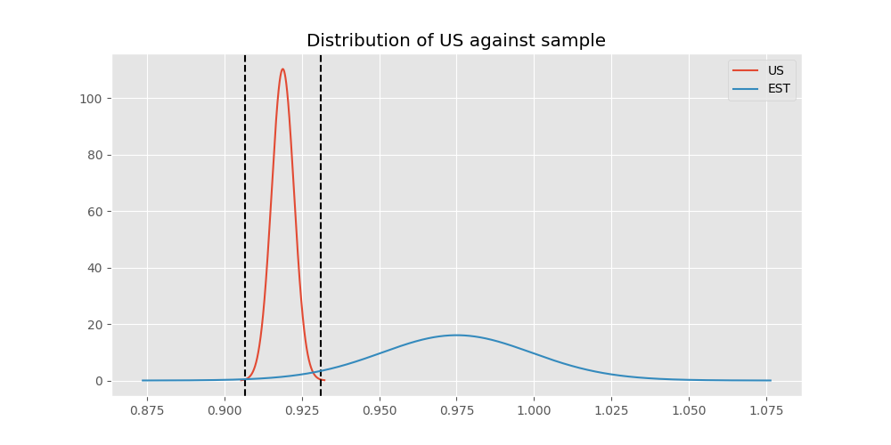
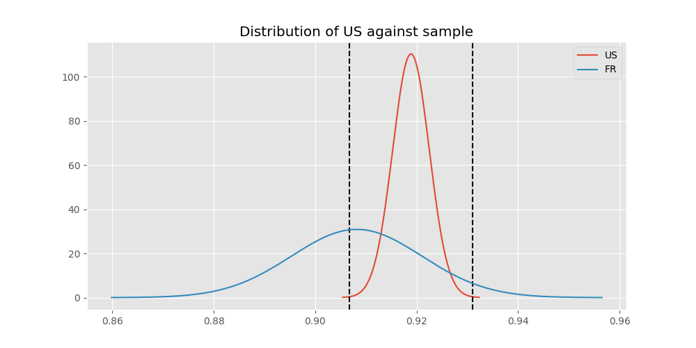

# Testing Results For US 
$H_{0}$: There is not a difference in collection success against US 
$H_{A}$: There is a difference in collection success against US
An $\alpha$ of 0.0008064516129032258 was used 
Out of 25 tests, there were 17 rejections from 25 independent-t test.
Out of 25 tests, there were 15 rejections from 25 Man Whitney u-tests.
## Testing Results for US against IND 
US has a success rate of 0.918885774351787
IND has a success rate of 0.9704433497536946
$H_{0}$: There is not a difference between US and IND
$H_{A}$: There is a difference between US and IND
An $/alpha$ of 0.0008064516129032258 was used in this test.
__independent t-testing__: With a t-statistic of -3.753542056211576 and a p-value of 0.000175970430155051, _we **reject** the null hypothssis_
__Man-Whitney testing__: With a u-statistic of 1098983.0 and a p-value of 0.0001771884872431819, _we **reject** the null hypothssis_
 
## Testing Results for US against GUAT 
US has a success rate of 0.918885774351787
GUAT has a success rate of 0.9705882352941176
$H_{0}$: There is not a difference between US and GUAT
$H_{A}$: There is a difference between US and GUAT
An $/alpha$ of 0.0008064516129032258 was used in this test.
__independent t-testing__: With a t-statistic of -1.5578393374420147 and a p-value of 0.1193261438090073, _we failed to reject the null hypothssis_
__Man-Whitney testing__: With a u-statistic of 184038.0 and a p-value of 0.11933538036340385, _we failed to reject the null hypothssis_
 
## Testing Results for US against IT 
US has a success rate of 0.918885774351787
IT has a success rate of 0.9217391304347826
$H_{0}$: There is not a difference between US and IT
$H_{A}$: There is a difference between US and IT
An $/alpha$ of 0.0008064516129032258 was used in this test.
__independent t-testing__: With a t-statistic of -0.29480032113522425 and a p-value of 0.7681556567758342, _we failed to reject the null hypothssis_
__Man-Whitney testing__: With a u-statistic of 2618188.0 and a p-value of 0.7681459354184519, _we failed to reject the null hypothssis_
 
## Testing Results for US against EST 
US has a success rate of 0.918885774351787
EST has a success rate of 0.975
$H_{0}$: There is not a difference between US and EST
$H_{A}$: There is a difference between US and EST
An $/alpha$ of 0.0008064516129032258 was used in this test.
__independent t-testing__: With a t-statistic of -1.2982282391861661 and a p-value of 0.19426102148931226, _we failed to reject the null hypothssis_
__Man-Whitney testing__: With a u-statistic of 107754.0 and a p-value of 0.19427032291701984, _we failed to reject the null hypothssis_
 
## Testing Results for US against SKOR 
US has a success rate of 0.918885774351787
SKOR has a success rate of 0.9166666666666666
$H_{0}$: There is not a difference between US and SKOR
$H_{A}$: There is a difference between US and SKOR
An $/alpha$ of 0.0008064516129032258 was used in this test.
__independent t-testing__: With a t-statistic of 0.06261416454472508 and a p-value of 0.9500759201592746, _we failed to reject the null hypothssis_
__Man-Whitney testing__: With a u-statistic of 171620.0 and a p-value of 0.9501350557477768, _we failed to reject the null hypothssis_
 
## Testing Results for US against RP 
US has a success rate of 0.918885774351787
RP has a success rate of 0.6735187424425635
$H_{0}$: There is not a difference between US and RP
$H_{A}$: There is a difference between US and RP
An $/alpha$ of 0.0008064516129032258 was used in this test.
__independent t-testing__: With a t-statistic of 21.629422409555847 and a p-value of 2.918355451632686e-100, _we **reject** the null hypothssis_
__Man-Whitney testing__: With a u-statistic of 2939387.5 and a p-value of 5.845207027183763e-97, _we **reject** the null hypothssis_
 
## Testing Results for US against JPN 
US has a success rate of 0.918885774351787
JPN has a success rate of 0.6016371077762619
$H_{0}$: There is not a difference between US and JPN
$H_{A}$: There is a difference between US and JPN
An $/alpha$ of 0.0008064516129032258 was used in this test.
__independent t-testing__: With a t-statistic of 26.463359262059626 and a p-value of 1.3991189856098773e-146, _we **reject** the null hypothssis_
__Man-Whitney testing__: With a u-statistic of 2755660.5 and a p-value of 2.120957264162862e-139, _we **reject** the null hypothssis_
 
## Testing Results for US against KAZ 
US has a success rate of 0.918885774351787
KAZ has a success rate of 0.989010989010989
$H_{0}$: There is not a difference between US and KAZ
$H_{A}$: There is a difference between US and KAZ
An $/alpha$ of 0.0008064516129032258 was used in this test.
__independent t-testing__: With a t-statistic of -8.201593236140026 and a p-value of 9.964456326721224e-15, _we **reject** the null hypothssis_
__Man-Whitney testing__: With a u-statistic of 483003.0 and a p-value of 0.0005536741895619362, _we **reject** the null hypothssis_
 
## Testing Results for US against ROC 
US has a success rate of 0.918885774351787
ROC has a success rate of 0.17751479289940827
$H_{0}$: There is not a difference between US and ROC
$H_{A}$: There is a difference between US and ROC
An $/alpha$ of 0.0008064516129032258 was used in this test.
__independent t-testing__: With a t-statistic of 34.31495978625418 and a p-value of 2.267460467395017e-235, _we **reject** the null hypothssis_
__Man-Whitney testing__: With a u-statistic of 839908.5 and a p-value of 2.3297400550195373e-215, _we **reject** the null hypothssis_
 
## Testing Results for US against THAI 
US has a success rate of 0.918885774351787
THAI has a success rate of 0.9880952380952381
$H_{0}$: There is not a difference between US and THAI
$H_{A}$: There is a difference between US and THAI
An $/alpha$ of 0.0008064516129032258 was used in this test.
__independent t-testing__: With a t-statistic of -7.574056386878496 and a p-value of 8.302593163445306e-13, _we **reject** the null hypothssis_
__Man-Whitney testing__: With a u-statistic of 446288.0 and a p-value of 0.0010571006895404417, _we failed to reject the null hypothssis_
 
## Testing Results for US against FR 
US has a success rate of 0.918885774351787
FR has a success rate of 0.908183632734531
$H_{0}$: There is not a difference between US and FR
$H_{A}$: There is a difference between US and FR
An $/alpha$ of 0.0008064516129032258 was used in this test.
__independent t-testing__: With a t-statistic of 0.837144847086286 and a p-value of 0.4025433844739372, _we failed to reject the null hypothssis_
__Man-Whitney testing__: With a u-statistic of 1445156.5 and a p-value of 0.4025151901048737, _we failed to reject the null hypothssis_
 
## Testing Results for US against TURK 
US has a success rate of 0.918885774351787
TURK has a success rate of 0.9962264150943396
$H_{0}$: There is not a difference between US and TURK
$H_{A}$: There is a difference between US and TURK
An $/alpha$ of 0.0008064516129032258 was used in this test.
__independent t-testing__: With a t-statistic of -14.802160197447677 and a p-value of 1.0834216362389272e-44, _we **reject** the null hypothssis_
__Man-Whitney testing__: With a u-statistic of 697816.5 and a p-value of 4.273353344147236e-06, _we **reject** the null hypothssis_
 
## Testing Results for US against PRC 
US has a success rate of 0.918885774351787
PRC has a success rate of 0.988759187202767
$H_{0}$: There is not a difference between US and PRC
$H_{A}$: There is a difference between US and PRC
An $/alpha$ of 0.0008064516129032258 was used in this test.
__independent t-testing__: With a t-statistic of -16.530266571400155 and a p-value of 2.2091725737338433e-60, _we **reject** the null hypothssis_
__Man-Whitney testing__: With a u-statistic of 6140046.5 and a p-value of 2.222726796040256e-32, _we **reject** the null hypothssis_
 
## Testing Results for US against BEL 
US has a success rate of 0.918885774351787
BEL has a success rate of 0.8883495145631068
$H_{0}$: There is not a difference between US and BEL
$H_{A}$: There is a difference between US and BEL
An $/alpha$ of 0.0008064516129032258 was used in this test.
__independent t-testing__: With a t-statistic of 1.5678729388720556 and a p-value of 0.11696430653831784, _we failed to reject the null hypothssis_
__Man-Whitney testing__: With a u-statistic of 605877.0 and a p-value of 0.1169661091287232, _we failed to reject the null hypothssis_
 
## Testing Results for US against POL 
US has a success rate of 0.918885774351787
POL has a success rate of 0.979381443298969
$H_{0}$: There is not a difference between US and POL
$H_{A}$: There is a difference between US and POL
An $/alpha$ of 0.0008064516129032258 was used in this test.
__independent t-testing__: With a t-statistic of -4.823959243564522 and a p-value of 1.4410550003952735e-06, _we **reject** the null hypothssis_
__Man-Whitney testing__: With a u-statistic of 1300452.5 and a p-value of 1.469945675309742e-06, _we **reject** the null hypothssis_
 
## Testing Results for US against LTU 
US has a success rate of 0.918885774351787
LTU has a success rate of 0.984375
$H_{0}$: There is not a difference between US and LTU
$H_{A}$: There is a difference between US and LTU
An $/alpha$ of 0.0008064516129032258 was used in this test.
__independent t-testing__: With a t-statistic of -8.366124967554468 and a p-value of 5.668098069620976e-16, _we **reject** the null hypothssis_
__Man-Whitney testing__: With a u-statistic of 853470.0 and a p-value of 2.047512712580144e-05, _we **reject** the null hypothssis_
 
## Testing Results for US against SVN 
US has a success rate of 0.918885774351787
SVN has a success rate of 0.9770114942528736
$H_{0}$: There is not a difference between US and SVN
$H_{A}$: There is a difference between US and SVN
An $/alpha$ of 0.0008064516129032258 was used in this test.
__independent t-testing__: With a t-statistic of -1.9809735883014885 and a p-value of 0.0476414513054468, _we failed to reject the null hypothssis_
__Man-Whitney testing__: With a u-statistic of 233865.5 and a p-value of 0.04765800905633906, _we failed to reject the null hypothssis_
 
## Testing Results for US against AUS 
US has a success rate of 0.918885774351787
AUS has a success rate of 0.7289377289377289
$H_{0}$: There is not a difference between US and AUS
$H_{A}$: There is a difference between US and AUS
An $/alpha$ of 0.0008064516129032258 was used in this test.
__independent t-testing__: With a t-statistic of 10.827870695513202 and a p-value of 4.522921328799471e-27, _we **reject** the null hypothssis_
__Man-Whitney testing__: With a u-statistic of 927138.5 and a p-value of 7.844276112248708e-27, _we **reject** the null hypothssis_
 
## Testing Results for US against UKR 
US has a success rate of 0.918885774351787
UKR has a success rate of 0.981549815498155
$H_{0}$: There is not a difference between US and UKR
$H_{A}$: There is a difference between US and UKR
An $/alpha$ of 0.0008064516129032258 was used in this test.
__independent t-testing__: With a t-statistic of -7.000215852848351 and a p-value of 1.1441058981813995e-11, _we **reject** the null hypothssis_
__Man-Whitney testing__: With a u-statistic of 724967.5 and a p-value of 0.00017532343361166078, _we **reject** the null hypothssis_
 
## Testing Results for US against CIS 
US has a success rate of 0.918885774351787
CIS has a success rate of 0.837386018237082
$H_{0}$: There is not a difference between US and CIS
$H_{A}$: There is a difference between US and CIS
An $/alpha$ of 0.0008064516129032258 was used in this test.
__independent t-testing__: With a t-statistic of 6.958580638752264 and a p-value of 3.781232414585669e-12, _we **reject** the null hypothssis_
__Man-Whitney testing__: With a u-statistic of 2030983.0 and a p-value of 4.126502381031949e-12, _we **reject** the null hypothssis_
 
## Testing Results for US against SAFR 
US has a success rate of 0.918885774351787
SAFR has a success rate of 0.9328358208955224
$H_{0}$: There is not a difference between US and SAFR
$H_{A}$: There is a difference between US and SAFR
An $/alpha$ of 0.0008064516129032258 was used in this test.
__independent t-testing__: With a t-statistic of -0.5856404582399014 and a p-value of 0.5581397838262816, _we failed to reject the null hypothssis_
__Man-Whitney testing__: With a u-statistic of 377101.0 and a p-value of 0.5581319072609857, _we failed to reject the null hypothssis_
 
## Testing Results for US against TBD 
US has a success rate of 0.918885774351787
TBD has a success rate of 0.9898734177215189
$H_{0}$: There is not a difference between US and TBD
$H_{A}$: There is a difference between US and TBD
An $/alpha$ of 0.0008064516129032258 was used in this test.
__independent t-testing__: With a t-statistic of -11.440406714174753 and a p-value of 2.2999866465886004e-28, _we **reject** the null hypothssis_
__Man-Whitney testing__: With a u-statistic of 1047303.5 and a p-value of 2.862100368883188e-07, _we **reject** the null hypothssis_
 
## Testing Results for US against ESA 
US has a success rate of 0.918885774351787
ESA has a success rate of 0.9811320754716981
$H_{0}$: There is not a difference between US and ESA
$H_{A}$: There is a difference between US and ESA
An $/alpha$ of 0.0008064516129032258 was used in this test.
__independent t-testing__: With a t-statistic of -4.523395025888905 and a p-value of 1.4298649676887455e-05, _we **reject** the null hypothssis_
__Man-Whitney testing__: With a u-statistic of 283693.0 and a p-value of 0.019250803829315297, _we failed to reject the null hypothssis_
 
## Testing Results for US against UK 
US has a success rate of 0.918885774351787
UK has a success rate of 0.9881796690307328
$H_{0}$: There is not a difference between US and UK
$H_{A}$: There is a difference between US and UK
An $/alpha$ of 0.0008064516129032258 was used in this test.
__independent t-testing__: With a t-statistic of -13.36449653128927 and a p-value of 1.512932893688018e-39, _we **reject** the null hypothssis_
__Man-Whitney testing__: With a u-statistic of 2247175.0 and a p-value of 3.6449058609983034e-13, _we **reject** the null hypothssis_
 
## Testing Results for US against GER 
US has a success rate of 0.918885774351787
GER has a success rate of 0.9766233766233766
$H_{0}$: There is not a difference between US and GER
$H_{A}$: There is a difference between US and GER
An $/alpha$ of 0.0008064516129032258 was used in this test.
__independent t-testing__: With a t-statistic of -9.58641078094583 and a p-value of 1.1912251403037153e-21, _we **reject** the null hypothssis_
__Man-Whitney testing__: With a u-statistic of 6212091.0 and a p-value of 1.5352669604841573e-21, _we **reject** the null hypothssis_
 
